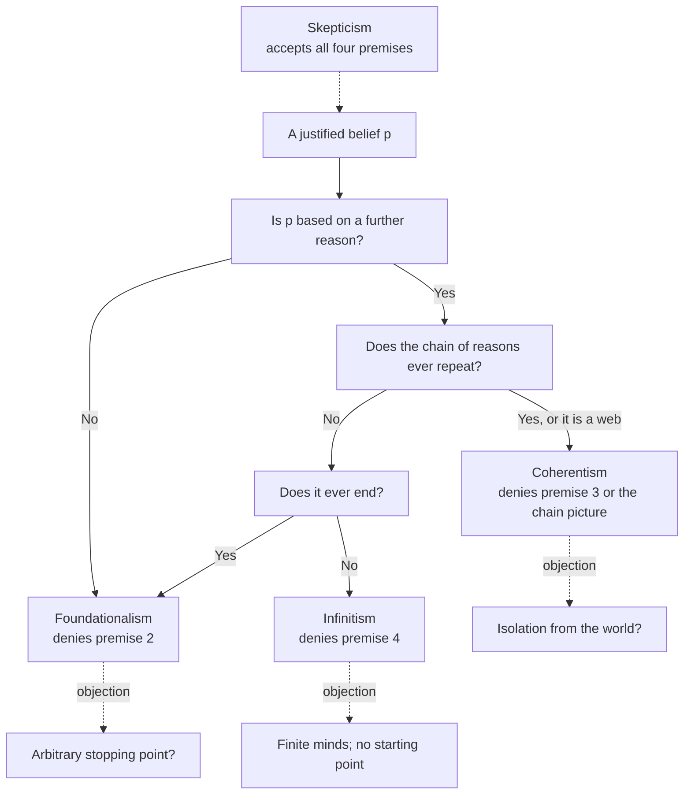

# Epistemology · Lesson 2.1: The regress problem

> ⏱ ~15 min · Module 2: The structure of justification · Builds on: [1.4 Internalism and externalism](01-04-internalism-and-externalism.md), [ancient-medieval-philosophy 4.3 The skeptics](../../ancient-medieval-philosophy/lessons/04-03-the-skeptics.md) · Unlocks: [2.2 Foundationalism](02-02-foundationalism.md), [2.3 Coherentism](02-03-coherentism.md)

## Why this matters

Module 1 asked what knowledge is. Module 2 asks how justification is *built*. Most of what you believe you believe because of something else you believe, and those beliefs rest on others in turn. Follow any belief back through its reasons and one of three things happens: the chain stops, it loops, or it never ends. Each option looks fatal, and an argument from that observation concludes that nothing is justified at all. Foundationalism, coherentism and infinitism are the three ways out, and each is defined by which premise of that argument it denies. This lesson states the argument precisely and develops the least familiar exit, infinitism. Lessons [2.2](02-02-foundationalism.md) and [2.3](02-03-coherentism.md) take the other two.

## The idea

You believe the bridge on your commute is closed tonight. Why? A city notice said so. Why trust the notice? It was on the city's official site. Why think that site is the city's? The address matches the one on your water bill. Why trust that? And so on.

Each answer is a **reason**: a belief that supports the one above it. A belief justified this way is **inferentially justified**: it is justified because it is based on other beliefs, and only if those beliefs are themselves justified. Unjustified reasons cannot pass on what they lack. A guess that the site is official, however lucky, gives the notice no support.

So the chain of reasons has three possible shapes:

- **It stops** at a belief held for no further reason. Then that belief looks arbitrary, and so does everything resting on it.
- **It loops** back to a belief already in the chain. Then the belief ends up supporting itself, which looks like no support at all.
- **It goes on forever.** Then no reason in the chain is ever secured, and no finite mind could hold the whole chain anyway.

That is [Agrippa's trilemma](../reference.md#agrippas-trilemma). You met it as history in [ancient-medieval-philosophy 4.3](../../ancient-medieval-philosophy/lessons/04-03-the-skeptics.md): Sextus Empiricus's five Agrippan modes, three of which (hypothesis, reciprocity, infinite regress) are the three horns, with the trilemma's name a modern coinage. Aristotle had already confronted the regress for demonstration (*Posterior Analytics* I.3, in [ancient-medieval-philosophy 3.1](../../ancient-medieval-philosophy/lessons/03-01-predication-categories-and-the-syllogism.md)) and answered that proof must bottom out in first principles grasped without proof. The live question here is which horn to accept and how.

One distinction from [1.4](01-04-internalism-and-externalism.md) runs through the lesson: [propositional versus doxastic justification](../reference.md#propositional-and-doxastic-justification). *Having* good reasons for $p$ is one thing; *believing* $p$ on the basis of them is another. The regress looks different depending on which one you track.

## The argument

Write $S$ for a subject and $p$ for any proposition $S$ believes. The [regress argument](../reference.md#regress-argument):

1. **Inferential justification.** If $S$ is justified in believing $p$ on the basis of a reason $r$, then $S$ is justified in believing $r$. *In words:* a reason passes on only the justification it has.
2. **No basic beliefs.** Every justified belief is justified on the basis of some other belief. *In words:* nothing is justified just by itself, or by experience alone.
3. **No circles.** No belief is among its own reasons, however far back you trace. *In words:* justification cannot loop.
4. **No infinite chains.** No belief is justified by an infinite chain of reasons. *In words:* a regress that never ends never delivers justification.
5. **So no belief is justified.**

*Why it is valid:* suppose $S$ justifiedly believes $p_0$. By 2 there is a reason $p_1$; by 1, $p_1$ is justified; by 2 again there is $p_2$, and so on. By 3 no $p_n$ repeats, so the $p_n$ form an infinite non-repeating chain, which 4 forbids. Contradiction.

Premise 1 is the [principle of inferential justification](../reference.md#inferential-justification) in its weak form. A common stronger version adds a second clause: $S$ must also be justified in believing that $r$ makes $p$ probable. That stronger clause starts a second regress at every link, and many foundationalists and externalists reject it.

Each non-skeptical position is defined by the premise it gives up:

| Position | Denies | Agrippan horn it embraces | Its burden |
|---|---|---|---|
| **Foundationalism** | 2 | Hypothesis: the chain stops | Show that the stopping points are not arbitrary ([2.2](02-02-foundationalism.md)) |
| **Coherentism** | 3, or rather the picture of justification as a chain at all | Reciprocity: mutual support | Show that a system's fit with itself connects it to the world ([2.3](02-03-coherentism.md)) |
| **Infinitism** | 4 | Infinite regress | Show that finite minds can be served by infinite chains |
| **Skepticism** | none | All three, as failures | Live with the conclusion |

Two refinements keep the table honest. The careful coherentist does not say that $p$ supports $q$ and $q$ supports $p$. Laurence BonJour's holism (*The Structure of Empirical Knowledge*, 1985) says a belief is justified by its membership in a coherent *system*, so justification is not transmitted along a line at all. And positions mix: a foundationalist may let coherence add support above the foundations.

**Infinitism.** Peter Klein ("Human Knowledge and the Infinite Regress of Reasons", *Philosophical Perspectives* 13, 1999) defends the neglected horn. Paraphrasing his two principles:

- **Avoid circularity.** No belief may appear in the evidential ancestry of its own reasons, which is premise 3.
- **Avoid arbitrariness.** If $S$ has a justification for $x$, there is a reason $r_1$ *available* to $S$ for $x$, a reason $r_2$ available for $r_1$, and so on without end.

Together they entail that every justified belief has an infinite, non-repeating chain of available reasons behind it. [Infinitism](../reference.md#infinitism) is the claim that this is no defect: it is what justification is.

The key word is *available*. A reason is available to $S$ when it is objectively a good reason and $S$ could call on it if asked. Nothing requires $S$ to have thought it.

The **[finite minds objection](../reference.md#finite-minds-objection)**: we cannot hold infinitely many beliefs, still less run through infinitely many inferences. Aristotle had already observed that a finite mind cannot traverse an infinite series, and the objection was pressed against modern infinitism by John Williams. Klein's reply runs on the propositional/doxastic split:

- **Propositional justification** is fully present if an endless path of available reasons *exists*. No traversal is needed.
- **Doxastic justification** comes in degrees. It grows as $S$ actually supplies reasons along the path and is never complete. Knowledge needs "enough" reasons, and how many is enough is set by context: by which questions have actually been raised and understood.

In words: infinitism makes justification unending, not impossible.

**Where the argument is weakest.** The regress argument's critics split on premise 2 (foundationalists) and premise 4 (infinitists); coherentists dispute the linear picture behind premises 1 and 3. Against infinitism itself, the sharpest objection is the **no-starting-point objection**, which Klein traces to the Pyrrhonists: if no reason in the chain has justification except from a reason further back, where does justification come from in the first place? An infinite chain of borrowed money pays no debts. Klein's reply is that offering a reason *generates* a new kind of warrant rather than passing on an old one, so nothing needs to be borrowed. The foundationalist replies that this concedes the point: something about the reasons themselves must make them good, and that something is not another reason.

## The case grid

Each solid path is one shape a chain of reasons can take; each dashed edge is the standard objection the position must answer.

## Worked examples

**Example 1 (clean): the bridge.** Run the commuter's chain through each view.

- *Foundationalist:* the chain stops at a belief justified without inference, perhaps the perceptual belief "this screen displays the words *bridge closed*." Everything above inherits from it.
- *Coherentist:* the closure belief is justified because it fits a large system of beliefs about city websites, utility bills, past notices and road works, each supporting the others; no single belief is the bottom.
- *Infinitist:* the commuter is justified because every reason has a further available reason (screens are usually accurate; my eyes are working; …), and she is justified *enough* because she can answer every question actually in play.
- *Skeptic:* each of those descriptions conceals an arbitrary stop, a circle, or an unpaid regress, so she is not justified.

All four agree on the shape of the case. They disagree only on which shape is acceptable, which is exactly what the regress argument predicts.

**Example 2 (hard): the eyewitness who runs out.** Ines believes a heron is on the pond because she sees it. Pressed, she says: the light is good; I know what herons look like; my eyes work, I had them tested in March. Pressed on the eye test, she says: "I just trust it. I've got nothing else."

- *Foundationalist:* the perceptual belief was basic from the start; the reasons she offered were bonuses. Her running out changes nothing.
- *Infinitist:* there *are* further available reasons for the eye test (clinics are regulated; the test agreed with her own experience), so the belief is propositionally justified. Her doxastic justification is finite but real, and if the context raises no live doubt about the clinic, it is enough.

The case strains infinitism in two places. First, whether a reason is "available" when Ines cannot call it to mind now, but could after research, has no sharp answer, and the verdict turns on it. Second, the first reason Ines actually gave (the light is good) had, at that moment, no reason given for it. If it nonetheless conferred justification, something other than a further reason was doing the work, and that looks like a foundation. Michael Bergmann pressed a charge of this kind, that Klein's infinitism about doxastic justification is a disguised arbitrary foundationalism (*Philosophical Studies*, 2007). Klein replies that the infinitist can grant warrant from a belief's origin (a reliable eye) while holding that reason-giving adds a *distinct* kind of warrant, the kind knowledge needs. Whether that is a reply or a concession is the open question of [2.2](02-02-foundationalism.md).

## Watch out

- **You might think infinitism requires an infinite number of thoughts, but** it requires an infinite chain of *available* reasons. What $S$ actually supplies is finite; it is her propositional justification that rests on the endless chain.
- **You might think coherentism is circular reasoning, but** its serious versions reject the chain picture: no belief supports itself; the system supports each member.
- **You might think foundationalism says basic beliefs are certain, but** that is only the classical version. Modest foundationalism lets basic beliefs be fallible ([2.2](02-02-foundationalism.md)).

## One-liner

> Follow any reason back and it stops, loops, or runs on forever; foundationalism, coherentism and infinitism are the three bets that one of those is not fatal.

## Problems

**P1 (🟢) *(Exegetical.)*** In an invented seminar, four students explain why their belief that the library opens at nine is justified. For each, name the premise of the regress argument (1–4) they deny, or say that they deny none, and name the position. One line each.

> **Ana:** "I read it on the door this morning. Seeing the sign doesn't need any further belief behind it to count."
>
> **Bo:** "The sign, the website, my memory of last week and the librarian's email all fit together. None of them carries the weight alone; the whole picture does."
>
> **Cy:** "For anything I cite, I could cite something behind it if pushed, and something behind that, without ever hitting bottom. That's fine; that's how justification works."
>
> **Di:** "Every one of those stories either stops for no reason, goes round in a circle, or never ends. So none of us is justified."

**P2 (🟡) *(Exegetical (a) · Evaluative (b).)*** An invented archivist, Rafael, believes a diary is authentic because three letters in the same archive mention events it records. Asked why he believes the letters are authentic, he says: because the diary mentions them. He has no other evidence about either. (a) Which premise of the regress argument does Rafael's chain violate, and which of Klein's two principles rules it out? (b) Could a coherentist count Rafael justified? Say what his evidence would have to look like for the coherentist's answer to change. 120 words or fewer for (b).

**P3 (🔴, optional) *(Exegetical (a) · Evaluative (b).)*** Tomas believes there is a red mug on his desk because he sees it. A foundationalist and an infinitist both say he is justified. (a) State the single claim about Tomas's belief on which they disagree, in one sentence, as a claim one side affirms and the other denies. (b) Say what consideration would move a neutral party toward one side, and why that consideration does not settle the matter. 120 words or fewer for (b).

Solutions

**P1** *(Exegetical, strict.)*

**Must hit, strict:**

- Ana: denies premise 2; foundationalism (a perceptual belief justified without inference).
- Bo: denies premise 3, or more precisely the chain picture behind it; coherentism (holistic).
- Cy: denies premise 4; infinitism.
- Di: denies none; skepticism (accepts all four premises and the conclusion).

**Wrong turns:** classifying Bo as foundationalist because the sign is perceptual (he explicitly denies that any member carries the weight alone); saying Di denies premise 1 (she uses it).

**Model answer:** Ana, premise 2, foundationalism. Bo, premise 3 (rejects linear justification), coherentism. Cy, premise 4, infinitism. Di, none, skepticism.

---

**P2** *(Exegetical (a) · Evaluative (b).)*

(a)

**Must hit, strict (a):**

- The chain violates premise 3 (no circles): the diary is in the evidential ancestry of the letters and the letters in that of the diary.
- Klein's principle of avoiding circularity rules it out.

(b)

**Must hit, any verdict (b):**

- State the coherentist view as holistic: justification comes from membership in a coherent system, not from linear support.
- Run it on the case: a two-member system with no independent input is the weakest possible coherence; the mutual support is cheap, since a forged diary and forged letters would fit just as well.
- Say what would change the verdict: independent, varied sources that would be unlikely to agree unless the documents were authentic (paper and ink dating, handwriting comparison, external records of the events).

**Wrong turns:** answering (b) "no, because it is circular" without engaging the coherentist's denial that justification is linear; treating any amount of mutual fit as enough.

**Model answer (b), one of several:** A coherentist need not count Rafael justified. Coherence is a matter of a whole system's consistency, inferential connection and explanatory fit, and a two-item loop, where each item is supported only by the other, has almost none of those features. Worse, the fit is what a skilled forger would produce, so it barely discriminates truth from fabrication. If Rafael's belief sat in a wide system (ink dated to the right decade, the hand matching other samples, a parish register confirming a recorded death), the diary would be supported by many independent strands, and a coherentist would count it justified, though not because the loop itself was repaired.

---

**P3** *(Exegetical (a) · Evaluative (b).)*

(a)

**Must hit, strict (a):** the crux is whether Tomas's belief has justification that does not depend on any reason available to him. The foundationalist affirms it (the perceptual belief is basic; premise 2 is false); the infinitist denies it (Klein's principle of avoiding arbitrariness: a justified belief always has a further available reason).

(b)

**Must hit, any verdict (b):**

- Name a consideration: e.g. the arbitrariness intuition (a belief held for no reason seems arbitrary), favouring infinitism; or the no-starting-point objection (an endless chain of borrowed warrant seems to need an original source), favouring foundationalism.
- Say why it is not decisive: the other side has a reply (the foundationalist says experience, not a belief, is a non-arbitrary ground; the infinitist says reason-giving generates warrant rather than borrowing it).

**Wrong turns:** stating the crux as "whether Tomas has infinitely many beliefs" (neither side says he must); treating the finite minds objection as decisive without Klein's reply.

**Model answer (b), one of several:** The strongest consideration for the foundationalist is the no-starting-point objection. If every reason Tomas could give is justified only by a reason further back, nothing in the chain is a reason for anything until something supplies warrant from outside the chain. That suggests his seeing the mug does work no further reason could do. But it does not settle the dispute, because Klein denies the borrowing model: offering a reason is supposed to create a kind of warrant rather than pass one along. The question then becomes whether that created warrant is real, which the objection itself cannot decide.

## Flashback

**From Lesson [1.3](01-03-why-knowledge.md) (Why knowledge?):** *(Formal (a)–(b).)* A triage nurse estimates patients' weights by eye, reliably to within $m = 4$ kg. A patient in fact weighs $x = 75$ kg; let $p$ be "the patient weighs more than 60 kg." Use 1.3's margin-for-error model: she knows "weight $> y$" at true weight $x$ iff the claim is true in every case within $m$ of $x$; she knows that she knows iff she knows it in every case within $m$ of $x$; and so on up the levels. Write $K^n p$ for $n$ iterations of "she knows that." (a) Find the largest $n$ for which $K^n p$ holds at the actual case. (b) Which instance of the KK principle $Kq \to KKq$ fails at the actual case? Name $q$ in one sentence.

Solution

(a) $K^n p$ at true weight $x$ requires $K^{n-1} p$ in every case within $m$ of $x$, and the worst such case is $x - m$. So each level costs one more margin:

$$K^n p \iff x - n m > y .$$

With $x = 75$, $m = 4$, $y = 60$:

| $n$ | $75 - 4n$ | $> 60$? |
|---|---|---|
| 1 | 71 | yes |
| 2 | 67 | yes |
| 3 | 63 | yes |
| 4 | 59 | no |

The largest $n$ is $3$: she knows that she knows that she knows $p$, but $K^4 p$ fails. Checked in `verify-ep/fb-02-01.py`.

(b) $q = KKp$. Then $Kq$ is $K^3 p$, which holds, and $KKq$ is $K^4 p$, which fails. The instances with $q = p$ and $q = Kp$ hold at this case.

**Wrong turns:** stopping at $n = 2$ because the KK principle mentions only two levels; subtracting one margin at every level instead of $n$ margins at level $n$; answering (b) with $q = p$, which holds here because the patient is far enough from the threshold.

## Connections

- **Backward:** the three horns are Agrippa's modes of hypothesis, reciprocity and infinite regress from [ancient-medieval-philosophy 4.3](../../ancient-medieval-philosophy/lessons/04-03-the-skeptics.md), now asked as a live question, and Aristotle's first principles in [ancient-medieval-philosophy 3.1](../../ancient-medieval-philosophy/lessons/03-01-predication-categories-and-the-syllogism.md) are the first foundationalist exit. Klein's reply to the finite minds objection runs on the propositional/doxastic distinction from [1.4](01-04-internalism-and-externalism.md).
- **Forward:** [2.2](02-02-foundationalism.md) asks what could make a stopping point non-arbitrary (the given, seemings); [2.3](02-03-coherentism.md) asks whether a web of mutual support connects to the world; [2.4](02-04-reliabilism.md) changes the question, since a reliabilist's basic beliefs are justified by their causes, not by reasons.
- **Sideways:** set theory imposes premises 3 and 4 on membership. The axiom of foundation in [mathematical-logic 3.3](../../mathematical-logic/lessons/03-03-infinity-replacement-foundation.md) forbids both membership cycles and infinite descending chains, so every set bottoms out, the foundationalist's picture made exact. Gödel's second theorem in [mathematical-logic 5.2](../../mathematical-logic/lessons/05-02-second-theorem-undecidability.md) is a cousin of the circularity horn: a strong enough consistent system cannot certify its own consistency.
