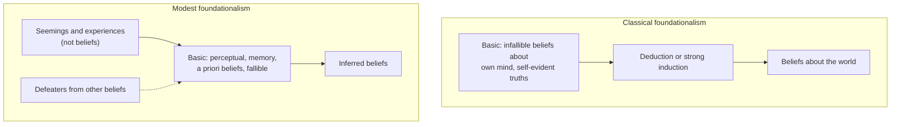

# Epistemology · Lesson 2.2: Foundationalism

> ⏱ ~15 min · Module 2: The structure of justification · Builds on: [2.1 The regress problem](02-01-the-regress-problem.md), [1.4 Internalism and externalism](01-04-internalism-and-externalism.md) · Unlocks: [2.3 Coherentism](02-03-coherentism.md), [2.4 Reliabilism](02-04-reliabilism.md)

## Why this matters

[2.1](02-01-the-regress-problem.md) left you with the [regress argument](../reference.md#regress-argument): if every justified belief owes its justification to another, the chain never ends. Foundationalism is the oldest exit and still the most widely held one: some beliefs are justified without being inferred from anything. Everything turns on which beliefs those are and what justifies them. Answer too strictly and almost nothing you believe about the world survives. Answer too loosely and the foundation seems to justify whatever happens to strike you as true.

## The idea

Think of a building. The upper floors rest on lower ones, but the ground floor rests on the ground. A **[basic belief](../reference.md#basic-belief)** is a ground-floor belief: it is justified, and its justification does not come from inference from your other beliefs. Every other justified belief is supported, by some chain of good inference, from basic ones. Foundationalism is a claim about *structure*: it says the regress stops at basic beliefs, so it denies the regress argument's premise that every justification is inferential.

Two questions then decide everything: **What goes on the ground floor?** And **what holds the ground floor up**, if not other beliefs?

**[Classical foundationalism](../reference.md#classical-foundationalism)** gives the strict answer. Basic beliefs must have an epistemic privilege that rules out error, which in practice confines them to beliefs about your own present mental states ("I am in pain", "I seem to see something red") and self-evident truths of reason. Three grades of privilege get run together and should not be:

- **Infallible**: your believing it entails that it is true.
- **Incorrigible**: no one else could be in a position to correct you.
- **Indubitable**: you cannot, on reflection, doubt it.

Everything else must be derived from that base by deduction or by strong, explicitly good induction. Descartes is the paradigm: the method of doubt strips belief down to what survives the demon, then rebuilds (read historically in [`modern-philosophy` 1.1](../../modern-philosophy/lessons/01-01-the-method-of-doubt.md)).

**[Modest foundationalism](../reference.md#modest-foundationalism)** keeps the structure and lowers the bar. Basic beliefs need only be **prima facie justified**: justified unless something defeats them. They are fallible. Ordinary perceptual beliefs ("there's a tomato on the counter"), memory beliefs and simple a priori beliefs can all be basic. Note the subtle point: a modest basic belief does not *depend* on other beliefs for its justification, but other beliefs can *defeat* it (learning that the lighting is red defeats "the tomato is red"). Negative dependence on the rest of your beliefs is allowed; positive dependence is not.

## Source

Meditation II, after the demon has been let loose (Veitch translation, 1901):

> At all events it is certain that I seem to see light, hear a noise, and feel heat; this cannot be false, and this is what in me is properly called perceiving.

Notice exactly what Descartes treats as secure. Not "there is light", which a dream could falsify, but "I *seem* to see light". That is the classical move in one sentence: retreat from claims about the world to claims about how things appear, because only the latter "cannot be false".

## The argument

**A. The dilemma of the given.** Wilfrid Sellars ("Empiricism and the Philosophy of Mind", 1956) attacked what he called the [myth of the given](../reference.md#myth-of-the-given): the idea that some state could have epistemic standing independently of other cognitive states while also supporting further knowledge. Laurence BonJour sharpened it into a dilemma ("Can Empirical Knowledge Have a Foundation?", 1978; *The Structure of Empirical Knowledge*, 1985, ch. 4), now usually called the **Sellarsian dilemma**. Take whatever is supposed to justify a basic belief: an experience, an awareness, a "given".

- **P1.** If the given has no propositional content (does not represent things as being a certain way), it stands in no logical or evidential relation to a belief, so it cannot justify one.
- **P2.** If the given has propositional content, it can be accurate or inaccurate, and so it stands in need of justification itself.
- **P3.** If a state needs justification, any belief justified by it inherits a further justificatory demand, so that belief is not basic: the regress continues through the state.
- **P4.** The given either has propositional content or it does not.
- **∴ C.** Nothing given can both justify a belief and end the regress. No belief is basic.

*In words:* either your experience says something, in which case it is one more thing that needs backing, or it says nothing, in which case it cannot back anything.

The classical foundationalist answers by denying P2 for a special kind of state: direct **acquaintance** with your own experience, an awareness that cannot misfire. The modest foundationalist needs a different exit.

**B. Phenomenal conservatism.** Michael Huemer's principle (*Skepticism and the Veil of Perception*, 2001; "Compassionate Phenomenal Conservatism", 2007) is the most discussed modern version of modest foundationalism ([phenomenal conservatism](../reference.md#phenomenal-conservatism)):

> **PC.** If it seems to S that P, then, in the absence of defeaters, S thereby has at least some justification for believing that P.

*In words:* things being a certain way to you is a reason, though a defeasible one, to believe they are that way. A **seeming** is an experience with propositional content (it seems to you *that* there is a tomato) but it is not a belief: the stick in water seems bent even when you believe it straight. Seemings include perceptual, memory and intellectual ones, so PC also covers the case-intuitions that [`philosophical-method` 3.4](../../philosophical-method/lessons/03-04-intuitions-and-reflective-equilibrium.md) treated as evidence.

PC escapes the dilemma by denying P2: seemings have content, but they are not the kind of thing that needs justification, any more than a sensation does. Huemer adds a **self-defeat argument**:

- **S1.** All your beliefs, including your beliefs about epistemology, are formed on the basis of how things seem to you.
- **S2.** A belief formed on a basis that confers no justification is unjustified.
- **∴ S3.** If seemings never conferred justification, every belief, including the belief that seemings never justify, would be unjustified. So denying PC undermines itself.

**Where the argument is weakest.** For the dilemma, P2: it assumes that anything that can be inaccurate needs justifying, and the modest foundationalist says that confuses being *assessable for accuracy* with being *assessable for justification*. The Sellarsian replies that this only relocates the question: why should an unjustified seeming make a belief justified? For the self-defeat argument, S1: an externalist says many beliefs are based on reliable processes, not on seemings as reasons. And even granted, S3 shows only that *some* seemings must justify, not the universal PC.

## The structure side by side

Solid arrows carry justification upward; the dashed arrow is negative dependence only. The classical base is narrow and secure; the modest base is broad and defeasible, and it rests on states that are not beliefs.

## Worked examples

**Example 1 (clean case: the tomato).** Lena looks at her counter and believes *there is a red tomato there*. Run both views.

*Classical.* Is the belief infallible, incorrigible or indubitable? No: a wax tomato, a hologram or a dream would make it false while everything seems the same. So it is not basic. It is justified only if derivable from basic beliefs like "I seem to see something red and round". It is not deducible from them. Strong induction would need premises linking seemings to tomatoes, and those premises are themselves beliefs about the world needing the same derivation. This is the classical view's standing problem: its base is secure but too thin to hold up ordinary knowledge, so it slides toward skepticism about the external world ([Module 3](03-01-the-closure-argument.md)).

*Modest (PC).* Condition 1: it seems to Lena that there is a red tomato. Yes. Condition 2: no defeaters. None stated. Verdict: prima facie justified, basic. Add that she knows the kitchen has a red bulb: condition 2 now fails for "red", though not for "tomato".

**Example 2 (hard case: [cognitive penetration](../reference.md#cognitive-penetration)).** Susanna Siegel's case: Jill fears, without good reason, that Jack is angry. When she sees him, her fear partly causes his face to *look* angry to her. She has no idea this happened. Run PC.

- Seeming that Jack is angry: yes.
- Defeaters she possesses: none; the penetration is invisible to her.
- PC's verdict: Jill has some justification to believe Jack is angry.

Many find that wrong: an unjustified fear has laundered itself into a justified belief by passing through experience. Peter Markie (2005) pressed the parallel worry about seemings produced by wishful thinking. Two replies, each with a cost:

1. **Bite the bullet.** From Jill's own perspective the seeming is all she has; she would be irrational to disbelieve it. Huemer takes roughly this line. Cost: justification is now cut loose from whether a belief's origin was any good, which looks like the internalism of [1.4](01-04-internalism-and-externalism.md) at its most exposed.
2. **Restrict PC** to seemings with a proper causal history. Cost: proper history is not accessible to Jill, so the restriction imports an externalist condition, and the view starts drifting toward [reliabilism](02-04-reliabilism.md).

One more problem, for the classical view only: its own criterion ("believe only what is basic or derived from the basic") is neither self-evident nor derivable from what is, so by its own standard it should not be believed. Alvin Plantinga pressed this against classical foundationalism as the backbone of the evidentialist objection to theism; that application belongs to [`philosophy-of-religion`](../../philosophy-of-religion/syllabus.md) 5.1.

## Watch out

- **You might think a basic belief is an unjustified one, but actually** it is a *non-inferentially justified* one. Foundationalism never says the regress stops at arbitrary assumptions; that is Agrippa's hypothesis horn, and the foundationalist's whole job is to say why the base is not arbitrary.
- **You might think a defeasible base makes modest foundationalism a form of coherentism, but actually** defeat is negative dependence. A coherentist says other beliefs supply a belief's positive support ([2.3](02-03-coherentism.md)); the modest foundationalist says they can only take it away.
- **You might think foundationalism is an internalist theory, but actually** it is a claim about structure. A reliabilist whose basic beliefs come from reliable non-inferential processes is a foundationalist too; PC is one internalist way of filling the base.

## One-liner

> Foundationalism stops the regress at beliefs justified without inference; the fight is whether the base is narrow and certain (and too thin) or broad and defeasible (and too generous).

## Problems

**P1 (🟢) *(Exegetical.)*** Priya, an expert wine taster, holds four beliefs: (i) *I am having a sour taste experience*; (ii) *this is a 2019 Rioja*, formed immediately on tasting, with no conscious inference, and she is right nearly every time; (iii) *2 + 3 = 5*; (iv) *this bottle cost more than 40 dollars*, which she concludes from (ii) and her knowledge of prices. For each, say whether it is basic on **classical foundationalism** and on **modest foundationalism in the form of PC**. One line per belief.

**P2 (🟡) *(Evaluative.)*** Build a case in which PC, as stated in this lesson, gives a subject some justification for a belief that seems intuitively unjustified. Do **not** use fear, anger or wishful thinking (Siegel's and Markie's mechanisms). Then give the PC defender's best reply and say what it costs. 150 words or fewer.

**P3 (🔴, optional) *(Exegetical (a) · Evaluative (b).)*** An invented seminar exchange:

> **Ravi:** Your experience either says "there's a tomato" or it says nothing. If it says something, it can be wrong, so it needs backing like any belief. If it says nothing, it can't back a belief. Foundations are a myth.
>
> **Dana:** Seemings say something, all right. But they aren't beliefs, and only beliefs need justifying. A seeming can be inaccurate without being unjustified.

(a) Which numbered premise of the Sellarsian dilemma in this lesson does Dana deny? (b) In two or three sentences, say what Ravi must argue to restore the dilemma, and whether that argument also threatens a coherentist who lets experiences *cause* beliefs without justifying them.

Solutions

**P1** *(Exegetical, strict)*

**Must hit, strict:**

- (i) Classical: basic (introspective belief about a present mental state). PC: basic (it seems to her she has a sour taste; no defeaters).
- (ii) Classical: not basic; it is fallible and about the external world, so it is justified only if derivable from basic beliefs. PC: basic, provided it seems to her that it is a 2019 Rioja and she has no defeater.
- (iii) Basic on both: a self-evident truth for the classical view; an intellectual seeming for PC.
- (iv) Not basic on either: it is inferred from (ii) plus beliefs about prices.

**Wrong turns:** calling (ii) basic on the classical view because Priya is reliable (reliability is not one of the classical privileges); calling (ii) non-basic on PC because it is fallible (PC basics are fallible by design); grounding (ii)'s PC status in her track record rather than in the seeming.

**Model answer:** (i) basic / basic. (ii) not basic: fallible, worldly / basic: it seems so, undefeated. (iii) basic / basic. (iv) not basic / not basic: inferred from (ii).

---

**P2** *(Evaluative)*

**Accept:** any case in which (1) it seems to the subject that P, (2) the subject possesses no defeater, and (3) the belief looks unjustified because of how the seeming arose or how bizarre it is, without using fear, anger or wishful thinking.

**Must hit, any verdict:**

- PC's two conditions checked explicitly on the case, with the verdict "some justification".
- One reply stated precisely: bite the bullet (justified from the subject's perspective; distinguish justification from the faculty's being in good order), or restrict PC to seemings with a proper etiology.
- The reply's cost: the bullet cuts justification loose from a belief's origins; the restriction imports a condition the subject cannot access, moving toward externalism.

**Wrong turns:** giving the subject a defeater (then PC already says unjustified, so it is not a counterexample); confusing "some prima facie justification" with "knowledge" or "all-things-considered justification".

**Model answer, one of several:** A stage hypnotist tells Omar, who remembers nothing of it, that whenever he sees a blue car it will seem to him that the car is stolen. He sees a blue car; it seems stolen; he has no defeater. PC: some justification to believe the car is stolen. That seems wrong: the seeming was planted. Best reply: from Omar's standpoint disbelieving the seeming would be arbitrary, so he is justified though his faculty is corrupted, as a demon victim is. Cost: justification no longer tracks whether the belief's source was any good, and the defender must say why that is not a reductio.

---

**P3** *(Exegetical (a) · Evaluative (b))*

(a)

**Must hit, strict (a):** Dana denies **P2**: she grants seemings propositional content but denies that having content (being assessable for accuracy) makes a state need justification. She accepts P1 and P4.

**Wrong turns (a):** saying she denies P1 (she agrees contentless states cannot justify) or P4 (she takes a horn, she does not deny the disjunction).

(b)

**Must hit, any verdict (b):**

- What Ravi needs: an argument that a state can confer justification only if it is the kind of state that can itself be justified or unjustified (for example, because justifying is a rational relation between states the subject is responsible for), or that a seeming from a bad source cannot pass on what it lacks.
- Whether it hits the coherentist: a judgment that the coherentist who treats experience as mere cause accepts P1 and P2, so the restored dilemma does not hurt her; her exposure is elsewhere (the isolation objection of 2.3).

**Model answer (b), one of several:** Ravi must show that conferring justification requires being apt for justification: a state outside the space of reasons cannot put a belief inside it. That premise is the crux and needs an argument, not a slogan. It does not threaten the coherentist, who already holds that experiences only cause beliefs; her cost is explaining how a system fed by mere causes stays connected to the world.

## Flashback

**From Lesson [1.4](01-04-internalism-and-externalism.md) (Internalism and externalism):** *(Exegetical (a) · Evaluative (b).)* Diagnose. From an invented op-ed:

> "Internalists say justification is all in the head. But everyone agrees you can't know a falsehood, and truth is out in the world, not in your head. So the very definition of knowledge refutes internalism. Reliabilists have the simple story: a belief is justified iff it is reliably produced, so reasons play no part in justification at all. And take BonJour's Norman, who has strong evidence that clairvoyance is impossible and believes anyway: only an internalist could call his reliable belief unjustified."

(a) Find three errors, one sentence each, saying what 1.4 says instead. (b) In two sentences, say what the author would actually need to show to refute access internalism about justification.

Solution

**Must hit, strict (a):**

- The truth argument conflates knowledge with justification. Nearly everyone grants that knowledge has external conditions, truth among them; the internalism dispute is about justification.
- Reliabilism does not exclude reasons. It counts reasoning as one belief-forming process among many and denies only that having accessible reasons is *necessary*.
- Norman is misdescribed. BonJour stipulates that Norman has no evidence for or against clairvoyance or his having it. With counterevidence present, many reliabilists would also call the belief unjustified, since a defeater is present.

**Must hit, any verdict (b):**

- The target is justification: the author needs a case in which a belief's justification depends on a factor the subject cannot reach by reflection.
- A candidate, with the internalist's way out named. Forgotten evidence is one: two internally alike believers seem to differ in justification because of where their beliefs came from. The internalist can bite the bullet or deny that the two are really alike, so the case presses the view without settling the matter.

**Wrong turns:** listing "internalists ignore the world" as an error in the opposite direction (internalists accept truth as a condition on knowledge); in (b), offering Norman or Truetemp, which push *against* reliabilism's sufficiency claim rather than against internalism.

**Model answer (b), one of several:** The author must show that some factor contributing to justification lies beyond reflective reach, through a case where two subjects alike on reflection differ in justification. Goldman's forgotten-evidence case is the standard attempt, and it lands only if the internalist cannot plausibly bite the bullet or find a surviving trace of the source in one subject's mind.

## Connections

- **Backward:** foundationalism is the first exit from the [regress argument](02-01-the-regress-problem.md), and the hypothesis horn of Agrippa's trilemma as the ancient skeptics posed it ([`ancient-medieval-philosophy` 4.3](../../ancient-medieval-philosophy/lessons/04-03-the-skeptics.md)) is the charge it must answer. PC is an access-internalist theory in the sense of [1.4](01-04-internalism-and-externalism.md).
- **Forward:** [2.3](02-03-coherentism.md) takes the Sellarsian side and asks whether coherence alone can justify; [2.4](02-04-reliabilism.md) fills the foundation with reliable processes instead of seemings. Pryor's dogmatism about perception, a close cousin of PC, is the anti-skeptical strategy of [3.3](03-03-moore-and-the-dogmatist.md).
- **Sideways:** PC is one theory of *why* intuitions count as evidence, the claim [`philosophical-method` 3.4](../../philosophical-method/lessons/03-04-intuitions-and-reflective-equilibrium.md) defended. Classical foundationalism's self-referential problem, and its role in the evidentialist objection to belief in God, are in [`philosophy-of-religion`](../../philosophy-of-religion/syllabus.md) 5.1; Descartes's rebuilding project as history is [`modern-philosophy`](../../modern-philosophy/syllabus.md) Module 1.
