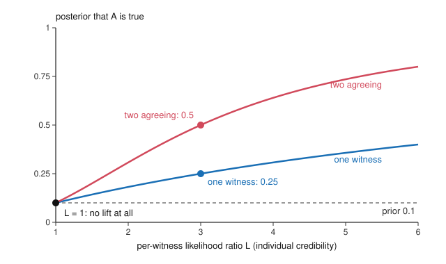

# Epistemology · Lesson 2.3: Coherentism

> ⏱ ~15 min · Module 2: The structure of justification · Builds on: [2.1 The regress problem](02-01-the-regress-problem.md), [2.2 Foundationalism](02-02-foundationalism.md) · Unlocks: [2.4 Reliabilism](02-04-reliabilism.md), [5.3 Conditionalization](05-03-conditionalization.md)

## Why this matters

[2.1](02-01-the-regress-problem.md) left four exits from the [regress argument](../reference.md#regress-argument), and [2.2](02-02-foundationalism.md) took the one that stops the chain at basic beliefs. Coherentism refuses to stop it: no belief is basic, and justification is a matter of how well a whole system of beliefs hangs together. That is the picture behind every detective's case, every scientist's "it all fits", and every conspiracy theorist's too. So the hard question is not whether fit matters but whether fit *alone* can connect a system to the world. This lesson states the view precisely, runs it on cases, and then does something rare in epistemology: settles part of the dispute with a three-line probability calculation.

## The idea

Otto Neurath's image: we are sailors who must rebuild our ship plank by plank on the open sea, never able to put it in dry dock and start from a foundation. Every plank is held in place by the others. The [coherentist](../reference.md#coherentism) says belief is like that.

The regress argument assumed justification is **linear**: belief A is justified by B, which is justified by C, and so on, so the chain must end, loop, or go on forever. Coherentism denies that assumption. Justification is **holistic**: what is justified in the first instance is a system, and a single belief is justified by being a member of a sufficiently coherent system. There is no chain, so there is no circle in the vicious sense; there is mutual support, the way the stones of an arch hold each other up. That is how coherentism takes the "circle" horn of [Agrippa's trilemma](../reference.md#agrippas-trilemma) without arguing in a circle.

**What coherence is.** Not just consistency: the beliefs that the moon is cheese and that Tuesday follows Monday are consistent and support each other not at all. Laurence BonJour, in *The Structure of Empirical Knowledge* (1985), the most developed version of the view, listed five dimensions:

1. **Logical consistency** (a necessary condition).
2. **Probabilistic consistency**: not believing both that p and that p is highly improbable.
3. **Inferential connections**: coherence rises with the number and strength of the ways beliefs support each other, explanatory connections above all.
4. **Integration**: coherence falls as the system splits into unconnected subsystems.
5. **Anomalies**: coherence falls with every unexplained anomaly.

How the five are to be weighed against each other, BonJour did not say, and nobody since has said in a way others accept.

**Two shapes of the view.** In John Pollock's labels (*Contemporary Theories of Knowledge*, 1986), **positive** coherentism says a belief needs positive support from its fit; **negative** coherentism says a belief you hold is innocent until a conflict with the rest of the system convicts it. Gilbert Harman's principle of conservatism, keep what you believe unless you have reason to change it, is the usual example of the negative shape. Keith Lehrer (*Theory of Knowledge*, 1990) gives a positive, local version: you are justified in accepting p when, relative to your system of acceptances, p beats or neutralizes every competing claim.

## The argument

Stated as conditions, BonJour's 1985 coherentism says:

**S's empirical belief that p is justified iff**

- **(C1)** p belongs to S's system of beliefs;
- **(C2)** that system is coherent to a high degree, on the five dimensions;
- **(C3)** the system meets the [observation requirement](../reference.md#observation-requirement): it includes the belief that a reasonable variety of S's *cognitively spontaneous* beliefs (ones that strike S unbidden, as perceptual beliefs do) are likely to be true.

In words: you are justified if your belief fits a tightly knit system that itself treats unbidden perceptual input as reliable. BonJour was an access internalist ([1.4](01-04-internalism-and-externalism.md)): S must be able, in principle, to grasp that the system coheres. C3 is his answer to the first objection below.

**A. The [isolation objection](../reference.md#isolation-objection).**

- **P1.** Coherence is a relation among beliefs only.
- **P2.** A relation among beliefs only is indifferent to what the world is like.
- **P3.** Justification must make a belief likely to be true of the world.
- **∴ C.** Coherence is not sufficient for justification.

In words: a system could fit perfectly and float free of reality, like a well-crafted novel. Its twin, the **[alternative-systems objection](../reference.md#alternative-systems-objection)**, adds that for any coherent system there are equally coherent rivals incompatible with it, so coherence cannot pick out the one to believe.

The coherentist's reply targets P2. With C3, the system is not closed: what you spontaneously come to believe is caused by the world, and C3 makes the system *take* those inputs as evidence, so a system that ignores what you keep seeing loses coherence through anomalies. A novel is coherent but not responsive to input; your belief system must be. The critic answers that C3 is itself only a *belief* about input, and a belief can be false.

**B. Can coherence create credibility? The agreeing witnesses.** C. I. Lewis (*An Analysis of Knowledge and Valuation*, 1946) noticed that independent witnesses who agree are far more convincing than either alone, but held that this works only if each has *some* credibility of their own. BonJour (1985) argued that Lewis's own example shows no antecedent credibility is needed. Probability decides between them.

Let $A$ be a claim, $E_1$ and $E_2$ the events "witness 1 (2) reports $A$". Assume the reports are **conditionally independent**: given $A$, and given $\neg A$ (not-$A$), one report tells you nothing about the other. Write $L_i = \dfrac{\Pr(E_i \mid A)}{\Pr(E_i \mid \neg A)}$ for witness $i$'s **likelihood ratio**, how much likelier the report is if $A$ is true. Then by Bayes in odds form ([philosophical-method 2.4](../../philosophical-method/lessons/02-04-weighing-evidence-in-odds-form.md)):

$$\frac{\Pr(A \mid E_1 \wedge E_2)}{\Pr(\neg A \mid E_1 \wedge E_2)} = \frac{\Pr(A)}{\Pr(\neg A)} \times L_1 \times L_2 .$$

In words: agreement *multiplies* the witnesses' individual strengths. That is why agreement impresses. But if neither has individual credibility ($L_1 = L_2 = 1$, each report equally likely whether or not $A$), the product is 1 and the posterior equals the prior. Erik Olsson (2002; *Against Coherence*, 2005) made this the formal point: Lewis was right. Coherence amplifies credibility that is already there; it cannot create it from nothing.

Worse news for coherence as a guide to truth: Luc Bovens and Stephan Hartmann (*Bayesian Epistemology*, 2003) and Olsson (2005) proved that, even granting independence and some individual credibility, **no measure of coherence is truth-conducive even ceteris paribus**: there are always cases where the more coherent set of reports is the less probable one, holding everything else fixed. These are the [coherence impossibility results](../reference.md#coherence-impossibility-results).

**Where the argument is weakest.** Argument B assumes that what coherentism needs is for coherence to raise the probability of truth *by itself*, measured by a single number. A coherentist can reject both parts. Justification may be a matter of the whole system's support relations, not a probability fixed by a coherence score; and the inputs that give each "witness" its $L_i > 1$ are cognitively spontaneous beliefs, whose credibility C3 already supplies from inside the system. The critic's reply: then individual credibility is doing the justifying, which is the [modest foundationalist's](../reference.md#modest-foundationalism) claim with coherentist vocabulary. Whether that reply is fair is still disputed.

## The picture

Prior $\Pr(A) = 0.1$, odds $1:9$. One witness with $L = 3$: odds $3:9$, probability $0.25$. Two agreeing: odds $9:9$, probability $0.5$. At $L = 1$ both curves start on the dashed prior line: agreement among witnesses with no individual credibility moves nothing.

## Worked examples

**Example 1 (clean case: the navigator).** Ines, an invented navigator without GPS, believes her boat is 3 km off the headland. Her dead reckoning (speed, heading, time) puts her there; the depth sounder reads what the chart shows for that spot; the lighthouse bears where it should. Run the conditions.

- **C1:** satisfied; the belief is in her system.
- **C2:** high. The beliefs are consistent, each is explained by the hypothesis of her position, the system is one integrated whole, and there is no unexplained anomaly.
- **C3:** satisfied. The sounding and the bearing are cognitively spontaneous readings she takes to be reliable.

Verdict: justified. The case also shows coherentism's strength. No single source is decisive (the log could be off, the sounder mis-set), yet their fit gives her more than any one does, exactly as the formula says when each $L_i$ is modestly above 1.

**Example 2 (hard case: the closed loop).** Teodor, invented, holds an elaborate, consistent system on which the town's water is being secretly treated. It explains every rumour he hears, every odd taste, every official denial (denials are what a cover-up predicts). It has no unexplained anomalies, because every apparent anomaly is absorbed. It even meets C3: he believes his spontaneous beliefs are reliable, and his perceptions of the taste of the water are real inputs.

- **C1:** satisfied. **C2:** arguably high: consistent, densely connected by explanation, integrated.
- **C3:** satisfied *as stated*: the requirement asks only that the system include a belief about the reliability of spontaneous input.

So BonJour's conditions seem to deliver "justified." This is where the view strains, and both sides have a move. The coherentist says Teodor's system is less coherent than it looks: absorbing anomalies by auxiliary hypotheses ("the denial is part of the plot") adds connections that are ad hoc, and a proper weighting of BonJour's five dimensions would count this against integration. The critic says that is exactly the missing weighting doing the work, and that nothing in C1 to C3 forbids it. Note also that his inputs (odd taste, rumours) have $L_i$ near 1 for the hypothesis: they are about as likely without a plot, which is argument B's diagnosis. The case does not refute coherentism; it shows that its verdict depends on how coherence is measured, which is the unsettled part.

## Watch out

- **You might think coherence is just consistency, but** a consistent set can be a heap of unrelated beliefs. Coherence needs positive support among them; consistency is only its floor.
- **You might think coherentism endorses circular arguments, but** it denies the linear picture on which "circle" makes sense. The objection to it is isolation from the world, not circular reasoning.
- **You might think the Bayesian results refute coherentism, but** they show something narrower: coherence cannot create credibility from zero, and no coherence measure tracks truth in all cases. Whether coherentism needs either claim is the live question.

## One-liner

> Coherence multiplies credibility that is already there; whether it can be the *only* source of credibility is the whole dispute.

## Problems

**P1 (🟢) *(Formal (a)–(b) · Exegetical (c).)*** Before anyone reports, your probability that the ferry sailed at dawn ($A$) is $\tfrac15$. Two harbour workers, questioned separately, each say it did. Each reports $A$ with probability $0.8$ if $A$ is true and $0.3$ if it is false, and their reports are conditionally independent given $A$ and given $\neg A$.

(a) Find $\Pr(A \mid E_1)$ and $\Pr(A \mid E_1 \wedge E_2)$.
(b) Now suppose instead each worker reports $A$ with probability $0.45$ whether or not $A$. Find $\Pr(A \mid E_1 \wedge E_2)$, and prove in general that conditional independence plus $\Pr(E_i \mid A) = \Pr(E_i \mid \neg A)$ for each $i$ gives $\Pr(A \mid E_1 \wedge E_2) = \Pr(A)$.
(c) In one sentence: which of Lewis and BonJour does (b) side with, and on what question?

**P2 (🟡) *(Exegetical (a) · Evaluative (b).)*** From an invented forum post:

> "My theory of the lake creature accounts for every sighting in the county archive, every gap in the sonar records, and every expert who says otherwise (they're protecting tourism). I've checked it for years: nothing in it contradicts anything else. You can't name one inconsistency. So I'm justified. Skeptics just want some magic bedrock belief that can't be questioned."

(a) Which of BonJour's five dimensions of coherence does the poster claim, and which does his argument ignore? (b) Reply to him with either the isolation or the alternative-systems objection, then give the coherentist's best rejoinder. 120 words or fewer for (b). Any verdict.

**P3 (🔴, optional) *(Evaluative.)*** Build a case where a person's belief seems justified although her belief system as a whole is *not* highly coherent (so C2 fails). Then say, in two sentences, how a coherentist could reply, and what the reply costs. 150 words or fewer.

Solutions

**P1** *(Formal (a)–(b) · Exegetical (c))*

(a) One witness: $\Pr(A \wedge E_1) = \tfrac15 \cdot 0.8 = \tfrac{4}{25}$ and $\Pr(\neg A \wedge E_1) = \tfrac45 \cdot 0.3 = \tfrac{6}{25}$, so

$$\Pr(A \mid E_1) = \frac{4/25}{4/25 + 6/25} = \frac{2}{5} = 0.4 .$$

Two witnesses: $\Pr(A \wedge E_1 \wedge E_2) = \tfrac15 \cdot 0.8^2 = \tfrac{16}{125}$ and $\Pr(\neg A \wedge E_1 \wedge E_2) = \tfrac45 \cdot 0.3^2 = \tfrac{9}{125}$, so

$$\Pr(A \mid E_1 \wedge E_2) = \frac{16}{16 + 9} = \frac{16}{25} = 0.64 .$$

Check in odds form: prior odds $1:4$, each $L = 0.8/0.3 = 8/3$, posterior odds $\tfrac14 \cdot \tfrac{64}{9} = \tfrac{16}{9}$, probability $16/25$.

(b) With $0.45$ in both rows: $\Pr(A \mid E_1 \wedge E_2) = \dfrac{\tfrac15 (0.45)^2}{\tfrac15 (0.45)^2 + \tfrac45 (0.45)^2} = \tfrac15$, the prior.

Proof. By conditional independence, $\Pr(E_1 \wedge E_2 \mid A) = \Pr(E_1 \mid A)\Pr(E_2 \mid A)$ and likewise given $\neg A$. Write $a = \Pr(A)$ and $c_i = \Pr(E_i \mid A) = \Pr(E_i \mid \neg A)$. Then

$$\Pr(A \mid E_1 \wedge E_2) = \frac{a\, c_1 c_2}{a\, c_1 c_2 + (1-a)\, c_1 c_2} = a ,$$

provided $c_1 c_2 > 0$ (so the conditioning event has positive probability). $\blacksquare$

(c) It sides with **Lewis**: on whether agreement can confer credibility on reports that have none individually, the answer is no.

**Must hit, strict (c):** Lewis, not BonJour; the question is whether antecedent individual credibility is needed.

**Wrong turns:** in (a), multiplying $0.8 \times 0.8$ and stopping (that is $\Pr(E_1 \wedge E_2 \mid A)$, not the posterior). In (b), dividing by $c_1 c_2$ without noting it must be nonzero. In (c), saying (b) refutes coherentism outright: it refutes only the claim that coherence creates credibility from zero.

---

**P2** *(Exegetical (a) · Evaluative (b))*

**Must hit, strict (a):**

- Claimed: **logical consistency** ("nothing in it contradicts anything else") and **explained anomalies** / **inferential connections** (it "accounts for" every sighting, gap and denial).
- Ignored: consistency is only the floor; and **integration** and **probabilistic consistency** with the rest of his system (what he believes about sonar, archives, the base rate of large unknown animals) are never examined. Coherence is a property of his whole belief system, not of the theory alone.

**Must hit, any verdict (b):**

- One objection stated correctly: isolation (fit among beliefs does not by itself connect them to the lake) or alternative systems (an equally tidy no-creature system explains the same data: sightings as misidentifications, sonar gaps as equipment faults).
- The coherentist rejoinder: the relevant system is his total belief system with its observation requirement, and absorbing expert denial by a cover-up hypothesis adds ad hoc connections and lowers integration; or the two systems are not equally coherent once his background beliefs are included.
- What the rejoinder needs: a way of weighing coherence's dimensions that the view has not supplied.

**Wrong turns:** answering (a) with "he lacks foundations" (that is the foundationalist's complaint, not one of BonJour's dimensions). Treating "skeptics want magic bedrock" as a point against the objections: neither objection assumes foundationalism.

**Model answer (b), one of several:** Alternative systems: a no-creature theory explains the same archive (misidentified logs and otters), the sonar gaps (faults) and the experts (who are right), with no contradiction either. Consistency cannot choose between them. Coherentist rejoinder: compare not the two stories but the two whole belief systems. His also includes what he knows about sonar, archives and how rarely large animals go unrecorded, and the creature theory conflicts with those or needs ad hoc patches, so it is less coherent. The rejoinder works only if coherence can be measured across dimensions, which BonJour left open.

---

**P3** *(Evaluative)*

**Accept:** any case where the belief is plausibly justified (typically perceptual or simple memory) while the subject's overall system is inconsistent, fragmented or riddled with anomalies; plus a reply that restricts coherence to a relevant subsystem or weakens the requirement, with its cost named.

**Must hit, any verdict:**

- A case that clearly fails C2 globally yet where the target belief seems justified.
- A coherentist reply: coherence of the *relevant* part of the system (as in Lehrer's local version), or justification in degrees.
- The cost: restricting to a subsystem requires saying what makes it relevant, and the more local the coherence, the more justification seems to come from the single input, which is the foundationalist's picture.

**Wrong turns:** a case where the belief itself is part of the incoherence (then it is not clearly justified). Saying the reply is "ad hoc" without saying what it gives up.

**Model answer, one of several:** Maren holds inconsistent political and religious beliefs and several half-abandoned theories about her health; her system is badly fragmented. Walking home, she sees a bus bearing down and believes a bus is coming. That belief seems justified. The coherentist replies that justification depends on the coherence of the subsystem relevant to p (her beliefs about perception, streets and buses), which is in good order. The cost: she now owes a criterion of relevance, and the more local the subsystem, the more the work is done by the perceptual input itself, which moves the view toward modest foundationalism.

## Flashback

**From Lesson [2.1](02-01-the-regress-problem.md) (The regress problem):** *(Exegetical (a) · Evaluative (b).)* Reconstruct. Pilar believes the corner bakery is closed ($p$) because she sees that its lights are off ($r$). Grant that $r$ is a basic perceptual belief, so the ordinary regress stops there. Now adopt the *strong* principle of inferential justification: to be justified in believing $p$ on the basis of $r$, $S$ must be justified in believing $r$ **and** justified in believing that $r$ makes $p$ probable. (a) In three or four numbered steps, show that the strong principle restarts a regress for Pilar even though $r$ is basic. (b) Name one kind of theorist who rejects the strong clause, and say what rejecting it costs. Two sentences.

Solution

**Must hit, strict (a):**

- The second clause demands a justified belief in a *support claim*, $q_1$: "the lights being off makes it probable that the bakery is closed."
- $q_1$ is not a perceptual belief about the scene; if it is justified, it is justified by some further reason $r_1$ (say, her memory that the lights go off only at closing time).
- That inference is itself subject to the strong principle, so she also needs a justified belief in $q_2$: "$r_1$ makes $q_1$ probable", and so on.
- So the regress runs through the support claims, not through $r$; a basic $r$ does not stop it. It stops only if some support claim is justified without inference.

**Must hit, any verdict (b):**

- A correct rejecter: externalists such as reliabilists, or the many foundationalists who require only that $r$ in fact support $p$ (or that the inference be reliable), not that $S$ be justified in believing it does.
- A cost stated: $S$ can then be justified by an inference whose goodness she has no grip on, which invites a Norman-style complaint about inference: from her own point of view, believing $p$ on $r$ with no reason to think $r$ supports $p$ looks arbitrary.

**Wrong turns:** locating the new regress in $r$ (it is basic by stipulation); saying the strong principle makes the chain circular (no belief recurs; each step adds a new support claim).

**Model answer, one of several:** (a) 1. By the strong principle, Pilar needs justification for $q_1$: the lights being off makes it probable the bakery is closed. 2. $q_1$ is not seen; it rests on a reason $r_1$, her memory that the lights go off only at closing. 3. The strong principle applies again: she needs justification for $q_2$, that $r_1$ makes $q_1$ probable, which needs a reason and a support claim of its own. 4. So a regress opens at every link, through the support claims, and a basic $r$ cannot halt it. (b) A reliabilist rejects the clause: what matters is that the inference from lights to closure is reliable, not that Pilar believes it is. The cost is that she counts as justified by a connection she has no reason to think holds, which is just what an internalist finds objectionable about Norman.

## Connections

- **Backward:** coherentism takes the "circle" exit of the regress in [2.1](02-01-the-regress-problem.md) by denying that justification is linear; its rival is [2.2](02-02-foundationalism.md)'s basic beliefs. The witness formula is odds-form Bayes from [philosophical-method 2.4](../../philosophical-method/lessons/02-04-weighing-evidence-in-odds-form.md), and "garbage in, garbage out" from [philosophical-method 3.4](../../philosophical-method/lessons/03-04-intuitions-and-reflective-equilibrium.md) is the isolation objection applied to reflective equilibrium; [ethics 6.6](../../ethics/lessons/06-06-moral-knowledge-and-disagreement.md) asks whether coherence justifies moral judgments and left the general question here.
- **Forward:** [2.4](02-04-reliabilism.md) replaces "fits the system" with "produced by a reliable process", which answers isolation directly and pays elsewhere. Conditionalization as a rule is [5.3](05-03-conditionalization.md). BonJour himself abandoned coherentism for a foundationalist view in "The Dialectic of Foundationalism and Coherentism" (1999).
- **Sideways:** explanatory coherence as a guide to scientific theory choice, and inference to the best explanation applied to science, belong to [`philosophy-of-science`](../../philosophy-of-science/syllabus.md). Coherence as a theory of *truth*, rather than of justification, sits with the theories of truth in [`philosophy-of-language-and-logic`](../../philosophy-of-language-and-logic/syllabus.md).
