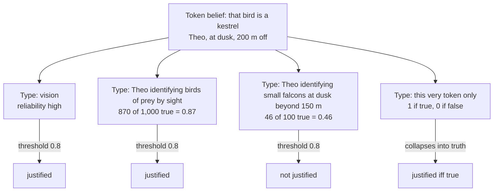

# Epistemology · Lesson 2.4: Reliabilism

> ⏱ ~15 min · Module 2: The structure of justification · Builds on: [1.4 Internalism and externalism](01-04-internalism-and-externalism.md), [2.1 The regress problem](02-01-the-regress-problem.md), [2.2 Foundationalism](02-02-foundationalism.md), [2.3 Coherentism](02-03-coherentism.md) · Unlocks: [2.5 Virtue epistemology](02-05-virtue-epistemology.md), [3.3 Moore and the dogmatist](03-03-moore-and-the-dogmatist.md)

## Why this matters

Foundationalism and coherentism ([2.2](02-02-foundationalism.md), [2.3](02-03-coherentism.md)) both answer the regress by looking *inside* the believer: at basic seemings, or at how her beliefs hang together. Reliabilism changes the question. What makes a belief justified, it says, is not what the believer can see from the inside but how the belief was *produced*: by a process that tends to get things right. That one move dissolves the regress, explains why children and animals know things, and makes epistemology continuous with cognitive science. It also produces three objections that have shaped the field for forty years. This lesson states the theory as conditions, runs it, and presses all three.

## The idea

Think of a thermometer. Its reading is trustworthy not because the thermometer has *reasons* but because it is the kind of device whose readings track temperature. Alvin Goldman's thought is that a belief is like a reading. Perception in good light, memory, introspection and good reasoning are reliable processes; wishful thinking, hasty generalization and guesswork are not. A belief produced by the first kind is justified; by the second, not. The believer need not know which kind produced it, or even have the concept of reliability.

The regress then stops without a given and without a web. A perceptual belief is justified not by a further belief but by a fact about its causal origin. That is why reliabilism is the standard example of **externalism** ([1.4](01-04-internalism-and-externalism.md)): the justifier is the process's track record, which typically lies outside what the subject can access by reflection.

## The argument

**The theory.** Alvin Goldman, "What Is Justified Belief?" (1979), states [process reliabilism](../reference.md#process-reliabilism) recursively. A cognitive **process** is a belief-forming operation, typed by its inputs and how it handles them; its **reliability** is the proportion of true beliefs it yields across the situations it operates in. Let $S$ be a subject, $p$ a proposition, and $\theta$ a threshold of reliability, which Goldman requires to be high but does not fix.

- **Base clause (belief-independent processes).** If $S$'s belief that $p$ results from a process whose inputs are not beliefs (perception, say) and whose reliability is at least $\theta$, the belief is justified. *In words:* a good process gives a good belief from scratch.
- **Recursive clause (belief-dependent processes).** If $S$'s belief that $p$ results from a process that takes beliefs as inputs, that process is **conditionally reliable** (it yields mostly true outputs *when its inputs are true*), and the input beliefs are themselves justified, then the belief is justified. *In words:* valid deduction can't make true premises false, so it passes justification along; it can't create justification from garbage.
- **Non-undermining clause.** The belief is justified only if there is no reliable or conditionally reliable process *available* to $S$ which, had she used it as well, would have led her not to believe $p$. *In words:* a reliable source doesn't justify you if you are ignoring evidence you could have used against it.

The target is justification, not knowledge; knowledge needs truth and an anti-Gettier condition besides.

**Three objections.**

1. **The [generality problem](../reference.md#generality-problem).** A belief is produced by one token process, but reliability belongs to *types*, and every token falls under indefinitely many types: "vision," "vision of a moving object at dusk," "this subject's vision at dusk after two glasses of wine." Different types have different track records. Goldman flagged the difficulty in 1979; Richard Feldman pressed it in 1985, and Earl Conee and Feldman, "The Generality Problem for Reliabilism" (1998), argued that no principled typing yet proposed yields a determinate verdict. Narrow the type until it covers only this belief and its reliability is 1 if the belief is true and 0 if false, which makes justification collapse into truth. Broaden it to "vision" and it ignores the conditions that matter. Without a rule, the theory gives no verdict. *In words:* "reliable process" is incomplete until someone says *which* process.

2. **Clairvoyance revisited.** BonJour's [Norman](../reference.md#norman-the-clairvoyant) ([1.4](01-04-internalism-and-externalism.md)) has a perfectly reliable clairvoyant power and no evidence for or against having it. The base clause calls his belief that the President is in New York justified. Goldman's answer is the non-undermining clause: Norman has an available reliable process (reasoning from his background knowledge that claims to clairvoyance rarely pan out) which, had he used it, would have stopped him believing. The critic replies that the clause is doing internalist work in externalist clothing: it penalizes Norman for failing to respond to what he has reason to think.

3. **[Bootstrapping](../reference.md#bootstrapping) and [easy knowledge](../reference.md#easy-knowledge).** Jonathan Vogel, "Reliabilism Leveled" (2000): Roxanne believes whatever her car's gas gauge says, with no prior reason to think it reliable. As it happens, the gauge is reliable. Each time she looks she forms two beliefs: that the gauge reads "F" (reliable perception) and that the tank is full (reliable gauge-reading). She conjoins them: "the gauge reads F and the tank is full." After many such episodes she infers by induction that the gauge is reliable. Every step is a reliable process, so reliabilism says she is now justified in believing the gauge reliable, though she never checked it against anything. Stewart Cohen, "Basic Knowledge and the Problem of Easy Knowledge" (2002), argued the problem is wider: any view on which a source can give knowledge before you know the source is reliable seems to license this loop. That is why "easy knowledge" returns against the dogmatist in [3.3](03-03-moore-and-the-dogmatist.md).

The [new evil demon](../reference.md#new-evil-demon-problem) ([1.4](01-04-internalism-and-externalism.md); Stewart Cohen, 1984) completes the internalist's case: a demon victim forms beliefs by unreliable processes yet seems exactly as justified as you. Goldman's *Epistemology and Cognition* (1986) answered with **normal-worlds reliabilism**: a process counts as reliable if it is reliable in worlds that fit our general beliefs about the actual world, and the victim's perceptual processes are reliable in those worlds, so her beliefs come out justified.

**[Proper functionalism](../reference.md#proper-functionalism)**, a variant. Alvin Plantinga (*Warrant and Proper Function*, 1993) targets **warrant**, whatever turns true belief into knowledge. A belief is warranted only if (i) it is produced by faculties functioning properly, (ii) according to a design plan aimed at truth, (iii) that is a good plan: in its designed environment it gives true beliefs with high objective probability, and (iv) the belief is formed in that environment. *In words:* reliability plus the right teleology. His case against plain reliabilism (*Warrant: The Current Debate*, 1993): a brain lesion that causes mostly false beliefs also reliably causes the true belief that one has a brain lesion. Reliable, but no one thinks it is knowledge. Ernest Sosa turned the tables with Donald Davidson's Swampman: lightning assembles a molecule-for-molecule duplicate of a person, with no evolutionary or designed history. Swampman's perceptual beliefs seem warranted; proper functionalism seems to deny it. Plantinga doubted the case is possible, and argued we would ascribe functions to Swampman's organs anyway. The theistic application (Plantinga's claim that design plans point to a designer) is [`philosophy-of-religion`](../../philosophy-of-religion/syllabus.md) 5.2.

**Where the argument is weakest.** The base clause. Every objection above attacks the claim that reliable production *suffices* for justification: Norman and bootstrapping say reliability without the subject's grasp of it is too cheap, the lesion says it can be the wrong sort of reliability, and the generality problem says the clause has no content until the type is fixed. Defenders reply that each objection either assumes an internalist conception of justification (Norman, bootstrapping) or afflicts every theory that uses dispositions and types, internalist ones included, since "basing a belief on evidence" must be typed too (Conee and Feldman, as noted, deny this parity holds).

## The picture

*One token process, four candidate types, three verdicts. The counts are illustrative; the point is that nothing in the theory chooses the row.*

## Worked examples

**Example 1 (clean case).** Mira, in daylight, sees a ripe tomato on the counter and believes *there is a tomato on the counter*. Then, knowing the salad recipe calls for whatever is on the counter, she infers *the salad will have tomato*.

- Belief 1: produced by visual recognition of familiar objects in good light, a belief-independent process. On any natural typing its reliability is well above any plausible threshold. Nothing available to Mira tells against it. **Base clause: justified.**
- Belief 2: produced by deduction, a belief-dependent process that is conditionally reliable (perfectly so). Its inputs, belief 1 and her belief about the recipe, are justified. **Recursive clause: justified.**

Note what Mira did *not* need: any belief about her own eyesight. That is the externalist payoff, and why reliabilism has no regress: belief 1 rests on no further belief at all. Here the [propositional and doxastic](../reference.md#propositional-and-doxastic-justification) distinction ([1.4](01-04-internalism-and-externalism.md)) shows reliabilism's natural home: it is a theory of *doxastic* justification, since it evaluates beliefs by how they were actually formed.

**Example 2 (hard case: Roxanne).** Run the theory on Vogel's case step by step.

| Step | Process | Reliable? | Clause |
|---|---|---|---|
| Gauge reads "F" | vision | yes | base |
| Tank is full | trusting the gauge | yes (the gauge works) | base, with the gauge reading as perceptual input |
| Reads F and tank full | conjunction | conditionally reliable | recursive |
| Gauge is reliable | enumerative induction over many such conjunctions | conditionally reliable | recursive |

Each row is licensed, so the conclusion is justified. Non-undermining doesn't help unless something available to Roxanne tells against the gauge, and by hypothesis nothing does. The theory has stopped *straining* and is giving a clear verdict that almost everyone finds wrong. Where to block it? One option denies that trusting a source without knowing it is reliable gives "basic" justification at all, which abandons reliabilism's central claim. Another bars processes that use a source's outputs to confirm that same source, which looks like an *ad hoc* rule or an internalist requirement smuggled in. A third bites the bullet: the conclusion is justified but the reasoning is *dialectically* useless, since it couldn't persuade anyone who doubted the gauge.

The same shape appears elsewhere. Hartry Field's demand that we explain why mathematicians' beliefs reliably covary with abstract facts ([metaphysics 1.2](../../metaphysics/lessons/01-02-abstract-objects.md)) is a reliability requirement of exactly this kind. And the debunker's charge that moral intuitions can't certify their own reliability ([ethics 6.4](../../ethics/lessons/06-04-constructivism-and-debunking.md)) is the bootstrapping worry run on moral judgment.

## Watch out

- **You might think reliabilism says you must know your process is reliable, but** that is precisely what it denies. Requiring that knowledge would put an internalist access condition back in, and with it the regress.
- **You might think the generality problem is a quibble about wording, but** without a rule for choosing the type, the theory issues no verdict at all, or issues several. It is a demand for the theory's missing parameter.
- **You might think proper functionalism is just reliabilism plus God, but** its four conditions are naturalistically stateable (evolution can be the designer), and it splits from process reliabilism on the lesion and Swampman cases whatever one thinks about theism.

## One-liner

> A belief is justified by the reliability of the process that made it, until you ask *which* process, notice it can certify itself, or meet someone it works for without his knowing why.

## Problems

**P1 (🟢) *(Formal (a)–(b) · Exegetical (c))*** Lena, a trainee sommelier, tastes a wine blind and believes, truly, that it is a Rioja. Her tasting notebook supports three candidate process types for this token belief, with these track records:

| Type | Beliefs formed | True |
|---|---|---|
| T1: Lena identifying a wine's region by taste | 500 | 412 |
| T2: Lena identifying Spanish reds blind | 200 | 141 |
| T3: Lena identifying Tempranillo-based wines after tasting six others that evening | 60 | 27 |

(a) Compute each type's reliability. With threshold $\theta = 0.8$, what does process reliabilism say on each typing? (b) For which values of $\theta$ in $(0, 1]$ do all three typings give the *same* verdict? (c) In two sentences: what is the reliability of the narrowest type, "this very tasting," and why doesn't choosing it solve the problem?

**P2 (🟡) *(Exegetical (a) · Evaluative (b))*** Halvard forages mushrooms. He reliably tells edible from poisonous species by an inarticulate "gut feel," with no idea that he is reliable. (a) Case 1: his well-thumbed field guide, which he trusts and which is reliable, says the species before him has a deadly look-alike that needs a spore print to rule out; he skips the guide and believes *this one is edible*, truly. Case 2: no guide exists and he has no evidence for or against his gut feel. Give the verdict of Goldman's 1979 theory, base clause plus non-undermining clause, on each case, one sentence each. (b) A critic says: "Either the non-undermining clause is too strong, since there is almost always *some* further check one could have run, or it is an internalist evidence requirement in disguise." Assess the dilemma. 150 words or fewer.

**P3 (🔴, optional) *(Exegetical (a) · Evaluative (b))*** After a concussion, Ansel finds he can tell the time to the minute without a clock. Doctors confirm the effect: it is a side effect of the injury disturbing a timing circuit, and over hundreds of trials it has been right 99 percent of the time. Ansel knows none of this; he simply finds himself believing *it is 3:17*, and it is. (a) Give the verdict of process reliabilism (assume nothing available undermines the belief) and of Plantinga's proper functionalism, naming the condition that decides each. (b) Which theory's verdict is harder to live with? State the strongest reply its defender can give and what that reply costs. 150 words or fewer.

Solutions

**P1** *(Formal (a)–(b) · Exegetical (c))*

(a) Reliability = true / formed.

$$r(T_1) = \tfrac{412}{500} = 0.824 \qquad r(T_2) = \tfrac{141}{200} = 0.705$$

$$r(T_3) = \tfrac{27}{60} = 0.45$$

At $\theta = 0.8$: T1 gives *justified* ($0.824 \ge 0.8$); T2 and T3 give *not justified*. The verdict depends on the typing.

(b) All three agree on *justified* iff $\theta \le 0.45$ (the minimum), and on *not justified* iff $\theta > 0.824$ (the maximum). So the verdict is typing-independent exactly when $\theta \in (0, 0.45]$ or $\theta \in (0.824, 1]$. For every threshold in between, $0.45 < \theta \le 0.824$, the typing decides.

**Must hit, strict (c):**

- The single-token type has reliability 1, since the belief is true (it would be 0 if false).
- Choosing it makes every true belief justified and every false one unjustified, so justification collapses into truth and the theory can no longer say why a lucky guess is unjustified (Conee and Feldman's single-case horn).

**Wrong turns:** averaging the three ratios to get "the" reliability (no type is privileged, and averaging is itself a typing choice); answering (b) with a single value rather than two intervals.

---

**P2** *(Exegetical (a) · Evaluative (b))*

**Must hit, strict (a):**

- Case 1: not justified. The base clause is met, but consulting the guide was an available reliable process that would have led him not to believe (or to suspend), so the non-undermining clause fails.
- Case 2: justified on the 1979 theory, *unless* some available process, such as reasoning from his background knowledge that unexplained hunches are usually unreliable, would have stopped him. Credit either verdict if the answer names that as the deciding question; this is exactly Norman's structure.

**Must hit, any verdict (b):**

- State the clause precisely: it is triggered by available processes that *would have* led to non-belief, not by any further check one could run.
- Take one horn seriously: e.g. for "too strong," note that most extra checks would have *confirmed* the belief and so don't trigger the clause; for "internalist," note that "available" seems to mean available to the subject's own cognition, i.e. evidence she possesses.
- Say what the defender pays: either a principled account of "available" that is externalist, or conceding a mixed theory.

**Wrong turns:** reading Case 1 as unjustified because the gut feel is unreliable (it is reliable by stipulation); treating the clause as requiring Halvard to *believe* his process is reliable.

**Model answer (b), one of several:** The first horn misfires: the clause bites only when an available process would have produced non-belief, and most further checks would have agreed, so ordinary beliefs survive. The second horn has more force. What makes the guide "available" to Halvard is that he owns it, has read it and trusts it; that is, it is part of his evidence. A reliabilist can try to cash "available" out externally, as processes he has the capacity to run, but then Case 2 turns on facts about his capacities, not on anything he has reason to think, and the clause loses its anti-Norman bite. So the defender seems to choose between a mixed theory, with evidence as a defeater condition, and a clause that no longer handles clairvoyance.

---

**P3** *(Exegetical (a) · Evaluative (b))*

**Must hit, strict (a):**

- Process reliabilism: justified. The process type, however naturally typed (the injury-induced timing process), has reliability 0.99, and the base clause plus non-undermining is met.
- Proper functionalism: not warranted. Condition (i) fails: the belief comes from a malfunction, not from faculties functioning properly according to a design plan. It is a fresh variant of Plantinga's brain lesion.

**Must hit, any verdict (b):**

- Pick one theory and name why its verdict is costly (reliabilism: Ansel looks like Norman, believing from a source he has no grip on; proper functionalism: a 99 percent reliable faculty yields no warrant, which looks like Swampman).
- The defender's best reply, stated precisely.
- What that reply costs.

**Wrong turns:** saying proper functionalism counts it warranted because the belief is reliable (reliability is condition (iii) about the *design plan*, not the outcome); saying reliabilism rejects it because Ansel doesn't know he is reliable (that is the internalist's verdict, not reliabilism's).

**Model answer (b), one of several:** Proper functionalism's verdict is harder to live with. After a few weeks of correct readings, Ansel's time-beliefs look like knowledge, as a newly reliable sense would. The defender's best reply: warrant needs the right kind of reliability, and a lucky malfunction is the wrong kind, as the lesion shows; moreover, if the brain adapts and the new circuit is integrated and maintained, it may acquire a function, as Plantinga suggested Swampman's organs would. The cost: "acquiring a function" must not just mean "becoming reliable," or proper function collapses into reliability and the lesion case is lost. So the theory needs an account of how functions arise without a designer's history, which is the very thing Swampman pressed.

## Flashback

**From Lesson [2.2](02-02-foundationalism.md) (Foundationalism):** *(Exegetical (a) · Exegetical (b).)* Find the crux. An invented exchange about Huemer's self-defeat argument for phenomenal conservatism (PC):

> **Kofi:** I reject PC. A seeming confers nothing by itself; a belief is justified because it comes from a reliable process.
>
> **Marit:** Then your belief that reliability is what justifies is unjustified, since you hold it only because it seems true to you. Denying PC defeats itself.
>
> **Kofi:** I hold it because careful theoretical reasoning produced it, and that reasoning is reliable. How it seems to me plays no justifying role.

(a) Which premise of the self-defeat argument (S1, S2 or the step to S3) does Kofi's last line deny? One sentence. (b) Suppose Kofi granted that premise instead. What would Marit's argument then establish, and is that PC as stated? Two sentences.

Solution

**Must hit, strict (a):**

- Kofi denies **S1**, that all beliefs are formed on the basis of how things seem. He says his belief is based on a reliable reasoning process, not on a seeming functioning as a reason. He accepts S2: he does not claim a non-justifying basis can justify.

**Must hit, strict (b):**

- Granting S1, the argument shows only that *some* seemings confer justification, at least those on which the anti-PC belief is based; otherwise every belief, that one included, is unjustified.
- That is not PC, which says that *any* seeming, absent defeaters, confers some justification. Reaching the universal principle needs a further step, which is where the lesson located the argument's weakness.

**Wrong turns:** saying Kofi denies S2 (he never says an unjustified basis can justify); reading S3 as establishing PC itself, when it says only that denying every seeming's justifying force undermines itself.

**Model answer:** (a) Kofi denies S1: his belief is based on a reliable process, not on a seeming as a reason. (b) Granting S1, Marit shows only that some seemings must confer justification, on pain of every belief being unjustified. PC claims more, that every undefeated seeming does, and the self-defeat argument does not reach that universal claim.

## Connections

- **Backward:** Reliabilism is the externalist side of [1.4](01-04-internalism-and-externalism.md), where Norman, Truetemp and the new evil demon were introduced; here they are run against a precisely stated theory. It answers the regress of [2.1](02-01-the-regress-problem.md) by making justification depend on causal history rather than on further beliefs, a third exit beside [2.2](02-02-foundationalism.md)'s basic beliefs and [2.3](02-03-coherentism.md)'s web.
- **Forward:** [2.5](02-05-virtue-epistemology.md) replaces "reliable process" with "reliable ability of the agent," partly to get a principled answer to the generality problem. Easy knowledge returns against dogmatism in [3.3](03-03-moore-and-the-dogmatist.md), and the externalist answer to Hume in [4.3](04-03-answering-hume.md) is reliabilism applied to induction. Proper functionalism's theistic use is [`philosophy-of-religion`](../../philosophy-of-religion/syllabus.md) 5.2.
- **Sideways:** Field's reliability challenge to mathematical knowledge ([metaphysics 1.2](../../metaphysics/lessons/01-02-abstract-objects.md)) and the evolutionary debunking dilemma ([ethics 6.4](../../ethics/lessons/06-04-constructivism-and-debunking.md)) are reliability demands on a domain. The generality problem is the reference-class problem of frequentist probability ([prob-stat-refresher](../../prob-stat-refresher/syllabus.md)): a single event has a frequency only relative to a chosen class.
