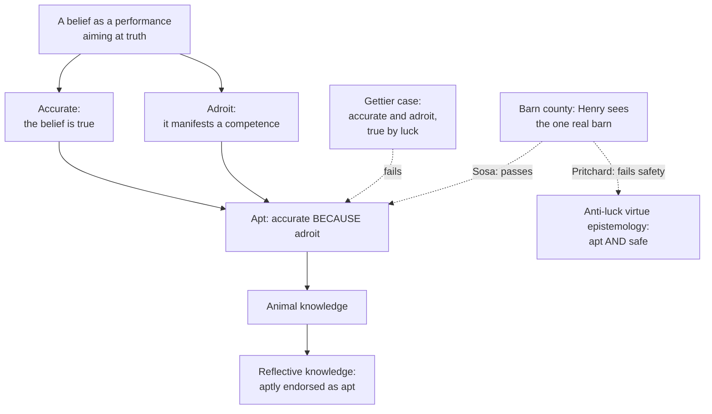

# Epistemology · Lesson 2.5: Virtue epistemology

> ⏱ ~15 min · Module 2: The structure of justification · Builds on: [1.1 Repairing JTB](01-01-repairing-jtb.md), [1.3 Why knowledge?](01-03-why-knowledge.md), [2.4 Reliabilism](02-04-reliabilism.md), [ethics 4.3 Modern virtue ethics](../../ethics/lessons/04-03-modern-virtue-ethics.md) · Unlocks: [3.1 The closure argument](03-01-the-closure-argument.md); Module 2 boss problem

## Why this matters

Every theory so far has graded a *belief*: is it inferred from a truth, sensitive, safe, produced by a reliable process? Virtue epistemology grades the *believer*. Knowledge, on this view, is what you get when a thinker's success is owed to her own cognitive excellence, the way a hit is owed to an archer's skill. The move promises three things at once: a fresh diagnosis of Gettier cases, an answer to the value problem from [1.3](01-03-why-knowledge.md), and a bridge between epistemology and ethics. Each promise meets a hard case, and this lesson runs them.

## The idea

Watch an archer. A shot can hit the target or miss. It can be skilful or clumsy. And it can hit *because* it was skilful, or hit by a fluke despite being skilful: a gust blows a well-aimed arrow off course and a second gust blows it back. Only the last kind of hit is fully creditable to the archer.

Ernest Sosa's proposal is that a belief is a performance like a shot. It aims at truth. It can be true (hit), the product of a competence (skilful), and true *because* of the competence. The Gettier victim is the archer with the two gusts: skilful, successful, but successful by luck, not by skill.

Two families share the name. **Reliabilist** virtue epistemology (Sosa, Greco) counts as "virtues" stable truth-conducive faculties: perception, memory, competent inference. It is [2.4](02-04-reliabilism.md)'s reliabilism with the agent's abilities put at the centre. **[Responsibilist](../reference.md#responsibilist-virtue-epistemology)** virtue epistemology (Zagzebski, Code, Montmarquet, Baehr) counts as virtues character traits a person can be praised for: open-mindedness, intellectual courage, intellectual humility, carefulness. The first is about what your faculties can do; the second about what kind of inquirer you are.

## The argument

**Sosa's AAA analysis** (*A Virtue Epistemology: Apt Belief and Reflective Knowledge*, vol. 1, 2007). A performance aiming at a goal is

- **accurate** iff it reaches its aim (the belief is true);
- **adroit** iff it manifests a competence of the performer (the belief issues from a reliable cognitive ability, exercised in suitable conditions);
- **apt** iff it is accurate *because* adroit ([apt belief](../reference.md#apt-belief)).

In words: aptness is not accuracy plus adroitness; it is accuracy explained by adroitness. Then:

- **Animal knowledge** that $p$: an apt belief that $p$.
- **Reflective knowledge** that $p$: an apt belief that $p$, aptly endorsed by the subject's apt second-order belief that her first-order belief is apt.

In words: animal knowledge is skilled success; reflective knowledge adds a skilled grasp, from the inside, that the success is skilled. (The second tier is Sosa's way of honouring internalist intuitions from [1.4](01-04-internalism-and-externalism.md) without making them necessary for all knowledge.)

**Greco's [credit theory](../reference.md#credit-theory-of-knowledge)** (*Achieving Knowledge*, 2010): S knows that $p$ iff S believes $p$ truly *because* of S's intellectual ability, so that the true belief is creditable to S. Greco reads "because of" as explanatory salience: the ability is the salient part of the explanation of why S got it right.

The shared argument, in standard form:

1. **Knowledge is a kind of cognitive success**: true belief is the aim, and knowledge is getting it in the right way.
2. **Success in the right way is success from ability**: an achievement, creditable to the agent. *In words:* the right way is the way an archer's skilled hit differs from a lucky one.
3. **In a Gettier case the subject's success is not from ability**: her competence is engaged, but luck, not competence, explains why the belief is true.
4. ∴ **Knowledge is true belief from ability (apt or creditable belief), and Gettier cases fail it.**
5. **Achievements are finally valuable**, valuable for their own sake, not only for what they produce.
6. ∴ **Knowledge is more valuable than mere true belief**, even when the true belief is equally useful.

In words: steps 5 and 6 reply to the swamping problem from [1.3](01-03-why-knowledge.md). The extra value of knowledge does not come from a reliable process sitting behind a truth (which swamping says adds nothing); it comes from the success being *the agent's* success. Riggs, Greco and Sosa all run versions of this.

**Where the argument is weakest.** Premise 2, read as an identity, is attacked from both sides. *Ability without knowledge:* in [fake barn county](../reference.md#fake-barn-case) ([1.1](01-01-repairing-jtb.md); Goldman 1976, crediting Ginet), Henry's barn-recognition ability is exercised and explains his hit on the one real barn, yet the majority verdict is that he does not know. *Knowledge without much credit:* Jennifer Lackey ("Why We Don't Deserve Credit for Everything We Know", 2007; developed 2009) describes Morris, newly arrived at a Chicago train station, who asks a passer-by the way to the Sears Tower and is told, correctly, that it is two blocks east. Morris knows, but the credit for his true belief seems to belong to the passer-by. Duncan Pritchard ("Anti-Luck Virtue Epistemology", *Journal of Philosophy*, 2012) concludes that ability is necessary but not sufficient ([anti-luck virtue epistemology](../reference.md#anti-luck-virtue-epistemology)), and adds a separate [safety](../reference.md#safety) condition: S knows iff S's *safe* true belief is the product of her relevant cognitive abilities, to a significant degree creditable to her. His case for keeping ability as well: Temp reads room temperatures off a thermometer that is in fact broken and fluctuating at random, but a hidden agent adjusts the thermostat so that the room always matches the reading. Temp's beliefs are safe, yet his success owes nothing to his ability, and Pritchard judges that he does not know. The cost of Pritchard's repair is premise 6: if knowledge is not identical to achievement, the achievement answer to the value problem no longer covers all knowledge.

## Responsibilism and its challenge

Linda Zagzebski (*Virtues of the Mind*, 1996) gives a responsibilist *analysis*: an act of intellectual virtue requires (i) an intellectually virtuous motive, (ii) doing what an intellectually virtuous person would characteristically do in the situation, and (iii) reaching the truth because of (i) and (ii); knowledge is belief arising from acts of intellectual virtue. Because clause (iii) builds success in, her account entails truth and so escapes her own inescapability argument from [1.1](01-01-repairing-jtb.md); the cost is that a skilled but unmotivated perceiver, or a small child, seems to know without virtuous motive. Code (*Epistemic Responsibility*, 1987), Montmarquet (*Epistemic Virtue and Doxastic Responsibility*, 1993) and Baehr (*The Inquiring Mind*, 2011) mostly do not analyse knowledge at all; they study the traits of good inquiry for their own sake. Quassim Cassam (*Vices of the Mind*, 2019) maps the negative side: closed-mindedness, wishful thinking, epistemic insouciance.

The parallel with ethics is direct: responsibilist virtues are character traits, and [ethics 4.3](../../ethics/lessons/04-03-modern-virtue-ethics.md) showed that character traits face the situationist challenge. Mark Alfano ("Expanding the Situationist Challenge to Responsibilist Virtue Epistemology", *Philosophical Quarterly*, 2012) presses the epistemic version as an inconsistent triad: we have much knowledge (anti-skepticism); intellectual character traits are not robust across situations (epistemic situationism); knowledge requires acting from such traits (responsibilist virtue epistemology). One has to go. The responsibilist can deny the situationist premise, weaken the analysis so that low-level faculties suffice (moving toward the reliabilist family), or, as Code and Montmarquet do, stop analysing knowledge.

## The picture

Solid arrows build the analysis. Dashed arrows run the two hard cases: the Gettier case fails aptness; the barn-county case is the one where the views part.

## Worked examples

**Example 1 (clean case: the radiologist).** Dr Osei, a skilled radiologist, reads a wrist X-ray. *Version A:* she sees the fracture line and believes the wrist is fractured; it is. Accurate (true), adroit (her trained reading skill is exercised in normal conditions), apt (the skill explains why she got it right). Animal knowledge, on Sosa's view; credit, on Greco's; and her belief is safe, so Pritchard agrees. *Version B:* the film has a processing artefact that looks exactly like a fracture line, and she reads it as one; the wrist happens to have a hairline fracture elsewhere that the film does not show. Accurate: yes. Adroit: yes, the same skill was exercised. Apt: no, because what explains her being right is the coincidental hidden fracture, not her reading. So Version B is a Gettier case and every virtue theory denies knowledge, by the *because* clause. Notice that the verdict is driven by aptness alone: neither accuracy nor adroitness changed between the versions.

**Example 2 (hard case: barn county, run strictly).** Henry drives through a district full of barn façades and looks at the one real barn. Accurate: yes. Adroit: his competence is exercised. Apt? Here the theory stops giving a verdict until one says what a competence is relative to. Sosa considers three options: the competence is absent in this environment, so not adroit; it is present but does not manifest, because luck overwhelms skill; or the belief is apt. He takes the third and bites the bullet: Henry has animal knowledge but lacks reflective knowledge, since he could not aptly endorse his perceptual belief there. Pritchard counts the belief as unsafe (in close worlds he looks at a façade and believes falsely) and so denies knowledge. A credit theorist can instead relativize abilities to environments: Henry's barn-spotting ability is reliable on ordinary farmland, not in this county, so he has no relevant ability here. Each option has a cost. Biting the bullet contradicts that majority verdict; Pritchard's repair gives up the identity of knowledge and achievement; the relativizing move must say which environment counts, which is the [generality problem](../reference.md#generality-problem) from [2.4](02-04-reliabilism.md) in a new form.

## Watch out

- **You might think aptness is accuracy plus adroitness, but** the Gettier victim has both. Aptness is the explanatory link between them, and every verdict in this lesson turns on it.
- **You might think virtue epistemology is just reliabilism renamed, but** the reliabilist family relocates the reliable process in the agent's abilities and adds the *because* clause, which bare process reliabilism lacks; that clause is what handles Gettier cases and grounds the value answer.
- **You might think responsibilists all propose rival analyses of knowledge, but** only some do (Zagzebski). Others study intellectual character without claiming it is necessary for knowledge, which matters for whether Alfano's triad touches them.

## One-liner

> Knowledge is a hit that is to the archer's credit; barn county and the Chicago visitor test whether credit is the whole story.

## Problems

**P1 (🟢) *(Exegetical.)*** Ama is an experienced birder. Through binoculars she sees a small bird with a yellow throat and black mask and believes "that is a common yellowthroat." It is one. But the "mask" she saw was a shadow from a branch; the bird's real mask was turned away, and she would have identified any yellow-throated bird with that shadow as a yellowthroat. (a) Is her belief accurate, adroit and apt on Sosa's definitions? One line each. (b) Does she have animal knowledge, reflective knowledge, or neither? 60 words or fewer.

**P2 (🟡) *(Evaluative.)*** Build a case, not involving barns, fake objects, testimony from strangers, or instruments, in which a subject gains knowledge but the credit for her true belief seems to belong mostly to someone or something else, so that Greco's credit theory is pressed. Then give the credit theorist's best reply and say, in one sentence, what it costs. 150 words or fewer.

**P3 (🔴) *(Exegetical (a) · Evaluative (b).)*** An invented post on a study-skills forum:

> "Virtue epistemology is dead. Studies show people reason worse when tired, rushed or in a bad mood, so nobody has stable intellectual virtues. And if knowledge needs virtue, it follows that nobody knows anything, including the epistemologists. Stick to reliable methods."

(a) Name the two distinctions from this lesson that the post ignores, one sentence each. (b) Say which leg of Alfano's triad the post's conclusion abandons, and give the responsibilist's best alternative to abandoning it, with its cost. 120 words or fewer for (b).

Solutions

**P1** *(Exegetical, strict)*

**Must hit, strict (a):**

- Accurate: yes, the belief is true.
- Adroit: yes, her identification skill is exercised (she is an experienced birder using her trained recognition in normal viewing conditions).
- Apt: no. What explains her being right is that the shadow happened to fall where a mask would be on a bird that happened to be a yellowthroat; her skill responded to a shadow, not to the bird's features, so the truth is not explained by the competence.

**Must hit, strict (b):** neither. Animal knowledge requires apt belief, which she lacks; reflective knowledge requires an apt first-order belief to endorse, so it fails too.

**Wrong turns:** calling the belief inapt because it is unreliable in general (her skill is reliable; the failure is in this exercise); granting reflective knowledge because she would confidently endorse the belief (an endorsement of an inapt belief cannot be apt endorsement of an apt one).

**Model answer:** (a) Accurate: true. Adroit: her trained skill was exercised. Apt: no; her success is explained by the lucky shadow, not her competence. (b) Neither: no apt first-order belief, so no animal knowledge, and nothing apt for reflection to endorse.

---

**P2** *(Evaluative)*

**Accept:** any case where (i) the subject plausibly knows, (ii) her own contribution to getting it right is minimal relative to another source, and (iii) the case avoids the excluded setups. Teacher-to-pupil, textbook, map or recipe cases all qualify if testimony is not from a stranger.

**Must hit, any verdict:**

- A case meeting the Accept criterion, with the knowledge verdict stated.
- The credit theorist's best reply: credit can be shared, so the knower's true belief is a cooperative success to which her own ability (choosing a good source, understanding the claim, monitoring for signs of unreliability) still contributes as a salient part of the explanation; or "because of ability" is context-sensitive and lowered in testimonial settings.
- The cost: the reply weakens "creditable to S", which threatens premise 5–6 (the value answer) or makes the ability condition so easy to meet that it no longer explains why Gettier victims fail it.

**Wrong turns:** a case where the subject does not know (that tests sufficiency, not necessity); answering as if credit theory said nothing about testimony.

**Model answer, one of several:** A nine-year-old asks her chemistry-teacher mother why ice floats and is told it is less dense than water. She now knows it, but the explanatory work was done by her mother's expertise; her own contribution was asking. Greco's reply: knowledge here is a joint achievement, and the child's ability (to pick a competent source, to understand the answer, to have rejected a nonsensical one) is part of the salient explanation, so credit is shared rather than absent. Cost: if this thin contribution counts as salient ability, a Gettier victim's equally exercised ability looks salient too, so the *because* clause risks losing the work it did in the Gettier diagnosis.

---

**P3** *(Exegetical (a) · Evaluative (b))*

**Must hit, strict (a):**

- Reliabilist vs responsibilist virtue: the studies concern character-like traits and reasoning performance, while reliabilist "virtues" are faculties such as perception and memory, which the post itself trusts under the name "reliable methods".
- Responsibilists who analyse knowledge (Zagzebski) vs those who do not (Code, Montmarquet, Baehr): the inference to "nobody knows" needs the analytic thesis, which many responsibilists do not hold. (Credit also: global vs local traits from ethics 4.3, since unstable global traits do not show there are no stable local ones.)

**Must hit, any verdict (b):**

- The conclusion abandons anti-skepticism (the claim that we have much knowledge).
- One alternative the responsibilist prefers: deny epistemic situationism (the studies show performance varies, not that no robust traits exist, or that virtue is rare but approachable), or drop the claim that knowledge requires character virtue. Its cost stated: the first must explain the data; the second gives up responsibilism as an analysis of knowledge.

**Wrong turns:** agreeing that skepticism follows (the triad says one leg goes, not which); treating Alfano as a skeptic (he presents a triad, not a verdict for skepticism).

**Model answer (b), one of several:** The post keeps situationism and the responsibilist analysis and gives up anti-skepticism. A responsibilist would rather give up the analysis: knowledge can be had through reliable faculties, while intellectual character governs the quality of inquiry, which is Code's and Montmarquet's project anyway. The cost is that responsibilist virtue no longer explains what knowledge is, so it cannot claim to solve Gettier or the value problem.

## Flashback

**From Lesson [2.3](02-03-coherentism.md) (Coherentism):** *(Formal (a)–(b) · Exegetical (c).)* Your prior probability that the river path was flooded on Tuesday ($A$) is $\tfrac14$. Two cyclists say it was. Cyclist 1 reports $A$ with probability $0.6$ if $A$ is true and $0.3$ if false; cyclist 2 with probability $0.9$ if true and $0.3$ if false. (a) If the reports are conditionally independent given $A$ and given $\neg A$, find $\Pr(A \mid E_1 \wedge E_2)$ using odds. (b) Suppose instead cyclist 2 never saw the path and simply repeats whatever cyclist 1 says, so that given $E_1$ she reports $A$ with probability 1 whether or not $A$. Find $\Pr(A \mid E_1 \wedge E_2)$. (c) In one sentence: which assumption of the agreeing-witnesses argument does (b) show is doing the work?

Solution

(a) Prior odds $\tfrac{1/4}{3/4} = \tfrac13$. Likelihood ratios $L_1 = 0.6/0.3 = 2$ and $L_2 = 0.9/0.3 = 3$. Posterior odds $\tfrac13 \times 2 \times 3 = 2$, so

$$\Pr(A \mid E_1 \wedge E_2) = \frac{2}{1+2} = \frac23 .$$

Check directly: $\tfrac14 (0.6)(0.9) = 0.135$ and $\tfrac34 (0.3)(0.3) = 0.0675$, and $0.135 / 0.2025 = \tfrac23$.

(b) Given $E_1$, the second report has likelihood ratio $1/1 = 1$, so it changes nothing: posterior odds $\tfrac13 \times 2 = \tfrac23$, and

$$\Pr(A \mid E_1 \wedge E_2) = \frac{2/3}{1 + 2/3} = \frac25 = 0.4 .$$

**Must hit, strict (c):** conditional independence: agreement multiplies credibility only when each report is an independent response to the facts; a report that copies another adds no likelihood ratio of its own, however much the two "agree".

**Wrong turns:** in (b), still multiplying by $L_2 = 3$ (that ratio was computed for an independent observer, not a copier); in (c), answering "individual credibility" (cyclist 2's would-be credibility was fine in (a); what (b) removes is independence).

## Connections

- **Backward:** the archer's two gusts are Zagzebski's double-luck recipe from [1.1](01-01-repairing-jtb.md), and Zagzebski's own analysis evades the recipe by entailing truth. Pritchard's [safety](../reference.md#safety) is [1.2](01-02-sensitivity-and-safety.md)'s condition, and the achievement answer replies to the [swamping problem](../reference.md#swamping-problem) of [1.3](01-03-why-knowledge.md). Reflective knowledge is Sosa's concession to [access internalism](../reference.md#access-internalism) ([1.4](01-04-internalism-and-externalism.md)), and the reliabilist family inherits the [generality problem](../reference.md#generality-problem) of [2.4](02-04-reliabilism.md).
- **Forward:** Module 2's boss asks for virtue epistemology's verdicts beside three rival theories. Lackey's Chicago visitor returns in [4.4](04-04-testimony.md), where testimony is studied as a source in its own right. Module 3 then asks whether any of these theories, virtue epistemology included, can meet the skeptic, starting from [3.1](03-01-the-closure-argument.md).
- **Sideways:** [ethics 4.2](../../ethics/lessons/04-02-aristotle-virtue-and-practical-wisdom.md) supplied virtue as a settled state and practical wisdom as trained perception; virtue epistemology transposes that structure to belief. [Ethics 4.3](../../ethics/lessons/04-03-modern-virtue-ethics.md) promised the situationist challenge would carry over, and Alfano's triad is that challenge here.
