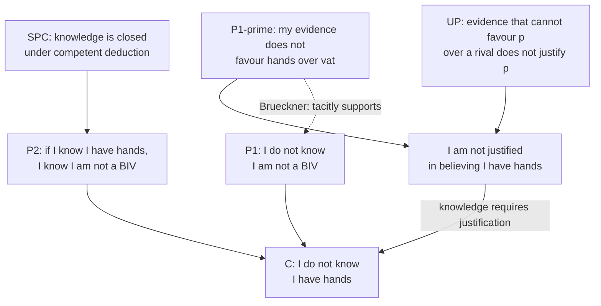

# Epistemology · Lesson 3.1: The closure argument

> ⏱ ~15 min · Module 3: Skepticism about the external world · Builds on: [1.2 Sensitivity and safety](01-02-sensitivity-and-safety.md), [1.4 Internalism and externalism](01-04-internalism-and-externalism.md), [2.4 Reliabilism](02-04-reliabilism.md) · Unlocks: [3.2 Denying closure](03-02-denying-closure.md), [3.3 Moore and the dogmatist](03-03-moore-and-the-dogmatist.md), [3.4 Contextualism and its rivals](03-04-contextualism-and-its-rivals.md)

## Why this matters

Module 2 asked how justified beliefs hang together. This module asks whether any belief about the world outside your head is knowledge at all. The skeptic's best argument does not demand certainty, and it does not claim you are probably deceived. It needs two premises: that you cannot know you are not radically deceived, and a principle about deduction that almost every epistemologist accepts. Each of the next three lessons is a way of resisting it, and each has a price. You can't judge the prices until the argument is stated so that it is plainly valid.

## The idea

Descartes, in *Meditations* I (1641), does not doubt his beliefs one at a time. He looks for a hypothesis that would leave his experience exactly as it is while making his beliefs about the world false. He tries two. First, he could be **dreaming**: he has often dreamt he was sitting by the fire when he was in bed. Second, and more radically, a deceiver could be feeding him every experience he has. In the Veitch translation this is "some malignant demon, who is at once exceedingly potent and deceitful".

The modern version swaps the demon for a machine. You are a **brain in a vat**: a brain kept alive in nutrients, wired to a computer that sends it exactly the signals a body would get. Hilary Putnam gave the case its standard form in *Reason, Truth and History* (1981). He used it to argue that the hypothesis defeats itself: on his semantic externalism, a vat-brain's word "vat" could not refer to real vats. That reply belongs to [`philosophy-of-language-and-logic`](../../philosophy-of-language-and-logic/syllabus.md). The case is also named, as a stock thought experiment, in [philosophical-method 3.3](../../philosophical-method/lessons/03-03-thought-experiments.md).

Call any such scenario a **skeptical hypothesis**: one that (i) is incompatible with things you ordinarily believe, and (ii) predicts exactly the experiences you are having. Here is the key move. The skeptic does not need you to believe the hypothesis, or even to think it likely. She needs only the claim that you **don't know it is false**. Then she uses a principle about deduction to carry that ignorance back to your everyday beliefs.

## Source

Descartes, *Meditations* I (Veitch translation, 1901 edition):

> How often have I dreamt that I was in these familiar circumstances, that I was dressed, and occupied this place by the fire, when I was lying undressed in bed? At the present moment, however, I certainly look upon this paper with eyes wide awake; the head which I now move is not asleep; I extend this hand consciously and with express purpose, and I perceive it; the occurrences in sleep are not so distinct as all this. But I cannot forget that, at other times I have been deceived in sleep by similar illusions; and, attentively considering those cases, I perceive so clearly that there exist no certain marks by which the state of waking can ever be distinguished from sleep, that I feel greatly astonished; and in amazement I almost persuade myself that I am now dreaming.

Notice how the passage turns. Descartes first offers a mark of waking: experience in sleep is less distinct. Then he withdraws it, because he has been fooled by experiences just as vivid. The real premise is "no certain marks" that tell waking from sleep. That is a claim about his **evidence**: nothing in it favours waking over dreaming. Keep it in mind. It returns below as the second form of the argument.

## The argument

Fix three abbreviations. $H$: *I have hands*. $B$: *I am a handless brain in a vat*. $K(p)$: *I know that $p$*. ($B$ is built to be **incompatible** with $H$, so $H$ entails $\neg B$, "I am not a handless BIV".)

**The principle.** [Single-premise closure](../reference.md#closure-principle), in the careful form John Hawthorne defends ("The Case for Closure"), close to the "intuitive closure" Timothy Williamson states in *Knowledge and Its Limits* (2000):

> **SPC.** If $S$ knows $p$, competently deduces $q$ from $p$, and thereby comes to believe $q$, while retaining knowledge of $p$ throughout, then $S$ knows $q$.

In words: deducing something from what you know, correctly and while still knowing the starting point, is a way of coming to know it. Every clause does work. "Competently deduces" rules out lucky guesses about what follows. "Thereby comes to believe" requires that the belief rest on the deduction. "Retaining" covers the case where you lose the premise partway.

**Form A: the closure argument** (the [brain-in-a-vat argument](../reference.md#brain-in-a-vat-argument)).

- **P1.** $\neg K(\neg B)$. I don't know that I'm not a handless BIV.
- **P2.** $K(H) \to K(\neg B)$. If I know I have hands, I know I'm not a handless BIV. *(From SPC, given that I have done the obvious deduction.)*
- **∴ C.** $\neg K(H)$. I don't know I have hands. *(Modus tollens.)*

In words: if knowing $H$ would let you deduce your way to knowing $\neg B$, and you can't know $\neg B$, then you don't know $H$. Why P1? Because everything you could cite against $B$ would look exactly the same if $B$ were true. The belief that you are not envatted is also [insensitive](../reference.md#sensitivity): if you were envatted, you would still believe you weren't.

**Why closure is hard to give up.** Deduction is how knowledge grows. You know the dosage is 40 mg/kg and the patient weighs 50 kg, so you come to know the dose is 2,000 mg. If competent deduction from known premises could fail to give knowledge, then proof itself, in mathematics, law and engineering, would be an unreliable way to extend what you know. Most epistemologists accept single-premise closure. Rejecting it in the skeptical case means saying "I know I have hands, but I don't know I'm not a handless BIV". Keith DeRose called this an "abominable conjunction", and [3.2](03-02-denying-closure.md) weighs it.

**Closure vs transmission.** Keep two principles apart ([card](../reference.md#closure-and-transmission)):

- **Closure** says that if you know $p$, then knowledge of what $p$ obviously entails is available to you by deduction. It says nothing about *what* your knowledge of $q$ rests on.
- **Transmission** is stronger. It says that the *grounds* that support $p$ thereby support $q$, so that a deduction from $p$ can be your **first** route to warrant for $q$.

Peter Klein (*Certainty*, 1981) separated the two: you can deny that evidence for $p$ is always evidence for what $p$ entails and still accept closure. Your visual experience of hands is not evidence against $B$, since $B$ predicts that very experience. That shows transmission fails here. It does not show closure fails. Crispin Wright (1985) and Martin Davies (1998) developed transmission failure, and [3.3](03-03-moore-and-the-dogmatist.md) owns it.

**Form B: the [underdetermination argument](../reference.md#underdetermination-argument)** (Anthony Brueckner, "The Structure of the Skeptical Argument", 1994; Duncan Pritchard, *Epistemic Luck*, 2005).

- **UP.** If $S$'s evidence does not favour $p$ over some incompatible hypothesis $q$, then $S$ is not justified in believing $p$.
- **P1′.** My evidence does not favour $H$ over $B$.
- **P2′.** Knowing requires being justified.
- **∴ C.** $\neg K(H)$.

In words: when your evidence can't break a tie between your belief and a known rival, you are not entitled to the belief. This is the Source's "no certain marks" premise, made general.

Form B is a **distinct** argument. It contains no entailment and no closure principle; it needs only an incompatible rival. Its premise concerns how well your evidence discriminates, not what you can deduce. Brueckner argued that the closure argument's P1 tacitly relies on underdetermination. Pritchard treats the two as separate arguments. The practical upshot is that a response which denies closure has not yet touched Form B.

**Where the argument is weakest.** Both premises of Form A carry weight, and the critics divide. Anti-skeptics who keep closure attack **P1**: they hold that you *can* know you are not envatted, perhaps by deducing it from the very knowledge the skeptic questions ([3.3](03-03-moore-and-the-dogmatist.md)), or that "know" sets laxer standards outside the seminar ([3.4](03-04-contextualism-and-its-rivals.md)). Their critic says this begs the question, or changes the subject. Closure-deniers attack **P2** ([3.2](03-02-denying-closure.md)), and their critic points to the abominable conjunction. Against Form B the target is **P1′**. Some deny that your evidence is the same in the good case and the vat case, for instance if evidence is knowledge ([E = K](../reference.md#e-equals-k)).

## The argument map

Two routes meet at one conclusion. Closure feeds only the left route, so cutting it leaves the right route standing.

## Worked examples

**Example 1 (clean case: closure on its home ground).** Lena knows that 91 = 7 × 13. She deduces "91 is not prime", believes it on that basis, and never stops knowing the product. SPC's clauses: known premise ✓, competent deduction ✓, belief formed by the deduction ✓, retention ✓. So SPC says she knows that 91 is not prime. That is plainly right. This is the work closure does every day.

Now run the same template on $H$ and $\neg B$. Deducing $\neg B$ from $H$ is trivial, and the clauses are met as long as you actually reason it through. So the question is no longer whether closure applies. It is whether the premise, knowledge of $H$, is there to begin with. That is why the skeptic attacks $K(H)$ by modus tollens, not $K(\neg B)$ by modus ponens. She turns closure's everyday job around.

**Example 2 (hard case: the hypothesis has to entail the denial).** Try Descartes's dream as a closure argument. Let $F$ be "I am sitting by the fire" and $D$ be "I am dreaming". Does $F$ entail $\neg D$? No. You could be dozing in the chair by the fire. So $K(F) \to K(\neg D)$ is not an instance of SPC, and Form A stalls. The fix is to build the hypothesis so it is incompatible with $F$: $D^*$, "I am dreaming I'm by the fire while lying in bed", which is Descartes's own example. Then $F$ entails $\neg D^*$ and the argument goes through. **Lesson:** a closure argument only works if the hypothesis is chosen to *contradict* the target belief. A merely unsettling hypothesis is not enough.

The demon strains the model in another way. Descartes goes on to doubt even that two and three make five. No skeptical hypothesis about *perception* is incompatible with arithmetic: a vat-brain's sums come out the same. So he supposes that God might deceive him whenever he adds. That is not a closure argument. It is a doubt about the reliability of his own reasoning: higher-order evidence, not a rival that his evidence fails to rule out. Form A has a limited scope. It threatens what you believe about the world, not everything you believe.

## Watch out

- **You might think the skeptic claims you are probably envatted, but** her premises are only that you don't know you aren't, plus closure. Assigning the vat hypothesis a tiny probability does not refute P1, since high probability is not knowledge (recall the lottery in [1.2](01-02-sensitivity-and-safety.md)).
- **You might think closure says that if you know $p$, you know everything $p$ entails, or that you know that you know $p$, but** SPC covers only *competent deduction actually performed*, with the premise retained. It says nothing about knowing that you know. That is the [KK principle](../reference.md#kk-principle), a separate and far more contested claim.
- **You might think "my experience of hands isn't evidence against being a BIV" refutes closure, but** that is a failure of transmission. Closure lets knowledge of $\neg B$ come from knowledge of $H$, whatever grounds $H$ itself.

## One-liner

> The skeptic never proves you're in a vat: she shows that knowing your hands would give you knowledge that you aren't in one, and asks where that knowledge came from.

## Problems

**P1 (🟢) *(Exegetical.)*** Dana watched the 7:10 ferry pull away from the dock at Halsey, so she knows that the ferry left at 7:10. Let $q$ be "the ferry did not leave at 7:30". For each scenario, say whether SPC (as stated in this lesson) **entails** that Dana knows $q$, and name the clause that decides it. One sentence each.

(i) Dana reasons, "It left at 7:10, so it didn't leave at 7:30", and believes $q$ because of that reasoning.

(ii) Dana believes $q$ only because a stranger on the pier says the ferry is never late. She never connects it to what she saw.

(iii) Dana starts the deduction, but before she finishes, a harbour clerk wrongly tells her the 7:10 was cancelled. She gives up her belief that it left at 7:10, yet keeps believing $q$ out of momentum.

**P2 (🟡) *(Exegetical (a) · Evaluative (b).)*** An invented forum post:

> "Closure is obviously false. Closure says that if I know I have hands, I must also know that I know it, and that my evidence for hands has to count against being a brain in a vat. But my visual experience of hands is exactly what a vat-brain would have, so it can't count against the vat at all. So closure fails, and the skeptic loses her best premise."

(a) Name the two distinct principles the poster mistakes for closure, quoting the phrase for each, and say in one sentence each how they differ from SPC. (b) The poster's underlying observation, that the experience is the same either way, is a real skeptical point. Say which premise of which form of the skeptical argument it supports, and whether denying closure would answer it. 100 words or fewer for (b).

**P3 (🔴) *(Formal (a) · Evaluative (b).)*** Let $H$, $B$ and $K$ be as in the lesson. Let $D$ be: *I have competently deduced $\neg B$ from $H$, believe $\neg B$ on that basis, and retained knowledge of $H$ throughout.* The honest instance of SPC is then $(K(H) \wedge D) \to K(\neg B)$.

(a) From this instance and P1, $\neg K(\neg B)$, derive the strongest conclusion you can **without** assuming $D$. Then show that adding $D$ yields $\neg K(H)$. Show each step and name its rule.

(b) A reader proposes escaping the skeptic by never performing the deduction from $H$ to $\neg B$. In 80 words or fewer, say whether (a) supports the escape, and what the skeptic can reply.

Solutions

**P1** *(Exegetical, strict.)*

**Must hit, strict:**

- (i) Yes. Every clause of SPC holds: known premise, competent deduction, belief formed by the deduction, premise retained. So SPC entails she knows $q$.
- (ii) No. SPC is silent, because the "thereby comes to believe" clause fails: her belief in $q$ does not rest on the deduction. (She may have propositional justification for $q$; SPC concerns beliefs formed by deducing.)
- (iii) No. SPC is silent, because the retention clause fails: she stopped believing, and so stopped knowing, the premise before the deduction finished.

**Wrong turns:** saying SPC entails she does *not* know $q$ in (ii) or (iii). SPC gives a sufficient condition, so when its antecedent fails it gives no verdict either way. Another wrong turn is treating (iii) as fine because $q$ is in fact true.

**Model answer:** (i) Yes: every clause is met. (ii) Not entailed: she didn't come to believe $q$ by deduction from what she knows. (iii) Not entailed: she lost her knowledge of the premise during the deduction, so the retention clause fails.

---

**P2** *(Exegetical (a) · Evaluative (b).)*

**Must hit, strict (a):**

- "I must also know that I know it": the **KK principle**. It concerns knowing that you know, not knowing what follows from what you know, and SPC does not imply it.
- "my evidence for hands has to count against being a brain in a vat": **transmission** of evidence or warrant across entailment. SPC requires only that knowledge of $\neg B$ be available by deduction from knowledge of $H$, not that the grounds for $H$ be grounds for $\neg B$. So a failure of transmission is not a failure of closure.

**Must hit, any verdict (b):**

- It supports **P1′ of the underdetermination form** (my evidence does not favour $H$ over $B$). It also bears on P1 of the closure form, since it is a reason to think I can't know $\neg B$; credit either, but the underdetermination form must be named.
- Denying closure does not answer Form B, which uses no closure premise. An answer must say what *would* engage it: deny UP, or deny that the evidence is the same in both cases (for example, evidence as knowledge).

**Wrong turns:** calling the post's second confusion "circularity"; claiming that the shared experience refutes closure because Dretske denied closure (he did, but not on this ground).

**Model answer (b), one of several:** The observation is the underdetermination premise: my evidence does not favour hands over the vat. With UP, that yields "not justified in believing $H$" without any appeal to closure. So even if the poster were right about closure, the skeptic keeps Form B. To answer it, you must either reject UP (perhaps evidence need not discriminate against every rival) or deny that the vat-brain shares my evidence.

---

**P3** *(Formal (a) · Evaluative (b).)*

**(a) Worked derivation.**

1. $(K(H) \wedge D) \to K(\neg B)$. Premise (SPC instance).
2. $\neg K(\neg B)$. Premise (P1).
3. $\neg (K(H) \wedge D)$. From 1, 2 by modus tollens.
4. $\neg K(H) \vee \neg D$. From 3 by De Morgan.

Line 4 is the strongest conclusion without $D$: *either I don't know $H$, or I haven't done the deduction.* (A truth-table check confirms that $\neg K(H)$ alone does not follow from 1 and 2: take $K(H)$ true, $D$ false, $K(\neg B)$ false.)

5. $D$. Added premise.
6. $\neg K(H)$. From 4, 5 by disjunctive syllogism.

**Must hit, any verdict (b):**

- Acknowledge that (a) does show SPC alone yields only the disjunction, so the escape is formally available against the argument as stated.
- Give the skeptic's reply: the deduction is trivial and the reader has now considered it, so $D$ is easy to make true. Or: restate closure for propositional justification or for being *in a position to know*, so that it needs no performed deduction. In either case, the "escape" turns into knowledge that vanishes the moment you reason, which is a cost.

**Wrong turns:** deriving $\neg K(H)$ from lines 1 and 2 alone (invalid); treating line 4 as an anti-skeptical conclusion.

**Model answer (b), one of several:** Formally, yes: without $D$ the skeptic gets only "either you don't know $H$ or you haven't deduced $\neg B$". But the escape lasts only until you think about it, and you just did. The skeptic can also restate closure as "if you know $p$, you are in a position to know what $p$ obviously entails". That version needs no performed deduction: with P1 read as "I am not in a position to know $\neg B$", modus tollens gives $\neg K(H)$ directly.

## Flashback

**From Lesson [2.4](02-04-reliabilism.md) (Reliabilism):** *(Formal (a)–(b) · Exegetical (c).)* Osric, a night porter, forms the belief *the windows are rattling* by ear, and from it infers *a freight train is passing*. His log of 250 such episodes: the rattling belief was true 200 times; in those 200 episodes the train belief was true 184 times, and in the other 50 it was true 11 times. Take these process types as given, and assume nothing available to Osric undermines either belief. (a) Compute the reliability of the hearing process, the conditional reliability of the inference, and the reliability of the whole hear-then-infer chain. (b) On Goldman's base and recursive clauses, for which thresholds $\theta$ is the train belief justified? For which of those thresholds is the whole chain's reliability below $\theta$? (c) In two sentences: why does the recursive clause use the inference's *conditional* reliability rather than its overall track record?

Solution

**Worked arithmetic (a)–(b):**

$$r_{\mathrm{hear}} = \tfrac{200}{250} = 0.80 \qquad r_{\mathrm{inf}} = \tfrac{184}{200} = 0.92$$

$$r_{\mathrm{chain}} = \tfrac{184 + 11}{250} = \tfrac{195}{250} = 0.78$$

Here $r_{\mathrm{inf}}$ is the proportion of true outputs among episodes with a true input. (b) The base clause makes the rattling belief justified iff $0.80 \ge \theta$; the recursive clause then makes the train belief justified iff, in addition, $0.92 \ge \theta$. So the train belief is justified iff $\theta \le 0.80$. The chain falls below the threshold for $0.78 < \theta \le 0.80$. In that band the theory certifies a belief whose end-to-end process misses its own standard, because errors compound across the stages: only $184/250 = 0.736$ of episodes are true at both stages, and the 11 lucky hits on false inputs lift the chain to 0.78.

**Must hit, strict (c):**

- Conditional reliability isolates what the inference itself contributes: how often it yields truths when fed truths. Its overall record also counts outputs from false inputs, which are errors of the hearing stage, not of the inference.
- The inputs are assessed separately, by the requirement that they be justified. So a good inference is not penalized for bad inputs, and a good inference cannot launder unjustified inputs.

**Wrong turns:** using 195/250 as the inference's reliability in the recursive clause (that counts the hearing errors twice: once in the input condition, once again in the inference); calling the train belief justified at $\theta = 0.85$ because the inference clears it (the rattling belief fails the base clause, so the recursive clause is not met).

**Model answer (c):** The recursive clause asks whether the inference preserves truth, and only its performance on true inputs measures that. Whether the inputs are any good is a separate question, answered by requiring them to be justified, so the inference is neither blamed for its inputs' errors nor allowed to make up for them.

## Connections

- **Backward:** sensitivity ([1.2](01-02-sensitivity-and-safety.md)) explains why P1 is tempting: your belief that you are not envatted would persist if it were false. The demon victim of [1.4](01-04-internalism-and-externalism.md) is the vat-brain seen from the side of justification rather than knowledge. Easy knowledge from [2.4](02-04-reliabilism.md) returns when one tries to know $\neg B$ by deducing it from $H$.
- **Forward:** [3.2](03-02-denying-closure.md) denies P2 (Dretske's zebra, Nozick's tracking) and meets multi-premise closure. [3.3](03-03-moore-and-the-dogmatist.md) denies P1 by Moore's modus ponens and the dogmatist's immediate justification, and takes up transmission failure. [3.4](03-04-contextualism-and-its-rivals.md) keeps both premises but relativizes "know".
- **Sideways:** SPC has a structural cousin in the transfer principle Beta of the consequence argument ([metaphysics 6.1](../../metaphysics/lessons/06-01-determinism-and-the-consequence-argument.md)): a modal status passes across entailment, and denying the transfer is one way out of both arguments. Putnam's semantic reply goes to [`philosophy-of-language-and-logic`](../../philosophy-of-language-and-logic/syllabus.md); the *Meditations* as part of Descartes's system belong to [`modern-philosophy`](../../modern-philosophy/syllabus.md).
