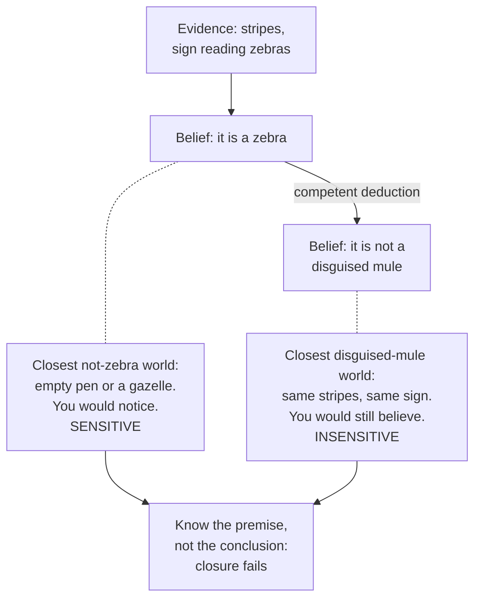

# Epistemology · Lesson 3.2: Denying closure

> ⏱ ~15 min · Module 3: Skepticism about the external world · Builds on: [3.1 The closure argument](03-01-the-closure-argument.md), [1.2 Sensitivity and safety](01-02-sensitivity-and-safety.md) · Unlocks: [3.3 Moore and the dogmatist](03-03-moore-and-the-dogmatist.md)

## Why this matters

[3.1](03-01-the-closure-argument.md) left the skeptic with a valid argument: you don't know you're not a brain in a vat; if you know you have hands, you know you're not a handless brain in a vat; so you don't know you have hands. Something has to give. The boldest reply gives up the principle almost everyone treats as the way deduction extends knowledge: [closure](../reference.md#closure-principle). This lesson states that reply at full strength, shows exactly how a theory of knowledge can *predict* closure failure rather than just declare it, and then counts what the prediction costs. Denying closure is a minority position, but it is the only response that lets you say both "the skeptic is right about the vat" and "I know I have hands" without changing the meaning of "know".

## The idea

Two philosophers reached this reply by different routes, a decade apart.

**Dretske's zebra.** In "Epistemic Operators" (*Journal of Philosophy*, 1970), Fred Dretske imagines you at a zoo, looking at black-and-white striped animals in a pen marked "zebras". You know they are zebras. "They are zebras" entails "they are not mules cleverly disguised by the zoo authorities to look like zebras". Do you know *that*? Dretske says no: you have not checked, and your evidence (stripes, the sign) would look exactly the same if the zoo had done it. So knowledge is not closed under known entailment.

His diagnosis was about **operators**. An operator $O$ (a prefix like "it is true that", "S knows that") is *fully penetrating* if whenever $p$ entails $q$, $O(p)$ entails $O(q)$: "it is true that" is one. A *non-penetrating* operator fails even for the most elementary consequences: "it is strange that there are lions in the zoo" doesn't make it strange that there are animals in the zoo. Dretske held that "knows that" is **semi-penetrating**: it carries over to some consequences (if you know $p \wedge q$, you know $q$; if you know $p$, you know $p \vee q$) but not to all. It fails, he argued, for the consequences that deny **[relevant alternatives](../reference.md#relevant-alternatives)**: to know it's a zebra you must rule out the alternatives that are live in the context (a gazelle, an empty pen), not every possibility incompatible with zebrahood.

**Nozick's tracking account.** In *Philosophical Explanations* (1981), Robert Nozick gave the same result a mechanism. Reloading [1.2](01-02-sensitivity-and-safety.md): his [tracking account](../reference.md#tracking-account) says S knows $p$ (via method $M$) iff

1. $p$ is true;
2. S believes $p$ via $M$;
3. **[sensitivity](../reference.md#sensitivity):** if $p$ were false, S would not believe $p$ via $M$;
4. **adherence:** if $p$ were true, S would believe $p$ via $M$.

In words: your belief has to *co-vary* with the truth in the nearby worlds: absent when $p$ is absent, present when $p$ is present. The counterfactuals are evaluated at the closest worlds where the antecedent holds, the similarity semantics from [metaphysics 4.2](../../metaphysics/lessons/04-02-counterfactual-causation.md).

Now the key structural fact. Sensitivity looks at the closest $\neg p$ worlds. When $p$ entails $q$, the closest $\neg q$ worlds can be much *farther* away, and much stranger, than the closest $\neg p$ worlds. So a belief can track $p$ (where things go wrong in ordinary ways you'd notice) and fail to track $q$ (where things go wrong in an extraordinary way designed to be unnoticeable). Nothing in the definition stops it.

## The argument

The closure-denier's argument, from Nozick's conditions:

1. **Sensitivity is necessary for knowledge.** *In words:* if you'd believe $p$ even were it false, you don't know $p$.
2. **Your belief that you have hands is sensitive and adherent.** The closest worlds without hands are ones where you lost them in an accident; there you see stumps and don't believe you have hands. *In words:* in ordinary error-worlds, your senses would tell you.
3. **Your belief that you're not a handless BIV is insensitive.** In the closest world where you *are* one, your experiences are identical and you'd still believe you aren't. *In words:* the skeptical world is built to be invisible.
4. **You know you have hands, and you know that having hands entails not being a handless BIV.** (From 2, the other conditions met, and elementary logic.)
5. **You do not know you're not a handless BIV.** (From 1 and 3.)
6. **∴ Single-premise closure is false:** you know $p$, competently deduce $q$, and still don't know $q$.

The verdict on the skeptic: the skeptical argument is valid, its first premise is *true*, and its closure premise is false. Nozick took that to be the right shape of an answer: grant the skeptic everything about the vat, concede nothing about the hands.

**Where the argument is weakest.** Premise 1. Step 6 follows only if sensitivity really is a necessary condition, and the cases from [1.2](01-02-sensitivity-and-safety.md) say otherwise: inductive knowledge that the trash I dropped down the chute is in the basement is insensitive, yet looks like knowledge. A critic says the closure failure is not a discovery about knowledge but a symptom of a bad condition: replace sensitivity with [safety](../reference.md#safety) and "I'm not a BIV" comes out safe (the vat world is far), closure is preserved, and the anti-skeptical work is done some other way. The closure-denier must defend sensitivity directly, or find a different condition (Dretske's relevant alternatives) that yields the same failure without the same counterexamples.

## The picture

The inference is valid and you know it is. The asymmetry comes entirely from *which* worlds each belief must answer to.

## Worked examples

**Ex 1 (clean case: the zebra on Nozick's conditions).** Let $Z$ = "it is a zebra", $\neg D$ = "it is not a cleverly disguised mule", method $M$ = looking at the animal in its pen.

- $Z$: true; believed via $M$. Sensitivity: in the closest $\neg Z$ worlds the zoo has no zebras or has put another animal there; you'd see that and not believe $Z$. ✔. Adherence: in nearby $Z$ worlds you'd believe $Z$. ✔. **Known.**
- $\neg D$: true; believed (by deduction from a belief formed via $M$). Sensitivity: in the closest $D$ world the mule is painted perfectly, so you'd still believe $\neg D$. ✘. **Not known.**

So the tracking account predicts, strictly, the verdict Dretske reported by intuition. Note the *dialectical* point: on this view the skeptic's ordinary premises are fine; closure is the casualty.

**Ex 2 (hard case: where the failures spread).** Closure-deniers want closure to fail *only* for "heavyweight" conclusions like $\neg D$ or "I'm not a BIV". Sensitivity does not respect that boundary.

*Conjunction.* Let $H$ = "I have hands", $B$ = "I'm a BIV". Consider $H \wedge \neg B$. The closest worlds where this conjunction is false are worlds where $H$ fails in the ordinary way (an accident), not vat worlds. There I'd not believe the conjunction. So my belief in $H \wedge \neg B$ is **sensitive**, while my belief in $\neg B$ is not. Nozick's view says I know "I have hands and I'm not a BIV" but not "I'm not a BIV". That is a failure of conjunction elimination, which Dretske himself listed among the inferences knowledge obviously survives.

*Kripke's red barn.* Saul Kripke ("Nozick on Knowledge", published in *Philosophical Troubles*, 2011) took a fake-barn county ([1.1](01-01-repairing-jtb.md)) and stipulated that no facade is ever red. Henry looks at a real red barn. "That's a red barn" is sensitive: the closest not-red-barn worlds have a facade of another colour there, which he'd not call red. "That's a barn" is insensitive: the closest not-barn world has a facade he'd take for a barn. So Henry knows *red barn* but not *barn*, an entailment as trivial as any.

The view still issues verdicts; it is not silent. The strain is that the verdicts are hard to believe, and the closure-denier must either accept them or add structure (Nozick's method-relativity, Dretske's relevant alternatives) that confines failures to heavyweight conclusions without being gerrymandered.

**The abominable conjunction.** Even the flagship verdict has a price. Keith DeRose ("Solving the Skeptical Problem", *Philosophical Review*, 1995) called the sentence "I know I have hands but I don't know I'm not a handless BIV" an [abominable conjunction](../reference.md#abominable-conjunction): asserting it sounds like a contradiction, not a sophisticated discovery. The closure-denier says that sounding wrong is not being wrong. The cost is explaining why it sounds so wrong if it is true; DeRose's own answer to the skeptic, which keeps closure, is [3.4](03-04-contextualism-and-its-rivals.md).

**Multi-premise closure.** A second, more widely shared doubt concerns [multi-premise closure](../reference.md#multi-premise-closure): if you know $p_1, \dots, p_n$ and competently deduce their conjunction, you know it. Suppose each premise is known but carries some small chance of error. If the premises are independent and each has probability $0.99$, the conjunction has probability $0.99^n$:

| $n$ | $0.99^n$ |
|---|---|
| 1 | 0.990 |
| 10 | 0.904 |
| 50 | 0.605 |
| 100 | 0.366 |
| 300 | 0.049 |

The conjunction drops below one half at $n = 69$. Risk accumulates, and on any view that ties knowledge to a probability threshold, the conjunction eventually falls below it. Hawthorne's *Knowledge and Lotteries* (2004) treats this tension at length. It is independent of skepticism: many who accept single-premise closure doubt the multi-premise version, and the lottery and preface paradoxes it feeds are [5.1](05-01-credences-and-probabilism.md)'s.

## Watch out

- **You might think closure-denial says the skeptic is wrong about the vat, but** it says the opposite. It concedes the skeptic's first premise in full and rejects only the bridge from hands to not-vat.
- **You might think closure failure means you can't deduce your way to new knowledge at all, but** on both Dretske's and Nozick's views most competent deductions still yield knowledge. The claim is that closure is not *universal*; which instances fail is fixed by the theory's conditions, not by taste.
- **You might think sensitivity and safety disagree here just because they rank worlds differently, but** they use the same similarity ordering. They differ in *which direction* they look: sensitivity at the closest $\neg p$ worlds, safety at the close worlds where you believe $p$. The vat world is the closest $\neg p$ world for "I'm not a BIV" yet far from actuality, which is why one condition fails it and the other passes it.

## One-liner

> Sensitivity lets you know you have hands without knowing you're not a brain in a vat; the price is closure, and the receipts include knowing "red barn" but not "barn".

## Problems

**P1 (🟢) *(Exegetical.)*** Tomas, at the station in Lindmark, reads the departures board: train 14 leaves at 9:10. It does. From this he deduces: (q) "the board has not been hacked to display a fake 9:10 for train 14 while the train actually leaves at some other time." Hacks of this board have never happened and would be undetectable from the platform. (a) Using Nozick's sensitivity condition (method: reading the board), give a verdict on Tomas's belief that train 14 leaves at 9:10 and on his belief in (q), one sentence of reason each. (b) What does the tracking account say about whether Tomas's deduction yields knowledge, and what would Dretske say about whether a hack is a relevant alternative in this context? Two sentences for (b).

**P2 (🟡) *(Formal (a) · Evaluative (b).)*** An auditor knows each of 40 ledger entries is correct, and each entry independently has probability $0.995$ of being correct. She deduces "all 40 entries are correct." (a) Compute the probability of the conjunction exactly and the union-bound lower estimate $1 - n(1-p)$. What is the largest $n$ for which the exact conjunction probability is at least $0.95$? (b) Does your result tell against multi-premise closure, against single-premise closure, or neither? Name the premise a defender of multi-premise closure must deny. 100 words or fewer.

**P3 (🔴, optional) *(Evaluative.)*** Steelman and reply. A closure-denier says: "The abominable conjunction only *sounds* abominable because we hear 'I don't know I'm not a BIV' as conceding that I might well be one. Properly understood it is just true." Give the strongest version of this defence, then the strongest rejoinder, and say whether the rejoinder generalizes to Kripke's red barn verdict. 150 words or fewer.

Solutions

**P1** *(Exegetical (a) · Exegetical (b).)*

(a) The 9:10 belief is **sensitive**: in the closest worlds where train 14 does not leave at 9:10, the timetable was different and the board shows that time, so Tomas would not believe 9:10. The belief in (q) is **insensitive**: in the closest world where (q) is false, the hack displays 9:10, so Tomas, reading the board, would still believe (q).

(b) On the tracking account Tomas knows the premise but not (q), so his competent deduction does not yield knowledge: a closure failure, of the zebra's shape. For Dretske, an undetectable hack that has never happened is not a relevant alternative in an ordinary context, so Tomas knows the train leaves at 9:10 without having ruled it out, and still does not know (q).

**Must hit, strict (a):**

- Premise sensitive, with the closest not-p world described as an ordinary timetable difference shown on the board.
- (q) insensitive, because the closest not-q world is the hack world, where the board looks the same.

**Must hit, strict (b):**

- Knows the premise, not (q): closure fails on the tracking account.
- The hack is not a relevant alternative, so knowing the premise does not require ruling it out.

**Wrong turns:** calling (q) unknown because hacks are improbable (sensitivity is about the closest not-q world, not about probability); saying the premise is insensitive because a hack *could* occur (the closest world where the train leaves at another time is not a hack world).

---

**P2** *(Formal (a) · Evaluative (b).)*

(a) Exact: $0.995^{40} = 0.8183$, so a risk of about $0.182$. Union bound: $1 - 40 \times 0.005 = 1 - 0.20 = 0.80$, a lower estimate just under the exact value. Largest $n$ with $0.995^n \ge 0.95$: $n \le \ln 0.95 / \ln 0.995 = 10.23$, so $n = 10$. Check: $0.995^{10} = 0.9511 \ge 0.95$ and $0.995^{11} = 0.9464 < 0.95$.

(b)

**Must hit, any verdict (b):**

- The arithmetic bears on multi-premise closure only: single-premise closure involves no accumulation, since the conclusion is at least as probable as the one premise it follows from.
- The defender must deny that knowledge requires probability above a fixed threshold (or deny that each premise carries a positive risk once known, e.g. on Williamson's view that what you know has evidential probability 1).
- Some assessment of what that denial costs (e.g. it seems to make the auditor know something she should be only 82 percent confident of).

**Wrong turns:** treating the result as a counterexample to single-premise closure; using the union bound as if it were the exact probability.

**Model answer (b), one of several:** Only against multi-premise closure. Each single-premise step preserves probability, but forty independent risks compound to an 18 percent chance the conjunction is false. A defender must deny that knowledge requires probability above a threshold: knowledge, perhaps, gives each known entry evidential probability 1, so nothing accumulates. The cost is that the auditor is then told she knows a claim she would be irrational to bet on at even 85 percent.

---

**P3** *(Evaluative.)*

**Must hit, any verdict:**

- A defence that separates *not knowing q* from *q being a live possibility*: the sense of abomination comes from hearing the second conjunct as an admission of real doubt, which closure-denial does not make.
- A rejoinder that the oddity survives the clarification: "I know I have hands, and it's not even remotely likely I'm a BIV, but I don't know I'm not one" still sounds wrong, so the explanation is incomplete.
- A judgment on generalization: the red barn verdict ("knows red barn, not barn") involves no skeptical hypothesis and no temptation to hear doubt, so the defence's explanation does not reach it (or: argue that it does, with a reason).

**Wrong turns:** answering that closure is "obviously true" (a verdict, not a rejoinder); treating the abominable conjunction as a formal contradiction (it isn't one; its two conjuncts are consistent).

**Model answer, one of several:** Defence: "I don't know I'm not a BIV" is heard as "I might well be a BIV," which would contradict the first conjunct's confidence. On the tracking view it means only that my belief would persist in the vat world, which is compatible with that world being remote and my hands being known. Rejoinder: add "and the vat world is remote" explicitly and the conjunction still clashes, so the sense of oddity is not just a mishearing; it tracks the thought that what I know settles what it obviously entails. Generalization: the red barn case has no skeptical scenario to mishear, and "knows it's a red barn, doesn't know it's a barn" sounds just as bad. So the rejoinder generalizes and the defence does not.

## Flashback

**From Lesson [2.5](02-05-virtue-epistemology.md) (Virtue epistemology):** *(Exegetical (a) · Evaluative (b).)* Bram, a mountain guide of twenty years, judges from the texture of the snow that a slope is stable. It is, and his trained judgement, exercised in ordinary conditions, is why he got it right. Asked whether his snow judgements can be trusted, he says yes, because a self-help paperback told him that experienced people's gut feelings are always right; he has never checked his record. (a) On Sosa's definitions, does Bram have animal knowledge that the slope is stable? Reflective knowledge? One sentence each, naming the condition each verdict turns on. (b) A critic says that if Bram cannot aptly vouch for his own judgement, crediting him with knowledge of any kind is too generous. Give Sosa's reply and what it costs. 60 words or fewer; any verdict.

Solution

**Must hit, strict (a):**

- Animal knowledge: yes. The belief is accurate, adroit, and accurate *because* adroit, so it is apt.
- Reflective knowledge: no. His second-order belief that his judgement is apt is true, but it rests on a worthless book rather than any competence, so it is not apt, and the first-order belief is not *aptly* endorsed.

**Must hit, any verdict (b):**

- Sosa's reply: knowledge comes in two tiers; the critic's demand is a demand for the reflective tier, which Bram indeed lacks, and the bottom tier is what knowledge in animals and children consists in.
- The cost, named: e.g. the reply concedes the internalist's intuition only for a "higher" grade, so an internalist will say the lower grade is not knowledge at all, or the dispute becomes partly a matter of which tier earns the word.

**Wrong turns:** denying reflective knowledge because the second-order belief is false (it is true; the failure is aptness); denying animal knowledge because Bram cannot explain his skill (aptness does not require that).

**Model answer (b), one of several:** Sosa grants the critic's point at the reflective tier and denies it at the animal tier: skilled success suffices for the lower grade, as in perception generally. The cost is that the internalist intuition is accommodated by relabelling it "reflective", which a critic will call a verbal settlement rather than an answer.

## Connections

- **Backward:** sensitivity, adherence and method-relativity are [1.2](01-02-sensitivity-and-safety.md)'s; the argument being answered and the statement of single-premise closure are [3.1](03-01-the-closure-argument.md)'s; fake-barn county, on which Kripke builds, is [1.1](01-01-repairing-jtb.md).
- **Forward:** [3.3](03-03-moore-and-the-dogmatist.md) keeps closure and runs the argument backwards; [3.4](03-04-contextualism-and-its-rivals.md) keeps closure by letting the standard for "know" shift, and is where DeRose puts the abominable conjunction to work. The risk arithmetic returns as the lottery and preface paradoxes in [5.1](05-01-credences-and-probabilism.md).
- **Sideways:** multi-premise closure has a structural twin in the free-will debate. The transfer principle Beta implies agglomeration (from no choice about $p$ and no choice about $q$, no choice about $p \wedge q$), and the counterexample to agglomeration is a case where two separately secure claims do not combine ([metaphysics 6.1](../../metaphysics/lessons/06-01-determinism-and-the-consequence-argument.md)).
