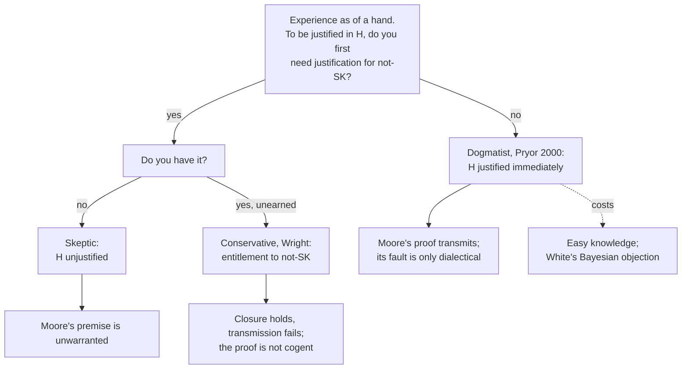

# Epistemology · Lesson 3.3: Moore and the dogmatist

> ⏱ ~15 min · Module 3: Skepticism about the external world · Builds on: [3.1 The closure argument](03-01-the-closure-argument.md), [3.2 Denying closure](03-02-denying-closure.md), [2.2 Foundationalism](02-02-foundationalism.md), [2.4 Reliabilism](02-04-reliabilism.md) · Unlocks: [3.4 Contextualism and its rivals](03-04-contextualism-and-its-rivals.md), Module 3 boss problem

## Why this matters

[3.1](03-01-the-closure-argument.md) gave the skeptic a valid argument: you don't know you're not a handless brain in a vat, closure holds, so you don't know you have hands. [3.2](03-02-denying-closure.md) escaped by denying closure, and paid with the abominable conjunction. This lesson keeps closure and keeps the argument. It just runs it the other way: I know I have hands, so I know I'm not a handless brain in a vat. It feels like cheating. The question is *what exactly* is wrong with it, and the answers split epistemology into camps that disagree about what perception needs before it can justify anything.

## The idea

**Moore's proof.** In a 1939 British Academy lecture, "Proof of an External World", G. E. Moore held up his hands and said, in effect: here is one hand, and here is another; so at least two external objects exist. He claimed the proof met the three conditions any rigorous proof must meet: the premises differ from the conclusion, he *knew* the premises, and the conclusion follows. He offered no proof of "here is a hand"; he claimed to know it. In a later paper, "Four Forms of Scepticism", he made the comparative point explicit: he was more certain that he knew this was a pencil than he was of any premise of the skeptical argument against it. Look up [Moore's proof](../reference.md#moores-proof) on the card.

Turn this into the closure argument of [3.1](03-01-the-closure-argument.md). Write $H$ for "I have hands" and $SK$ for "I am a handless brain in a vat having experiences as of hands". The skeptic and Moore accept the same conditional, *if I know $H$, I know $\neg SK$*. The skeptic runs modus tollens from "I don't know $\neg SK$"; Moore runs modus ponens from "I know $H$". This is [philosophical-method 3.4](../../philosophical-method/lessons/03-04-intuitions-and-reflective-equilibrium.md)'s *one person's modus ponens is another's modus tollens*: neither side reasons invalidly; they differ over which end deserves more confidence.

So the dispute moves to a prior question. **What do you need first?** Before your experience as of a hand can justify you in believing $H$, do you need some justification for $\neg SK$ already in hand? Three answers:

- **The skeptic:** yes, you need it, and you don't have it. So $H$ is unjustified.
- **The conservative** (Crispin Wright): yes, you need it, and you have it by default. Wright calls this an **entitlement**: a warrant you have not earned by evidence, to presuppose things like "my senses are working" that any inquiry must take for granted ("Some Reflections on the Acquisition of Warrant by Inference", 2003). So $H$ is justified, but only *against the background* of the entitlement to $\neg SK$.
- **The dogmatist** (James Pryor, "The Skeptic and the Dogmatist", *Noûs* 2000): no. If it perceptually seems to you that $p$, you thereby have **immediate prima facie justification** for $p$. *Immediate* means it does not rest on justification for any other proposition, including $\neg SK$. *Prima facie* means it can be defeated by a reason to suspect something is wrong; what is not required is a positive reason to think nothing is wrong. See [dogmatism](../reference.md#dogmatism). It is the perceptual special case of [phenomenal conservatism](../reference.md#phenomenal-conservatism) from [2.2](02-02-foundationalism.md).

(The labels clash: Wright's view is called *conservative* and Pryor's *dogmatist* or *liberal*, the opposite of what the words suggest. Learn them as names.)

**Closure versus transmission.** The conservative has a precise charge against Moore, built on a distinction from [3.1](03-01-the-closure-argument.md) that Wright drew in his own 1985 British Academy lecture. [Closure](../reference.md#closure-and-transmission) says: if you are warranted in $P$ and $P$ entails $Q$, there is warrant for $Q$. **Transmission** says something stronger: your warrant for $P$, plus recognizing the entailment, is a way to *acquire* warrant for $Q$, perhaps for the first time. Closure is about what warrant exists; transmission is about where it comes from.

[Transmission failure](../reference.md#transmission-failure) is when closure holds and transmission fails: the argument is valid, the premises are warranted, but only because the conclusion was warranted first. Wright's soccer example: you watch a player put the ball in the net and conclude a goal was scored, which entails that a game of soccer is in progress. What you saw supports "goal" only given the background information that a game is on, not a practice or a film shoot. So the inference cannot be how you learn that a game is on. On the conservative view Moore's proof is exactly like this. The conclusion is not false and Moore is not unwarranted in believing it. The proof is just not *cogent*: it cannot be a route to $\neg SK$, because the warrant for its premise already presupposes $\neg SK$.

## The argument

**A. The conservative's case against Moore.** $E$ is the experience as of a hand.

1. **$E$ warrants $H$ only if one has warrant for $\neg SK$ independent of, and prior to, $E$'s warranting $H$.** *In words:* perceptual warrant depends on background presuppositions, and $\neg SK$ is one.
2. **If the warrant for a premise depends on prior warrant for the conclusion, the warrant does not transmit across the inference.** *In words:* you cannot learn $Q$ from $P$ when you needed $Q$ to have $P$.
3. **∴ Moore's proof does not transmit warrant from $H$ to $\neg SK$.** It begs the question in the epistemic sense, not the logical one: its premise differs from its conclusion, as Moore said.

The dogmatist denies P1. If $E$ justifies $H$ immediately, warrant for $H$ needs no prior warrant for $\neg SK$, and it transmits by deduction. On this view Moore's proof is a good argument. Pryor's own diagnosis is that its fault is dialectical: it cannot move someone who *already* doubts $\neg SK$, because for that person the doubt is itself a defeater. That is a fact about persuading a doubter, not about whether Moore was justified.

**B. White's Bayesian objection.** Roger White ("Problems for Dogmatism", *Philosophical Studies* 2006) pressed P1's defence in probabilistic form. Let $\mathrm{cr}$ be a rational credence function and update by conditionalizing on $E$ (the proposition that you have an experience as of a hand); [5.3](05-03-conditionalization.md) owns the rule, and Bayes' theorem is from [prob-stat-refresher 1.2](../../prob-stat-refresher/lessons/01-02-conditional-probability-bayes.md). The skeptical scenario is built to produce the experience, so $\mathrm{cr}(E \mid SK) = 1$.

**Claim.** If $\mathrm{cr}(E \mid SK) = 1$ and $\mathrm{cr}(E) > 0$, then $\mathrm{cr}(\neg SK \mid E) \le \mathrm{cr}(\neg SK)$, and $\mathrm{cr}(H \mid E) \le \mathrm{cr}(\neg SK)$.

**Proof.** By Bayes' theorem,

$$\mathrm{cr}(SK \mid E) = \frac{\mathrm{cr}(E \mid SK)\,\mathrm{cr}(SK)}{\mathrm{cr}(E)} = \frac{\mathrm{cr}(SK)}{\mathrm{cr}(E)} \ge \mathrm{cr}(SK),$$

since $0 < \mathrm{cr}(E) \le 1$. Subtracting both sides from 1 gives $\mathrm{cr}(\neg SK \mid E) \le \mathrm{cr}(\neg SK)$. And $H$ entails $\neg SK$, so $\mathrm{cr}(H \mid E) \le \mathrm{cr}(\neg SK \mid E) \le \mathrm{cr}(\neg SK)$. ∎

*In words:* the experience is what the skeptical hypothesis predicts, so it cannot count against it; and your confidence in "hand" after looking can never exceed the confidence in "not deceived" you had before looking. That is P1 in credal dress: without prior confidence in $\neg SK$, the experience cannot make you confident of $H$.

**Concrete instance.** Suppose an illustrative prior: $\mathrm{cr}(H \wedge E) = 0.60$, $\mathrm{cr}(H \wedge \neg E) = 0.20$, $\mathrm{cr}(SK) = \mathrm{cr}(\neg H \wedge E) = 0.05$, $\mathrm{cr}(\neg H \wedge \neg E) = 0.15$. Then $\mathrm{cr}(E) = 0.65$ and

$$\mathrm{cr}(H \mid E) = \frac{0.60}{0.65} = \frac{12}{13} \approx 0.923,$$

and, since given $E$ the hypothesis $\neg SK$ holds exactly when $H$ does,

$$\mathrm{cr}(\neg SK \mid E) = \frac{0.60}{0.65} = \frac{12}{13}.$$

Looking *raises* $\mathrm{cr}(H)$ from 0.80 to 0.923 but *lowers* $\mathrm{cr}(\neg SK)$ from 0.95 to 0.923, and the posterior in $H$ hits exactly the ceiling the claim sets.

**Where the argument is weakest.** P1, and its Bayesian form's assumption that what perception gives you is a proposition $E$ to conditionalize on, with a prior already in place. The dogmatist says experience is not evidence of that kind: it justifies $H$ directly, and nothing in the claim shows that being *justified* requires *raising a credence*. The price is real, though. The dogmatist must say either that rational credence and justification come apart here, or that you were entitled to a high prior in $\neg SK$ all along, which sounds like the conservative's view under another name.

## The map of positions

Everyone above accepts closure. They split on one node, whether perceptual justification needs a prior warrant for $\neg SK$, and everything about Moore's proof follows from that answer.

## Worked examples

**Example 1 (clean): the three views on Moore's hand.** Run each view's conditions.

| | Is $H$ justified? | Does warrant transmit to $\neg SK$? | Is the proof any good? |
|---|---|---|---|
| Skeptic | No: the required prior warrant for $\neg SK$ is missing | Nothing to transmit | No: premise unwarranted |
| Conservative | Yes, given the entitlement to $\neg SK$ | No: the premise's warrant presupposes the conclusion | Sound, not cogent |
| Dogmatist | Yes, immediately, absent defeaters | Yes, by deduction | Good; dialectically useless against a doubter |

The conservative and dogmatist agree that Moore has warrant both for $H$ and for $\neg SK$. They disagree only about the order of explanation, which looks idle until the next example.

**Example 2 (hard): the red wall and easy knowledge.** Wright's own case (2003): you look at a wall and see that it is red. "It is red" entails "it is not a white wall lit by concealed red lights". The dogmatist's conditions give a clean verdict: the seeming justifies "red" immediately; no defeater is present; so deduction delivers justification for "not a white wall under red lights". But you never checked the lighting, and your experience would be the same if the trick were in place. Stewart Cohen ("Basic Knowledge and the Problem of Easy Knowledge", 2002) pressed this as **easy knowledge**: any view that lets a source deliver knowledge before you know it is reliable lets you learn that it is not misleading you by consulting it. It is the [bootstrapping](../reference.md#bootstrapping) problem of [2.4](02-04-reliabilism.md), now aimed at an internalist view; see [easy knowledge](../reference.md#easy-knowledge).

Where it strains: White's claim applies straight away, since the trick-lighting hypothesis predicts the red look, so looking cannot rationally raise your credence that the wall is not trick-lit. The dogmatist has two replies, each with a cost. *Bite the bullet:* the inference is fine; it only seems odd because it could not persuade someone who already suspects trick lighting (the dialectical diagnosis again). Then one must accept that justification can grow while the matching credence falls. *Retreat:* the dogmatist claims immediate justification only for the perceptual belief, not that deduction from it is a way to learn $\neg SK$. But the retreat is the conservative's transmission failure. The conservative pays too: the entitlement to "no trick lighting" is unearned, and a critic asks why an unearned warrant is anything better than a stipulation that the skeptic is wrong.

## Watch out

- **You might think transmission failure is closure failure, but** the conservative keeps closure: there *is* warrant for $\neg SK$ (the entitlement). The proof just isn't where it comes from. Dretske and Nozick ([3.2](03-02-denying-closure.md)) say there is no knowledge of $\neg SK$ at all.
- **You might think "question-begging" means the premise restates the conclusion, but** "here is a hand" and "external objects exist" are different propositions, as Moore's first condition requires. The charge is epistemic: the premise's *warrant* depends on the conclusion's.
- **You might think White shows that experience can't justify belief in hands, but** in the concrete instance $\mathrm{cr}(H)$ rises. What experience can't do is raise $\mathrm{cr}(\neg SK)$, so it caps $\mathrm{cr}(H \mid E)$ at the prior in $\neg SK$.

## One-liner

> Moore runs the skeptic's argument backwards; the fight is not over closure but over whether perception needs a prior warrant against deception, and each answer pays: the dogmatist in easy knowledge, the conservative in unearned entitlement.

## Problems

**P1 (🟢) *(Exegetical (a)–(b).)*** Orla, a keen birdwatcher, knows that willow tits and marsh tits look almost identical and that both visit her garden. A small bird at her feeder looks just like a willow tit. She believes (W) "that is a willow tit", and infers (M) "so that is not a marsh tit".

(a) On Wright's account of transmission failure, does Orla's warrant for W transmit to M? Say why in two sentences.
(b) On Pryor's dogmatism as stated in the lesson, does Orla's experience give her justification for W at all? Say which condition decides it, and why her case differs from Moore's hand. Two sentences.

**P2 (🟡) *(Formal (a)–(b) · Evaluative (c).)*** Mira sits at a cabin window. Let $SK$ be "Mira is in a full-immersion simulation that feeds her an experience as of a lake, and there is no lake", $E$ "Mira has an experience as of a lake", and $L$ "there is a lake in front of her". Her illustrative credences: $\mathrm{cr}(SK) = 0.1$, $\mathrm{cr}(E \mid SK) = 1$, $\mathrm{cr}(E \mid \neg SK) = 0.4$.

(a) Compute $\mathrm{cr}(\neg SK \mid E)$ by conditionalization, and give the upper bound it sets on $\mathrm{cr}(L \mid E)$.
(b) Prove the more general result: if $\mathrm{cr}(E \mid SK) \ge \mathrm{cr}(E \mid \neg SK)$ and $\mathrm{cr}(E) > 0$, then $\mathrm{cr}(\neg SK \mid E) \le \mathrm{cr}(\neg SK)$.
(c) In three sentences or fewer: state the dogmatist's best reply to what (a)–(b) show, and the cost of that reply.

**P3 (🔴, optional) *(Exegetical (a) · Evaluative (b).)*** An invented forum post:

> "Moore's 'proof' is plain circular reasoning: 'here is a hand' just *is* the claim that the external world exists, dressed up. And since no skeptic in history has been persuaded by it, it obviously gives nobody any reason to believe in the external world. The real lesson is simple: if you can't prove you're not a brain in a vat, you can't know you have hands."

(a) Identify three distinct errors or contested assumptions in the post, and name the distinction or premise each one turns on. One sentence each.
(b) Rewrite the post's first charge as the strongest version of the objection a careful critic of Moore would make. 80 words or fewer. Any verdict on whether it succeeds.

Solutions

**P1** *(Exegetical (a)–(b))*

(a) No. Orla's warrant for W is information-dependent: the look of the bird supports "willow tit" only given prior warrant that it is not a marsh tit, since she knows the two look alike, and W entails M. So the warrant cannot transmit to M; this is the template of Wright's soccer case.

(b) No. Dogmatism gives *prima facie* justification, defeated by a reason to suspect error, and Orla has one: she knows a look-alike species visits her garden. Moore has no comparable reason to suspect that he is envatted, so his seeming is undefeated. That absence of a reason to suspect, not any positive warrant against $SK$, is all dogmatism requires.

**Must hit, strict (a):** no transmission; W's warrant depends on prior warrant for M (information-dependence); closure is not what is at issue.

**Must hit, strict (b):** no justification for W; the defeater clause ("prima facie", "absent a reason to suspect") decides it; the contrast is that Orla has a positive reason to suspect the alternative, whereas the skeptical hypothesis is a mere possibility for Moore.

**Wrong turns:** answering (b) "yes, because dogmatism says seemings justify immediately" (it ignores the defeater). Saying in (a) that closure fails: on Wright's view, if Orla had warrant for W, there would be warrant for M.

---

**P2** *(Formal (a)–(b) · Evaluative (c))*

(a) By total probability,

$$\mathrm{cr}(E) = 0.1 \times 1 + 0.9 \times 0.4 = 0.46.$$

Then

$$\mathrm{cr}(SK \mid E) = \frac{0.1}{0.46} = \frac{5}{23} \approx 0.217,$$

so $\mathrm{cr}(\neg SK \mid E) = \tfrac{18}{23} \approx 0.783$, down from a prior of 0.9. Since $L$ entails $\neg SK$ (the simulation hypothesis includes "no lake"), $\mathrm{cr}(L \mid E) \le \mathrm{cr}(\neg SK \mid E) = \tfrac{18}{23} \approx 0.783$.

(b) Write $a = \mathrm{cr}(E \mid SK)$, $b = \mathrm{cr}(E \mid \neg SK)$, $s = \mathrm{cr}(SK)$, with $a \ge b$. By total probability $\mathrm{cr}(E) = sa + (1-s)b$, a weighted average of $a$ and $b$, so $\mathrm{cr}(E) \le a$. Hence, by Bayes,

$$\mathrm{cr}(SK \mid E) = \frac{a\,s}{\mathrm{cr}(E)} \ge \frac{a\,s}{a} = s.$$

(If $a = 0$ then $b = 0$ and $\mathrm{cr}(E) = 0$, excluded.) Subtracting from 1: $\mathrm{cr}(\neg SK \mid E) \le \mathrm{cr}(\neg SK)$. ∎ The lesson's claim is the special case $a = 1$.

**Must hit, any verdict (c):**

- A reply that targets a premise of the formal argument: e.g. justification is not credence-raising, or experience is not a proposition $E$ conditionalized on, or the prior in $\neg SK$ is rationally high from the start.
- Its cost, stated: justification and rational credence come apart; or the theory of evidence has to change; or a high prior in $\neg SK$ looks like the conservative's antecedent warrant.

**Wrong turns:** (a) computing $\mathrm{cr}(\neg SK \mid E)$ as $0.9 \times 0.4 = 0.36$ (forgetting to divide by $\mathrm{cr}(E)$); (b) proving it only for $a = 1$; (c) saying the math refutes dogmatism, or that it is irrelevant, without naming the premise.

**Model answer (c), one of several:** The dogmatist can deny that perceptual justification is the same as the credence boost from conditionalizing on "I have an experience as of a lake": the experience justifies $L$ directly. The cost is that Mira is then justified in believing $L$, and so in $\neg SK$, while her rational credence in $\neg SK$ fell when she looked, so justification and rational credence part company. The alternative reply, that her prior in $\neg SK$ should have been high anyway, concedes that something like the conservative's prior warrant does the work.

---

**P3** *(Exegetical (a) · Evaluative (b))*

**Must hit, strict (a):** any three of:

- "Just is the claim that the external world exists": false. Premise and conclusion are different propositions (Moore's first condition), so the proof is not *logically* circular. The serious charge is epistemic, transmission failure.
- "No skeptic has been persuaded, so it gives nobody any reason": conflates dialectical effectiveness (moving a doubter) with having or transmitting justification. The dogmatist explicitly says the proof is dialectically useless but epistemically fine.
- "If you can't prove you're not a BIV, you can't know you have hands": assumes that knowledge of $H$ requires prior warrant for $\neg SK$ (the premise dogmatism denies), and strengthens it to *proof*, which even the conservative rejects (entitlement is unearned, not proved).
- Running the closure argument by modus tollens is no more forced than Moore's modus ponens: the post assumes, without argument, which end carries more confidence.

**Must hit, any verdict (b):** the objection is stated as transmission failure: the warrant for "here is a hand" depends on prior warrant that one is not deceived, so the proof cannot be a route to that conclusion; it does not claim the premise is false or that Moore lacks knowledge.

**Wrong turns:** calling the argument invalid; restating the critic's objection as "Moore doesn't know he has hands" (that is the skeptic's conclusion, not the circularity charge).

**Model answer (b), one of several:** Moore's premise is not the conclusion, but his warrant for it is borrowed from the conclusion. Seeing a hand supports "here is a hand" only for someone already entitled to assume she is not being deceived. So the proof, though sound, cannot be how anyone comes to be warranted in believing the world exists. Whether that is a defect depends on whether perceptual warrant really needs that prior assumption, which is what the dogmatist denies.

## Flashback

**From Lesson [3.1](03-01-the-closure-argument.md) (The closure argument):** *(Exegetical.)* Tomasz locked his bicycle to the rack outside the library an hour ago and is now reading inside. Let $T$ be "my bicycle is locked to the rack outside the library". A skeptic wants an argument of Form A's shape: "I don't know $\neg X$; if I know $T$, I know $\neg X$; so I don't know $T$." (a) For each candidate $X$, say whether $T$ entails $\neg X$, so that the middle premise is an instance of single-premise closure once Tomasz competently performs the deduction. One sentence each. (b) Repair the candidate in (i) so that the argument goes through. One sentence.

(i) "I am dreaming."
(ii) "A thief cut the lock twenty minutes ago and rode the bicycle away."
(iii) "I am a brain in a vat, and there is no bicycle and no library."
(iv) "My lock is a cheap model that bolt cutters open in seconds."

Solution

**Must hit, strict:**

- (i) No. Tomasz could be dozing over his book and dreaming while the bicycle sits locked outside, so $T$ and $X$ are compatible and closure gives no route from $K(T)$ to $K(\neg X)$.
- (ii) Yes. If the thief rode it away, it is not locked to the rack, so $T$ entails $\neg X$.
- (iii) Yes. If there is no bicycle, $T$ is false, so $T$ entails $\neg X$.
- (iv) No. A cheap lock can still be locking the bicycle to the rack. $X$ makes $T$ less secure, but it does not contradict it.
- (b) Build the dream so that it contradicts $T$: "I am asleep at home, dreaming that I am in the library, and my bicycle is in my hallway."

**Wrong turns:** counting (iv) because it is unsettling. Closure needs entailment, not lowered confidence, which is the lesson of Descartes's fireside dream. Rejecting (ii) because it is an ordinary possibility rather than a radical one: closure cares only that $T$ entails $\neg X$, and Tomasz's present experience inside the library is the same whether or not the thief came. Saying (i) works because "dreaming undermines everything": it undermines nothing by entailment.

**Model answer:** (a) (i) No: dreaming in the library is compatible with the bicycle being locked outside. (ii) Yes: a stolen bicycle is not locked to the rack. (iii) Yes: no bicycle, so $T$ is false. (iv) No: a weak lock is still a lock, so it is compatible with $T$. (b) "I am asleep at home dreaming I am in the library, and my bicycle is in my hallway", which is incompatible with $T$.

## Connections

- **Backward:** the closure argument and the closure/transmission distinction are [3.1](03-01-the-closure-argument.md); denying closure, and the abominable conjunction this lesson avoids, are [3.2](03-02-denying-closure.md). Dogmatism is the perceptual case of phenomenal conservatism ([2.2](02-02-foundationalism.md)), and easy knowledge is the bootstrapping problem of [2.4](02-04-reliabilism.md). The modus ponens/modus tollens standoff is [philosophical-method 3.4](../../philosophical-method/lessons/03-04-intuitions-and-reflective-equilibrium.md).
- **Forward:** [3.4](03-04-contextualism-and-its-rivals.md) keeps closure by a fourth route, letting the standard for "know" shift with context. White's objection presupposes conditionalization, which [5.3](05-03-conditionalization.md) states and defends, and where priors like $\mathrm{cr}(\neg SK)$ come from is [5.4](05-04-the-problem-of-priors.md)'s problem. The Module 3 boss problem asks how the four exits compare.
- **Sideways:** the step "$SK$ predicts $E$, so $E$ cannot disconfirm $SK$" is the hypothetico-deductive idea that evidence a hypothesis predicts confirms it, owned by [`philosophy-of-science`](../../philosophy-of-science/syllabus.md). Wright also turned transmission failure on McKinsey's and Putnam's arguments from semantic externalism, which belong to [`philosophy-of-language-and-logic`](../../philosophy-of-language-and-logic/syllabus.md).
