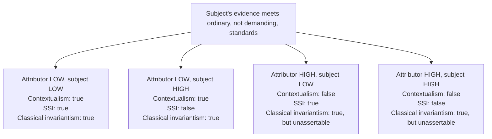

# Epistemology · Lesson 3.4: Contextualism and its rivals

> ⏱ ~15 min · Module 3: Skepticism about the external world · Builds on: [3.1 The closure argument](03-01-the-closure-argument.md), [3.2 Denying closure](03-02-denying-closure.md), [3.3 Moore and the dogmatist](03-03-moore-and-the-dogmatist.md) · Unlocks: Module 3 boss problem; [4.1 A priori knowledge](04-01-a-priori-knowledge.md)

## Why this matters

The skeptic's argument from [3.1](03-01-the-closure-argument.md) has three premises that each look true: I know I have hands; I don't know I'm not a brain in a vat; closure links the two. [3.2](03-02-denying-closure.md) denied closure and [3.3](03-03-moore-and-the-dogmatist.md) denied the skeptical premise. The fourth response denies none of them outright. It says the word "knows" changes its meaning with the conversation, so the skeptic and the person at the pub never actually contradict each other. If that is right, the paradox was a trick of language. If it is wrong, it is wrong in an instructive way, and the rivals it provoked tie knowledge to practical stakes.

## The idea

**The bank cases** (Keith DeRose, "Contextualism and Knowledge Attributions", 1992). On a Friday, DeRose and his wife decide not to deposit their paychecks today but to come back Saturday morning. He was at the bank two weeks ago on a Saturday and it was open.

- **Case A (low stakes).** Nothing much rides on it. He says "I know the bank is open on Saturdays," and almost everyone judges that true.
- **Case B (high stakes).** They have just written a large, important check that will bounce unless the paychecks are in before Monday. His wife points out that banks sometimes change their hours. Now "I don't know the bank is open on Saturdays; I'd better make sure" seems true.

His evidence is identical in both. Stewart Cohen's airport case ("Contextualism, Skepticism, and the Structure of Reasons", 1999) makes the same point in the third person: Smith reads "stops in Chicago" off his travel-agent itinerary and says he knows; Mary and John, who must make a business contact in Chicago, ask whether the itinerary might contain a misprint, and agree that Smith doesn't really know.

**Contextualism**, stated as conditions:

> **(C)** A sentence "S knows that $p$", uttered in context $c$, is true iff S believes $p$, $p$ is true, and S's epistemic position with respect to $p$ meets the standard $\sigma_c$ in force in $c$. Here $c$ is the **attributor's** context (the speaker's), not necessarily S's, and $\sigma_c$ rises with the stakes for the conversation, the error possibilities that have been made salient, and its purposes.

In words: "knows" is like "tall" or "flat": what it takes to count as one depends on the conversation in which the word is used. What varies is the **truth of the attribution**, not S's evidence, beliefs or reliability.

**Lewis's version** ("Elusive Knowledge", 1996). S knows $p$ iff S's evidence eliminates every possibility in which not-$p$, except the possibilities that are being properly ignored. Which possibilities may be properly ignored is fixed by rules. Three prohibitive ones: **Actuality** (the actual world is never properly ignored), **Belief** (nor is any possibility S believes, or ought to believe, obtains), and **Resemblance** (a possibility saliently resembling one that may not be ignored may not be ignored either). Then permissive ones, which let us ignore possibilities where perception, memory and testimony fail (**Reliability**), where samples are unrepresentative or the best explanation is false (**Method**), and where everyone conventionally ignores them (**Conservatism**). Finally **Attention**: a possibility actually attended to is not being ignored, properly or otherwise. That last rule is why knowledge is "elusive": mention the demon and the possibility can no longer be ignored, so your evidence, which cannot eliminate it, no longer suffices. See [rules of relevance](../reference.md#rules-of-relevance).

## The argument

DeRose's contextualist solution ("Solving the Skeptical Problem", 1995), with the BIV argument of [3.1](03-01-the-closure-argument.md) as its target. Let $h$ = "I have hands", $\neg \mathit{BIV}$ = "I am not a handless brain in a vat."

1. **"Knows" is context-sensitive as (C) says.** *In words:* the bank cases show the standard shifts while evidence holds still.
2. **Raising a skeptical hypothesis raises the standard.** DeRose's *rule of sensitivity*: when it is asserted that S knows or doesn't know $p$, the standard tends to rise, if necessary, until S's belief must be sensitive to count (S would not believe $p$ if $p$ were false; [sensitivity](../reference.md#sensitivity), from [1.2](01-02-sensitivity-and-safety.md)). My belief in $\neg \mathit{BIV}$ is not sensitive.
3. **So in the skeptic's context, "I don't know $\neg \mathit{BIV}$" is true.**
4. **Closure holds within any one context.** If I know $h$ by the standard in $c$ and competently deduce $\neg \mathit{BIV}$, I know $\neg \mathit{BIV}$ by the standard in $c$.
5. **So in the skeptic's context, "I don't know $h$" is true too** (from 3 and 4).
6. **In ordinary contexts the standard is low enough that "I know $h$" is true** (and so, by 4, is "I know $\neg \mathit{BIV}$", though asserting it would raise the standard by 2).
7. **So the skeptic's conclusion and the ordinary claim express different propositions and do not contradict.** *In words:* all three premises are true, each in its context; the paradox came from treating "know" as fixed.

Unlike [3.2](03-02-denying-closure.md), this keeps closure, so no abominable conjunction is ever true in a single context. Unlike [3.3](03-03-moore-and-the-dogmatist.md), it concedes the skeptic a truth.

**Where the argument is weakest.** Premise 1, and its interaction with 7. If "knows" were context-sensitive, competent speakers should recognize it, as they do with "tall": no one thinks a basketball scout and a kindergarten teacher disagree about whether a child is tall. Stephen Schiffer ("Contextualist Solutions to Scepticism", 1996) pressed that ordinary speakers have no idea "know" is relative in this way, so contextualism must say they are systematically confused about their own word; John Hawthorne (*Knowledge and Lotteries*, 2004) called this [semantic blindness](../reference.md#semantic-blindness). The skeptic adds a complaint: she meant ordinary "know", so being told she spoke truly about a special high standard changes the subject. Two further pressures: **retraction** (after hearing the skeptic, speakers tend to say "I was wrong, I didn't know", which contextualism says is false, since their earlier claim was true by its own standard; John MacFarlane, 2005), and **disquotation** (if "knows" shifts, then "Smith said he knows" cannot simply be reported in the reporter's own words, yet we do so freely).

## The case grid

Fix a subject whose evidence meets ordinary standards but not demanding ones. The three rival views, and the verdict each gives on "S knows $p$":

*Alt text: a two by two grid of attributor stakes against subject stakes. Contextualism's verdict follows the attributor's stakes, subject-sensitive invariantism's follows the subject's, and classical invariantism says true in every cell but calls the high-attributor claims unassertable.*

The rivals:

- **Subject-sensitive invariantism (SSI).** "Knows" expresses one relation in every context, but whether S stands in it depends partly on **S's own** practical situation: how much S has riding on $p$. Hawthorne (2004) and Jason Stanley (*Knowledge and Practical Interests*, 2005, who calls it interest-relative invariantism) defend versions; Jeremy Fantl and Matthew McGrath (2002; *Knowledge in an Uncertain World*, 2009) argue for the same consequence. The engine is a [knowledge-action principle](../reference.md#knowledge-action-principle): roughly, it is appropriate to treat $p$ as a reason for acting iff you know $p$ (Hawthorne and Stanley, "Knowledge and Action", 2008). In Case B, relying on "the bank is open Saturday" is not appropriate, so by the principle DeRose doesn't know it, though his evidence is unchanged. See [subject-sensitive invariantism](../reference.md#subject-sensitive-invariantism).
- **Classical invariantism with a pragmatic story.** "Knows" has one fixed, moderate standard, and stakes are irrelevant to its truth. DeRose in Case B does know; "I don't know" seems right because claiming knowledge there would conversationally imply something false or unhelpful, such as that no further checking is worth doing (Patrick Rysiew, Jessica Brown). This is a *warranted assertability manoeuvre*: the intuition tracks what is appropriate to say, not what is true. (Skeptical invariantism, one fixed and very high standard, is its mirror image.)
- **Relativism** (MacFarlane). The truth of a knowledge attribution depends on the standards of whoever **assesses** it, so the earlier claim really is false as you now assess it, which predicts retraction. This is relativism about knowledge attributions only; global relativism about truth faces the self-refutation argument that Socrates ran on Protagoras ([ancient-medieval-philosophy 1.3](../../ancient-medieval-philosophy/lessons/01-03-the-sophists-and-socrates.md)).

## Worked examples

**Ex 1 (clean: Lewis's rules on an invented case).** Priya left a library book on her desk at home this morning. At lunch a colleague asks if she has it; she says "It's on my desk at home." Actuality: in the actual world it is there. Belief: she believes no burglary has happened. Reliability and Conservatism let the conversation ignore burglary, a fire, a housemate borrowing it. Her evidence (memory of leaving it) eliminates every possibility not ignored, so "Priya knows the book is on her desk" is true at lunch. Now the colleague says, "There were break-ins on your street last week." By Attention, the burglary possibility is no longer ignored, and her memory does not eliminate it, so the same sentence is now false in that conversation. Nothing about Priya changed. Resemblance does the work in Lewis's treatment of lotteries: the possibility that my ticket wins saliently resembles the actual one, in which some ticket wins, so it may not be ignored, and I don't know my ticket lost.

**Ex 2 (hard case: stakes the subject doesn't know about).** Tomas believes the ferry leaves at 7:10, from last month's timetable. Unknown to him, if he misses it he loses a job interview: his stakes are high, but he thinks they are low. His friend, chatting idly, says "Tomas knows when the ferry leaves."

- **Contextualism:** the friend's context is low-stakes and no error possibility is salient, so the attribution is true. Tomas's hidden stakes are irrelevant.
- **SSI:** the verdict depends on a question the view must settle: do *actual* stakes or *believed* stakes fix the standard? If actual, Tomas doesn't know, and his knowledge turns on facts he has no access to. If believed, he knows, but then someone who merely imagines high stakes loses knowledge. SSI stops giving a verdict until this is fixed, and either fix has a cost.
- **Classical invariantism:** true, and assertable in that conversation.

## Watch out

- **You might think contextualism says Priya's knowledge comes and goes, but** it says the *sentence* "Priya knows" expresses different propositions in different conversations. It is SSI that makes the subject's own situation matter.
- **You might think contextualism concedes the skeptic's victory, but** the skeptic wins only in her own context. On the contextualist view, the skeptic is wrong that ordinary claims to know are false.
- **You might think the bank cases prove contextualism, but** all three views accommodate the intuitions there. They differ on cases that pull the attributor apart from the subject (the grid's off-diagonal cells), and on whether intuitions track truth or assertability.

## One-liner

> Contextualism ties the standard to whoever says "knows", SSI to whoever is said to know, and classical invariantism to neither, explaining away the shifts as pragmatics.

## Problems

**P1 (🟢) *(Exegetical (a) · Evaluative (b).)*** Odile, a sous-chef, believes the fish supplier delivers on Thursdays: she has seen the van three Thursdays running. Her evidence meets ordinary standards but not demanding ones (suppliers do change days). On Monday nothing rides on it for her. On Tuesday she learns that a forty-cover banquet on Thursday depends on the delivery; she has not checked. On Tuesday the owner, Bruno, worried about the banquet and having raised the chance that the supplier changed days, says (i) "Odile doesn't know the fish comes Thursday" and (ii) "She knew it on Monday, though." Kai, a dishwasher who knows nothing of the banquet and has nothing riding on it, says on Tuesday (iii) "Odile knows the fish comes Thursday."

(a) For each of contextualism, SSI and classical invariantism, say whether each of (i), (ii) and (iii) is true. (b) One of the three views makes both (i) and (ii) true. Name it, and say in two sentences whether that pairing is a cost.

**P2 (🟡) *(Exegetical.)*** Diagnose this invented forum post. Name each error and say what contextualism actually holds. 150 words or fewer.

> "Contextualism is relativism in a lab coat. On DeRose's view, whether I know my keys are in my pocket depends on who's talking about me, so if a philosopher in Ohio starts discussing brains in vats, I lose my knowledge here in Toronto. And it hands the skeptic the game: in the seminar the skeptic speaks truly, and the seminar is where we ask what we *really* know."

**P3 (🔴, optional) *(Evaluative.)*** State the semantic blindness objection to contextualism at full strength, give the contextualist's best reply, and say whether the objection (or a cousin of it) also hits SSI or classical invariantism. Any verdict. 150 words or fewer.

Solutions

**P1** *(Exegetical (a) · Evaluative (b))*

(a)

| | (i) Bruno: doesn't know | (ii) Bruno: knew Monday | (iii) Kai: knows |
|---|---|---|---|
| Contextualism | true | false | true |
| SSI | true | true | false |
| Classical invariantism | false | true | true |

**Must hit, strict (a):**

- Contextualism: Bruno's context has a high standard, which Odile's evidence fails, so (i) is true and (ii) is false (the same unchanged Monday evidence is judged by Bruno's Tuesday standard); Kai's low context makes (iii) true.
- SSI: the standard is fixed by Odile's stakes at the time in question: high on Tuesday, so (i) true and (iii) false; low on Monday, so (ii) true.
- Classical invariantism: one moderate standard, met throughout, so (i) false, (ii) and (iii) true; (i) seems apt only because asserting knowledge would wrongly suggest no checking is needed.

**Must hit, any verdict (b):**

- Names SSI.
- Says what the pairing commits SSI to: Odile lost knowledge between Monday and Tuesday with no change in evidence, belief or reliability, only in what rides on it; a verdict on whether that is acceptable, with a reason.

**Wrong turns:** letting Odile's stakes drive the contextualist verdicts (contextualism looks only at the attributor's context); evaluating (ii) by Monday's stakes under contextualism.

**Model answer (b), one of several:** SSI. It is a cost: "she knew on Monday but not on Tuesday, though she learned nothing" sounds as bad as an abominable conjunction, since knowledge seems to be lost only by losing evidence. The defender replies that the knowledge-action principle predicts exactly this, and that we do say "she can't just go on what she saw; she needs to check," which is the same verdict in other words.

---

**P2** *(Exegetical)*

**Must hit, strict:**

- Error 1: contextualism does not make the subject's knowledge depend on remote conversations. The Ohio philosopher's sentence "he knows" expresses a different, more demanding proposition; nothing about the writer's epistemic position changes, and the writer's own ordinary "I know" stays true. (Making the subject's situation matter is SSI.)
- Error 2: it is not relativism. Contextualism fixes truth at the context of *utterance*; relativism (MacFarlane) at the context of *assessment*.
- Error 3: contextualism denies that the seminar's standard is privileged. "Really know" is just another context-raising phrase; the skeptic speaks truly only in her context.

**Wrong turns:** accepting that contextualism makes knowledge "come and go"; treating "really" as a neutral request for the true standard.

**Model answer:** Three errors. First, on contextualism, the Ohio philosopher's "he knows his keys are in his pocket" expresses a different, stricter proposition; the writer's epistemic position is untouched and his own ordinary "I know" remains true. Tying knowledge to the subject's situation is SSI, not contextualism. Second, relativism makes truth depend on who assesses a claim; contextualism fixes it at the context where the sentence is uttered. Third, contextualism denies that the seminar's standard is the real one: "really" just raises the standard, so the skeptic is right only by the standards of her own conversation.

---

**P3** *(Evaluative)*

**Must hit, any verdict:**

- The objection stated precisely: if "knows" is context-sensitive, competent speakers should recognize it as they do for "tall" or "here", and should see the skeptic and the ordinary speaker as not disagreeing; they don't (they feel contradicted, and retract), so contextualism attributes systematic semantic error to competent speakers (Schiffer; Hawthorne's label).
- The best reply: a known context-sensitive term where speakers are similarly blind (gradable terms such as "flat" or "empty" are the usual candidates), or the claim that the error is small and explicable.
- Whether it generalizes: every view here posits some error. Classical invariantism says the high-stakes "I don't know" is false, so speakers err there; SSI says third-person and past-tense attributions mislead speakers who project their own stakes.

**Wrong turns:** treating the objection as "people don't use the word that way" without locating the error in speakers' *beliefs about* their utterances; concluding that because all views posit error the objection is idle (the question is whose error is more plausible).

**Model answer, one of several:** If "knows" worked like "tall", speakers would see that the skeptic and the shopper don't disagree, yet both feel contradicted and people retract earlier knowledge claims. So contextualism must call competent speakers blind to their own word's meaning. Reply: speakers are similarly blind with "flat" and "empty"; arguments over whether a table is "really flat" show the same pattern. The objection then becomes comparative, because every rival posits error too: classical invariantism says the worried banker speaks falsely, and SSI says speakers misjudge third-person cases by their own stakes. What remains to decide is which error has the better independent explanation, and I think that question is still open.

## Flashback

**From Lesson [3.2](03-02-denying-closure.md) (Denying closure):** *(Exegetical.)* Counterexample. A closure-denier hopes that sensitivity makes closure fail only for "heavyweight" conclusions, ones that deny a skeptical hypothesis. Build a fresh case (not the zebra, the vat, the conjunction "I have hands and I'm not a BIV", or Kripke's red barn) in which, on Nozick's conditions, a subject knows $p$ but does not know some $q$ that $p$ trivially entails, where $q$ denies no skeptical scenario. Name the method, and describe the closest not-$p$ world and the closest not-$q$ world. Four sentences or fewer.

Solution

**Must hit, strict:**

- $q$ follows from $p$ by a trivial step (dropping a detail, conjunction elimination, existential generalization) and is an ordinary claim, not the denial of a skeptical hypothesis.
- One method, held fixed across both counterfactuals.
- Closest not-$p$ world: by that method the subject does not believe $p$, so the belief in $p$ is sensitive (and adherence holds in the actual, ordinary circumstances).
- Closest not-$q$ world: by that method the subject still believes $q$, so the belief in $q$ is insensitive. This works only if the closest not-$q$ world differs from the closest not-$p$ world: the ordinary way for $q$ to fail must mimic $q$'s appearance but not $p$'s extra detail.

**Wrong turns:** calling $q$ insensitive because a not-$q$ world is merely possible, or improbable (sensitivity looks at the closest not-$q$ world, whatever its probability); a case where the closest not-$q$ world is also the closest not-$p$ world, so the two beliefs stand or fall together; letting the method change between $p$ and $q$. A case with the red barn's structure (the misleading cases never have one feature) is acceptable if the case itself is new.

**Model answer, one of several:** Liesel checks the station app, which actually has a glitch: when a train is cancelled, it shows "arrived" at the scheduled time of 9:00, but it never shows a wrong time for a train that ran. It shows her train arrived at 9:02, which is true. Her belief that it arrived at 9:02 is sensitive: in the closest world where it didn't, it arrived at another time or was cancelled, and either way the app shows something other than 9:02. Her belief that the train arrived is insensitive: in the closest world where it didn't, it was cancelled, the app says "arrived", and she believes it. So Nozick's view says she knows it arrived at 9:02 but not that it arrived.

## Connections

- **Backward:** the skeptical argument and closure are [3.1](03-01-the-closure-argument.md); DeRose's rule of sensitivity borrows Nozick's condition from [1.2](01-02-sensitivity-and-safety.md) and [3.2](03-02-denying-closure.md), but uses it to set the standard rather than to deny closure. Whether the skeptic and the ordinary speaker are having a verbal dispute is a test from [philosophical-method 3.2](../../philosophical-method/lessons/03-02-distinctions-and-verbal-disputes.md).
- **Forward:** the Module 3 boss problem asks what each of the four responses says the ordinary person knows, and what each costs. The idea that stakes affect how much confidence action needs returns formally in Module 5, where credence replaces all-or-nothing belief ([5.1](05-01-credences-and-probabilism.md)).
- **Sideways:** context-sensitivity, indexicals and gradable adjectives are semantics in [`philosophy-of-language-and-logic`](../../philosophy-of-language-and-logic/syllabus.md). The knowledge-action principle has a decision-theoretic cousin: whether to treat $p$ as settled depends on the cost of being wrong, which is expected-utility reasoning from [`decision-theory`](../../decision-theory/syllabus.md). Relativism about truth in general, and Protagoras, are in [ancient-medieval-philosophy 1.3](../../ancient-medieval-philosophy/lessons/01-03-the-sophists-and-socrates.md).
