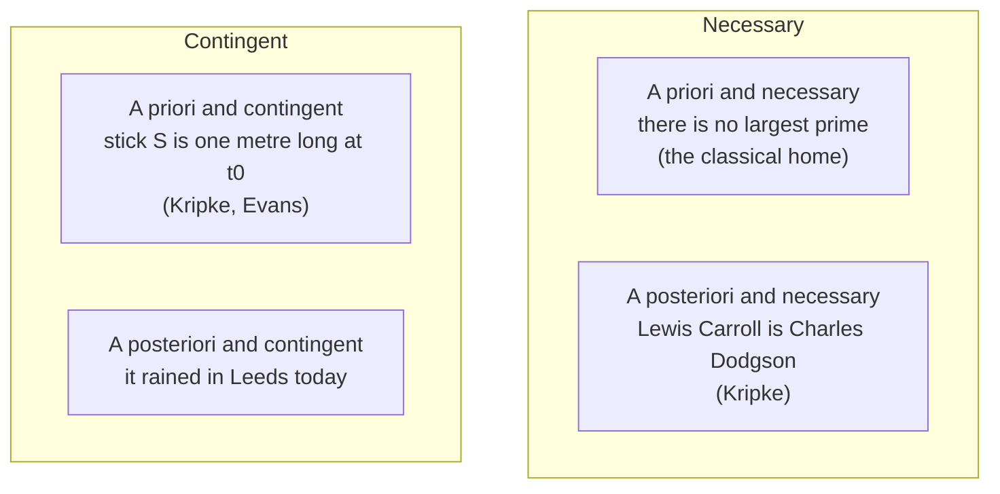

# Epistemology · Lesson 4.1: A priori knowledge

> ⏱ ~15 min · Module 4: Sources: reason, induction, and other people · Builds on: [2.2 Foundationalism](02-02-foundationalism.md), [3.3 Moore and the dogmatist](03-03-moore-and-the-dogmatist.md), [metaphysics 3.1 Kinds of necessity](../../metaphysics/lessons/03-01-kinds-of-necessity.md) · Unlocks: [4.2 Hume's problem of induction](04-02-humes-problem-of-induction.md)

## Why this matters

You know that there is no largest prime, and you did not find it out by looking at anything. The same goes for the validity of modus ponens, and for the epistemic principles this course has been arguing about all along. If some justification comes from reflection alone, we need to know what it is and how it could possibly work. If none does, then even "this inference is good" has to be learned from experience. That threatens a regress, and Hume will press it in [4.2](04-02-humes-problem-of-induction.md). This lesson separates three distinctions that are constantly run together. It then weighs the rationalist account of a priori justification against Quine's attack on it.

## The idea

Ask three different questions about a true proposition.

1. **How is it known?** This is [epistemic](../reference.md#a-priori-and-a-posteriori). A belief is justified **a priori** when its justification does not depend on experience, beyond whatever experience was needed to understand the proposition at all. Otherwise it is justified **a posteriori**.
2. **Could it have been false?** This is [metaphysical](../reference.md#necessary-and-contingent). It is **necessary** if it holds in every possible world and **contingent** otherwise.
3. **What makes it true?** This is [semantic](../reference.md#analytic-and-synthetic). It is **analytic** if it is true in virtue of meaning alone, and **synthetic** otherwise.

The clause "beyond what was needed to understand" carries a great deal of weight. You learned the word "prime" from a teacher and a textbook, so experience played an **enabling** role. But it plays no **evidential** role. Your reason to think there is no largest prime is Euclid's proof. It is not the teacher's say-so, and it is not any observation of numbers.

A useful slogan follows. **A priori and a posteriori classify routes to a proposition. Necessary and contingent classify the proposition itself.** The same necessary truth can be reached by either route. Theo multiplies $17 \times 23$ on paper and gets 391, so his justification is a priori. Priya reads 391 off a calculator, so her justification is a posteriori: it rests on her perception of the screen and her evidence that the device is reliable. They believe the same necessary truth by different routes. So the useful notion is *knowable* a priori, which means reachable by some a priori route.

The classical empiricist lined the three distinctions up. On that view, everything a priori is analytic and necessary, and everything a posteriori is synthetic and contingent. Kant broke the alignment by claiming that arithmetic is **synthetic a priori**. Of $7 + 5 = 12$ he wrote: "we may analyse our conception of such a possible sum as long as we will, still we shall never discover in it the notion of twelve" (*Critique of Pure Reason*, Introduction, Meiklejohn trans.). Kant's system belongs to [`modern-philosophy`](../../modern-philosophy/syllabus.md). Here we need only his category: a priori, and yet not true by meaning.

## The argument

**Kripke's two crossings.** In *Naming and Necessity* (lectures 1970, published 1972), Kripke argued that the epistemic and metaphysical axes come apart in both directions.

- **The [contingent a priori](../reference.md#contingent-a-priori).** Suppose someone fixes the reference of "one metre" as *the length of stick S at time $t_0$*. That person knows without measuring anything that S is one metre long at $t_0$. Yet the claim is contingent. "One metre" rigidly names that length, and S could have been heated and stretched, so it could have had a different length. Gareth Evans ("Reference and Contingency", 1979) gives a cleaner version. Introduce "Julius" as a name for whoever invented the zip. Then "if anyone uniquely invented the zip, Julius did" is known a priori, but it is contingent of the man.
- **The [necessary a posteriori](../reference.md#necessary-a-posteriori).** Metaphysics 3.1 explains [why true identities between rigid terms are necessary](../../metaphysics/lessons/03-01-kinds-of-necessity.md). What this lesson adds is the epistemic side. "Lewis Carroll is Charles Dodgson" is necessary, because nothing could fail to be itself. Yet no amount of reflection on the two names would tell you so. You need archives. Notice the difference from Priya's case. She chose an a posteriori route to a truth that is *also* knowable a priori. A Kripkean identity is knowable *only* a posteriori.

So **apriority is not necessity**. And if Kripke is right about names, **neither is analyticity**: "Carroll is Dodgson" is necessary but not true by meaning.

**Rationalism about justification.** The strongest modern defence of the a priori is Laurence BonJour's *In Defense of Pure Reason* (1998). Its central argument runs as follows.

> **P1.** Most of what we justifiably believe goes beyond what we directly observe: the past, the unobserved, laws, mathematics.
> **P2.** Such a belief is justified only by an inference from what is observed.
> **P3.** An inference confers justification only if the thinker has some reason to think that its premises make its conclusion true or likely.
> **P4.** That reason cannot come from observation alone. Any observational case for it would itself be an inference from observation, and would need a reason of the same kind.
> **∴ C.** Either some justification is a priori, or almost nothing we believe is justified.

In words: once a premise has to vouch for an inference, empiricism runs out of premises.

BonJour's positive account is **[rational insight](../reference.md#rational-insight)**. This is an immediate, non-inferential grasp that a proposition is necessarily true. The view is *moderate*. What justifies is *apparent* insight, which is fallible and can be defeated, just as perceptual seemings are. Insight then works as a source of basic beliefs, as in [modest foundationalism](02-02-foundationalism.md). Ross's ethical intuitionism ([ethics 6.6](../../ethics/lessons/06-06-moral-knowledge-and-disagreement.md)) is the same model applied to moral truths.

**Quine's attack.** "Two Dogmas of Empiricism" (1951) argues that beliefs face experience not one at a time but as a whole web. Any statement can be held true come what may if we adjust enough elsewhere. And no statement is immune to revision, logic included: Quine floated revising excluded middle to simplify quantum mechanics. If being a priori means *being unrevisable in light of experience*, then nothing is a priori. Logic and mathematics are simply the parts of the web nearest its centre, and they are justified by their role in our best overall theory.

**A third route.** Paul Boghossian ("Analyticity Reconsidered", 1996) gives up *metaphysical* analyticity, meaning truth in virtue of meaning, to Quine. He keeps **epistemic analyticity**: a sentence is epistemically analytic when understanding it is enough to be justified in believing it. On this view, a priori knowledge is explained by the grasp of meaning rather than by a faculty of insight.

**Where the argument is weakest.** The externalist attacks P3. On process reliabilism ([2.4](02-04-reliabilism.md)), a reliable inference justifies even if the thinker has no reason to think it reliable. In that case the regress in P4 never starts, and C loses its force. The Quinean attacks P4 in a different way. The reasons that license an inference are confirmed holistically, together with everything else, and this is no more circular than any other confirmation of a web by its fit with experience. The rationalist's reply to both has a price. To the externalist, the rationalist says that unreflective reliability is not the kind of justification that answers the skeptic. To the Quinean, the rationalist says that revisability does not show that a belief's *source* is empirical. Each reply concedes something. The first fixes the meaning of "justification" in the internalist way of [1.4](01-04-internalism-and-externalism.md). The second leaves rational insight as an unexplained faculty, which faces the same access worry [metaphysics 1.2](../../metaphysics/lessons/01-02-abstract-objects.md) raised against knowledge of abstract objects.

## The picture

The classical empiricist allowed only the top-left and bottom-right cells. Kripke filled the other two. The third axis cuts across all four. Analytic truths, such as "every grandparent is a parent", are candidates only for the top-left cell. Kant put arithmetic in that same cell while denying that it is analytic. Plato held that knowledge needs unchanging objects ([ancient-medieval-philosophy 2.1](../../ancient-medieval-philosophy/lessons/02-01-the-forms-and-what-goes-wrong-with-them.md)). The bottom-left cell is a modern answer to him: an a priori truth need not be about anything unchanging.

## Worked examples

**Ex 1: three axes, one proposition, two routes.** Take "$17 \times 23 = 391$."

- *Metaphysical axis:* necessary. Arithmetic does not vary between worlds.
- *Semantic axis:* contested. Kant says synthetic. A logicist in Frege's tradition says analytic, given definitions plus logic. Say which view you are using.
- *Epistemic axis:* this is a question about a route, not about the proposition. Theo's justification is a priori. Priya's is a posteriori, and if she has never multiplied, she knows something necessary that she herself knows only a posteriori. The proposition is still *knowable* a priori. That is why it is not a Kripkean case.

**Ex 2: where insight strains.** For two thousand years the parallel postulate seemed to geometers as self-evidently necessary as anything could be. That is a textbook apparent rational insight. Kant treated Euclidean geometry as synthetic a priori knowledge of space. Then general relativity described physical space as non-Euclidean.

- *Moderate rationalist:* the insight concerned a mathematical claim, that the postulate holds in Euclidean geometry, and that claim is still necessary and a priori. The error lay in an a posteriori claim, that physical space is Euclidean. Experience corrected the second claim, not the first.
- *Quinean:* that reply was available only after the fact. Before 1915 nothing in the "insight" told the two claims apart. A faculty whose deliverances are sorted only by later empirical success is hard to tell from a well-entrenched part of the web.

Here the view stops giving a verdict. The rationalist can always redescribe a failed insight as a misdescribed one. What the rationalist owes is a way to tell genuine insight from conviction *before* experience does the sorting.

## Watch out

- **You might think a posteriori means contingent.** It does not. Priya's calculator belief and "Carroll is Dodgson" are both a posteriori and necessary. The first is a route chosen; the second is the only route available.
- **You might think a priori means certain or unrevisable.** Moderate rationalism makes a priori justification defeasible. Quine's argument goes through only against the stronger notion it assumes, the one Kitcher made explicit when he required a priori justification to be indefeasible by experience.
- **You might think "independent of experience" means you could know it with no experience at all.** Experience may be needed to acquire the concepts. What matters is that the experience is not part of the evidence.

## One-liner

> A priori is a property of a route, necessity is a property of a proposition, and analyticity is a property of what makes it true. Kripke showed the first two come apart both ways, and Quine asked whether the route exists at all.

## Problems

**P1 (🟢) *(Exegetical.)*** Classify each claim on all three axes: a priori or a posteriori (as knowable by an ordinary thinker), necessary or contingent, analytic or synthetic. One line each. Assume Kripke's view of names. In (c), "Vela" was introduced by an astronomer with the stipulation: *let "Vela" name the body, if there is exactly one, that is perturbing comet K's orbit.*

(a) Every grandparent is a parent.
(b) George Eliot is Mary Ann Evans.
(c) If exactly one body is perturbing comet K's orbit, Vela is perturbing it.
(d) The Thames flows through London.

**P2 (🟡) *(Exegetical (a) · Evaluative (b).)*** A Quinean argues: "Physicists have seriously proposed revising even the law of excluded middle. So no belief is immune to revision by experience, and therefore no belief is justified a priori."
(a) State the premise about what "a priori" means that the argument needs in order to be valid. Two sentences.
(b) Give the strongest moderate-rationalist reply, and the best Quinean rejoinder to it. 150 words or fewer, any verdict.

**P3 (🔴, optional) *(Exegetical (a) · Evaluative (b).)*** Ines, a number theorist, considers $f(n) = n^2 + n + 41$. After working through the algebra she has a vivid sense that she "just sees" that $f(n)$ is prime for every natural number $n$. A colleague's computer search then reports that $f(40) = 1681 = 41^2$.
(a) After reading the output, Ines multiplies $41 \times 41$ by hand. Say which of her beliefs about 1681 is justified a priori and which a posteriori, and what kind of defeater the computer output was. Two sentences.
(b) On BonJour's moderate rationalism, was her original belief ever justified a priori? Does the case support Quine? 120 words or fewer, any verdict.

Solutions

**P1** *(Exegetical, strict.)*

**Must hit, strict:**

- (a) A priori, necessary, analytic. It is true by the meaning of "grandparent" (a parent of a parent).
- (b) A posteriori, necessary, synthetic. This is a true identity between two rigid names, so it holds at every world. Learning it took biography, not reflection, and it is not true by meaning.
- (c) A priori, contingent. The stipulation guarantees it to the person who fixed the reference, so no observation is needed. But "Vela" rigidly names the body that actually does the perturbing, and that body might have perturbed nothing. On the third axis, synthetic is the Kripkean answer (it is not true by meaning, since "Vela" is a name, not an abbreviation). Accept "analytic" only with the reason that reference-fixing stipulations are true by stipulation.
- (d) A posteriori, contingent, synthetic.

**Wrong turns:** calling (b) contingent because it was discovered, which conflates the epistemic and metaphysical axes; calling (c) necessary because it is known a priori, which is the same conflation run the other way; calling (c) a posteriori because astronomers observed the comet. The observations prompted the stipulation, but they are not evidence for the conditional.

**Model answer:** as above.

---

**P2** *(Exegetical (a) · Evaluative (b).)*

(a)

**Must hit, strict (a):**

- The argument needs: a belief is justified a priori only if no experience could rationally lead us to revise it, so a priori justification must be empirically indefeasible.
- Without that premise, the step from "revisable by experience" to "not a priori" does not follow.

**Must hit, any verdict (b):**

- The rationalist reply denies the premise in (a). A priori justification is defeasible, and a belief's source is not settled by what could defeat it. Perceptual justification can be defeated by testimony without being testimonial.
- The Quinean rejoinder must target the *source*. For example: once the "insight" is admitted to be defeasible by empirical theory, there is nothing left to distinguish it from a central, well-confirmed part of the web, and positing an extra faculty explains nothing.
- Some statement of what each side owes: the rationalist owes an account of insight; the Quinean owes a non-circular account of how logic is confirmed, since confirmation itself uses logic.

**Wrong turns:** answering "but excluded middle has not actually been revised", which leaves the argument's form intact; treating the rationalist as committed to infallibility.

**Model answer (b), one of several:** The moderate rationalist denies that a priori means unrevisable. My belief that the vase is blue can be defeated by a friend's report about the lighting, yet it remains perceptual in source. Likewise, an apparent insight into excluded middle could in principle be overridden by physics and still owe its justification to understanding rather than to observation. The Quinean replies that this makes "insight" idle. If its deliverances are hostage to total theory, then the web explains everything the faculty was meant to explain. The rationalist counters that the web's own rules of confirmation must be justified somehow, and that experience cannot certify them without circularity. That is where the dispute actually sits.

---

**P3** *(Exegetical (a) · Evaluative (b).)*

(a)

**Must hit, strict (a):**

- Her belief that $41 \times 41 = 1681$, reached by hand calculation, is justified a priori. Her belief that $f(40)$ is composite *on the strength of the output* is justified a posteriori: it rests on perceiving the screen and trusting the machine. (The arithmetic: $40^2 + 40 + 41 = 1600 + 81 = 1681 = 41^2$; $f$ is prime for $n = 0$ to $39$.)
- The output was an a posteriori **rebutting** defeater for a belief that was (at most) justified a priori. Credit for "rebutting" or for "shows the belief false"; the key point is that its source was empirical.

**Must hit, any verdict (b):**

- Apply the view as stated: on moderate rationalism, *apparent* insight confers prima facie justification. So yes, provided her seeming really was the seeming of necessity and not merely a strong hunch from the early cases. The justification was defeasible, and it was defeated.
- Say what the case shows about Quine. It shows that a priori justification can be defeated by experience. That supports Quine only if a priori is defined as indefeasible. Alternatively, argue that the rationalist cannot tell insight from hunch from the inside, which is the Quinean's real point.

**Wrong turns:** concluding that her belief was never justified because it was false, which conflates justification with truth (the Gettier and demon lessons of Module 1); saying the output makes the arithmetic itself a posteriori.

**Model answer (b), one of several:** On BonJour's view she had prima facie a priori justification, because what justifies is apparent insight, and fallibility is built in. The computer then defeated it with empirical evidence, which the view expects. So the case does not refute moderate rationalism, and it supports Quine only on his strong definition of the a priori. Its real sting is different. Ines could not tell from the inside that her "insight" was an extrapolation from the cases she had checked. If genuine and spurious insight feel the same, the rationalist owes a criterion, and none was available to her before the search.

## Flashback

**From Lesson [3.3](03-03-moore-and-the-dogmatist.md) (Moore and the dogmatist):** *(Formal (a)–(b) · Exegetical (c).)* Tamsin lives next to a film studio that sometimes sprays artificial snow on the street at night. On waking she has an experience as of fresh snow on her lawn ($E$). Let $SK$ be "the lawn is covered in the studio's artificial snow and there is no real snow", and $S$ be "there is real snow on the lawn", so $S$ entails $\neg SK$. Her illustrative credences: $\mathrm{cr}(SK) = 0.2$ and $\mathrm{cr}(E \mid \neg SK) = 0.5$.

(a) Suppose the artificial snow is indistinguishable from real snow, so $\mathrm{cr}(E \mid SK) = 1$. Compute $\mathrm{cr}(\neg SK \mid E)$ and the ceiling it sets on $\mathrm{cr}(S \mid E)$.
(b) Suppose instead the artificial snow passes for real only a quarter of the time, so $\mathrm{cr}(E \mid SK) = 0.25$. Compute $\mathrm{cr}(\neg SK \mid E)$ again.
(c) In two sentences: which condition of White's result does (b) violate, and why does that give Moore no help against the brain in a vat?

Solution

**Worked arithmetic (a)–(b):**

(a) By total probability,

$$\mathrm{cr}(E) = 0.2 \times 1 + 0.8 \times 0.5 = 0.6, \qquad \mathrm{cr}(\neg SK \mid E) = \frac{0.8 \times 0.5}{0.6} = \frac{2}{3} \approx 0.667.$$

That is down from the prior of 0.8. Since $S$ entails $\neg SK$, $\mathrm{cr}(S \mid E) \le \tfrac{2}{3}$.

(b)

$$\mathrm{cr}(E) = 0.2 \times 0.25 + 0.8 \times 0.5 = 0.45, \qquad \mathrm{cr}(\neg SK \mid E) = \frac{0.4}{0.45} = \frac{8}{9} \approx 0.889.$$

That is up from 0.8: here, looking counts against the trick.

**Must hit, strict (c):**

- (b) violates the condition $\mathrm{cr}(E \mid SK) \ge \mathrm{cr}(E \mid \neg SK)$, since $0.25 < 0.5$. Once the trick predicts the experience less well than its denial, the experience is evidence against it.
- A radical skeptical hypothesis is built to predict the experience exactly, so $\mathrm{cr}(E \mid SK) = 1$ and the condition always holds. That is White's point against the dogmatist, and (b) does not touch it.

**Wrong turns:** (a) giving $0.8 \times 0.5 = 0.4$ as the posterior, which forgets to divide by $\mathrm{cr}(E)$; (c) concluding from (b) that perception can always disconfirm skeptical hypotheses, when (b) works only because this trick is detectable.

**Model answer (c):** Part (b) breaks the condition that $SK$ predicts $E$ at least as well as $\neg SK$ does, which is the only reason the experience could not count against it. The vat hypothesis is designed to produce exactly the experiences you have, so for it the condition holds by construction and White's ceiling stands.

## Connections

- **Backward:** [2.2](02-02-foundationalism.md)'s modest foundationalism supplies the structure. Rational insight is a source of basic beliefs, on the model of perceptual seemings. [Metaphysics 3.1](../../metaphysics/lessons/03-01-kinds-of-necessity.md) supplied the metaphysics of the necessary a posteriori; this lesson adds the knowing.
- **Forward:** [4.2](04-02-humes-problem-of-induction.md) takes Hume's version of the a priori (relations of ideas) and asks whether the principle behind induction could be known that way. BonJour's P3–P4 are that question in general form. [4.3](04-03-answering-hume.md)'s externalist answer to Hume is the reliabilist denial of P3, applied to induction.
- **Sideways:** whether mathematical knowledge is a priori, and how a mind could be reliably in touch with abstract objects, is the access problem of [metaphysics 1.2](../../metaphysics/lessons/01-02-abstract-objects.md). Ross's self-evident duties ([ethics 6.6](../../ethics/lessons/06-06-moral-knowledge-and-disagreement.md)) and Parfit's normative–mathematical comparison ([ethics 6.1](../../ethics/lessons/06-01-moral-realism.md)) assume a moral a priori that stands or falls with this lesson. Quine's web of belief and the semantics of analyticity go to [`philosophy-of-language-and-logic`](../../philosophy-of-language-and-logic/syllabus.md); Kant's synthetic a priori goes to [`modern-philosophy`](../../modern-philosophy/syllabus.md). Plato's view that knowledge needs unchanging objects ([ancient-medieval 2.1](../../ancient-medieval-philosophy/lessons/02-01-the-forms-and-what-goes-wrong-with-them.md)) is one answer to the question this lesson asks: what makes a truth knowable without experience. The rationalist here needs necessary truths, not changeless things, and the moderate rationalist needs neither to be infallibly grasped.
