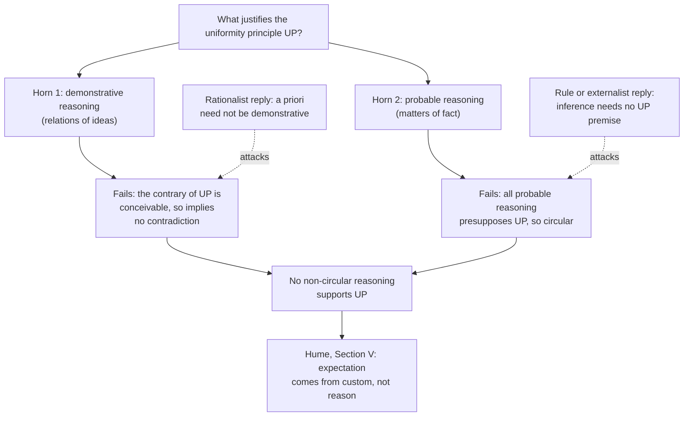

# Epistemology · Lesson 4.2: Hume's problem of induction

> ⏱ ~15 min · Module 4: Sources: reason, induction, and other people · Builds on: [4.1 A priori knowledge](04-01-a-priori-knowledge.md), [metaphysics 4.1 Hume's challenge and the regularity theory](../../metaphysics/lessons/04-01-humes-challenge-and-the-regularity-theory.md) · Unlocks: [4.3 Answering Hume](04-03-answering-hume.md)

## Why this matters

Almost everything you believe goes beyond what you have observed: that the next loaf will nourish, that the bridge will hold, that a drug which worked in the trial will work on the patient. [Metaphysics 4.1](../../metaphysics/lessons/04-01-humes-challenge-and-the-regularity-theory.md) granted that past regularities license expectation and asked what causation is. This lesson asks whether the granting was warranted. Hume's answer, in *An Enquiry Concerning Human Understanding* (1748) §IV, is the most durable skeptical argument in philosophy. It does not say your expectations are uncertain. It says no reasoning, not even reasoning to a merely probable conclusion, supports them without assuming what it set out to show.

## The idea

You have eaten bread a thousand times and it nourished you every time. A new loaf looks the same. You expect it to nourish you. What is your *reason*?

Not anything you see in the loaf. Hume's point in §IV Part I is that the senses report colour, weight and texture, never the *secret powers* that make bread nourishing. So the reason must be your past experience. But past experience is about *past* loaves. To get from "those nourished" to "this will", you need a bridge: something like **nature is uniform; unobserved cases resemble observed ones**. Call it the **uniformity principle** ([UP](../reference.md#uniformity-principle)).

Now ask what supports UP. Hume says there are only two kinds of reasoning, and neither will do. You cannot prove UP the way you prove a theorem, because a world where the next loaf poisons you is perfectly conceivable. And you cannot support it from experience ("nature has been uniform so far"), because that argument itself crosses from observed to unobserved, so it uses the bridge it was meant to build.

That is the whole problem. Everything else is precision.

**Two background distinctions.** Hume's §IV opens with his fork ([relations of ideas and matters of fact](../reference.md#relations-of-ideas-and-matters-of-fact)). *Relations of ideas* (geometry, arithmetic) are knowable by thought alone, and denying one yields a contradiction. *Matters of fact* can be denied without contradiction, since that the sun will not rise tomorrow is as intelligible as that it will. This tracks the a priori / a posteriori line of [4.1](04-01-a-priori-knowledge.md) closely, though not exactly. The matching split in kinds of reasoning is [demonstrative and probable reasoning](../reference.md#demonstrative-and-probable-reasoning): demonstrative reasoning works from relations of ideas; *probable* (Hume also says "moral") reasoning concerns matters of fact and rests on cause and effect, which is known only from experience.

## Source

Hume, *Enquiry* §IV Part II, paragraph 32 (Selby-Bigge edition, Project Gutenberg):

> You say that the one proposition is an inference from the other. But you must confess that the inference is not intuitive; neither is it demonstrative: Of what nature is it, then? To say it is experimental, is begging the question. For all inferences from experience suppose, as their foundation, that the future will resemble the past, and that similar powers will be conjoined with similar sensible qualities. If there be any suspicion that the course of nature may change, and that the past may be no rule for the future, all experience becomes useless, and can give rise to no inference or conclusion. It is impossible, therefore, that any arguments from experience can prove this resemblance of the past to the future; since all these arguments are founded on the supposition of that resemblance.

"The one proposition" is *I have found that such an object has always been attended with such an effect*; "the other" is *I foresee that similar objects will be attended with similar effects*. "Experimental" means drawn from experience: probable reasoning.

## The argument

Hume's own conclusion is that "our conclusions from that experience are *not* founded on reasoning" (§28). Stated as an argument about justification ([Hume's problem of induction](../reference.md#humes-problem-of-induction)):

1. **Every probable inference from observed to unobserved cases presupposes UP.** *In words:* without the bridge, "past loaves nourished" gives no support to "this loaf will".
2. **If UP is justified by reasoning, it is justified by demonstrative or by probable reasoning.** *In words:* the fork is exhaustive.
3. **UP is not demonstrable.** Its contrary is conceivable, and whatever is conceivable "implies no contradiction" (§30), so no proof from relations of ideas can rule it out.
4. **UP cannot be supported by probable reasoning without circularity.** By P1, any such argument presupposes UP.
5. **∴ UP is not justified by any non-circular reasoning.**
6. **∴ No conclusion of probable reasoning about the unobserved is justified by reasoning.** *In words:* if the bridge has no support, nothing that crosses it inherits any.

Three features to notice.

**It is not a demand for certainty.** P4 targets *probable* arguments. Hume grants that experience might make a conclusion only likely and still says no argument from experience can support UP without circularity. Expecting merely 90 percent confidence that the loaf nourishes does not escape: a 90 percent claim about the unobserved still needs the bridge.

**"Induction versus deduction" is the wrong contrast.** The word "induction" does not appear in the *Enquiry*. Hume's contrast is demonstrative versus probable, and on one careful reading (Samir Okasha, "What Did Hume Really Show About Induction?", *Philosophical Quarterly*, 2001) the difference is the source of the premises: a demonstrative argument is deductively valid from a priori premises; a probable one relies on an empirical premise. Add UP as a premise and the bread inference becomes deductively valid. Nothing is gained, because UP is then a matter-of-fact premise needing support. And the problem is not confined to generalizing from instances: inference to the best explanation, predicting a particular case and statistical estimation all go from observed to unobserved, so all fall under horn two.

**Hume does not doubt the practice.** The skeptical conclusion is about the *foundation*, not about whether to eat bread.

**Where the argument is weakest.** Many critics attack **P1**. One version: no single premise UP is needed, because inductive inference is not an argument with a missing premise but a basic rule (an externalist will say a reliable rule can justify without the believer justifying a premise about it; [4.3](04-03-answering-hume.md)). Another: UP is either too weak to be true-and-useful or too strong to be true. Nature is not uniform in every respect, since some regularities break, so a true UP must say "uniform in the right respects", and specifying those respects is the hard part. Rationalists attack **P3** instead: it assumes that a priori justification must be demonstrative, that is, must make the contrary contradictory. Laurence BonJour (*In Defense of Pure Reason*, 1998) argues that it can be a priori, though fallibly, that a long unbroken regularity is better explained by a stable law than by chance. Each attack has its cost, and 4.3 prices them.

## The argument map

*Alt text: a dilemma map. The question of what justifies the uniformity principle splits into a demonstrative horn and a probable horn; each fails, for conceivability and circularity respectively, and both lead to the conclusion that no non-circular reasoning supports it, and then to Hume's appeal to custom. Dashed arrows show the rationalist reply attacking the first failure and the rule or externalist reply attacking the second.*

## Worked examples

**Example 1 (clean case: the chicken).** Bertrand Russell (*The Problems of Philosophy*, 1912, ch. VI) imagines a chicken fed by the same man every day of its life, who one day wrings its neck instead. Run the argument. The chicken's expectation of breakfast is a probable inference from matters of fact, so P1 applies: it presupposes that tomorrow resembles the past days. Can the chicken support that demonstratively? No: a day without breakfast is conceivable, and turns out actual. From experience? Only by an argument from past days that presupposes the same resemblance. So by P5 and P6 the chicken's expectation lacks reasoned support, and it is in exactly our position about the loaf. Russell's point is that the chicken's long run of evidence did not make its inference *safe*, and nothing in its evidence could have told it so. Notice that the case dramatizes the conclusion but adds nothing to Hume's argument: the argument applies equally to a chicken whose expectation comes true.

**Example 2 (hard case: "just use probability").** A modern reply says: model your uncertainty with probabilities and let Bayes' theorem ([prob-stat-refresher 1.2](../../prob-stat-refresher/lessons/01-02-conditional-probability-bayes.md)) do the learning, and no UP is needed. Test it on ten loaves, all nourishing, writing $N_i$ for "loaf $i$ nourishes".

*Prior A.* Treat every one of the $2^{11}$ possible nourish/fail patterns for loaves 1 to 11 as equally likely. Among the patterns with $N_1, \dots, N_{10}$ all true, exactly half have $N_{11}$ true:

$$\Pr(N_{11} \mid N_1 \wedge \dots \wedge N_{10}) = \frac{1}{2}.$$

In words: this prior learns nothing; ten successes leave you at a coin flip.

*Prior B.* Treat the unknown nourishing rate $p$ as uniformly distributed on $[0,1]$. Then, by Laplace's rule of succession, after $n$ successes in $n$ trials

$$\Pr(N_{n+1} \mid n \text{ successes}) = \frac{n+1}{n+2},$$

which for $n = 10$ is $11/12 \approx 0.917$. In words: this prior learns from experience.

Same data, same Bayes' theorem, opposite verdicts. What made B learn is that it builds into the prior a correlation between past and future cases. That is a probabilistic uniformity principle, and the question "why that prior, and not A or one that expects change?" is Hume's question again. The reply does not refute Hume; it relocates the problem into the choice of prior. Nor does indifference settle it: A is indifference over patterns, B is indifference over the rate, and only B learns. Whether any prior is rationally privileged is the [principle of indifference](../reference.md#principle-of-indifference) debate of [5.4](05-04-the-problem-of-priors.md).

## Watch out

- **You might think Hume tells you to stop trusting experience, but** he calls experience the great guide of life (§31) and writes: "As an agent, I am quite satisfied in the point; but as a philosopher … I want to learn the foundation of this inference" (§32). His positive story in §V is that *custom* produces the expectation.
- **You might think the problem is that induction is fallible, but** fallibility is not the complaint. A conclusion can be fallible and well supported. Hume denies that it is supported by reasoning at all.
- **You might think Hume's conclusion is plainly normative ("inductive beliefs are unjustified"), but** that is contested. Interpreters such as David Owen and Don Garrett read §IV as a thesis in cognitive psychology: the inference is not *produced* by reasoning. This lesson's P1 to P6 state the normative version, which is the one epistemology argues about.

## One-liner

> Every argument from the past to the future either proves too little (the future could differ) or assumes what it proves (that the future will resemble the past), and putting it in probabilities only moves the assumption into the prior.

## Problems

**P1 (🟢) *(Exegetical.)*** An invented op-ed:

> "Hume's famous puzzle is a relic. He demanded that every belief about the future be certain, and induction never delivers certainty. It delivers probabilities, which is all science claims. And those probabilities have been vindicated: the inductive methods behind vaccines and weather forecasts have succeeded millions of times. Hume was asking for a guarantee nobody needs."

(a) Identify the misreading of Hume in the second sentence, citing the part of his argument that shows it. (b) The op-ed then offers a positive argument. Say which horn of Hume's dilemma it falls under and why, on Hume's view, it fails. Two sentences per part.

**P2 (🟡) *(Exegetical (a) · Evaluative (b).)*** Hume, *Enquiry* §IV Part II, paragraph 31:

> From causes which appear similar we expect similar effects. This is the sum of all our experimental conclusions. Now it seems evident that, if this conclusion were formed by reason, it would be as perfect at first, and upon one instance, as after ever so long a course of experience. But the case is far otherwise. Nothing so like as eggs; yet no one, on account of this appearing similarity, expects the same taste and relish in all of them. It is only after a long course of uniform experiments in any kind, that we attain a firm reliance and security with regard to a particular event. Now where is that process of reasoning which, from one instance, draws a conclusion, so different from that which it infers from a hundred instances that are nowise different from that single one?

(a) Reconstruct this paragraph's argument in three numbered lines, and quote the words that show its conclusion is about how the expectation is *formed*. (b) A Bayesian with Prior B from Example 2 has credence $2/3$ after one success and $101/102$ after a hundred. Does that answer the paragraph's challenge? 100 words or fewer for (b).

**P3 (🔴, optional) *(Exegetical.)*** Two invented students:

> **Ines:** A world where bread poisons people from tomorrow on is perfectly conceivable. So the uniformity principle is no necessary truth, and nothing a priori can support it. Hume's first horn stands.
>
> **Tomas:** I don't need to show the contrary is contradictory. I can see without further experience that a long unbroken regularity is far better explained by a stable law than by coincidence. That is fallible, but it is still a priori support.

Name the single premise that is the crux between them, say which of them denies it, and say what kind of consideration would move each. 120 words or fewer.

Solutions

**P1** *(Exegetical — strict.)*

**Must hit, strict (a):**

- The misreading: Hume did not demand certainty. His second horn explicitly considers *probable* arguments (§30) and says even they cannot support UP without circularity. So retreating to probabilities does not escape him.

**Must hit, strict (b):**

- The success argument (methods have worked, so they will keep working) is probable reasoning about matters of fact: horn two.
- It fails because it goes from observed successes to unobserved ones, so it presupposes UP, the very principle in question: it is circular.

**Wrong turns:** answering (b) by saying the argument fails because it is not deductively valid (Hume's objection is circularity, not invalidity); saying the op-ed's mistake is that the methods have *not* succeeded (Hume grants the past record).

**Model answer:** (a) "He demanded certainty" is false: Hume's dilemma has a horn for probable reasoning, and he argues that even arguments to a merely probable conclusion cannot support the uniformity principle without assuming it. Probabilities face the same problem. (b) "Induction has succeeded millions of times, so it is vindicated" is an argument from experience, horn two. It infers future success from past success, which presupposes that the future resembles the past, so on Hume's view it begs the question.

---

**P2** *(Exegetical (a) · Evaluative (b).)*

**Must hit, strict (a):**

- 1. If the expectation were formed by reason, one instance would yield it as fully as a hundred. 2. It is not formed that way: confidence grows only with a long course of experience (the eggs). 3. So the expectation is not formed by reason. (Modus tollens.)
- Words: "if this conclusion were formed by reason" and "where is that process of reasoning which … draws a conclusion". They concern the process that produces the belief, not only whether it is justified.

**Must hit, any verdict (b):**

- See what premise 1 assumes: that reason, applied to one instance and to a hundred identical ones, must reach the same conclusion. That holds for demonstrative reasoning; a probabilistic rule's output can grow with the count, as $2/3$ to $101/102$ shows.
- Weigh Hume's best reply: the Bayesian's growth comes from a prior that correlates past and future cases, a probabilistic UP, so horn two returns (Example 2).
- A verdict on whether the paragraph's challenge (as opposed to the whole dilemma) is met.

**Wrong turns:** reading paragraph 31 as the circularity argument (it is a separate argument from the growth of confidence); in (b), treating the Bayesian numbers as refuting Hume's whole argument without asking where Prior B came from.

**Model answer (b), one of several:** It answers this paragraph. Premise 1 assumes reason must treat one instance and a hundred alike, which is true of demonstration but false of probabilistic reasoning: with Prior B, credence rises from 2/3 to 101/102. So the eggs argument shows only that the expectation is not formed by demonstration. It does not answer the dilemma, because Prior B's learning comes from a prior that links past and future cases, and that link is the uniformity principle in probabilistic form.

---

**P3** *(Exegetical — strict.)*

**Must hit, strict:**

- The crux: a priori justification for a claim requires that its contrary imply a contradiction (be inconceivable); equivalently, the a priori is restricted to the demonstrative. This is P3 of the lesson's argument.
- Ines affirms it (from conceivability to "nothing a priori can support it"); Tomas denies it, claiming fallible, non-demonstrative a priori support, as BonJour does.
- What would move Ines: a convincing case of fallible a priori justification for a contingent claim, or of a priori judgments of explanatory goodness (the moderate rationalism of 4.1). What would move Tomas: an argument that his "better explained" judgment rests on experience, or that judging a regularity "unlikely by coincidence" requires a prior over hypotheses that reason alone does not fix.

**Wrong turns:** locating the crux in whether UP is necessary (both agree it is not); calling Tomas's view an argument from experience (he claims no experience beyond the regularity itself).

**Model answer:** The crux is whether a priori support requires demonstration, so that a claim with a conceivable contrary can get none. Ines assumes it; Tomas, like BonJour, denies it, holding that reason can fallibly favour the stable-law explanation. Ines would move given a clear case of fallible a priori justification, of the kind moderate rationalism claims. Tomas would move given reason to think explanatory judgments are learned, or that "a coincidence is unlikely" needs a prior that reason does not supply.

## Flashback

**From Lesson [3.4](03-04-contextualism-and-its-rivals.md) (Contextualism and its rivals):** *(Exegetical.)* Hanne plans to sleep at a mountain hut tonight. At 7 this morning she checked the park website, which said the hut is open. It is open. Lewis's account: S knows $p$ iff S's evidence eliminates every possibility in which not-$p$, except those being properly ignored. For each scenario, give the truth value of the attribution and the one rule that decides it, one sentence each.

(i) At the trailhead her friend Joel says, idly, "Hanne knows the hut is open." Nobody has raised the possibility that the website is out of date and the hut has closed.

(ii) Joel then adds, "Mind you, that website was a month out of date last summer. Still, Hanne knows the hut is open."

(iii) As in (i), except that at 8 Hanne passed the trailhead board, which carried a ranger's notice dated yesterday: *hut closed from today for roof repairs*. She shrugged it off and still believes the hut is open. (The repairs were postponed.) Joel never saw the notice and says what he said in (i).

Solution

**Must hit, strict:**

- (i) True. **Reliability** (with Conservatism) lets the conversation ignore the possibility that the website, an ordinary source of testimony, has failed. Her evidence eliminates every remaining not-open possibility.
- (ii) False in Joel's conversation. **Attention**: the stale-website possibility has now been attended to, so it is not being ignored, and her evidence does not eliminate it (a stale site shows the same page). Joel's insisting "still" does not make the attribution true.
- (iii) False, though nobody mentions closure. **Belief**: a possibility the subject ought to believe obtains, or ought to give substantial credence given her evidence, may not be properly ignored, whether or not she does believe it. The notice makes closure such a possibility, and her memory of the website does not eliminate it.
- The contrast: Attention is about what the attributor's conversation attends to; Belief is about the subject's evidence. Joel's ignorance of the notice does not save the attribution in (iii).

**Wrong turns:** explaining (iii) by Attention (no one attended to closure, so that rule never fires); saying in (ii) that Hanne's knowledge vanished (her position is unchanged; what changed is the conversation, and so the truth of the sentence); saying (i) is false because the website could be wrong (Lewis's account is built to let such possibilities be properly ignored).

**Model answer:** (i) True: Reliability lets the conversation ignore a failure of the website, and her evidence rules out the rest. (ii) False in that conversation: by Attention the stale-website possibility is no longer ignored, and her evidence can't eliminate it. (iii) False: by Belief, the closure possibility her own evidence makes serious may not be ignored, whatever Joel attends to, and her evidence doesn't eliminate it.

## Connections

- **Backward:** the fork between relations of ideas and matters of fact is a forerunner of the a priori / a posteriori distinction of [4.1](04-01-a-priori-knowledge.md). The skeptical form, every route to justification either fails or circles, is the regress of [2.1](02-01-the-regress-problem.md) applied to one principle. The circularity charge is the same one Moore's proof faces in [3.3](03-03-moore-and-the-dogmatist.md). [Metaphysics 4.1](../../metaphysics/lessons/04-01-humes-challenge-and-the-regularity-theory.md) is the other half of Hume's challenge: what causation is.
- **Forward:** [4.3](04-03-answering-hume.md) assesses four answers (inductive justification, Strawson's dissolution, Reichenbach's pragmatic vindication, the externalist answer) and what each concedes. Prior A versus Prior B returns as the problem of priors in [5.4](05-04-the-problem-of-priors.md). Confirmation theory and the new riddle belong to [`philosophy-of-science`](../../philosophy-of-science/syllabus.md); Hume's system and Section V's custom as history belong to [`modern-philosophy`](../../modern-philosophy/syllabus.md).
- **Sideways:** the no-free-lunch theorem in [statistical-learning 1.4](../../statistical-learning/lessons/01-04-no-free-lunch-and-inductive-bias.md) is Hume's problem with a constant: averaged over all labellings, every learner is a coin flip on unseen points, which is Prior A's one half. Success needs an inductive bias, which is Prior B's correlation in machine-learning dress.
