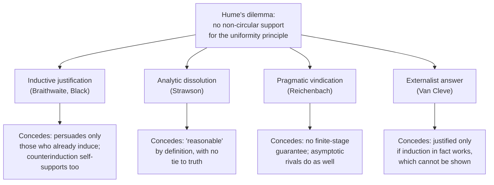

# Epistemology · Lesson 4.3: Answering Hume

> ⏱ ~15 min · Module 4: Sources: reason, induction, and other people · Builds on: [4.2 Hume's problem of induction](04-02-humes-problem-of-induction.md), [2.4 Reliabilism](02-04-reliabilism.md), [1.4 Internalism and externalism](01-04-internalism-and-externalism.md) · Unlocks: [4.4 Testimony](04-04-testimony.md), [5.4 The problem of priors](05-04-the-problem-of-priors.md)

## Why this matters

[4.2](04-02-humes-problem-of-induction.md) left a dilemma: the [uniformity principle](../reference.md#uniformity-principle) that every inference from experience relies on cannot be demonstrated, since its denial is conceivable, and cannot be supported by probable reasoning without assuming itself. Every science, every forecast, every trained model rests on the inference Hume says has no non-circular support. This lesson takes the four answers with the best credentials and asks one question of each: **what does it concede?** None of them simply shows, from premises a skeptic accepts, that the next observed case will probably resemble the past ones. Each buys something by giving something up, and the price is the thing to learn.

## The idea

**1. Justify induction inductively, and deny the circle is vicious.** R. B. Braithwaite (*Scientific Explanation*, 1953) and Max Black ("Self-Supporting Inductive Arguments", 1958) distinguished two kinds of circularity.

- An argument is **premise-circular** if its conclusion appears among its premises. That is vicious: it supports nothing.
- An argument is **rule-circular** if it uses a rule of inference to reach the conclusion that the rule is reliable. Its premises are not the conclusion.

Black's self-supporting argument, paraphrased: in most past uses of the inductive rule in a wide variety of conditions, it led from true premises to true conclusions; so, by the inductive rule, its next use will probably succeed too. The premise is a record of past successes, not the claim that induction is reliable. So the argument is rule-circular only, and Black argued that rule-circularity is not vicious. Defenders add that deduction, too, can only be defended by deductive steps. See [premise and rule circularity](../reference.md#premise-and-rule-circularity).

*What it concedes:* the argument can reassure someone who already reasons inductively, but cannot move someone who doesn't. Wesley Salmon pressed the point with a **counterinductive** rule: from "most observed A's are B" conclude "the next A is probably not B." Counterinduction has failed almost every time, so by its own rule it will probably succeed next time. If rule-circular self-support counts in induction's favour, it counts in counterinduction's too.

**2. Dissolve the question.** P. F. Strawson (*Introduction to Logical Theory*, 1952) argued that "reasonable," applied to beliefs about the unobserved, *means* proportioned to inductive evidence. Asking whether induction as a whole is reasonable is then like asking whether the legal system as a whole is legal: there is no higher standard to appeal to. This is the [analytic dissolution](../reference.md#analytic-dissolution). *What it concedes:* that induction is "reasonable" by definition says nothing about whether it will lead to truth. Hume's question was whether inductive conclusions are likely to be true, and the dissolution leaves that untouched.

**3. Vindicate the policy, not the conclusion.** Hans Reichenbach (*Experience and Prediction*, 1938; *The Theory of Probability*, 1949) gave up proving that induction will work and argued that it is the best policy if anything works. Treat the world as a sequence of trials and ask about the **limiting relative frequency** of an outcome: the value, if there is one, that the fraction of successes in the first $n$ trials approaches as $n \to \infty$. The **straight rule** posits that the limit equals the observed frequency: after $m$ successes in $n$ trials, posit $m/n$. This is [pragmatic vindication](../reference.md#pragmatic-vindication). *What it concedes:* no guarantee at any finite stage, and nothing about the next case. It defends a long-run policy, not any particular prediction.

**4. Go externalist.** James Van Cleve ("Reliability, Justification, and the Problem of Induction", 1984) applied [process reliabilism](../reference.md#process-reliabilism) ([2.4](02-04-reliabilism.md)): a belief is justified if it is produced by a reliable process, whether or not the believer can show that it is reliable. If induction is in fact reliable, ordinary inductive beliefs are justified. So is the belief that induction is reliable, even when it is reached by Black's rule-circular argument, because rule-circularity only matters if justification requires already knowing that your rule is good. *What it concedes:* the answer is conditional. Whether we are justified depends on a fact (induction's reliability) that we cannot establish to the skeptic's satisfaction. A counterinductivist in a world where counterinduction worked would be justified in just the same way. This is the [new evil demon problem](../reference.md#new-evil-demon-problem) ([1.4](01-04-internalism-and-externalism.md)) in a new setting.

**A constraint on all four.** Nelson Goodman (*Fact, Fiction, and Forecast*, 1955) defined a predicate, [grue](../reference.md#grue), that fits every emerald observed so far exactly as well as "green" but projects the opposite way for unobserved ones. So every answer above must already favour some predicates over others, or "follow the observed frequency" gives contradictory forecasts. That problem belongs to [`philosophy-of-science`](../../philosophy-of-science/syllabus.md) 1.2.

## The argument

Reichenbach's vindication, the most precisely stated of the four.

1. **Either the relative frequency of outcome $O$ in the sequence converges to a limit $L$, or it has no limit.** *In words:* an exhaustive case split, which needs no inductive premise.
2. **If it converges to $L$, the straight rule's posits $m_n/n$ (where $m_n$ is the number of $O$'s in the first $n$ trials) converge to $L$.** *In words:* the posit is the observed frequency, so if the observed frequency homes in on something, the posit does too. This is true by definition.
3. **If there is no limit, no method can find the limit, because none exists.** *In words:* in a world with no stable frequency, no method finds one.
4. **Any method that does find the limit, whether a clairvoyant, an oracle or a theory, will show that it works by its record of success, which the straight rule, applied to that record, will detect.** *In words:* induction can learn to trust any method that actually works.
5. ∴ **If any method of finding limiting frequencies succeeds, the straight rule succeeds (directly, or by learning to defer to the successful method).**

The conclusion is a conditional about the long run. It does not claim induction will work.

**Where the argument is weakest.** Premise 2 is true of the straight rule but not *only* of it. Salmon showed that any rule positing $m_n/n + c_n$, with $c_n \to 0$ as $n \to \infty$, also converges to $L$ whenever $L$ exists. Infinitely many such **asymptotic rules** share the straight rule's credential while disagreeing with it, and each other, at every finite $n$. So the argument does not single out the straight rule, and at the finite stage where all actual reasoning happens it permits nearly any posit. Defenders have tried to add constraints that select the straight rule. Critics reply that any such constraint either is arbitrary or reintroduces a preference for the observed frequency, which was the thing to be justified.

## The picture

Each answer keeps something (rational standing, a policy, justification) by giving up what Hume asked for: a non-circular reason, available from the inside, to expect the future to resemble the past.

## Worked examples

**Example 1 (clean case: the straight rule).** A lighthouse keeper logs, each morning, whether the fog has lifted by nine. After $n = 20$ mornings it has lifted on $m = 9$. The straight rule posits

$$\frac{m}{n} = \frac{9}{20} = 0.45$$

as the limiting frequency, and revises the posit as the log grows. Run the vindication. If the long-run frequency of early-lifting mornings exists, the keeper's posits converge to it. If the weather has no stable frequency (a climate shifting without settling, say), nothing would find a limit. Either way the keeper loses nothing by following the rule. Notice what has *not* been shown: that tomorrow's fog will probably lift, or that 0.45 is anywhere near the limit after only twenty mornings.

**Example 2 (hard case: an asymptotic rival).** A second keeper uses the rule "posit $(m + 900)/(n + 1000)$." This is a fixed-weight blend: it behaves as if 1,000 phantom mornings at frequency 0.9 had been added to the log. On the same 20 mornings it posits

$$\frac{9 + 900}{20 + 1000} = \frac{909}{1020} \approx 0.891.$$

Is it asymptotic? Write the posit as $m/n + c_n$. As $n \to \infty$ with $m/n \to L$, the phantom 1,000 mornings become negligible, so $(m + 900)/(n + 1000) \to L$ and $c_n \to 0$. With the frequency held at 0.45, the rival posits 0.675 at $n = 1{,}000$, about 0.491 at $n = 10{,}000$, and about 0.4504 at $n = 1{,}000{,}000$. It meets Reichenbach's standard exactly as the straight rule does. Replace 900 by 1,000 times any target value and you get a convergent rule positing nearly that target after 20 mornings. Pragmatic vindication by itself cannot tell the two keepers apart. A defence of the straight rule needs an extra premise, and that premise is where the inductive assumption comes back in.

The same structure appears as a theorem in [statistical-learning 1.4](../../statistical-learning/lessons/01-04-no-free-lunch-and-inductive-bias.md): averaged over all possible targets, no learner beats any other off the training data. A learner generalizes only by a bias toward some targets, the [no-free-lunch theorem](../reference.md#no-free-lunch-theorem) giving Hume's point a constant.

## Watch out

- **You might think Black's argument is premise-circular because it "assumes induction works," but actually** its premise is a record of past successes. The circularity is in the rule it uses. Whether that is benign is the live question, and Salmon's counterinductive mirror is the case it must answer.
- **You might think Strawson shows induction is reliable, but actually** he shows only that calling it reasonable is analytic. A person can accept the dissolution and still ask Hume's question in different words: will inductive conclusions tend to be true?
- **You might think the externalist answer says we *know* induction is reliable, but actually** it says that *if* induction is reliable, our inductive beliefs are justified, with no requirement that we can show the antecedent. Its critics say this changes the question. Its defenders say the old question demanded something no source of knowledge could supply, perception included.

## One-liner

> Every answer to Hume buys something (rational standing, a policy, justification) and pays with what Hume asked for: a non-circular reason, available from the inside, to trust the future.

## Problems

**P1 (🟢) *(Formal (a)–(b) · Evaluative (c))*** A ferry inspector records whether the 7:40 ferry departs on time. After $n = 40$ sailings it has done so $m = 26$ times.

(a) Give the straight rule's posit for the limiting frequency of on-time departures.

(b) A rival rule posits $(m + 10)/(n + 20)$. Compute its posit on the same data. Then prove it is asymptotic: show that $\left|\frac{m+10}{n+20} - \frac{m}{n}\right| \le \frac{20}{n+20}$ for all $0 \le m \le n$, and conclude that it converges to $L$ whenever $m/n$ does.

(c) In two sentences: what does (b) show about Reichenbach's argument, and which premise of "The argument" does it leave standing?

**P2 (🟡) *(Exegetical (a) · Evaluative (b))*** Read this invented forum post.

> "People still lose sleep over Hume. They shouldn't. 'Rational belief about the future' just *means* belief that fits the past pattern. Demanding a justification of induction is like demanding that the metre stick prove it is one metre long. There is nothing deeper to want, so there's no problem."

(a) Which of the four answers is this, and which sentence does the work? Two sentences.

(b) A skeptic replies: "Fine, call it rational. Is it *likely to be true*?" Say whether the post has the resources to answer, and what the post's author must concede or deny either way. Any verdict; 150 words or fewer.

**P3 (🔴, optional) *(Exegetical (a) · Evaluative (b))*** Invent two isolated communities. In Valley A, the world is regular and people reason inductively. In Valley B, the world is arranged so that counterinduction is reliable (observed patterns systematically reverse), and people reason counterinductively. Each community defends its method with a rule-circular argument from its own track record.

(a) Give Van Cleve's externalist verdict on whether each community's belief that its own method is reliable is justified, with a one-line reason for each.

(b) An internalist says the case shows that externalism has not answered Hume but changed the subject. State the internalist's premise precisely, then give the externalist's best reply and say what it costs. Any verdict; 150 words or fewer.

Solutions

**P1** *(Formal (a)–(b) · Evaluative (c))*

(a) $m/n = 26/40 = 0.65$.

(b) Rival posit:

$$\frac{26 + 10}{40 + 20} = \frac{36}{60} = 0.6.$$

So the two rules differ by $0.05$ on the same data. For the bound, put both over a common denominator:

$$\frac{m+10}{n+20} - \frac{m}{n} = \frac{n(m+10) - m(n+20)}{n(n+20)} = \frac{10n - 20m}{n(n+20)}.$$

Since $0 \le m \le n$, the numerator lies between $10n - 20n = -10n$ and $10n$, so $|10n - 20m| \le 10n \le 20n$, and

$$\left|\frac{m+10}{n+20} - \frac{m}{n}\right| \le \frac{20n}{n(n+20)} = \frac{20}{n+20}.$$

(The tighter bound $10/(n+20)$ also holds; either proves the point.) As $n \to \infty$, $20/(n+20) \to 0$. So if $m/n \to L$, the rival posit lies within a shrinking distance of $m/n$ and also converges to $L$. The two posits agree only when $10n = 20m$, that is when $m/n = 1/2$, which is not the case here. (Check: with the frequency held at 0.65, after 1,040 sailings the straight rule posits $676/1040 = 0.65$ and the rival $686/1060 \approx 0.6472$, a gap of about $0.0028$.)

**Must hit, any verdict (c):**

- (b) is an instance of Salmon's objection: convergence in the limit does not pick out the straight rule over rival asymptotic rules, which disagree at finite $n$.
- Premise 2 still holds of the straight rule (it does converge if a limit exists), as do the case split and the conditional conclusion. What fails is the inference from "the straight rule converges" to "the straight rule is *the* rule to follow."

**Wrong turns:** computing $(26+10)/(40+20)$ correctly but claiming the rival never converges because it "adds bias"; reading (b) as refuting premise 2, rather than showing it is not unique to the straight rule.

**Model answer (c), one of several:** The rival is a second rule with the straight rule's only credential, convergence to the limit if there is one, so the vindication cannot choose between them at any finite stage. Premise 2 survives, true of the straight rule, and so does the conditional conclusion. What fails is the claim that the argument singles out the straight rule.

---

**P2** *(Exegetical (a) · Evaluative (b))*

**Must hit, strict (a):** Strawson's analytic (ordinary-language) dissolution. The work is done by "'Rational belief about the future' just *means* belief that fits the past pattern": it makes "induction is rational" analytic. The metre-stick line is an analogy in the role of Strawson's legal-system one: there is no higher standard to appeal to.

**Must hit, any verdict (b):**

- Separate the two questions: whether inductive belief is *rational* (settled by definition, on the post's view) and whether it is *truth-conducive* (Hume's question).
- Either (i) the author concedes the post does not answer the second question and must argue it is not a legitimate question, or (ii) the author claims "rational" already includes likely truth and must then explain how a definition can guarantee a fact about the world.
- Say what follows: if (i), the dissolution has changed the subject rather than answered it; if (ii), the analytic claim smuggles in the uniformity assumption.

**Wrong turns:** treating the post as pragmatic vindication (it makes no claim about long-run success); treating the metre-stick analogy as the argument rather than an illustration of it.

**Model answer (b), one of several:** No, not by its own resources. The post makes "rational" mean "fits the past pattern," so it settles the first question by definition, but the skeptic has moved to a different predicate, "likely true," which no definition of "rational" controls. The author has two options. Concede the gap and argue that "is induction likely true?" has no non-inductive standard and so is idle, which keeps the dissolution but admits it changes the subject. Or insist that rationality entails likely truth, which turns the definition into a substantive claim about the world, the uniformity principle that needed support. The first is more defensible. It leaves Hume's worry as a question we cannot answer, not one shown to be confused.

---

**P3** *(Exegetical (a) · Evaluative (b))*

**Accept:** any pair of invented communities satisfying the stem; the verdicts below are fixed by the view.

**Must hit, strict (a):**

- Valley A: justified, because induction is in fact reliable there and the belief comes from a reliable (rule-circular) inductive process, which the externalist allows.
- Valley B: justified as well, because counterinduction is in fact reliable there and the belief comes from a process that is reliable in that world. Its rule-circularity is no more disqualifying than A's.

**Must hit, any verdict (b):**

- The internalist premise, stated precisely: answering Hume requires a reason the believer can access, which would favour her method over its rivals *from the inside*. A and B are internally symmetrical (each has a track record and a self-supporting argument), so nothing accessible favours either.
- The externalist reply: justification never required that kind of access. Perception, memory and deduction cannot be defended without circularity either, so the internalist's demand would make every source unjustified.
- The cost: the externalist gives up any first-person reason to prefer induction over counterinduction. Our standing depends on luck in which world we inhabit, a version of the new evil demon problem.

**Wrong turns:** saying Valley B is unjustified because counterinduction is "irrational" (that is an internalist or Strawsonian standard, not Van Cleve's); saying A's belief is unjustified because its argument is circular (the externalist denies rule-circularity matters).

**Model answer (b), one of several:** The internalist premise is that to answer Hume is to supply a reason, accessible to the reasoner, that favours induction over its rivals. The valleys are mirror images from the inside, so on that standard neither has answered him, and the externalist verdict "both justified" looks like a change of subject. The externalist replies that the demand proves too much: no source of belief can be shown reliable without using it, so the demand would condemn perception along with induction. That reply is strong against global skepticism, but it costs something real. The externalist must say that whether we are rational in trusting the future is settled by a fact we cannot check, and so cannot tell us, from the inside, which valley we live in.

## Flashback

**From Lesson [4.1](04-01-a-priori-knowledge.md) (A priori knowledge):** *(Exegetical (a) · Evaluative (b).)* Kant, *Critique of Pure Reason*, Introduction §II (Meiklejohn trans.):

> Experience no doubt teaches us that this or that object is constituted in such and such a manner, but not that it could not possibly exist otherwise. Now, in the first place, if we have a proposition which contains the idea of necessity in its very conception, it is à priori. … Secondly, an empirical judgement never exhibits strict and absolute, but only assumed and comparative universality (by induction) … If, on the other hand, a judgement carries with it strict and absolute universality, that is, admits of no possible exception, it is not derived from experience, but is valid absolutely à priori.

(a) Reconstruct the first test (necessity) as P1, P2, ∴ C, and say whether the passage makes necessity a sufficient condition, a necessary condition, or both, for being a priori. (b) "Lewis Carroll is Charles Dodgson" is necessary and knowable only a posteriori. Does it refute the necessity test? Name the premise or step it puts pressure on, the Kantian's best reply, and what that reply costs. 100 words or fewer, any verdict.

Solution

**Must hit, strict (a):**

- P1. Experience teaches only that something is so, never that it could not be otherwise. P2. A judgment of necessity represents its object as not possibly otherwise. ∴ C. Such a judgment is not derived from experience: it is a priori.
- Sufficient: "if we have a proposition which contains the idea of necessity … it is à priori". The quoted text gives a test, not a definition, and does not say every a priori judgment is necessary.

**Must hit, any verdict (b):**

- Locate the pressure: the identity's necessity is known through an empirical premise (Carroll is Dodgson, from archives) plus the a priori principle that a true identity between rigid names is necessary (Kripke's route). So experience is part of the grounds for this judgment of necessity.
- Say what that does to P1: it is true read as "experience *alone* cannot teach necessity", false read as "experience can be no part of the grounds". The true reading supports only "some a priori element is involved", not C.
- The Kantian's best reply and its cost: e.g. read the test as detecting an a priori ingredient, not classifying whole judgments. The cost is that it no longer sorts propositions into a priori and a posteriori, which is the job the passage gives it; it can no longer tell a route from a proposition's modal status.

**Wrong turns:** saying Kripke shows experience alone can teach necessity (his route uses an a priori premise); citing the contingent a priori (the metre stick) against this test, since a contingent a priori truth does not violate a sufficient condition for apriority; calling the identity contingent because it was discovered.

**Model answer (b), one of several:** It refutes the test as a classifier of propositions. We know that Carroll is necessarily Dodgson only by combining archival evidence with the a priori principle that true identities between names are necessary. P1 holds if it means experience *alone* can't teach necessity, but then C overreaches: it shows an a priori ingredient, not an a priori judgment. The Kantian can retreat to that weaker claim. The cost is that necessity stops being a mark of how a judgment is known, which was the test's whole point.

## Connections

- **Backward:** [4.2](04-02-humes-problem-of-induction.md) supplies the dilemma all four answers address. The externalist answer is [process reliabilism](02-04-reliabilism.md) applied to an inference rule, and its rule-circular self-support is the bootstrapping worry from 2.4 at the scale of a whole method. Its conditional character is the access dispute of [1.4](01-04-internalism-and-externalism.md). Goodman's view that rules and inferences justify each other by mutual adjustment is the circle in [philosophical-method 3.4](../../philosophical-method/lessons/03-04-intuitions-and-reflective-equilibrium.md).
- **Forward:** [4.4](04-04-testimony.md) asks whether trusting testimony can be justified without an inductive record of speakers' reliability. [5.4](05-04-the-problem-of-priors.md) recasts the problem: once updating is fixed by conditionalization, induction lives in the prior, and grue becomes a question about priors. [`philosophy-of-science`](../../philosophy-of-science/syllabus.md) takes up what a logic of confirmation would look like once this problem is left open, starting with grue.
- **Sideways:** the no-free-lunch theorem in [statistical-learning 1.4](../../statistical-learning/lessons/01-04-no-free-lunch-and-inductive-bias.md) is the formal relative of Salmon's asymptotic rules: every learner that generalizes does so by a bias the data cannot justify. [metaphysics 4.1](../../metaphysics/lessons/04-01-humes-challenge-and-the-regularity-theory.md) granted the inductive expectation in order to ask what causation is. This lesson and 4.2 asked whether the expectation is warranted.
