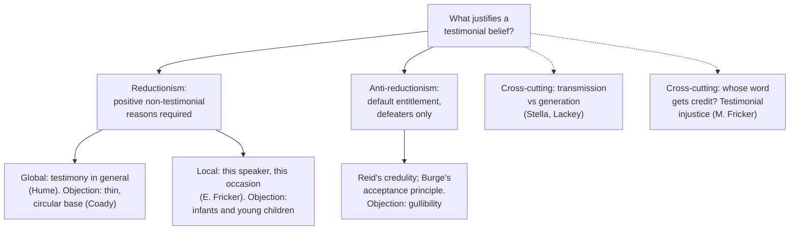

# Epistemology · Lesson 4.4: Testimony

> ⏱ ~15 min · Module 4: Sources: reason, induction, and other people · Builds on: [4.2 Hume's problem of induction](04-02-humes-problem-of-induction.md), [2.4 Reliabilism](02-04-reliabilism.md), [2.5 Virtue epistemology](02-05-virtue-epistemology.md) · Unlocks: [4.5 Peer disagreement](04-05-peer-disagreement.md)

## Why this matters

You know your date of birth, that the Earth is billions of years old, and that there is a city called Ulaanbaatar. You saw none of it. Almost everything you know about history, science, geography and your own early life you were told. [philosophical-method 2.3](../../philosophical-method/lessons/02-03-informal-fallacies-and-when-they-arent.md) called the legitimate appeal to authority testimony; this lesson asks what makes it legitimate. Is testimony a source of knowledge in its own right, like perception, or a shortcut whose credentials must come from somewhere else? And can a hearer come to know something the speaker herself does not know?

## The idea

**Testimony** here means belief formed on the basis of someone's telling: an assertion offered as true, spoken or written. The question is what justifies a hearer in believing what she is told. Two families of answer.

**Reductionism.** Testimonial justification reduces to the other sources: perception, memory and inference. The hearer is justified only if she has **positive reasons**, not themselves drawn from testimony, for thinking this telling is trustworthy. Testimony adds no new kind of warrant; it is evidence like a smoke alarm is evidence. See [reductionism about testimony](../reference.md#reductionism-about-testimony). Two strengths:

- **Global reductionism:** the hearer needs non-testimonial reasons to think testimony *in general* is reliable. Hume is the classical source. In *Enquiry* §X Part I he says that our confidence in reports is

  > "derived from no other principle than our observation of the veracity of human testimony, and of the usual conformity of facts to the reports of witnesses."

- **Local reductionism:** the hearer needs reasons to trust *this speaker on this occasion*: her competence on the topic, her sincerity, the kind of report it is. Elizabeth Fricker ("Against Gullibility", 1994; a critical notice in *Mind*, 1995) defends this, adding that a mature hearer must monitor the speaker for signs of untrustworthiness.

C. A. J. Coady (*Testimony: A Philosophical Study*, 1992) pressed the decisive-looking objection to the global version. Each of us has checked only a tiny, unrepresentative sample of reports against the facts, and most of what passes for checking itself leans on further testimony: maps, dictionaries, textbooks, what other people saw. The observational base the global reductionist needs is not there, and the attempt to build it is circular. That is why most reductionists now go local.

**Anti-reductionism.** Testimony is a basic source. A hearer is justified by default in accepting what she is told, unless she has a **defeater**: a reason to doubt this speaker or this claim. No positive reasons are required. See [anti-reductionism about testimony](../reference.md#anti-reductionism-about-testimony). Thomas Reid (*Inquiry into the Human Mind*, 1764) is the classical source (below). Tyler Burge ("Content Preservation", 1993) gives the modern statement, his **acceptance principle**: roughly, a person is entitled to accept as true what is presented as true and intelligible to her, unless there are stronger reasons not to. Burge holds this entitlement is a priori, because intelligible assertion comes from a rational source, and reason is a guide to truth.

The standing objection runs the other way: default trust looks like **gullibility**. If an anti-reductionist hearer believes a stranger's assertion without a single reason to trust him, her belief seems no better than a guess that happens to be shaped like a sentence. Fricker's title names the charge.

**Transmission or generation?** A separate question cuts across the first. On the **transmission view**, testimony works like memory: it can pass knowledge along but cannot create it. Its necessity thesis: if a hearer knows $p$ by testimony, the speaker knew $p$. Michael Dummett (1994) put the view as testimony being not a source but the transfer of knowledge acquired by other means. Jennifer Lackey ("Testimonial Knowledge and Transmission", 1999; *Learning from Words*, 2008) argues that testimony can **generate** knowledge. Her case: Stella, a creationist and devout schoolteacher, does not believe that *Homo sapiens* evolved from *Homo erectus*. Because it is her job, she teaches the evolutionary account to her fourth-grade pupils, accurately and on good evidence she herself rejects. The pupils seem to come to know it; Stella does not, since she does not even believe it. See [transmission and generation views](../reference.md#transmission-and-generation-views).

**Testimonial injustice.** Miranda Fricker (*Epistemic Injustice*, 2007) adds an ethical dimension. **Testimonial injustice** occurs when a hearer gives a speaker less credibility than she deserves because of the hearer's **identity prejudice**: a prejudice tracking the speaker's social identity (race, gender, class) and resistant to counter-evidence. Her central examples are literary: the all-white jury in Harper Lee's *To Kill a Mockingbird* that disbelieves Tom Robinson despite the evidence, and Herbert Greenleaf in Patricia Highsmith's *The Talented Mr Ripley* dismissing Marge Sherwood's well-grounded suspicion as mere female intuition. The speaker is wronged in her capacity as a knower; the hearer, separately, loses knowledge he could have had. Fricker makes the credibility *deficit* the central case. See [testimonial injustice](../reference.md#testimonial-injustice).

## Source

Reid has just argued that we are disposed by nature to speak the truth, the *principle of veracity*. He goes on (*Inquiry* ch. VI §XXIV, "Of the Analogy between Perception, and the Credit we give to Human Testimony"):

> "Another original principle implanted in us by the Supreme Being, is a disposition to confide in the veracity of others, and to believe what they tell us. This is the counter-part to the former; and as that may be called the principle of veracity, we shall, for want of a more proper name, call this the principle of credulity. It is unlimited in children, until they meet with instances of deceit and falsehood: and it retains a very considerable degree of strength through life. … It is evident, that, in the matter of testimony, the balance of human judgment is by nature inclined to the side of belief; and turns to that side of itself, when there is nothing put into the opposite scale."

The last sentence is the anti-reductionist default in Reid's own image: belief is the resting position of the scale, and only a weight on the other side (a defeater) moves it. See [principles of veracity and credulity](../reference.md#principles-of-veracity-and-credulity). Note "credulity" is not a vice here; it names a disposition that experience then trains and restrains.

## The argument

Coady's argument against global reductionism, in standard form.

1. **If global reductionism is true, an ordinary hearer is justified in a testimonial belief only if she has non-testimonial reasons to think testimony is generally reliable.** *In words:* the view's own condition.
2. **Such reasons could only come from her own observation that reports have matched the facts.** *In words:* Hume's "observed conformity."
3. **Each ordinary hearer has observed the match for only a small, unrepresentative sample of reports, and much of her checking itself relies on testimony.** *In words:* the base is thin and contaminated.
4. **So no ordinary hearer has the reasons global reductionism requires.** *In words:* from 2 and 3.
5. **Ordinary hearers are justified in many testimonial beliefs (their birthdays, the existence of distant cities).** *In words:* the datum any theory must respect.
6. ∴ **Global reductionism is false.** *In words:* from 1, 4 and 5 by modus tollens.

**Where the argument is weakest.** The local reductionist accepts the conclusion and rejects the claim that it generalizes: she never needed testimony-in-general to be vindicated, only reasons about this speaker and this kind of report, and those, she says, ordinary adults do have (the speaker is a pharmacist, the claim is routine, nothing seems off). A critic of premise 3 adds that the base need not be first-hand case-by-case checking: coherence among many reports, and the success of plans built on them, are non-testimonial evidence too. The anti-reductionist presses the local view in turn with Reid's children: an infant has no reasons about anyone's reliability, yet learns words and facts from her parents. The local reductionist's options are to say children's beliefs are justified in some weaker sense, or to restrict the requirement to mature hearers. Either reply concedes that some testimonial justification runs without positive reasons, which is the anti-reductionist's thesis.

## Map of positions

The two dashed questions are independent of the first split: a reductionist or an anti-reductionist can hold either view of transmission, and either owes an account of prejudiced credibility judgments.

## Worked examples

**Example 1 (clean case).** Lucía, just arrived in an unfamiliar city, asks the receptionist at her hotel what time the cathedral closes. "Six," he says, and it does. Run each view.

- *Global reductionism:* Lucía is justified only if she has non-testimonial reasons that testimony in general is reliable. By Coady's argument she lacks them, so on this view she is not justified. That verdict is the view's problem, not Lucía's.
- *Local reductionism:* she has reasons about this speaker and report: receptionists are asked this daily, he has no motive to lie, the answer is unremarkable, and nothing in his manner is off. Condition met; justified.
- *Anti-reductionism:* she has no defeater. Condition met; justified.

On a clean case the local and anti-reductionist verdicts coincide. They differ in *why*: for the local reductionist Lucía's reasons do the work; for the anti-reductionist they are a bonus, and only a defeater would matter.

**Example 2 (hard case: Stella).** Run the transmission necessity thesis on Lackey's case precisely.

- *Condition:* if a pupil knows $p$ by testimony, the speaker knew $p$.
- *Antecedent:* the pupils' belief is true, formed by a reliable route (a competent teacher accurately reporting a well-confirmed textbook claim), with no defeaters. Most readers judge that they know.
- *Consequent:* Stella does not believe $p$, so she does not know it.

If the pupils know, the thesis fails. Defenders of transmission have two replies. One denies the pupils know; the cost is that the classroom is a paradigm of learning, and it seems arbitrary that the pupils' knowledge depends on their teacher's private faith rather than on the reliability of what she says. The other relocates the knowledge: the pupils inherit it from the scientists behind the textbook, with Stella only a conduit. The cost is that the transmission view then no longer tracks the speaker in front of you, which was its point. Lackey's own moral is that what matters is the reliability of the *statement*, not the speaker's state of mind. Notice what the case does *not* settle: whether the pupils need positive reasons to trust their teacher. The reductionism question and the transmission question are separate.

## Watch out

- **You might think anti-reductionism says believe everything you are told, but actually** it says the default is acceptance *absent defeaters*. Reid's credulity is restrained by experience; the dispute is over whether positive reasons are also required.
- **You might think reductionism is the view that testimony is unreliable, but actually** it is a view about the *source* of testimonial justification. A reductionist can hold that testimony is overwhelmingly reliable; she holds that its justification comes from the hearer's other evidence.
- **You might think testimonial injustice is any case of disbelieving a true speaker, but actually** Fricker's central case needs a credibility deficit *caused by identity prejudice*. A judge who disbelieves an honest witness because the evidence pointed the other way has made an error, not this injustice.

## One-liner

> Reductionists make trust earn its keep from other evidence, anti-reductionists make doubt earn its keep, and Stella's pupils show that what you are told can be known even when the teller does not know it.

## Problems

**P1 (🟢) *(Exegetical (a) · Evaluative (b))*** Read this passage from the same section of Reid's *Inquiry* (ch. VI §XXIV). The "supposition" is that our trust in testimony is produced by reasoning from experience.

> "Children, on this supposition, would be absolutely incredulous; and therefore absolutely incapable of instruction: those who had little knowledge of human life, and of the manners and characters of men, would be in the next degree incredulous; and the most credulous men would be those of greatest experience, and of the greatest penetration … In a word, if credulity were the effect of reasoning and experience, it must grow up and gather strength, in the same proportion as reason and experience do. But, if it is the gift of nature, it will be strongest in childhood, and limited and restrained by experience; and the most superficial view of human life shews, that the last is really the case, and not the first."

(a) Put Reid's argument in numbered premises and a conclusion, and say what form it has.

(b) A local reductionist replies: "Reid shows where our trust *comes from*. I am talking about when trust is *justified*." Does the reply defeat the passage as an argument against reductionism? Any verdict; 150 words or fewer.

**P2 (🟡) *(Evaluative)*** Stella does not believe what she tells her pupils. Build a different case, with invented people, in which a hearer plausibly comes to know $p$ by testimony although the speaker *believes* $p$ and still does not know it. Name the condition on knowledge the speaker fails and explain why the hearer does not fail it. Then give the transmission theorist's best reply in one sentence. 150 words or fewer.

**P3 (🔴, optional) *(Exegetical (a) · Evaluative (b))*** Read this invented staff-room exchange.

> **Head of science:** A student from the evening programme says her titration gave 0.48 molar, and she wants it marked correct. I've given it no weight. Evening students rush and fudge.
> **Lab technician:** I watched her run it twice. Her technique was textbook.
> **Head of science:** That doesn't change what I know about evening students.

(a) Using Miranda Fricker's definition, say whether the head of science commits testimonial injustice, naming each element of the definition and the line that shows it. Two or three sentences.

(b) The head of science later says: "I'm a local reductionist. I'm required to use what I know about the speaker, and group membership is part of what I know." Find the crux between him and Fricker: the single claim one side must deny. Say what would show it true or false. 150 words or fewer.

Solutions

**P1** *(Exegetical (a) · Evaluative (b))*

(a)

**Must hit, strict (a):**

- P1: If trust in testimony were produced by reasoning from experience, it would grow in proportion as reason and experience grow (weakest in children and the inexperienced, strongest in the most experienced).
- P2: Trust is in fact strongest in childhood and is limited and restrained by experience.
- C: So trust in testimony is not produced by reasoning from experience; it is a gift of nature (an original principle).
- Form: modus tollens.

**Wrong turns:** reading the conclusion as "children's beliefs are unjustified" (Reid's conclusion is about the origin of the disposition); missing the conditional and reconstructing it as a bare appeal to observation.

(b)

**Must hit, any verdict (b):**

- State the gap precisely: Reid's conclusion is about the causal origin of trust, while reductionism is a thesis about what justifies it.
- Say what extra premise would close the gap (e.g. children are justified in much testimonial belief, and they lack the reasons reductionism requires), and whether Reid's passage supplies it.
- Say what the reductionist must concede or deny in reply (children's beliefs are unjustified, or justified in a weaker sense, or the requirement applies only to mature hearers).

**Model answer (b), one of several:** The reply defeats the passage taken alone. Reid's conclusion is psychological: the disposition to trust does not come from reasoning. A reductionist can grant that and hold that trust becomes *justified* only once a hearer has reasons. But the passage carries a second, implicit argument: children are "capable of instruction" and learn a great deal by being told, and they lack the reasons reductionism demands. If children know what they learn, origin and justification come back together. So the reductionist must either deny that young children know what they are taught, or exempt them, and exempting them grants that some testimonial knowledge needs no positive reasons. The reply wins against the passage's letter, but not against the case it points to.

---

**P2** *(Evaluative)*

**Accept:** any case where (i) the speaker sincerely believes $p$ and $p$ is true, (ii) the speaker fails a named condition on knowledge (a Gettier-style false lemma, unsafe belief, a defeater she possesses, insensitivity), (iii) the hearer's belief plausibly lacks that defect, and (iv) a one-sentence transmission reply is given.

**Must hit, any verdict:**

- A speaker who believes $p$ but does not know it, with the failed condition named.
- A reason the hearer's belief is free of that defect: the defect is the speaker's private defeater, or the hearer's environment differs.
- A transmission reply: deny the hearer knows, or relocate the knowledge to another source, or restrict the thesis.

**Wrong turns:** a case where the speaker does not believe $p$ (that is Stella again); a case where the hearer's knowledge comes from her own non-testimonial evidence, so that it is not testimonial knowledge at all.

**Model answer, one of several:** Dev, a site engineer, tells an apprentice that the scaffold passed its load test, which it did. Dev believes it, but he has just been told by his supervisor, credibly though in fact falsely, that the test certificates on this site were forged. He keeps believing out of habit. Dev has an undefeated defeater, so he does not know. The apprentice was not there for the supervisor's remark; she has no defeater, and the claim is true and came from the site's reliable inspection system through a sincere speaker. She plausibly knows. Transmission reply: the apprentice's knowledge comes from the inspection record behind Dev, not from Dev, so the thesis survives once "speaker" means the original source.

---

**P3** *(Exegetical (a) · Evaluative (b))*

(a)

**Must hit, strict (a):**

- Credibility deficit: the student's report is given "no weight."
- Caused by identity prejudice: the deficit tracks her social identity ("evening students rush and fudge"), not evidence about this report.
- Resistance to counter-evidence, which marks prejudice rather than a mere false belief: the technician's eyewitness report is dismissed with "That doesn't change what I know."
- Verdict: yes, on Fricker's definition, if the evening-student generalization is a prejudice. The last line is the strongest evidence that it is.

**Wrong turns:** answering "no, because he may be right about evening students on average" without addressing the resistance to individual counter-evidence; treating any disbelief of a true report as testimonial injustice.

(b)

**Must hit, any verdict (b):**

- State the crux as one claim, e.g. "A credibility judgment based on an accurate group statistic, held responsively to evidence, is not prejudice." The head of science must assert it; Fricker's position need not deny it, so the real dispute is whether *his* generalization is accurate and evidence-responsive.
- Note the separate point that local reductionism requires using *all* available evidence about the speaker, including the technician's direct observation, which screens off a group base rate.
- Say what would settle it: data on evening students' actual error rates, and whether he updates when shown them.

**Model answer (b), one of several:** The crux is whether his generalization is evidence, or a prejudice dressed as evidence. Fricker can grant that an accurate, evidence-responsive group statistic may properly bear on credibility. What makes a judgment prejudiced is resistance to counter-evidence driven by attitudes toward the group. So he must claim that his generalization is accurate and that he would revise it. Two facts would test this: the evening programme's actual error rate on titrations, and his response to the technician. The second already counts against him on his own principles. A local reductionist must weigh everything he knows about this speaker on this occasion. The technician's eyewitness report of her technique is far more specific than group membership, and he gave it no weight. His reductionism, applied properly, condemns his verdict.

## Flashback

**From Lesson [4.2](04-02-humes-problem-of-induction.md) (Hume's problem of induction):** *(Exegetical.)* Apply the argument to new cases. For each inference, say whether Hume's argument (P1 to P6 of 4.2) applies to it and why, in one or two sentences each.

(i) A clerk adds a column of figures, $17 + 26 + 9$, and concludes that the total is $52$.

(ii) A geologist finds long parallel scratches in the bedrock of a valley no one has ever seen glaciated, and concludes that a glacier once covered it, because that best explains the scratches.

(iii) An electrician reasons: "All copper wire conducts electricity; this wire is copper; so this wire conducts." The argument is deductively valid.

(iv) A pollster finds that 312 of 600 sampled voters favour a measure and estimates that about 52 percent of all voters do.

Solution

**Must hit, strict:**

- (i) Does not apply. The sum is a relation of ideas, reached by demonstrative reasoning; denying it yields a contradiction, so no uniformity principle is needed.
- (ii) Applies. Inference to the best explanation about an unobserved matter of fact is probable reasoning: it relies on a cause-effect link (glaciers make such scratches) known only from observed cases, and presupposes that this unobserved case resembles them. "Unobserved" includes the past, not only the future.
- (iii) Applies, despite validity. Validity relocates the problem: the premise "all copper wire conducts" is a matter of fact about unobserved wires, supported only by experience, so it presupposes the uniformity principle. "Deductive versus inductive" is the wrong contrast; what matters is whether a premise is an empirical claim about the unobserved.
- (iv) Applies. Estimating a population from a sample goes from observed to unobserved cases, so it presupposes that the unsampled voters resemble the sampled ones.

**Wrong turns:** exempting (iii) because it is deductively valid; exempting (ii) because it concerns the past, not a prediction; saying the argument applies to (i) because arithmetic was first learned from experience (Hume counts it a relation of ideas, known by thought alone); treating (iv) as safe because a margin of error makes the estimate only probable (Hume's second horn targets probable reasoning too).

**Model answer:** (i) No: arithmetic is a relation of ideas, and its denial is contradictory, so no bridge is needed. (ii) Yes: it infers an unobserved past cause from a cause-effect link learned in observed cases, so it presupposes that the unobserved resembles the observed. (iii) Yes: the argument is valid, but its general premise is a matter of fact about unobserved wires, and supporting that premise needs the uniformity principle. (iv) Yes: generalizing from the sample to the unsampled voters is horn-two reasoning, however careful the sampling.

## Connections

- **Backward:** the appeal to authority in [philosophical-method 2.3](../../philosophical-method/lessons/02-03-informal-fallacies-and-when-they-arent.md) is testimony, and this lesson asks what licenses it. Anti-reductionism's default-plus-defeaters structure is the shape of modest foundationalism and phenomenal conservatism in [2.2](02-02-foundationalism.md), applied to what you are told rather than to how things seem. The reliabilist verdict on Stella's pupils is [2.4](02-04-reliabilism.md)'s process reliabilism at work. Lackey's Chicago visitor in [2.5](02-05-virtue-epistemology.md), who knows the way to the Sears Tower though the credit seems to belong to the passer-by, was testimony pressing on the credit theory of knowledge.
- **Forward:** [4.5](04-05-peer-disagreement.md) asks what to do when the testimony of an equally good thinker contradicts your own judgment. Hume's application of his testimonial principle to reports of miracles belongs to [philosophical-method 2.4](../../philosophical-method/lessons/02-04-weighing-evidence-in-odds-form.md) and [`philosophy-of-religion`](../../philosophy-of-religion/syllabus.md). Testimony to revelation, and believing on the word of a witness, are what [fundamental-theology 2.1](../../fundamental-theology/lessons/02-01-the-act-of-faith.md) builds faith on.
- **Sideways:** the credibility economy behind testimonial injustice is a theme in social epistemology and in political philosophy's accounts of who counts in public deliberation ([`political-philosophy`](../../political-philosophy/syllabus.md)). Fricker's companion notion, hermeneutical injustice, where a group lacks the concepts to make sense of its own experience, is not covered here.
