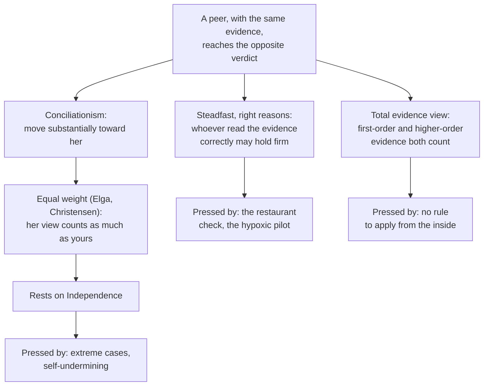

# Epistemology · Lesson 4.5: Peer disagreement

> ⏱ ~15 min · Module 4: Sources: reason, induction, and other people · Builds on: [4.4 Testimony](04-04-testimony.md), [4.3 Answering Hume](04-03-answering-hume.md), [ethics 6.6 Moral knowledge and disagreement](../../ethics/lessons/06-06-moral-knowledge-and-disagreement.md) · Unlocks: [5.5 Bayesian disagreement and higher-order evidence](05-05-bayesian-disagreement-and-higher-order-evidence.md)

## Why this matters

[4.4](04-04-testimony.md) asked when another person's say-so can give you knowledge. This lesson asks the reverse question: what should you do when someone as good as you, looking at the same evidence, tells you the opposite? [philosophical-method 4.3](../../philosophical-method/lessons/04-03-finding-the-crux.md) taught you to find the premise a dispute turns on. It left open what happens when the crux is named and your equally careful opponent still disagrees. Scientists, judges, philosophers and forecasters face this all the time. And if your credence in a moral theory ([decision-theory 6.3](../../decision-theory/lessons/06-03-moral-uncertainty.md)) is supposed to come from somewhere, much of it comes from here.

## The idea

**Peers.** You and S are [epistemic peers](../reference.md#epistemic-peer) on a question when (i) you share the relevant evidence and (ii) you are equally competent at assessing it: equally intelligent, careful, unbiased and alert *on this occasion*. Both conditions are idealized. The question is what an idealized case shows.

**The case.** David Christensen ("Epistemology of Disagreement: The Good News", *Philosophical Review*, 2007) gave the case that started much of the debate. Five friends at dinner agree to split the bill evenly and add a 20 percent tip. Christensen does the sum in his head and gets 43 dollars each; a friend, equally good at mental arithmetic and with an equally good track record, gets 45. Almost everyone's verdict: Christensen should become much less confident that the share is 43. The friend's answer is evidence that *he* slipped, and he has no reason to think it was the friend who slipped rather than him.

**Three views on what follows.**

1. **Conciliationism.** On learning that a peer disagrees, you must move substantially toward her view. Its best-known form is the [equal weight view](../reference.md#equal-weight-view), taught in [ethics 6.6](../../ethics/lessons/06-06-moral-knowledge-and-disagreement.md) along with the spinelessness objection and Elga's self-exemption reply. Adam Elga's version ("Reflection and Disagreement", *Noûs*, 2007) is precise. When you learn that someone disagrees, your probability that you are the one who is right should equal your *prior conditional* probability that you would be right. "Prior" means before you thought the question through. "Conditional" means given what you know of the circumstances of the disagreement. For a peer, that probability is 1/2. *In words:* judge who is likely to be right in the way you would have judged it before seeing the arguments, not by consulting the arguments that are in dispute. The principle doing the work is what Christensen later called **Independence**: your reasons for discounting a peer's view must be independent of the disputed reasoning itself.

2. **The steadfast view, right-reasons form.** Thomas Kelly ("The Epistemic Significance of Disagreement", *Oxford Studies in Epistemology* 1, 2005) argued that the evidence supports what it supports. If your shared evidence favours $p$ and you saw that, a peer's mistake does not change what the evidence favours, so the person who reasoned correctly may keep her view. The label "right reasons" comes from later discussion. *In words:* whoever actually got it right may stand firm.

3. **The [total evidence view](../reference.md#total-evidence-view).** Kelly ("Peer Disagreement and Higher-Order Evidence", in Feldman and Warfield (eds.), *Disagreement*, 2010) revised his position. Disagreement is **higher-order evidence**: evidence about how well you have handled your first-order evidence. What you should believe depends on both the first-order evidence and the higher-order evidence, and neither always wins. Where the first-order evidence is rich and one party read it correctly, she may move only a little. Where the higher-order evidence is massive, it swamps the first-order evidence: if many reliable peers independently reach a verdict, it becomes reasonable to believe it even if each of them reasoned badly. *In words:* everything counts, and the weights depend on the case.

**Splitting the difference** is the simplest conciliatory rule. With credences, it means each party moves to the average: credences of 0.8 and 0.2 become 0.5 and 0.5. [5.5](05-05-bayesian-disagreement-and-higher-order-evidence.md) turns this into a theory of pooling.

**Higher-order evidence without a peer.** A pilot at high altitude does a fuel calculation, and it checks out. She then remembers that at this altitude [hypoxia](../reference.md#higher-order-evidence) impairs reasoning without feeling like it, and that pilots in her position get such calculations right only about half the time. Cases of this shape were developed by Elga and by Christensen ("Higher-Order Evidence", *Philosophy and Phenomenological Research*, 2010). Her calculation is perfectly good first-order evidence. The question is whether she may still rely on it. Peer disagreement is one instance of this general problem.

## The argument

The conciliationist's argument, run on the restaurant check.

1. **Before comparing answers, you had no reason to expect yourself to be more reliable than your friend on this sum.** *In words:* the peer stipulation.
2. **Independence: whether you may discount her answer must be settled by reasons that do not depend on the disputed calculation.** *In words:* "my sum says 43, so she must be wrong" is not allowed.
3. **Setting the disputed calculation aside leaves you only your symmetrical prior reasons.**
4. **So the probability that you are the one who erred is about 1/2.**
5. ∴ **You should be about as confident that the share is 45 as that it is 43, and much less confident than before.**

**Where the argument is weakest.** Premise 2. Kelly and Jennifer Lackey (2010) attack Independence. Lackey's case: a respected colleague tells you that 2 + 2 is not 4. On Independence you may not appeal to your arithmetic, but you obviously should not split the difference. The steadfast critic concludes that the strength of your first-order evidence may count in deciding who erred. Conciliationists reply that it is your *independent* confidence that you are not malfunctioning which justifies dismissing the colleague: such an absurd answer is itself evidence that something has gone wrong with her, and your confidence in your own sanity outruns your trust in her. The critic replies in turn that the line between that and "I'm right, so she's wrong" is exactly what is in dispute.

## Map of positions

The total evidence view agrees with conciliationism in symmetric cases and with the steadfast view where first-order evidence is strong and was read correctly. What it gives up is a rule you can follow without already knowing which reading was correct.

## Worked examples

**Example 1 (clean case: the restaurant check on all three views).** Christensen gets 43, his friend 45, same bill, same arithmetic skills.

- *Equal weight.* Prior conditional probability of being right, given a disagreement like this between equals: 1/2. Christensen should be roughly as confident in 45 as in 43, and should check the sum.
- *Right reasons.* Whoever did the sum correctly may keep the answer. But Christensen cannot tell from the inside whether his mental arithmetic was the correct one: that is exactly what the disagreement throws into doubt. The view gives a verdict about what is rational, but not one he can act on.
- *Total evidence.* The first-order evidence (a quick mental sum) is thin, and the higher-order evidence (an equally reliable person got a different answer) is strong. So it dominates, and the verdict matches conciliationism. Kelly accepts this for cases of this shape; his own example is two spectators who see a close horse race finish differently.

The case is strong for conciliation because the first-order evidence is weak and nobody's reading of it is privileged.

**Example 2 (hard case: two wrong peers agree).** Two auditors examine the same accounts. Suppose the evidence, correctly read, supports a credence of 0.2 that the firm is hiding losses. Both misread it: one ends up at 0.6, the other at 0.9. They compare notes and, following equal weight, converge on

$$\frac{0.6 + 0.9}{2} = 0.75.$$

Equal weight says 0.75 is now the right credence for both. Kelly, crediting the case's structure to Aaron Bronfman, calls this implausibly easy bootstrapping. Two unjustified credences, once averaged, become a justified one, while the evidence still supports 0.2. Conciliationists reply that splitting the difference is a *necessary* condition of rationality, not a sufficient one. Kelly answers that this reading gives up the case where one peer was right. Suppose one auditor had correctly reached 0.2 and the other 0.9. Splitting gives 0.55, and on the weaker reading the correct auditor ends up irrational for doing exactly what the view requires.

The total evidence view handles both cases with no fixed rule. In the first, the first-order evidence still pulls toward 0.2. In the second, the correct auditor may stay well below 0.55. Kelly concedes the cost: with enough independent peers who agree, the swamping point arrives, and agreement makes a badly reasoned belief reasonable.

**The self-undermining objection, pressed harder.** [Ethics 6.6](../../ethics/lessons/06-06-moral-knowledge-and-disagreement.md) gave the objection (conciliationism is disputed among peers, so it tells you to doubt itself) and Elga's reply ("How to Disagree About How to Disagree", in the same 2010 volume): a rule for responding to evidence must be dogmatic about its own correctness, or it gives inconsistent advice. The sharper worry is structural. The rule now reads "conciliate about everything except this rule". A steadfast theorist asks why the exemption should stop there, since right reasons is just "stay firm on what you correctly judged" applied more widely. Christensen ("Epistemic Modesty Defended", 2013) takes a different route. He grants that conciliationism can put you in a bind where you must violate *some* rational ideal, as when respecting your evidence and respecting evidence about your own reliability pull apart. He argues that any principle of [epistemic modesty](../reference.md#self-undermining-objection) produces such binds, so this one is not refuted by producing one. Whether that is a defence or a concession is open.

## Watch out

- **You might think a peer is anyone who disagrees reasonably, but actually** peerhood is fixed *before* and independently of the dispute: shared evidence plus equal competence. "She got this one wrong, so she isn't my peer here" is exactly what Independence forbids.
- **You might think the total evidence view is just the steadfast view, but actually** it often requires conciliation, and with enough peers it can require it from someone who reasoned correctly. Its difference from equal weight is that the first-order evidence never drops out of the calculation.
- **You might think higher-order evidence is evidence against $p$, but actually** it is evidence about *your assessment* of the evidence for $p$. The hypoxic pilot's fuel data favours the calculated answer just as much as before. What has changed is her evidence that she read it reliably, and whether that should lower her credence in the answer is the open question.

## One-liner

> Disagreement is evidence about yourself; conciliationism makes it decisive, right reasons makes it idle, and the total evidence view weighs it, at the price of a rule you cannot apply without knowing who was right.

## Problems

**P1 (🟢) *(Formal (a) · Exegetical (b)–(c))*** Two pharmacists, Priya and Tomas, independently check whether a compounded batch meets its specification. They have the same lab records and equal training and track records. The records, correctly read, support credence 0.25 that the batch is out of specification. Priya reaches 0.25; Tomas reaches 0.85. They compare notes.

(a) Compute the credence the equal weight view, as splitting the difference, assigns each of them.

(b) Say what the right-reasons view and the total evidence view each say about Priya and about Tomas. One line per view; give a direction or bound, not a number, where the view gives no number.

(c) Change one fact. Tomas knows that in past disagreements with Priya on calculations of exactly this kind, Priya was right three times out of four. What does Elga's rule tell Tomas his credence should be that his own reading is the right one, and does it still count as an equal weight case?

**P2 (🟡) *(Exegetical (a) · Evaluative (b))*** An invented post on a forecasting forum:

> "When a forecaster I respect gives 30 percent where I gave 80, I always look at her reasoning first. If her reasoning has a flaw I can spot, she's not my peer on this question and I keep my number. If I can't find a flaw, I split the difference. That's just conciliationism done carefully."

(a) Which principle does the post's first policy violate, and which words show it? Two sentences.

(b) A defender of the post says the policy is just the total evidence view. Is that right? Say what the total evidence view would add or change. Any verdict; 120 words or fewer.

**P3 (🔴, optional) *(Exegetical (a) · Evaluative (b))*** Twelve independent, generally reliable hospital statisticians each read the same trial data and each reaches credence about 0.9 that a drug lowers mortality. The data, correctly read, support only about 0.5: they all made the same subtle error. They then learn of one another's verdicts.

(a) Give the equal weight view's and the total evidence view's verdict on the twelve, and name the one factor that makes Kelly's verdict here differ from his verdict on the two auditors in Example 2. Three sentences.

(b) Steelman a critic who says the twelve-statistician verdict shows that "total evidence" makes rationality hostage to luck, then reply on Kelly's behalf, saying what the reply costs. 150 words or fewer.

Solutions

**P1** *(Formal (a) · Exegetical (b)–(c))*

(a) Splitting the difference:

$$\frac{0.25 + 0.85}{2} = \frac{1.10}{2} = 0.55.$$

Both move to 0.55.

**Must hit, strict (b):**

- Right reasons: Priya, who read the evidence correctly, may keep 0.25 (or move very little). Tomas should move to (or near) 0.25, because the evidence supports 0.25 whoever says otherwise.
- Total evidence: the answer is asymmetric. Priya should give Tomas's verdict *some* weight, so she may move up somewhat, but she should stay below the 0.55 midpoint because the first-order evidence still favours 0.25. Tomas should end lower than 0.55. No fixed number follows from the view.

**Must hit, strict (c):**

- Elga's rule: Tomas's credence that his reading is right should equal his prior conditional probability of being right in such a disagreement, which is $1 - 3/4 = 1/4$.
- It is no longer an equal weight case: the track record means they are not peers on this kind of question. The equal weight view is the special case of Elga's rule where that probability is 1/2.

**Wrong turns:** giving the total evidence view a number such as 0.4 as if the view entailed it; in (c), answering 3/4, which is Priya's chance of being right, not Tomas's.

---

**P2** *(Exegetical (a) · Evaluative (b))*

**Must hit, strict (a):**

- It violates Independence: whether she is a peer, or may be discounted, is decided by the disputed reasoning itself.
- The words: "If her reasoning has a flaw I can spot, she's not my peer on this question".

**Must hit, any verdict (b):**

- State the total evidence view: first-order and higher-order evidence both count, with case-dependent weights.
- Say how it differs from the post. The view does not demote her from peerhood: even if she erred, her 30 percent stays higher-order evidence about how reliably the poster read the data. Equally, it does not require splitting the difference whenever no flaw is found.
- A verdict on whether "it's just total evidence" holds.

**Wrong turns:** saying the post is fine because spotting a real flaw *is* independent evidence. It is not independent of the disputed reasoning, though a total evidence theorist may still let it count.

**Model answer (b), one of several:** Partly. Like the total evidence view, the post lets the first-order merits count: a real flaw in her reasoning should matter. But the post makes that count all-or-nothing. A flaw makes her opinion weightless, and no flaw means splitting the difference. The total evidence view never makes her opinion weightless just because the poster thinks they found a flaw, since they might be wrong about the flaw too. And it does not require splitting even when he finds none. So the post is a hybrid with two thresholds, and the view it claims to be has neither.

---

**P3** *(Exegetical (a) · Evaluative (b))*

**Must hit, strict (a):**

- Verdicts: both say the statisticians should end with high credence, about 0.9. For equal weight, this is the average of the peers' views. For Kelly, the higher-order evidence from many independent reliable peers swamps the first-order evidence.
- Difference from Example 2: what changes is the *amount* of higher-order evidence relative to first-order evidence, not the principle. With two peers Kelly lets the first-order evidence (0.2) dominate. With many independent ones, he lets the higher-order evidence dominate.

**Must hit, any verdict (b):**

- Steelman: the twelve's verdict is rational only because of a fact (their errors happened to coincide) that none of them can detect, and that has nothing to do with the drug. So rationality depends on luck, which is what the view criticized in equal weight.
- Reply on Kelly's behalf: twelve independent, generally reliable agents converging *is* strong evidence, and a rational agent must respond to her evidence even when it is misleading. Misleading evidence makes false belief rational everywhere, not just here.
- Cost: the view must allow that the evidence as a whole can support a conclusion that every correct reading of the data denies, and it gives no threshold for when swamping happens.

**Wrong turns:** saying the total evidence view lets each statistician keep 0.9 *because* her own reading was correct (it was not); confusing swamping with the steadfast view.

**Model answer (b), one of several:** The critic: every statistician misread the data, and their final confidence is rational only because their errors happened to coincide. They cannot detect that, and it tells them nothing about the drug. A view that blames two auditors for averaging their way to 0.75 but praises twelve statisticians for reaching 0.9 makes rationality depend on head-count luck. Kelly's reply: twelve independent reliable agreements is strong evidence that the data support the drug, and rational belief tracks the evidence one has, including when it misleads, as in any case of misleading evidence. The cost is that he owes a threshold for when higher-order evidence swamps, and the view supplies none in advance.

## Flashback

**From Lesson [4.3](04-03-answering-hume.md) (Answering Hume):** *(Formal (a) · Exegetical (b)–(c).)* A fishing cooperative wants to know each evening whether the next morning's catch will exceed 200 kg. Marta, a retired skipper, predicts it by a method she cannot explain. Over 80 evenings her prediction has been right 68 times. Dov trusts only the straight rule. (a) Give the straight rule's posit for the limiting frequency of Marta's correct predictions. (b) Using premise 4 of Reichenbach's vindication in 4.3, explain how Dov's straight rule can succeed whenever Marta's method does. Two sentences. (c) Dov concludes: "So the vindication entitles me to be 85 percent confident that Marta is right about tomorrow." Does it? Two sentences, naming what the vindication concedes.

Solution

(a) After $m = 68$ successes in $n = 80$ trials the straight rule posits

$$\frac{m}{n} = \frac{68}{80} = \frac{17}{20} = 0.85 .$$

**Must hit, strict (b):**

- Treat Marta's correct predictions as their own sequence of trials. If her method works, the frequency of her hits converges to a (high) limit, and the straight rule applied to her record converges to that limit too.
- So Dov need not match Marta's method; he succeeds by learning, from her track record, how far to defer to her. Premise 4 says the straight rule can detect any successful method, not that it outperforms it.

**Must hit, strict (c):**

- No. The vindication is a conditional about the long run: *if* a limiting frequency exists, the straight rule's posits converge to it. It makes no claim about any finite stage or about the next case.
- Concession: no finite-stage guarantee and nothing about the next prediction. 0.85 is a posit about the limit of Marta's hit rate, and reading it as a justified probability for tomorrow assumes that tomorrow resembles the record, which is the claim the vindication declines to make. (It also cannot single out 0.85: asymptotic rivals converge to the same limit but posit other values after 80 evenings.)

**Wrong turns:** in (b), saying the vindication shows the straight rule is better than Marta's method (it shows only that it can learn to defer); in (c), answering yes because 68 of 80 is a large sample (sample size gives no finite-stage guarantee on Reichenbach's own terms); claiming the record shows Marta's method is reliable (it shows only what the straight rule posits).

## Connections

- **Backward:** peers are a special case of the testifiers of [4.4](04-04-testimony.md): a disagreeing peer is testimony against you from a source exactly as reliable as yourself. Kelly's bootstrapping objection mirrors the [bootstrapping](../reference.md#bootstrapping) worry against reliabilism in [2.4](02-04-reliabilism.md): in both, a procedure seems to raise its own credentials too cheaply. The equal weight view, spinelessness and the self-exemption reply are in [ethics 6.6](../../ethics/lessons/06-06-moral-knowledge-and-disagreement.md). Self-defeat as an objection form is from [philosophical-method 4.1](../../philosophical-method/lessons/04-01-objections-and-replies.md).
- **Forward:** [5.5](05-05-bayesian-disagreement-and-higher-order-evidence.md) models splitting the difference as linear pooling, asks whether pooling commutes with conditionalization, and models the hypoxic pilot's higher-order evidence with credences.
- **Sideways:** a moral agent's credences across ethical theories, which [decision-theory 6.3](../../decision-theory/lessons/06-03-moral-uncertainty.md) feeds into expected choiceworthiness, are the inputs this lesson asks about. Religious diversity as peer disagreement belongs to [`philosophy-of-religion`](../../philosophy-of-religion/syllabus.md). Aggregating many judges' views is the jury theorem in [political-philosophy 5.1](../../political-philosophy/lessons/05-01-why-democracy.md).
