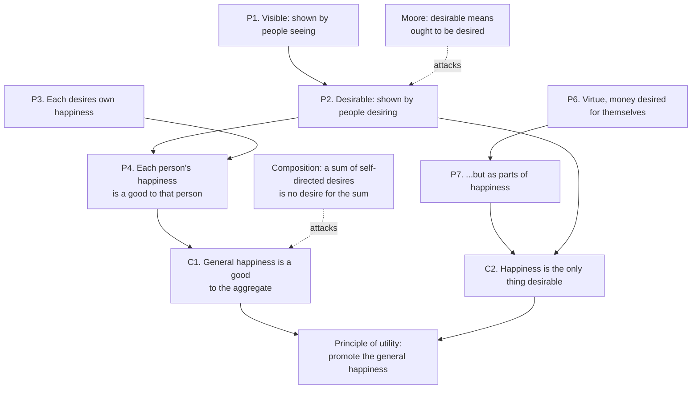

# Ethics · Lesson 1.1: Classical utilitarianism

> ⏱ ~15 min · Module 1: Consequentialism · Builds on: [Reconstruction and charity](../../philosophical-method/lessons/01-03-reconstruction-and-charity.md), [Thought experiments](../../philosophical-method/lessons/03-03-thought-experiments.md) · Unlocks: [1.2 What is good for a person?](01-02-what-is-good-for-a-person.md)

## Why this matters

Utilitarianism is the theory every other theory in this course defines itself against. Kant's constraints, Aristotle's virtues, Scanlon's contract: each is partly a story about what utilitarianism gets wrong. It is also the moral theory built into cost-benefit analysis, effective altruism and welfare economics. Before you can say where it fails you need to say exactly what it claims, and that turns out to be four separate claims, not one.

## The idea

Mill's statement, from *Utilitarianism* (1863) ch. 2: actions are right "in proportion as they tend to promote happiness, wrong as they tend to produce the reverse of happiness," where happiness means "pleasure, and the absence of pain." Bentham had opened his *Introduction to the Principles of Morals and Legislation* (1789) the same way: nature has placed mankind under two sovereign masters, pain and pleasure.

The appeal is hard to shake. Suffering is bad, whoever's it is; if you can prevent more of it rather than less, it seems strange to choose less. Utilitarianism takes that thought and refuses to add anything.

But the theory is a bundle. Pull it apart:

| Part | Classical answer | A rival that changes only this part |
|---|---|---|
| **Theory of the good:** what makes an outcome better? | Hedonism: only pleasure is good in itself, only pain bad | Moore's ideal utilitarianism: beauty and friendship are goods too |
| **Theory of the right:** how does the good fix what you ought to do? | Maximizing: do the act with the best outcome | Satisficing: any act whose outcome is good enough |
| **Scope:** whose good counts, and how much? | Impartial: everyone equally, "everybody to count for one, nobody for more than one" (Bentham's dictum, as Mill reports it in ch. 5) | Egoism: only your own good counts |
| **Focus:** what is evaluated by its outcome? | Acts, one at a time | Rule utilitarianism: rules, whose general acceptance is evaluated |

Each row can be changed while the others stay fixed. That is why the table organizes the whole module. [1.2](01-02-what-is-good-for-a-person.md) attacks row one, [1.3](01-03-justice-and-the-separateness-of-persons.md) and [1.4](01-04-integrity-and-demandingness.md) attack rows two and three, and [1.5](01-05-modern-consequentialism.md) tries to save the theory by changing row four. Before you object to "utilitarianism," say which row you are objecting to. (Whether Mill himself was an act or a rule utilitarian is disputed. The classical label here means the act version.)

**Bentham's calculus.** If the good is pleasure and the right is maximizing, you need a way to measure. Bentham's ch. 4 lists what fixes the value of a pleasure or pain: its **intensity**, **duration**, **certainty**, and **propinquity** (nearness in time); its **fecundity** (the chance it produces more pleasures) and **purity** (the chance it produces no pains); and its **extent**, meaning the number of people it reaches.

## Source

The theory needs a defense of its first principle. Mill offers one in ch. 4:

> "The only proof capable of being given that an object is visible, is that people actually see it. … In like manner, I apprehend, the sole evidence it is possible to produce that anything is desirable, is that people do actually desire it. … No reason can be given why the general happiness is desirable, except that each person, so far as he believes it to be attainable, desires his own happiness. This, however, being a fact, we have not only all the proof which the case admits of, but all which it is possible to require, that happiness is a good: that each person's happiness is a good to that person, and the general happiness, therefore, a good to the aggregate of all persons."

Two words to watch. **"Evidence":** Mill has already said, in ch. 1, that questions of ultimate ends are not amenable to direct proof. So he is offering considerations, not a deduction. **"Therefore":** the whole move from self-interest to impartiality rests on it.

## The argument

**Stage 1: happiness is desirable, and the general happiness is a good.**

1. The only evidence that something is visible is that people see it. *In words:* for "visible," what happens settles what can happen.
2. By parity, the only evidence that something is desirable is that people desire it. *In words:* desire is the test of desirability, as seeing is the test of visibility.
3. Each person desires his own happiness. *In words:* a psychological fact.
4. So each person's happiness is desirable, a good to that person. *In words:* from 2 and 3.
5. So the general happiness is a good to the aggregate of all persons. *In words:* if each part is good for its owner, the sum is good for everyone taken together.

**Stage 2: happiness is the only thing desirable.**

6. People do desire other things for their own sake, such as virtue, money or fame. *In words:* Mill concedes the obvious objection.
7. But these are desired as *parts* of happiness: what began as a means has become an ingredient. *In words:* the miser loves money itself now, because having it has become part of what his happiness is.
8. So nothing is desired except happiness or its parts, and by 2 nothing is desirable except happiness. *In words:* the evidence of desire points to one final end.

Critics have attacked two inferences.

**(i) Step 2, visible to desirable.** G. E. Moore, *Principia Ethica* (1903) §40: "visible" means *able to be seen*, but "desirable" means *ought to be desired* or deserves to be desired. People desire plenty that they ought not to, so the fact of desire cannot be evidence of the norm the way seeing is evidence of visibility. Moore adds that Mill has defined a normative notion by a natural fact, the move he named the naturalistic fallacy (taken up in [6.1](06-01-moral-realism.md)). **The charitable reading:** Mill claims only *evidence*, not *meaning*. Desire may be our best guide to what is worth desiring, much as perception is our only access to color, without being what "desirable" means.

**(ii) Step 5, each to all.** This looks like a fallacy of composition: what is true of each part is claimed of the whole. Sidgwick pressed a version (*The Methods of Ethics*, Book III ch. 13): a collection of desires, each aimed at its owner's own happiness, is not anyone's desire for the general happiness. So even granting step 2, nobody has been shown to desire the aggregate. **The charitable reading:** in a letter of 1868, Mill explained that he meant only this: A's happiness is a good, B's is a good, and so on, so their sum is a good. That is additivity of goods, not a claim that anyone desires the sum. The cost is that it now assumes the goods of different people *can* be added, and that is precisely what impartiality needed to establish.

## Argument map

Both dashed edges land on stage 1. Stage 2 has its own weak point: step 7 can make "happiness" absorb anything anyone wants for its own sake (Example 2).

## Worked examples

**Example 1 (clean case: the calculus).** A club has one evening and one budget. Option A is an outdoor concert: 50 people each get 2 units of pleasure, but there is a 0.4 chance of rain cancelling it, and one neighbor loses 10 units to the noise either way. Option B is a dinner for 6 people, 8 units each, certain; it also deepens friendships, adding 2 later units per guest.

- A: $50 \times 2 = 100$, times certainty $0.6$ gives $60$; minus the neighbor's $10$ (impurity) gives $50$.
- B: $6 \times 8 = 48$, plus fecundity $6 \times 2 = 12$, gives $60$.

The theory requires B. Notice what did the work: A had more **extent**, but **certainty**, **purity** and **fecundity** reversed the verdict. Notice what was stipulated: units of pleasure comparable across people. Propinquity was left out on purpose, since later utilitarians such as Sidgwick counted mere nearness in time as no reason in itself.

**Example 2 (hard case: stage 2 under pressure).** A researcher spends a decade on a proof she expects no one to read. She says, and her choices bear it out, that she would take the proof over a pill giving her the same pleasure. On Mill's step 7, the proof has become "part of her happiness."

Now ask what "happiness" means. If it still means pleasure and absence of pain, step 7 is false of her, since she has chosen the proof over the pleasure. If it means whatever she desires for its own sake, step 8 is true, but it no longer supports *hedonism*. The theory of the good has quietly become a desire theory. Mill's defenders reply that pleasure in the achievement is the only part of the proof she values, while critics hold that the reply redescribes her rather than reporting her. Either way, stage 2 cannot protect row one of the table without deciding what well-being is. That is [1.2](01-02-what-is-good-for-a-person.md)'s question.

## Watch out

- **You might think utilitarianism says each person should pursue happiness.** It says each agent should promote the *general* happiness, counting their own as one share among billions. That is why it can demand sacrifice.
- **You might think impartiality entails maximizing.** "Everybody to count for one" says how to weigh people. It does not say the right act produces the largest weighted sum. A view that gives equal weight to everyone yet refuses to trade one person's ruin for many small gains is impartial and not maximizing.
- **You might think Mill claims to deduce the principle.** He explicitly denies that ultimate ends admit direct proof. Reconstruct ch. 4 as offering evidence, or you will refute a stronger argument than the one he gave.
- **You might think Moore's objection is merely verbal.** It is a claim about the *gap* between what is desired and what ought to be desired, and it survives any choice of wording. The charitable reading narrows that gap; it does not close it.

## One-liner

> Classical utilitarianism is four separable claims (pleasure is the good, maximize it, count everyone equally, judge acts), and Mill's proof is strained at two joints: desired to desirable, and each to all.

## Problems

**P1 (🟢) *(Exegetical.)*** (a) Each view below changes exactly one row of classical utilitarianism. Name the row and what it becomes. (i) *Do whatever produces the most pleasure for you.* (ii) *Maximize the total of knowledge, friendship and pleasure, everyone counting equally.* (iii) *Follow the rules whose general acceptance would produce the most happiness.* (b) Name the row each complaint targets. (iv) "It says a stranger's pleasure matters exactly as much as your own child's." (v) "It says a life plugged into a pleasure machine is as good as a real one." (vi) "It says every act short of the very best is wrong." One line per item.

**P2 (🟡) *(Exegetical (a) · Evaluative (b))*** A critic of step 5 offers a parallel: *each brick in this wall is light, therefore the wall is light.* (a) State the inference form the parallel attributes to Mill, and the exact claims it maps onto "each brick is light" and "the wall is light." (b) Is the parallel fair to Mill? Any verdict; say what feature of "light" versus "good" your answer depends on. 150 words or fewer for (b).

**P3 (🔴, optional) *(Exegetical.)*** Diagnose this invented council memo. Name the component of utilitarianism its conclusion actually depends on, name the one it claims to depend on, and say why the second does not deliver the first. 150 words or fewer.

> "This council treats every resident equally. No one's interests count for more than anyone else's. Equal treatment therefore requires us to fund the project with the greatest total benefit to residents. The stadium upgrade brings modest enjoyment to nearly all of our 200,000 residents; the dialysis unit is life-saving but serves roughly 300. Fairness leaves us no choice but the stadium."

Solutions

**P1** *(Exegetical, strict.)*

**Must hit, strict:**
- (i) **Scope:** impartial becomes egoist. Hedonism and maximizing stay.
- (ii) **Theory of the good:** hedonism becomes a pluralist (objective-list) theory, as in Moore's ideal utilitarianism. Maximizing and impartiality stay.
- (iii) **Focus:** acts become rules (rule utilitarianism).
- (iv) **Scope/impartiality.**
- (v) **Theory of the good/hedonism.**
- (vi) **Theory of the right/maximizing.**

**Wrong turns:** calling (i) a change to the theory of the good. The good is still pleasure; what changes is whose pleasure counts. Calling (vi) an objection to impartiality. A partial maximizer faces the same complaint about their own favored people.

**Model answer:** (i) scope, to egoism; (ii) good, to pluralism; (iii) focus, to rules; (iv) scope; (v) good; (vi) right.

---

**P2** *(Exegetical (a) · Evaluative (b))*

**Must hit, strict (a):** the form is composition: property F holds of each part, so F holds of the whole. "Each brick is light" maps to "each person's happiness is a good (to that person)"; "the wall is light" maps to "the general happiness is a good (to the aggregate)."

**Must hit, any verdict (b):** name the property difference that decides fairness. "Light" is not preserved by adding parts: enough light things make a heavy one. If goodness is *additive* (a sum of goods is a good, as Mill's 1868 letter claims), composition is valid for it and the parallel is unfair. The critic must then press that additivity across persons is the very thing at issue, or use Sidgwick's version (no one desires the aggregate). A verdict of "fair" or "unfair" passes if it turns on this.

**Wrong turns:** declaring every part-to-whole inference fallacious. Many are valid ("each brick is red, so the wall is red"). Ignoring the "to that person" / "to the aggregate" shift.

**Model answer (b), one of several:** Partly unfair. "Light" is a threshold property that sums can lose, so the brick case is invalid for a reason that need not apply to goodness. If goods add, a sum of goods is good, and Mill's 1868 letter says that is all he meant. But the parallel still exposes a real cost: the letter assumes that one person's good and another's can be added into something good *simpliciter*. An egoist denies exactly that, holding that A's happiness is good *for A* and gives B no reason. So the parallel fails as a proof that Mill commits a fallacy. It succeeds in locating the premise he needs and did not argue for.

---

**P3** *(Exegetical, strict.)*

**Must hit, strict:** the conclusion depends on **maximizing** (the theory of the right: pick the greatest total). The memo claims it depends on **impartiality/equal consideration**. Impartiality fixes weights, not the aggregation rule: a view giving every resident equal weight could still give priority to the worse off, or refuse to let many small gains outweigh a few lives. The move from "no one counts for more" to "maximize the total" is the smuggled step. No verdict on the stadium is required.

**Wrong turns:** disputing the numbers or arguing for the dialysis unit, which is not asked; saying the memo is "not impartial," when it is.

**Model answer:** The memo's premises establish impartiality: every resident's interests weigh the same. Its conclusion needs maximizing: choose whatever yields the greatest total. The word "therefore" hides the gap. Equal weight is compatible with many ways of combining weighted interests. One could give priority to those who are worst off, or refuse to aggregate trivial benefits against life-saving ones, while still counting each resident for exactly one. "Fairness leaves us no choice" is false as stated. Fairness in the memo's sense leaves the choice open; maximizing is what closes it, and that is a separate commitment the council would have to defend.

## Connections

- **Backward:** Mill's ch. 4 is a reconstruction exercise of the kind in [Reconstruction and charity](../../philosophical-method/lessons/01-03-reconstruction-and-charity.md), where "evidence" rather than "proof" is the charity that matters. The research-versus-pill case is a minimal pair in the sense of [Thought experiments](../../philosophical-method/lessons/03-03-thought-experiments.md).
- **Forward:** [1.2](01-02-what-is-good-for-a-person.md) takes row one (hedonism, higher pleasures, the experience machine). [1.3](01-03-justice-and-the-separateness-of-persons.md) and [1.4](01-04-integrity-and-demandingness.md) press rows two and three. [1.5](01-05-modern-consequentialism.md) changes row four. Moore's naturalistic-fallacy charge returns in [6.1](06-01-moral-realism.md), and whether numbers count comes back in [5.2](05-02-contractualism-what-no-one-could-reasonably-reject.md).
- **Sideways:** the utilitarian social welfare function $W = \sum_i u_i$, where $u_i$ is individual $i$'s utility, is the formal version of rows two and three together; see [grad-micro 6.5](../../grad-micro/lessons/06-05-social-choice-welfare.md). Utilitarianism as a principle for institutions and a theory of justice belongs to [`political-philosophy`](../../political-philosophy/syllabus.md). Expected value, which the certainty dimension informally approximates, is owned by [`decision-theory`](../../decision-theory/syllabus.md).
