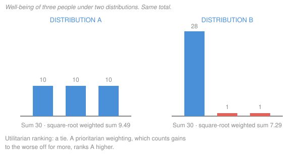

# Ethics · Lesson 1.3: Objections I: justice and the separateness of persons

> ⏱ ~15 min · Module 1: Consequentialism · Builds on: [1.1 Classical utilitarianism](01-01-classical-utilitarianism.md), [1.2 What is good for a person?](01-02-what-is-good-for-a-person.md) · Unlocks: [1.4 Integrity and demandingness](01-04-integrity-and-demandingness.md)

## Why this matters

Utilitarianism has one instruction: add up everyone's well-being and make the total as large as possible. The most influential objections to it all target the *adding up*. If a sum is all that matters, then who gets what, and who pays for whom, seem not to matter at all. Two major rivals were built on this complaint: Rawls's theory of justice and Nozick's rights as side constraints. This lesson builds the cases, states the principle they are supposed to show utilitarianism violates, and gives the utilitarian replies at full strength.

## The idea

Think about a trade-off inside one life. You sit through an hour at the dentist to avoid a year of toothache. That is plainly rational: the person who pays the cost is the person who collects the benefit. The pain is *compensated*, because both ends of the trade happen to the same person.

Now move the trade between lives. One person bears a heavy cost so that others gain slightly more in total. The arithmetic can look identical, but nobody is compensated. The one who pays gets nothing back, and the ones who gain paid nothing. Their gains do not flow back to her, because nobody experiences the total.

Utilitarianism, the objection says, treats the second trade like the first. It ranks outcomes by a sum across persons, as if society were one big person who can rationally accept pain here for pleasure there. That is the **separateness of persons** objection. It shows up in two ways:

- **Sacrifice:** maximizing can require seriously harming an innocent person when that produces more total good.
- **Distribution-insensitivity:** maximizing is indifferent between outcomes with the same total, however unequally that total is spread.

## The case

**Punishing the innocent.** In the version usually credited to H. J. McCloskey (1957; E. F. Carritt raised similar cases earlier), a crime has inflamed a town. The sheriff knows that unless someone is convicted soon, riots will kill several people. He can frame a drifter who has no family and no friends. The drifter is innocent, but the frame-up will hold and no one will ever find out. One innocent person is punished and several lives are saved. If the numbers come out as stipulated, act utilitarianism says frame him. Most readers say that would be a grave injustice. The transplant case has the same structure: a surgeon kills one healthy patient to save five. That pair's use as a method example belongs to [philosophical-method 3.3](../../philosophical-method/lessons/03-03-thought-experiments.md), and it is not re-run here.

**Equal sums.** Well-being is measured in the units of [1.2](01-02-what-is-good-for-a-person.md), across three people:

| | Person 1 | Person 2 | Person 3 | Sum $\sum_i u_i$ |
|---|---|---|---|---|
| A | 10 | 10 | 10 | 30 |
| B | 28 | 1 | 1 | 30 |

Here $u_i$ is person $i$'s well-being. Total welfare, the utilitarian social welfare function $W = \sum_i u_i$ of [grad-micro 6.5](../../grad-micro/lessons/06-05-social-choice-welfare.md), ranks A and B as exactly equal. Add one unit to Person 1 in B, and B is strictly *better* than A.

## The argument

**The separateness-of-persons argument.** Rawls, *A Theory of Justice* (1971) §5, argues that classical utilitarianism takes the principle of rational choice for one person and extends it to society as a whole. He concludes that it does not take seriously "the distinction between persons." Nozick, *Anarchy, State, and Utopia* (1974) ch. 3, puts it more bluntly. There is no social entity that undergoes a sacrifice for its own good. There are only individual people, and sacrificing one for others simply uses him for their benefit. Reconstructed:

1. **A cost to one person can be justified by a benefit to that same person, because she is compensated.** *In words:* within a life, the dentist's hour is paid back by the missing toothache.
2. **Between persons there is no such compensation.** The one who bears the cost gets nothing from the others' gain, and no further being experiences the total. *In words:* nobody lives the sum.
3. **A principle that permits imposing a cost on someone whenever it is outweighed by others' benefits treats interpersonal trade-offs as if they were intrapersonal ones.** *In words:* summing across lives acts as though society were one person balancing her own books.
4. **Treating interpersonal trade-offs as intrapersonal ones ignores a morally significant fact: persons are separate.** *In words:* the boundary between lives is not morally idle.
5. **Act utilitarianism ranks outcomes by summed well-being and requires the best-ranked one.** *In words:* this is 1.1's maximizing theory of the right.
6. **∴ Act utilitarianism ignores the separateness of persons.** *In words:* it gets sacrifice and distribution wrong for one and the same reason.

**The principle it claims is violated:** *a serious burden on a person cannot be justified merely by showing that it is outweighed by benefits to others; it must be justifiable to her.* Nozick turns this into **side constraints**: rights that limit what you may do to someone in pursuit of any goal, including the goal of minimizing rights violations. That structure is the subject of [2.4](02-04-constraints-and-options.md).

Most of the pressure falls on premise 4. Premises 1–2 are close to uncontroversial. Premise 4 is the substantive claim that a metaphysical fact (people are distinct) has a *moral* consequence of this particular shape.

## Worked examples

**Example 1 (clean case: the sheriff).** Run the argument. The sheriff's frame-up imposes the gravest burden short of death on the drifter. It is justified only by the riot victims' gain, none of which reaches him. Utilitarianism counts his loss as a debit that the others' gains outweigh (premise 5), and that is exactly the move premise 3 describes. The principle says the burden must be justifiable *to him*, and "several strangers are better off" is no justification to the person being framed. The principle's verdict: forbidden.

**The utilitarian replies, at strength.**

- **Long-run effects.** Real sheriffs cannot be sure the frame-up stays secret. Discovery would wreck trust in the courts, and the deterrent value of punishment depends on punishing the guilty. A policy of framing innocents, once people suspect it exists, is a disaster. So in any realistic version, utilitarianism forbids the frame-up too. Rule consequentialism ([1.5](01-05-modern-consequentialism.md)) builds this into the theory.
- **Bite the bullet.** Some utilitarians, J. J. C. Smart prominently (*Utilitarianism: For and Against*, 1973), accept that in the pure case the frame-up is right. They count the contrary intuition as a useful rule of thumb misapplied to a case it was never trained on.
- **Diminishing marginal utility.** For distribution, utilitarianism is not indifferent to *resources*. A dollar does more for the poor than for the rich, so maximizing welfare usually favours spreading income out. It is indifferent only between distributions of *well-being itself*.

**Why the objection's defenders say these miss the point.** The long-run reply makes the wrongness *contingent*: the frame-up is wrong only because it might leak. The defender's intuition is that the drifter is wronged even in the airtight version. On that view, the stipulated secrecy is a fair control (see 3.3's rule about stipulating to control a variable), and a verdict that depends on detection gives the right answer for the wrong reason. The diminishing-marginal-utility reply has the same shape. It gets equality of resources from the fact that money buys less well-being at the top, not from any concern about who ends up with the well-being.

**Example 2 (hard case: where the argument strains).**

*A repair from inside consequentialism.* **Prioritarianism** (Parfit, "Equality or Priority?", Lindley Lecture, 1991) ranks outcomes by $W = \sum_i f(u_i)$ with $f$ increasing and concave, so a unit of well-being counts for more the worse off its recipient is. With $f(u) = \sqrt{u}$: A scores $3\sqrt{10} \approx 9.49$ and B scores $\sqrt{28} + 2 \approx 7.29$, so A wins. Distribution-insensitivity is gone. Separateness is not: prioritarianism still *sums* across persons, so a large enough gain to many can still outweigh a severe loss to one. The sacrifice cases survive the repair. That tells you the two strands of the objection come apart.

*Parfit's reductionist reply.* In *Reasons and Persons* (1984, ch. 15), Parfit asks whether the separateness premise is as deep as it looks. On a reductionist view of personal identity, a person's existence consists in psychological connections that hold in degrees and weaken over time ([metaphysics 6.6](../../metaphysics/lessons/06-06-personal-identity-over-time.md)). If so, "same person" is a less deep fact, and the line between lives carries less moral weight. That makes it more reasonable to care less about who receives a benefit and more about how much is received. Premise 1 weakens too: the dentist's hour is compensated only as far as your later self is connected to you now. The reply can cut either way, and Parfit says so. Distributive principles might instead be extended *within* lives, between weakly connected stages. What the reply shows is that premise 4 rests on a view about personal identity, and someone who rejects that view can reject the premise.

The strain, then: the argument rests on a fact about persons, and what persons *are* is itself disputed.

## Watch out

- **You might think the objection is that utilitarianism ignores individuals.** It doesn't. Everyone's well-being counts, equally. The charge is about what happens *after* counting: the individual contributions get merged into one total.
- **You might think prioritarianism answers the separateness objection.** It answers distribution-insensitivity. It still aggregates, so it still permits sacrificing one person for enough gain to others.
- **You might think "it would get found out" settles the sheriff.** That reply changes the case. Against the stipulated version it either concedes the verdict or bites the bullet, and both sides should say which.
- **You might think this is a theory of just institutions.** Here it is an objection to a *moral* theory. Justice as the first virtue of institutions, and Rawls's alternative, belong to [`political-philosophy`](../../political-philosophy/syllabus.md).

## One-liner

> Within one life a cost can be paid back; between lives it cannot. The objection says a sum treats both as the same.

## Problems

**P1 (🟢) *(Formal (a) · Exegetical (b).)*** Three policies give three people these well-being levels: X = (20, 20, 20), Y = (45, 10, 5), Z = (30, 30, 0). (a) Rank them by the utilitarian sum and by the prioritarian sum with $f(u) = \sqrt{u}$. (b) Now take W = (49, 49, 4). Compute its prioritarian score, compare it with X, and say in one or two sentences which strand of the separateness objection the result bears on.

**P2 (🟡) *(Exegetical (a) · Evaluative (b).)*** A utilitarian replies: *"We impose costs on some people for the benefit of others all the time: taxes, quarantines, compulsory purchase of land for a railway. If the separateness objection were sound, it would condemn all of these. It doesn't, so the objection is unsound."* (a) Reconstruct the reply in numbered premises and a conclusion, and flag its weakest premise. (b) Give the best response a defender of the separateness objection can make, then say whether it succeeds. 150 words or fewer for (b).

**P3 (🔴, optional) *(Evaluative.)*** Build a case, not the sheriff or transplant, where act utilitarianism requires seriously harming an innocent person. It must survive the long-run-effects reply, so say which stipulations do that work. Then judge whether those stipulations are fair controls or have deleted what made the act wrong. Any verdict; you are graded on the construction. 150 words or fewer.

Solutions

**P1** *(Formal (a) · Exegetical (b).)*

**Must hit, strict (a):** sums are X = 60, Y = 45 + 10 + 5 = 60, Z = 30 + 30 + 0 = 60, a three-way utilitarian tie. Prioritarian: X = $3\sqrt{20} \approx 3 \times 4.472 = 13.42$; Y = $\sqrt{45} + \sqrt{10} + \sqrt{5} \approx 6.708 + 3.162 + 2.236 = 12.11$; Z = $\sqrt{30} + \sqrt{30} + 0 \approx 5.477 + 5.477 = 10.95$. Ranking X > Y > Z.
**Must hit, strict (b):** W = $7 + 7 + 2 = 16$, which beats X (13.42), even though W takes person 3 from 20 down to 4. So prioritarianism still endorses a severe loss to one for large gains to others. It fixes *distribution-insensitivity* but not the *sacrifice* strand, because it still aggregates across persons.
**Wrong turns:** ranking Z above Y because Z has "more people doing well" (the prioritarian function penalizes the 0 heavily); saying prioritarianism fully answers Rawls and Nozick.
**Model answer:** (a) Utilitarian: X = Y = Z = 60. Prioritarian: X 13.42 > Y 12.11 > Z 10.95. (b) W scores 16 > 13.42, so prioritarianism prefers cutting one person from 20 to 4 for the others' gain. It answers distribution-insensitivity, not sacrifice: it still sums across lives.

---

**P2** *(Exegetical (a) · Evaluative (b).)*

**Must hit, strict (a):** a valid reconstruction, e.g. P1 If the separateness objection is sound, every policy that imposes costs on some for others' benefit is wrong. P2 Taxes, quarantines and compulsory purchase impose such costs. P3 These policies are not wrong. ∴ C The objection is unsound (modus tollens). Weakest premise: **P1**, because the objection's principle (a burden must be *justifiable to* the person, not merely outweighed) need not condemn every cost-imposing policy.
**Must hit, any verdict (b):** name a feature the everyday cases have that the sheriff lacks: the policy is justifiable to each person *ex ante* (everyone benefits from a scheme of taxes and quarantines), burdens are shared or compensated (market price for land), and the burden is not a grave harm to an innocent singled out. Then test whether that feature is principled or ad hoc, e.g. whether "justifiable ex ante" would also license a lottery for framing people.
**Wrong turns:** accepting P1 without noticing it misstates the principle; answering "those policies are wrong too" without saying what that costs.
**Model answer (b), one of several:** The objection never said costs cannot cross between persons. It said a burden must be justifiable to the person who bears it. Taxes and quarantines pass: each citizen gains from living under the scheme, the burdens are spread, and land is bought at a fair price. The drifter gets nothing, and he is chosen for the frame-up precisely because he is expendable. So P1 is false and the reply fails as stated. It has a real bite, though: "justifiable to each ex ante" risks licensing a fair lottery for sacrifice, which many find just as bad. The defender needs a further constraint on *how* someone may be burdened.

---

**P3** *(Evaluative, graded on construction.)*

**Must hit, any verdict:** a case where the harm to an innocent maximizes total well-being; explicit stipulations blocking the long-run reply (secrecy, no precedent, no effect on institutions or trust); an identification of the principle violated (a burden not justifiable to her); a judgment on whether the stipulations control a variable or disarm the objection, with a reason.
**Wrong turns:** a case where the "victim" consents or is guilty (it no longer tests the objection); leaving detection open, so the utilitarian can reply that the act is forbidden anyway; stipulating so much that your own verdict is unreliable, without saying so.
**Model answer, one of several:** A vaccine researcher can secretly infect one unconscious, unconsenting patient to confirm a vaccine that will save thousands a year sooner. Stipulations: no one will ever know, the result is scientifically valid, and it is a one-off, so no practice or precedent forms. With those in place, act utilitarianism requires the infection. Are the stipulations fair? Secrecy and no precedent only cut the act off from its downstream effects, which is what a control should do, so they do not disarm the objection. But the case moves two factors at once: the patient bears a burden no one could justify to him, and he is also *used* as a means. To see which is doing the work, retest it with a version where his harm is only a side effect ([3.2](03-02-the-doctrine-of-double-effect.md)).

## Flashback

**From Lesson 1.1 (Classical utilitarianism):** Someone argues: *"The only proof that a claim is believable is that people actually believe it. So the only evidence that anything is desirable is that people actually desire it."* (a) Say what "believable" must mean for the first sentence to be true, and what it must mean to be the analogue of "desirable" in Mill's proof. (b) Say whether this parallel helps or hurts Mill, and give the most charitable reading of his step. 150 words or fewer in total.

Solution

**Must hit, strict (a):** "believable" is ambiguous between *can be believed* (true of anything people in fact believe) and *worthy of belief* (what ought to be believed). Only the first makes "people believe it" a proof. Mill needs "desirable" in the second, normative sense, which is Moore's point in *Principia Ethica* (1903) §40.
**Must hit, any verdict (b):** say the parallel exposes the equivocation (people believe falsehoods, so belief does not prove worthiness of belief), and then give the charitable reading. Mill calls it evidence rather than proof, says in ch. 1 that ultimate ends are not open to direct proof, and may mean only that desire is the best evidence of desirability we have.
**Wrong turns:** saying Mill commits a fallacy and stopping; treating "evidence" as "proof".
**Model answer:** (a) True only as "capable of being believed"; the analogue must be "deserving belief." (b) It hurts the literal step: widespread belief in falsehoods shows that being believed does not make a claim worth believing, and the same gap opens between desired and desirable. Charitably, Mill offers desire as the best available evidence, not a proof, since he denies ultimate ends admit of proof.

## Connections

- **Backward:** [1.1](01-01-classical-utilitarianism.md) separated the theory of the good, the maximizing theory of the right, and impartiality. This objection targets the *sum*, the structure of the right, rather than hedonism. That is why swapping in any theory of well-being from [1.2](01-02-what-is-good-for-a-person.md) leaves it standing.
- **Forward:** [1.4](01-04-integrity-and-demandingness.md) presses the agent's side (what maximizing does to the person *doing* the sacrificing). [1.5](01-05-modern-consequentialism.md) tests whether rule consequentialism can absorb the long-run reply without collapse. [2.4](02-04-constraints-and-options.md) develops side constraints. [5.2](05-02-contractualism-what-no-one-could-reasonably-reject.md) turns "justifiable to each person" into a whole theory and asks whether the numbers still count.
- **Sideways:** the sum $W = \sum_i u_i$ and its concave variants are the utilitarian and prioritarian social welfare functions of [grad-micro 6.5](../../grad-micro/lessons/06-05-social-choice-welfare.md). Parfit's reply depends on the reductionism of [metaphysics 6.6](../../metaphysics/lessons/06-06-personal-identity-over-time.md). The same objection as a critique of *institutions*, with Rawls's alternative, is [`political-philosophy`](../../political-philosophy/syllabus.md)'s.
