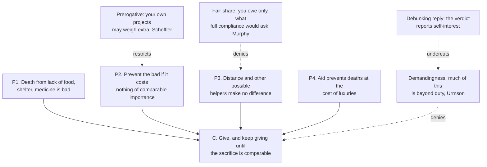

# Ethics · Lesson 1.4: Objections II: integrity and demandingness

> ⏱ ~15 min · Module 1: Consequentialism · Builds on: [1.3 Justice and the separateness of persons](01-03-justice-and-the-separateness-of-persons.md) · Unlocks: [1.5 Modern consequentialism](01-05-modern-consequentialism.md)

## Why this matters

Lesson 1.3's objections were about the *victim*: maximizing can sacrifice someone who did nothing to deserve it. This lesson's two objections are about the *agent*, meaning you. One says consequentialism turns your own convictions into just another entry in the sum. The other says it takes your money, time and plans whenever someone else needs them more, which on a planet with preventable child deaths is always. Every modern version of the theory in 1.5, and every deontological "option" in 2.4, was built with these two complaints in view.

## The idea

Start with one idea that makes consequentialism look clean: **negative responsibility**. If what matters is how the world goes, then a death you fail to prevent counts against you exactly as much as a death you cause. Your agency gets no special place. You are one more causal route to better or worse outcomes.

Two things follow, and each has drawn an objection.

**Integrity.** Your projects and commitments, the things you would describe as *what you are about*, count only as one person's satisfactions. Whenever other people's projects add up to more, the theory tells you to drop yours, even when yours is a moral conviction. Bernard Williams argued that this does more than give a wrong answer now and then. It misdescribes what it is to be an agent at all.

**Demandingness.** Your resources belong to the impartial sum too. If a few thousand dollars can save a stranger's life, then a concert ticket, a nicer apartment and most of a savings account are all things you may not keep. Peter Singer turned this into an argument that does not even assume consequentialism, and his critics turned it into an objection to consequentialism.

The two objections have different shapes. Integrity is mostly a complaint about **how** the theory reaches its verdicts. Demandingness is a complaint about **what** it requires.

## The argument

**A. Williams's integrity argument.** From "A Critique of Utilitarianism", in Smart and Williams, *Utilitarianism: For and Against* (1973), paraphrased. This is one standard reconstruction.

1. **P1.** Act utilitarianism ranks acts only by the states of affairs they produce, counted impartially. *In words:* who brings an outcome about makes no difference to how good it is.
2. **P2.** So I am responsible for what I allow or fail to prevent just as I am for what I do. *In words:* standing aside counts as a choice of outcome, like any other.
3. **P3.** My own projects, including my moral convictions, therefore enter the calculation only as one person's preferences, to be overridden whenever other people's add up to more. *In words:* nothing I care about gets weight simply because it is mine.
4. **P4.** But a person's deepest projects are what his life is organized around. Requiring him to give them up whenever the sum tips is to separate him from his own actions and the convictions they come from. *In words:* it treats you as a channel for outcomes rather than as someone acting from his own point of view.
5. **∴ C.** Utilitarianism cannot represent a person's integrity. It misdescribes cases like Jim's and George's even where its verdict happens to be right. *In words:* the complaint is about the reasoning, not only the answer.

**B. Singer's argument.** From "Famine, Affluence, and Morality" (1972), paraphrased.

1. **P1.** Suffering and death from lack of food, shelter and medical care are bad. *In words:* nobody disputes the value premise.
2. **P2 (strong).** If we can prevent something bad without sacrificing anything of *comparable moral importance*, we ought to do it. **P2 (moderate):** the same, with "anything morally significant" in place of "comparable". *In words:* the pond principle. You must wade in and ruin your shoes to pull out a drowning child.
3. **P3.** Distance, and the number of other people who could also help, make no moral difference. *In words:* a child far away is still the child in the pond, even if a crowd is standing around it.
4. **P4.** By giving to effective aid, affluent people can prevent such deaths at the cost of things like clothes, meals out and tickets. *In words:* the pond is real, and your wallet is the shoes.
5. **∴ C.** They ought to give, and on the strong version they ought to keep giving until any further gift would cost them about as much as it would prevent. *In words:* giving is not charity. It is duty.

Singer draws the moral himself: the traditional line between duty and charity sits in the wrong place. That line is J. O. Urmson's **supererogation**, from "Saints and Heroes" (1958): some acts are good to do but not required, like the soldier who throws himself on a grenade. Morality, on this view, needs a category above duty.

**C. The demandingness objection**, which is Singer's argument run the other way (the fork from philosophical-method 3.4).

1. **D1.** Act consequentialism requires what the strong conclusion requires, and more. *In words:* the theory implies at least Singer's conclusion.
2. **D2.** Morality does not require that. Most of such giving is supererogatory. *In words:* a person who gives 10 percent and keeps the rest is not a wrongdoer.
3. **∴ C.** Act consequentialism is false. *In words:* Singer runs *modus ponens*, and the objector runs *modus tollens* on the same conditional.

## Argument map

Solid arrows are Singer's argument. Dashed arrows are objections, each aimed at the premise it denies, plus the standard reply to the first.

## Worked examples

**Example 1 (clean): George and Jim.** Both cases are Williams's, paraphrased.

*George* is a chemist with poor health and a family who needs his income. He is offered a job in a lab doing chemical and biological weapons research, which he opposes. If he turns it down, the job goes to someone who will push the research forward eagerly. Run act utilitarianism: taking the job slows the research and feeds his family. The world goes better, so he should take it, and his opposition counts only as his discomfort.

*Williams's Jim case:* Jim, a traveller, arrives in a town where an army captain is about to shoot twenty captured villagers. As a guest, Jim is offered a privilege. If he shoots one villager himself, the other nineteen go free. If he refuses, all twenty die. Act utilitarianism: shoot. Nineteen lives outweigh one, and the one dies either way.

Now the part readers often miss. Williams suggested the utilitarian is *probably right* about Jim. His complaint is that the theory finds the answer **obvious**. Jim's refusal would count only as a preference for clean hands, and his horror only as a bad feeling to weigh against nineteen lives. What gets lost is the distinction between *Jim killing someone* and *the captain killing twenty*, a distinction any honest account of Jim's situation has to register. For George, the utilitarian verdict is itself doubtful. Integrity may bear on the answer, not only on how it is described.

**Example 2 (hard): the ticket, iterated.** Dana has 5,000 dollars of discretionary money after rent, food and savings. Suppose, following some charity evaluators' estimates (contested, and they change), that a gift of about 5,000 dollars to an effective health charity saves one child's life in expectation.

- One concert ticket costs 250 dollars. Giving it up instead buys $250/5000 = 0.05$ of an expected life, a 1-in-20 chance. If a pond held a child you had a 1-in-20 chance of saving, few would walk past to protect a ticket. Both versions of P2 say give.
- Now iterate. Each 250-dollar purchase passes the same test, and there are twenty of them. By the time she has given all 5,000 dollars, one expected life is saved and her year has no concerts, no trips and no hobby spending.
- On the **strong** version she keeps going into the savings, stopping only when giving more would cost her about as much as it prevents. The **moderate** version stops at "morally significant", but does not say whether the twelfth forgone ticket or the whole hobby counts. That is where the principle stops determining an answer.

Three replies each give her a stopping point, and each pays a price.

- **Deny D2.** Singer, and Shelly Kagan in *The Limits of Morality* (1989), argue that the feeling "surely not all of it" is best explained by self-interest rather than by moral insight. That is a debunking move. The price: it must not also dissolve the judgements the debunker relies on.
- **An agent-centred prerogative** (Samuel Scheffler, *The Rejection of Consequentialism*, 1982): you may give your own interests extra weight, up to some multiple. Dana may keep some tickets. The price: the theory is no longer consequentialist all the way down, and the multiple needs a principled value. See [2.4](02-04-constraints-and-options.md).
- **A fair-share view**, associated with Liam Murphy's *Moral Demands in Nonideal Theory* (2000): you owe what you would owe if every well-off person did their part, and no more. The price, which critics press: if two children are drowning, another bystander walks off, and you save one, the view seems to say you have done enough.

## Watch out

- **You might think Williams says Jim must not shoot.** He grants that Jim probably should. The target is a theory that finds this obvious and treats Jim's reluctance as squeamishness. Grading him on the verdict misses the objection.
- **You might think "integrity" means honesty.** Here it means the fit between a person's actions and the projects and convictions they come from. A villain can have it, and a very honest person can have it taken from him.
- **You might think demandingness is a problem for consequentialists only.** Singer's P2 is a principle many deontologists accept. Any view with a duty of easy rescue and no limit on how often it applies faces the iteration in Example 2. Consequentialism faces it most directly because it builds in P3 and has no options.
- **You might think the moderate version is modest.** Iterated over a year's discretionary spending, it still asks a lot. Its vagueness is what makes it look moderate.

## One-liner

> Integrity says consequentialism treats you as a channel for outcomes; demandingness says it spends your whole life on them. The first objects to the reasoning, the second to the bill.

## Problems

**P1 (🟢) *(Exegetical.)*** From an op-ed written for this problem (the author is fictional):

> "[1] My cousin gave up the cello at twenty-two to trade bonds, because a spreadsheet told her a banker's salary would fund more bed nets than a musician's. [2] Maybe the numbers are right; I have no reason to doubt them. [3] But a morality that can order a person to hand over the one thing she is for has forgotten that lives are lived from the inside. [4] And it has forgotten something else: nobody is obliged to be a saint."

(a) Which objection is doing the work in sentence 3, and which in sentence 4? (b) Sentence 2 concedes something. Which move from Williams's treatment of Jim does it echo? 100 words or fewer in total.

**P2 (🟡) *(Exegetical (a) · Formal (b).)*** Use Dana's numbers from Example 2: a 250-dollar ticket, and 5,000 dollars saves one life in expectation. Stipulate that the concert is worth 40 welfare units to her, and that a child's life saved is worth 2,000 welfare units.
(a) What do Singer's strong and moderate principles each say about (i) the first ticket and (ii) giving away her entire 5,000 dollars? One sentence each.
(b) On an agent-centred prerogative, Dana may weigh her own welfare $M$ times as heavily as anyone else's. Find the smallest $M$ at which keeping the ticket is permitted, and show the arithmetic.

**P3 (🔴, optional) *(Evaluative.)*** Steelman the demandingness objection against the reply that the judgement "I needn't give away almost everything" merely reports self-interest. Then give the best reply on Singer's behalf. Any verdict on who wins; you are graded on the moves. 150 words or fewer.

Solutions

**P1** *(Exegetical — strict.)*

**Must hit, strict (a):** sentence 3 is the **integrity** objection. The theory requires her to give up a ground project, "the one thing she is for", whenever the sum tips, which cuts her off from her own life from the inside. Sentence 4 is the **demandingness** objection, in the form of **supererogation**: some sacrifice is admirable but not required.
**Must hit, strict (b):** sentence 2 concedes the **verdict** (the consequentialist arithmetic may be correct) while objecting to what the theory *is*, just as Williams grants that Jim probably should shoot but objects that the theory finds it obvious and misdescribes the situation.
**Wrong turns:** calling sentence 3 the separateness-of-persons objection from 1.3. That objection concerns a *victim* sacrificed for others, and here the person asked to give something up is the agent herself. Reading sentence 2 as sarcasm. Nothing in the passage signals it.
**Model answer:** (a) Sentence 3 is integrity: the theory can order her to abandon a defining project, treating it as one preference among many. Sentence 4 is demandingness, stated as supererogation: sainthood is above duty. (b) It concedes the verdict and objects to the reasoning, which is Williams's move on Jim.

---

**P2** *(Exegetical (a) — strict · Formal (b).)*

**Must hit, strict (a):** (i) both versions: give up the first ticket, since a concert is neither of comparable importance nor morally significant next to a 1-in-20 chance at a child's life. (ii) The strong version requires giving all 5,000 dollars and more, stopping only where further giving costs about as much as it prevents. The moderate version gives **no determinate verdict**: whether losing every concert and hobby for a year is "morally significant" is exactly what it leaves open.
**Must hit (b):** expected benefit of donating $= \frac{250}{5000}\times 2000 = 0.05 \times 2000 = 100$ units. Keeping is permitted when $M \times 40 \ge 100$, so $M \ge 100/40 = 2.5$. Smallest $M = 2.5$. Check: at $M = 1$, $40 < 100$, so give, which is the impartial verdict.
**Wrong turns:** saying the moderate version permits keeping the entire 5,000 dollars. It doesn't say that; it goes silent. Comparing 40 with 2,000 instead of with the *expected* 100.
**Model answer:** (a) (i) Strong and moderate both say give it up. (ii) Strong says give it all and keep going; moderate does not determine an answer. (b) $0.05 \times 2000 = 100$; $40M \ge 100 \Rightarrow M \ge 2.5$.

---

**P3** *(Evaluative — any verdict, graded on the moves.)*

**Must hit, any verdict:**
- Steelman: state the debunking reply precisely, then find its weak point. For example, the self-interest story may prove too much (the same selective origin fits the judgement that the drowning child must be saved), or the judgement that there is room above duty is stable, shared by the people who benefit from it and by those who don't, and survives framing.
- Reply on Singer's behalf: show the anti-demandingness judgement is distinctively distorted in a way the pond judgement is not, for example that it tracks proximity and salience rather than any morally relevant feature, or that it is held most firmly by those it costs most.
- Say whether the reply undercuts the whole objection or only this version of it.

**Wrong turns:** answering "morality can't ask that much" as though that settled the dispute, which restates D2 instead of defending it; treating the debunking reply as a refutation rather than an undercutter (philosophical-method 3.4).

**Model answer, one of several acceptable:** Steelman: calling the judgement "self-interest" proves too much. Our readiness to wade into the pond has an equally interested history, since reciprocity paid. Besides, the judgement that a decent life leaves room above duty is also held by people who would gain nothing from it, so a debunker who dismisses it has no clear way to keep the pond verdict. Reply: the two judgements are not on a par. The pond verdict holds steady when we vary framing. The "surely not all of it" verdict gets firmer as the victims get farther away and as more people could help, which are exactly the features P3 argues are morally idle. A judgement that shifts with idle features is the one to discount. This undercuts the objection only where it relies on distance and crowds.

## Flashback

**From philosophical-method 3.4 (Intuitions and reflective equilibrium):** A skeptic holds a principle: *you know something only if you can rule out every possibility that you are wrong about it.* On the other side is a considered judgement: *I know I am sitting in a chair.* (a) State the shared conditional. Say which way the skeptic runs it and which way the other side runs it (*modus ponens* or *modus tollens*), and name each side's fixed point. (b) The skeptic says: "Fine, I bite the bullet, but in the everyday sense of 'know' we know plenty, so nothing is lost." Which of the three conditions for biting a bullet honestly does this fail, and why? 120 words or fewer in total.

Solution

**Must hit, strict (a):** conditional: *if knowledge requires ruling out every possibility of error, then I do not know I am in a chair* (I cannot rule out a vivid dream). The skeptic runs **modus ponens** and keeps the principle as the fixed point. The opponent runs **modus tollens** and keeps the chair judgement as the fixed point, concluding that the principle is false.

**Must hit (b):** it fails **condition 1** (state the implication at full strength). By moving to an "everyday sense", it quietly changes the conclusion to one nobody finds shocking. That is dodging the bullet, not biting it. It arguably fails **condition 3** as well, since no case could now count as too much.

**Wrong turns:** calling the chair judgement a theory-report. It is a paradigm considered judgement. Saying the skeptic runs *modus tollens*.

**Model answer:** (a) If knowing requires excluding all error, I don't know I'm in a chair. The skeptic affirms the antecedent and accepts the conclusion (ponens; the principle is fixed). The opponent denies the conclusion and rejects the principle (tollens; the chair judgement is fixed). (b) It fails condition 1: "nothing is lost" redescribes the implication so that it no longer bites. The shocking claim was that we don't know, and the reply swaps in a sense of "know" the principle never covered.

## Connections

- **Backward:** [1.3](01-03-justice-and-the-separateness-of-persons.md) objected on behalf of the person sacrificed; this lesson objects on behalf of the person *doing* the sacrificing. Together they cover the two places impartial maximizing is said to lose track of persons. Section C is the ponens/tollens fork from [philosophical-method 3.4](../../philosophical-method/lessons/03-04-intuitions-and-reflective-equilibrium.md), and Jim is a stipulated case in the sense of [3.3](../../philosophical-method/lessons/03-03-thought-experiments.md).
- **Forward:** [1.5](01-05-modern-consequentialism.md) asks whether rule, motive or expectation versions answer both objections (Railton's sophisticated consequentialist is a direct reply to alienation). [2.4](02-04-constraints-and-options.md) formalizes the prerogative as a deontological *option*. [3.1](03-01-doing-and-allowing.md) takes on negative responsibility directly: is allowing a death as bad as doing it?
- **Sideways:** the fair-share view is a question about how duties are divided when others don't comply, which [`political-philosophy`](../../political-philosophy/syllabus.md) asks of institutions. Example 2's expected-value arithmetic is used informally here, and [`decision-theory`](../../decision-theory/syllabus.md) owns it.
