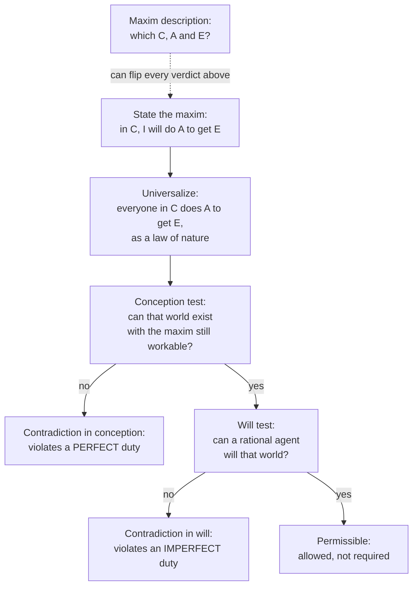

# Ethics · Lesson 2.2: The Formula of Universal Law

> ⏱ ~15 min · Module 2: Kantian deontology · Builds on: [2.1 The good will and acting from duty](02-01-the-good-will-and-acting-from-duty.md) · Unlocks: [2.3 Humanity, autonomy, and the lie](02-03-humanity-autonomy-and-the-lie.md)

## Why this matters

"What if everyone did that?" is the most common moral argument there is, and usually a bad one: everyone becoming a dentist would be a disaster, and dentistry is fine. Kant built a version meant to be rigorous, a test any rational agent can run on the principle behind an act, with no appeal to outcomes. It is the first formula of the categorical imperative. It is still the most discussed decision procedure in deontology, and its failures are as instructive as its successes.

## The idea

In [2.1](02-01-the-good-will-and-acting-from-duty.md) you met the **maxim**: the principle you actually act on, of the form *in circumstances C, I will do A to get E*. The categorical imperative binds regardless of what you happen to want. So what could it command? Kant's answer: only that your maxim have the form a law has, which is that it could hold for everyone.

So the test is not "would the results be bad if everyone did it?" It is: **could you act on this maxim in a world where everyone acts on it?** Some maxims only work because other people don't share them. The liar needs a world of truth-tellers, the free rider a world of payers. Such an agent is carving out an exception for himself from a rule he needs others to keep. Universalizing the maxim makes the exception visible: the scheme undoes itself.

That is a contradiction in the agent's willing, not a bad consequence. Nothing is being added up. The objection to the free rider is not that the bus company goes bankrupt. It is that he wills a rule he cannot consistently want to hold for all.

## The argument

Kant's formula, in Abbott's translation (*Groundwork* II): "Act only on that maxim whereby thou canst at the same time will that it should become a universal law." Its working variant: "Act as if the maxim of thy action were to become by thy will a universal law of nature." *In words:* picture your principle as a law of nature that everyone follows automatically, and see whether you could still act on it and want that world.

**The universalization test.**

1. **State the maxim.** Circumstances, act, and end, as the agent actually holds them. *In words:* test the principle really driving the act, not a flattering or loaded description of it.
2. **Universalize it.** Imagine a world in which everyone in circumstances C does A to get E, as a law of nature, known to all. *In words:* your policy becomes everyone's, and everyone knows it.
3. **Conception test.** Can that world even be coherently conceived, with your maxim still workable in it? If not, it shows a **contradiction in conception**. *In words:* the universal version defeats itself, so no one could act on it in the world it describes.
4. **Will test.** If it can be conceived, can you, as a rational agent, *will* that world? If not, it shows a **contradiction in will**. *In words:* the world is possible, but wanting it would conflict with something every rational agent necessarily wants.
5. **Sort.** Failing step 3 violates a **perfect duty**: strict, no latitude, and it forbids the specific act. Failing step 4 violates an **imperfect duty**: you must adopt the contrary end, but you have latitude over when and how far to pursue it. Passing both makes acting on the maxim *permissible*, not required. *In words:* conception failures are things you must never do; will failures are ends you may not wholly give up.

Kant says this in *Groundwork* II. Some maxims "cannot without contradiction be even conceived" as universal laws. For others, the impossibility is that such a will "would contradict itself."

## The case

Kant runs four examples, one for each cell of *perfect/imperfect* × *to self/to others*:

| Example | Maxim, paraphrased | Where it fails | Duty |
|---|---|---|---|
| **Suicide** | From self-love, I will end my life when living longer promises more pain than pleasure | Conception | Perfect, to self |
| **False promise** | When I need money, I will borrow it and promise to repay, knowing I never will | Conception | Perfect, to others |
| **Neglected talents** | Being comfortable, I will leave my abilities undeveloped and live for pleasure | Will | Imperfect, to self |
| **Refused beneficence** | Being well off, I will give nothing to anyone in need, though I take nothing from them either | Will | Imperfect, to others |

**Refused beneficence** is the clean will case. A world where no one helps anyone can be conceived; humanity might even get along. But Kant argues you cannot *will* it. Situations may arise in which you need others' love and sympathy, and in that world you would have deprived yourself of all hope of the help you want. A rational agent wills the means to its ends, and help from others is sometimes the only means.

**Suicide** is the weak link. Kant claims self-love's function is to promote life, so a nature in which that same feeling destroyed life would contradict itself. That is a *teleological* claim about what a feeling is for. Few commentators, Kantian or not, think it works, and it is not a logical or practical contradiction at all.

## Worked examples

**Example 1 (clean case: the false promise, three ways).** Korsgaard ("Kant's Formula of Universal Law," 1985) distinguishes three readings of "contradiction in conception":

- **Logical.** The universalized maxim cannot even be described consistently. If everyone promised falsely whenever in need, promising would not exist as a practice. So a "law" of false promising refers to something the law itself destroys.
- **Teleological.** The maxim could not be a law in a nature where things serve purposes. Promising exists to secure trust, and universal false promising defeats that purpose.
- **Practical.** In the universalized world, the agent could not use the maxim to get what he wants from it.

Run the practical reading step by step. Maxim: *when I need money, I will promise to repay, intending not to, in order to get the money.* The world where this is a known law: every promise from someone in need is known to be empty. So lenders do not lend on such promises. In Kant's phrase, people "would ridicule all such statements as vain pretences." Now try acting on your maxim there: you promise, and nobody hands over money. **The act fails to get its end in the very world your willing would create.** So you cannot consistently will both the maxim and its universality, and the duty is perfect: don't make the promise.

Korsgaard defends the practical reading. It explains *why* universality matters: the maxim is parasitic on others not acting as you do. It also needs neither a theory of natural purposes nor a claim that the practice would be literally unthinkable. She also grants that it is strongest on conventional acts like promising. It is weaker on "natural" acts like violence, which work just as well when everyone does them.

**Example 2 (hard case: where the test misfires).** Treat the test as a wrongness detector, and it makes errors in both directions.

*False positives: innocent maxims that fail.* "I will buy toy trains but never sell them": universalized, no one sells, so no one can buy. "I will play tennis on Sunday mornings, when the courts are empty": universalized, the courts are packed. Both fail in conception on the practical reading, yet both are plainly innocent. Examples of this shape appear throughout the literature, in Herman and Korsgaard among others.

*False negatives: wrong maxims that pass.* Add detail until the universal version barely binds anyone. Take "I will make a false promise when I am wearing a green shirt, on a Tuesday, to a lender named Oskar." Universalized, it affects so few promises that lending survives, and the false promise works. If the test runs on whatever description you feed it, a clever enough description passes anything.

*Replies.* (i) **The actual maxim.** The test applies to the principle that really moves the agent. The green-shirt liar's promise is not driven by the shirt: he would lie on Wednesday too. His real maxim is the general one, and it fails. (ii) **Relevant descriptions.** O'Neill (*Acting on Principle*, 1975) takes maxims to be the agent's *underlying* intentions, not every detail of the act. Then the tennis player's maxim is really "I will exercise at a convenient time," which universalizes happily. These replies block the gerrymander. Critics answer that they help themselves to an account of which features are morally relevant, which is what the test was meant to supply. Whether that circle is vicious is the live question.

## Watch out

- **You might think the test asks whether universal adoption would have bad results.** That is rule consequentialism's question ([1.5](01-05-modern-consequentialism.md)). Kant asks whether the maxim is *self-defeating* or *unwillable*. A world of dentists is bad but contradicts nothing.
- **You might think failing the will test means "never do that."** Imperfect duties require adopting an end, not performing every instance. "I will not help *this* person today" can be fine. "I will never help anyone" is not.
- **You might think passing the test makes an act required.** It only makes it permissible. Requirements come from the *contrary* maxim failing.
- **You might think the maxim is whatever description you like.** Every verdict turns on the description. Arguing about the test is mostly arguing about what the agent's maxim is.

## One-liner

> Could you still act on your principle in a world where everyone does? If not, you're exempting yourself from a rule you need others to keep.

## Problems

**P1 (🟢) *(Exegetical.)*** Run each maxim through the universalization test. Say whether it fails in conception, fails in will, or passes, and name the kind of duty involved if it fails. One or two sentences each.

> (a) When I want a book I cannot afford, I will borrow it from the public library and keep it.
> (b) I will spend all my free time on video games and never train any ability beyond what my undemanding job requires.
> (c) I will never learn to play a musical instrument.

**P2 (🟡) *(Exegetical.)*** The paragraph below is from an invented op-ed. (a) Name the question it is actually asking, and say why that is not the Formula of Universal Law. (b) Run the Formula of Universal Law properly on the maxim it attacks, and give the verdict. 150 words or fewer for (a) and (b) together.

> "Every office worker who logs in from the kitchen table tells himself it is harmless. But ask what would happen if everyone did it. Downtown cafés would close, transit systems would lose their fares, and the city center would hollow out. A principle that would empty our cities if everyone followed it cannot be a moral one. Kant saw this two centuries ago: act only as you could will everyone to act. By his test, remote work fails."

**P3 (🔴, optional) *(Evaluative.)*** Build a false negative: a maxim that is plainly wrong and passes both stages of the test. It must *not* get through by gerrymandered detail (no shirts, days or names). State the maxim, and run the conception and will tests on it. Then give the strongest Kantian reply and say whether it succeeds. Any verdict; you are graded on the construction and the reply. 150 words or fewer.

Solutions

**P1** *(Exegetical — strict.)*

**Must hit, strict:**
- **(a) Fails in conception; perfect duty.** Universalized, everyone who wants an unaffordable book borrows and keeps it. Libraries lose their stock and stop lending, so "borrowing" can no longer get you the book. (Logical reading: borrowing includes returning, so the universal law describes a practice it abolishes.) The act is simply forbidden.
- **(b) Fails in will; imperfect duty (to self).** A world of undeveloped abilities is conceivable. But on Kant's argument a rational agent necessarily wills that its capacities be developed, because they serve all sorts of possible ends. The duty is to adopt the end of developing some abilities.
- **(c) Passes; permissible.** Its universal version is conceivable and willable, because the imperfect duty leaves latitude over *which* abilities to develop. Neglecting one talent is not neglecting all.

**Wrong turns:** calling (b) a conception failure because "society would collapse". The world is conceivable; that it would be bad is the consequentialist question. Failing (c) by treating the imperfect duty as a duty to develop every ability.

**Model answer:** (a) Conception: if everyone kept library books, libraries could not lend, so the maxim cannot get its end; perfect duty. (b) Will: that world is conceivable, but a rational agent necessarily wills its capacities developed; imperfect duty to self. (c) Passes. The imperfect duty leaves latitude, and skipping one instrument is not abandoning self-development.

---

**P2** *(Exegetical — strict.)*

**Must hit, strict (a):** the op-ed asks whether universal adoption would have *bad consequences* (closed cafés, lost fares). That is a consequentialist "what if everyone did that?" test, close to rule consequentialism. The Formula of Universal Law asks whether the maxim is *self-defeating* in its universal form (conception) or *unwillable* by a rational agent (will). Bad aggregate outcomes are neither. The op-ed's own paraphrase of Kant, "as you could will everyone to act," drops the contradiction structure.

**Must hit, strict (b):** state the maxim: *when my job allows, I will work from home, to save commuting time.* Conception: a world where everyone whose job allows works from home is coherent, and the maxim still gets its end, since the commute is still saved. Will: no end every rational agent necessarily has requires full downtowns. Verdict: passes; permissible.

**Wrong turns:** failing the maxim in conception because "if everyone stayed home there'd be no office". The maxim is conditional on the job allowing it, and the end does not depend on others commuting. Arguing about whether remote work is good for cities, which is not asked.

**Model answer:** (a) It asks whether universal remote work would turn out badly, a consequence test. The FUL asks instead whether the maxim contradicts itself when universalized, or cannot be willed by a rational agent. A bad aggregate outcome is not a contradiction. (b) Maxim: when my job allows, I will work from home to avoid commuting. Universalized, it is conceivable, and each worker still saves the commute, so there is no practical contradiction. No necessary end of rational agency requires busy city centers, so there is no contradiction in will. It passes: permissible.

---

**P3** *(Evaluative — graded on construction and reply, not on the verdict.)*

**Must hit, any verdict:**
- A maxim that is wrong by common judgment, with circumstances, act and end at the level the agent would actually own. No arbitrary detail.
- A conception test showing the act still gets its end when universal. Maxims about "natural" acts (cruelty, intimidation, violence) are the natural source, since they do not depend on a practice others must keep up.
- A will test showing the world is not ruled out by an end every rational agent necessarily has, or an explicit acknowledgment of where it is closest to failing.
- The strongest Kantian reply, stated fairly. Candidates: the true maxim is more general and fails; the will test does catch it, because you might be on the receiving end; or the Formula of Humanity ([2.3](02-03-humanity-autonomy-and-the-lie.md)) is the tool for it. Then a judgment on whether the reply works.

**Wrong turns:** a gerrymandered maxim, which the task excludes; a maxim that is merely unattractive rather than wrong; asserting that it passes the will test without saying which necessary end might block it.

**Model answer (one of several acceptable):** Maxim: *when it amuses my friends, I will mock a stranger's appearance.* Conception: in a world where everyone does, mockery still amuses, so the maxim still works; no contradiction. Will: being mocked is unpleasant, but it does not block any end a rational agent must pursue, unlike needing help. It passes, yet it is wrong. Kantian reply: I cannot will a world where I may be the target, since every rational agent wills its own self-respect. Assessment: that turns the will test into "would I dislike it?", which lets in the dentist objection's cousin: I would dislike losing at tennis too. So the reply either overgenerates or needs the Formula of Humanity's idea of respect, which concedes that this formula alone misses the case.

## Flashback

**From Lesson 1.4 (Objections II: integrity and demandingness):** A flash flood strands 60 hikers on a ridge at dusk. Six experienced guides are camped nearby, and each can safely lead 10 people down before dark sets in fully. Four of the guides pack up and leave. Ana and one other guide stay, and each leads 10 people down. Ana is exhausted but uninjured, and she could make more trips through the night at real risk of a bad fall. (a) How many more people must Ana lead down on Singer's strong principle, and how many on a fair-share view? Show the fair-share arithmetic. (b) Which premise of Singer's argument does the fair-share view deny? State the strongest objection to the view using this case. Any verdict on whether it survives. 150 words or fewer in total.

Solution

**Must hit, strict (a):** **Strong principle:** she must keep going. Each further trip prevents a great deal of harm, so she keeps leading people down until the next trip would cost her something of comparable moral importance. A serious risk to her own life may reach that point, so the principle can stop short of all 40 remaining. **Fair share:** under full compliance, 60 hikers ÷ 6 guides = 10 each. Ana has already led 10, so she owes **no more**. The four guides who left failed their share, and that does not raise hers.

**Must hit, any verdict (b):** it denies **P3**: that the number of other people who could help, and whether they do, makes no moral difference. Objection: 40 people are still on the ridge, Ana can reach some of them, and the view says she may rest. That runs against the pond judgement the whole debate started from. A reply either defends the verdict or weakens the view, for example by adding a duty of rescue that applies whatever others do. Say what that costs.

**Wrong turns:** computing the fair share over the guides who stayed (60 ÷ 2 = 30), which is the non-compliance share the view rejects; treating this as Williams's integrity objection, when nothing about Ana's projects is at stake.

**Model answer:** (a) Strong principle: keep leading groups down until the risk to her becomes comparable to the harm she prevents, which is plausibly several more trips. Fair share: 60 ÷ 6 = 10, she has done 10, so she owes nothing more. (b) It denies P3: others' failure to help does change what I owe. Objection: 40 people will spend the night in danger while a capable rescuer rests on the grounds that it wasn't her turn. Defender's best reply: the fair share limits what is *required*, and further trips are admirable but supererogatory. Whether that is acceptable when the victims are right in front of her is the crux.

## Connections

- **Backward:** [2.1](02-01-the-good-will-and-acting-from-duty.md) gave you maxims and the categorical imperative in the abstract; this lesson turns them into a procedure. The misfires in Example 2 are thought-experiment work from [philosophical-method 3.3](../../philosophical-method/lessons/03-03-thought-experiments.md). The gerrymandered maxim is a confound smuggled into the description, and the replies are attempts to control it.
- **Forward:** [2.3](02-03-humanity-autonomy-and-the-lie.md) introduces the Formula of Humanity, which Kant claims is equivalent and which many readers find handles "natural" wrongs like cruelty better. Module 2's boss problem asks you to test that claim on a case of your own. [5.2](05-02-contractualism-what-no-one-could-reasonably-reject.md) builds a different universalizability test, principles no one could reasonably reject, which asks what others could accept rather than what you could consistently will.
- **Sideways:** the maxims that fail in conception are exactly **free-rider** strategies. They pay off only if enough others cooperate, which is the structure of the public-goods problem in [`public-economics`](../../public-economics/syllabus.md) and of defection in a prisoner's dilemma. Kant and the economist see the same structure. The economist asks what equilibrium it produces; Kant asks whether you can consistently will it. And "what if everyone did that?" as a *consequence* test is rule consequentialism ([1.5](01-05-modern-consequentialism.md)), the rival this formula is most often confused with.
