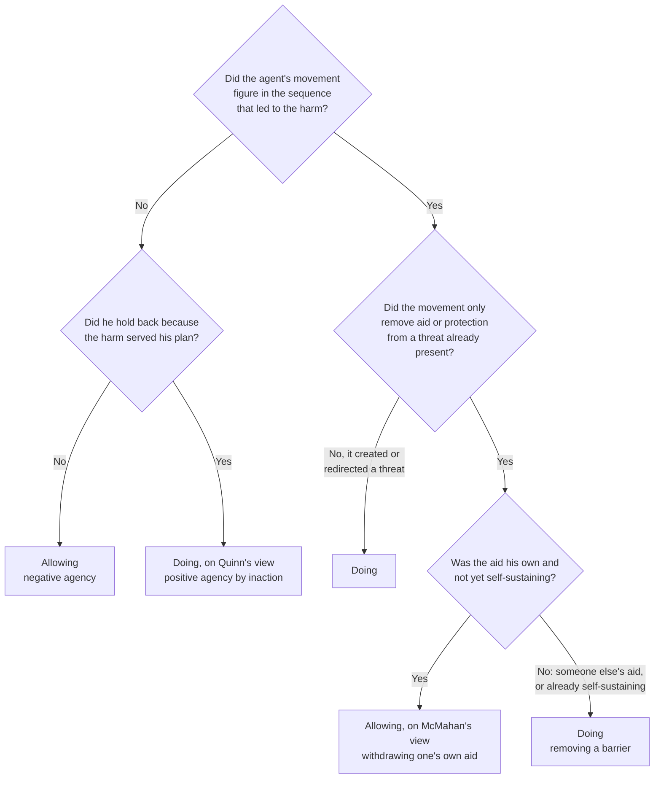

# Ethics · Lesson 3.1: Doing and allowing

> ⏱ ~15 min · Module 3: Doing, allowing, and intending · Builds on: [2.4 Constraints and options](02-04-constraints-and-options.md), [philosophical-method 3.2 Distinctions and verbal disputes](../../philosophical-method/lessons/03-02-distinctions-and-verbal-disputes.md) · Unlocks: [3.2 The doctrine of double effect](03-02-the-doctrine-of-double-effect.md)

## Why this matters

Lesson 2.4 gave deontology its constraints: you may not kill one to prevent two killings. But nearly everyone lets people die every day, some of whom a donation could have saved. If killing and letting die were morally on a par, that ordinary life would count as a steady run of something close to murder. The doctrine of doing and allowing (DDA) is what keeps constraints strict without making ordinary life monstrous. It also decides live questions in medicine: whether switching off a ventilator is killing a patient or letting him die.

## The idea

[Philosophical-method 3.2](../../philosophical-method/lessons/03-02-distinctions-and-verbal-disputes.md) drew the act/omission distinction and left its moral weight open. This lesson is about that weight.

The DDA says: **other things equal, doing harm is harder to justify than allowing harm.** It does not say allowing is fine. It says the bar is higher for doing. You may let one person drown so you can save five elsewhere, but you may not drown one to save five.

In 1975 James Rachels challenged this with a matched pair ("Active and Passive Euthanasia"). **Smith** will inherit a fortune if his six-year-old cousin dies, so he creeps into the bathroom and drowns the boy in the bath. **Jones** stands to gain the same way and creeps in with the same plan. But the boy slips, hits his head and falls face down in the water. Jones watches, ready to push the head back under if needed, and the boy drowns without his help. Smith killed; Jones let die. Yet Jones seems every bit as bad as Smith. If the one difference between the cases makes no difference, Rachels concludes, killing versus letting die has no moral weight **in itself**. Where killing looks worse in real cases, something else is doing the work: a bad motive, or a victim who did not consent.

The whole lesson turns on whether that inference is valid, and on what exactly "doing" means once the cases get awkward.

## The argument

**The doctrine, in Warren Quinn's formulation** ("Actions, Intentions, and Consequences: The Doctrine of Doing and Allowing," 1989).

1. **Positive agency.** An agent's harmful agency is *positive* when his most direct contribution to the harm is an action: his own movement, or an object he set moving. *In words:* you did something, and that something is what hurt the victim.
2. **Negative agency.** It is *negative* when his most direct contribution is an inaction, a failure to prevent a harm that other forces bring about. *In words:* the harm came from elsewhere and you did not stop it.
3. **The asymmetry.** Harmful positive agency faces a stronger moral presumption against it than harmful negative agency. Some goods justify allowing a harm but not doing it. *In words:* doing needs a better excuse than allowing.
4. **Quinn's refinement, roughly.** Some inactions count as positive agency: those where the agent holds back *because* he wants the harmful process to run, as part of his plan. *In words:* standing back so that the harm serves your purpose is closer to doing than to allowing.

Foot's earlier version ("The Problem of Abortion and the Doctrine of the Double Effect," 1967) rests the same asymmetry on duties. **Negative duties** (not to harm) are stricter than **positive duties** (to aid), so a negative duty usually wins when the two conflict.

**Rachels's equal-difference argument.**

- **P1.** The Smith and Jones cases differ only in that Smith kills and Jones lets die. *In words:* the pair is controlled.
- **P2.** If a factor has moral weight in itself, then two cases that differ only in that factor differ in how wrong they are. *In words:* a factor that matters shows up wherever it is the only thing that varies.
- **P3.** Smith and Jones are equally wrong. *In words:* the verdict does not move.
- **∴ C.** Killing versus letting die has no moral weight in itself.

**Three replies.**

- **Against P2: additivity.** Shelly Kagan ("The Additive Fallacy," 1988) argues that P2 assumes factors add up, each contributing a fixed amount of wrongness in every context. Factors can interact instead: one may matter only when certain others are present. So a pair where the verdict holds shows the factor is idle *in that context*, not everywhere. F. M. Kamm (*Morality, Mortality*, 1993–96) builds on the same thought in what she calls the principle of contextual interaction. Note the asymmetry: one pair where the verdict *moves* shows that a factor matters at least sometimes, but one pair where it holds cannot show that a factor never matters.
- **Against P3: the ceiling.** Both men are would-be murderers for money. Their wrongness may be so great that our judgment cannot register a real but smaller difference, much as two scales that both max out cannot tell you which load is heavier.
- **Against P1: Jones is not a clean allower.** Jones came to kill, stood ready to act and held back because the death served his plan. On Quinn's refinement (condition 4) that may be positive agency, so the pair varies less than it seems to.

## The case

**Classifying a harm.** Quinn's conditions sort the easy cases. Jeff McMahan ("Killing, Letting Die, and Withdrawing Aid," 1993) handles the awkward family where someone *acts* to take away aid. Roughly: if you withdraw aid that you yourself are providing, before it has become self-sustaining, you let the person die. If you remove protection that someone else provides, or aid of yours that now runs on its own, you kill.

| Case | Path through the tree | Classification |
|---|---|---|
| A doctor switches off the ventilator he has been running for a patient who cannot breathe unaided | Movement → removes aid → his own, not self-sustaining | Allowing (McMahan) |
| A stranger walks into the ward and switches off the same ventilator | Movement → removes aid → someone else's | Doing |
| Jones watches the boy drown | No movement → held back because the death served his plan | Doing, on Quinn's refinement |

## Worked examples

**Example 1 (clean): the rescue pair.** Two cases from Foot, in the form Quinn labels them. In **Rescue I**, you can save five people drowning in one place or one person drowning in another, not both. In **Rescue II**, you can reach the five only by driving over and killing a man trapped on the road.

Run the tree. In Rescue I you let the one die: no movement of yours touches him, and you hold back because you cannot be in two places, not because his death serves you. That is negative agency, and saving five is enough to justify it. In Rescue II your car kills him. That is positive agency, and on the DDA saving five is not enough. Most readers share both verdicts, and the pair holds the numbers, certainty and cost fixed. So unlike Smith and Jones, this is a pair whose verdict **moves**, and by Kagan's asymmetry that shows the distinction matters at least here.

Foot's **gas case** runs the same way. Five patients can be saved by making a gas, but making it will release lethal fumes into the room of a sixth patient who cannot be moved. Most judge that we may not make it, though we could let the sixth die to save five with a drug.

**Example 2 (hard): withdrawing aid.** A climber dangles over a crevasse, held only by a rope his partner is gripping. Letting go is a movement, and the climber falls. Doing?

On McMahan's view, the partner is withdrawing aid he himself is providing, and it is not yet self-sustaining: the rope holds only while he holds it. So letting go counts as allowing. That is harder to justify than it would be if he were not already helping, but it falls under the weaker presumption. Now vary one factor. The partner has anchored the rope to an ice screw, and the climber is safe without him. Unscrewing the anchor removes aid that now runs on its own, so it is doing. Vary a different factor: a third climber cuts the partner's rope. That removes someone else's aid, so it is doing.

Where it strains: the verdicts track who supplied the aid and whether it is self-sustaining, and it is not obvious that either feature carries moral weight. Is a hospital's ventilator the *doctor's* aid, or the institution's? Once a patient has been on it for months, has it become self-sustaining? The tree needs an answer and the doctrine does not supply one. A critic can call this a sign that the distinction is being gerrymandered to fit our verdicts. A defender can call it the ordinary work of making a real distinction precise.

## Watch out

- **You might think the DDA says allowing harm is permissible,** but it only says allowing is *easier to justify*. Letting a child drown to keep your shoes dry is wrong on every version. The doctrine sets a higher bar for doing, not a free pass for allowing.
- **You might think Rachels's pair proves the distinction is idle everywhere,** but at most it shows it is idle in that pair. Moving from one context to all contexts needs the additive assumption (P2), which is exactly what Kagan denies.
- **You might think "doing" means "moving your body,"** but the tree already breaks that. Letting go of the rope is a movement classed as allowing, and Jones's stillness may be classed as doing. The distinction is about the structure of your contribution, not whether your muscles moved.
- **You might think the DDA and double effect are one principle,** but the DDA is about *how* you contribute to a harm (doing or allowing) and double effect about *what you aim at* (intending or foreseeing). [3.2](03-02-the-doctrine-of-double-effect.md) shows cases where they come apart.

## One-liner

> Doing harm needs a better excuse than allowing it, and the hard part is saying which is which once someone lets go of a rope or switches off a machine.

## Problems

**P1 (🟢) *(Exegetical.)*** Classify each case as doing or allowing using Quinn's conditions and McMahan's view of withdrawing aid, naming the node of the tree that decides it. One sentence each.

> (a) A volunteer hand-pumps air down a pipe to a miner trapped by a rockfall. After an hour, able but tired, she stops and leaves; he suffocates.
> (b) The same volunteer had instead hooked the pipe to a generator that runs on its own. Later she switches the generator off; he suffocates.
> (c) A passing engineer, who has had nothing to do with the rescue, switches off the generator in (b).

**P2 (🟡) *(Evaluative.)*** (a) Build a matched pair, not using Rescue I and II or the gas case, that differs **only** in whether the agent kills or lets die, and where you judge the two cases differently. (b) Say what your pair shows about Rachels's conclusion, and what it does not show. Any verdict on the DDA passes; you are graded on the construction. 150 words or fewer.

**P3 (🔴, optional) *(Exegetical.)*** A Rachels supporter and a DDA defender agree that Smith and Jones are equally bad. Name the single premise of the equal-difference argument that the defender must deny to keep the DDA, and say what kind of case or argument would move the supporter on it. 150 words or fewer.

Solutions

**P1** *(Exegetical, strict.)*

**Must hit, strict:**
- **(a) Allowing.** She moves (stops pumping and leaves), but that only removes aid; the aid is her own, and it is not self-sustaining, since it works only while she pumps. That is the Q4 "Yes" branch.
- **(b) Doing.** Switching off removes aid that is her own but now self-sustaining (the generator runs without her). That is the Q4 "No" branch.
- **(c) Doing.** He removes aid someone else provides, which is the Q4 "No" branch again.
- For each, the deciding node is Q4, reached through Q1 "Yes" and Q3 "Yes".

**Wrong turns:** classing (a) as doing because stopping and walking off are movements, when Q3 routes removal of aid to Q4 rather than straight to doing; classing (b) as allowing because it is "still her aid," which ignores the self-sustaining condition.

**Model answer:** (a) Allowing: she withdraws her own aid while it still depends on her. (b) Doing: her aid had become self-sustaining, so removing it removes a barrier. (c) Doing: he removes a barrier someone else provided.

---

**P2** *(Evaluative, graded on construction.)*

**Must hit, any verdict:**
- **(a)** Two cases word-for-word identical in motive, numbers, certainty, cost to the agent and the victim's consent, differing only in kill versus let die. Both verdicts stated as your own.
- A confound check. Motive is the usual leak: if one agent wants the death and the other merely accepts it, the pair tests intention as well (Quinn's condition 4).
- **(b)** If you accept the verdicts, the pair shows the distinction carries weight **in at least this context**, which refutes a "never relevant" reading of Rachels.
- It does not show the factor matters everywhere, or that Rachels's own pair is wrong. Either factors interact (Kagan), or one of the two pairs hides a confound. Say which you think, or that it is open.

**Wrong turns:** changing motive or numbers along with the kill/let-die switch; claiming the pair refutes Rachels outright, when it establishes only context-relative weight; building a pair where your verdicts are the same, which does not meet (a).

**Model answer (one of several acceptable):** A ferry is sinking. (1) I can haul five into my boat or row to one clinging to a buoy, not both; I take the five and the one drowns. (2) To reach the five I must ram the buoy, drowning the one. Same numbers, same certainty, and in neither case do I want him dead. I judge (1) permissible and (2) not. If that holds, the kill/let-die difference does work here, so "no weight in itself" read as "never relevant" fails. What it does not show: that the difference matters in Smith and Jones. Both pairs can stand if the factor's weight depends on context, for instance on the agent's motive, which is high in Rachels's pair and innocent in mine.

---

**P3** *(Exegetical, strict.)*

**Must hit, strict:**
- The premise is **P2**, the additive assumption: that a factor with weight in itself makes a difference in every pair where it alone varies. The defender keeps P1 and P3 and denies that equal verdicts in one context show a factor has no weight anywhere.
- What would move the supporter: evidence that moral factors interact in general. For example, a factor everyone accepts as relevant, such as consent, that makes no difference in some matched pair. Or a pair like Rescue I and II where the kill/let-die switch alone moves the verdict.
- Acceptable alternative: denying P1 on Quinn's ground that Jones's intended inaction is positive agency. This earns full credit only if the answer says it is a different route from the crux, and that it leaves the DDA open to a cleaner Rachels-style pair.

**Wrong turns:** naming P3 when the question stipulates that both parties accept it; answering with a verdict on whether the DDA is true.

**Model answer:** The crux is P2. The defender grants that Smith and Jones are equally bad and that they differ only in killing versus letting die, and denies that this shows the difference is idle in every context. Factors can interact: one may matter only alongside others, and here it may be swamped by a murderous motive. The supporter would move if shown that uncontroversially relevant factors, such as consent, also fall silent in some matched pairs. The supporter would also move if a pair with innocent motives, like the rescue cases, reversed the verdict with nothing else changed.

## Flashback

**From Lesson 2.1 (The good will and acting from duty):** At a team meeting, Leela tells her manager that the idea everyone is praising in her report came from Arjun, a colleague who is off sick and will never learn that she said so. (a) Describe one change to the situation that would test whether her maxim is prudential. Say what each possible result would show, and what the test still could not establish about her motive. (b) A colleague objects: *"'Credit people for their work' binds you whether or not you want it to. So does the office rule 'no food at your desk.' If being unconditional is what makes an 'ought' categorical, morality has no more authority than the office rulebook."* Say what this shows about Kant's view and what it leaves open. 150 words or fewer in total. *(Exegetical (a) · Evaluative (b).)*

Solution

**Must hit, strict (a):** a change that makes crediting Arjun *cost* her, such as a promotion that goes to whoever originated the report's best idea. If she then keeps quiet, her maxim was prudential, the hardware-store pattern. If she still credits him, prudence was not what sustained the act. But that does not show she acted *from duty*: fondness for Arjun, an immediate inclination, would survive the change just as well. The counterfactual can rule a motive out but cannot certify duty as the one at work. Kant himself says (*Groundwork* II) that experience can never make us certain that an act rested on duty alone.

**Must hit, any verdict (b):** state Foot's point (1972): club rules and etiquette are also non-hypothetical in form, so being unconditional in form cannot by itself give morality the authority Kant claims. Then say what follows. It defeats a reading on which "categorical" just means "applies whatever you want". It does not show that morality lacks rational authority. It shows that Kant owes an account of where that authority comes from ([2.3](02-03-humanity-autonomy-and-the-lie.md)'s autonomy; [6.3](06-03-error-theory.md)).

**Wrong turns:** in (a), treating a "still credits him" result as proof of moral worth; in (b), replying that the credit rule has no "if", which is grammar, not authority, or concluding without argument that morality really is etiquette.

**Model answer, (b) one of several:** (a) Tie a promotion to originating the idea. If Leela then stays silent, her maxim was prudential. If she still credits Arjun, prudence was not doing the work, but fondness for him might be, so duty is not established. Kant grants that we can never be sure from experience. (b) This is Foot's point: office rules are unconditional in form too, so form alone cannot supply categorical authority. That refutes reading "categorical" as "no 'if'". It does not show morality lacks authority. It shifts the burden: Kant must say what gives moral "oughts" a grip that office rules lack, which is what his appeal to autonomy tries to do.

## Connections

- **Backward:** [2.4](02-04-constraints-and-options.md) posed constraints as agent-relative limits on what *you* do. The DDA is what gives "what you do" a boundary, so that a constraint against killing does not grow into a duty to prevent every death. [Philosophical-method 3.2](../../philosophical-method/lessons/03-02-distinctions-and-verbal-disputes.md) drew act versus omission as a distinction, and [3.3](../../philosophical-method/lessons/03-03-thought-experiments.md) taught the matched-pair method that Rachels uses and Kagan criticizes. The consequentialist denial that the distinction matters is the negative responsibility of [1.4](01-04-integrity-and-demandingness.md).
- **Forward:** [3.2](03-02-the-doctrine-of-double-effect.md) adds the second axis, intending versus foreseeing, and [3.3](03-03-testing-the-principles-on-trolleys.md) runs both principles on the Loop family to see which does the work. Module 3's boss problem asks for a case where the DDA and double effect disagree.
- **Sideways:** withdrawing life support is where this distinction meets law and medicine. [`philosophy-of-law`](../../philosophy-of-law/syllabus.md) takes up the criminal law's treatment of omissions and duties to rescue, and [`moral-theology`](../../moral-theology/syllabus.md) the ordinary/extraordinary means tradition. Foot's negative versus positive duties are the same shape as negative versus positive liberty in [`political-philosophy`](../../political-philosophy/syllabus.md): a claim not to be interfered with, set against a claim to be helped.
