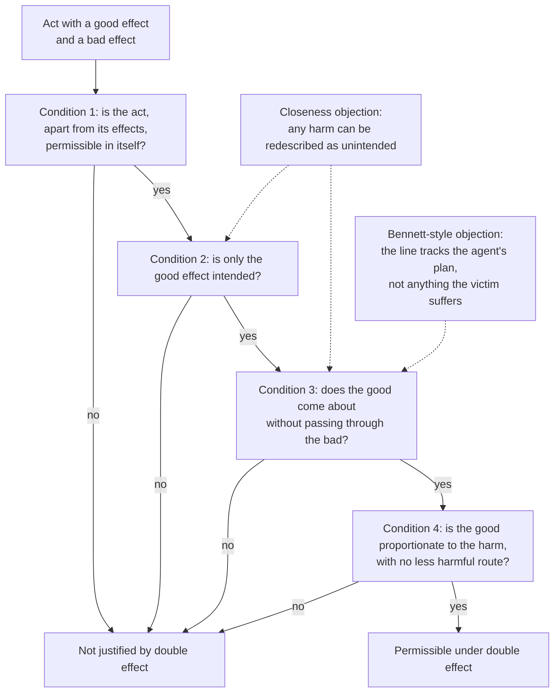

# Ethics · Lesson 3.2: The doctrine of double effect

> ⏱ ~15 min · Module 3: Doing, allowing, and intending · Builds on: [3.1 Doing and allowing](03-01-doing-and-allowing.md), [philosophical-method 3.2 Distinctions and verbal disputes](../../philosophical-method/lessons/03-02-distinctions-and-verbal-disputes.md) · Unlocks: [3.3 Testing the principles on trolleys](03-03-testing-the-principles-on-trolleys.md)

## Why this matters

Two pilots drop the same bombs on the same town and kill the same forty civilians. One was aiming at a munitions factory and knew the civilians would die; the other was aiming at the civilians, to break the enemy's will. Nearly everyone who thinks about it feels a moral difference, and the laws of war encode one. The doctrine of double effect (DDE) is the oldest serious attempt to say what that difference is and when it makes an act permissible. It is also the principle that clinicians, just-war theorists and their critics all reach for first, so it pays to know exactly what it claims.

## The idea

[3.1](03-01-doing-and-allowing.md) asked whether *doing* harm is worse than *allowing* it. Double effect asks a different question about harms you do: did you **aim** at the harm, or only **accept** it as a side effect of aiming at something else?

The test that separates the two is counterfactual. Ask the agent: *if the harm somehow failed to happen, would your plan have failed?* The strategic bomber says no. If the civilians had all left town the night before, the factory still burns and his mission succeeds. The terror bomber says yes. If the civilians survive, his plan has failed, because their deaths were the thing meant to do the demoralizing. Same bombs, same bodies; in one plan the deaths are a by-product, in the other they are a **means**.

The doctrine does not say side effects are free. It says a harm you would be forbidden to aim at can sometimes be permissibly brought about as a side effect, provided the good you do aim at is serious enough to outweigh it. So it has two halves: a line (intended versus foreseen) and a scale (proportion). Drop the line and you have consequentialism. Drop the scale and any horror becomes permissible if you keep your eyes on something else.

## Source

The seed of the doctrine is usually traced to Aquinas's article on killing in self-defence (*ST* II-II q.64 a.7, English Dominican Province translation, *respondeo*, opening):

> "Nothing hinders one act from having two effects, only one of which is intended, while the other is beside the intention. Now moral acts take their species according to what is intended, and not according to what is beside the intention, since this is accidental … Accordingly the act of self-defense may have two effects, one is the saving of one's life, the other is the slaying of the aggressor. Therefore this act, since one's intention is to save one's own life, is not unlawful … And yet, though proceeding from a good intention, an act may be rendered unlawful, if it be out of proportion to the end. Wherefore if a man, in self-defense, uses more than necessary violence, it will be unlawful: whereas if he repel force with moderation his defense will be lawful."

*"Take their species"* means: what kind of act it morally *is* (murder, defence) is fixed by what the agent intends. The article goes on to say a private person may not *intend* to kill even in self-defence, while public authority acting for the common good may. How much of the modern doctrine this article actually contains is disputed. Some scholars read "beside the intention" as a general principle; others read the article as a narrower teaching about defence, with the four-condition formula a much later construction. Module 3's boss problem makes you take a position on that.

## The argument

The modern statement, as the manualist tradition came to fix it (J. T. Mangan's 1949 historical survey is the usual reference): an act with a good and a bad effect is permissible only if all four conditions hold.

1. **The act is not wrong in itself.** Described apart from its effects, the act is good or morally neutral. *In words:* double effect cannot launder an act already ruled out on its own terms, such as lying or torture on views that forbid them outright.
2. **Only the good effect is intended.** The bad effect is foreseen, perhaps certain, but not aimed at, either as an end or as a way of getting to the end. *In words:* you would be glad if the harm did not happen.
3. **The bad effect is not a means to the good effect.** The good must not come about *through* the harm. *In words:* the harm is not a step in your plan. This is where the terror bomber fails, since the deaths are how the demoralization happens.
4. **There is proportionate reason.** The good aimed at is serious enough to justify accepting the harm, and no less harmful way to it is available. *In words:* even a clean side effect has to be worth it.

Conditions 2 and 3 carry the intended/foreseen line; 4 is the scale. Condition 3 is really a special case of 2 (whoever wills an end wills the means they choose), but the tradition lists it separately because it is where most cases are decided.

## Argument map

Note what a "no" means. Failing the doctrine does not make an act wrong; it means *this* principle cannot license it. Other considerations might.

## Worked examples

**Example 1 (clean case: pain relief at the end of life).** A patient is dying and in severe pain that only a high opioid dose controls. Stipulate that the dose will somewhat shorten his life. (Whether properly titrated doses in fact do so is clinically contested; the stipulation just makes the case bite.)

- *Condition 1:* giving an analgesic is not wrong in itself. ✓
- *Condition 2:* the physician aims at relief. Run the counterfactual: if the patient's life were not shortened, her plan would succeed completely. ✓
- *Condition 3:* the relief comes from the drug's action on pain, not from the death. A patient who got the relief and lived longer would count as a success. ✓
- *Condition 4:* severe, otherwise untreatable suffering against a modest shortening of a life already ending, with no lower dose that works. ✓ on most weighings.

Verdict: permitted. Now vary one factor. The physician gives the same dose *so that* the patient dies and the suffering ends. The syringe, the dose and the outcome are unchanged, but death is now the means of relief, so the act fails conditions 2 and 3. That minimal pair is the doctrine's signature: same act, same outcome, opposite verdict, and only the plan changed.

**Example 2 (where it strains: the closeness problem).** Philippa Foot ("The Problem of Abortion and the Doctrine of the Double Effect", 1967), drawing on a point she credits to H. L. A. Hart, gave a case of roughly this shape. Cave explorers are trapped by rising water behind a large man wedged in the only exit. They have dynamite. Blowing him out of the opening kills him.

Try condition 3. What does the party need? An *open exit*, not a dead man. If, per impossibile, he were blasted out alive, their plan would succeed. So by the counterfactual test his death is a side effect, and double effect seems to allow it, just as it allows the strategic bomber. Almost no one believes that is the right analysis. Blowing a man to pieces is not something whose killing you merely foresee.

The problem is general. With a fine enough description, nearly any harm drops out of the intention: the terror bomber needs only that the civilians *seem* dead to the enemy until the war ends. A line of criticism associated with Jonathan Bennett (*The Act Itself*, 1995) presses this to the conclusion that the intended/foreseen line cannot bear the moral weight put on it. Defenders reply with a **closeness** criterion: an effect so close to what you intend that it is not really a different event (blowing him to pieces, killing him) counts as intended. The trouble is saying what "close" means without appealing to the very verdicts the doctrine was meant to explain. A rival repair, Warren Quinn's (1989), shifts the test from intention to *agency*. What counts against an act is deliberately involving a person in your plan in a way that harms him, whether or not the harm itself is your aim. That repair and its rivals are tested on Loop in [3.3](03-03-testing-the-principles-on-trolleys.md).

## Watch out

- **You might think double effect is the same as doing and allowing, but** both bombers *do* the killing, so the doctrine of doing and allowing cannot tell them apart. Double effect can. And a harmful allowing can be intended, as when you let a rich uncle drown in order to inherit. The two principles cut across each other, which is why 3.3 needs both.
- **You might think "foreseen, not intended" makes the harm acceptable, but** condition 4 still has to be passed. The doctrine makes side effects *eligible* for justification, not justified.
- **You might think intention is whatever the agent says it is, but** intention in the doctrine is fixed by the plan, i.e. what the agent needs to happen for the act to succeed. It is not fixed by the description the agent prefers. The counterfactual test is public: the terror bomber cannot make his plan succeed without the deaths, whatever he tells himself.
- **You might think the doctrine is Catholic doctrine to be accepted or rejected as such, but** it is taught here as a secular principle, with defenders and critics across traditions. Its role within Catholic moral theology belongs to [`moral-theology`](../../moral-theology/syllabus.md).

## One-liner

> A harm you may not aim at can sometimes be accepted as a side effect, if it is not the means to your good end and the end is worth it; the hard part is saying when a harm is close enough to your aim to count as aimed at.

## Problems

**P1 (🟢) *(Exegetical.)*** In the Source passage, Aquinas says an act done with a good intention "may be rendered unlawful, if it be out of proportion to the end," and illustrates with "more than necessary violence." Consider two defenders, each facing an attacker trying to kill them. **A** could stop the attack by knocking the attacker down, but stabs him fatally instead. **B** can stop the attack only by a blow that will kill the attacker. (a) What does the illustration show "out of proportion to the end" covers, and does the passage condemn A? (b) Does the passage's illustration by itself settle whether proportion also requires *weighing* the attacker's death against the defender's life, as modern condition 4 does? 100 words or fewer in total.

**P2 (🟡) *(Exegetical (a) · Evaluative (b))*** A fire breaks out in the engine compartment of a ferry carrying 40 people. The chief engineer can seal the compartment's hatch, starving the fire of oxygen, but two crew members are trapped inside. They cannot be reached in time and will suffocate. If the hatch stays open, the fire reaches the fuel tanks and the ferry is lost with most aboard. (a) Run the four conditions and give the doctrine's verdict. (b) Change exactly one factor so that the doctrine either gives the opposite verdict or stops giving a determinate one, and say which condition does the work. 150 words or fewer for (b).

**P3 (🔴, optional) *(Evaluative.)*** Build a case, not the cave or the bombers, in which the counterfactual test ("would the plan fail if the harm did not occur?") classifies a harm as merely foreseen, but the verdict that double effect then permits the act is one you reject. Then state a closeness criterion that blocks your case and name one case your criterion now gets wrong or cannot decide. Any verdict on whether the doctrine survives. 150 words or fewer.

Solutions

**P1** *(Exegetical, strict.)*

**Must hit, strict (a):** the illustration ties disproportion to the *means*. The violence exceeds what the end, saving one's life, requires. A uses more force than necessary, so on the passage's own example A's defence is unlawful even though the intention (self-preservation) is good.
**Must hit, strict (b):** no. B uses only necessary force, so the illustration's test (necessity/moderation) is met, and the passage does not state a separate weighing of harms. A reader may argue "out of proportion to the end" *could* also carry a weighing reading, but the example given does not settle it. Credit for keeping "what the text says" apart from "what it could be read as allowing."
**Wrong turns:** reading modern condition 4 straight into the passage; saying the passage condemns B because a death results (that would also condemn every lethal defence the article permits).
**Model answer:** (a) Force beyond what saving one's life requires; A exceeds it, so A's defence is unlawful. (b) No. B's force is the minimum necessary, which meets the illustrated test; whether proportion also weighs outcomes is not settled by the example.

---

**P2** *(Exegetical (a) · Evaluative (b).)*

**Must hit, strict (a):** (1) sealing a hatch is not wrong in itself. (2) The engineer intends to put out the fire; if the two crew somehow survived, the plan succeeds fully. (3) The fire goes out through lack of oxygen, not through the deaths, so the harm is not a means. (4) About 40 lives against 2, with no alternative stipulated, so proportionate. Verdict: permissible under double effect.
**Must hit, any verdict (b):** exactly one factor changed, named; the condition that flips or goes indeterminate identified; a check that nothing else moved.
**Wrong turns:** saying the deaths are a means "because sealing the hatch kills them" (causing is not using); varying two things at once, e.g. fewer passengers *and* a rescue option.
**Model answer (b), one of several:** Change only the numbers aboard: besides the two trapped crew, the ferry carries just two people. Conditions 1 to 3 are untouched, since sealing is still innocent, the deaths are still foreseen, and the fire still goes out through lack of oxygen. Condition 4 now weighs two lives against two, and the doctrine supplies no metric for a tie: it does not say whether equal numbers are "proportionate." So the verdict becomes indeterminate, and condition 4 does all the work. The line (conditions 2 and 3) can make a harm *eligible*; only the scale decides, and the scale is left to judgment.

---

**P3** *(Evaluative, graded on construction, not verdict.)*

**Must hit, any verdict:**
- A case where the harm is, on a narrow description, not needed for the plan, with that description stated.
- An explicit statement that the counterfactual test passes, plus your verdict.
- A closeness criterion stated precisely enough to apply (e.g. "an effect counts as intended if it is causally or constitutively inseparable from the intended effect in the circumstances").
- One case the criterion now mishandles, with the reason.

**Wrong turns:** a case where the harm plainly *is* the means (that is not a closeness case); a criterion so vague ("too close") it decides nothing; asserting the doctrine is refuted without the cost check.
**Model answer (one of several):** A guard needs a sleeping sentry *unable to raise the alarm* and so decapitates him. Strictly, he needs only incapacity, and a living but silent sentry would serve, so the counterfactual test calls the death foreseen. Most would reject "permitted as a side effect." Criterion: an effect is intended if, in the circumstances as the agent knows them, the chosen means cannot produce the intended effect without it. That blocks the guard. Cost: it also seems to make the strategic bomber's civilian deaths intended, since in that town the bombs cannot destroy the factory without killing them, and that erases the distinction the doctrine exists to draw.

## Flashback

**From Lesson 2.2 (The Formula of Universal Law):** A café owner states his policy: *"When my café is under six months old, in a town of fewer than 5,000 people, and a chain has just opened on the same street, I will post a few invented five-star reviews to get noticed."* (a) Run the conception test on the maxim as he states it. Say why it seems to pass, and which direction of misfire that would be. (b) Give the actual-maxim reply: name the counterfactual that reveals what really moves him, state that maxim, and run the conception test on it. Then state the critic's charge against this reply and say whether it bites in this case. 150 words or fewer in total. *(Exegetical (a) · Evaluative (b).)*

Solution

**Must hit, strict (a):** universalized, only owners in exactly these circumstances post invented reviews. They are too few to change what reviews are taken to mean, so readers still trust reviews and the invented ones still draw customers. On the practical reading there is no contradiction in conception, and no necessary end blocks the will test. A plainly wrong maxim passes: a **false negative**, got through by gerrymandered description.

**Must hit, any verdict (b):**
- The counterfactual: would he post them if the café were a year old, the town larger, or no chain nearby? If yes, those details are not what moves him.
- The actual maxim: *when I want more customers, I will post invented positive reviews.* Universalized, everyone who wants customers posts invented praise, this is known, reviews carry no information, and nobody is moved by them. The maxim cannot get its end in the world it wills: a contradiction in conception, so a perfect duty, the structure of the false promise.
- The critic's charge: the reply assumes an account of which features are morally relevant, which the test was supposed to supply. Then a judgment on whether that bites here, with a reason.

**Wrong turns:** failing (a) because invented reviews are dishonest, which is the verdict and not the test; calling the general maxim's failure a contradiction in will; calling (a) a false positive.

**Model answer, (b) one of several:** (a) Universalized, only new small-town cafés facing a chain do it. They are too few to change what reviews mean, so the fake ones still work. It passes: a false negative. (b) Would he do it if the café were older or the town bigger? He would, so the detail is idle. His real maxim is *when I want customers, I will post invented praise*. If everyone did that, reviews would be known to be worthless and would move no one: a contradiction in conception. The critic says this assumes a theory of relevant features. Here that barely bites, since the counterfactual is a fact about his psychology, not a moral judgment. It bites against an owner who really would cheat only when facing ruin.

## Connections

- **Backward:** [3.1](03-01-doing-and-allowing.md) drew the doing/allowing line; this lesson draws a second line through doings, and the two cross. The intended/foreseen *distinction* itself, and the worry about whether agents can honestly tell their own intentions apart, were set up in [philosophical-method 3.2](../../philosophical-method/lessons/03-02-distinctions-and-verbal-disputes.md). Condition 3 echoes the Formula of Humanity's ban on using persons as mere means ([2.3](02-03-humanity-autonomy-and-the-lie.md)), and deontological constraints on *intentional* harming are the structure [2.4](02-04-constraints-and-options.md) examined.
- **Forward:** [3.3](03-03-testing-the-principles-on-trolleys.md) puts double effect, doing/allowing, Quinn's agency repair and Thomson's rival accounts on the Loop case, and considers the view that intention bears on blame rather than permissibility. Aquinas's natural-law framework, including why acts "take their species" from their object and intention, comes in [4.4](04-04-natural-law-aquinas.md), and the new natural law theory's strict account of intention in [4.5](04-05-the-new-natural-law-theory.md).
- **Sideways:** the doctrine's use within Catholic moral theology is owned by [`moral-theology`](../../moral-theology/syllabus.md); its self-defence roots and the private/public authority distinction feed [`philosophy-of-law`](../../philosophy-of-law/syllabus.md) and just-war theory in [`political-philosophy`](../../political-philosophy/syllabus.md). Condition 4 is an informal cost-benefit test; its formal cousin (weighing expected harms under uncertainty) is [`decision-theory`](../../decision-theory/syllabus.md)'s.
