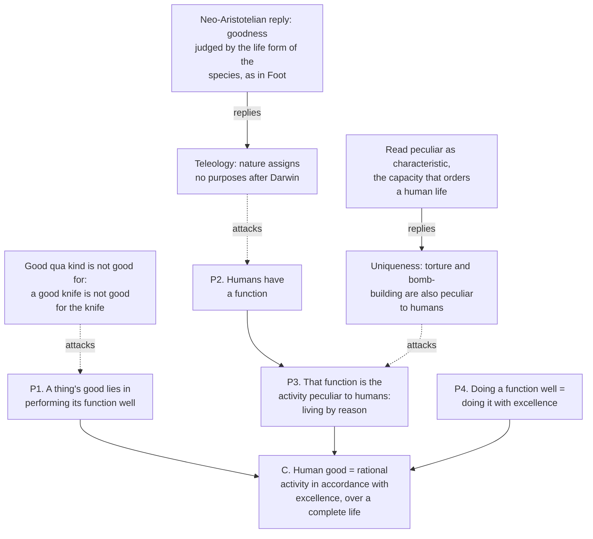

# Ethics · Lesson 4.1: Aristotle: the human good

> ⏱ ~15 min · Module 4: Virtue and natural law · Builds on: [Philosophical Method 1.3 Reconstruction and charity](../../philosophical-method/lessons/01-03-reconstruction-and-charity.md) · Unlocks: [4.2 Aristotle: virtue and practical wisdom](04-02-aristotle-virtue-and-practical-wisdom.md)

## Why this matters

Modules 1–3 asked which *acts* are right. Aristotle starts somewhere else: what is a human life *for*, and what would it be to live one well? Get that answer and the questions about acts follow — right action becomes what a person living well would do. Virtue ethics (4.2–4.3) and Thomistic natural law (4.4) both stand on this lesson's argument, so if it fails, a great deal fails with it. It is also the most compressed argument in ethics: one page of *Nicomachean Ethics* I.7 that people have been reconstructing, attacking and rescuing for twenty-three centuries.

## The idea

Ask anyone why they do something and keep asking. Why go to work? For money. Why money? For a house, a family's security. Why those? Eventually the chain stops at something wanted *for itself and not for anything further*. Aristotle's opening move (NE I.1–2) is that if every chain went on forever, desire would be "empty and vain"; so there is a top of the hierarchy, and that is the human good. Nearly everyone, he says, agrees on its name — ***eudaimonia***, usually translated "happiness," better "flourishing" or "living well." The dispute is over what it consists in.

He gives two tests for the chief good. It must be **complete** (or "final"): chosen always for itself, never for the sake of something else. Honour, pleasure and intelligence are chosen for themselves *and* for the sake of flourishing; flourishing is chosen for nothing beyond itself. And it must be **self-sufficient**: taken on its own, it makes a life choiceworthy and lacking nothing.

Then comes the real question. Calling the chief good "flourishing" is a platitude; what *is* flourishing? Here Aristotle borrows from craft. We know what a good flute-player is: one who plays the flute well. A good knife cuts well; a good eye sees well. Whenever a thing has a characteristic work — an *ergon*, a function — its goodness lies in doing that work well. So if a human being has a function, the human good will be doing *that* well.

Notice what kind of answer this is. Flourishing is not a feeling you have but something you *do*: an **activity**, sustained across a life. That is why Aristotle can say a person who sleeps through life, however good his character, is not flourishing, and why the verdict belongs to a whole life rather than a good afternoon.

## Source

From NE I.7 (Ross, 1908), the step from crafts to humans and the definition it yields:

> "For just as for a flute-player, a sculptor, or any artist, and, in general, for all things that have a function or activity, the good and the 'well' is thought to reside in the function, so would it seem to be for man, if he has a function."

> "human good turns out to be activity of soul in accordance with virtue, and if there are more than one virtue, in accordance with the best and most complete. But we must add 'in a complete life.' For one swallow does not make a summer, nor does one day"

Two small words carry weight. "If he has a function" marks the premise the whole argument hangs on. And "virtue" translates *aretē*, excellence of any kind — the virtue of a knife is sharpness — so the definition is not yet moralized; it says only "doing the human work excellently."

## The argument

**The function argument, NE I.7.**

1. **For anything with a function, its good lies in performing that function.** *In words:* a flute-player is good *as* a flute-player by playing well, not by being rich or tall.
2. **Human beings have a function.** Aristotle's support: carpenters and tanners have functions, and so do the eye, hand and foot; it would be odd if the human being as such had none. *In words:* there is some work that belongs to us simply as humans, not as holders of a job.
3. **The human function is what is peculiar to humans.** Mere life (nutrition and growth) is shared with plants, perception with animals; what remains is the active life of the part of the soul that has reason. *In words:* our work is the one no other living thing does — living by reason.
4. **Doing a function well is doing it in accordance with the thing's excellence (*aretē*).** A harpist and a *good* harpist have the same function; the second does it excellently. *In words:* "good at X" just means "does X with the relevant excellence."
5. **Therefore the human good is activity of soul in accordance with excellence** — with the best and most complete excellence, if there are several. *In words:* living well is exercising reason, and doing it excellently.
6. **And this over a complete life.** *In words:* one good day no more makes a flourishing life than one swallow makes a summer.

Premise 3 needs one clarification before anyone attacks it. "Peculiar" is doing double duty: it means *not shared*, but in the argument it also means *characteristic* — the capacity that organizes and directs the others in the kind of life humans lead. Which of those two readings you give it decides most of the objections below.

## Argument map

Solid arrows carry support; dashed arrows are objections, each aimed at the premise it denies; the two reply boxes are the defenders' best answers. **O1** — the *good-qua-kind versus good-for* gap. A good knife is a knife that cuts well; that is not what is good *for* the knife. The argument needs "a good human" (good as a specimen) to coincide with "a life good for the one who lives it" (well-being, [1.2](01-02-what-is-good-for-a-person.md)). Aristotle assumes they coincide; critics press that nothing shown so far makes them. **O2** — the argument's biology is teleological, and modern biology explains traits without purposes; a worry pressed by Bernard Williams (*Ethics and the Limits of Philosophy*, 1985) among others. Philippa Foot's *Natural Goodness* (2001) answers without cosmic purpose: we already judge a wolf defective if it will not hunt with the pack, by facts about how wolves live, and practical reason plays that role in the human life form. [4.3](04-03-modern-virtue-ethics.md) takes this up. **O3** is the problem you will build below.

## Worked examples

**Example 1 (clean case — running the two tests).** Aristotle's own shortlist of candidate lives (NE I.5) is gratification, honour, and contemplation; add wealth, which he dismisses as merely useful.

- **Wealth** fails completeness at once: it is chosen for what it buys.
- **Honour** fails more subtly. We want honour from people of good judgement, *for* our excellence — which shows we value it as a sign of something else, and that the something else ranks higher.
- **Pleasure** passes completeness: we choose it for itself. But it fails self-sufficiency on Aristotle's view. A life of bodily pleasure is a life "suitable to beasts," one a cow could live — so pleasure alone leaves a human life lacking what is distinctively its own. (This is not hedonism refuted outright. A hedonist answers that the objection assumes the conclusion that rational activity matters for its own sake; 1.2's experience machine is where that stand-off lives.)

The tests do not name flourishing's content, but they prune the field, and they tell you what the function argument must deliver: something complete, self-sufficient, and not a mere feeling.

**Example 2 (hard case — Priam).** Priam, king of Troy, lives a long life of excellent activity, then in old age sees his sons killed and his city burned. Was he flourishing? If flourishing is *activity in accordance with excellence*, character seems untouched, so perhaps yes. Aristotle refuses that verdict (NE I.9–10): no one calls a man who met Priam's end happy. Excellent activity needs **external goods** — friends, resources, some political standing — as instruments, and some goods (good birth, children, beauty) whose lack takes the lustre from blessedness outright.

Here the account strains. If flourishing depends on fortune, it is not wholly up to us, and the good person can be made wretched by events. If it does not, Priam flourished amid the ashes — the Stoic answer, and one Aristotle thinks no sane person would give. His compromise is careful: the good person bears misfortune nobly and never becomes *miserable*, since he will not do hateful acts, but he may fall short of being *blessed*. Whether that middle position is stable, or collapses into one side, is a live question; notice that it is forced on him by premise 6, "in a complete life."

## Watch out

- **You might think *eudaimonia* is a feeling of happiness, but** it is an activity assessed over a whole life. You can feel content and fail to flourish (the pleasure life), or flourish through a stretch of grief; Aristotle even allows that the verdict on a life can be affected by what happens after it ends (I.10–11).
- **You might think "peculiar to humans" means we should do only what no animal does, but** the argument does not tell you to stop eating or perceiving. It identifies the capacity whose excellent exercise *organizes* a human life; nutrition and perception are included in that life, not banished from it.
- **You might think "virtue" in the conclusion already means moral virtue, but** *aretē* is excellence in general. That the excellences turn out to include justice and courage is argued in Book II onward ([4.2](04-02-aristotle-virtue-and-practical-wisdom.md)), not assumed here — and "the best and most complete" excellence is, by Book X, contemplation.
- **You might think a function needs a designer, but** Aristotle's functions are the characteristic activities of natural kinds, with no maker behind them. The theistic reading adds a designer later ([4.4](04-04-natural-law-aquinas.md)); the argument as stated does not require one.

## One-liner

> A thing is good by doing its characteristic work well, so the human good is exercising reason excellently across a whole life — provided humans have a characteristic work, which is exactly where the fight is.

## Problems

**P1 (🟢) *(Exegetical (a) · Evaluative (b).)*** Read NE I.7 (Ross, 1908):

> "the self-sufficient we now define as that which when isolated makes life desirable and lacking in nothing; and such we think happiness to be; and further we think it most desirable of all things, without being counted as one good thing among others—if it were so counted it would clearly be made more desirable by the addition of even the least of goods; for that which is added becomes an excess of goods, and of goods the greater is always more desirable."

(a) Set out the inference in the part after the dash: what follows if happiness *were* counted as one good among others, and what does the passage conclude? (b) Two readings: on the *inclusive* reading, happiness contains every intrinsic good, so nothing can be added to it; on the *dominant* reading, happiness is a single supreme activity (in Book X, contemplation). Which does this passage better support, and which words decide it? 150 words or fewer for (b).

**P2 (🟡) *(Evaluative.)*** Premise 3 locates the human function in what is "peculiar to man." (a) Build a counterexample: an activity found only in humans whose *excellent* performance plainly is not part of living well, and say exactly which step of the argument it breaks. (b) State the best Aristotelian reply and say whether it disarms your case. Any verdict. 150 words or fewer.

**P3 (🔴, optional) *(Exegetical (a) · Evaluative (b).)*** Dana, forty, has spent twenty years contentedly: a modest inheritance, excellent food, long afternoons of video games and television, warm but undemanding company. She reports high, stable satisfaction; she makes few plans, takes on no projects, and thinks hard about nothing. (a) What verdict does Aristotle's account give on Dana's life, and which part of the account delivers it? (b) Say where the account stops settling the verdict, and state the strongest reply a defender of Dana's life could make. 150 words or fewer for (b).

Solutions

**P1** *(Exegetical (a) — strict · Evaluative (b) — any verdict.)*

**Must hit, strict (a):** the argument is a *modus tollens*. If happiness were counted as one good among others, adding even the least good to it would produce something more desirable than happiness alone (since "of goods the greater is always more desirable"). But happiness is the most desirable of all things — nothing is more desirable. So happiness is not counted as one good among others.

**Must hit, any verdict (b):** state which reading the inference favours and point at the words. The **inclusive** case: "lacking in nothing" and "when isolated makes life desirable" suggest nothing outside happiness could improve it, which is easiest if every good is already inside it. The **dominant** case: "without being counted as one good thing among others" can be read as saying happiness belongs to a different order from the goods that serve it, not that it sums them; and Book X's elevation of contemplation must be squared with the passage. Either verdict passes if it cites text and acknowledges what the other reading does with the same words.

**Wrong turns:** reading the passage as saying adding goods *would* improve happiness — the counterfactual is the premise that gets rejected; answering (b) from Book X alone without the passage's words.

**Model answer (b), one of several:** The inclusive reading fits better. The argument's force is that no addition could improve happiness; the simplest explanation is that happiness already contains every intrinsic good, so the "least of goods" is inside it already. "Lacking in nothing" says the same. A dominant reading must explain why adding, say, friendship to a life of contemplation does not make it more desirable; it can reply that happiness is not in the same scale as the goods that serve it — but that is a heavier reading of "counted" than the text states outright.

---

**P2** *(Evaluative — graded on construction, not the verdict.)*

**Must hit, any verdict:**
- A counterexample that meets **both** conditions: the activity is (plausibly) found only in humans, *and* doing it excellently is not part of living well. Torture, elaborate deception, designing weapons of mass killing, compulsive gambling strategy.
- Locate the break: P3, the inference from *peculiar* to *the human function* (or equivalently, that excellence at the peculiar activity is the human good).
- The Aristotelian reply: "peculiar" means *characteristic* — the capacity of reason as it organizes a whole human life — and the excellence of that capacity includes practical wisdom about ends, not just cleverness at means. On that reading expert torture is excellent *technique* in the service of a defective use of reason.
- Say whether the reply works, and at what price: it defines the function evaluatively, so the charge that "excellent reasoning" now smuggles in the moral virtues it was supposed to justify must be faced.

**Wrong turns:** citing an activity animals also perform (tool use, social play) — that is not a counterexample to the uniqueness premise; attacking P2 instead and calling it a uniqueness objection; concluding "so Aristotle is refuted" without stating the reply.

**Model answer, one of several:** A master forger's skill is uniquely human and deeply rational — planning, fine discrimination, anticipating experts. Excellence at it is not living well. So P3's move from "peculiar to humans" to "the human function" fails if "peculiar" means only "not shared." Aristotelian reply: the function is reason as *characteristic* — the capacity that orders a life toward its ends — and its excellence is practical wisdom, which the forger's ends violate. That disarms the case, but at a cost: "excellent rational activity" now builds in good ends, so the argument can no longer derive the virtues from a neutral fact about human capacities. Whether that circle is vicious or just the shape any account of a natural kind's goodness takes is where the dispute lives.

---

**P3** *(Exegetical (a) — strict · Evaluative (b) — any verdict.)*

**Must hit, strict (a):** Dana is not flourishing on Aristotle's account. Flourishing is *activity* of the rational soul in accordance with excellence (P5), not a state of satisfaction; her life exercises reason minimally. Her pleasure passes the completeness test but fails self-sufficiency (the life of gratification, NE I.5). Her external goods are ample, so this is not a Priam case — the deficit is in the activity itself.

**Must hit, any verdict (b):**
- Where the account stops determining: *how much* rational activity, of *what* kinds, suffices. Dana reasons daily (games demand strategy, friendship demands attention); the account has no threshold, and she is not living the "life of beasts."
- The strongest reply for Dana: the objection assumes that rational activity is good *for* her independent of her satisfaction (the good-qua-kind vs good-for gap), which a hedonist or desire-satisfaction theorist ([1.2](01-02-what-is-good-for-a-person.md)) denies.
- A verdict on whether that reply works.

**Wrong turns:** saying Aristotle condemns pleasure — he thinks the excellent life is pleasant (NE I.8); treating her self-report as settling the question for Aristotle, or as irrelevant for her defender.

**Model answer (b), one of several:** Aristotle's account says Dana's life falls short, but not by how much: she does reason — in games, in friendship — and nothing fixes how demanding "in accordance with excellence" must be before a life counts. Her defender's best reply is that "falling short" means falling short *as a human specimen*, and that has not been shown to make her life worse *for her*; by her own lights nothing is missing. The Aristotelian answer is that a life can be lacking without the one living it noticing — as a child raised without language would lack something without missing it. Whether that analogy holds is exactly the gap objection O1 names.

## Flashback

**From Lesson 2.4 (Constraints and options):** A newspaper editor learns that a rival outlet will expose three confidential sources — each promised anonymity by a different reporter there — unless she first publishes the name of one source her own paper promised to protect; the rival will then drop its story. (a) State a constraint against betraying sources in *agent-neutral* form and in *agent-relative* form, and say which forbids her to publish. (b) State the paradox of deontology as it applies here, in two sentences. (c) Separately, she could give up every weekend to exposing corruption, doing more good than anything else she could do, but chooses to spend weekends with her children. Is her permission a constraint or an option? Three sentences or fewer per part.

Solution

**Must hit, strict (a):** agent-neutral: *minimize betrayals of confidential sources* (everyone has reason to reduce the total, whoever commits them) — this recommends publishing, since one betrayal prevents three. Agent-relative: *do not yourself betray a source* (each agent's reason concerns her own acts) — this forbids publishing, whatever others then do. Only the agent-relative form is a deontological constraint.

**Must hit, strict (b):** if betraying a source is so wrong that it must not be done even to prevent more of the same, it seems that three betrayals are worse than one, so preventing them should be permitted or required; yet the constraint forbids the one. It looks irrational to treat a violation as grave while forbidding the act that minimizes violations of the very kind.

**Must hit, strict (c):** an **option** (an agent-centred prerogative, in Scheffler's term): a permission *not* to do the most good, grounded in the weight of her own projects and relationships. A constraint forbids doing something even for the best outcome; an option permits declining to produce the best outcome.

**Wrong turns:** stating the agent-relative constraint as "betrayals are bad," which is agent-neutral; calling (c) a constraint because it "limits" the demand of maximization — it limits a requirement, not an action.

**Model answer:** (a) Neutral: minimize betrayals — publish. Relative: do not betray your own sources — don't. (b) Three betrayals seem worse than one, so a view that forbids the one betrayal that prevents three seems to prefer the worse outcome; if the constraint expresses how bad betrayal is, it appears self-undermining. (c) An option: she may decline the best outcome for the sake of her own life; no one is forbidden anything.

*Written from the 2.4 syllabus row; that lesson was not yet on disk.*

## Connections

- **Backward:** [1.2](01-02-what-is-good-for-a-person.md)'s objective-list theory is where Aristotle's account usually gets filed, and objection O1 is exactly 1.2's question — is what makes a life good *as a human life* what makes it good *for* its subject? The function argument is also a standing exercise in [Philosophical Method 1.3](../../philosophical-method/lessons/01-03-reconstruction-and-charity.md): read "peculiar" uncharitably and it collapses in one line; read it as "characteristic" and it becomes an argument worth fighting.
- **Forward:** [4.2](04-02-aristotle-virtue-and-practical-wisdom.md) fills in "in accordance with excellence" — virtue as a settled state, the mean, practical wisdom. [4.3](04-03-modern-virtue-ethics.md) takes Foot's naturalism as the modern answer to O2. [4.4](04-04-natural-law-aquinas.md) reads the human function as ordered inclinations known by reason, and Module 4's boss problem asks you to reconstruct this argument and compare it with Aquinas.
- **Sideways:** *ergon* and *energeia* — function and activity — are the ethical face of act and potency in [Metaphysics 2.2](../../metaphysics/lessons/02-02-change-act-and-potency.md): flourishing is a capacity *actualized*, which is why a sleeping sage does not count. Aristotle's wider system and the Book X contemplation problem belong to [`ancient-medieval-philosophy`](../../ancient-medieval-philosophy/syllabus.md).
