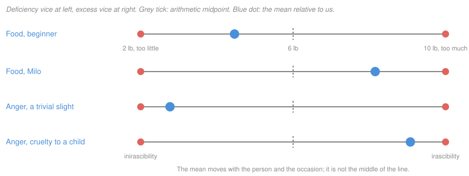

# Ethics · Lesson 4.2: Aristotle: virtue and practical wisdom

> ⏱ ~15 min · Module 4: Virtue and natural law · Builds on: [4.1 Aristotle: the human good](04-01-aristotle-the-human-good.md) · Unlocks: [4.3 Modern virtue ethics](04-03-modern-virtue-ethics.md)

## Why this matters

Utilitarians and Kantians both hand you a test to run on an act. Aristotle hands you a person to become. [4.1](04-01-aristotle-the-human-good.md) ended with the human good as activity of the soul in accordance with virtue; this lesson says what a virtue is, how you get one, and what does the deciding once you have it. Every modern virtue ethics, and Aquinas's moral theology, is built on these three answers — and the most common objection to all of them (a theory of character cannot tell you what to do) starts here.

## The idea

Think of a good tennis player. She does not consult a rule for how hard to hit. She has trained until the right shot is what she *sees* and what she *wants* to play, and she enjoys playing it. A beginner who forces himself through the correct stroke against every instinct gets the ball over, but he is not yet good at tennis.

Aristotle's virtues work the same way. A virtue is not a feeling (you are not praised for being frightened) and not a capacity (everyone can feel fear). It is a **settled state** — *hexis* — of how you are disposed to feel and act (NE II.5). You acquire it the way you acquire a skill: "we become just by doing just acts, temperate by doing temperate acts, brave by doing brave acts" (II.1). Habituation comes first; the settled state comes out of it.

What does the state aim at? At **the mean**: feeling and acting neither too much nor too little, but as the situation and the person require. And what finds the mean? Not a formula but **practical wisdom**, *phronesis* — a trained perception of what this particular situation calls for. The good person is the one who sees the case rightly and wants what she sees.

## The argument

**The definition (NE II.6, Ross).** "Virtue, then, is a state of character concerned with choice, lying in a mean, i.e. the mean relative to us, this being determined by a rational principle, and by that principle by which the man of practical wisdom would determine it." Taken clause by clause:

1. **A state of character** (*hexis*). *In words:* a stable disposition you have built, not a passing feeling or a bare ability.
2. **Concerned with choice.** *In words:* it shows up in what you deliberately decide to do, not just in what happens to you.
3. **Lying in a mean.** *In words:* for each range of feeling or action there is a too-much and a too-little, and the virtue hits the target between them.
4. **Relative to us.** *In words:* the target is fixed by this person in this situation, not by the arithmetic midpoint of the range.
5. **Determined by a rational principle.** *In words:* the mean is found by reasoning about the case, not by luck or temperament.
6. **As the person of practical wisdom would determine it.** *In words:* the final standard is what someone with *phronesis* would judge right here.

**Acting virtuously versus doing the virtuous thing (II.4).** A just act can be done by someone who is not just. To act *as the virtuous person acts*, the agent must (i) know what he is doing, (ii) choose the act, and choose it for its own sake, and (iii) act from a firm and unchangeable character. *In words:* the right act from luck, fear of punishment or a lucky mood is not yet virtue.

**Virtue and practical wisdom need each other (VI.12–13).** Virtue makes the aim right; practical wisdom finds what serves that aim here. Without a good aim, practical intelligence is mere *cleverness*, equally at home serving a swindle. Hence Aristotle's conclusion that it is not possible to be good in the strict sense without practical wisdom, nor practically wise without moral virtue (VI.13). *In words:* you cannot have one properly without the other, so the full virtues come as a package.

## The case

**Milo (II.6).** If ten pounds of food is too much and two too little, the trainer does not therefore prescribe six — that may be too little for Milo the wrestler, too much for a beginner. Six is the mean *of the thing*, the arithmetic midpoint ($6 - 2 = 10 - 6 = 4$). The mean *relative to us* depends on who is eating.

A few virtues with their paired vices (Ross's terms):

| Sphere | Deficiency | Virtue (mean) | Excess |
|---|---|---|---|
| Fear and confidence | cowardice (too much fear) | courage | rashness (too much confidence) |
| Bodily pleasures | insensibility | temperance | self-indulgence |
| Giving and taking money | meanness | liberality | prodigality |
| Anger | inirascibility | good temper (mildness) | irascibility |

Two features of the table keep it from reading as a moderation chart.

- **The vices are not always equally distant.** Rashness resembles courage more than cowardice does, so Aristotle says we should lean away from the extreme we are more prone to (II.8–9) — steering the way you would straighten a bent stick, by bending it back.
- **Some things have no mean at all.** Some names already imply badness: among passions, spite, shamelessness and envy; among actions, adultery, theft and murder (II.6). There is no right amount of theft, no committing adultery "with the right woman, at the right time". The doctrine of the mean is a claim about spheres of feeling and action, not a license to find the middle of anything.

## Worked examples

**Example 1 (clean case — anger that is great and right).** A nurse discovers that a colleague has been falsifying the observation charts of frail patients to go home early; one patient deteriorated unnoticed. Run the definition.

- *Sphere:* anger. The mean is feeling it "at the right times, with reference to the right objects, towards the right people, with the right motive, and in the right way" (II.6).
- *Relative to us:* this is a grave, deliberate wrong to people who cannot protect themselves. The fitting anger is *strong* — a mild shrug here would be the deficiency, inirascibility, which Aristotle calls slavish in someone who endures insults to his own (IV.5).
- *Choice:* the anger is directed into acting — reporting, protecting the patients — not into a public tirade that serves only her feelings.

Verdict: great anger, rightly aimed, is the mean. **The mean is a target, not a temperature setting.**

**Example 2 (hard case — where the mean goes quiet).** A friend's novel, five years' work, is weak. She asks for your honest view the week before she submits it to agents. The sphere is the one Aristotle assigns to friendliness (IV.6): giving and sparing pain in social dealings, between the flatterer who praises everything to avoid giving pain and the contentious person who does not care what pain he gives. The friendly person, he says, will accept causing pain when that serves something better.

The doctrine can say what the *vices* are: flattery at one end, careless fault-finding at the other. It cannot, by itself, say which sentence to speak. Aristotle's answer is deliberate: in particulars "the decision rests with perception" (II.9), and practical wisdom is exactly the trained perception of the ultimate particular (VI.8). A defender will say this is a feature: ethics admits only as much precision as its subject matter (I.3), and a rule precise enough to settle every such case would get many of them wrong.

A critic replies that "do what the practically wise person would do" is empty for anyone who is not already practically wise — which is precisely the person who needs advice. That is the **application objection**, and [4.3](04-03-modern-virtue-ethics.md) takes it up with Hursthouse's reply. Here, note only where the guidance stops: the theory rules out the vices and names the standard, and hands the last step to judgment.

**Continence, and acting against knowledge (NE VII).** Two people decline a third drink before driving. The **temperate** one has no appetite pulling against his judgment; he is glad not to drink. The **continent** one wants it badly and holds out. Both act rightly, but for Aristotle only the first has the virtue; the continent person's feelings still disagree with his reason (VII.9), and pleasure or pain taken in the act is a sign of one's state (II.3). The **incontinent** (*akratic*) person knows he should not drink and drinks anyway.

Socrates held that this is impossible — no one knowingly does what is worse. Aristotle's reply (VII.3), briefly: the akratic person has the knowledge in a way, but not in active use, like someone asleep or drunk who can recite what he knows. Appetite blocks the particular premise — *this* is a third drink, *I* am driving — from being brought to bear at the moment of action. Some akratics deliberate and fail to stand by it (weakness); others never stop to deliberate (impetuosity).

## Watch out

- **You might think the mean is moderation, but** it is whatever the situation calls for, which can be extreme: great anger at cruelty, standing firm at the risk of death. "Always be moderate" is the doctrine's most common misreading.
- **You might think "relative to us" makes virtue subjective, but** it makes it *agent- and situation-indexed*, like the right dose of a drug: Milo's portion is a fact about Milo, not a matter of Milo's opinion. The standard is the practically wise person's judgment, not your own preference.
- **You might think the continent person is the real hero, since he wins a fight, but** Aristotle ranks him below the temperate person. Whether that ranking is right is a live dispute (see P3); it is not Aristotle's slip.
- **You might think habituation is mere conditioning, but** the end state includes choosing the act for its own sake and seeing why it is right. Habit supplies the "that"; practical wisdom adds the "why".

## One-liner

> Virtue is a trained disposition to feel and act at the target the situation sets — not the midpoint — and practical wisdom is the eye that sees where that target is.

## Problems

**P1 (🟢) *(Exegetical.)*** The paragraph below is from an invented staff memo. (a) Name the two distinct misreadings of Aristotle's doctrine of the mean that the memo relies on. (b) Give one kind of case from NE II.6 that its policy mishandles outright, and say why. 150 words or fewer in total.

> "Our core value this year is Balance, which Aristotle called the heart of virtue. In any disagreement, the wise manager finds the midpoint between the two positions. In any feeling, she keeps to a calm middle register: never too upset, never too passive. When a vendor offers a gift, accept something modest rather than all or nothing. Excess in any direction is a failure of character."

**P2 (🟡) *(Exegetical (a) · Evaluative (b))*** Rosa coordinates volunteers at a food bank. She finds that Ellen, a volunteer of twelve years, has been taking about 40 dollars a month from the donation tin to pay for her son's inhaler. Ellen is ashamed and offers to repay it. (a) Using the lesson's apparatus, say which spheres of feeling or action are in play, which element of the case admits no mean, and what the mean for Rosa's anger plausibly is. (b) Say where Aristotle's account stops determining what Rosa should *do* — report to the board, handle it privately, or something else — and whether that gap is a defect in the theory. 150 words for (b).

**P3 (🔴, optional) *(Exegetical (a) · Evaluative (b))*** Two cashiers are handed 50 dollars too much in change by a distracted customer. Jonah returns it without a flicker of temptation. Mara is behind on rent, wants badly to keep it, and returns it anyway. (a) Say how Aristotle ranks them, and state the rival view that Mara's act shows *more* of what deserves moral credit. (b) Name the crux — the single premise one side must deny — and say what argument or evidence would move it. Any verdict on who ranks higher. 150 words or fewer.

Solutions

**P1** *(Exegetical — strict.)*

**Must hit, strict (a):** (1) **mean as arithmetic midpoint** — the memo's "midpoint between the two positions" ignores that the mean is *relative to us*, fixed by the person and situation, as the Milo passage shows (six pounds is the mean of the thing, not the right portion); (2) **mean as moderation of feeling** — "a calm middle register" confuses the mean with a fixed low intensity, when the mean can be strong feeling (great anger at a grave wrong).
**Must hit, strict (b):** some actions and passions admit **no mean** because their names already imply badness (II.6: spite, shamelessness, envy; adultery, theft, murder). A vendor gift that functions as a bribe falls here: there is no right-sized bribe, so "accept something modest" is wrong in kind, not degree. (Also acceptable: a disagreement where one position is simply dishonest, so splitting the difference is not a mean.)
**Wrong turns:** saying Aristotle rejects balance altogether — he does locate virtue between two vices; the error is in how the memo locates the mean. Rebutting the memo's management advice instead of identifying the misreadings.
**Model answer:** (a) It treats the mean as the midpoint between positions, but the mean is relative to us, as Milo's portion shows; and it treats it as a fixed, mild intensity of feeling, when the right response to a grave wrong can be intense anger. (b) Bribes: II.6 says some actions admit no mean because their very description implies badness. There is no appropriate amount of bribe-taking, so a "modest" one is still the vice, not a midpoint between vices.

---

**P2** *(Exegetical (a) — strict · Evaluative (b) — any verdict.)*

**Must hit, strict (a):** spheres in play include **anger** (at the wrong done), **liberality/justice about money** (for Ellen, and for Rosa's handling of donors' money), and plausibly **truthfulness** toward the organisation. **Theft admits no mean** (II.6): the taking is not a vice of excess to be corrected by taking less. The mean for Rosa's anger is **real but proportionate** — relative to a small, need-driven, confessed wrong by a long-serving volunteer, anger that neither excuses the theft (inirascibility) nor explodes (irascibility); the II.6 "right object, right person, right way" clause does the work.
**Must hit, any verdict (b):** state that the mean and the vices narrow the options (rule out covering it up and rule out public humiliation) but do not select among the remaining permissible options; say that on Aristotle's account the final step is the practically wise person's perception of particulars (II.9, VI.8); then *assess* that — either defend it (ethics admits limited precision, I.3; no rule would do better) or press the application objection (the standard helps only those who already have it).
**Wrong turns:** treating Ellen's need as making the theft a mean between too much and too little honesty; claiming Aristotle's theory yields a determinate rule here ("always report"), which imports a rule the account does not contain.
**Model answer (b), one of several:** The account rules out both vices — hushing it up to spare Ellen, and a public dismissal that serves Rosa's indignation more than the food bank. Between reporting to the board with a plea for leniency and a private repayment plan, it says only: do what the practically wise person would see. That is a real gap, but not obviously a defect. Whether to report turns on particulars no rule anticipates: the board's policy, whether other volunteers know, what donors were promised. A rule such as "always report" would be clearer and would get some versions of the case wrong. The cost is real too: Rosa, unsure what she sees, gets no further instruction.

---

**P3** *(Exegetical (a) — strict · Evaluative (b) — graded on the crux, not the ranking.)*

**Must hit, strict (a):** Aristotle ranks **Jonah higher**: he has the virtue (his feelings agree with reason, and pleasure in the act signals the state, II.3), while Mara is **continent** — she acts rightly against contrary appetite (VII.9), which is creditable but short of virtue. The rival view, associated with a reading of Kant's *Groundwork* I (the sympathetic versus the dutiful philanthropist, [2.1](02-01-the-good-will-and-acting-from-duty.md)), holds that moral worth shows most clearly when one acts from duty with inclination absent or opposed. (Credit for noting that many Kant scholars deny Kant ranks the struggler higher as a person.)
**Must hit, any verdict (b):** the crux is whether the **agent's feelings are part of what is morally assessed**, which turns on whether they are **under the agent's control**. Aristotle affirms: feelings are shaped by habituation, so we are responsible for them. The rival denies: inclinations are not commandable, so credit attaches to the will alone. What would move it: evidence or argument on whether emotional dispositions can be trained.
**Wrong turns:** making the crux "who tried harder" — both sides agree Mara struggled; the dispute is over whether struggle or harmony is the mark of goodness. Treating Aristotle's ranking as a denial that Mara acted well.
**Model answer:** Aristotle ranks Jonah higher: he is honest, Mara merely continent. The rival says Mara's act shows moral worth most plainly, since she acts from duty with inclination opposed. Crux: are a person's feelings a proper object of moral assessment? The rival denies it — no one can will away wanting the money — so credit goes to what she wills. Aristotle affirms it: habituation shapes feeling, so a settled wish for honesty is an achievement. What would move it: evidence on how far emotional dispositions can be trained, and whether training them is something an agent chooses.

## Flashback

**From Lesson 3.1 (Doing and allowing):** At a routine medication review, a pharmacist, Odile, sees that two drugs prescribed to Mr Lindqvist by two different clinics interact dangerously. She could phone him and his doctors. She does not, and he collapses. **Case 1:** the pharmacy is overwhelmed, and she means to call but lets it slide. **Case 2:** Lindqvist is the key witness in a lawsuit against her, and she says nothing because his collapse would sink the case. (a) Classify each case with the lesson's decision tree, naming the node that decides it. (b) A critic says Quinn's refinement makes the doctrine of doing and allowing depend on intention, so it collapses into double effect ([3.2](03-02-the-doctrine-of-double-effect.md)). Give the best reply and say whether it works. 150 words or fewer for (b). *(Exegetical (a) · Evaluative (b).)*

Solution

**Must hit, strict (a):** in both cases no movement of Odile's figures in the sequence: the prescriptions came from elsewhere, so Q1 is "No" and **Q2 decides**. Case 1: she did not hold back because the harm served her plan, so it is **allowing** (negative agency). Case 2: she held back *because* his collapse served her plan, so it is **doing** on Quinn's refinement (positive agency by inaction), the Jones pattern.

**Must hit, any verdict (b):**
- The reply: condition 4 brings in the agent's plan only for *inactions*. Everywhere else the doctrine sorts by the structure of the agent's contribution, whatever he intends.
- A case showing the two principles still diverge, e.g. Rescue II. The driver does not intend the trapped man's death, and the death is not his means of reaching the five. On a standard reading double effect does not forbid it, yet the DDA does, because it is a doing.
- A judgment on what the critic still wins, with a reason.

**Wrong turns:** classing Case 2 as allowing because Odile "did nothing", which skips Q2; classing Case 1 as doing because she was negligent, when negligence is not what Q2 asks; claiming the two doctrines give the same verdict everywhere.

**Model answer, (b) one of several:** (a) Both reach Q2, since nothing she did set the harm going. Case 1 is allowing. Case 2 is doing, on Quinn's view, because she stays silent so that the harm will serve her. (b) Condition 4 brings in the agent's plan in one place only: inactions where the harm serves his plan. Elsewhere the DDA looks at how the agent contributes, not at what he aims at. In Rescue II the driver neither intends the man's death nor uses it as a means, so double effect need not forbid it, yet the DDA does. So there is no collapse. The critic still wins a smaller point: the same silence counts as doing or allowing depending on the plan behind it, so the DDA is not purely causal. Whether that is a flaw or just accuracy is open.

## Connections

- **Backward:** [4.1](04-01-aristotle-the-human-good.md) defined the human good as activity in accordance with virtue; this lesson supplies the virtues it presupposed. The Milo passage is a concept being refined by counterexample, the method of [`philosophical-method` 3.1](../../philosophical-method/lessons/03-01-conceptual-analysis.md). The *hexis* is the metaphysics of a disposition, a first actuality between bare potency and act: see [`metaphysics` 2.2](../../metaphysics/lessons/02-02-change-act-and-potency.md).
- **Forward:** [4.3](04-03-modern-virtue-ethics.md) turns "what the practically wise person would do" into Hursthouse's criterion of right action and meets two objections this lesson previewed: the application objection, and situationism's challenge to whether stable *hexeis* exist at all. [4.4](04-04-natural-law-aquinas.md) inherits Aristotle's virtues into natural law, and [`moral-theology`](../../moral-theology/syllabus.md) adds the theological virtues.
- **Sideways:** continence versus virtue is the crux between Aristotle and the Kantian account of moral worth in [2.1](02-01-the-good-will-and-acting-from-duty.md) (P3), and [`philosophical-method` 4.3](../../philosophical-method/lessons/04-03-finding-the-crux.md) is the method for pinning it down. *Akrasia* returns as a problem about rational agency in [`decision-theory`](../../decision-theory/syllabus.md), where acting against your own all-things-considered preference strains the assumption that choice reveals preference.
