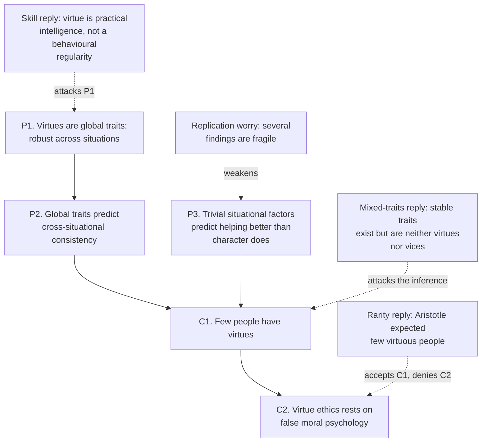

# Ethics · Lesson 4.3: Modern virtue ethics

> ⏱ ~15 min · Module 4: Virtue and natural law · Builds on: [4.2 Aristotle: virtue and practical wisdom](04-02-aristotle-virtue-and-practical-wisdom.md) · Unlocks: [4.4 Natural law I: Aquinas](04-04-natural-law-aquinas.md)

## Why this matters

For most of the twentieth century, English-language ethics was a two-party system: consequentialists against Kantians, both asking "which act is right?" Virtue ethics came back as a third party that asks a different first question — what kind of person to be — and it now has a serious share of professional allegiance. Reviving Aristotle in modern dress raised two hard questions its rivals do not face in the same form. Can an ethics of character tell you what to *do*? And do people have characters of the kind it needs? The second question is partly empirical, which makes it one of the few places where a psychology experiment is pressed as an objection to a moral theory.

## The idea

**The revival.** In "Modern Moral Philosophy" (1958), G. E. M. Anscombe argued, roughly, that the special moral "ought" — obligation with no further reason behind it — is a leftover from a *law conception of ethics*. It made sense when people believed in a divine legislator; with the lawgiver gone, the word keeps its force and loses its content. Her advice: set the notion aside and do moral philosophy from concepts that still have content, such as what a human being needs in order to flourish, until we have an adequate philosophy of psychology (action, intention, wanting). The paper also gave "consequentialism" its name. Philippa Foot (*Virtues and Vices*, 1978; *Natural Goodness*, 2001) and Rosalind Hursthouse took up the programme, and it is their neo-Aristotelian version you are testing here.

**The move.** Consequentialism starts from good *states of affairs* and defines right acts from them; Kantian ethics starts from a *principle* of the will. Virtue ethics starts from the good *agent*: right action is whatever that agent would do. It keeps Aristotle's structure from [4.1](04-01-aristotle-the-human-good.md) and [4.2](04-02-aristotle-virtue-and-practical-wisdom.md) — virtues are the traits a human being needs to live well, and *phronesis* (practical wisdom) reads the situation — and adds a criterion that answers the question the other theories answer.

**The worry.** That criterion outsources the verdict to a person. If you are not already that person, how do you consult her? And if almost nobody is, is she a fiction?

## The argument

**A. Hursthouse's account** (*On Virtue Ethics*, 1999, ch. 1, paraphrased).

1. **Criterion of right action.** An action is right if and only if it is what a virtuous agent would *characteristically* — that is, acting in character — do in the circumstances. *In words:* the right act is the one the good person would do, doing it as the good person she is.
2. **The virtuous agent.** A virtuous agent is one who has and exercises the virtues. *In words:* the standard is a person with a certain character, not a rule.
3. **The virtues.** A virtue is a character trait a human being needs in order to flourish (*eudaimonia*), or to live well. *In words:* what counts as a virtue is fixed by human nature and the good life, not by what we happen to praise.
4. **V-rules.** Every virtue yields a prescription and every vice a prohibition: do what is honest, charitable, just; do not do what is dishonest, callous, cruel. *In words:* the theory issues plenty of rules, but they are phrased in the vocabulary of character.

**B. The situationist argument** (after Harman, "Moral Philosophy Meets Social Psychology," 1999, and Doris, *Lack of Character*, 2002).

1. Virtues, as virtue ethics conceives them, are **global traits**: robust dispositions that produce the corresponding behaviour across a wide range of situations, including ones where the trait is under pressure. *In words:* a truly honest person is honest when it is costly, not only when it is convenient.
2. If many people had global traits, their behaviour would show **cross-situational consistency**. *In words:* knowing someone was helpful in one setting would predict fairly well whether they help in another.
3. Controlled studies find that **morally trivial features of the situation** — being in a hurry, finding a coin — predict helping far better than anything we would call character. *In words:* whether you stop for someone in distress seems to depend more on your schedule than on your compassion.
4. **Therefore** few people, perhaps none, have the virtues. *In words:* the virtuous agent in A.2 is not an ordinary type of human being but an idealization with few instances.
5. **So** an ethics that directs us to acquire and act from global traits is built on false moral psychology. *In words:* the theory's psychological assumptions fail the test Anscombe herself set.

Harman went further and doubted that ordinary character traits exist at all; Doris allows **local traits** — narrow dispositions such as "helpful when in a good mood and not rushed" — and denies only the global ones.

## Argument map

Solid arrows are the situationist inference. Dashed arrows are the four ways defenders push back; notice that they attack different boxes, so they can be combined. The rarity reply grants the empirical conclusion and denies that it hurts. Julia Annas (*Intelligent Virtue*, 2011) models virtue on a practical skill: a reasoning, learned capacity to see what a situation calls for, which a one-shot experiment measuring a single behaviour does not test. Christian Miller (*Character and Moral Psychology*, 2014, among other works) argues, roughly, that the evidence supports real, stable **mixed traits** — people reliably helpful under some conditions and reliably unhelpful under others — so character exists, but most of us have neither virtue nor vice. The empirical base itself should be held loosely: several mood-effect helping findings have proven fragile in later attempts to replicate, and many classic studies had small samples.

## Worked examples

**Example 1 (clean case — the criterion guiding).** A friend asks what you honestly think of the novel manuscript she has spent four years on. It is not good. Run the account. V-rules in play: *do what is honest* (so no flattering lie) and *do what is kind* (so no demolition, and attention to what she can use). A virtuous agent — honest, kind, practically wise — would characteristically tell the truth, choose what to say first, and point toward what could be saved. That is a determinate verdict, and notice that it came from the v-rules, not from imagining a saint. Hursthouse's reply to the **application objection** ("I'm not virtuous, so I can't tell what she'd do") runs exactly this way: the v-rules give a great deal of guidance; where they conflict, one can ask people one reasonably regards as better than oneself; and the rival theories face application problems of their own ("maximize happiness" and "act only on universalizable maxims" also need judgment to apply).

**Example 2 (hard case — the wrongdoer's circumstances).** Through carelessness you have promised your sister you will be at her wedding on Saturday and promised a colleague you will cover his shift that same Saturday. You cannot do both. What is right? The criterion asks what a virtuous agent would characteristically do *in these circumstances* — but a virtuous agent would never have made two incompatible promises. The circumstances are ones only a non-virtuous agent gets into, so the biconditional seems to have nothing to say, or to say that nothing you now do is right.

Hursthouse's response, roughly, is to separate two jobs. As **action guidance**, the theory still speaks: the v-rules (be just to both, be honest about the error, do not be callous) and the question of what a virtuous person would advise you to do now, point to a best course — keep one promise, release yourself from the other as honestly as possible, and make amends. As **action assessment**, that course is not a *right* action in the full sense — not a good deed that merits praise — because it is the best way out of a mess a virtuous agent would never have made. Defenders see an honest description of moral life; critics (a line pressed by Robert Johnson and others) reply that the criterion was offered as an account of right action for everyone, and a theory that goes silent, or goes grudging, precisely when real agents need it most has not given one. The same pressure comes from the person *trying* to become virtuous: an aspiring honest person might sensibly keep a record of her lies, which no virtuous agent would do.

**The circularity worry**, in brief: "right" is defined via the virtuous agent, but isn't the virtuous agent just the one who does right? Hursthouse's answer is that the chain does not loop — virtuous agent via the virtues, virtues via what is needed to flourish — just as a consequentialist's right act is specified via a theory of the good. The live question is whether "needed to flourish" can be filled in without already using moral judgments; that is the ground [4.4](04-04-natural-law-aquinas.md) and [4.5](04-05-the-new-natural-law-theory.md) fight over.

## Watch out

- **You might think virtue ethics issues no rules**, but the v-rules are rules, and quite action-guiding ones. What it denies is that a rule is the *ground* of rightness, or that the rules can be codified into a decision procedure — a claim it shares with the particularists of [5.3](05-03-pluralism-and-particularism.md).
- **You might think the criterion means "do what a nice person would do."** It says what a virtuous agent would do *acting in character*, and the virtues include practical wisdom and justice. Two kind people may disagree; the criterion is not a poll.
- **You might think situationism shows people are bad.** Its claim is about *consistency*, not average quality. The finding is that helping varies with trivial circumstances, which is compatible with plenty of helping.
- **You might think a failed replication refutes situationism.** P3 rests on a large literature, including Milgram's obedience studies, not one experiment; fragility in one strand weakens that premise without removing it. Equally, a single striking study never established it.

## One-liner

> Virtue ethics makes the good person the measure of the right act — which forces it to say how that measure guides the rest of us, and whether anyone meets it.

## Problems

**P1 (🟡) *(Exegetical (a) · Evaluative (b))*** (a) State Hursthouse's criterion of right action, and say in one sentence why the word *characteristically* is in it. (b) Build a counterexample of a *different* kind from Example 2's broken promises: a case where an agent who is not yet virtuous does something plainly right that no virtuous agent would characteristically do, because it only makes sense for someone who lacks the virtue. Then say whether the guidance/assessment distinction absorbs your case or not. Any verdict; 150 words or fewer for (b).

**P2 (🟡) *(Evaluative.)*** Here is a data summary from one classic study. In Darley and Batson's (1973) Good Samaritan study, roughly 40 seminary students were sent across campus to give a talk and passed a man slumped in a doorway; about 63 percent of those told they had time to spare offered help, against about 10 percent of those told they were already late. Steelman the situationist argument using this study, then give the single best reply a virtue ethicist can make. Graded on the strength of both, not on who wins. 150 words or fewer.

**P3 (🔴, optional) *(Exegetical.)*** The paragraph below is from an invented internal memo at a mid-sized firm. Name the one assumption about character that is doing the work in the argument, and say which lesson concept shows the inference is not safe as written. 100 words or fewer.

> "The fraud last quarter was committed by an employee whose references described him as 'scrupulously honest,' and who had returned a lost wallet with 300 dollars in it during his first month. Clearly our references and our observations measure nothing. From now on we will stop screening for integrity altogether and put the entire compliance budget into approval controls and audit software."

Solutions

**P1** *(Exegetical (a) · Evaluative (b))*

**Must hit, strict (a):** an action is right iff it is what a virtuous agent would characteristically (acting in character) do in the circumstances. *Characteristically* excludes the out-of-character act: a virtuous person who, exhausted or distracted, snaps at someone has not thereby made snapping right. The standard is what flows from her virtues, not whatever she happens to do.

**Must hit, any verdict (b):**
- A case where the act is plausibly right (or at least what the agent should do) **and** its point depends on the agent's lacking a virtue — so a virtuous agent would not do it.
- An explicit test against the criterion: which half of the biconditional fails.
- A verdict on whether guidance/assessment absorbs it, with a reason.

**Wrong turns:** a case where the agent merely does something a virtuous person *also* would do (no conflict); another two-promises case, which the problem excludes; saying "the virtuous agent would do the same in his shoes" without noticing that his shoes include the vice.

**Model answer (b), one of several:** A man with a violent temper feels rage rising in an argument with his teenage son and walks out of the house for twenty minutes. That seems exactly what he should do. A patient, practically wise father would never need to — he would stay and talk — so the criterion says walking out is not right. The guidance/assessment distinction partly absorbs this: as guidance, the v-rules (don't be cruel) recommend leaving. But the result is uncomfortable, since unlike the promise case the man has done nothing wrong to get here; he simply has an unfinished character, which describes nearly everyone. If the account calls his best available act "not right," its criterion covers only the few.

---

**P2** *(Evaluative — graded on the steelman and the reply, not the verdict.)*

**Must hit, any verdict:**
- **Steelman:** tie the data to P2–P3 — the manipulated variable was morally trivial (a schedule), the population was one we would expect to score high on compassion, and the effect was large; conclude to C1, not to "people are bad."
- **Reply:** one specific reply at full strength that attacks a named premise or the inference: rarity (grant C1, deny C2), skill (a single behaviour under time pressure does not measure a reasoning capacity; the hurried students may also have been weighing a duty to the people waiting), mixed traits, or the evidential base (small sample, single study, replication fragility in related literatures).
- Say which premise the reply targets.

**Wrong turns:** citing the study's small size as if it refuted situationism outright (P3 rests on a literature); a steelman that says the students were hypocrites (a verdict on persons, not the argument); two half-replies instead of one full one.

**Model answer, one of several:** Steelman: these were seminary students, many headed to talk about the Good Samaritan, and the one variable that moved helping sixfold was whether they were late. If compassion were a global trait, a schedule should not swamp it; so global compassion is rare, and an ethics that tells us to act from it assumes a psychology we lack. Reply (skill view, against P1): virtue is not a behavioural regularity but practical intelligence about what a situation calls for. A hurried student facing a man who might be drunk or ill, with an audience waiting, confronts a genuine competing obligation and a split-second perception. The study measured one behaviour under noise, not the capacity to deliberate, and says little about agents who have trained that capacity — which Aristotle never supposed most people had.

---

**P3** *(Exegetical — strict.)*

**Must hit, strict:** the assumption is that integrity, if real, is a **global trait** — so one lapse under pressure shows the screening measured nothing. The inference runs from a single cross-situational failure to "there is no trait to detect." Concepts that show it is unsafe: **local or mixed traits** (the man may reliably be honest in low-stakes, observed settings and not in high-stakes, private ones — a real, detectable, useful regularity); and the memo also runs from one case to a policy, where one data point cannot establish the base rate.

**Wrong turns:** agreeing or disagreeing with the budget decision (not asked); saying "this is situationism" without naming the global-trait assumption — situationism *denies* global traits, while the memo *assumes* integrity must be global and then abandons character entirely, an overreach Doris's own local-traits view does not make.

**Model answer:** The memo assumes honesty, if it exists, is a global trait, so one high-stakes failure proves the references measured nothing. But local or mixed traits are stable too: honesty over a returned wallet and fraud under private, high-stakes temptation fit one real pattern. One case cannot show the screen predicts nothing.

## Flashback

**From Lesson 3.2 (The doctrine of double effect):** A storm is swamping a lifeboat carrying eight people, which is towing a dinghy carrying two. Stipulate: if nothing is done, the lifeboat sinks and all ten die; if the tow line is cut, the lifeboat survives and the dinghy, adrift, is lost with both aboard. (a) List the conditions of the doctrine of double effect and run each on cutting the line. (b) Variant: there is no dinghy, and the officer saves the lifeboat by pushing two of its ten passengers overboard. Which condition does the variant fail? Name one *other* factor that also changed between the cases. Two sentences or fewer per condition in (a); 60 words for (b).

Solution

**Must hit, strict (a):** the four conditions and their application. (1) *The act itself is not wrong in kind:* cutting a rope is morally indifferent — pass. (2) *The bad effect is foreseen, not intended:* the officer aims at freeing the lifeboat; the deaths are foreseen — pass. (3) *The bad effect is not the means to the good:* the lifeboat is saved by losing the drag, not by the two dying; an empty dinghy cut loose would save it equally — pass. (4) *Proportionate reason:* eight saved against two lost, where all ten die otherwise — pass. Double effect permits cutting the line.

**Must hit, strict (b):** the variant fails condition (3), and with it (2): the lightening of the boat just *is* the removal of the two bodies, so their going overboard is the means, and on the standard reading it is intended. A second changed factor: in the original the officer withdraws aid he was providing (the tow), in the variant he initiates a new lethal threat against people already safe aboard, a doing/allowing difference ([3.1](03-01-doing-and-allowing.md)); physical force against the victims is another.

**Wrong turns:** failing case 1 on proportionality because two die (all ten die otherwise); saying the variant fails condition (1) because pushing is "killing" — that begs the question the other conditions exist to answer; offering "the numbers changed" as the second factor, when the ratio is identical.

**Model answer (b):** The variant fails the means condition: the boat is saved precisely by the two leaving it, so their deaths (or at least their removal) are the means. A second factor also moved — the officer now starts a new threat against people aboard rather than withdrawing aid he was giving — so the pair does not isolate intention.

## Connections

- **Backward:** [4.2](04-02-aristotle-virtue-and-practical-wisdom.md) supplied the parts Hursthouse assembles — virtue as a settled state, *phronesis*, and the gap between continence and virtue that the aspiring-honest-person and hot-tempered-father cases exploit. [4.1](04-01-aristotle-the-human-good.md) supplied flourishing, which the account uses to say what a virtue is. The situationist argument is an inference to the best explanation of behavioural data, assessed as in [`philosophical-method` 2.1](../../philosophical-method/lessons/02-01-inference-to-the-best-explanation.md), and P2 asks for the discipline of [4.2 there](../../philosophical-method/lessons/04-02-steelmanning-and-the-burden-of-proof.md).
- **Forward:** [4.4](04-04-natural-law-aquinas.md) grounds ethics in human nature too, but through practical reason grasping goods rather than through the virtuous agent; whether "what a human needs to flourish" can be known without prior moral judgments is the question [4.5](04-05-the-new-natural-law-theory.md) presses. The guidance objection returns against Ross and Dancy in [5.3](05-03-pluralism-and-particularism.md), and Anscombe's attack on a law-less "ought" resurfaces in [6.5](06-05-god-and-morality-the-euthyphro-dilemma.md).
- **Sideways:** [`moral-theology`](../../moral-theology/syllabus.md) takes the virtues into a theological setting, where infused virtues change the rarity question. [`epistemology`](../../epistemology/syllabus.md) runs a parallel programme, making the intellectually virtuous agent the measure of knowledge, and it inherits the same situationist challenge. The replication hedges here are a live case of the evidential caution taught in [`philosophical-method` 2.4](../../philosophical-method/lessons/02-04-weighing-evidence-in-odds-form.md).
