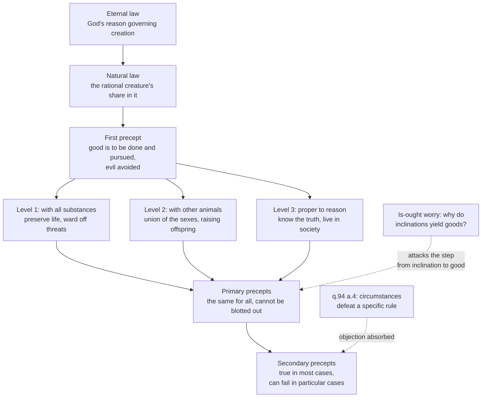

# Ethics · Lesson 4.4: Natural law I: Aquinas

> ⏱ ~15 min · Module 4: Virtue and natural law · Builds on: [4.1 Aristotle: the human good](04-01-aristotle-the-human-good.md), [4.2 Aristotle: virtue and practical wisdom](04-02-aristotle-virtue-and-practical-wisdom.md) · Unlocks: [4.5 Natural law II: the new natural law theory](04-05-the-new-natural-law-theory.md)

## Why this matters

Aristotle told you what a flourishing human life is. He never quite told you what you *must not do*, and he never built a theory of moral rules. Aquinas does both, in about three pages of the *Summa Theologiae*: one starting point for all practical thinking, a short list of basic human goods read off our nature, and a story about how specific rules follow from them and why the specific ones sometimes fail. That is still the most influential account of how "ought" might be anchored in what we are, and the theory every later natural lawyer, and every critic of "arguments from nature", starts from.

## The idea

Start with a claim about what practical reasoning *is*. Whenever you deliberate — whether to take the job, whether to call your brother — you are looking for something worth doing. You cannot deliberate toward what you see as pointless in every respect. So the most basic rule of action isn't a moral discovery at all; it is built into the activity, the way non-contradiction is built into thinking: *pursue good, avoid evil.* Aquinas calls this the first precept of natural law.

That rule is formal. It tells you to pursue good without saying what is good. Content comes from a second observation: we are the kind of creature that is drawn toward certain things. Like every existing thing, we tend to stay in existence. Like other animals, we mate and raise young. As rational animals, we want to understand, and we want to live with others. Reason, noticing these inclinations, grasps their objects — life, offspring, knowledge, society — as *goods*, and the first precept turns each into a directive: protect life, raise your children, seek the truth, don't wreck the common life you depend on.

Specific rules come from applying these general ones to circumstances. And here is the twist most people don't expect from a "natural law" theorist: the further down the ladder of specifics you go, the more exceptions appear. The top never changes; the bottom is where judgment lives.

## Source

Aquinas, *Summa Theologiae* I-II q.94 a.2 (English Dominican Province translation, public domain):

> Consequently the first principle of practical reason is one founded on the notion of good, viz. that "good is that which all things seek after." Hence this is the first precept of law, that "good is to be done and pursued, and evil is to be avoided." All other precepts of the natural law are based upon this: so that whatever the practical reason naturally apprehends as man's good (or evil) belongs to the precepts of the natural law as something to be done or avoided. Since, however, good has the nature of an end, and evil, the nature of a contrary, hence it is that all those things to which man has a natural inclination, are naturally apprehended by reason as being good, and consequently as objects of pursuit, and their contraries as evil, and objects of avoidance. Wherefore according to the order of natural inclinations, is the order of the precepts of the natural law.

Read the connectives. "Consequently … Hence … Since, however … Wherefore." The passage is an argument, and its key move is the sentence beginning "Since, however": inclinations are the route by which reason *apprehends* goods.

## The argument

**Where natural law sits (q.91).** Aquinas distinguishes kinds of law. *Eternal law* is God's reason governing the whole of creation. Every creature shares in it by having inclinations toward its own ends; a rational creature shares in it in a further way, by grasping those ends and directing itself. That rational share, "this participation of the eternal law in the rational creature" (q.91 a.2), is *natural law*. The theological frame explains what grounds the law; Aquinas nonetheless holds that its precepts are knowable by natural reason, without revelation. This course takes that epistemic claim as its subject.

**The derivation (q.94 a.1–a.2, a.4).**

1. **Practical reason has a first principle.** Just as "being" is the first thing the mind grasps, "good" is the first thing *practical* reason grasps, because every agent acts for an end under the aspect of good. *In words:* to deliberate at all is to aim at something seen as worth having.
2. **So the first precept is: good is to be done and pursued, evil avoided.** It is self-evident (*per se nota*): its truth is contained in its terms. *In words:* denying it would mean deliberating toward what you see as not worth doing, which isn't deliberating.
3. **We hold this through *synderesis*,** a natural habit of the mind that contains the first principles of action (I q.79 a.12; I-II q.94 a.1 ad 2). *In words:* we don't learn the first precept the way we learn a rule of the road; we have it as the starting point of any practical thought.
4. **Reason apprehends the objects of our natural inclinations as goods.** *In words:* what we are naturally drawn to shows up to reason as worth pursuing.
5. **There are three levels of inclination.** (i) Shared with all substances: preserving one's own being, hence "whatever is a means of preserving human life, and of warding off its obstacles". (ii) Shared with other animals: "sexual intercourse, education of offspring and so forth". (iii) Proper to rational nature: "to know the truth about God, and to live in society", hence "to shun ignorance, to avoid offending those among whom one has to live". *In words:* we are beings, animals and reasoners, and each layer of our nature marks out goods.
6. **So the order of precepts follows the order of inclinations.** *In words:* the general directives of morality are the first precept applied to each basic good.
7. **Secondary precepts are conclusions from the primary ones, applied to particular matter.** They hold "in the majority of cases" but can fail in a particular case (a.4). *In words:* the general rules never bend, but the specific rules drawn from them have exceptions, and more of them the more specific they get.

**Self-evident to whom?** Aquinas separates propositions self-evident *in themselves* (the predicate is contained in the notion of the subject) from those self-evident *to us* (we actually grasp the terms). Some truths are self-evident only to the wise, who understand the terms. So "self-evident" never meant "obvious to everyone."

## Argument map

Solid arrows run from ground to what it grounds. The dashed edges are pressure points: the first Aquinas builds into the theory; the second, whether facts about inclination can yield practical goods at all, is [4.5](04-05-the-new-natural-law-theory.md)'s question.

## Worked examples

**Example 1 (clean — the deposit and the sword).** Aquinas's own case in q.94 a.4. From the principle that it is right for all to act according to reason, it follows as a proper conclusion that *goods entrusted to you should be restored to their owner*. True for the majority of cases. But suppose the owner claims them in order to fight against his own country. Then restoring them would be injurious, and so unreasonable. The precept fails.

Look at *what* failed and *why*. The rule about deposits failed; the good behind it did not. On a natural reading, it failed because keeping it here would defeat the very reason it was a rule: acting reasonably toward others within a shared life. Aquinas generalizes: speculative reason deals with necessary things, so its conclusions hold as universally as its principles; practical reason deals with contingent things, so its conclusions hold less and less reliably "according as we descend further into detail." Natural law, on this account, is exceptionless at the top and defeasible at the bottom.

A second kind of failure is failure of *knowledge*. Reason can be perverted by passion, bad habit or bad disposition. Aquinas's example, taken from Julius Caesar, is that theft was once not considered wrong among the Germans. That is a failure to *know* a precept, not a case where it failed to apply. And q.94 a.6 draws the line: the primary precepts cannot be blotted out of human hearts in general, though passion can obscure them in a particular choice; secondary precepts can be erased more widely by vicious customs and corrupt habits.

**Example 2 (hard — when levels pull against each other).** A healthy 25-year-old volunteers for a human challenge trial: she will be deliberately infected with a disease so that a vaccine can be tested faster. The risk of death is small but real.

Run the theory. Level 1 says preserve life and ward off threats to it, and she is inviting a threat. Level 3 says seek knowledge and serve the society you live in, and the trial does both, for many people. The first precept tells her to pursue good, and there are genuine goods on both sides.

Here the theory runs out of derivation. Nothing in q.94 ranks the three levels by importance. The order is an order of *nature*, from what we share with stones to what is distinctively ours, and interpreters disagree about whether it implies any priority in action. The Thomistic resources that remain are two. First, a distinction from [3.2](03-02-the-doctrine-of-double-effect.md): she does not intend her own death, and accepts a risk to it as a side effect of a proportionate good. Second, *prudence*, Aristotle's [*phronesis*](04-02-aristotle-virtue-and-practical-wisdom.md), which Aquinas takes over: the virtue that judges how much risk is proportionate to how much good. Neither yields a number. At 1 in 10,000 most defenders of the view would likely call the choice permissible, and at 1 in 3 most would likely call it reckless. Between those, the verdict comes from judgment, not from the precepts. That is exactly where q.94 a.4 said the theory would stop determining an answer.

## Watch out

- **You might think natural law needs theism or revelation to get started.** Aquinas grounds it in eternal law, but his epistemic claim is that the precepts are known by natural reason. Critics and defenders alike can therefore test the account of practical reason without first settling whether God exists; that question belongs to `philosophy-of-religion`, and its bearing on grounding is [6.5](06-05-god-and-morality-the-euthyphro-dilemma.md)'s.
- **You might think "natural" means "what happens in nature" or "what is statistically normal."** An inclination matters because reason apprehends its object as *good*, not because a behaviour is common or biologically typical. "Animals do it" is not an argument this theory makes. Whether the theory can keep that distinction without circularity is the live dispute.
- **You might think the first precept is an empty tautology.** It is formal on purpose: it states what practical reasoning aims at, as non-contradiction states what theoretical reasoning must respect. The content comes from the inclinations. Critics who press emptiness are really pressing step 4, not step 2.
- **You might think a natural lawyer must hold every moral rule exceptionless.** q.94 a.4 says the reverse about secondary precepts. Some specific norms Aquinas does treat as holding without exception (on the killing of the innocent, see II-II q.64 a.6), but those claims rest on further argument, not on the structure of q.94 alone.

## One-liner

> Practical reason starts from "pursue good," learns *which* goods from the inclinations of a being, an animal and a reasoner, and grows less certain the further it descends into particulars.

## Problems

**P1 (🟢) *(Exegetical.)*** For each precept, name the level of natural inclination in q.94 a.2 that most directly grounds it, and the word or phrase in Aquinas's list that licenses your answer. One line each.

> (i) Do not stop giving food and water to someone who can still take them.
> (ii) Do not spread false rumours about your neighbours.
> (iii) Parents must see that their children are brought up and provided for until they can fend for themselves.
> (iv) Do not suppress evidence that contradicts your own research findings.

**P2 (🟡) *(Exegetical (a) · Evaluative (b).)*** A doctor holds the precept *keep the confidences patients entrust to you.* A patient tells her that he drives a school bus and is concealing seizures that his medication no longer controls. (a) Derive the confidentiality precept from a level of inclination through one stated intermediate premise, and say which part of q.94 a.4 explains why the precept might fail here, and why that failure leaves the primary precept untouched. (b) A critic says: "If secondary precepts give way whenever circumstances defeat their point, natural law is just case-by-case judgment in Latin." Does the natural lawyer have a principled way to fix the exception, or not? 150 words or fewer for (b).

**P3 (🔴, optional) *(Exegetical.)*** A town is on the edge of a riot that will kill several people unless an official frames and executes one innocent man, which will calm it. An act utilitarian ([1.1](01-01-classical-utilitarianism.md)) says he may be required to; Aquinas, who holds that it is in no way lawful to kill the innocent (II-II q.64 a.6), says he may not. Both sides count the same deaths as bad. Name the single premise one side affirms and the other denies, and say what argument would move a defender of either side. 150 words or fewer.

Solutions

**P1** *(Exegetical — strict.)*

**Must hit, strict:**
- (i) **Level 1**, shared with all substances: "whatever is a means of preserving human life, and of warding off its obstacles."
- (ii) **Level 3**, proper to reason: "to live in society", specifically "to avoid offending those among whom one has to live."
- (iii) **Level 2**, shared with other animals: "education of offspring." (*Education* here is the Latin *educatio*, the rearing of the young, not schooling.)
- (iv) **Level 3**: "to know the truth" and "to shun ignorance." Citing "live in society" as well (the research community depends on honest reports) earns credit as a second ground, not as a replacement for truth.

**Wrong turns:** putting (iii) at level 3 because "raising children involves reason" — Aquinas's own list places offspring at the animal level, even though humans pursue that good rationally; putting (i) at level 2 because eating is animal — the ground cited is self-preservation, which Aquinas assigns to what we share with all substances.

**Model answer:** (i) Level 1, "preserving human life." (ii) Level 3, "avoid offending those among whom one has to live." (iii) Level 2, "education of offspring." (iv) Level 3, "to know the truth … to shun ignorance."

---

**P2** *(Exegetical (a) · Evaluative (b).)*

**Must hit, strict (a):**
- A derivation: level 3 (live in society) plus an intermediate premise such as *the sick can only be treated if they can speak freely, and they will only speak freely if what they say is kept in confidence*, so confidences should be kept. (A route through level 1, the patient's own life and health, is also acceptable if the intermediate premise is stated.)
- The relevant part of a.4: secondary precepts hold "in the majority of cases" but can fail in a particular case where keeping them would be injurious and so unreasonable, as with the deposit reclaimed to fight one's country; practical conclusions fail more as one descends into detail.
- Why the primary precept survives: what fails is a *conclusion* applied to contingent matter. The goods behind it (life, living together) are exactly what require the exception, since children's lives are at risk. a.6: primary precepts are not blotted out.

**Must hit, any verdict (b):**
- State the critic's charge precisely: that exceptions are fixed by nothing but intuition.
- Name the natural lawyer's candidate constraint: an exception is licensed only when keeping the rule defeats the good that grounds it, and it never licenses acting directly against a basic good. Then test it: does it really rule anything out, or can any exception be described as serving some good?
- A verdict either way, with the step that decides it.

**Wrong turns:** treating the case as one where the *primary* precept admits an exception; answering (b) by listing more examples of exceptions, which is the critic's point, not a reply.

**Model answer (b), one of several acceptable:** The natural lawyer's constraint is that a secondary precept gives way only where following it would defeat the good it exists to serve. Confidentiality protects the sick and the trust a shared life depends on. Staying silent here exposes children to mortal danger, which works against the same goods. That is a real constraint: it would not let a doctor disclose a secret for money or convenience, since neither serves a good the precept protects. But the critic has a point about degree. "Defeats its point" still needs a judgment of how grave and how likely the harm is, and nothing in q.94 supplies a threshold. Verdict: the view is principled about *which* exceptions are possible and relies on prudence for *when* one applies. Whether that is a weakness depends on whether any rival theory does better without judgment.

---

**P3** *(Exegetical — strict on identifying a single premise; any defensible statement of it passes.)*

**Must hit, strict:**
- The crux: *whether the rightness of an act is fixed entirely by the overall goodness of its outcomes, so that harm to one person can be outweighed by summed benefits to others.* The act utilitarian affirms it; Aquinas denies it, holding that some choices are wrong because of what is chosen (intentionally killing an innocent person, acting directly against the good of life), whatever follows.
- The disagreement is *not* about which outcomes are bad: both sides grant that the deaths are bad, as the problem says.
- What would move a defender: for the utilitarian, cases where summing seems to erase the separateness of persons ([1.3](01-03-justice-and-the-separateness-of-persons.md)); for the natural lawyer, cases where refusing seems to be keeping one's hands clean at others' cost ([1.4](01-04-integrity-and-demandingness.md)), or an argument that the doing/intending distinctions of Module 3 do not survive testing.

**Wrong turns:** naming "whether killing is bad" (both agree); naming God's existence as the crux (Aquinas's claim about the innocent is argued from practical reason, and a secular natural lawyer holds it too); naming two premises.

**Model answer:** The premise in dispute is that the right act is the one that produces the best total outcome, so one person's death can be outweighed by several others' lives. The utilitarian affirms it. Aquinas denies it: intentionally killing an innocent is an act against the good of human life as such, and is excluded by what is chosen, not by how the totals come out. A utilitarian might be moved by cases like this one being multiplied, where aggregation seems to treat persons as interchangeable containers of value. A natural lawyer might be moved by a strong argument that intending versus foreseeing a death makes no moral difference, since the absolute prohibition leans on that distinction.

## Flashback

**From Lesson 3.3 (Testing the principles on trolleys):** A runaway barge will crush five kayakers at a weir. You can open a lock gate that sends it into a side cut, where a maintenance worker is moored.

> **Cut A.** The side cut is a dead end. The barge will hit the worker's pontoon and kill him, then run aground.
> **Cut B.** The side cut loops back into the main canal above the weir. The collision with the worker's pontoon kills him and is the only thing that stops the barge; with the cut empty, the barge would come round and kill the five.

(a) What single factor separates A from B? (b) What does the *means principle* (it is wrong to harm someone as a means to an end) say about each, and what does a principle that only distinguishes redirecting an existing threat from introducing a new one say? (c) State the view that intention bears on whether the agent is to *blame*, not on whether the act is *permissible*, and say what it implies about someone who opens the gate in Cut B hoping the worker is hit. Three sentences or fewer per part.

Solution

**Must hit, strict (a):** only whether the worker's being hit is *needed* to save the five. In both you redirect an existing threat; in B, and only in B, his collision is what stops the barge.

**Must hit, strict (b):** the means principle permits A (his death is a side effect; an empty cut works just as well) and forbids B (the harm to him is how the five are saved). The redirection principle treats A and B alike and permits both, since in both you redirect a threat already in motion. So B is where the two principles come apart.

**Must hit (c):** the view, associated with Thomson and Scanlon, separates the permissibility of an act from what the agent's intention reveals about him. It implies that, if opening the gate in B is permissible on other grounds, hoping the worker is hit does not make it impermissible. It makes the agent blameworthy, or shows bad character, for acting on that intention.

**Wrong turns:** saying A and B differ in the number of deaths (they do not); saying the means principle forbids A because the worker dies (a foreseen side effect is not a means); in (c), concluding that the malicious agent does nothing wrong in any sense — the view relocates the fault to blame, it does not erase it.

**Model answer:** (a) Whether the worker's death is causally needed to stop the barge. (b) Means principle: A permissible, B forbidden, because in B he is used to stop the barge. Redirection principle: both permissible, as both redirect an existing threat. (c) On the Thomson–Scanlon view, whether an act is permissible does not depend on the agent's intention. If opening the gate in B is permissible, it stays so, but the agent who hopes for the worker's death is blameworthy for it.

## Connections

- **Backward:** [4.1](04-01-aristotle-the-human-good.md)'s function argument said the human good is fixed by what a human being is; Aquinas keeps that idea and turns it into law, with the inclinations playing the role of the *ergon*. The judgment that applies secondary precepts is [4.2](04-02-aristotle-virtue-and-practical-wisdom.md)'s *phronesis*, renamed *prudentia*. Double effect ([3.2](03-02-the-doctrine-of-double-effect.md)) is Aquinas's too, and Example 2 needed it. The metaphysics of ends and tendencies behind "inclination" is in [`metaphysics` 2.2](../../metaphysics/lessons/02-02-change-act-and-potency.md).
- **Forward:** [4.5](04-05-the-new-natural-law-theory.md) takes the dashed edge in the argument map head on: Grisez and Finnis read the basic goods as self-evident practical starting points *not* derived from facts about inclination, and neo-Thomist critics reply that this cuts natural law off from nature. [6.1](06-01-moral-realism.md) sets that against Hume's is–ought passage, and [6.5](06-05-god-and-morality-the-euthyphro-dilemma.md) uses the eternal-law frame as a reply to the Euthyphro dilemma.
- **Sideways:** this lesson is natural law *as philosophy*. [`moral-theology`](../../moral-theology/syllabus.md) takes it up in light of revelation, with conscience; [`philosophy-of-law`](../../philosophy-of-law/syllabus.md) owns what q.95 does with it (human law as conclusion from and specification of natural law); [`thomistic-synthesis`](../../thomistic-synthesis/syllabus.md) places it in Aquinas's whole system. And q.94 a.2 is itself one article of a disputed question, read the way [`philosophical-method` 4.4](../../philosophical-method/lessons/04-04-arguing-within-a-tradition-the-disputed-question.md) teaches.
