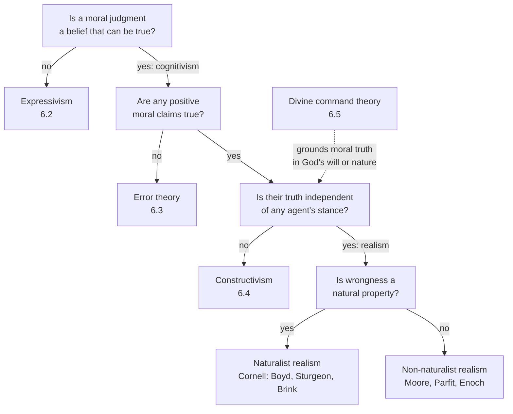

# Ethics · Lesson 6.1: Moral realism

> ⏱ ~15 min · Module 6: Metaethics · Builds on: [4.5 Natural law II: the new natural law theory](04-05-the-new-natural-law-theory.md) · Unlocks: [6.2 Expressivism](06-02-expressivism.md)

## Why this matters

Five modules argued about *which* acts are wrong. Every one of those arguments assumed that "gratuitous cruelty is wrong" is the kind of thing that can be true, and that the case method was tracking something. Metaethics asks whether that assumption holds. The realist says yes: there are moral facts, and they do not depend on what anyone thinks, wants or agrees to. That is the view most people start with and, in the 2020 PhilPapers survey, the view roughly three in five professional philosophers reported accepting. It also faces two questions it cannot dodge. What *kind* of fact is a moral fact? And if moral facts explain nothing we observe, what entitles us to believe in them?

## The idea

Realism is three claims stacked:

1. **Cognitivism.** A moral judgment is a belief, apt to be true or false, not an expression of an attitude.
2. **Success.** Some of those beliefs are true.
3. **Stance-independence.** What makes them true does not depend on the attitudes of any judge, culture or idealized chooser.

Deny (1) and you are an expressivist ([6.2](06-02-expressivism.md)). Deny (2) and you are an error theorist ([6.3](06-03-error-theory.md)). Deny (3) and you are a constructivist ([6.4](06-04-constructivism-and-debunking.md)).

Accept all three and a fourth question splits realists in two: **is wrongness a natural property**, the kind of thing the sciences could in principle study, like mass or being a predator? **Naturalists** say yes. **Non-naturalists** say no: it is a property of its own kind, real but not natural.

You met the ancestor of this split in [4.5](04-05-the-new-natural-law-theory.md). Hume's is–ought passage demanded a reason for sliding from what *is* to what *ought* to be, and read closely it issued a challenge, not a proof. Moore turned that challenge from a point about *inference* into a point about *meaning*. His claim was not that you cannot deduce "good" from natural premises. It was that "good" does not *mean* any natural property at all.

## The argument

**Moore's open question argument** (*Principia Ethica*, 1903, §13).

1. **Suppose "good" means some natural property N**, say *pleasant*, or *what we desire to desire*. *In words:* take any proposed definition of goodness in natural terms.
2. **If it did, "Is what is N good?" would be a closed question** for anyone who understands the words, as "Is a vixen a female fox?" is closed. *In words:* a correct definition leaves nothing to wonder about.
3. **But for every N, the question is open.** Moore's test: "whatever definition be offered, it may be always asked, with significance, of the complex so defined, whether it is itself good." *In words:* competent speakers can sensibly ask "This is pleasant, but is it good?"
4. **So "good" does not mean N**, for any natural N. *In words:* no natural definition survives the test.
5. **So goodness is a simple, indefinable, non-natural property.** Moore calls the attempt to identify it with a natural property the **naturalistic fallacy**. *In words:* goodness is real, but it is not one of the things science studies.

**Two standard replies, aimed at step 2 and step 4.**

- **The paradox of analysis.** A *trivial* analysis is closed; an *informative* one feels open. Any analysis worth having tells competent speakers something they did not know they knew, so the openness in step 3 may show only that the analysis is not obvious. *In words:* step 2 proves too much.
- **Synthetic identity.** "Water" does not *mean* H₂O. "Is water H₂O?" was an open question for centuries, and water is H₂O. The identity was discovered, not read off the concept. *In words:* step 4 shows at most that "good" and "N" differ in meaning, not that goodness and N are different properties.

The second reply founds **Cornell realism** (Richard Boyd, Nicholas Sturgeon, David Brink, *Moral Realism and the Foundations of Ethics*, 1989). Moral properties are natural properties, most likely complex clusters of the features that make human lives go well or badly. The identities are *synthetic a posteriori*, discovered by the same reflective equilibrium between theory and case that science uses for its kinds.

**Harman's explanation challenge** (*The Nature of Morality*, 1977, ch. 1). This argument presses on realists of both kinds.

1. **We are entitled to believe in a fact only if it figures in the best explanation of our observations.** *In words:* the physicist believes in the proton because the proton explains the vapour trail in the cloud chamber.
2. **Seeing young hoodlums set fire to a cat, you judge at once that what they do is wrong.** *In words:* moral judgments can be as quick as perceptions.
3. **The best explanation of your judgment cites your upbringing and psychology, not a fact of wrongness.** *In words:* you would have judged the same whether or not the act was really wrong, as long as your moral sensibility was the same.
4. **So we have no observational warrant for believing in moral facts.** *In words:* the proton earns its place in our theory of the world; wrongness, on this argument, does not.

## Map of positions

Divine command theory hangs off the stance question because it can be built either way. Truth fixed by God's commands looks stance-dependent. Adams's version grounds the good in God's *nature* and only obligation in God's commands, which looks more like a theistic realism about the good. [6.5](06-05-god-and-morality-the-euthyphro-dilemma.md) takes that apart.

## Worked examples

**Example 1 (clean case: the hedonist's definition).** A classical utilitarian in the spirit of [1.1](01-01-classical-utilitarianism.md) proposes: *"good" means "pleasant"*.

Run the test. "The crowd at the public execution took great pleasure in it. Was their pleasure good?" A competent speaker can ask that sincerely. Someone who asks it is not confused about the word, the way someone who asks whether a vixen is female is confused. So by steps 2–4, "good" does not mean "pleasant."

What this does and does not hit. It refutes hedonism as a *thesis about meaning*. Bentham and Mill's defender can reply that hedonism was never a definition. It was a substantive claim that pleasure is the one thing that *is* good, just as "water is H₂O" is a substantive claim. The open question argument is silent on that. Notice that Moore himself treated that substantive question as meaningful, and argued against it separately.

**Example 2 (hard case: the cat, the tyrant, and the deliberator).** Now Harman's challenge, which does not care whether you define "good."

*The Cornell reply* (Sturgeon, "Moral Explanations," 1985). Moral facts do figure in good explanations. One of Sturgeon's illustrations, roughly, is that Hitler's moral depravity helps explain why he did what he did. If you strip the depravity out and keep "just his psychology," you lose an explanation historians actually use. And if wrongness *is* a natural property, a cluster of cruelty-involving features, then of course it explains: the hoodlums' cruelty explains the cat's suffering and your reaction. The Harman-style rejoinder is that the explanatory work is all done by the natural features under their natural descriptions. The dispute then becomes whether "depravity" adds anything to "a settled disposition to cause suffering."

*Where Cornell realism strains.* Horgan and Timmons's **moral twin earth** thought experiment (early 1990s). Imagine people whose word "wrong" is causally regulated by a different natural property from ours, say a consequentialist property instead of a deontological one. If "wrong" works like "water," they mean something different and do not really disagree with us. Most readers judge that they *do* disagree. If that judgment holds, moral terms do not refer the way natural-kind terms do.

*The non-naturalist reply* (Parfit, *On What Matters*, 2011; Enoch, *Taking Morality Seriously*, 2011). Grant that normative facts do not explain observations, and deny step 1 instead. Explanatory indispensability is one way to earn belief; Enoch argues **deliberative indispensability** is another. When you decide what to do, you cannot proceed without treating some answers as correct and others as mistaken. That commitment is as unavoidable for a deliberator as the proton is for a physicist. So it is warranted on the same kind of ground. The critic's comeback: indispensability to a *project* shows the project needs the belief, not that the belief is true.

## Watch out

- **You might think the naturalistic fallacy is the is–ought gap, but** they differ. Hume's passage in [4.5](04-05-the-new-natural-law-theory.md) is about *inference* from *is* to *ought*. Moore's fallacy is about *defining* "good" as a natural property, and it applies even to a definition in *supernatural* terms, such as "what God commands." A naturalist can accept Hume's gap and still be a naturalist.
- **You might think the open question argument refutes naturalism, but** by itself it refutes only *analytic* naturalism. Cornell realism never claimed that "good" means N, so the argument does not reach it.
- **You might think realism requires moral perception or a special faculty, but** Cornell realists use ordinary theory-building, and non-naturalists like Parfit compare moral knowledge to knowledge of mathematics and logic, which no one claims we see.
- **You might think Harman argues that nothing is wrong, but** his conclusion is epistemic: *observation* gives no warrant for moral facts. Whether some other warrant exists is left open, which is exactly where Enoch comes in.

## One-liner

> Realists agree moral claims are stance-independently true; the open question argument and Harman's explanation challenge force them to say whether moral facts are natural (and so must explain) or non-natural (and so must be earned some other way).

## Problems

**P1 (🟢) *(Exegetical (a) · Evaluative (b))*** Moore's own target in §13 is the definition *"good" means "what we desire to desire."* (a) Reconstruct the open question argument against *this* definition in numbered premises and a conclusion (P1… ∴ C), with the test question written out. (b) Flag the weakest premise and say in one or two sentences why it is the weakest. Any choice of premise passes if the reason is precise. 150 words or fewer in total.

**P2 (🟡) *(Evaluative.)*** Build a counterexample to the open question test using a **non-moral conceptual analysis** that is widely accepted as correct but for which "Is X really Y?" remains a significant question for a competent user of the concept. (a) State the analysis and the open question. (b) Say which premise of Moore's argument your case attacks, and why your case is *not* just another "water is H₂O." (c) Give Moore's best reply to your case. Any verdict on whether the reply succeeds. 150 words or fewer.

**P3 (🔴, optional) *(Exegetical.)*** A Cornell realist and a non-naturalist agree that "gratuitous cruelty is wrong" is stance-independently true. (a) Name the single premise one asserts and the other denies. (b) Say what each must do with Harman's explanation challenge given that premise. (c) Name one argument or piece of evidence that would move one side, and say which side. 150 words or fewer in total.

Solutions

**P1** *(Exegetical (a) · Evaluative (b))*

**Must hit, strict (a):**
- A premise supposing that "good" *means* "what we desire to desire."
- The closedness premise: if so, "Is what we desire to desire good?" would be as trivial as "Is what we desire to desire what we desire to desire?"
- The openness premise, with the test question written out: a competent speaker can significantly ask whether it is good to desire to desire A.
- The conclusion that "good" does not mean "what we desire to desire." A strong answer notes that Moore generalizes by claiming the same happens for *every* candidate, and that this generalization is an induction over cases.

**Must hit, any verdict (b):** a named premise and a precise reason. The standard choices: **P2** (closedness), because informative analyses feel open (the paradox of analysis). Or the **move from meaning to property**, because distinct meanings can pick out one property (synthetic identity). Or the **generalization to all N**, because it is an induction from failed cases, not a proof.

**Wrong turns:** writing the conclusion as "goodness is non-natural," which needs a further step; attacking the openness premise by insisting that the question *feels* closed to you, without saying why a competent speaker must find it closed.

**Model answer:** P1. Suppose "good" means "what we desire to desire." P2. Then "Is what we desire to desire good?" would be closed for any competent speaker. P3. It is not closed: one can significantly ask whether it is good to desire to desire A. ∴ C. "Good" does not mean "what we desire to desire." Weakest: P2. A correct but non-obvious analysis can leave a competent speaker able to ask whether it is right, so openness may measure unobviousness, not falsity.

---

**P2** *(Evaluative — graded on construction, not on the verdict.)*

**Must hit, any verdict:**
- (a) A genuine *analysis*: a claim about what a concept amounts to, arrived at by reflection, not empirical discovery. Plus the open question, written out.
- (b) The premise named: the closedness premise (a correct analysis yields a closed question). The distinction from water/H₂O drawn: that is a *synthetic a posteriori* identity found by chemistry; your case is supposed to be correct *a priori* and still open. So it hits the argument even for analytic definitions.
- (c) A real Moorean reply: e.g. the question is open only for someone who has not fully grasped the concept, so not a *fully* competent user; or the analysis is a *stipulated replacement* (an explication), not an analysis of the old concept.

**Wrong turns:** using a natural-kind identity (water, gold, heat) and calling it an analysis; using an analysis that has well-known counterexamples, such as knowledge as justified true belief, since then the question is open because the analysis is *false*, which helps Moore.

**Model answer (one of several acceptable):** (a) $f$ is continuous at $a$ iff for every $\varepsilon > 0$ there is $\delta > 0$ with $|f(x) - f(a)| < \varepsilon$ whenever $|x - a| < \delta$. A calculus student who uses "continuous" competently ("no breaks") can significantly ask: "Is ε–δ continuity really continuity?" (b) It attacks the closedness premise. Unlike water, this was established by mathematical reflection, not experiment, so the gap is not between meaning and discovered property. (c) Moore: ε–δ is a precise successor concept replacing "no breaks," so the openness shows the two concepts differ. The reply is costly if the analysis is treated as capturing what mathematicians meant all along.

---

**P3** *(Exegetical — strict.)*

**Must hit, strict (a):** the disputed premise: *moral properties are identical to (or constituted by) natural properties.* The Cornell realist asserts it; the non-naturalist denies it. A strong answer adds that both accept cognitivism, success and stance-independence.

**Must hit, strict (b):** the Cornell realist must *meet* the challenge. Being natural, moral facts must earn a place in good explanations (Sturgeon's strategy). The non-naturalist must *reject* the challenge's first premise, that only explanatorily indispensable facts are warranted, and supply another warrant (Enoch's deliberative indispensability, or Parfit's comparison with mathematics).

**Must hit (c):** a real mover, side named. E.g. a persuasive case that moral terms fail to behave like natural-kind terms (moral twin earth) moves the Cornell realist; a demonstration that apparent moral explanations lose nothing when rewritten in purely natural vocabulary pressures the Cornell realist too; a convincing argument that deliberative indispensability warrants only commitment, not truth, moves the non-naturalist.

**Wrong turns:** naming stance-independence as the crux, which both accept; saying the non-naturalist "doesn't believe in explanation," when the claim is only that explanation is not the sole ground of warranted belief.

**Model answer:** (a) Whether wrongness is a natural property. Cornell says yes, the non-naturalist no, and both are realists. (b) Cornell must show moral facts do explanatory work, e.g. depravity explaining conduct. The non-naturalist grants they explain nothing observed and denies that explanation is the only warrant, offering deliberative indispensability instead. (c) Moral twin earth, if the disagreement verdict holds, moves the Cornell realist. A good argument that indispensability to deliberation shows only that we must *act as if* there are normative facts moves the non-naturalist.

## Flashback

**From Lesson 4.5 (Natural law II: the new natural law theory):** A town receives a bequest that can fund exactly one project: a clinic that will prevent some deaths each year, or the restoration of a fresco cycle that will otherwise be lost. A critic writes: "New natural law says life and aesthetic experience are incommensurable basic goods. So it must say the council has no reason to prefer the clinic. That is absurd." (a) State what the incommensurability thesis claims and what it does not claim. Name two resources NNL can use to guide this choice without a common metric. (b) Does the critic's objection still land after that reply? Any verdict. 150 words or fewer in total.

Solution

**Must hit, strict (a):** incommensurability denies a *pre-moral* common measure. No quantity of aesthetic experience converts into a quantity of life, so "maximize total good" gives no answer. It does *not* deny that one option can be rationally or morally preferable. Resources: Finnis's requirements of practical reasonableness, especially no arbitrary preference among *persons* (the Golden Rule and fairness: how would each councillor judge the choice if they were among those at risk?); the council's commitments and role (a public body's duties to its residents); and the plan of the community. Any two, stated accurately.

**Must hit, any verdict (b):** a judgment with a reason. It should say whether the ranking these resources give is principled or just the metric smuggled back in, and whether it reaches the intuitive verdict in *every* version of the case (for example if the clinic would save one life per decade).

**Wrong turns:** saying NNL ranks life above aesthetic experience in a hierarchy (that is the Thomistic naturalist column of 4.5's map); saying incommensurability means "equally valuable," which is itself a comparison.

**Model answer:** (a) Incommensurability says no common scale converts fresco-value into lives. It does not say every option is equally reasonable. NNL can appeal to fairness: would each councillor accept the choice if they were among the residents at risk? It can also appeal to the council's role-commitment to residents' welfare. (b) The reply mostly lands. The worry that remains is that as the lives saved shrink toward one per decade, fairness alone gives no clear threshold, and the critic may say that NNL then needs the weighing it forswore.

## Connections

- **Backward:** [4.5](04-05-the-new-natural-law-theory.md) read Hume's is–ought passage as a demand for explanation. Moore sharpens it into a claim about meaning, and NNL's self-evident basic goods are one answer to how non-derived moral knowledge could work. [1.1](01-01-classical-utilitarianism.md) already met Moore attacking Mill's "desirable." [philosophical-method 3.1](../../philosophical-method/lessons/03-01-conceptual-analysis.md) is the method the open question argument tests. Harman's challenge is [philosophical-method 2.1](../../philosophical-method/lessons/02-01-inference-to-the-best-explanation.md)'s inference to the best explanation turned into a criterion of existence.
- **Forward:** [6.2](06-02-expressivism.md) takes the open question as evidence that "good" does not describe at all but expresses an attitude. [6.3](06-03-error-theory.md) agrees with the non-naturalist about what morality *claims* and argues that no such facts exist. [6.4](06-04-constructivism-and-debunking.md) sharpens Harman into the Darwinian dilemma. [6.6](06-06-moral-knowledge-and-disagreement.md) asks how a realist could know anything, whichever kind they are.
- **Sideways:** synthetic identity and natural kinds belong to [`metaphysics`](../../metaphysics/syllabus.md) and philosophy of language. Parfit's comparison of normative truths with mathematical ones is the same problem as the epistemology of mathematics in [`epistemology`](../../epistemology/syllabus.md). The Cornell realist's reflective equilibrium is [philosophical-method 3.4](../../philosophical-method/lessons/03-04-intuitions-and-reflective-equilibrium.md) given a metaphysical job.
