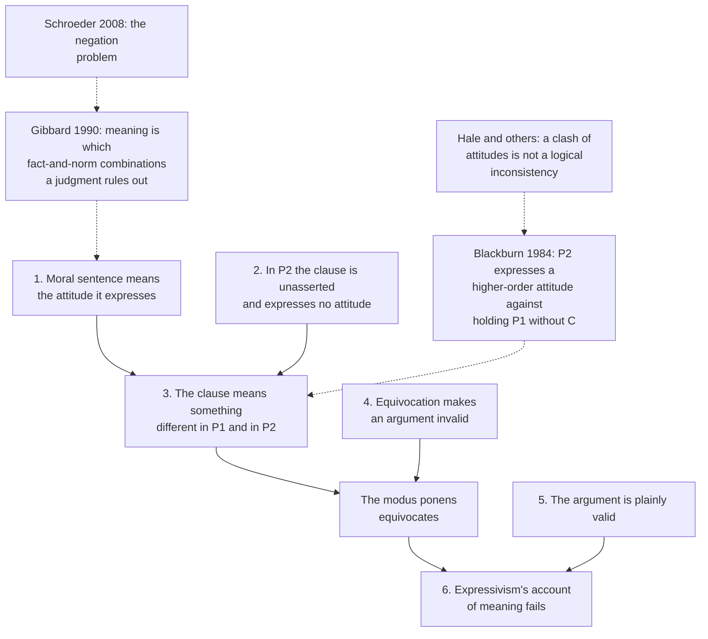

# Ethics · Lesson 6.2: Expressivism

> ⏱ ~15 min · Module 6: Metaethics · Builds on: [6.1 Moral realism](06-01-moral-realism.md), [philosophical-method 1.4 Argument forms and formal fallacies](../../philosophical-method/lessons/01-04-argument-forms-and-formal-fallacies.md) · Unlocks: [6.3 Error theory](06-03-error-theory.md)

## Why this matters

[6.1](06-01-moral-realism.md) left the realist owing an account of what moral facts are and how they could explain anything. Expressivism declines the debt. When you call lying wrong, it says, you are not describing a fact at all, natural or non-natural; you are taking a stand against lying. That dissolves the metaphysical puzzle and explains why moral judgment moves people to act. The price is paid in logic: moral sentences figure in valid arguments exactly as factual ones do, and a theory on which they describe nothing has to explain how.

## The idea

Language does more than one job. "The door is open" describes the world and is true or false. "Shut the door!" and "Hooray for the home team!" describe nothing; they direct and they cheer. Expressivism says moral language belongs, at root, in the second family. "Lying is wrong" sounds like "lying is common," but its function is closer to "Boo to lying!"

Three observations make this attractive. First, **motivation**: someone who sincerely judges that she ought to return a lost wallet is, normally, at least somewhat moved to return it, whereas believing the wallet is brown moves no one. Second, **disagreement that survives agreement on the facts**: two people can agree on every detail of how a factory farm works and still disagree about whether it is wrong. Third, the **open question** Moore pressed ([6.1](06-01-moral-realism.md)): for any natural property, it seems to remain an open question whether things having it are good. The realist reads that as evidence of a non-natural property; the expressivist reads it as evidence that "good" was never a describing word.

One distinction first. Expressivism is **not** the view that "lying is wrong" *reports* that the speaker disapproves. That view, speaker subjectivism, makes moral claims true descriptions of the speaker's psychology. Expressivism says the sentence *expresses* the attitude, as "ouch" expresses pain without saying "I am in pain."

The view has grown in three stages:

- **Emotivism.** A. J. Ayer, *Language, Truth and Logic* (1936), ch. 6: saying "you acted wrongly in stealing that money" adds no factual content to "you stole that money." It is as if you had said the latter in a "peculiar tone of horror." Moral sentences are neither true nor false. C. L. Stevenson, *Ethics and Language* (1944), added a second function: moral language also aims to *influence*, so "this is good" works roughly like "I approve of this; do so as well."
- **Norm-expressivism.** Allan Gibbard, *Wise Choices, Apt Feelings* (1990): to judge an act wrong is to accept norms on which it makes sense for the agent to feel guilty for doing it and for others to feel resentment toward him.
- **Quasi-realism.** Simon Blackburn (*Spreading the Mind*, 1984; *Ruling Passions*, 1998) aims to *earn* the realist-sounding talk without the realist metaphysics. Take truth minimally: to say "it is true that lying is wrong" says nothing more than "lying is wrong." Then the expressivist can say moral claims are true, that some people have false moral beliefs, even that there are moral facts, all as moves made from within a moral outlook.

## The argument

**A. The case for expressivism** (the motivation argument, in the form most expressivists accept).

1. **Sincerely judging that you ought to do something is necessarily connected to being motivated to do it.** *In words:* moral judgment is practical; the connection is not a lucky extra.
2. **A belief about how things are motivates only with the help of a separate desire.** *In words:* the Humean picture: facts alone never move you; wanting does.
3. **So a moral judgment is not simply a belief; it is, or includes, a desire-like attitude.** *In words:* the state that moves you is in the judgment itself.
4. **The meaning of a sentence is fixed by the mental state it conventionally expresses.** *In words:* to know what a sentence means is to know what state of mind someone sincerely uttering it is in.
5. **Conclusion: "lying is wrong" means what it does by expressing an attitude against lying, not by describing a fact about lying.**

Realists deny premise 1 (externalism: a person could judge something wrong and not care) or premise 2 (some beliefs motivate on their own).

**B. The Frege–Geach problem.** Peter Geach, "Assertion" (1965), following a point from Frege: the *same* content can occur asserted or unasserted. Take this argument:

- (P1) Lying is wrong.
- (P2) If lying is wrong, then getting your little brother to lie is wrong.
- (C) So getting your little brother to lie is wrong.

It is an instance of modus ponens, and plainly valid.

1. **On expressivism, "lying is wrong" gets its meaning from the attitude it expresses.** *In words:* premise 5 of A.
2. **In P2, "lying is wrong" is not asserted.** Someone can accept P2 while having no view about lying at all. *In words:* inside an "if" clause, the speaker is not booing anything.
3. **So in P2 the clause expresses no attitude, and on expressivism means something different from what it means in P1.** *In words:* the theory's account of meaning does not reach the embedded occurrence.
4. **An argument whose key phrase changes meaning between premises equivocates, and is invalid.** *In words:* modus ponens needs the antecedent of P2 to be *the very same* claim as P1.
5. **But the argument is valid.** *In words:* nobody who grasps it thinks it trades on an ambiguity.
6. **Conclusion: expressivism's account of meaning is at best incomplete.** It owes a meaning for "lying is wrong" that stays constant across asserted and unasserted contexts and explains why the inference is valid. *In words:* booing is not something you can put in the "if" slot of a conditional.

The same point applies to every construction that embeds a sentence without asserting it: negations, disjunctions, questions, attitude reports ("she suspects lying is wrong").

## Argument map

Dashed arrows are attacks: the two replies attack premises of the problem, and the objections below them attack the replies.

## Worked examples

**Example 1 (clean case: disagreement).** Mara says, "Eating meat is wrong." Theo says, "No, it isn't." They agree on every fact about farming.

*Speaker subjectivism* reads Mara as saying "I disapprove of eating meat" and Theo as saying "I don't disapprove of it." Both reports are true, so they are not disagreeing at all, which is plainly false. *Expressivism* does better. Mara expresses an attitude against eating meat; Theo expresses one that tolerates it. The two attitudes cannot both be acted on, like "let's eat at home" and "let's eat out," so the disagreement is real. Stevenson called this **disagreement in attitude**, as opposed to disagreement in belief. It also predicts what we observe: new facts can end the dispute only if they change someone's attitude. And if Mara is sincere and Theo offers her a steak, the view predicts she will be moved to refuse, which is premise A1 at work.

**Example 2 (hard case: Blackburn's reply to the modus ponens).** Blackburn's 1984 answer: P2 expresses a **higher-order attitude**. It is disapproval of a *combination*: disapproving of lying while failing to disapprove of getting your little brother to lie. Now suppose someone accepts P1 and P2 but rejects C. He disapproves of lying, disapproves of that combination, and yet has the combination. Blackburn calls this a "fractured sensibility": he is in a state he himself rejects. That, the reply says, is what invalidity amounts to in the moral case, so the argument comes out valid.

Here is where it strains. A line of criticism pressed by Bob Hale and others: the person with the fractured sensibility has attitudes that clash, and that is a failing, but is it a *logical* failing? Someone who accepts "if it's raining the street is wet" and "it's raining" and denies "the street is wet" does not merely hold a combination he disapproves of; he holds claims that *cannot all be true*. On the higher-order reading, validity seems to depend on his having a further attitude about combinations. Remove that attitude and the inconsistency would seem to vanish, which is not how logic behaves.

Gibbard's 1990 alternative is more systematic. A judgment's content is the set of combinations of factual world and system of norms it rules out, and logical relations are defined over those combinations as they are for ordinary propositions. Mark Schroeder, *Being For* (2008), argues that any such program meets a **negation problem**. Compare "Jon thinks murder is not wrong" with "Jon thinks *not* murdering is wrong." A belief has structured content, so negation has two places to go. Disapproval is one attitude with one object, so only one of those readings has an obvious home. And the expressivist must say why disapproving of murder and tolerating it are *inconsistent*, rather than simply stipulate it. Schroeder's own proposal rebuilds expressivism around a single general attitude, "being for," and he argues the rebuilt view pays heavily elsewhere. Whether the problem is solved is still disputed; that it is the central test for the view is not.

## Watch out

- **You might think expressivism says moral claims are reports of feelings, but** that is speaker subjectivism, which Example 1 shows cannot explain disagreement. Expressing an attitude is not describing one.
- **You might think expressivism makes morality arbitrary or "just opinion," but** nothing in the view tells you to hold your attitudes lightly. Blackburn's quasi-realist can say cruelty is wrong, that this is true, and that anyone who denies it is mistaken. The view is about what moral judgment *is*, not a verdict that it matters less.
- **You might think the Frege–Geach problem is about the meaning of "wrong," but** it is about *any* sentence that can be unasserted. It is a demand for a compositional semantics: an account of how complex sentences get their meaning from their parts.
- **You might think quasi-realism is a disguised realism, but** its minimal truth is a claim internal to moral practice, not a metaphysical commitment. Whether the two views can still be told apart once the expressivist has earned all the realist's words is itself a live worry.

## One-liner

> Expressivism explains why moral judgment moves us by making it an attitude, and then owes an account of how an attitude can sit unasserted in the "if" of a valid argument.

## Problems

**P1 (🟢) *(Exegetical.)*** In each sentence below, is the clause "cheating is wrong" asserted by the speaker? For each one where it is not, name the construction and say in one sentence what the expressivist must explain about it.

> (i) Cheating is wrong, and everyone in this room knows it.
> (ii) Is cheating wrong if the test is unfair?
> (iii) Either cheating is wrong or the honour code is pointless.
> (iv) Dev suspects that cheating is wrong.
> (v) If cheating is wrong, the coach should not have covered for it.

**P2 (🟡) *(Evaluative.)*** Priya has not made up her mind about eating meat. She sincerely asks, "Is eating meat wrong?" and reasons: "If eating meat is wrong, I should stop buying it. So I need to find out whether it is wrong." (a) Say what state of mind a simple emotivist (Ayer) can attribute to Priya when she asks her question, and why this is a problem. (b) Say whether Blackburn's higher-order-attitude strategy extends to her question, and where it strains, or why it does not. Any verdict; 150 words or fewer in total.

**P3 (🔴, optional) *(Evaluative.)*** A realist objects: "On expressivism, wrongness depends on our attitudes. So if everyone came to approve of torturing cats for fun, it would stop being wrong." Steelman the objection, then give the best quasi-realist reply, and say whether the reply works. 150 words or fewer.

Solutions

**P1** *(Exegetical — strict.)*

**Must hit, strict:**
- (i) **Asserted.** A plain assertion; the attitude is expressed.
- (ii) **Not asserted: a question.** The expressivist must say what a sincere question expresses, since the asker has no attitude yet, and why its answer is the same content as (i).
- (iii) **Not asserted: a disjunction.** The speaker commits to neither disjunct, so the expressivist must give the clause a meaning that survives, and explain disjunctive syllogism: with "the honour code is not pointless," (iii) yields "cheating is wrong."
- (iv) **Not asserted by the speaker: an attitude report.** The expressivist must say what state is *attributed* to Dev and why "suspects" (a belief-like, degreed state) fits a non-belief.
- (v) **Not asserted: a conditional antecedent.** This is the Geach case: constant meaning plus the validity of modus ponens with "cheating is wrong."

**Wrong turns:** counting (i) as unasserted because of the conjunction (conjunction asserts both conjuncts); saying (iv) is asserted because the speaker may agree with Dev; the report does not commit the speaker.

**Model answer:** (i) asserted. (ii) question: what does an undecided asker express, and why does "yes" answer it with the content of (i)? (iii) disjunction: a constant meaning that lets disjunctive syllogism go through. (iv) attitude report: what state Dev is in, and why it can be held tentatively. (v) conditional: Geach's demand, constant meaning and valid modus ponens.

---

**P2** *(Evaluative.)*

**Must hit, any verdict:**
- (a) Ayer's view ties meaning to an expressed feeling of disapproval. Priya has no such feeling yet, and a question expresses none, so emotivism has no state to assign. Worse, her question seems to have a *definite* content (what she is trying to find out), which the view cannot supply.
- (b) State what the higher-order extension would be (e.g. an attitude about which combinations of attitudes she will accept, or a state of being open between two attitudes) and test it: does it make the question have the same content as the assertion that answers it, and does it make her "so I need to find out" inference intelligible?
- A verdict on whether the strategy extends, with a reason.

**Wrong turns:** treating her question as a request for facts about meat production (she already has them); answering (b) with Gibbard without saying whether *Blackburn's* strategy extends.

**Model answer (one of several):** (a) Ayer's emotivist can only say Priya expresses nothing, since she has no attitude to vent. But her question clearly means something, and the thing she wants to know has the same content as a sincere "yes, it is wrong." (b) Blackburn could say she lacks a first-order attitude but holds higher-order ones: she disapproves of the combination "eating meat is wrong" plus buying it, and she wants her attitude settled by reflection. This makes her conditional reasoning coherent. It strains on the question's content: "wondering" becomes a wish to acquire *some* attitude, with no account of what would make one answer *correct*. So it extends only partly.

---

**P3** *(Evaluative.)*

**Must hit, any verdict:**
- Steelman: state that on expressivism nothing but attitudes stands behind "wrong," so the counterfactual seems to follow, and that this conflicts with a firm judgment that cruelty's wrongness does not depend on anyone's approval.
- Reply: Blackburn's reading. "Torturing cats would be wrong even if everyone approved" itself expresses a first-order attitude: disapproval of cat torture that is not conditional on anyone's approving. It is a moral claim made from within our outlook, not a report about what attitudes ground.
- A judgment on whether the reply answers the worry or only restates the moral verdict while the metaethical dependence remains.

**Wrong turns:** answering as a speaker subjectivist ("it would then be right, for them"); confusing the counterfactual with relativism about different groups now.

**Model answer (one of several):** Steelman: if moral claims express attitudes and nothing else, then with the attitudes changed nothing is left to make cruelty wrong; yet we are confident cruelty's wrongness does not wait on approval. Reply: Blackburn reads the counterfactual as a moral claim, voicing disapproval of cat torture that does not depend on approval. The expressivist asserts it as firmly as the realist. Assessment: this secures the *sentence*. The realist can still ask the explanatory question: what makes our attitude correct and theirs mistaken? If the answer is only "our attitude," the dependence reappears one level up. Whether that residual worry is a real cost is the crux.

## Flashback

**From Lesson 5.1 (Contractarianism: morality as mutual advantage):** A trade guild's members either honour or break contracts with each other. Payoffs (you, other) are $T=7$ (you break, they honour), $R=4$ (both honour), $P=2$ (both break), $S=0$ (you honour, they break). Half the members are constrained maximizers ($r=0.5$). Two CMs recognize each other and both honour with probability $p=0.9$; otherwise both break. A CM mistakes a straightforward maximizer for a CM, and is exploited, with probability $q=0.2$. (a) Compute $EU_{CM}$ and $EU_{SM}$. (b) Holding everything else fixed, find the temptation payoff $T$ at which the two dispositions tie. (c) In one sentence, say what (b) shows about the Foole.

Solution

**Must hit, strict (a):**
$EU_{CM} = r\,[pR + (1-p)P] + (1-r)\,[qS + (1-q)P] = 0.5\,[0.9(4) + 0.1(2)] + 0.5\,[0.2(0) + 0.8(2)] = 0.5(3.8) + 0.5(1.6) = 1.9 + 0.8 = 2.7$.
$EU_{SM} = r\,[qT + (1-q)P] + (1-r)\,P = 0.5\,[0.2(7) + 0.8(2)] + 0.5(2) = 0.5(3.0) + 1.0 = 2.5$.
CM does better, by $0.2$.

**Must hit, strict (b):** $EU_{CM}$ does not involve $T$, so set $EU_{SM} = 2.7$: $0.5\,[0.2T + 1.6] + 1 = 2.7 \Rightarrow 0.2T + 1.6 = 3.4 \Rightarrow T = 9$. Check: $0.5\,[1.8 + 1.6] + 1 = 1.7 + 1 = 2.7$. For $T > 9$ straightforward maximization wins.

**Must hit, strict (c):** the rationality of keeping faith depends on how large the gain from exploiting a trusting partner is, not only on detectability, so the Foole's case strengthens as temptations grow.

**Wrong turns:** letting $T$ enter $EU_{CM}$ (a CM never receives $T$: it breaks only when both break); using $1-p$ in the SM's payoff, where only $q$ matters.

**Model answer (c):** With detection fixed, the Foole wins once exploiting a trusting partner pays more than 9, so Gauthier's answer holds only where temptations are modest relative to the gains from cooperation.

## Connections

- **Backward:** [6.1](06-01-moral-realism.md)'s open question argument and Harman's explanation challenge are the realist's problems that expressivism was built to avoid. Frege–Geach is a validity problem in the sense of [philosophical-method 1.4](../../philosophical-method/lessons/01-04-argument-forms-and-formal-fallacies.md): modus ponens fails if the antecedent means different things in its two occurrences. Stevenson's disagreement in attitude passes the verbal-dispute test of [philosophical-method 3.2](../../philosophical-method/lessons/03-02-distinctions-and-verbal-disputes.md) in an unusual way: the dispute is real, but not about a fact.
- **Forward:** [6.3](06-03-error-theory.md) agrees with the realist that moral claims *purport* to state objective facts, and concludes they are all false. Its disagreement with expressivism is about what moral language means. [6.4](06-04-constructivism-and-debunking.md) offers a third route: moral truths exist but are built from the practical standpoint. [6.6](06-06-moral-knowledge-and-disagreement.md) returns to disagreement as evidence.
- **Sideways:** the demand Geach makes, that sentence meaning be compositional, is a central topic of [`philosophy-of-language-and-logic`](../../philosophy-of-language-and-logic/syllabus.md), which also owns the deflationary theories of truth quasi-realism relies on. Gibbard's later work treats "ought" as expressing plans, which links expressivism to [`decision-theory`](../../decision-theory/syllabus.md).
