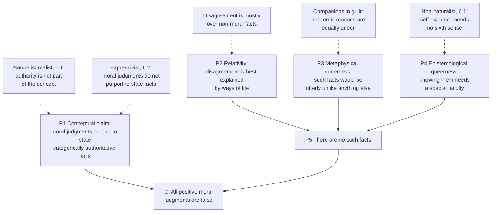

# Ethics · Lesson 6.3: Error theory

> ⏱ ~15 min · Module 6: Metaethics · Builds on: [6.1 Moral realism](06-01-moral-realism.md), [6.2 Expressivism](06-02-expressivism.md) · Unlocks: [6.4 Constructivism and debunking](06-04-constructivism-and-debunking.md)

## Why this matters

The realist of [6.1](06-01-moral-realism.md) says moral claims state facts, and some are true. The expressivist of [6.2](06-02-expressivism.md) says they were never in the fact-stating business. The error theorist takes half of each: moral claims *do* try to state facts, and there are no such facts to state. So every claim of the form "X is wrong" is false, including "torturing children for fun is wrong." That sounds like a reductio. J. L. Mackie's *Ethics: Inventing Right and Wrong* (1977) makes it into two serious arguments, and they define what every realist since has had to answer.

## The idea

Compare etiquette and morality. "You must not eat peas off your knife" applies to you whether or not you care about etiquette, but if you shrug and say "I don't care about etiquette," nothing is left over: the rule has no grip on someone outside the practice. Philippa Foot pressed this contrast ("Morality as a System of Hypothetical Imperatives", 1972). Morality claims more. "You must not torment the helpless" is meant to bind you *even if* you do not care, have no desire it serves, and belong to no practice that endorses it. It claims **categorical authority**: a reason for you that does not depend on what you want.

Mackie's thought is that this is exactly what ordinary moral thinking takes for granted, and exactly what nothing in the world could supply. A fact that by itself gives *anyone* a reason to act, whatever they desire, would be a fact with "to-be-avoidedness" built into it. We know of no facts like that. The physical world has masses, charges and brain states, none of which tell anyone what to do.

So the error theorist's picture is like that of an atheist about a religious practice. Talk of God is not meaningless, and it is not a way of expressing feelings. It is an attempt to describe a being, and (says the atheist) the description fits nothing. Moral talk, on this view, is systematically false in the same way, and for the same kind of reason: its concepts presuppose something the world does not contain.

Why would a whole species make the same mistake? Mackie's answer borrows Hume's *projection*: we feel revulsion at cruelty and experience the cruelty itself as having a repellent, demanding quality. Hume, in the *Enquiry concerning the Principles of Morals* (Appendix I), contrasts reason, which finds things as they are, with taste, which "has a productive faculty, and gilding or staining all natural objects with the colours, borrowed from internal sentiment, raises in a manner a new creation." The error theorist adds: and then we forget we did the staining.

## The argument

**Mackie's error theory** (paraphrased from *Ethics: Inventing Right and Wrong*, ch. 1).

1. **The conceptual claim.** Ordinary moral judgments purport to report objective facts that are categorically prescriptive: they give any agent a reason to act, independent of that agent's desires. *In words:* when we say an act is wrong, we mean it is wrong for everyone, with authority, whatever they want.
2. **The argument from relativity.** Moral codes vary widely across societies and periods. This variation is better explained by people's participation in different ways of life than by some of them perceiving objective values others miss: people approve of monogamy because they live monogamously, rather than the reverse. *In words:* the best explanation of what people believe about morality never needs moral facts.
3. **The argument from queerness, metaphysical.** Objectively prescriptive facts would be entities or relations of a very strange sort, utterly unlike anything else we have reason to believe in. They would also need a baffling connection to the natural facts they depend on: what links "this is deliberate cruelty" to "this is wrong"? *In words:* such facts would not fit anywhere in the world as we otherwise understand it.
4. **The argument from queerness, epistemological.** If there were such facts, knowing them would require a special faculty of moral perception or intuition, unlike every ordinary way of knowing. *In words:* we would need a sixth sense, and we have no account of one.
5. **The substantive claim.** So there are no objective, categorically prescriptive facts. *In words:* nothing is wrong, in the sense "wrong" is used.
6. **Conclusion.** So all positive moral judgments (those ascribing moral properties) are false. *In words:* moral talk is meaningful, sincere and systematically in error.

Note what premise 1 does. Without it the argument shows only that some odd entity does not exist. Premise 1 ties our moral *concepts* to that entity, so its non-existence becomes the falsity of our moral claims. Premises 2 to 4 support premise 5.

**After the verdict: three options.** If the error theory is true, what should we do with moral talk?

- **Abolitionism** (developed by Ian Hinckfuss and Richard Garner, among others): stop. Moral language breeds self-righteousness and intractable conflict; say what you want and negotiate.
- **Fictionalism** (Richard Joyce, *The Myth of Morality*, 2001): keep using moral talk, but *accept* it rather than believe it, as one engages with a story. The fiction earns its keep by strengthening resolve: thinking "stealing is wrong" guards against temptation better than a calculation of costs.
- **Conservationism** (associated with Jonas Olson, *Moral Error Theory*, 2014): keep believing moral claims in everyday life, and set the error theory aside except in the philosophy seminar.

## Argument map

## Worked examples

**Example 1 (clean: running the theory on a claim).**

Take "It was wrong of Dana to break her promise just because a better offer came up." Step 1: what does the claim purport? That Dana had a reason not to break it that held regardless of her desires. Step 2: is there such a reason? By premise 5, no. Step 3: so the claim is false.

Now the step people get wrong. Is "It was *permissible* for Dana to break it" then true? On the usual statement of the view, no. "Permissible" ascribes a moral property too, with the same pretensions to authority, so it is false as well. (Error theorists differ over bare negations such as "not wrong".) The error theorist is not a first-order permissivist saying "anything goes." "Anything goes" is itself a moral claim, and it fails with the rest. What *is* true is a non-moral description: Dana broke a promise, the other party was disappointed, most people in her society disapprove.

Notice also that Mackie's scepticism is second-order. He went on in the same book to argue for particular moral practices. Nothing in the error theory forbids having and acting on strong preferences about promise-keeping; it forbids only believing that those preferences track authoritative facts.

**Example 2 (hard: companions in guilt).**

Terence Cuneo, *The Normative Web* (2007), turns the queerness argument on itself. Consider epistemic reasons. If your evidence strongly supports that the bridge is unsafe, you have a reason to believe it is unsafe. Does that reason depend on your desires? It seems not: someone who does not care about truth is still irrational to believe against overwhelming evidence. So epistemic reasons look categorically authoritative too, exactly the feature Mackie called queer.

Now the dilemma. If queerness shows that there are no categorical moral reasons, it equally shows there are no categorical epistemic reasons. But then no one has a reason to believe the error theory, including on the strength of Mackie's arguments. So either the argument proves too much, or it defeats itself. Cuneo's parity premise does the work: moral and epistemic facts stand or fall together.

Mackie himself foresaw a companions-in-guilt reply of some kind and answered that the other candidates could be given empiricist accounts. Error theorists now take one of three routes:

- **Reduce the companion.** Epistemic "reasons" are really facts about evidential support (natural, non-normative relations) or hypothetical reasons given a goal of believing truly. If that works, parity fails. Cuneo's reply is that such reductions leave out the authority: someone who does not share the goal is still irrational.
- **Distinguish the authority.** Grant that epistemic norms have some categorical form, but argue that moral authority is stronger, reaching over what you *do* and not only what you believe. The burden is to say precisely what the extra ingredient is.
- **Bite the bullet.** Accept an error theory about epistemic reasons too, and say the error theory can still be *true* and supported by evidence even if nobody is authoritatively required to believe it. The cost is a position that seems unable to be recommended in its own terms.

Where the parity premise holds, the error theorist is in trouble; where it fails, the queerness argument survives. Which it is remains the live crux.

## Watch out

- **You might think the error theory is a kind of expressivism.** Both deny that there are moral facts. But the expressivist says moral judgments never *aimed* at facts, so they are not false; the error theorist says they aimed and missed. The dispute is premise 1, about what our moral concepts contain.
- **You might think an error theorist must behave badly.** Error theory is a thesis about the metaphysics of moral claims, not a recommendation. Abolitionists, fictionalists and conservationists can all be kind, honest and fair; they disagree about how to *talk* about it.
- **You might think the relativity argument is "people disagree, so there is no truth."** That inference is invalid: people disagreed about the shape of the earth. Mackie's argument is an inference to the best explanation, and it stands or falls on whether moral facts are needed in the best explanation of moral belief.
- **You might think "queer" just means "unfamiliar."** The complaint is specific: a fact that is both objective and intrinsically action-guiding, whatever you want. Naturalists answer by denying the second feature; non-naturalists by denying that it is disqualifying.

## One-liner

> The error theorist agrees with the realist about what moral claims mean and with the sceptic about what exists, so every moral claim, including "anything goes," comes out false.

## Problems

**P1 (🟢) *(Exegetical (a) · Evaluative (b).)*** (a) Reconstruct Mackie's *metaphysical* argument from queerness as a valid argument from P1 to C, in four to six numbered premises, ending in "all positive moral judgments are false." Include the conceptual claim. (b) Flag the weakest premise, and say which view from [6.1](06-01-moral-realism.md) or [6.2](06-02-expressivism.md) denies it and on what ground. 100 words or fewer for (b).

**P2 (🟡) *(Exegetical.)*** An error theorist and a companions-in-guilt theorist in Cuneo's style disagree about whether any categorical reasons exist. (a) Name the single premise the error theorist must deny to keep the argument from queerness. (b) Say what argument or evidence would move each side on it: what would the error theorist have to show, and what would count against the companions-in-guilt theorist? 150 words or fewer.

**P3 (🔴, optional) *(Evaluative.)*** Marta is a fictionalist in Joyce's style. At a self-checkout she notices she has been undercharged by 40 dollars, and no one will ever know. (a) Say what her fictionalism recommends she think and do, and how it differs from what a conservationist and an abolitionist would recommend. (b) Say where fictionalism stops determining what she does: what happens when she steps into a "critical context" and asks whether stealing is *really* wrong? Any verdict on whether fictionalism is stable; you are graded on the moves. 150 words or fewer.

Solutions

**P1** *(Exegetical (a) — strict · Evaluative (b) — any verdict.)*

**Must hit, strict (a):**
- A **conceptual premise**: moral judgments purport to ascribe objective, categorically prescriptive properties (reasons binding independent of desires).
- A **queerness premise**: such properties would be metaphysically unlike anything else, including an unexplained link to the natural facts they depend on.
- A **bridging premise** that makes the move to non-existence explicit: we should not believe in entities that are that anomalous without strong reason, and there is none.
- **Sub-conclusion:** there are no such properties; and **C:** so all positive moral judgments are false. The argument must be valid as written.

**Must hit, any verdict (b):** name one premise, say who denies it and why. Good candidates: the conceptual premise (the naturalist denies that categorical authority is part of the concept; the expressivist denies that moral judgments purport to describe at all); or the bridging premise (the non-naturalist says oddness is no evidence of non-existence, and may add that Mackie's standard sinks epistemic reasons too).

**Wrong turns:** leaving out the conceptual premise, which makes the conclusion (about judgments) unreachable from premises about entities. Including relativity, which (a) did not ask for. In (b), naming a premise without a view that denies it.

**Model answer:**
P1. Moral judgments purport to ascribe objective, categorically prescriptive properties.
P2. Such properties would be utterly unlike any other properties, with an unexplained dependence on natural ones.
P3. If a kind of property would be that anomalous and nothing requires us to posit it, it does not exist.
P4. Nothing requires us to posit them.
C1. So there are no such properties. (P2–P4)
C. So all positive moral judgments are false. (P1, C1)
(b) Weakest: P1. The Cornell naturalist denies that "wrong" carries built-in authority: it names a natural property, and whether you have reason to avoid it depends on you.

---

**P2** *(Exegetical — strict.)*

**Must hit, strict (a):** the **parity premise**: if categorical authority is queer enough to rule out moral reasons, it is queer enough to rule out epistemic reasons (so they stand or fall together). The error theorist must deny it, since denying the existence of epistemic reasons as well seems to undercut any claim that we ought to believe the error theory.

**Must hit, strict (b):**
- **Error theorist must show** a real disanalogy: that epistemic reasons reduce to non-normative evidential relations or to hypothetical reasons relative to a goal of truth, or that moral authority involves something epistemic authority lacks.
- **Against the companions-in-guilt theorist:** a successful reduction of that kind, or an account of epistemic irrationality that does not need categorical reasons. Either would break parity.
- **Against the error theorist:** showing the reduction leaves something out, e.g. that someone indifferent to truth is still irrational to believe against the evidence.

**Wrong turns:** naming the conceptual claim (premise 1) as the crux. Cuneo accepts that moral facts would be categorically authoritative; the dispute is whether such facts can exist. Saying the error theorist must deny that epistemic reasons exist: that is one option (bullet-biting), not what either side needs.

**Model answer:** (a) The crux is parity: whatever makes categorical moral reasons queer makes categorical epistemic reasons equally queer. (b) The error theorist has to break parity, by reducing epistemic reasons to facts about evidential support or to means–end reasons given an aim of truth, or by naming an ingredient only moral authority has. A reduction that captured irrationality without categorical authority would move the companions-in-guilt theorist. What would move the error theorist is a case that shows the reduction fails: someone who does not care about truth, believes against overwhelming evidence, and is still plainly irrational.

---

**P3** *(Evaluative — graded on moves, not verdict.)*

**Must hit, any verdict:**
- **Fictionalist verdict (a):** in ordinary deliberation Marta thinks "keeping it would be stealing, and stealing is wrong" and pays, *accepting* but not believing the claim. The point of the fiction is to protect against exactly this kind of temptation.
- **Contrast:** the conservationist has her *believe* it's wrong in everyday life; the abolitionist has her drop the moral framing and decide by her preferences and the practical costs.
- **Where it stops (b):** in a critical context, Marta sincerely judges there is no authoritative reason not to keep the money. Say what then moves her: her standing commitment, her desire to be a certain kind of person, or nothing. And say whether the fiction's motivating force survives her knowing it is a fiction.
- A one-line verdict on whether that instability is fatal, with a reason.

**Wrong turns:** saying fictionalism tells her she may keep the money because "nothing is really wrong." That is abolitionism, or no view, not fictionalism. Treating the fictionalist as believing moral claims.

**Model answer (one of several):** (a) Inside the fiction Marta thinks "that is stealing; I don't steal," and pays; the fiction serves as precommitment against a small, private temptation. A conservationist would have her simply believe it wrong; an abolitionist would tell her to weigh what she actually wants, perhaps a clear conscience against 40 dollars. (b) Ask Marta in a critical context whether keeping it is *really* wrong and she says no. The fiction then determines nothing; only her standing policy does. Whether that policy holds once she sees it as a story is an empirical question about her psychology, and the fictionalist's answer is that commitments often do survive (people keep resolutions they know are self-imposed). I judge the view stable enough for habits and weak for novel dilemmas, where the fiction has no ready answer and critical thought is exactly what she needs.

## Flashback

**From Lesson 5.2 (Contractualism: what no one could reasonably reject):** A company proposes a rule: managers may read employees' private messages on work devices whenever doing so would slightly raise productivity for the 200 coworkers on the team. (a) Run Scanlon's test: identify the strongest *individual* complaint against the rule and against its rival (no reading without cause), stated from generic standpoints, and give his verdict. Say which kind of reason the first complaint is. (b) State the redundancy objection as it applies here, and Scanlon's reply. Say whether the reply works in this case. 150 words or fewer for (b).

Solution

**Must hit, strict (a):**
- **Against the rule:** from the standpoint of an employee whose messages are read, loss of control over one's private communications and being subject to monitoring on thin grounds. This is a **non-welfare reason** (control, privacy, standing), not only a cost in well-being.
- **Against the rival:** from the standpoint of one coworker, a slight loss of productivity (a small individual burden).
- **Individualist restriction:** the 200 slight gains are not summed. The employee's complaint is much stronger than any single coworker's, so the rule is reasonably rejectable and the rival is not. **Verdict:** reading without cause is wrong.

**Must hit, any verdict (b):**
- **Objection:** the rule is reasonably rejectable *because* reading private messages is wrong, so wrongness does the work and the contract adds nothing.
- **Reply:** the ground of rejection is not wrongness but ordinary reasons (loss of control, exposure); wrongness *consists in* failing justifiability built from those reasons.
- A judgment on whether, here, "loss of control" can be stated without already presupposing that the employee has a *right* to privacy.

**Wrong turns:** adding up the coworkers' gains into one big complaint; treating the employee's complaint as merely unpleasantness, which misses the non-welfare category.

**Model answer (b), one of several:** The objection: we see the rule is rejectable only because we already see that snooping wrongs the employee, so the test is idle. Scanlon replies that the employee's reason is not "this wrongs me" but "I lose control over who reads what I write," a reason we can state before any verdict on wrongness. Here the reply holds partly. "Loss of control" is a pre-moral fact, but its *weight*, enough to beat 200 small gains, seems to depend on thinking private messages are something one is entitled to control. The reply works if that entitlement is itself built from further reasons, and is circular if it is not.

## Connections

- **Backward:** [6.1](06-01-moral-realism.md)'s non-naturalist and the error theorist agree on what moral facts would have to be: objective and authoritative. They disagree only on whether any exist, which is why queerness and Harman's explanation challenge are close cousins. [6.2](06-02-expressivism.md) is the other way to deny moral facts, by denying that moral judgments are beliefs at all. The relativity argument is an [inference to the best explanation](../../philosophical-method/lessons/02-01-inference-to-the-best-explanation.md), and P2 is a [finding the crux](../../philosophical-method/lessons/04-03-finding-the-crux.md) problem.
- **Forward:** [6.4](06-04-constructivism-and-debunking.md) offers a route between realism and error: authority *constructed* from the practical standpoint, with no queer facts required. Its Darwinian dilemma is a newer debunking argument that reaches a similar sceptical point by a different road. [6.6](06-06-moral-knowledge-and-disagreement.md) takes up Mackie's relativity argument again as a question about moral knowledge.
- **Sideways:** fictionalism has the same shape in the philosophy of mathematics. [metaphysics 1.2](../../metaphysics/lessons/01-02-abstract-objects.md) treats numbers as a useful story whose applicability needs explaining, just as moral fictionalism owes an account of why a false morality is worth keeping. The companions-in-guilt argument makes the nature of epistemic normativity a question for [`epistemology`](../../epistemology/syllabus.md). Hume's projectivism, which Mackie builds on, gets its historical treatment in [`modern-philosophy`](../../modern-philosophy/syllabus.md).
