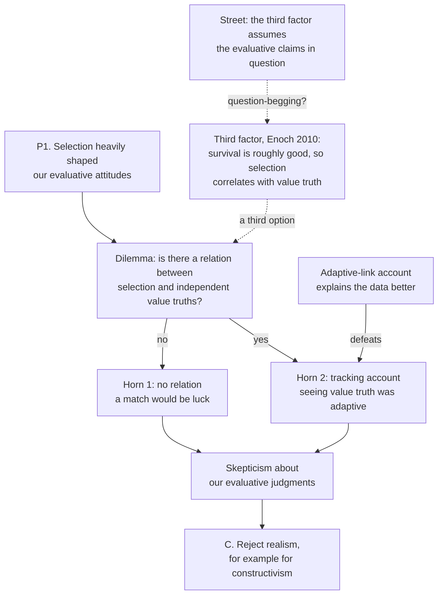

# Ethics · Lesson 6.4: Constructivism and debunking

> ⏱ ~15 min · Module 6: Metaethics · Builds on: [6.1 Moral realism](06-01-moral-realism.md), [2.3 Humanity, autonomy and the lie](02-03-humanity-autonomy-and-the-lie.md) · Unlocks: [6.5 God and morality: the Euthyphro dilemma](06-05-god-and-morality-the-euthyphro-dilemma.md)

## Why this matters

Realism ([6.1](06-01-moral-realism.md)) says moral truths hold whatever anyone thinks. Expressivism and error theory ([6.2](06-02-expressivism.md), [6.3](06-03-error-theory.md)) say moral talk doesn't state such truths, or states them falsely. Constructivism offers a third route. There are moral truths, some claims really are correct, but what makes them correct is what a valuing agent is committed to, not a fact that lies waiting outside. The view has real appeal of its own. It also has a sharp argument on its side: Sharon Street's claim that evolution has shaped our values so thoroughly that, if realism were true, we would have no good reason to think our values are right. This lesson states both kinds of constructivism and runs that argument.

## The idea

Compare two ways a chess move can be "correct." On one picture, there's a fact about good moves that holds apart from the game, and players try to detect it. On the other, the move is correct because it's what the rules and the aim of winning commit you to. Nobody detects it. It follows from the standpoint of someone playing chess.

**Constructivism** says moral truths are like the second kind. A normative claim is true when it would be endorsed from the **practical standpoint**, the point of view of an agent deciding what to do, when that standpoint is worked out properly. John Rawls ("Kantian Constructivism in Moral Theory", 1980) introduced the label. Christine Korsgaard calls the resulting position **procedural realism**: there are right answers because there is a correct procedure. The rival, **substantive realism**, says the procedure is correct only because it tracks answers that already exist.

The live question is how much the practical standpoint contains.

- **Kantian constructivism** (Korsgaard): a lot. Anyone who values anything is, on reflection, committed to valuing humanity, so substantive morality follows for every agent.
- **Humean constructivism** (Street): very little. The standpoint of valuing brings formal standards like consistency and means–end coherence, but no content. What you have reason to do depends on what you actually value.

## The argument

**A. Korsgaard's route to morality** (*The Sources of Normativity*, 1996, paraphrased).

1. **Reflective creatures can step back from their impulses** and ask whether to act on them, so an impulse is not yet a reason. *In words:* wanting something doesn't settle whether you should do it.
2. **A reason is an impulse that survives reflective endorsement**, and we endorse from a **practical identity**: a description under which you value yourself, such as parent, teacher, Catholic or citizen. *In words:* what counts as a reason for you depends on who you take yourself to be.
3. **Obligations come from identities.** To act against one is to lose your integrity under that description. *In words:* a teacher who sells grades stops being a teacher in the sense she values.
4. **Most identities are contingent, but needing one is not.** That need comes from your humanity, your nature as a reflective being who must act for reasons. So valuing anything commits you to valuing your humanity. *In words:* you can't care about your projects while treating the capacity that makes caring possible as worthless.
5. **Reasons are public, so valuing your own humanity commits you to valuing it in others.** This is the step critics press hardest. *In words:* your humanity can't be a source of value only when it's yours.
∴ Moral obligation binds every reflective agent. It is constructed from the standpoint of agency, not found outside it.

This is a descendant of Kant's claim in *Groundwork* II that "rational nature exists as an end in itself" ([2.3](02-03-humanity-autonomy-and-the-lie.md)).

**B. Street's Humean constructivism** ("Constructivism about Reasons", 2008; "In Defense of Future Tuesday Indifference", 2009, paraphrased).

1. **A normative claim is true for an agent when it follows from within her practical standpoint**: her values, plus the non-normative facts, plus the standards built into valuing as such. *In words:* your reasons are what your own values, fully thought through, commit you to.
2. **The standards built into valuing are formal.** Valuing an end commits you to taking the means and to keeping your values consistent, but it commits you to no particular end. *In words:* coherence constrains how you value, not what you value.
3. ∴ **An ideally coherent Caligula is possible.** Imagine an agent who values torturing others for fun, and whose values are perfectly consistent. Nothing in his own standpoint gives him a reason to stop. *In words:* there may be no argument, from premises he accepts, that he is making a mistake.

The Caligula case was pressed against Korsgaard by Allan Gibbard (1999). Street accepts it for her own view. She adds that from *our* standpoint we can condemn and resist him, and we have every reason to.

**C. Street's Darwinian dilemma** ("A Darwinian Dilemma for Realist Theories of Value", 2006, paraphrased). Here **realism** means value truths that hold independently of all our evaluative attitudes.

1. **Natural selection has heavily shaped the content of our evaluative attitudes.** Examples include caring for offspring, returning favours, and treating harm to oneself as bad. *In words:* our starting values are largely the ones that helped ancestors reproduce.
2. **Either there is a relation between those selective pressures and the independent evaluative truths, or there is not.**
3. **Horn 1: no relation.** Then evolution pushed our values around without regard to the truth. Street compares this to letting wind and tide steer your boat and hoping to land in Bermuda. *In words:* any match between our values and the truth would be luck, so skepticism follows.
4. **Horn 2: a relation.** The realist's natural candidate is the **tracking account**: grasping evaluative truths was adaptive. *In words:* ancestors who saw what really mattered did better.
5. **But the adaptive-link account explains the same data better.** Evaluative tendencies were selected because they linked circumstances to responses that paid off, and whether those tendencies were true plays no role. It is simpler and clearer, and it explains why our values are the ones they are. *In words:* "it worked" beats "it was true" as a scientific explanation.
∴ Either way, realism leaves our evaluative knowledge unexplained. **Constructivism escapes**, because if value is fixed by what our standpoint commits us to, evolution shaping that standpoint can't put it off-track.

Street aims the argument at realism generally. It bites hardest on non-naturalist realism, which takes value truths to be causally inert.

## Argument map

Solid arrows are Street's argument. Dashed arrows are the realist reply and Street's counter.

## Worked examples

**Example 1 (clean case: special concern for one's own children).** Most people judge that the fact a child is *yours* gives you strong extra reason to care for her.

- *Adaptive link:* parents disposed to favour their own offspring left more descendants. That explains the attitude fully without mentioning whether it's true.
- *Horn 1 realist:* the attitude is then just as it would be if it were false. Believing it is true would need luck.
- *Horn 2 realist:* "ancestors perceived the independent truth that kinship gives reasons" adds a detector with no work to do.
- *Constructivist:* the reason exists because it follows from the standpoint of beings who value their children, with all their other values. Evolution explains why we have that standpoint, and the constructivist sees no threat in that.

**Example 2 (hard case: where the third factor runs out, and where the dilemma turns on itself).** David Enoch (2010) replies that the realist can explain the correlation without tracking. Survival and flourishing are, by and large, good. Selection pushed us toward judgments that favour survival. So our judgments roughly line up with the truth through a common cause, with no detection involved. Erik Wielenberg (2010) gives a related third-factor account, grounding moral rights in the same cognitive capacities that produce our beliefs about them.

The reply strains in two places.

- **Scope.** A survival-based third factor vindicates the judgments that line up with survival. It says nothing for judgments that selection didn't favour, such as equal concern for distant strangers or for animals. Those may be exactly the judgments a realist most wants to defend.
- **Circularity.** Street answers that "survival is good" is itself one of the evolved evaluative judgments under suspicion, so using it to vindicate the rest assumes what was in question. Enoch replies that every faculty gets checked with its own outputs, as when we vouch for perception by perceiving, and that the task is to explain a correlation, not to argue a skeptic round from neutral ground.

The dilemma also strains when it's turned on itself. Horn 2 relies on an *epistemic* norm: prefer the simpler, better explanation ([philosophical-method 2.1](../../philosophical-method/lessons/02-01-inference-to-the-best-explanation.md)). That norm is also evaluative in a broad sense and plausibly shaped by selection. If the dilemma debunks moral realism, critics ask, doesn't it debunk realism about epistemic reasons too, including the norm the argument uses? Street's constructivism is meant to cover all normative reasons, so she can say epistemic norms are constructed as well. The realist's charge is that an argument this strong proves too much.

## Watch out

- **You might think constructivism is relativism.** Kantian constructivism derives the same morality for every reflective agent. Even Humean constructivism allows plain error, since you can be wrong about what your own values commit you to.
- **You might think the Darwinian dilemma needs evolutionary psychology to be precise.** Premise 1 needs only a broad influence. The particular adaptationist stories are often speculative, and their evidential status varies widely, but the argument doesn't rest on any single one.
- **You might think constructivism simply escapes debunking.** It escapes the *reliability* worry, but it pays in contingency. For Street, had selection given us different starting values, different things would matter for us. Kantians avoid that cost only if step 5 of Korsgaard's argument holds.
- **You might think a third-factor reply proves realism.** At most it shows realism is consistent with our judgments being mostly reliable. It doesn't show the realist's metaphysics is true.

## One-liner

> Realists find value and constructivists build it from the standpoint of agency. Street's dilemma asks realists how evolution-shaped finders could ever have got it right.

## Problems

**P1 (🟡) *(Exegetical (a) · Evaluative (b).)*** Consider the judgment *that someone has done you a favour is a reason to do them one in return*. (a) Run Street's Darwinian dilemma against a non-naturalist realist's belief in this judgment, in standard form (P1 … ∴ C), stating both horns and the account Street prefers at Horn 2. (b) Flag the premise you take to be weakest and say why, in 150 words or fewer.

**P2 (🟡) *(Exegetical.)*** A realist and a debunker agree that selection made us regard our own intense pain as bad, and that this judgment is true. They disagree over whether the realist is *entitled* to believe it is reliable. Find the crux: (a) state the realist's third-factor explanation of the correlation, (b) state the debunker's objection to it, (c) name the single premise one side must deny, and (d) say what argument, from a domain other than ethics, would move that premise. 150 words or fewer.

**P3 (🔴, optional) *(Evaluative.)*** Build a counterexample to Korsgaard's argument: an agent who is ideally coherent, values his own reflective agency, and still has no reason, by his own lights, to value the humanity of some other people. Do not use Caligula or future-Tuesday indifference. Say which numbered step of Korsgaard's argument your case targets, give the Kantian's best reply, and judge whether the reply works. 150 words or fewer.

Solutions

**P1** *(Exegetical (a) · Evaluative (b))*

**Must hit, strict (a):**
- P1: selection shaped our tendency to judge that favours call for return. Reciprocal helpers did better in repeated cooperation.
- P2: either the selective pressure bears some relation to the independent truth, or none.
- Horn 1: none. Then any match between the judgment and the truth is luck, so the belief is unjustified.
- Horn 2: tracking. Ancestors who grasped the truth about reciprocity reproduced more.
- The adaptive-link account (reciprocators got more help back, whether or not the judgment is true) explains this better: it is simpler, it is clearer, and it explains why *this* content.
- ∴ realism can't explain why the belief would be reliable.

**Must hit, any verdict (b):** name one premise; give a reason tied to that premise, not a restatement of the conclusion; say what the realist or Street would say back.

**Wrong turns:** making the realist hold that the judgment is *false* (the worry is unjustified belief, not falsity); leaving out the adaptive-link account, which is what defeats Horn 2; treating the dilemma as an argument for expressivism rather than against attitude-independence.

**Model answer (b), one of several:** I take P2's disjunction to be weakest, because it seems to exhaust the options but leaves out a third factor. A realist can say helping those who help you sustains cooperation. Cooperation is good, and selection favoured the judgment because it favoured cooperative outcomes that really are good. That is neither luck nor tracking. Street would reply that "cooperation is good" is one of the suspect evolved judgments. The question is whether leaning on it is illegitimate or just what every faculty must do.

---

**P2** *(Exegetical)*

**Must hit, strict:**
- (a) Third factor: pain in oneself tends to threaten survival and well-being, which are good. Selection made us averse to it, so the judgment lines up with the truth through a common cause, without tracking.
- (b) Objection: the explanation uses an evaluative premise ("survival and well-being are good") that is itself one of the judgments under suspicion, so it begs the question.
- (c) Crux: whether you may use beliefs from a domain to explain that domain's reliability when that reliability has been challenged. The realist affirms it; the debunker denies it.
- (d) The same move in perception or in mathematics or logic, where we certify the faculty by using it. If that is legitimate there and the cases are relevantly alike, the premise holds.

**Wrong turns:** putting the crux at whether pain is bad (they agree); saying the debunker denies evolution shaped the judgment; answering (d) with more ethics.

**Model answer:** (a) Pain signals threats to survival and well-being, which are good, so selection gave us a judgment that happens to be true. (b) That uses "survival is good", an evolved judgment under suspicion, to vouch for the rest. (c) Crux: may a challenged domain's own outputs be used to explain its reliability? Realist yes, debunker no. (d) The perception and mathematics analogy. If we properly vouch for vision by seeing, or for arithmetic by calculating, the ban on self-support looks too strong, unless ethics differs relevantly.

---

**P3** *(Evaluative)*

**Must hit, any verdict:**
- A specific agent with coherent values who values his own reflective agency but not that of some others. For example, a loyal clan member whose deepest identity is kin-member, and who regards outsiders' reasons as having no claim on him.
- Correct target: step 5, the move from the value of one's own humanity to others' (the publicity of reasons), or possibly step 4.
- The Kantian reply at strength: reasons are shareable in their very nature, and valuing humanity *as such* can't pick out its bearer.
- A judgment on whether the reply shows incoherence or only restates the conclusion.

**Wrong turns:** an agent who is incoherent (that only shows a mistake by his own lights); targeting step 1, which the case never denies; a case that just repeats Caligula.

**Model answer, one of several:** Brannoc values his reflective agency and his clan identity. He grants that outsiders deliberate, but what he values is humanity *as it figures in lives that are his to share*, and his values are fully consistent. His case targets step 5. The Kantian replies that what makes his agency valuable, the capacity to act for reasons, is present in outsiders, so the restriction is arbitrary, and reasons are public in their nature. But "arbitrary" needs a standard beyond his coherent values, which is what the Humean denies. I judge that the reply restates the conclusion unless publicity can be shown to be built into valuing itself.

## Flashback

**From Lesson 5.3 (Pluralism and particularism):** You borrowed a friend's car for the weekend. Take *that I used up fuel from a car she lent me* as a reason to fill the tank before returning it. (a) Classify each fact as an enabler, disabler, intensifier or attenuator, in Dancy's sense: (i) I drove 600 km and nearly emptied the tank; (ii) I only drove to the corner shop and back; (iii) there is an open petrol station on my route; (iv) she is taking the car to the scrapyard tomorrow, where it is crushed with its tank as it is. (b) Given (iv), say in two sentences what a Rossian and a Dancyan each say about whether anything is still owed.

Solution

**Must hit, strict (a):** (i) intensifier: more fuel used, stronger reason. (ii) attenuator: little fuel used, weaker reason. (iii) enabler: you can do it, so the reason can apply, but the petrol station is not itself a reason to refill. (iv) disabler: refilling would give her nothing, so the fact that you used her fuel no longer favours refilling.

**Must hit, any verdict (b):** Rossian: a prima facie duty (reparation or fidelity to the terms of the loan) still counts. Refilling is pointless, so it is outweighed or has no fitting act, and a residue may be owed in another form, such as offering the fuel money. Dancyan: the reason is disabled, so there is nothing to outweigh, and whether anything is owed depends on whether some *other* reason (fairness about her loss) applies. Either classification of residue passes if the outweighed/disabled contrast is drawn.

**Wrong turns:** calling (iii) a favourer, since the station's being open is a condition for the reason to apply, not a reason itself; calling (iv) an attenuator, since it removes the point of refilling entirely rather than weakening it.

**Model answer (b):** Ross: the duty to make good what I used still counts, and since refilling is pointless I owe her its value some other way. Dancy: the scrapyard disables the reason to refill, so nothing is outweighed, though repaying the cost of the fuel may be favoured by a different reason.

## Connections

- **Backward:** [6.1](06-01-moral-realism.md) defined the attitude-independence that Street's dilemma targets, and Harman's explanation challenge there is its ancestor. Korsgaard's step 4 reworks the Formula of Humanity from [2.3](02-03-humanity-autonomy-and-the-lie.md). Her question of where a categorical "ought" gets its authority is the one Mackie answers skeptically in [6.3](06-03-error-theory.md), where evolutionary debunking also serves as an argument for error theory. Scanlon's contractualism ([5.2](05-02-contractualism-what-no-one-could-reasonably-reject.md)) is often classed as a restricted constructivism about the moral "ought".
- **Forward:** [6.5](06-05-god-and-morality-the-euthyphro-dilemma.md) asks the constructivist's question about God: is the good good because it is willed, or willed because it is good? Procedural versus substantive realism is that dilemma in secular form. Whether a third-factor reply can yield moral *knowledge* comes back in [6.6](06-06-moral-knowledge-and-disagreement.md).
- **Sideways:** Horn 2 is an inference to the best explanation ([philosophical-method 2.1](../../philosophical-method/lessons/02-01-inference-to-the-best-explanation.md)), and the circularity dispute is the bootstrapping and reliability problem in [`epistemology`](../../epistemology/syllabus.md). Some theists offer God as the third factor, since a creator could ensure that evolved judgments fit moral truth. That is a question for [`philosophy-of-religion`](../../philosophy-of-religion/syllabus.md). Rawls's political constructivism is in [`political-philosophy`](../../political-philosophy/syllabus.md).
