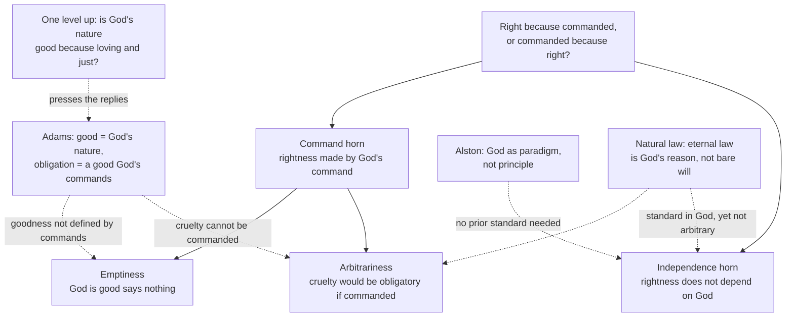

# Ethics · Lesson 6.5: God and morality: the Euthyphro dilemma

> ⏱ ~15 min · Module 6: Metaethics · Builds on: [6.1 Moral realism](06-01-moral-realism.md), [4.4 Natural law I: Aquinas](04-04-natural-law-aquinas.md) · Unlocks: [6.6 Moral knowledge and disagreement](06-06-moral-knowledge-and-disagreement.md)

## Why this matters

For most of history, and for most people alive now, the obvious answer to "what makes cruelty wrong?" has been "God forbids it." Divine command theory (DCT) turns that answer into a metaethics: moral facts are grounded in God. Since Plato, one short argument has been taken to show that the view is either false or monstrous. That argument, the Euthyphro dilemma, is probably the most cited objection in all of metaethics. It is also the one that modern theists have worked hardest to answer. This lesson sets out the dilemma and the three serious replies, and asks where each reply puts the pressure back.

One boundary. Whether God exists belongs to [`philosophy-of-religion`](../../philosophy-of-religion/syllabus.md). Everything here is **conditional on theism**: *if* there is a perfectly good God, what, if anything, does morality owe to God? A non-theist can reject DCT simply by rejecting theism. The interesting question is whether a theist should accept it.

## The idea

Take any authority whose verdicts line up perfectly with some standard, say a master sommelier who never misjudges a wine. Ask: does she rate the wine good *because* it is good, or is it good *because* she rates it so? The first answer makes her a flawless detector of a quality she does not create. The second makes the quality whatever she happens to say, so her verdicts could not be *wrong*, but they could not be *right* either, only hers.

Now put God in the sommelier's place and moral obligation in place of quality. Either God commands what is right because it is right, and rightness has a source other than God, or it is right because God commands it, and then it seems God could have commanded anything.

The replies all try to find a third option. Their shared move is to split what the dilemma lumps together. Grounding *goodness* in God's nature is one claim. Grounding *obligation* in God's commands is another. Grounding either in God's *will* is a third, and grounding it in God's *reason* is a fourth.

## Source

Plato, *Euthyphro* 10a (Jowett translation, public domain). Euthyphro has just proposed that the pious is what all the gods love. Socrates replies:

> The point which I should first wish to understand is whether the pious or holy is beloved by the gods because it is holy, or holy because it is beloved of the gods.

Two things to notice. First, the original question is about *piety* and a *plurality* of gods; the moral, monotheistic version below is a later reconstruction, not Plato's text. Second, Socrates' own answer (10b–11a, paraphrased) is that the gods love the pious because it is pious. So being god-loved is something that *happens to* the pious, an attribute, and cannot be what piety *is*, its essence. The dilemma was born as an argument about the difference between a thing's nature and a relation it stands in.

## The argument

**The dilemma against DCT.** Unmodified DCT: *an act is morally obligatory because, and only because, God commands it.*

1. **Either God commands right acts because they are right, or they are right because God commands them.** *In words:* the commands either track the standard or make it.
2. **If God commands them because they are right, their rightness does not depend on God's commands.** *In words:* God is then a perfect reporter of morality, not its ground, and DCT is false. Call this the **independence horn**.
3. **If they are right because God commands them, then had God commanded gratuitous cruelty, gratuitous cruelty would have been obligatory.** *In words:* nothing about cruelty itself stops it being required. This is the **arbitrariness horn**.
4. **On that same horn, "God's commands are good" says only that God commands what God commands.** *In words:* praising God as good becomes empty. Leibniz pressed this against voluntarists (*Discourse on Metaphysics*, 1686, §2): why praise God for doing what He would be equally praised for reversing? This is the **emptiness horn**.
5. **Both arbitrariness and emptiness are unacceptable, for the theist most of all.** *In words:* a theist wants God's goodness to be a real perfection worth worshipping, not a tautology.
6. **So DCT is either false or unacceptable.**

**Reply 1: Adams's modified divine command theory** (Robert Adams, *Finite and Infinite Goods*, 1999).

1. **The Good is God.** Finite things are good, or *excellent*, to the degree that they resemble God. *In words:* goodness has a standard, and the standard is a being, not a rule.
2. **The identification is synthetic, like water = H₂O.** "Good" picks out whatever best fills the role goodness plays in our evaluative practice; Adams argues God fills it. *In words:* this is not a definition, so the open question argument of [6.1](06-01-moral-realism.md) does not touch it.
3. **Obligation is constituted by the commands of that good God.** *In words:* only the *ought* comes from commands; the good does not. Adams argues obligation is a social notion, arising from real demands within a relationship, which is why it binds and why breaking it warrants guilt.
4. **God is essentially loving and just, so God would not command gratuitous cruelty.** *In words:* the counterfactual in step 3 of the dilemma has an impossible antecedent. That answers arbitrariness.
5. **God's goodness is not defined by commands.** *In words:* "God is good" says God is the standard of excellence, not that God obeys God, which answers emptiness.

William Alston ("Some Suggestions for Divine Command Theorists," 1990) adds the key structural claim. God is good as a **paradigm**, not by satisfying a **principle**. The comparison usually drawn is the old standard metre bar: it was the standard of length rather than something measured against one. Asking "in virtue of what is God good?" assumes some prior principle God must meet, and the paradigm view denies that.

**Reply 2: natural law** ([4.4](04-04-natural-law-aquinas.md)). For Aquinas, law is "something pertaining to reason" (*ST* I-II q.90 a.1). Natural law is the rational creature's share in eternal law, which is God's *reason* governing creation, not bare will. Moral truths follow from human nature, created by God and patterned on God's own wisdom. So both horns are denied. The standard is not independent of God, since it lives in God's intellect and in the nature God made. And it is not arbitrary, since God could no more command against it than contradict His own wisdom. The contrast is **voluntarism**, usually associated with William of Ockham. On a common but disputed reading, he held that God could have commanded even hatred of God, and it would then have been right.

**The rejoinder: the dilemma one level up.** Critics (among them Wielenberg, *Robust Ethics*, 2014) ask whether God's nature is the standard *because* it is loving and just. If so, lovingness and justice are the good-makers, and they are independent of God. If not, calling that nature "good" is arbitrary again. Defenders answer that every metaethics stops somewhere with a necessary fact that is not explained further, and Wielenberg's own non-theistic realism stops at brute ethical facts. The live question is whose stopping point explains more.

## Argument map

Solid arrows build the dilemma. Dashed arrows are replies, and the last dashed arrow is the rejoinder that reopens it.

## Worked examples

**Example 1 (clean case: a promise).** Mara promised to help her neighbour move and would rather not. Why is she obligated?

- *Unmodified DCT:* because God commands promise-keeping, and for no further reason. Push the question: had God commanded promise-*breaking*, she would be obligated to stay home. That is the arbitrariness horn, exactly.
- *Adams:* keeping faith is *good* because trustworthiness resembles God's faithfulness; that part owes nothing to commands. It is *obligatory* because a loving God, who could not demand faithlessness, in fact requires it. There is a two-layer answer where the unmodified view had one layer.
- *Natural law:* the promise creates a claim within the good of living in society, a level-3 good of [4.4](04-04-natural-law-aquinas.md). Reason grasps that breaking faith harms that good. No specific command is needed to *ground* the obligation, though Aquinas holds God is its ultimate source.

Notice where the theories now differ. Adams and the natural lawyer agree the obligation is not arbitrary. They disagree about whether *bindingness* needs someone to issue a demand.

**Example 2 (hard case: Abraham and Isaac).** In Genesis 22, God commands Abraham to sacrifice his son, then stops him. This is the strongest test of the replies, because the story seems to describe God commanding exactly what a good God cannot.

- *Adams* grants that a good God's commands are constrained by goodness, so he must say something. He argues, roughly, that a person who seems to receive such a command should conclude that it does not come from God, because our grasp of the good is one of the ways we identify genuine commands. The cost: our independent moral judgment now filters which commands are divine, and critics ask whether that concedes the independence horn for purposes of *knowledge*.
- *Aquinas* (*ST* I-II q.100 a.8 ad 3) says the precept against killing the innocent is not dispensed. God is lord of life and death, so a death God authorizes is not *murder*. The precept stays fixed, and the act falls under a different description. The cost: this looks, to critics, like the will-based authority the natural law reply was meant to avoid, now entering through the definition of the act.

Both replies survive the case, and in both the case forces a specific commitment that can be attacked.

## Watch out

- **You might think the dilemma is an argument against theism, but** it targets one theory of what grounds morality. A theist can take the independence horn, holding that moral truths are necessary and God knows them perfectly, and lose nothing in God's existence.
- **You might think "grounding goodness in God's nature" answers everything, but** it relocates the question: is that nature good because it is loving? The paradigm view is a real answer, but it needs defending, not asserting.
- **You might think Adams defines "good" as "like God," but** he offers a synthetic identity. Running an open question test against it misses, just as it misses "water is H₂O."
- **You might think natural law is a divine command theory, but** for Aquinas moral precepts bind through reason's grasp of goods in created nature, not through a command issued case by case. What it shares with DCT is the claim that the ultimate ground is God.

## One-liner

> The Euthyphro dilemma forces a theist to say what in God grounds morality. Bare will courts arbitrariness, a standard outside God concedes independence, and the replies (a good nature plus commands, or God's reason) face the question again one level up.

## Problems

**P1 (🟢) *(Exegetical (a) · Evaluative (b))*** (a) Reconstruct Adams's modified divine command theory as an answer to *why lying to exploit a friend is wrong*. Use numbered premises and a conclusion (P1… ∴ C). Keep his claims about goodness and his claims about obligation in separate premises. (b) Flag the premise most exposed to the "one level up" rejoinder and say why in one or two sentences. Any choice passes if the reason is precise. 150 words or fewer in total.

**P2 (🟡) *(Evaluative.)*** Build a counterexample to **unmodified** DCT that does **not** use a case where God commands cruelty or some other atrocity. Instead, find an obligation the theory seems unable to ground, or a verdict it gets wrong for someone who has received no command. (a) State the case and the wrong verdict. (b) Say whether Adams's modification removes the problem, and what it has to add to do so. Any verdict. 150 words or fewer.

**P3 (🔴, optional) *(Exegetical.)*** An Adams-style divine command theorist and a Thomistic natural lawyer both hold that gratuitous cruelty is wrong and that God is the ultimate ground of morality. (a) Name the single premise about *moral obligation* that one asserts and the other denies. (b) Name one argument or consideration that would move one side, and say which side. 150 words or fewer in total.

Solutions

**P1** *(Exegetical (a) · Evaluative (b))*

**Must hit, strict (a):**
- A premise identifying the Good with God, with finite goods (here, faithfulness and honesty) good by resembling God.
- A separate premise that obligation is constituted by the actual commands of a good or loving God.
- A premise that such a God does in fact forbid exploitative lying, and would not command it.
- The conclusion that the lie is wrong, meaning contrary to the commands of a good God, and bad, meaning unlike God. A strong answer marks that "good = God" is a synthetic identity, not a definition.

**Must hit, any verdict (b):** a named premise and a precise reason. Usually the goodness premise, because one can ask whether God's nature is the standard *because* it is loving and faithful, which would make those features the good-makers. Or the premise that God *would not* command it, because that depends on God's nature already being good by some measure.

**Wrong turns:** merging goodness and obligation into one command-based premise, which is unmodified DCT; writing "good means commanded by God."

**Model answer:** P1. The Good is God; finite things are good insofar as they resemble God. P2. Honesty and faithfulness resemble God; exploitative lying does not. P3. Moral obligation is constituted by the commands of a loving, just God. P4. Such a God forbids exploitative lying, and being loving could not command it. ∴ C. Lying to exploit a friend is bad (by P1–P2) and wrong (by P3–P4). Most exposed: P1. If God is the standard *because* God is loving and faithful, those properties do the grounding without God, and the independence horn returns.

---

**P2** *(Evaluative — graded on construction, not on the verdict.)*

**Must hit, any verdict:**
- (a) A case that is not an atrocity counterfactual, with the verdict unmodified DCT delivers stated and shown to be wrong. Standard options: the **obligation to obey God** (if every obligation comes from a command, the duty to obey commands cannot itself come from one without a regress); the **person who never received a command** (a non-believer, or someone before any revelation, seems obligated not to torture); or **acts with no command either way** but plainly wrong.
- (b) A clear verdict on Adams, plus what he adds. For example: commands can be issued through conscience and general revelation, not only scripture; or the goodness layer supplies reasons to comply independent of commands.

**Wrong turns:** using "God commands cruelty" in disguise; objecting that God does not exist, which is outside the conditional frame.

**Model answer (one of several acceptable):** (a) Unmodified DCT says every obligation exists because God commands it. Then "obey God's commands" is obligatory only if God commands obeying God's commands, which presupposes the obligation it was meant to create. So either the theory is circular or the basic obligation to obey is left ungrounded, and that is a wrong verdict about something plainly binding on the theist. (b) Adams partly removes it. The reason to heed God lies in the goodness layer and in the relationship with a loving God, not in a further command. The cost is that the fundamental "why comply?" is answered by value, not obligation.

---

**P3** *(Exegetical — strict.)*

**Must hit, strict (a):** the disputed premise: *moral obligation requires an actual demand issued by a person with authority, and is constituted by it.* Adams asserts it; the natural lawyer denies that obligation is constituted by command, holding it binds through reason's grasp of goods in created nature, the rational creature's share in eternal law. A strong answer notes both agree the good is grounded in God, so goodness is not the crux.

**Must hit (b):** a real mover, side named. E.g. a convincing argument that the felt bindingness of obligation, such as guilt and accountability *to someone*, cannot be explained without a demander moves the natural lawyer; a convincing case that obligations bind people who could not have received any communicated command moves Adams.

**Wrong turns:** naming "God exists" or "cruelty is wrong" as the crux, which both accept; saying natural law makes morality independent of God.

**Model answer:** (a) Whether obligation is constituted by an actual command from an authority. Adams says yes: obligation is social, a demand within a relationship. The Thomist says no: it binds through reason apprehending the goods of a nature God made. (b) Adams's argument that guilt and accountability only make sense if someone has demanded something would move the Thomist, if it succeeds. Cases of people bound without any intelligible communication from God would move Adams.

## Flashback

**From Lesson 6.1 (Moral realism):** A mill owner watches a foreman quietly shave hours off the workers' timesheets. She judges at once that it is unjust. A week later the workers strike. (a) Run Harman's explanation challenge on the owner's judgment, and say what, on Harman's view, best explains it. (b) Give the Cornell realist's reply, using the strike. (c) State what a non-naturalist would say instead, and the standard comeback to it. 150 words or fewer in total.

Solution

**Must hit, strict (a):** the principle that belief in a fact is warranted only if the fact figures in the best explanation of observations; the claim that the owner's judgment is fully explained by her upbringing and moral psychology plus the non-moral facts (hours removed from the sheets); so the injustice itself earns no explanatory place.

**Must hit, strict (b):** the Sturgeon-style move. The injustice, identified with or constituted by natural features such as systematic taking of wages owed, figures in explaining something observable: the workers' resentment and the strike. The rejoinder should be flagged: the natural description ("wages taken") may do all the work.

**Must hit, strict (c):** deny Harman's first premise, since explanation is not the only warrant, and offer deliberative indispensability (Enoch) or a comparison with mathematics (Parfit). Comeback: indispensability to deliberation shows we must *treat* normative claims as true, not that they are.

**Wrong turns:** stating Harman's conclusion as "nothing is unjust"; having the non-naturalist claim moral facts explain the strike.

**Model answer:** (a) Harman: we're warranted in believing in a fact only if it helps explain what we observe. The owner's verdict is explained by her training and the non-moral facts about the sheets, so injustice itself explains nothing. (b) Cornell: injustice just is a natural cluster, such as taking what is owed by deception, and it explains the strike; "they struck because they were wronged" is a real explanation. (c) The non-naturalist grants the facts explain nothing but denies explanation is the only warrant: deliberation can't proceed without them. Comeback: that shows need, not truth.

## Connections

- **Backward:** [6.1](06-01-moral-realism.md) placed DCT on its map as a view that could be built stance-dependent or realist; Adams's version is the realist build, and his "good = God" borrows the synthetic-identity reply to Moore. [4.4](04-04-natural-law-aquinas.md) supplied the eternal-law frame that powers the natural law reply. The "one level up" move is [philosophical-method 4.1](../../philosophical-method/lessons/04-01-objections-and-replies.md)'s question of whether a reply relocates an objection rather than answering it.
- **Forward:** [6.6](06-06-moral-knowledge-and-disagreement.md) asks how anyone could *know* moral truths, which Abraham's case already raised for Adams. Module 6's boss problem asks you to set DCT beside realism, expressivism, error theory and constructivism on a single claim.
- **Sideways:** arguments for and against God's existence, and whether God could be necessarily good, belong to [`philosophy-of-religion`](../../philosophy-of-religion/syllabus.md). The intellectualist–voluntarist dispute (Aquinas against Ockham) is traced in [`ancient-medieval-philosophy`](../../ancient-medieval-philosophy/syllabus.md). How Catholic moral theology relates law, conscience and God's authority is [`moral-theology`](../../moral-theology/syllabus.md)'s subject. Wielenberg's brute ethical facts reappear from [6.4](06-04-constructivism-and-debunking.md)'s third-factor reply.
