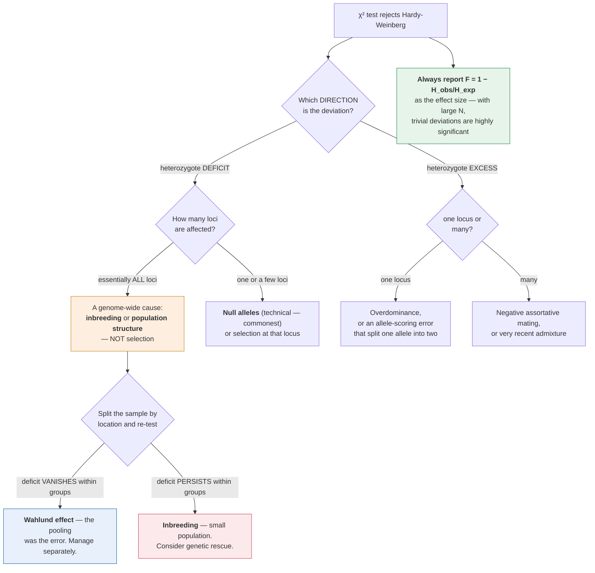

# Evolution & Ecology · Lesson 1.3: Hardy–Weinberg as a testable null

> ⏱ ~15 min · Module 1: Evolutionary Mechanisms & Population Genetics · Builds on: [general-biology 4.2](../../general-biology/lessons/04-02-evolution-in-populations.md), [1.2](01-02-modes-of-selection.md) · Unlocks: 1.4 (drift, $N_e$ & gene flow)

## Why this matters

[general-biology 4.2](../../general-biology/lessons/04-02-evolution-in-populations.md) derived $p^2 + 2pq + q^2 = 1$ and its five assumptions, and showed that the equilibrium is the reason evolution is *measurable* rather than merely narratable. This lesson does the thing that claim implies and the derivation does not: **it actually tests a real dataset**, and asks what the failure tells you.

That step is where the null model earns its keep. A chi-square value on its own says "something is happening." The **direction and pattern** of the deviation says *what*. Too few heterozygotes points at inbreeding or hidden structure; too many points at overdominance or a mistake in how you scored genotypes; a deviation at one locus and nowhere else points at selection or at genotyping error, and the two are distinguishable.

**Knowing what a rejection means is the whole skill**, and it is a skill because most rejections are not selection.

## The idea

**Hardy–Weinberg is a statement about one generation of random mating.** Given allele frequencies $p$ and $q$ in a gene pool, random union of gametes gives genotype frequencies $p^2 : 2pq : q^2$ — and it does so **in a single generation**, from any starting genotype distribution whatever.

$$\textbf{This is why it is such a strong null: no history is needed. One round of random mating erases it.}$$

*In words: it does not matter how unbalanced the genotypes were last year; if mating is random, this year's zygotes are in Hardy–Weinberg proportions.* A population can therefore be *in* Hardy–Weinberg equilibrium at birth and *out* of it in adults, if selection has acted in between — which is itself a useful diagnostic.

**Five assumptions, and each has a diagnostic failure signature:**

| Assumption violated | Signature |
|---|---|
| Random mating | **heterozygote deficit** at essentially every locus |
| No selection | deviation at **specific** loci, absent genome-wide |
| Large population (no drift) | random deviations, **no consistent direction** |
| No migration | heterozygote deficit if the source populations differ |
| No mutation | negligible over one generation |

**The direction of the deviation is the evidence.** A deficit of heterozygotes has three common causes — inbreeding, population structure (Wahlund, [genetics 4.3](../../genetics/lessons/04-03-inbreeding-relatedness-structure.md)), and *null alleles* that fail to amplify and cause true heterozygotes to be scored as homozygotes. **The third is a technical artefact and is by far the commonest explanation in real data.**

An *excess* of heterozygotes is rarer and points at overdominance, at negative assortative mating, or — again — at a scoring error, this time one that splits a single allele into two.

**Extending the model.** Hardy–Weinberg is not restricted to two autosomal alleles:

- **Multiple alleles:** genotype frequencies are the terms of $(p_1 + p_2 + \cdots + p_k)^2$.
- **X-linked loci:** females reach equilibrium in one generation; **males do not**, because a male's single X frequency is just the previous generation's *female* allele frequency. If the sexes start with different frequencies, the frequencies **oscillate and converge**, halving the difference each generation.

**That X-linked oscillation is a genuinely surprising result** and a good demonstration that "reaches equilibrium in one generation" is a property of the autosomal case, not a general truth.

## The formal version

**The chi-square test, done properly.**

$$\chi^{2} = \sum_i \frac{(O_i - E_i)^{2}}{E_i}, \qquad \mathrm{df} = (\text{genotype classes}) - (\text{alleles})$$

For two alleles: 3 genotype classes − 2 alleles = **1 df**, not 2. *In words: you lose a degree of freedom for estimating the allele frequency from the same data you are testing.* Critical value 3.84 at $p = 0.05$.

For $k$ alleles: $\mathrm{df} = \dfrac{k(k+1)}{2} - k = \dfrac{k(k-1)}{2}$.

**Procedure:**

1. Compute allele frequencies from the observed **genotype counts** (not from phenotypes).
2. Compute expected genotype counts as $N p^2$, $N \cdot 2pq$, $N q^2$.
3. Sum $(O-E)^2/E$.
4. Compare against $\chi^2$ with the correct df.
5. **Look at the sign of the deviations**, not only the total.

**A caution the textbooks under-state:** the chi-square approximation fails when expected counts are small (below about 5), which happens constantly for rare-homozygote classes. Use an **exact test** in that case — and note that with modern sample sizes the opposite problem dominates: with $N = 10^{5}$, biologically trivial deviations become overwhelmingly significant. **Report the effect size ($F$, or the heterozygote deficit as a proportion) alongside the $p$-value.**

**Quantifying the deviation as $F$.** From [genetics 4.3](../../genetics/lessons/04-03-inbreeding-relatedness-structure.md), the observed heterozygosity under a deviation of magnitude $F$ is $H_{\text{obs}} = 2pq(1-F)$, so

$$\boxed{\;F = 1 - \frac{H_{\text{obs}}}{H_{\text{exp}}}\;}$$

*In words: $F$ is the proportional heterozygote deficit.* Positive $F$ is a deficit, negative an excess. **This single number is the effect size** and is far more informative than the chi-square.

**X-linked convergence, worked.** Let $p_f$ and $p_m$ be the allele frequency in females and males. Sons get their X from their mother, and daughters get one from each parent:

$$p_m' = p_f, \qquad p_f' = \tfrac12(p_f + p_m).$$

The difference $d = p_f - p_m$ therefore obeys

$$d' = p_f' - p_m' = \tfrac12(p_f + p_m) - p_f = -\tfrac12 d .$$

$$\boxed{\;d_t = \left(-\tfrac12\right)^{t} d_0\;}$$

*In words: the sex difference halves and **flips sign** every generation, converging in a damped oscillation.* The overall allele frequency, weighted $\tfrac23$ female and $\tfrac13$ male (since females carry two X's and males one), is constant throughout.

**Using deviation from equilibrium to detect selection *within* a generation.** If genotypes are in Hardy–Weinberg proportions among newborns and deviate among adults, selection has acted between the two stages — and the fitness of each genotype can be read off directly:

$$w_i \propto \frac{\text{observed frequency in adults}}{\text{expected frequency at birth}}$$

**This is one of the few ways to measure fitness in a natural population without following individuals**, and it works precisely because Hardy–Weinberg supplies the counterfactual.

## Picture

**Read the first branch as the whole method.** The $p$-value says *something* is wrong; the **direction** of the deviation and **how many loci** show it say *what*. Selection is locus-specific, so a genome-wide deficit has a genome-wide cause — and the two candidates lead to opposite management decisions, which is why the split-and-re-test step is not optional.

## Worked examples

**Example 1 (mechanical — a full test, read for direction).** The MN blood group is codominant, so all three genotypes are distinguishable. In a sample of 1000 people: $MM$ 298, $MN$ 489, $NN$ 213. Test for Hardy–Weinberg equilibrium.

**Step 1 — allele frequencies** from genotype counts:

$$p_M = \frac{2(298) + 489}{2000} = \frac{1085}{2000} = 0.5425, \qquad p_N = 0.4575 .$$

**Step 2 — expected counts:**

$$E_{MM} = 1000(0.5425)^{2} = 294.3, \quad E_{MN} = 1000(2)(0.5425)(0.4575) = 496.4, \quad E_{NN} = 1000(0.4575)^{2} = 209.3 .$$

**Step 3 — chi-square:**

| Genotype | $O$ | $E$ | $O - E$ | $(O-E)^2/E$ |
|---|---|---|---|---|
| $MM$ | 298 | 294.3 | $+3.7$ | 0.047 |
| $MN$ | 489 | 496.4 | $-7.4$ | 0.110 |
| $NN$ | 213 | 209.3 | $+3.7$ | 0.065 |

$$\chi^{2} = 0.047 + 0.110 + 0.065 = \mathbf{0.222}.$$

**Step 4 — compare.** With 1 df, critical value 3.84. $0.222 \ll 3.84$, so **do not reject**: the population is consistent with Hardy–Weinberg equilibrium.

**Step 5 — the effect size, which the $p$-value alone would not give you:**

$$H_{\text{obs}} = \frac{489}{1000} = 0.489, \qquad H_{\text{exp}} = 0.4964, \qquad F = 1 - \frac{0.489}{0.4964} = \mathbf{0.015}.$$

A 1.5 percent heterozygote deficit — **negligible**, and consistent with sampling noise.

**Note what a null result does and does not establish.** It does **not** prove no evolution is occurring. Hardy–Weinberg is restored every generation by random mating, so weak selection at this locus would be almost invisible in a single generation's genotype counts. **Failing to reject a null model with low power is weak evidence for the null**, and with $N = 1000$ this test could not detect an $F$ below about 0.05.

**Example 2 (why you'd care — a rejected test, and how to find out why).** A conservation geneticist genotypes 500 individuals of an endangered plant at 10 microsatellite loci. **Nine loci** show a significant heterozygote deficit; the tenth is in equilibrium. Average $F$ across the nine is 0.18. (a) List the plausible explanations. (b) Which does the pattern favour, and why? (c) Design a test to distinguish the two leading candidates, and say what each result would look like.

(a) Four candidates:

1. **Inbreeding** — the plant is partly self-fertilizing or mates with close relatives.
2. **Population structure** (Wahlund) — the "population" sampled is really two or more subpopulations with different allele frequencies ([genetics 4.3](../../genetics/lessons/04-03-inbreeding-relatedness-structure.md)).
3. **Null alleles** — mutations in the PCR primer sites cause some alleles to fail to amplify, so true heterozygotes are scored as homozygotes.
4. **Selection** against heterozygotes at these loci.

(b) **The pattern — nine of ten loci affected, with a similar $F$ — strongly favours inbreeding or structure, and rules selection out.**

Selection is **locus-specific**: it acts on particular genes, not on nine unrelated microsatellites, which are non-coding and neutral. A genome-wide deficit is a *genome-wide* cause, and only inbreeding and structure act on the whole genome at once.

**Null alleles are also disfavoured by the pattern but not eliminated**, because they are a per-locus technical artefact. Nine of ten loci having null alleles at similar frequency would be unlucky; one or two would be entirely expected. The fact that the tenth locus is *clean* is itself mild evidence against a genome-wide biological cause and worth investigating — is that locus less variable, or was it typed differently?

(c) **Distinguishing inbreeding from population structure**, which is the real question, since both are biological and both matter for conservation:

**Test — genotype individuals with recorded spatial locations, and examine the distribution of $F$ across individuals.**

| Result | Interpretation |
|---|---|
| $F$ is **spread across individuals**, some near zero and some high, with no spatial clustering | **Inbreeding** — individuals differ in how related their parents were |
| Individuals cluster into **spatially coherent groups**, each internally in Hardy–Weinberg, with allele frequencies differing between groups | **Population structure** — the pooling was the error |

**Two more decisive checks:**

- **Runs of homozygosity.** True inbreeding produces long contiguous homozygous tracts, because an individual inherits large IBD segments from a recent common ancestor. Structure does not — it produces homozygosity scattered across the genome. This requires denser markers than 10 microsatellites, but it is definitive.
- **Test each putative subpopulation separately.** If the deficit **disappears** when the sample is split by location, it was Wahlund. If it **persists within each group**, it was inbreeding. **This is the cheapest test and should be done first.**

**Why it matters for the conservation decision, which is the point of the exercise:**

- If it is **inbreeding**, the population is small and losing heterozygosity, inbreeding depression is a live risk, and the management response is **genetic rescue** — translocating individuals from another population to restore heterozygosity ([4.5](04-05-behavior-conservation.md)).
- If it is **structure**, the "population" is several units that should be managed separately, and mixing them could cause **outbreeding depression** by breaking up locally adapted gene complexes.

**The two diagnoses lead to opposite management actions**, which is why the distinction is not academic and why a heterozygote deficit must never be reported as "inbreeding" without the test.

## Watch out

- **You might use 2 degrees of freedom.** It is 3 classes minus 2 alleles = **1 df**, because you estimated the allele frequency from the data you are testing.
- **You might compute allele frequencies from phenotypes.** For a codominant marker use genotype counts directly. For a dominant marker you cannot test Hardy–Weinberg at all, because you cannot distinguish $AA$ from $Aa$ — the test requires distinguishable genotypes.
- **You might read a rejection as selection.** Most rejections in real data are **null alleles** (technical) or **population structure** (biological but not selective). Selection is locus-specific; genome-wide deviations have genome-wide causes.
- **You might report only the $p$-value.** With large $N$, trivial deviations are highly significant. Report $F$ — the proportional heterozygote deficit — as the effect size.
- **You might read a non-rejection as "no evolution."** Random mating restores Hardy–Weinberg every generation, so a single generation's genotype counts have little power to detect weak selection.
- **You might assume one generation of random mating always restores equilibrium.** True for autosomal loci; **false for X-linked loci**, where the sexes converge in a damped oscillation over several generations.

## One-liner

> One round of random mating restores Hardy–Weinberg from any starting point, which is what makes it a null with no history — so the informative thing about a rejection is never the $p$-value but the direction of the deviation and whether it appears at one locus or all of them.

## Problems

**P1 (🟢)** In a sample of 400 individuals at a codominant locus: $AA$ 152, $Aa$ 190, $aa$ 58. (a) Compute the allele frequencies. (b) Compute expected genotype counts. (c) Compute $\chi^2$ and state your conclusion (critical value 3.84 at 1 df).

**P2 (🟡)** A sample of 1000 shows $AA$ 490, $Aa$ 220, $aa$ 290. (a) Compute allele frequencies and expected counts. (b) Compute $\chi^2$ and $F$. (c) The deviation is found at all 15 loci examined. Give the two most likely explanations and say what single further analysis would separate them.

**P3 (🔴, bridges to 1.4 and to fitness estimation)** At an X-linked locus, generation 0 has allele frequency $p_f = 0.8$ in females and $p_m = 0.2$ in males. (a) Compute $p_f$ and $p_m$ for generations 1 through 4. (b) Show that the overall allele frequency $\bar p = \tfrac23 p_f + \tfrac13 p_m$ is constant, and compute it. (c) Explain in one sentence why the sexes converge in an oscillation rather than monotonically, and state what this shows about the claim that Hardy–Weinberg is reached in one generation.

Solutions

**P1 (a)** $$p = \frac{2(152) + 190}{800} = \frac{494}{800} = \mathbf{0.6175}, \qquad q = \mathbf{0.3825}.$$

**(b)** $$E_{AA} = 400(0.6175)^{2} = \mathbf{152.5}, \quad E_{Aa} = 400(2)(0.6175)(0.3825) = \mathbf{189.0}, \quad E_{aa} = 400(0.3825)^{2} = \mathbf{58.5}.$$

**(c)**

| | $O$ | $E$ | $(O-E)^2/E$ |
|---|---|---|---|
| $AA$ | 152 | 152.5 | 0.0016 |
| $Aa$ | 190 | 189.0 | 0.0053 |
| $aa$ | 58 | 58.5 | 0.0043 |

$$\chi^{2} = \mathbf{0.012}.$$

Against 3.84 at 1 df: **do not reject.** The population is in excellent agreement with Hardy–Weinberg — indeed suspiciously good agreement, which in a real dataset would be worth a second look at whether the "observed" counts were in fact back-calculated from allele frequencies.

**P2 (a)** $$p = \frac{2(490) + 220}{2000} = \frac{1200}{2000} = 0.60, \qquad q = 0.40 .$$

$$E_{AA} = 1000(0.36) = 360, \quad E_{Aa} = 1000(0.48) = 480, \quad E_{aa} = 1000(0.16) = 160 .$$

**(b)**

| | $O$ | $E$ | $(O-E)^2/E$ |
|---|---|---|---|
| $AA$ | 490 | 360 | $130^2/360 = 46.9$ |
| $Aa$ | 220 | 480 | $260^2/480 = 140.8$ |
| $aa$ | 290 | 160 | $130^2/160 = 105.6$ |

$$\chi^{2} = 46.9 + 140.8 + 105.6 = \mathbf{293.3}.$$

Overwhelming rejection, with a **massive heterozygote deficit**.

$$F = 1 - \frac{H_{\text{obs}}}{H_{\text{exp}}} = 1 - \frac{0.220}{0.480} = \mathbf{0.542}.$$

**An $F$ of 0.54 is extreme** — higher than the offspring of full siblings ($F = 0.25$), and higher than repeated selfing would produce in a couple of generations. That magnitude is itself a clue: it is too large for ordinary consanguinity.

**(c)** The two most likely explanations, given that all 15 loci show it:

1. **Population structure (Wahlund effect)** — the sample pools two or more groups with very different allele frequencies. An $F$ of 0.54 corresponds to $F_{ST} = 0.54$, which would mean profoundly differentiated groups (compare human continental $F_{ST} \approx 0.10$–$0.15$) — so if this is structure, the groups are essentially separate populations or possibly separate species.
2. **Extreme inbreeding**, most plausibly a **highly selfing organism**. A consistently selfing plant approaches $F \to 1$, and $F = 0.54$ is roughly what a species with a selfing rate around 70 percent would show at equilibrium.

*(Null alleles are essentially ruled out at this magnitude across 15 loci — a null allele would have to be at very high frequency at every locus simultaneously.)*

**The single further analysis: split the sample and re-test each subgroup separately.**

- If the deficit **vanishes** within subgroups — each is in Hardy–Weinberg internally — it was **structure**, and the pooling was the error.
- If the deficit **persists** within every subgroup at similar magnitude, it was **inbreeding**, and the organism is a selfer or the population is very small.

You need a basis for splitting. If spatial or collection data exist, split on those. If not, use a **clustering method on the multilocus genotypes** (STRUCTURE, or a principal-components analysis) which finds the groups from the genotypes themselves — the same approach that handles stratification in GWAS ([genetics 4.4](../../genetics/lessons/04-04-linkage-disequilibrium-gwas.md)).

**P3 (a)** Recursions: $p_m' = p_f$ and $p_f' = \tfrac12(p_f + p_m)$.

| Generation | $p_f$ | $p_m$ | $d = p_f - p_m$ |
|---|---|---|---|
| 0 | 0.800 | 0.200 | $+0.600$ |
| 1 | $\tfrac12(0.8+0.2) = 0.500$ | 0.800 | $-0.300$ |
| 2 | $\tfrac12(0.5+0.8) = 0.650$ | 0.500 | $+0.150$ |
| 3 | $\tfrac12(0.65+0.5) = 0.575$ | 0.650 | $-0.075$ |
| 4 | $\tfrac12(0.575+0.65) = 0.6125$ | 0.575 | $+0.0375$ |

The difference halves and **flips sign** each generation, exactly as $d_t = (-\tfrac12)^t d_0$ predicts, converging on 0.60.

**(b)** $$\bar p = \tfrac23 p_f + \tfrac13 p_m .$$

| Gen | $\bar p$ |
|---|---|
| 0 | $\tfrac23(0.8) + \tfrac13(0.2) = 0.5333 + 0.0667 = \mathbf{0.600}$ |
| 1 | $\tfrac23(0.5) + \tfrac13(0.8) = 0.3333 + 0.2667 = \mathbf{0.600}$ |
| 2 | $\tfrac23(0.65) + \tfrac13(0.5) = 0.4333 + 0.1667 = \mathbf{0.600}$ |
| 3 | $\tfrac23(0.575) + \tfrac13(0.65) = 0.3833 + 0.2167 = \mathbf{0.600}$ |
| 4 | $\tfrac23(0.6125) + \tfrac13(0.575) = 0.4083 + 0.1917 = \mathbf{0.600}$ |

**Constant at 0.600**, which is the equilibrium the two sexes converge to. The weighting is $\tfrac23 : \tfrac13$ because females carry two X chromosomes and males one, so two-thirds of a population's X chromosomes are in females.

*Algebraically:* $\bar p' = \tfrac23 p_f' + \tfrac13 p_m' = \tfrac23 \cdot \tfrac12(p_f+p_m) + \tfrac13 p_f = \tfrac13 p_f + \tfrac13 p_m + \tfrac13 p_f = \tfrac23 p_f + \tfrac13 p_m = \bar p$ ✓

**(c)** The oscillation happens because **a male's allele frequency is his mother's generation's female frequency** — sons inherit their only X from their mothers, so the male frequency always *lags one generation behind* the female frequency and overshoots it.

Concretely: at generation 0 females are high (0.8) and males low (0.2). Their sons get their X from those high-frequency mothers, so generation-1 males are *high* (0.8) — while generation-1 females, averaging both parents, are intermediate (0.5). The sexes have **swapped which is higher**, and the process repeats with half the amplitude.

**What this shows about the "one generation" claim:** it is a property of the **autosomal** case, not a general truth about Hardy–Weinberg. Autosomal loci reach equilibrium in one generation because both sexes contribute symmetrically. X-linked loci do not, because transmission is asymmetric between the sexes — and it takes roughly five to seven generations for the difference to become negligible.

**The practical consequence:** if you find an X-linked locus with different allele frequencies in males and females, **do not conclude selection**. It may simply be a population that has not yet equilibrated after admixture or a recent founding event — and the damped oscillation is the signature that distinguishes it, since selection would not produce an alternating sex difference.

## Flashback

**From Lesson 1.2 (modes of selection):** A population of fish has mean body depth 8.0 cm with variance 2.25 cm². After a year with a new gape-limited predator, survivors have mean 8.9 cm and variance 1.44 cm². (a) Compute $S$ and $\beta$. (b) Name both modes of selection operating. (c) With $h^2 = 0.5$, predict the offspring mean.

Solution

**(a)** $$S = 8.9 - 8.0 = \mathbf{0.9\ \mathrm{cm}}, \qquad \beta = \frac{S}{\sigma_z^{2}} = \frac{0.9}{2.25} = \mathbf{0.40\ \text{per cm}}.$$

**(b)** The **mean shifted** upward by 0.9 cm — **directional** selection, $\beta > 0$. The **variance fell** from 2.25 to 1.44, a 36 percent reduction — a **stabilizing** component, $\gamma < 0$.

Both at once, as in [1.2](01-02-modes-of-selection.md) P2: the fitness surface is tilted *and* peaked. (And as noted there, some variance reduction follows automatically from truncating a distribution, so a careful analysis would attribute only the excess to genuine stabilizing selection.)

The biology is consistent: a gape-limited predator cannot swallow deep-bodied fish, favouring greater depth, while very deep bodies presumably carry costs in swimming performance — producing an intermediate optimum that has moved upward.

**(c)** $$R = h^{2}S = 0.5 \times 0.9 = 0.45\ \mathrm{cm},$$

so the offspring mean is $8.0 + 0.45 = \mathbf{8.45\ \mathrm{cm}}$ — half of the survivors' 8.9 cm advantage, with the other half lost to regression toward the mean.

## Connections

- **Backward:** [general-biology 4.2](../../general-biology/lessons/04-02-evolution-in-populations.md) derived the equilibrium and the five conditions; this lesson tests them against data and reads the failures.
- **Forward:** [1.4](01-04-drift-ne-gene-flow.md) takes the "large population" assumption seriously and asks what happens when it fails; [1.5](01-05-mutation-balance-of-forces.md) takes on "no mutation."
- **Sideways:** the heterozygote-deficit diagnosis — inbreeding versus Wahlund versus null alleles — is [genetics 4.3](../../genetics/lessons/04-03-inbreeding-relatedness-structure.md); the same clustering methods that separate them are what correct GWAS stratification in [genetics 4.4](../../genetics/lessons/04-04-linkage-disequilibrium-gwas.md); the chi-square goodness-of-fit test is [prob-stat-refresher 5.2](../../prob-stat-refresher/syllabus.md).
