# Evolution & Ecology · Lesson 2.1: What is a species?

> ⏱ ~15 min · Module 2: Speciation, Phylogenetics & Macroevolution · Builds on: [1.5](01-05-mutation-balance-of-forces.md), [general-biology 4.3](../../general-biology/lessons/04-03-tree-of-life.md) · Unlocks: 2.2 (how species split)

## Why this matters

Module 1 tracked allele frequencies within a population and never had to ask what a population *was*. Module 2 asks how one lineage becomes two, and that question is unanswerable until you can say what "two" means.

The honest answer is that **species are not a natural kind with sharp edges**, and the reason is evolution itself. Divergence is continuous; a species concept demands a line; and any line drawn across a continuum will be arbitrary somewhere. This is not a failure of biology to define its terms — **it is a prediction of the theory.** If species were always cleanly separable, common descent by gradual divergence would be in trouble.

What matters practically is that different concepts are *useful for different purposes*, that they disagree in predictable places, and that the disagreements are informative rather than embarrassing. A conservation manager, a palaeontologist and a bacteriologist need different definitions, and none of them is wrong.

## The idea

**The main concepts, and what each is for.**

| Concept | A species is… | Works well for | Fails for |
|---|---|---|---|
| **Biological (BSC)** | groups that interbreed and are reproductively isolated from other such groups | sexual, sympatric, extant organisms | **asexuals, fossils, allopatric populations**, anything hybridizing |
| **Morphological** | a distinct morphological cluster | fossils, museum work, field guides | **cryptic species**, sexual dimorphism, polymorphism |
| **Phylogenetic** | the smallest monophyletic group with a shared derived character | anything with sequence data | tends to **split excessively**; every isolated population qualifies |
| **Ecological** | a lineage occupying a distinct niche | microbes, adaptive radiations | niches are hard to delimit |
| **Genotypic cluster** | a distinguishable cluster in genotype space, with a gap | modern genomic data | needs a threshold you must choose |

**The biological species concept has the sharpest logic and the narrowest reach.** Its criterion — reproductive isolation — is genuinely mechanistic and testable, and it is why the BSC dominated twentieth-century thinking. But it cannot be *applied* to an asexual organism (there is no interbreeding to test), to a fossil (you cannot cross it with anything), or to two populations that never meet (the test is hypothetical).

$$\textbf{And "never meet" covers most of the cases people actually want to classify.}$$

**Reproductive isolation is a set of barriers, not one thing.** The distinction that matters is *when* the barrier acts:

**Prezygotic** — no zygote is formed:

| Barrier | Mechanism |
|---|---|
| Ecological/habitat | the two never encounter each other |
| Temporal | they breed at different times of day or year |
| Behavioural | courtship signals do not match |
| Mechanical | genitalia or flower structure incompatible |
| Gametic | sperm cannot fertilize the egg |

**Postzygotic** — a zygote forms but fails:

| Barrier | Mechanism |
|---|---|
| Hybrid inviability | the hybrid dies |
| Hybrid sterility | the hybrid lives and cannot breed (mule) |
| Hybrid breakdown | $F_1$ is fine, $F_2$ or backcross generations fail |

**Prezygotic barriers are cheaper**, because postzygotic isolation wastes gametes and parental investment on offspring that fail. **This asymmetry has a consequence**: where two diverging populations come back into contact and hybrids are unfit, selection favours anything that stops them mating in the first place — **reinforcement** ([2.2](02-02-how-species-split.md)).

**Ring species and the point they make.** A chain of populations around a barrier, each interbreeding with its neighbours, with the two ends overlapping and *not* interbreeding. The classic candidates are *Ensatina* salamanders around California's Central Valley and greenish warblers around the Tibetan plateau.

**A ring species is not a curiosity — it is the continuum made spatial.** Every adjacent pair is one species by the BSC and the two ends are two species, so the concept produces a contradiction. That is exactly what a theory of gradual divergence predicts, and the fact that ring species are *rare* is only because the geometry required is demanding, not because the underlying continuity is.

## The formal version

**Quantifying reproductive isolation.** Total isolation is built from sequential barriers, and each acts on what got past the previous one. If barrier $i$ blocks a fraction $RI_i$ of what reaches it, the total is

$$\boxed{\;RI_{\text{total}} = 1 - \prod_i (1 - RI_i)\;}$$

*In words: multiply the leak-through rates and subtract from one.* Note the ordering matters for **contribution**: an early barrier that blocks 90 percent leaves only 10 percent for later barriers to act on, so later barriers contribute far less to the total even if they are individually strong.

$$\text{absolute contribution of barrier } i = RI_i \prod_{j<i}(1 - RI_j)$$

**This is why measured "contributions to isolation" in real species pairs are dominated by whichever barrier acts first**, and why a strong postzygotic barrier can be nearly irrelevant if a prezygotic one already blocked 99 percent.

**Haldane's rule.** In hybrids, when one sex is absent, rare, or sterile, **it is the heterogametic sex** — XY males in mammals and flies, ZW females in birds and butterflies.

*In words: whichever sex has two different sex chromosomes suffers first.* The rule holds across an enormous range of taxa and has two main explanations, both probably operating:

- **Dominance theory** — recessive incompatibility alleles on the X are exposed in the hemizygous sex ([genetics 2.1](../../genetics/lessons/02-01-chromosomal-basis-sex-linkage.md)) and masked in the homogametic sex.
- **Faster-male theory** — spermatogenesis is unusually sensitive to disruption, so male sterility arises first in taxa with XY males.

**Haldane's rule is one of the most robust empirical generalizations in evolutionary biology**, and it is a genuine prediction rather than a description: it says which sex will fail before you have looked.

**Dobzhansky–Muller incompatibilities — how isolation evolves without either lineage passing through an unfit state.** The puzzle: if isolation requires a new allele that is incompatible with the ancestral one, how does it spread, given that its first carriers are heterozygous with the ancestor?

The resolution requires **two loci**. Start from an ancestor $AABB$:

$$\text{Lineage 1: } AABB \to \mathbf{aa}BB \qquad\qquad \text{Lineage 2: } AABB \to AA\mathbf{bb}$$

Each substitution is fine **in its own genetic background** — $a$ was never tested against $b$, and $b$ was never tested against $a$. But the hybrid is $AaBb$ and contains the $a$–$b$ combination **for the first time in the history of either lineage**, and that combination is incompatible.

$$\boxed{\;\text{Incompatibility is a property of a } \textit{combination} \text{ that natural selection never had the opportunity to test.}\;}$$

*In words: nobody ever had to be unfit; the unfitness is created by putting together two things that never met.*

**And the consequence is quantitative.** The number of possible pairwise incompatibilities grows with the **square** of the number of substitutions:

$$\text{potential incompatible pairs} \propto \binom{k}{2} \approx \frac{k^{2}}{2}$$

**So reproductive isolation should accumulate faster than linearly with divergence time — the "snowball effect"** — and it does: measured hybrid incompatibility in *Drosophila* and other systems rises roughly as the square of divergence, which is a genuine confirmation of a model proposed decades before it could be tested.

## Picture

```mermaid
flowchart LR
    subgraph PRE["PREZYGOTIC &mdash; cheaper, and therefore favoured by reinforcement"]
        E["Ecological:<br/>never meet"] --> T["Temporal:<br/>breed at different times"] --> B["Behavioural:<br/>signals don't match"] --> M["Mechanical:<br/>structures incompatible"] --> G["Gametic:<br/>sperm can't fertilize"]
    end
    G --> Z["a zygote forms"]
    subgraph POST["POSTZYGOTIC &mdash; wasteful: gametes and investment already spent"]
        Z --> I["Hybrid inviability:<br/>it dies"] --> S["Hybrid sterility:<br/>it lives, can't breed"] --> BD["Hybrid breakdown:<br/>F&#8321; fine, F&#8322; fails"]
    end

    DM["<b>Dobzhansky-Muller:</b><br/>ancestor AABB<br/>lineage 1 &rarr; aaBB &nbsp;&nbsp; lineage 2 &rarr; AAbb<br/>each fine in ITS OWN background<br/>hybrid AaBb has the a-b combination<br/>for the first time ever"] -.->|"produces"| POST
    DM --> SNOW["Pairs grow as k&sup2;/2<br/>&rarr; isolation SNOWBALLS<br/>with divergence time"]

    style DM fill:#fdeee0,stroke:#c9871f
    style SNOW fill:#e8dff5,stroke:#6a4c93
```

**The Dobzhansky–Muller box is the conceptual heart.** Isolation does not require either lineage to pass through a maladapted state — it requires only that two lineages accumulate different changes, and that a combination never tested by selection turns out to be bad. Since the number of untested combinations grows quadratically, isolation accelerates.

## Worked examples

**Example 1 (mechanical — compute total isolation and each barrier's contribution).** Two plant species have: habitat isolation blocking 60 percent of potential encounters; flowering-time overlap blocking a further 50 percent of what remains; pollinator specificity blocking 80 percent of what still remains; and hybrid sterility of 90 percent among any hybrids formed. (a) Compute total isolation. (b) Compute each barrier's absolute contribution. (c) Comment on which barrier "matters most."

(a) $$RI_{\text{total}} = 1 - (1-0.6)(1-0.5)(1-0.8)(1-0.9) = 1 - (0.4)(0.5)(0.2)(0.1) = 1 - 0.004 = \mathbf{0.996}.$$

**99.6 percent isolated** — only 4 in 1000 potential matings produce a fertile hybrid.

(b) Each barrier's absolute contribution is what it blocks out of the original total:

| Barrier | $RI_i$ | Fraction reaching it | Absolute contribution |
|---|---|---|---|
| Habitat | 0.60 | 1.000 | $0.60 \times 1.000 = \mathbf{0.600}$ |
| Flowering time | 0.50 | 0.400 | $0.50 \times 0.400 = \mathbf{0.200}$ |
| Pollinator | 0.80 | 0.200 | $0.80 \times 0.200 = \mathbf{0.160}$ |
| Hybrid sterility | 0.90 | 0.040 | $0.90 \times 0.040 = \mathbf{0.036}$ |

Sum: $0.600 + 0.200 + 0.160 + 0.036 = 0.996$ ✓

(c) **Habitat isolation contributes 60 percent of the total, and hybrid sterility contributes 3.6 percent — even though hybrid sterility is by far the *strongest* individual barrier at 90 percent.**

The reason is sequence. By the time hybrids could form, only 4 percent of potential matings are still in play, so the sterility barrier — however severe — can only act on that residue.

**This has a real consequence for how speciation is studied.** Postzygotic barriers are the ones that are easy to measure in the laboratory and the ones that dominate the theoretical literature (Dobzhansky–Muller, Haldane's rule). **Prezygotic and especially ecological barriers usually do most of the actual work in nature**, and they are much harder to measure. Studies that quantify barriers sequentially in the field consistently find that the first barrier in the sequence dominates.

**Example 2 (why you'd care — the concepts disagree, and each disagreement is informative).** Consider four cases and decide how many species each concept recognizes.

**(a) *Ensatina* salamanders**, forming a ring around California's Central Valley: adjacent populations interbreed all the way around, but the two terminal forms in southern California coexist without interbreeding.

- **BSC:** contradictory. Every adjacent pair is one species by the interbreeding criterion, and the two ends are two species. The BSC gives **one species and two species simultaneously**, which is not a defect in the data.
- **Phylogenetic:** several — each geographically and genetically distinguishable population qualifies.
- **What it shows:** speciation is a *process*, and the BSC asks a yes-or-no question about a continuous variable. *Ensatina* is speciation caught in the middle, laid out in space instead of in time.

**(b) *Amazon molly* (*Poecilia formosa*)**, an all-female fish that reproduces gynogenetically — it needs sperm from a related species to trigger development but does not use the DNA.

- **BSC:** **inapplicable.** There is no interbreeding within it to test, and its relationship to the sperm donor is parasitic rather than reproductive.
- **Phylogenetic/genotypic cluster:** a clear, distinct clonal lineage — **one species**, no difficulty.
- **What it shows:** the BSC's criterion is not merely hard to apply to asexuals; it is *undefined*. This is a large exclusion, since most of the biological world by both species count and biomass is asexual or predominantly so.

**(c) Two populations of a beetle**, morphologically identical, that occur in the same forest but breed on different host plants and show 5 percent mitochondrial sequence divergence with no shared haplotypes.

- **Morphological:** **one species** — they are indistinguishable.
- **Phylogenetic:** **two** — reciprocally monophyletic with diagnostic characters.
- **Ecological:** **two** — distinct niches.
- **BSC:** requires a test. Do they interbreed where they meet? The absence of shared haplotypes suggests not.
- **What it shows: cryptic species are common**, and morphology systematically undercounts. Molecular surveys routinely find that a "species" in the old sense is several — which matters enormously for biodiversity estimates and for conservation, since a widespread species that is really five narrow endemics has a very different extinction risk.

**(d) Polar bears and brown bears**, which produce fertile hybrids and are known to have exchanged genes repeatedly through the Pleistocene.

- **BSC:** **one species**, strictly — they are not reproductively isolated.
- **Morphological, ecological, phylogenetic:** **two**, clearly — different size, coat, diet, habitat, behaviour, and distinct genomic clusters.
- **What it shows:** **reproductive isolation is not necessary for lineages to remain distinct.** Ecological separation and selection against hybrids in either parental environment can maintain two clusters despite gene flow. This is now understood to be common — hybridization is far more widespread than the mid-century view allowed, including in human ancestry ([Neanderthal introgression](../../genetics/lessons/04-04-linkage-disequilibrium-gwas.md)) — and it is the main reason the BSC has lost its former dominance.

**The general lesson across all four:** the concepts disagree in **predictable, diagnosable places** — asexuals, allopatry, cryptic divergence, and hybridizing pairs. **Knowing which concept fails where is more useful than picking a favourite**, and a disagreement between concepts is a description of where a lineage sits in the speciation process.

## Watch out

- **You might look for the correct species concept.** They are tools with different domains. The BSC is mechanistically the sharpest and applies to the smallest fraction of life.
- **You might think the BSC works for allopatric populations.** The test is counterfactual — "would they interbreed if they met?" — and is usually unanswerable. Most taxonomic decisions about allopatric populations are made on other grounds.
- **You might treat hybridization as evidence they are one species.** Fertile hybrids occur between many well-marked lineages. Ecological and selective separation can maintain distinctness through gene flow.
- **You might assume the strongest barrier matters most.** Contribution depends on **position in the sequence**: an early barrier that blocks 60 percent contributes far more than a late one blocking 90 percent.
- **You might expect isolation to accumulate linearly with time.** Dobzhansky–Muller incompatibilities grow as $k^2/2$, so isolation **snowballs**.
- **You might read a ring species as a paradox.** It is a prediction: a theory of continuous divergence must produce cases where a discrete concept fails.

## One-liner

> Species have fuzzy edges because divergence is continuous, and that is a prediction of the theory rather than a failure of definition — so ask which concept suits your question, and remember that isolation is built from sequential barriers in which the *first* one usually does most of the work.

## Problems

**P1 (🟢)** Two species have four sequential barriers with strengths 0.40, 0.70, 0.50 and 0.95. (a) Compute total isolation. (b) Compute the absolute contribution of the first and last barriers. (c) Which contributes more, and why?

**P2 (🟡)** In a cross between two *Drosophila* species, $F_1$ females are fertile and $F_1$ males are sterile. In a cross between two bird species, $F_1$ males are fertile and $F_1$ females are sterile. (a) Name the rule and state it. (b) Explain why the two cases point in opposite directions with respect to sex. (c) Give the dominance-theory explanation, and say what it predicts about where incompatibility genes should be located in the genome.

**P3 (🔴, bridges to 2.2 and to 2.3)** Two lineages diverge from a common ancestor and each accumulates substitutions at a constant rate. (a) After $k$ substitutions in each lineage, how many novel two-locus combinations exist in a hybrid that neither lineage has ever tested? (b) If a fixed small fraction $\varepsilon$ of such combinations is incompatible, how does the expected number of incompatibilities scale with divergence time? (c) Explain what this predicts about the relationship between genetic distance and hybrid fitness, and describe the observation that would confirm or refute it.

Solutions

**P1 (a)** $$RI_{\text{total}} = 1 - (1-0.40)(1-0.70)(1-0.50)(1-0.95) = 1 - (0.60)(0.30)(0.50)(0.05) = 1 - 0.0045 = \mathbf{0.9955}.$$

**(b)** *First barrier:* everything reaches it, so its contribution is $0.40 \times 1.000 = \mathbf{0.400}$.

*Last barrier:* the fraction reaching it is $(0.60)(0.30)(0.50) = 0.090$, so its contribution is $0.95 \times 0.090 = \mathbf{0.0855}$.

**(c)** **The first barrier contributes 4.7 times more**, despite being much weaker individually (0.40 against 0.95).

The reason is position in the sequence. The first barrier acts on 100 percent of potential matings; the last acts on the 9 percent that survived everything before it. **A barrier's contribution is its strength times the fraction that reaches it, and that fraction shrinks multiplicatively.**

The practical implication for studying speciation: **the barriers that are easiest to measure in the laboratory (postzygotic) are usually the ones contributing least in nature**, because ecological and behavioural barriers have already removed almost everything.

**P2 (a)** **Haldane's rule:** when one sex among $F_1$ hybrids is absent, rare, or sterile, it is the **heterogametic sex** — the one with two different sex chromosomes.

**(b)** Because the sexes' chromosomal constitutions are reversed in the two groups:

| | Heterogametic sex | Haldane's rule predicts |
|---|---|---|
| *Drosophila* (and mammals) | **male**, XY | male hybrids affected ✓ |
| Birds (and butterflies) | **female**, ZW | female hybrids affected ✓ |

**Both observations confirm the rule**, and the fact that they point in opposite directions with respect to sex is the strongest possible evidence that the rule is about **chromosomal constitution rather than about maleness**. If it were something intrinsic to males — greater physiological fragility, say — birds would not fit.

**(c) Dominance theory.** Incompatibility alleles are, on average, partially or fully **recessive** — as most new deleterious alleles are ([genetics 1.2](../../genetics/lessons/01-02-when-dominance-breaks-down.md)).

In the **heterogametic** sex, all X-linked (or Z-linked) alleles are **hemizygous** ([genetics 2.1](../../genetics/lessons/02-01-chromosomal-basis-sex-linkage.md)) — there is no second copy to mask them, so every recessive X-linked incompatibility from the other lineage is fully expressed.

In the **homogametic** sex, the same alleles are heterozygous with the conspecific allele and are masked.

$$\textbf{The heterogametic sex expresses the full recessive incompatibility load; the homogametic sex expresses only the dominant part.}$$

**What it predicts about genome location:** incompatibility genes should be **disproportionately located on the X (or Z) chromosome**, because that is where hemizygosity gives them their outsized effect. If incompatibilities were spread uniformly, the heterogametic sex would suffer no more than the homogametic one.

**This is the "large X effect," and it is observed**: genetic mapping of hybrid sterility in *Drosophila* consistently finds a density of incompatibility factors on the X several times higher than on autosomes of comparable size. Two predictions, both confirmed, from one theory — which is why dominance theory is favoured over faster-male theory as the general explanation, though both probably contribute in XY taxa. (Faster-male theory notably cannot explain the bird case at all, since it predicts males should suffer in every taxon.)

**P3 (a)** Lineage 1 has $k$ substitutions, lineage 2 has $k$ substitutions. A hybrid carries alleles from both. The combinations that are **novel** are those pairing a lineage-1 derived allele with a lineage-2 derived allele — one from each set:

$$\text{novel pairs} = k \times k = \mathbf{k^{2}}.$$

(Pairs *within* a lineage have been tested by selection in that lineage's background; only cross-lineage pairs are untested.)

**(b)** If a fraction $\varepsilon$ of novel combinations is incompatible:

$$\mathbb{E}[\text{incompatibilities}] = \varepsilon k^{2}.$$

Substitutions accumulate at a roughly constant rate — from [1.4](01-04-drift-ne-gene-flow.md), the neutral rate is $k = \mu t$ — so

$$\mathbb{E}[\text{incompatibilities}] \propto \varepsilon\,(\mu t)^{2} \;\propto\; t^{2}.$$

$$\boxed{\;\text{Incompatibilities accumulate as the } \textbf{square} \text{ of divergence time — the snowball effect.}\;}$$

**(c) Prediction: hybrid fitness should decline faster than linearly with genetic distance**, and the decline should accelerate.

More precisely, if each incompatibility independently reduces hybrid fitness by a factor $(1-\delta)$:

$$w_{\text{hybrid}} \approx (1-\delta)^{\varepsilon k^{2}} \approx e^{-\delta\varepsilon k^{2}},$$

so hybrid fitness falls off as a **Gaussian in genetic distance** — nearly flat at first, then collapsing.

**How to test it.** Take a group with many species pairs at varying divergence — *Drosophila* is the classic system, with hundreds of pairs — and for each pair measure:

- **genetic distance** (synonymous-site divergence, which is a clock, [1.4](01-04-drift-ne-gene-flow.md) and [2.3](02-03-inferring-trees-dating.md));
- **hybrid incompatibility** (proportion of hybrids sterile or inviable, or the number of mapped incompatibility loci).

**Confirmation** looks like a plot in which incompatibility rises with an upward curvature, fitted better by $t^2$ than by $t$ — and, more decisively, a **direct count of incompatibility loci** that grows quadratically with divergence. This second test is the strong one, because the proportion-of-sterile-hybrids measure saturates at 1 and cannot distinguish curvature well once isolation is nearly complete.

**Refutation** looks like a linear relationship, or worse a decelerating one, which would mean either that incompatibilities do not interact pairwise as the model assumes, or that most isolation arises from a small number of large-effect changes (chromosomal rearrangements, say) rather than from accumulated pairwise incompatibilities.

**What was actually found:** direct counts of incompatibility loci in *Drosophila* and in *Solanum* do grow faster than linearly, consistent with the snowball. **This is a rare case of a model proposed in the 1930s and 1940s making a quantitative prediction that could not be tested for sixty years and then was.**

## Flashback

**From Lesson 1.5 (mutation–selection balance and overdominance):** (a) A recessive deleterious allele has $\mu = 10^{-5}$ and $s = 0.04$. Find $\hat q$ and the frequency of affected homozygotes. (b) Compute the mutational load and state what it depends on. (c) At another locus, $w_{AA} = 0.8$, $w_{Aa} = 1.0$, $w_{aa} = 0.5$. Find the equilibrium frequency and the segregational load.

Solution

**(a)** $$\hat q = \sqrt{\frac{\mu}{s}} = \sqrt{\frac{10^{-5}}{0.04}} = \sqrt{2.5\times10^{-4}} = \mathbf{0.0158}.$$

$$\hat q^{2} = 2.5\times10^{-4}, \ \text{i.e. } \mathbf{1\ \text{in}\ 4000}\ \text{affected}.$$

**(b)** $$L = s\hat q^{2} = 0.04 \times 2.5\times10^{-4} = \mathbf{10^{-5}} = \mu .$$

**The load equals the mutation rate and is independent of $s$** — Haldane's principle. Making the allele ten times milder would raise $\hat q$ by $\sqrt{10}$ and raise $\hat q^2$ by 10, exactly cancelling the tenfold reduction in $s$.

**(c)** $$w_{AA} = 1-s = 0.8 \Rightarrow s = 0.2; \qquad w_{aa} = 1-t = 0.5 \Rightarrow t = 0.5 .$$

$$\hat q = \frac{s}{s+t} = \frac{0.2}{0.7} = \mathbf{0.286}.$$

$$\bar w = 1 - \frac{st}{s+t} = 1 - \frac{(0.2)(0.5)}{0.7} = 1 - 0.143 = 0.857 .$$

$$\text{segregational load} = 1 - 0.857 = \mathbf{0.143}.$$

**A 14.3 percent permanent fitness cost** — vastly larger than the $10^{-5}$ mutational load in (a), which is precisely why overdominance cannot be the general explanation for genome-wide polymorphism: a few thousand such loci would drive mean fitness to zero.

## Connections

- **Backward:** [1.5](01-05-mutation-balance-of-forces.md) supplied the standing variation that diverging lineages draw on; [general-biology 4.3](../../general-biology/lessons/04-03-tree-of-life.md) introduced clades, which the phylogenetic species concept formalizes.
- **Forward:** [2.2](02-02-how-species-split.md) asks how the barriers catalogued here actually arise, and reinforcement is the direct consequence of prezygotic barriers being cheaper than postzygotic ones.
- **Sideways:** hemizygosity and the large-X effect are [genetics 2.1](../../genetics/lessons/02-01-chromosomal-basis-sex-linkage.md); the recessiveness of new deleterious alleles that dominance theory depends on is [genetics 1.2](../../genetics/lessons/01-02-when-dominance-breaks-down.md); the neutral substitution clock that makes the snowball testable is [1.4](01-04-drift-ne-gene-flow.md).
