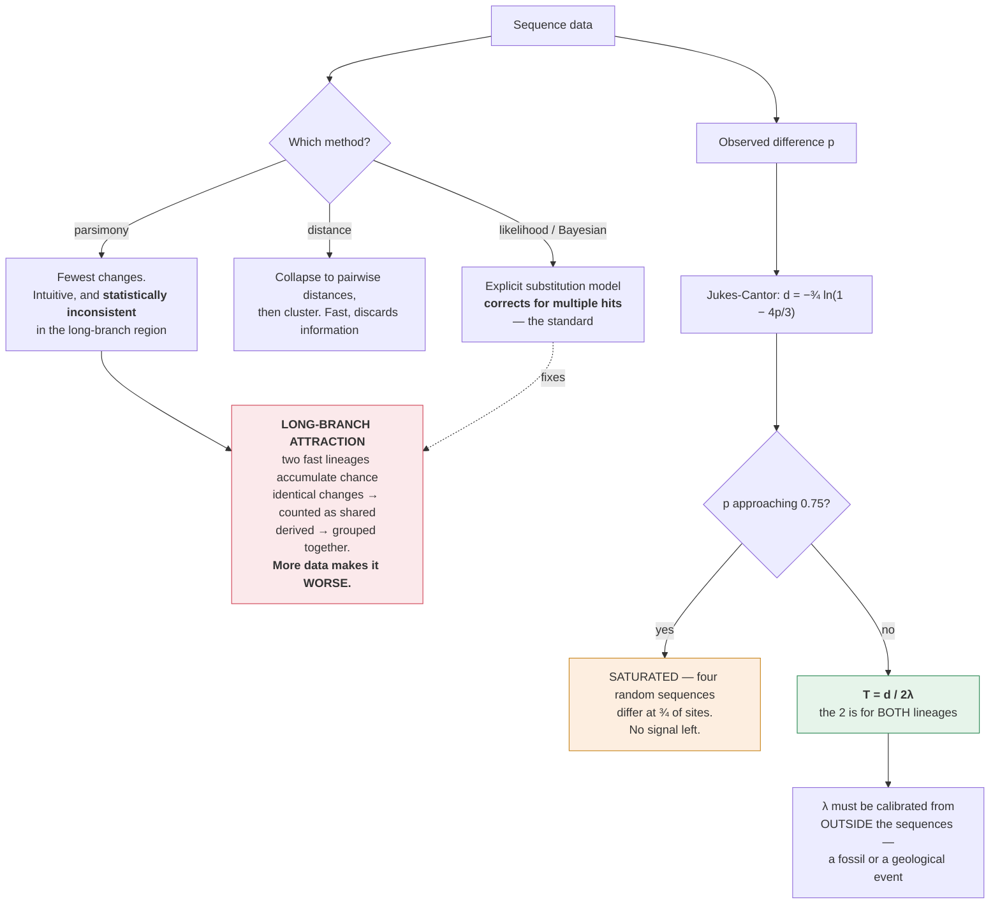

# Evolution & Ecology · Lesson 2.3: Inferring trees & dating them

> ⏱ ~15 min · Module 2: Speciation, Phylogenetics & Macroevolution · Builds on: [2.2](02-02-how-species-split.md), [1.4](01-04-drift-ne-gene-flow.md) · Unlocks: 2.4 (macroevolution)

## Why this matters

[general-biology 4.3](../../general-biology/lessons/04-03-tree-of-life.md) taught you to **read** a phylogeny — clades, common ancestors at nodes, tips all equally modern, and the classic misreadings. This lesson teaches you to **build** one and to put dates on it, which is a different and harder problem.

The reason it is worth doing properly is that a tree is not a summary of a dataset — it is a **historical hypothesis**, and it can be confidently wrong. The two ways it goes wrong are both systematic rather than random, and both have specific fixes: **homoplasy**, where similarity arose independently rather than by descent, and **long-branch attraction**, where the very method used to build the tree is actively misled by rapidly-evolving lineages.

The dating half rests on one result you already have. From [1.4](01-04-drift-ne-gene-flow.md), the neutral substitution rate equals the mutation rate exactly, with population size cancelling. **That is why a molecular clock exists at all** — it is a theorem, not an empirical regularity — and knowing that is what tells you when it should be trusted and when it should not.

## The idea

**Only shared *derived* characters are evidence of relationship.** This is the single most important idea in tree-building.

| Character type | Term | Evidence for a clade? |
|---|---|---|
| Shared **derived** (novel in the ancestor of the group) | **synapomorphy** | **YES** — this is the only evidence |
| Shared **ancestral** (present before the group arose) | symplesiomorphy | **no** — it is shared with everything outside too |
| Unique to one lineage | autapomorphy | no — it distinguishes but does not group |
| Similar but **independently derived** | **homoplasy** | **no — and it actively misleads** |

*In words: having a backbone does not group humans with fish, because the ancestor of both had one.* A shared ancestral character is shared by everything descended from that ancestor and therefore groups nothing.

**Rooting a tree requires an outgroup.** An unrooted tree shows relationships but not direction. Adding a taxon known to lie outside the group of interest — an **outgroup** — polarizes every character: whatever state the outgroup has is inferred ancestral, and the alternative is derived.

**Two families of method, and they fail differently.**

**Parsimony** chooses the tree requiring the fewest character changes. Intuitive, and it has a specific, known failure mode.

**Distance methods** convert sequences to pairwise distances and cluster. Fast; they discard information by collapsing sequences to numbers.

**Model-based methods — maximum likelihood and Bayesian inference** — specify an explicit model of how sequences change and find the tree that best explains the data under it. Slower, and they are the standard because **an explicit substitution model is what fixes parsimony's failure mode.**

**Long-branch attraction is that failure mode, and it is worth understanding precisely.** Two lineages that evolve fast accumulate many changes. By chance, some of those changes hit the same site and produce the same base in both — homoplasy. Parsimony counts those chance matches as shared derived characters and **groups the two fast lineages together**, regardless of their true relationship.

$$\textbf{Adding more data makes it } \textit{worse}\textbf{: parsimony converges confidently on the wrong tree.}$$

**A method that becomes more certain of a wrong answer as data accumulate is called statistically inconsistent**, and parsimony is provably inconsistent in this region of tree space (Felsenstein, 1978). This is why the field moved to model-based methods, which correct for multiple hits explicitly.

**The molecular clock, and the correction it needs.** Substitutions accumulate roughly linearly with time — but *observed differences* do not, because a site that mutates twice looks like one change, and a site that mutates back looks like none. **Observed divergence saturates**, and a correction is mandatory beyond a few percent.

## The formal version

**Parsimony, formally.** For each candidate tree, compute the minimum number of state changes required to explain the data; choose the tree minimizing it. **Informative sites** are those where at least two states each appear in at least two taxa — everything else is either invariant or an autapomorphy and cannot discriminate among trees.

**The number of trees, and why exhaustive search is hopeless.** For $n$ taxa the number of rooted binary trees is

$$T(n) = \frac{(2n-3)!}{2^{n-2}(n-2)!}$$

| $n$ | Rooted trees |
|---|---|
| 4 | 15 |
| 6 | 945 |
| 10 | $3.4\times10^{7}$ |
| 20 | $8.2\times10^{21}$ |
| 50 | $\sim 3\times10^{74}$ |

**Tree search is one of the harder optimization problems in computational biology**, and heuristics (hill-climbing with branch swapping) are universal ([computational-biology](../../computational-biology/syllabus.md)).

**The Jukes–Cantor correction.** Let $p$ be the observed proportion of differing sites. With four equally-exchangeable bases, the corrected number of substitutions per site is

$$\boxed{\;d = -\tfrac34 \ln\!\left(1 - \tfrac43 p\right)\;}$$

*In words: undo the multiple hits that hid behind each visible difference.*

| Observed $p$ | Corrected $d$ | Inflation |
|---|---|---|
| 0.05 | 0.052 | 4 percent |
| 0.10 | 0.107 | 7 percent |
| 0.20 | 0.233 | 16 percent |
| 0.40 | 0.572 | **43 percent** |
| 0.60 | 1.207 | **101 percent** |
| 0.75 | $\infty$ | **saturated — no information** |

**At $p = 0.75$ the correction diverges**, because four random sequences differ at three-quarters of sites by chance alone. **Beyond about 50 percent observed divergence a sequence carries essentially no usable phylogenetic signal**, which is why deep relationships are inferred from slowly-evolving genes or from protein sequences rather than from DNA.

**The molecular clock, quantitatively.** If substitutions accumulate at rate $\lambda$ per site per year **on each lineage independently**, then two lineages diverging $T$ years ago have accumulated substitutions on both:

$$\boxed{\;d = 2\lambda T \quad\Longrightarrow\quad T = \frac{d}{2\lambda}\;}$$

**The factor of 2 is the most commonly dropped thing in this entire lesson**, and dropping it doubles every date.

**Calibration.** The rate $\lambda$ must come from outside the sequence data — from a fossil, or from a known geological vicariance event. A calibration gives one node a date, and the rest of the tree is scaled to it.

**Why the clock is a theorem for neutral sites.** From [1.4](01-04-drift-ne-gene-flow.md): $2N\mu$ new neutral mutations arise per generation, each fixes with probability $1/(2N)$, so $k = \mu$ exactly. **Population size cancels, demography cancels, and the substitution rate is the mutation rate.** No comparable result holds for selected sites, which is why clocks are calibrated on synonymous or non-coding positions.

**Where the clock fails, and each failure has a fix:**

| Problem | Why | Fix |
|---|---|---|
| Rate varies among lineages | generation time, metabolic rate, DNA repair efficiency all differ | **relaxed clock** models with rates drawn from a distribution |
| Rate varies among sites | some positions are constrained, others free | **gamma-distributed rate heterogeneity** |
| Selection on the gene | violates neutrality outright | use synonymous sites |
| Saturation | deep divergences lose signal | slower genes; protein sequences |
| Poisson noise | substitutions are stochastic | wide confidence intervals; use many genes |

**Coalescence, briefly — the tree of *genes* is not the tree of *species*.** Trace two alleles backward in time; they coalesce in a common ancestor, and in a population of $N_e$ diploids the expected time is $2N_e$ generations for a pair.

$$\textbf{So a gene tree is deeper than the species tree by roughly } 2N_e \textbf{ generations.}$$

And when speciation events are close together relative to $N_e$, ancestral polymorphism can sort such that **the gene tree has a different topology from the species tree** — incomplete lineage sorting. This is not error; it is a real property of populations, and it is why roughly 30 percent of human genes place us closer to gorillas than to chimpanzees despite the species tree being unambiguous. **Species trees must be inferred from many genes, not one.**

## Picture

**Two things to carry away from the diagram.** Parsimony's failure is not noise — it is a systematic bias that strengthens with more data, and only an explicit model of multiple hits repairs it. And the clock's factor of 2 is not a detail: substitutions accumulate on *both* lineages since their split.

## Worked examples

**Example 1 (mechanical — correct for multiple hits and date a split).** Orthologous sequences in two lineages differ at 8 percent of aligned sites. The neutral substitution rate is $2\times10^{-9}$ per site per year. (a) Apply the Jukes–Cantor correction. (b) Estimate the divergence time. (c) A colleague reports 40 million years for the same data — what did they do wrong?

(a) $$d = -\tfrac34\ln\!\left(1 - \tfrac43(0.08)\right) = -0.75\ln(1 - 0.1067) = -0.75\ln(0.8933) = -0.75(-0.1128) = \mathbf{0.0846}.$$

So 8.46 substitutions per 100 sites against 8 observed — **a 5.8 percent upward correction**, modest at this level of divergence.

(b) $$T = \frac{d}{2\lambda} = \frac{0.0846}{2 \times 2\times10^{-9}} = \frac{0.0846}{4\times10^{-9}} = \mathbf{2.1\times10^{7}\ \text{years}} \approx 21\ \text{million years}.$$

(c) **They dropped the factor of 2.**

$$\frac{0.0846}{2\times10^{-9}} = 4.2\times10^{7} = 42\ \text{million years}.$$

The error is exactly a factor of two, and it comes from forgetting that **both** lineages have been accumulating substitutions since the split. Each has changed by $\lambda T$, and the *difference between them* is the sum, $2\lambda T$.

**This is the commonest error in molecular dating and it is always in the same direction — dates come out twice too old.** Given that published divergence dates are frequently debated by factors of two, it is worth checking.

*(A second, subtler error would have been to skip the Jukes–Cantor correction entirely, giving $0.08/(4\times10^{-9}) = 20$ Myr — only 5 percent low here, but 43 percent low at 40 percent observed divergence.)*

**Example 2 (why you'd care — diagnosing long-branch attraction).** A parsimony analysis of four taxa places a fast-evolving parasitic worm as sister to a fast-evolving parasitic fungus, in a clade excluding two slowly-evolving free-living relatives. Morphology places the worm firmly with animals and the fungus with fungi. (a) What is the likely artefact? (b) Explain the mechanism, and why adding more sequence would not help. (c) Give three ways to test and fix it.

(a) **Long-branch attraction.** The two "related" taxa are precisely the two with the longest branches, and they are grouped away from their morphologically obvious relatives. That is the signature.

(b) **Mechanism.** Both parasites evolve fast, so both have accumulated many substitutions since diverging from their true relatives. At any given site, a fast lineage has had multiple opportunities to change; with only four possible bases, two independent fast lineages will by chance arrive at the **same** base at a substantial number of sites.

Parsimony sees those shared bases and counts them as **synapomorphies** — shared derived characters — because it has no model of how often changes should occur. It therefore prefers the tree that groups the two long branches, since that tree explains those shared states with one change rather than two.

**Why more data makes it worse.** Adding sequence adds more sites, and the *proportion* of chance-shared states stays the same while the *number* grows. Statistical support for the wrong grouping therefore increases with data — bootstrap values climb toward 100 percent. **The method is statistically inconsistent: it converges on the wrong tree with certainty**, which is the worst possible property an estimator can have.

(c) Three tests and fixes, in increasing order of power:

**1. Use model-based inference with rate heterogeneity.** Maximum likelihood or Bayesian analysis with a substitution model that includes **gamma-distributed rates across sites** explicitly accounts for the possibility that a site changed several times. It assigns low weight to shared states at fast sites — exactly the ones misleading parsimony. This alone resolves many cases.

**2. Break up the long branches by adding taxa.** If you can sample slowly-evolving relatives *of each parasite*, or additional lineages that branch partway along each long branch, you subdivide the long branches into shorter segments. **Adding taxa is often more effective than adding sequence** — a genuinely counterintuitive result, since more data usually helps.

**3. Remove the fastest-evolving sites, or use amino acids.** Third codon positions saturate first ([Jukes–Cantor table above](#the-formal-version)); removing them, or translating to protein where the effective alphabet is 20 rather than 4 and chance convergence is much rarer, reduces homoplasy directly.

**And two diagnostics rather than fixes:**

- **The long-branch extraction test.** Remove one long-branch taxon and re-run. If the other long branch now moves to a *different* position — joining its morphologically expected relatives — the original grouping was attraction. This is decisive and cheap.
- **Compare parsimony with likelihood.** If parsimony groups the long branches and likelihood does not, that is direct evidence for the artefact.

**Why the case matters historically.** Long-branch attraction produced several confident and wrong results in early molecular phylogenetics — microsporidia placed at the base of eukaryotes (they are actually highly derived fungi), and various fast-evolving parasites scattered around trees. **The morphological evidence was right and the molecular evidence was wrong**, and understanding *why* is what made the field take substitution models seriously.

## Watch out

- **You might use shared ancestral characters as evidence.** Only **synapomorphies** — shared *derived* characters — group taxa. Shared ancestral states are shared with everything outside the group as well.
- **You might drop the factor of 2 in dating.** $T = d/(2\lambda)$. Substitutions accumulate on **both** lineages, and dropping the 2 doubles every date.
- **You might skip the multiple-hits correction.** Below 10 percent divergence it barely matters; at 40 percent it is a 43 percent underestimate; at 75 percent the signal is gone entirely.
- **You might trust a high bootstrap value.** Bootstrap measures how *consistently* the data support a grouping, not whether the grouping is *true*. Long-branch attraction produces high bootstrap support for the wrong tree, and more data raises it.
- **You might treat a gene tree as a species tree.** Gene trees are deeper by $\sim 2N_e$ generations and can differ in topology through incomplete lineage sorting. Use many genes.
- **You might assume the clock ticks evenly.** Rates vary among lineages (generation time, metabolic rate) and among sites. Relaxed-clock models exist for exactly this reason.

## One-liner

> Only shared *derived* characters group taxa, observed differences saturate so multiple hits must be corrected, and $T = d/2\lambda$ because both lineages have been changing — and parsimony's confident wrong answers under long-branch attraction are why explicit substitution models became standard.

## Problems

**P1 (🟢)** Two sequences differ at 15 percent of sites. (a) Apply the Jukes–Cantor correction. (b) With $\lambda = 1.5\times10^{-9}$ substitutions per site per year, estimate the divergence time. (c) By what percentage would you have underestimated the distance without the correction?

**P2 (🟡)** (a) How many rooted binary trees are possible for 6 taxa? For 8? Use $T(n) = (2n-3)!/[2^{n-2}(n-2)!]$. (b) A dataset of 30 taxa is analysed exhaustively at $10^{9}$ trees per second — estimate the time required. (c) State what this implies about phylogenetic software and name the general class of algorithm used.

**P3 (🔴, bridges to 1.4 and to human evolution)** Human and chimpanzee genomes differ at about 1.2 percent of aligned nucleotide sites. The human $N_e$ over the relevant period is estimated at about 10,000, generation time about 25 years, and the per-site per-generation mutation rate about $1.2\times10^{-8}$. (a) Estimate the divergence time from the sequence data. (b) The coalescence time of any two alleles predates the species split. Estimate by how much, and correct your answer to (a). (c) Explain why roughly 30 percent of human genes are closer to gorilla than to chimpanzee, and state what this means for how species trees must be inferred.

Solutions

**P1 (a)** $$d = -\tfrac34\ln\!\left(1 - \tfrac43(0.15)\right) = -0.75\ln(1 - 0.20) = -0.75\ln(0.80) = -0.75(-0.2231) = \mathbf{0.1674}.$$

**(b)** $$T = \frac{d}{2\lambda} = \frac{0.1674}{2 \times 1.5\times10^{-9}} = \frac{0.1674}{3\times10^{-9}} = \mathbf{5.58\times10^{7}\ \text{years}} \approx 56\ \text{million years}.$$

**(c)** Uncorrected, you would have used $d = 0.15$ instead of 0.1674:

$$\frac{0.1674 - 0.15}{0.1674} = \mathbf{10.4\ \text{percent underestimate}}.$$

**P2 (a)** $$T(6) = \frac{9!}{2^{4}\,4!} = \frac{362{,}880}{16 \times 24} = \frac{362{,}880}{384} = \mathbf{945}.$$

$$T(8) = \frac{13!}{2^{6}\,6!} = \frac{6{,}227{,}020{,}800}{64 \times 720} = \frac{6{,}227{,}020{,}800}{46{,}080} = \mathbf{135{,}135}.$$

**(b)** For $n = 30$:

$$T(30) = \frac{57!}{2^{28}\,28!} \approx \mathbf{4.95\times10^{38}}\ \text{trees}.$$

$$\text{time} = \frac{4.95\times10^{38}}{10^{9}\ \text{trees/s}} = 4.95\times10^{29}\ \text{s}.$$

$$\frac{4.95\times10^{29}}{3.15\times10^{7}\ \text{s/yr}} = \mathbf{1.6\times10^{22}\ \text{years}},$$

about **a trillion times the age of the universe** ($1.4\times10^{10}$ years). And 30 taxa is a *small* modern dataset.

**(c)** **Exhaustive search is impossible for anything beyond about a dozen taxa**, so phylogenetic software cannot guarantee finding the optimal tree — it must use **heuristic search**.

The general class is **local search / hill-climbing with neighbourhood moves**. Concretely:

1. Build a starting tree (neighbour-joining, or stepwise addition).
2. Propose modified trees by **branch swapping** — nearest-neighbour interchange, subtree pruning and regrafting, tree bisection and reconnection.
3. Keep any that improve the score; repeat until no neighbour improves.
4. Restart from several different starting trees to reduce the risk of a local optimum.

Bayesian methods instead use **Markov chain Monte Carlo** to sample tree space in proportion to posterior probability, which sidesteps optimization but has its own convergence problems.

**The practical consequence: a published tree is a *good* tree found by search, not provably *the* best tree.** This is one reason support values and multiple independent analyses matter, and it is developed properly in [computational-biology](../../computational-biology/syllabus.md).

**P3 (a)** Correct the observed 1.2 percent divergence first:

$$d = -\tfrac34\ln\!\left(1-\tfrac43(0.012)\right) = -0.75\ln(0.984) = -0.75(-0.01613) = 0.0121 .$$

(Negligible correction at this shallow divergence — 0.8 percent.)

Convert the mutation rate to a per-year rate:

$$\lambda = \frac{1.2\times10^{-8}\ \text{per generation}}{25\ \text{years per generation}} = 4.8\times10^{-10}\ \text{per site per year}.$$

$$T = \frac{d}{2\lambda} = \frac{0.0121}{9.6\times10^{-10}} = \mathbf{1.26\times10^{7}\ \text{years}} \approx 12.6\ \text{million years}.$$

**(b)** The sequence divergence measures the time back to the **coalescence** of the two alleles, not to the species split. Two alleles sampled from the ancestral population had to wait, on average, $2N_e$ generations to find their common ancestor **before** the population split ([1.4](01-04-drift-ne-gene-flow.md)).

$$\text{extra coalescence time} = 2N_e \times \text{generation time} = 2(10{,}000)(25) = \mathbf{500{,}000\ \text{years}}.$$

Corrected species divergence:

$$T_{\text{species}} = 12.6 - 0.5 = \mathbf{12.1\ \text{million years}}.$$

**The correction is about 4 percent here** — real but small, because $2N_e$ generations is short compared with the divergence. **For recently-diverged populations it dominates**: two human populations that separated 50,000 years ago have sequence divergence reflecting mostly the 500,000 years of ancestral coalescence, so the raw sequence estimate would be tenfold too old.

$$\textbf{Sequence divergence always overestimates species divergence, and the error is } 2N_e \textbf{ generations.}$$

*(A note on the number: 12 Myr is older than the 6–8 Myr usually quoted for the human–chimp split. The discrepancy is real and much argued over — it turns on whether to use the fast pedigree-derived mutation rate used here or the slower phylogenetically-calibrated rate, and it is one of the live problems in the field. The method is sound; the input rate is contested.)*

**(c)** This is **incomplete lineage sorting**, and it is a property of populations rather than an error.

The mechanism: the ancestral population of humans, chimps and gorillas was **polymorphic** — it carried multiple alleles at most loci. When the gorilla lineage split off, that polymorphism was inherited by both descendant populations. When the human and chimp lineages split shortly afterwards, the polymorphism was inherited again.

At any given locus, the alleles now in humans, chimps and gorillas trace back to that ancestral polymorphism, and **which two coalesce first is a matter of chance.** Two-thirds of the time the human and chimp alleles coalesce first, matching the species tree; one-third of the time a human allele coalesces first with a gorilla allele instead.

**Whether this happens depends on the ratio of the internode time to $N_e$:**

$$P(\text{discordance}) = \tfrac23 e^{-t/2N_e}$$

where $t$ is the number of generations between the two speciation events. If $t \gg 2N_e$, the polymorphism sorts completely and gene trees match the species tree. If $t$ is comparable to $2N_e$ — which it was, since the gorilla and chimp splits were only a few million years apart and the ancestral $N_e$ was large — a substantial fraction of loci are discordant.

**What it means for inferring species trees:**

1. **A single gene is not enough, ever.** Any one gene has roughly a 30 percent chance of giving the wrong topology here, and no amount of sequencing *that gene* fixes it — the gene's history genuinely is what it is.

2. **Concatenating genes and analysing them as one sequence is actively wrong**, and can be *statistically inconsistent* in the same sense as long-branch attraction: with enough concatenated data it can converge on the wrong species tree, because the majority signal in the concatenation need not be the majority gene tree.

3. **The correct approach is a multi-species coalescent model** — infer a gene tree per locus, then infer the species tree as the one most likely to have produced that *distribution* of gene trees. Methods like ASTRAL do this.

$$\textbf{The species tree is a hypothesis about a population history, and the gene trees are noisy samples from it.}$$

**And a positive note:** the discordance is not merely a nuisance. Because the fraction of discordant loci depends on $N_e$ and on the internode time, **measuring the discordance lets you estimate the ancestral population size** — a demographic parameter from millions of years ago, read off the genomes of living species.

## Flashback

**From Lesson 2.2 (speciation and gene flow):** Two populations exchange migrants at $m = 0.03$. Five loci confer local adaptation with $s = 0.20, 0.06, 0.025, 0.015, 0.010$. (a) Which remain differentiated? (b) An inversion captures the three weakest — recompute. (c) Predict what the $F_{ST}$ scan looks like in each case.

Solution

**(a)** Apply $s > m = 0.03$:

| Locus | $s$ | Outcome |
|---|---|---|
| 1 | 0.200 | **differentiated** |
| 2 | 0.060 | **differentiated** |
| 3 | 0.025 | swamped |
| 4 | 0.015 | swamped |
| 5 | 0.010 | swamped |

**Two of five survive.**

**(b)** The inversion captures loci 3, 4 and 5:

$$\sum s = 0.025 + 0.015 + 0.010 = 0.050 > 0.03 = m .$$

**All three now persist**, so all five loci are maintained.

**(c)** *Without the inversion:* two **narrow** $F_{ST}$ peaks, at loci 1 and 2, against a low background. The three swamped loci are invisible even though they are genuinely under local selection.

*With the inversion:* two narrow peaks plus one **broad, high plateau** spanning the entire inverted region — including all the neutral sites inside it, which are dragged along because recombination cannot separate them from the selected sites.

**The caution from [2.2](02-02-how-species-split.md) applies:** the broad peak is evidence of **suppressed recombination**, not of a dense cluster of selected sites. And it is correspondingly hard to fine-map, because the tool that would normally narrow the interval — recombination — is exactly what the inversion has removed ([genetics 4.4](../../genetics/lessons/04-04-linkage-disequilibrium-gwas.md)).

## Connections

- **Backward:** [1.4](01-04-drift-ne-gene-flow.md)'s $k = \mu$ is why a molecular clock exists at all, and its $2N_e$ coalescence time is what makes gene trees deeper than species trees; [general-biology 4.3](../../general-biology/lessons/04-03-tree-of-life.md) taught reading a tree, which this lesson takes as given.
- **Forward:** [2.4](02-04-macroevolution-history-of-life.md) uses dated trees to estimate speciation and extinction rates, which is only possible once branch lengths mean something.
- **Sideways:** the tree-search heuristics and substitution models are [computational-biology](../../computational-biology/syllabus.md); the mutation rates being calibrated are [genetics 3.2](../../genetics/lessons/03-02-mutation.md); the Poisson noise in substitution counts is [prob-stat-refresher](../../prob-stat-refresher/syllabus.md).
