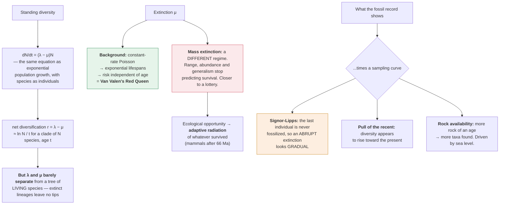

# Evolution & Ecology · Lesson 2.4: Macroevolution & the history of life

> ⏱ ~15 min · Module 2: Speciation, Phylogenetics & Macroevolution · Builds on: [2.3](02-03-inferring-trees-dating.md), [2.2](02-02-how-species-split.md) · Unlocks: 3.1 (exponential growth & demography)

## Why this matters

Module 1 worked in generations and allele frequencies. Module 2 has been working in speciation events. This lesson works in **hundreds of millions of years and tens of thousands of lineages**, and the question it has to face is whether anything new appears at that scale.

**The honest answer is: no new mechanism, but genuinely new phenomena.** Nothing happens in macroevolution that is not selection, drift, mutation and speciation — but processes that are invisible over a generation dominate over a hundred million years, and the *pattern* they produce is not readable off the microevolutionary rules. Diversity is a birth–death process, and birth–death processes have their own logic.

The other reason to do this properly is that the fossil record is a **biased sample**, systematically and knowably. Most apparent patterns in the history of life turn out to be partly artefacts of preservation, and separating signal from sampling is most of palaeobiology's real work.

## The idea

**Diversity is a birth–death process.** Standing diversity at any time is the balance of two rates:

$$\frac{dN}{dt} = (\lambda - \mu)N$$

where $\lambda$ is the **speciation** rate and $\mu$ the **extinction** rate per lineage per unit time. *In words: clades grow or shrink exponentially according to the difference between origination and extinction.* This is the same equation as exponential population growth ([3.1](03-01-exponential-growth-demography.md)) with species playing the role of individuals — a genuinely useful correspondence, and the reason macroevolution and population ecology share so much mathematics.

**Two kinds of extinction, and the distinction matters.**

- **Background extinction** — the ordinary, continuous turnover. Most species go extinct; the mean species lifespan is a few million years.
- **Mass extinction** — brief intervals of vastly elevated rate, killing a large fraction of taxa across many unrelated groups.

**The Big Five**, in order of severity:

| Event | Age (Ma) | Marine genera lost | Probable cause |
|---|---|---|---|
| End-Ordovician | 444 | ~57 percent | glaciation, sea-level fall |
| Late Devonian | 372 | ~50 percent | anoxia; protracted |
| **End-Permian** | 252 | **~81 percent** | Siberian Traps volcanism; warming, anoxia, acidification |
| End-Triassic | 201 | ~47 percent | Central Atlantic volcanism |
| End-Cretaceous | 66 | ~50 percent | Chicxulub impact (+ Deccan volcanism) |

**Mass extinctions change the rules, not just the numbers.** During background times, traits that confer species-level advantage — broad geographic range, large population size, ecological generalism — predict survival. During mass extinctions, **those predictors largely stop working**. Survival becomes closer to a lottery with respect to normal adaptedness, and clades that were flourishing are removed for reasons unrelated to their prior success.

$$\textbf{Mass extinctions are not intensified background extinction; they are a different selective regime.}$$

**And that is why they matter so much for the shape of life.** The end-Cretaceous event removed non-avian dinosaurs and opened ecological space that mammals — present but constrained for 150 million years — then filled. Mammalian diversification is not a story about mammals becoming better; it is a story about a competitor being removed.

**Key innovations and adaptive radiations.** A **key innovation** is a trait that opens access to a new set of resources or environments, and it is followed by rapid diversification into the newly available niches — an **adaptive radiation**. Flight in insects, birds and bats; the amniote egg; flowers and the associated pollinator relationship; the vertebrate jaw.

**Two things can trigger a radiation:** a key innovation (new capability) or **ecological opportunity** (new space — a mass extinction, a colonized island, a new continent). Radiations following mass extinctions are the second kind, and they are much commoner.

**Convergence.** Independent lineages arrive at similar solutions because the physics and chemistry constrain the options. Eyes have evolved independently dozens of times; the streamlined body of a shark, an ichthyosaur and a dolphin is one solution to one hydrodynamic problem.

**Convergence is evidence about the strength of constraint** — it says the fitness landscape has a peak that is findable from many starting points, which is a real claim about how much evolution is contingent and how much is determined.

**Punctuated equilibrium.** Eldredge and Gould's observation that fossil species often show long **stasis** punctuated by rapid morphological change, rather than gradual continuous change. The claim was about *pattern*; the mechanism proposed was that most change occurs during speciation in small peripheral populations ([2.2](02-02-how-species-split.md), peripatric), which are unlikely to be sampled.

**Stasis is the surprising part, not the punctuation.** A species that persists 5 million years with essentially no net morphological change, despite generation-scale selection intense enough to be measurable in the field ([1.2](01-02-modes-of-selection.md), Darwin's finches), demands an explanation — and stabilizing selection on a fluctuating optimum, with no net direction, is the leading one.

## The formal version

**Diversification, and what a molecular phylogeny can and cannot recover.** From a dated phylogeny ([2.3](02-03-inferring-trees-dating.md)) the **net diversification rate** is

$$r = \lambda - \mu$$

and for a clade of $N$ extant species of age $t$, a crude estimate is

$$r \approx \frac{\ln N}{t}.$$

**But $\lambda$ and $\mu$ are only weakly separable from a phylogeny of living species alone**, because extinct lineages leave no tips. The signature of extinction is a **"pull of the recent"**: recent branches are over-represented, since recent lineages have had less time to go extinct. Fitting birth–death models to lineage-through-time plots can estimate $\mu$, but the estimates are notoriously unstable, and this is a live methodological argument.

$$\textbf{The fossil record measures extinction directly; a molecular tree infers it with difficulty.}$$

**The species–lifespan distribution.** If extinction is a constant-rate Poisson process, species lifespans are **exponentially distributed** with mean $1/\mu$:

$$P(\text{lifespan} > t) = e^{-\mu t}$$

*In words: extinction risk is independent of a species' age.* This is **Van Valen's Red Queen hypothesis** — taxa do not become better at surviving with age, because their competitors and parasites are co-evolving just as fast.

$$\textbf{"It takes all the running you can do to keep in the same place."}$$

The prediction — a straight line on a log-survivorship plot — holds approximately across many groups, and it is one of the few genuinely quantitative laws in palaeobiology.

**Fossil-record biases, and each has a direction.**

| Bias | Effect on the apparent record |
|---|---|
| **Preservation** | favours hard parts, marine, abundant, large-bodied |
| **Rock availability** | more rock of a given age → more fossils found; sea level controls this |
| **Pull of the recent** | recent taxa are better sampled, so diversity appears to rise toward the present |
| **Signor–Lipps effect** | the last fossil of a taxon predates its true extinction, so **abrupt extinctions look gradual** |
| **Lagerstätten** | exceptional preservation sites create apparent diversity spikes |

**The Signor–Lipps effect is the most consequential and the least intuitive.** Since fossilization is rare, the *last* individual of a species is essentially never fossilized. So even a genuinely instantaneous extinction produces a record of last-occurrences smeared backward over the preceding interval — **an abrupt event masquerading as a gradual decline.**

This mattered enormously for the end-Cretaceous debate: the fossil record appeared to show dinosaurs declining for millions of years before the impact, which was used as an argument against a sudden cause. **Statistical correction for Signor–Lipps shows the data are fully consistent with an abrupt extinction**, and the argument dissolved once the sampling was modelled.

**Estimating the true diversity from an incomplete record** requires modelling sampling explicitly — subsampling to standardize effort, or capture–recapture-style estimators using the number of taxa seen before and after a gap. **Raw counts of fossil taxa through time are not a diversity curve; they are a diversity curve times a sampling curve**, and the sampling curve is itself driven by sea level and rock area.

## Picture

**Two things to carry from the diagram.** Mass extinctions are a change of *regime*, not of degree — which is why they reset the composition of life rather than merely thinning it. And a raw fossil diversity curve is a product of two curves, only one of which is biology.

## Worked examples

**Example 1 (mechanical — diversification rates and species lifespans).** A clade contains 4200 extant species and originated 45 million years ago. (a) Estimate the net diversification rate. (b) Independent fossil evidence gives a background extinction rate of $\mu = 0.15$ per lineage per million years. Estimate $\lambda$. (c) What is the mean species lifespan, and what fraction of species survive 10 million years?

(a) $$r \approx \frac{\ln N}{t} = \frac{\ln 4200}{45} = \frac{8.343}{45} = \mathbf{0.185\ \text{per lineage per Myr}}.$$

(b) $$r = \lambda - \mu \;\Longrightarrow\; \lambda = r + \mu = 0.185 + 0.15 = \mathbf{0.335\ \text{per lineage per Myr}}.$$

**Note that extinction is running at nearly half the speciation rate** — a turnover ratio $\mu/\lambda = 0.45$, which is typical. Standing diversity is the small residue of two much larger opposing flows, exactly as with a population at near-equilibrium birth and death rates ([3.1](03-01-exponential-growth-demography.md)).

(c) Mean lifespan under a constant-rate Poisson extinction process:

$$\bar{t} = \frac{1}{\mu} = \frac{1}{0.15} = \mathbf{6.7\ \text{million years}}.$$

$$P(\text{survive} > 10\ \text{Myr}) = e^{-\mu t} = e^{-0.15 \times 10} = e^{-1.5} = \mathbf{0.223},$$

so about **22 percent** of species last longer than 10 million years.

**The key property is that this is memoryless.** A species that has already survived 10 million years has exactly the same subsequent risk as a brand-new one — which is the Red Queen claim, and it is genuinely surprising. It says species do not accumulate durability, because whatever advantage they gain is matched by their co-evolving competitors, predators and parasites.

**Example 2 (why you'd care — Signor–Lipps and the dinosaur debate).** A palaeontologist collects the last-occurrence dates of 30 dinosaur species in a well-sampled section spanning the last 2 million years of the Cretaceous. The last occurrences are spread throughout the interval, with only 6 species found in the final 200,000 years. (a) What was concluded from data like these, historically? (b) Explain why the pattern is expected even under an instantaneous extinction. (c) Design the analysis that distinguishes gradual from abrupt.

(a) Historically, patterns like this were taken as evidence for a **gradual decline** of dinosaurs over the last few million years of the Cretaceous, and therefore as evidence **against** the Chicxulub impact as the primary cause. The reasoning was straightforward: if an impact killed them, they should all be present right up to the boundary.

(b) The reasoning fails because **fossilization is rare, so a species' last fossil is almost never its last individual.**

Model it. Suppose a species is fossilized and recovered at rate $\rho$ per unit time while it exists. Its last recovered fossil lies, on average, $1/\rho$ before its true extinction. If $\rho$ is low — a few specimens per hundred thousand years, which is generous for large terrestrial vertebrates — the gap is hundreds of thousands of years, **per species, independently**.

So 30 species that all went extinct at the same instant would have last occurrences scattered backward over the preceding several hundred thousand years, with only the best-sampled few reaching the boundary itself. **The observed pattern — 6 of 30 in the final interval — is exactly what an abrupt extinction with imperfect sampling produces.**

$$\textbf{The Signor–Lipps effect converts a step function into a ramp, and it does so automatically.}$$

Note the asymmetry that makes this so treacherous: the bias only works **one way**. A last occurrence can be too early but never too late, so the smear is always backward and always in the direction of making abrupt look gradual.

(c) The analysis has three components:

**1. Estimate each species' recovery rate $\rho$ from its own occurrence record.** A species found at many horizons through the section has a high $\rho$ and its last occurrence is informative; one found three times has a low $\rho$ and its last occurrence means almost nothing. **Weight species by how well they are sampled.**

**2. Compute confidence intervals on each true extinction time.** Given $n$ occurrences spread over a stratigraphic range, standard methods (Strauss and Sadler; Marshall) give an upper confidence bound on how far above the last occurrence the true extinction could lie. **The test is then whether all 30 confidence intervals overlap a single horizon.** If they do, a simultaneous extinction is consistent with the data.

**3. Compare models explicitly.** Fit two models to the occurrence data — (i) all species extinct at the boundary, (ii) extinction rate rising gradually through the interval — and compare their likelihoods, with the sampling process modelled in both. **This is the decisive step**, because it asks which hypothesis better explains the data *given* that sampling is incomplete, rather than reading the pattern at face value.

**What was found.** When these methods were applied to the best-sampled sections (the Hell Creek Formation in particular), **the data proved fully consistent with an abrupt, boundary-coincident extinction.** The apparent gradual decline was a sampling artefact.

**The general lesson, and it generalizes far beyond dinosaurs:** in any record with incomplete detection, an abrupt event looks gradual, and the *only* way to tell is to model the detection process explicitly. The same problem — and essentially the same solution — appears in epidemiology (case ascertainment), in extinction dating for recently-lost species, and in any survival analysis with censoring.

## Watch out

- **You might expect macroevolution to need a new mechanism.** It does not — it is selection, drift, mutation and speciation over long times. What is new is that a **birth–death process** has its own logic, and that rare events dominate long records.
- **You might read a mass extinction as intensified background extinction.** It is a **different regime**: the traits predicting survival in normal times largely stop predicting it, which is why mass extinctions reset composition rather than just thinning diversity.
- **You might read a raw fossil diversity curve as a diversity curve.** It is diversity times sampling, and sampling is driven by rock availability and sea level. Subsample to standardize effort before interpreting.
- **You might read a gradual decline in last occurrences as a gradual extinction.** **Signor–Lipps** makes every abrupt extinction look gradual, and the bias runs one way only.
- **You might trust extinction rates estimated from a molecular phylogeny.** $\lambda$ and $\mu$ separate poorly when only living species are sampled. The fossil record measures extinction directly and the tree does not.
- **You might find stasis unsurprising.** It is the surprising half of punctuated equilibrium — selection measured in the field is strong enough to move a trait far in a few thousand years, and species persist for millions with little net change.

## One-liner

> Macroevolution needs no new mechanism, only a birth–death process run for a hundred million years — and the two things that most distort the record are that mass extinctions change which traits predict survival, and that incomplete sampling turns every abrupt extinction into an apparent gradual decline.

## Problems

**P1 (🟢)** A clade has 850 extant species and is 30 million years old. (a) Estimate the net diversification rate $r$. (b) If the fossil-based extinction rate is $\mu = 0.10$ per lineage per Myr, find $\lambda$. (c) Compute the mean species lifespan and the fraction of species surviving more than 20 Myr.

**P2 (🟡)** Two clades are the same age (20 Myr). Clade A has $\lambda = 0.40$, $\mu = 0.35$; clade B has $\lambda = 0.12$, $\mu = 0.05$. (a) Compute $r$ for each. (b) Starting from one species each, predict standing diversity after 20 Myr. (c) Which clade is more vulnerable to a mass extinction, and why? Your answer should turn on something other than the diversity numbers.

**P3 (🔴, bridges to 4.5 and to the present)** Current extinction rates are estimated at 100 to 1000 times the background rate. Background is roughly 0.1 to 1 extinctions per million species-years (E/MSY). (a) Compute the implied mean species lifespan at background and at 500× background. (b) If there are 10 million species, how many extinctions per year does each rate imply? (c) The Big Five each removed 50 to 80 percent of species over intervals of tens of thousands to a few million years. Assess whether current rates justify the term "sixth mass extinction," and state precisely what would have to be true for the comparison to hold.

Solutions

**P1 (a)** $$r \approx \frac{\ln 850}{30} = \frac{6.745}{30} = \mathbf{0.225\ \text{per lineage per Myr}}.$$

**(b)** $$\lambda = r + \mu = 0.225 + 0.10 = \mathbf{0.325\ \text{per lineage per Myr}}.$$

**(c)** $$\bar t = \frac{1}{\mu} = \frac{1}{0.10} = \mathbf{10\ \text{Myr}}.$$

$$P(t > 20) = e^{-0.10 \times 20} = e^{-2} = \mathbf{0.135}, \ \text{about 14 percent}.$$

**P2 (a)** $$r_A = 0.40 - 0.35 = \mathbf{0.05}, \qquad r_B = 0.12 - 0.05 = \mathbf{0.07}.$$

**(b)** $N(t) = N_0 e^{rt}$ with $N_0 = 1$, $t = 20$:

$$N_A = e^{0.05 \times 20} = e^{1.0} = \mathbf{2.7\ \text{species}}, \qquad N_B = e^{0.07 \times 20} = e^{1.4} = \mathbf{4.1\ \text{species}}.$$

Clade B is more diverse despite having a **much lower speciation rate** — because its extinction rate is lower still.

**(c) Clade A is more vulnerable**, and the reason is turnover rather than diversity.

Clade A has **high turnover**: $\lambda = 0.40$ and $\mu = 0.35$, so species are being created and destroyed rapidly and the standing diversity is a small residue of two large flows. Clade B has **low turnover**: both rates are small, species are long-lived, and diversity accumulates slowly.

Three consequences, and they all point the same way:

1. **Species lifespan.** $\bar t_A = 1/0.35 = 2.9$ Myr; $\bar t_B = 1/0.05 = 20$ Myr. Clade A's species are intrinsically fragile — narrow ranges, small populations, or ecological specialization typically underlie a high $\mu$, and those are precisely the traits that fare worst even in ordinary times.

2. **Recovery depends on $\lambda$, and here A actually has the advantage** — $\lambda_A = 0.40$ against $\lambda_B = 0.12$, so after a mass extinction A would rebound more than three times faster **if any lineages survived**. This is a real and important asymmetry: high-turnover clades are more likely to be devastated and more likely to recover quickly.

3. **The decisive factor is the number of surviving lineages.** A mass extinction removing, say, 80 percent of species hits a clade with few standing species hardest, because there is a real chance of losing *all* of them. With only 2.7 species, clade A has a substantial probability of complete extinction; clade B with 4.1 has a somewhat better chance — though both are perilously small, and in reality clade-level survival depends on how many species there are *and* on whether they are ecologically and geographically diverse enough that the extinction filter does not remove them all together.

**The general point, which is the one worth extracting:** during background times, low $\mu$ is what builds diversity. During a mass extinction, the traits that gave low $\mu$ stop protecting you ([the regime change above](#the-idea)), and what matters is how many independent lineages you have and how ecologically spread they are. **This is why clade survival through mass extinctions is so poorly predicted by prior success.**

**P3 (a)** Extinction rate $\mu$ in E/MSY converts to a per-species-per-year rate. At the low background estimate of 0.1 E/MSY:

$$\mu = 0.1 \times 10^{-6}\ \text{per species-year} = 10^{-7}, \qquad \bar t = \frac{1}{\mu} = \mathbf{10^{7}\ \text{years} = 10\ \text{Myr}}.$$

At 1 E/MSY: $\bar t = 10^{6} = \mathbf{1\ \text{Myr}}$.

At **500× background**, taking background as 1 E/MSY:

$$\mu = 500\times10^{-6} = 5\times10^{-4}\ \text{per species-year}, \qquad \bar t = \frac{1}{5\times10^{-4}} = \mathbf{2000\ \text{years}}.$$

**Mean species lifespan falls from a million years to two thousand** — a compression by a factor of 500, which is what the rate multiplier means.

**(b)** With $S = 10^{7}$ species:

| Rate | $\mu$ (per species-year) | Extinctions per year |
|---|---|---|
| Background, 0.1 E/MSY | $10^{-7}$ | $10^{7} \times 10^{-7} = \mathbf{1}$ |
| Background, 1 E/MSY | $10^{-6}$ | $\mathbf{10}$ |
| 100× (of 1 E/MSY) | $10^{-4}$ | $\mathbf{1000}$ |
| 500× | $5\times10^{-4}$ | $\mathbf{5000}$ |
| 1000× | $10^{-3}$ | $\mathbf{10{,}000}$ |

So current estimates imply somewhere between roughly **1000 and 10,000 extinctions per year**, against a background of one to ten.

**(c) Assessment: the *rate* is comparable to a mass extinction; the *cumulative loss* is not yet, and that is exactly the distinction the term obscures.**

**What is established.** Documented extinctions since 1500 amount to perhaps 900 species — a tiny fraction of 10 million. But documented extinctions are a severe undercount (most species are undescribed, and extinction is hard to confirm), and the *rate* estimates above are derived from well-studied groups where detection is good. Vertebrate extinction rates since 1900 are around 100× background on conservative estimates.

**Do the arithmetic that the comparison requires.** At 1000× background ($10^{-3}$ per species-year), the fraction of species lost over a period $T$ is

$$1 - e^{-\mu T}.$$

| $T$ | Fraction lost |
|---|---|
| 100 years | 9.5 percent |
| 500 years | 39 percent |
| 1000 years | **63 percent** |
| 2000 years | 86 percent |

**So sustaining current rates for roughly 500 to 1000 years would produce a loss comparable to the Big Five.** That is a short time by geological standards — the end-Permian took tens of thousands of years, and even the impact-driven end-Cretaceous loss played out over years to millennia — so **the timescale of the comparison is legitimate.**

**What would have to be true for the term to be strictly accurate:**

1. **The rate estimates must be right.** They rest on extrapolation from well-studied taxa (birds, mammals, amphibians) to poorly-known ones (insects, fungi, marine invertebrates), and that extrapolation is the weakest link.
2. **The rate must be sustained**, not a transient pulse. Current drivers — habitat loss, climate change, invasive species, overexploitation — are projected to intensify rather than abate, which supports sustainment, but this is a forecast rather than an observation.
3. **The loss must accumulate to a comparable fraction.** It has not yet. **We are currently in a mass extinction's opening phase by rate, not in its aftermath by magnitude.**

**The honest formulation, and the one the primary literature increasingly uses:** *current extinction rates are within the range that, if sustained, would produce a mass extinction on a timescale of centuries.* That is a strong and alarming claim and it is defensible. "We are in the sixth mass extinction" is a claim about a completed event, and it is not yet true — which matters, because the difference between "underway" and "avoidable" is precisely where conservation biology operates ([4.5](04-05-behavior-conservation.md)).

**One further point that strengthens the concern rather than weakening it.** The Big Five were followed by recovery times of **5 to 10 million years** before diversity returned to prior levels, and recovery reset the composition of life rather than restoring it. Whatever fraction is lost is not recoverable on any timescale relevant to human decision-making.

## Flashback

**From Lesson 2.3 (trees and dating):** Two lineages differ at 22 percent of aligned neutral sites; the substitution rate is $\lambda = 1.0\times10^{-9}$ per site per year. (a) Apply the Jukes–Cantor correction. (b) Estimate the divergence time. (c) The ancestral $N_e$ was about 50,000 with a 2-year generation time — correct your estimate for coalescence, and comment on whether the correction matters here.

Solution

**(a)** $$d = -\tfrac34\ln\!\left(1 - \tfrac43(0.22)\right) = -0.75\ln(1 - 0.2933) = -0.75\ln(0.7067) = -0.75(-0.3471) = \mathbf{0.2603}.$$

An 18 percent upward correction from the observed 0.22 — substantial, and it would have been a real error to skip.

**(b)** $$T = \frac{d}{2\lambda} = \frac{0.2603}{2\times10^{-9}} = \mathbf{1.30\times10^{8}\ \text{years}} = 130\ \text{million years}.$$

**(c)** The sequence divergence measures coalescence, which predates the species split by roughly $2N_e$ generations ([2.3](02-03-inferring-trees-dating.md)):

$$2N_e \times \text{generation time} = 2(50{,}000)(2) = 200{,}000\ \text{years} = 0.2\ \text{Myr}.$$

$$T_{\text{species}} = 130 - 0.2 = \mathbf{129.8\ \text{Myr}}.$$

**The correction is 0.15 percent and is entirely negligible here.**

**And that is the general rule worth stating: the coalescence correction matters in inverse proportion to the divergence depth.** For a 130 Myr split it is noise; for two populations that separated 100,000 years ago with the same $N_e$, the 200,000-year ancestral coalescence would be *twice* the true divergence and would dominate the estimate completely. **Always compute it; usually ignore it for deep splits; never ignore it for shallow ones.**

## Connections

- **Backward:** [2.3](02-03-inferring-trees-dating.md)'s dated trees are what diversification rates are read from; [2.2](02-02-how-species-split.md)'s peripatric speciation is the mechanism punctuated equilibrium proposes for rapid change in unsampled populations.
- **Forward:** Module 3 turns to populations of individuals rather than species, and the birth–death equation $dN/dt = (\lambda-\mu)N$ reappears immediately as [3.1](03-01-exponential-growth-demography.md)'s exponential growth.
- **Sideways:** the exponential lifespan distribution and its memorylessness are [prob-stat-refresher](../../prob-stat-refresher/syllabus.md); current extinction rates and small-population risk are [4.5](04-05-behavior-conservation.md); the Signor–Lipps correction is a censored-data problem of the kind that recurs throughout applied statistics.
