# Evolution & Ecology · Lesson 4.5: A taste of behaviour & conservation

> ⏱ ~15 min · Module 4: Community & Ecosystem Ecology · Builds on: [4.4](04-04-ecosystems-energy-nutrients.md), [1.4](01-04-drift-ne-gene-flow.md), [3.3](03-03-life-histories-tradeoffs.md) · Unlocks: end of course

## Why this matters

This course has moved from alleles to ecosystems, and this lesson closes it by putting the whole apparatus to work on decisions that actually get made. **Conservation biology is applied evolution and ecology**, and nearly every tool in it comes from something already covered: effective population size ([1.4](01-04-drift-ne-gene-flow.md)), inbreeding depression ([genetics 4.3](../../genetics/lessons/04-03-inbreeding-relatedness-structure.md)), reproductive value ([3.1](03-01-exponential-growth-demography.md)), the species–area relationship ([4.3](04-03-mutualism-succession-diversity.md)), trophic structure ([4.4](04-04-ecosystems-energy-nutrients.md)).

The behavioural half is here because **behaviour is the mechanism through which selection acts on individuals**, and because two of its results — optimal foraging and Hamilton's rule — are among the clearest cases of a quantitative prediction that could have failed and did not.

The unifying idea of the conservation half is that **small populations face threats that large populations do not**, and those threats reinforce each other. That is not a metaphor; it is a feedback loop with a name and an exit only at extinction.

## The idea

**Optimal foraging: behaviour as an optimization problem.** An animal should behave as if maximizing net energy intake per unit time, because that is what selection rewards.

**The prey-choice model** makes a prediction that sounds wrong and is right. Rank prey by profitability $E_i/h_i$ (energy per unit handling time). Then:

$$\textbf{Whether to include a prey type depends only on the encounter rate with } \textit{better} \textbf{ types — never on its own abundance.}$$

*In words: if good prey are common enough, ignore poor prey no matter how many of them there are.* This is the **zero-one rule** — a prey type is either always taken or always ignored, with no partial preference — and it is counterintuitive enough to be a real test of the theory.

**The marginal value theorem** answers a different question: how long to stay in a depleting patch. Leave when the **instantaneous** rate of gain in the patch falls to the **average** rate for the habitat as a whole, including travel.

$$\textbf{So an animal in a poor habitat should stay } \textit{longer} \textbf{ in each patch}, \text{because leaving buys less.}$$

**Kin selection.** An allele can spread by helping copies of itself in relatives, even at a cost to its bearer. Hamilton's rule:

$$\boxed{\;rB > C\;}$$

where $r$ is relatedness ([genetics 4.3](../../genetics/lessons/04-03-inbreeding-relatedness-structure.md)), $B$ the benefit to the recipient and $C$ the cost to the actor, both in offspring equivalents.

**Inclusive fitness** is the quantity being maximized: an individual's own reproduction plus its effect on relatives' reproduction, each weighted by $r$. **Haldane's remark — that he would lay down his life for two brothers or eight cousins — is Hamilton's rule computed for $r = \tfrac12$ and $r = \tfrac18$.**

**Then the conservation half. Small populations are in trouble for four distinct reasons**, and keeping them distinct matters because they have different remedies:

| Threat | Mechanism | Reversible? |
|---|---|---|
| **Demographic stochasticity** | chance variation in births, deaths, sex ratio | yes, by growing |
| **Environmental stochasticity** | bad years affect everyone at once | yes |
| **Inbreeding depression** | homozygosity exposes recessives ([genetics 4.3](../../genetics/lessons/04-03-inbreeding-relatedness-structure.md)) | **yes** — genetic rescue |
| **Loss of genetic variation / mutational meltdown** | drift fixes deleterious alleles ([1.5](01-05-mutation-balance-of-forces.md)) | **no** |

**And they reinforce each other — the extinction vortex.** A small population inbreeds; inbreeding lowers survival and fecundity; lower vital rates shrink the population; a smaller population inbreeds faster.

$$\text{small} \to \text{inbred} \to \text{lower fitness} \to \text{smaller} \to \cdots$$

**A positive feedback loop with extinction as its only fixed point.** The practical consequence is that there is a threshold below which decline is self-sustaining and above which it is not, and identifying that threshold is the central quantitative task.

## The formal version

**The marginal value theorem, formally.** With cumulative gain $g(t)$ in a patch and travel time $T$ between patches, maximize the long-run rate $R = g(t)/(T+t)$:

$$\frac{dR}{dt} = 0 \;\Longrightarrow\; \boxed{\;g'(t^{*}) = \frac{g(t^{*})}{T + t^{*}}\;}$$

*In words: leave when the marginal gain rate equals the overall average rate.* Graphically, draw a tangent from the point $-T$ on the time axis to the gain curve — **the tangent point is the optimal departure time.** Longer travel or poorer patches both flatten the tangent line and push $t^{*}$ later.

**Hamilton's rule, derived.** An allele for helping spreads if the total change in its own frequency is positive. The actor pays $C$ offspring; the recipient gains $B$ offspring, of which a fraction $r$ carry the allele by descent:

$$\Delta(\text{allele copies}) = -C + rB > 0 \;\Longrightarrow\; rB > C .$$

**Haplodiploidy and eusociality.** In bees, ants and wasps, males are haploid and females diploid. A female shares:

- with her **full sisters**: $r = \tfrac34$ (they share their father's single sperm genotype entirely, plus half their mother's);
- with her **own daughters**: $r = \tfrac12$;
- with her **brothers**: $r = \tfrac14$.

$$\textbf{A worker is more related to her sisters than to her own offspring.}$$

This was long offered as *the* explanation for eusociality, and it is now regarded as **part of the story rather than the whole of it** — the $\tfrac34$ advantage only holds if the queen mates once and if workers rear sisters rather than brothers, and the average relatedness across a colony's brood is $\tfrac12$, not $\tfrac34$. **Eusociality also arises in diploid termites and naked mole-rats**, so haplodiploidy cannot be necessary. The modern view emphasizes ecological factors — a defensible nest, high costs of independent breeding — with relatedness as a facilitator.

**Minimum viable population.** The size giving a specified persistence probability over a specified time — for instance 95 percent over 100 years. It must always be stated with both numbers, because MVP without them is meaningless.

**The 50/500 rule**, and its modern revision:

$$N_e = 50 \ \text{— short-term, to keep } \Delta F \le 1 \text{ percent per generation}$$
$$N_e = 500 \ \text{— long-term, to balance drift against mutational input}$$

**The 500 figure has been revised upward, to roughly 1000**, on the grounds that the original estimate of mutational input to quantitative variation was too generous. And crucially, $N_e$ is typically **one-tenth of census size** ([genetics 4.3](../../genetics/lessons/04-03-inbreeding-relatedness-structure.md)), so:

$$N_e = 1000 \;\Longrightarrow\; N_{\text{census}} \approx \mathbf{10{,}000}.$$

**That is the number to carry**, and it is much larger than most reserve populations.

**Population viability analysis** builds a stochastic projection model incorporating demographic and environmental variance, density dependence, catastrophes and inbreeding, and runs it many times to estimate extinction probability. **Its outputs are highly sensitive to assumptions**, so PVA is best used for **comparing management options** rather than for producing an absolute extinction probability.

**Reserve design.** Given a fixed area, the classic prescriptions:

| Better | Worse | Why |
|---|---|---|
| Large | small | lower extinction ([4.3](04-03-mutualism-succession-diversity.md)) |
| One large | several small | **contested** — depends on $\beta$ diversity |
| Close together | far apart | recolonization, the one-migrant rule ([1.4](01-04-drift-ne-gene-flow.md)) |
| Connected by corridors | isolated | rescue effect |
| Compact (circular) | elongated | **less edge per unit area** |

**The edge argument is quantitative and often decisive.** For a circular reserve of area $A$, the perimeter is $2\sqrt{\pi A}$ and the interior area beyond an edge-effect depth $d$ is

$$A_{\text{interior}} = \pi\left(\sqrt{A/\pi} - d\right)^{2}.$$

**For small reserves this can be a small fraction of the mapped area, or zero.** A circular reserve of 1 km² with a 200 m edge effect has a radius of 564 m, so its interior radius is 364 m and its interior area is 0.42 km² — **58 percent of the reserve is edge.**

**Genetic rescue.** Introducing individuals from another population restores heterozygosity and masks deleterious recessives. The **Florida panther** is the canonical case: eight Texas pumas introduced in 1995 reversed severe inbreeding depression, and the population roughly tripled.

**The risk is outbreeding depression** — breaking up locally adapted gene complexes, or introducing chromosomal incompatibilities. The modern guidance is to source from a population that is **closely related, similar in environment, and not itself severely inbred**, and to introduce few individuals rather than many.

## Picture

```mermaid
flowchart TD
    SMALL["A small population"] --> DEM["Demographic stochasticity<br/>chance in births, deaths, sex ratio"]
    SMALL --> ENV["Environmental stochasticity<br/>bad years hit everyone at once"]
    SMALL --> INB["<b>Inbreeding depression</b><br/>homozygosity exposes recessives<br/><i>REVERSIBLE &mdash; genetic rescue</i>"]
    SMALL --> DRIFT["<b>Drift fixes deleterious alleles</b><br/>N&#8337;s &lt; 1 &rarr; mutational meltdown<br/><i>NOT reversible &mdash; the allele is gone</i>"]

    INB --> FIT["Lower survival and fecundity"]
    DEM --> FIT
    ENV --> FIT
    DRIFT --> FIT
    FIT --> SMALLER["Population shrinks further"]
    SMALLER --> SMALL

    SMALLER -.->|"and N&#8337; falls too,<br/>so drift accelerates"| DRIFT

    TARGET["<b>Targets</b><br/>N&#8337; = 50 short-term (&Delta;F &le; 1%/gen)<br/>N&#8337; &asymp; 1000 long-term<br/>and N&#8337; &asymp; N/10, so N &asymp; 10,000"]

    style SMALL fill:#fbe9eb,stroke:#d1495b
    style DRIFT fill:#fdeee0,stroke:#c9871f
    style TARGET fill:#e6f4ea,stroke:#2e8b57
```

**Read the loop as the reason thresholds exist.** Each arrow makes the next more likely, so below some size the decline sustains itself and above it the population recovers. **The two inner boxes have different remedies and only one of them has a remedy at all** — which is why the timing of intervention matters more than its size.

## Worked examples

**Example 1 (mechanical — Hamilton's rule and the marginal value theorem).** (a) An animal can perform an act costing it 1.5 offspring that gives a recipient 5 offspring. For which relationships does selection favour it? (b) A forager's cumulative gain in a patch is $g(t) = 30t/(2+t)$ and travel time between patches is $T = 3$ minutes. Find the optimal residence time. (c) Habitat degradation doubles travel time to $T = 6$. Recompute and interpret.

(a) Hamilton's rule: $rB > C$, so $r > C/B$:

$$r > \frac{1.5}{5} = 0.30 .$$

| Relationship | $r$ | Favoured? |
|---|---|---|
| Identical twin | 1.00 | **yes** |
| Full sibling / parent–offspring | 0.50 | **yes** |
| Half sibling / niece / grandchild | 0.25 | no |
| First cousin | 0.125 | no |
| Unrelated | 0 | no |

**Selection favours the act toward full siblings and closer, and not toward half siblings or beyond.**

(b) Marginal value theorem: $g'(t^{*}) = g(t^{*})/(T+t^{*})$.

$$g(t) = \frac{30t}{2+t} \;\Longrightarrow\; g'(t) = \frac{30(2+t) - 30t}{(2+t)^{2}} = \frac{60}{(2+t)^{2}}$$

Set equal to the average rate:

$$\frac{60}{(2+t)^{2}} = \frac{30t/(2+t)}{3+t} \;\Longrightarrow\; \frac{60}{(2+t)^{2}} = \frac{30t}{(2+t)(3+t)}$$

Multiply both sides by $(2+t)^2(3+t)$:

$$60(3+t) = 30t(2+t) \;\Longrightarrow\; 180 + 60t = 60t + 30t^{2} \;\Longrightarrow\; 30t^{2} = 180$$

$$t^{*} = \sqrt{6} = \mathbf{2.45\ \text{minutes}}.$$

(c) With $T = 6$:

$$\frac{60}{(2+t)^{2}} = \frac{30t}{(2+t)(6+t)} \;\Longrightarrow\; 60(6+t) = 30t(2+t) \;\Longrightarrow\; 360 = 30t^{2}$$

$$t^{*} = \sqrt{12} = \mathbf{3.46\ \text{minutes}}.$$

**Doubling travel time increased patch residence by 41 percent.**

**Interpretation.** When travelling is expensive, leaving a depleting patch buys less, so it pays to stay and accept diminishing returns. **An animal in a fragmented or degraded habitat should linger longer in each patch** — a prediction that is testable, has been tested in birds, bees and fish, and holds.

**And it has a conservation reading.** Habitat fragmentation raises $T$, which raises residence time, which means each patch is depleted further before the forager leaves. **Fragmentation therefore intensifies local resource depletion even when total habitat area is unchanged** — a second-order effect that a purely area-based assessment misses entirely.

**Example 2 (why you'd care — a viability assessment, done properly).** A reserve holds 240 individuals of a bird species. The sex ratio among breeders is 30 males to 90 females; variance in offspring number is high, giving an additional 40 percent reduction in $N_e$; generation time is 4 years. (a) Compute $N_e$ and the ratio to census size. (b) Compute the per-generation inbreeding rate and $F$ after 100 years. (c) Assess viability against the 50/500 rule and recommend a course of action, being specific about which threat each measure addresses.

(a) Unequal sex ratio first ([genetics 4.3](../../genetics/lessons/04-03-inbreeding-relatedness-structure.md)):

$$N_e^{(1)} = \frac{4N_mN_f}{N_m+N_f} = \frac{4(30)(90)}{120} = \frac{10{,}800}{120} = 90 .$$

Then the 40 percent further reduction from offspring-number variance:

$$N_e = 90 \times 0.60 = \mathbf{54}.$$

$$\frac{N_e}{N} = \frac{54}{240} = \mathbf{0.225}.$$

**A census of 240 behaves genetically like a population of 54** — and note the ratio here (0.225) is *better* than the typical 0.1, so this is an optimistic case.

(b) $$\Delta F = \frac{1}{2N_e} = \frac{1}{108} = \mathbf{0.926\ \text{percent per generation}}.$$

Over 100 years at a 4-year generation time, that is 25 generations:

$$F_{25} = 1 - \left(1 - \frac{1}{108}\right)^{25} = 1 - (0.99074)^{25} = 1 - 0.7920 = \mathbf{0.208}.$$

**After a century, the average individual is as inbred as the offspring of full siblings** ($F = 0.25$) — nearly. Heterozygosity has fallen 21 percent.

(c) **Assessment against 50/500:**

- **$N_e = 54$ just clears the short-term threshold of 50.** $\Delta F$ is 0.93 percent per generation, marginally under the 1 percent guideline. **Not in immediate genetic crisis.**
- **It is nowhere near the long-term threshold.** Against a revised target of $N_e \approx 1000$, this population is short by a factor of 18. It will steadily lose adaptive variation and accumulate deleterious alleles ([1.5](01-05-mutation-balance-of-forces.md)) — the **irreversible** threat.

$$\textbf{Verdict: survives the decade, loses the century.}$$

**Recommendations, each tied to a specific threat:**

**1. Equalize the breeding sex ratio — the highest-value single action.** $N_e$ is dominated by the rarer sex, so raising breeding males from 30 to 60 gives

$$N_e^{(1)} = \frac{4(60)(60)}{120} = 120, \qquad N_e = 120 \times 0.6 = \mathbf{72}.$$

**A 33 percent gain in $N_e$ from redistributing breeders, with no change in census size at all.** Find out why only 30 males breed — territory limitation, skewed mating success, male-biased mortality — and address it. Provide nest sites or territories if that is the constraint.

*Addresses:* drift and inbreeding, at the cheapest possible cost.

**2. Reduce variance in offspring number.** The 40 percent penalty is large. Supplementing nests or equalizing resource access reduces reproductive skew and raises $N_e$ directly.

*Addresses:* the same, and improves demographic stability.

**3. Establish connectivity or translocate — the essential measure.** From [1.4](01-04-drift-ne-gene-flow.md), **one successful migrant per generation** prevents drift-driven divergence, and a handful per generation prevents inbreeding accumulation. If another population exists, a corridor is preferable to translocation because it is self-sustaining; if not, a managed translocation programme of a few birds per generation.

*Addresses:* **both** inbreeding (reversible) and loss of variation (otherwise irreversible). **This is the only measure that touches the long-term threat**, because it imports genetic variation that the population cannot generate.

**4. Grow the population — expand or add habitat.** All the genetic measures buy time; only more individuals fix the underlying problem. $N_e = 1000$ needs a census of roughly 4400 at this population's $N_e/N$ ratio.

*Addresses:* everything, and is the only permanent solution.

**5. Monitor the right quantities.** Track heterozygosity directly (not just census size), reproductive success by individual, and the effective number of breeders each year. **Census size is the number that is easy to measure and the wrong one to manage by.**

**What not to do:** do not translocate large numbers from a distant or ecologically dissimilar population — the outbreeding-depression risk. Source from the nearest, most similar, least inbred population and introduce **few** individuals.

**The general shape of the reasoning is worth extracting:** the cheap interventions (1 and 2) improve $N_e$ without more habitat and should be done first; the essential one (3) addresses the irreversible threat; and only (4) is a solution rather than a delay. **Ranking interventions by which threat they address, and whether that threat is reversible, is the whole method.**

## Watch out

- **You might expect a forager to take more of a prey type when it becomes abundant.** The prey-choice model says inclusion depends only on the encounter rate with **better** types — the zero–one rule.
- **You might expect an animal in a rich habitat to stay longer in each patch.** The opposite: a high average rate means leaving is cheap, so it should leave **sooner**. Poor habitats produce longer residence.
- **You might treat haplodiploidy as the explanation for eusociality.** The $\tfrac34$ advantage requires single mating and sister-only rearing, and eusociality occurs in diploid termites and mole-rats. It is a facilitator, not a cause.
- **You might use census size where $N_e$ belongs.** $N_e$ is typically a tenth of census size, and it is dominated by the **rarer** breeding sex.
- **You might conflate inbreeding depression with loss of genetic variation.** Inbreeding depression is a genotype-frequency problem and is **reversible by outcrossing**; fixation of deleterious alleles by drift is an allele-frequency problem and is **not reversible at all**.
- **You might read a PVA's extinction probability as a real number.** It is highly sensitive to assumptions. Use PVA to **rank management options**, not to produce absolute risks.
- **You might treat 500 as the long-term $N_e$ target.** The current estimate is closer to 1000, and with $N_e/N \approx 0.1$ that means a census of about 10,000.

## One-liner

> Small populations face four distinct threats that reinforce each other into a vortex, and only some of them are reversible — so the whole method is to rank interventions by which threat they address, remembering that $N_e$ is a tenth of census size and is dominated by the rarer breeding sex.

## Problems

**P1 (🟢)** An act costs the actor 2 offspring and benefits the recipient 6. (a) What relatedness is required for selection to favour it? (b) Which relationships qualify? (c) If the cost rises to 4, recompute.

**P2 (🟡)** A population has 800 individuals with 100 breeding males and 300 breeding females, and offspring-number variance reduces $N_e$ by a further 30 percent. Generation time is 3 years. (a) Compute $N_e$ and $N_e/N$. (b) Compute $\Delta F$ and $F$ after 60 years. (c) Compare with the 50/500 rule and state the single most cost-effective intervention, with the recomputed $N_e$.

**P3 (🔴, synthesis — bridges the whole course)** A reserve of 40 km² holds the last population of a large mammal: 180 individuals, generation time 8 years, $N_e/N = 0.15$. It is 90 km from the nearest other population, across farmland. Edge effects extend 500 m. The species is a top predator at trophic level 4. (a) Compute $N_e$, $\Delta F$, and $F$ after 200 years. (b) Compute the interior area of the reserve assuming it is circular, and comment. (c) Three interventions are proposed: (i) a corridor to the other population, (ii) doubling the reserve area, (iii) a captive-breeding and translocation programme. Rank them, justifying each with material from this course, and identify which threat each addresses and whether it is reversible.

Solutions

**P1 (a)** $$rB > C \;\Longrightarrow\; r > \frac{C}{B} = \frac{2}{6} = \mathbf{0.333}.$$

**(b)** Relationships with $r > 0.333$: **full siblings** ($r = 0.5$), **parent–offspring** ($r = 0.5$), **identical twins** ($r = 1$). Half siblings, grandchildren, nieces and nephews ($r = 0.25$) do **not** qualify, nor does anything more distant.

**(c)** $$r > \frac{4}{6} = \mathbf{0.667}.$$

**Now only identical twins qualify** ($r = 1$) — not even full siblings. **Doubling the cost took the act from "favoured toward all close kin" to "favoured toward essentially nobody."** Hamilton's rule is sensitive to the cost-benefit ratio, and the small number of relatedness values available in nature ($1, \tfrac12, \tfrac14, \tfrac18$) means the threshold is crossed in discrete jumps.

**P2 (a)** $$N_e^{(1)} = \frac{4(100)(300)}{400} = \frac{120{,}000}{400} = 300 .$$

$$N_e = 300 \times 0.70 = \mathbf{210}.$$

$$\frac{N_e}{N} = \frac{210}{800} = \mathbf{0.263}.$$

**(b)** $$\Delta F = \frac{1}{2N_e} = \frac{1}{420} = \mathbf{0.238\ \text{percent per generation}}.$$

60 years at 3 years per generation = 20 generations:

$$F_{20} = 1 - \left(1 - \frac{1}{420}\right)^{20} = 1 - (0.997619)^{20} = 1 - 0.9535 = \mathbf{0.047}.$$

**Under 5 percent after 60 years** — genetically comfortable in the short term.

**(c)** Against 50/500:

- **$N_e = 210$ comfortably exceeds 50**, and $\Delta F = 0.24$ percent per generation is well under the 1 percent guideline. **No short-term genetic concern.**
- **Against the long-term target of ~1000, it is short by a factor of 4.8.** Over centuries it will lose adaptive variation.

**Most cost-effective intervention: equalize the breeding sex ratio.**

$N_e$ is dominated by the rarer sex — 100 breeding males against 300 females. Raising breeding males to 200 (with females adjusted to 200 to keep 400 breeders):

$$N_e^{(1)} = \frac{4(200)(200)}{400} = 400, \qquad N_e = 400 \times 0.70 = \mathbf{280}.$$

**A 33 percent gain in $N_e$ from redistributing breeders among the same 800 individuals**, with no additional habitat, no translocation, and no cost beyond understanding why male breeding is limited.

*(If the full 400 breeders could be split 200:200 *and* variance reduced, the gain would be larger still — but the sex-ratio fix alone is the cheapest single move, and it is the one to do first.)*

**P3 (a)** $$N_e = 0.15 \times 180 = \mathbf{27}.$$

$$\Delta F = \frac{1}{2N_e} = \frac{1}{54} = \mathbf{1.85\ \text{percent per generation}}.$$

200 years at 8 years per generation = 25 generations:

$$F_{25} = 1 - \left(1 - \frac{1}{54}\right)^{25} = 1 - (0.98148)^{25} = 1 - 0.6260 = \mathbf{0.374}.$$

**An $F$ of 0.37 exceeds the offspring of full-sib mating ($F = 0.25$)**, and heterozygosity has fallen by 37 percent. This is deep in inbreeding-depression territory, and $N_e = 27$ is **below the short-term threshold of 50** — the population is in genetic crisis now, not in a century.

**(b)** Circular reserve of area 40 km²:

$$r = \sqrt{\frac{A}{\pi}} = \sqrt{\frac{40}{3.1416}} = \sqrt{12.73} = 3.568\ \mathrm{km}.$$

Interior radius after a 0.5 km edge:

$$r_{\text{int}} = 3.568 - 0.5 = 3.068\ \mathrm{km}$$

$$A_{\text{interior}} = \pi(3.068)^{2} = \mathbf{29.6\ \mathrm{km^2}}.$$

$$\frac{29.6}{40} = \mathbf{74\ \text{percent interior}}, \ \text{so } 26 \text{ percent is edge.}$$

**Comment.** For a reserve of this size the edge penalty is real but tolerable — 74 percent interior is workable. **But the shape matters enormously.** If the same 40 km² were a strip 2 km wide and 20 km long, the interior would be a strip 1 km wide and 19 km long, or 19 km² — **only 48 percent interior.** And a reserve of 4 km² (circular, $r = 1.13$ km) would have an interior radius of 0.63 km and an interior area of 1.25 km², **just 31 percent.**

$$\textbf{Compact shape and large size both matter, and small elongated reserves can be nearly all edge.}$$

There is a further problem specific to this species. At **trophic level 4**, energy availability is $\varepsilon^{3}$ of NPP — roughly 0.1 percent at 10 percent transfer efficiency ([4.4](04-04-ecosystems-energy-nutrients.md)). **A top predator needs an enormous area per individual**, which is exactly why 180 individuals occupy 40 km² and why top predators are the first species lost from fragments ([4.3](04-03-mutualism-succession-diversity.md)).

**(c) Ranking the three interventions.**

**Rank 1: (i) the corridor.**

*What it addresses:* **both** inbreeding depression (reversible) **and** loss of genetic variation (otherwise irreversible). From [1.4](01-04-drift-ne-gene-flow.md), **one successful migrant per generation** holds $F_{ST}$ near 0.2 and prevents drift-driven divergence; a few per generation halts inbreeding accumulation. This is the **only** intervention that imports genetic variation the population cannot generate itself.

*Why first:* it is self-sustaining once built — no ongoing programme — and it addresses the irreversible threat. It also permits demographic rescue: individuals moving in after a bad year.

*Caveats:* 90 km across farmland is a long corridor and may not be usable by a large mammal, which needs cover and low human conflict. **Verify with movement data before building.** A corridor that is not used is worthless, and this is a common and expensive failure.

**Rank 2: (ii) doubling the reserve area.**

*What it addresses:* everything, but slowly. Doubling area roughly doubles the population to 360, raising $N_e$ to 54 — just above the short-term threshold, and still far below 1000.

$$\Delta F = \frac{1}{108} = 0.93\ \text{percent per generation, halved from } 1.85 .$$

It also improves the edge ratio: 80 km² circular gives $r = 5.05$ km, interior 4.55 km, interior area 65 km² — **81 percent interior**, up from 74.

*Why second:* it is the only permanent solution and it addresses the underlying cause. But it does **not** import genetic variation, so a doubled but still isolated population continues to lose diversity — just more slowly. **It buys time; it does not solve the genetic problem.**

*Caveat:* it is by far the most expensive and slowest, and habitat acquisition adjacent to an existing reserve is often impossible.

**Rank 3: (iii) captive breeding and translocation.**

*What it addresses:* demographic stochasticity, and inbreeding **if** founders come from the other population. If it merely breeds from the existing 180 animals, it addresses **nothing genetic** — captive breeding from an inbred founder stock preserves the inbreeding.

*Why last:*
- It requires **permanent** funding and management, unlike a corridor.
- Captive populations undergo **adaptation to captivity**, which is selection ([1.1](01-01-fitness-quantitative.md)) against traits needed in the wild, and it happens within a few generations.
- Release success for large mammals is poor, and released animals often have low survival.
- **It treats the symptom.** The reserve is too small; breeding more animals to put into a reserve that cannot support them does not help.

*When it would rank higher:* if the population were about to go extinct outright, or if it were the mechanism for delivering genetic rescue from the other population — in which case it is really intervention (i) by other means, and should be evaluated as such.

**The unifying principle**, and it is the closing thought of the course:

$$\textbf{Rank interventions by which threat they address and whether that threat is reversible.}$$

Inbreeding depression is reversible by outcrossing, so it is urgent but fixable. **Loss of genetic variation through drift is not reversible** — a fixed allele is gone, and no amount of subsequent management recovers it ([1.5](01-05-mutation-balance-of-forces.md)). Every intervention that increases gene flow addresses the irreversible threat; every intervention that only increases numbers postpones it.

**And the timing matters more than the magnitude.** A population caught early can be rescued cheaply; the same population caught after fifty generations of drift has lost variation that no intervention restores. **That asymmetry is why conservation genetics exists as a discipline, and it is the practical payoff of everything in Module 1.**

## Flashback

**From Lesson 4.4 (energy flow and residence time):** An ecosystem has NPP of 7500 kJ/m²/yr with 12 percent transfer efficiency, and a nutrient pool of 3000 kg with a flux of 250 kg/yr. (a) Compute the energy available at trophic level 4. (b) Compute the nutrient residence time. (c) A contaminant with 88 percent retention enters at level 1 — compute the magnification per level and over three links.

Solution

**(a)** $$E_4 = E_0\varepsilon^{3} = 7500 \times (0.12)^{3} = 7500 \times 1.728\times10^{-3} = \mathbf{12.96\ \mathrm{kJ/m^2/yr}}.$$

Note how little reaches level 4: **0.17 percent of NPP**, which is the quantitative reason top predators need such large areas — and, from P3 above, why they are the first species lost from fragments.

**(b)** $$\tau = \frac{M}{F} = \frac{3000\ \mathrm{kg}}{250\ \mathrm{kg/yr}} = \mathbf{12\ \text{years}}.$$

This is both the equilibrium timescale and the response timescale: a change in input reaches 90 percent of its new steady state in $\ln 10 \times 12 = 27.6$ years.

**(c)** $$\text{magnification per level} = \frac{\phi}{\varepsilon} = \frac{0.88}{0.12} = \mathbf{7.33\times}.$$

$$\text{over three links (level 1 to level 4)} = (7.33)^{3} = \mathbf{394\times}.$$

**A contaminant at 0.01 ppm in the producers reaches 3.9 ppm in the top predator** — and combining this with (a), the species receiving the highest contaminant dose is the same one receiving the least energy and requiring the most area. **Top predators are simultaneously the most energetically constrained, the most contaminated, and the most extinction-prone**, which is why they dominate conservation concern out of all proportion to their numbers.

## Connections

- **Backward:** this lesson is the course applied — $N_e$ from [1.4](01-04-drift-ne-gene-flow.md), mutational meltdown from [1.5](01-05-mutation-balance-of-forces.md), reproductive value from [3.1](03-01-exponential-growth-demography.md), life histories from [3.3](03-03-life-histories-tradeoffs.md), the species–area relationship from [4.3](04-03-mutualism-succession-diversity.md), and trophic constraints from [4.4](04-04-ecosystems-energy-nutrients.md).
- **Forward:** [climate-science](../../climate-science/syllabus.md) takes up the global drivers of range shift and extinction; [computational-biology](../../computational-biology/syllabus.md) supplies the genomic tools that now measure $N_e$, inbreeding and connectivity directly from sequence data.
- **Sideways:** inbreeding coefficients and genetic rescue from the genetics side are [genetics 4.3](../../genetics/lessons/04-03-inbreeding-relatedness-structure.md); evolutionarily stable strategies are formalized in [grad-game-theory 6.4](../../grad-game-theory/lessons/06-04-evolutionary-game-theory.md); the marginal value theorem is the optimal-stopping problem of [operations-research 3.3](../../operations-research/lessons/03-03-deterministic-dynamic-programming.md), and its structure — leave when the marginal rate falls to the average — recurs throughout economics.
