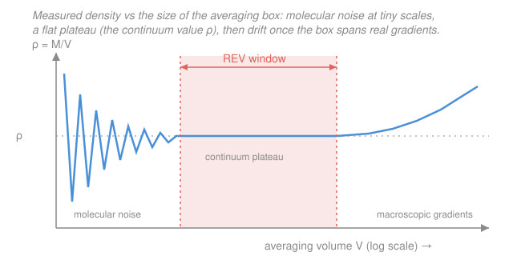

# Fluid Dynamics · Lesson 1.1: The continuum hypothesis and what a fluid is

> ⏱ ~15 min · Module 1: Kinematics and the governing equations · Builds on: [`calc-refresher` syllabus](../../calc-refresher/syllabus.md) · Unlocks: [1.2 Lagrangian vs Eulerian, and the material derivative](01-02-lagrangian-eulerian-material-derivative.md)

## Why this matters

Everything in this course — every equation of motion, every streamline, every boundary layer — rests on one quiet decision made before any physics starts: we pretend a fluid is a *smooth field*, not the swarm of jostling molecules it actually is. We write $\rho(\mathbf{x},t)$ for the density "at a point," even though a mathematical point contains either zero molecules or one, never a smooth number. This lesson earns that pretense. It tells you exactly when treating a fluid as a continuum is legitimate, when it silently fails (microfluidic chips, the edge of the atmosphere, a spacecraft on re-entry), and gives you a single dimensionless number — the Knudsen number — to decide.

## The idea

Hold up a glass of water. You know it's made of molecules bouncing around at hundreds of meters per second. But you don't *see* molecules; you see a smooth, coherent thing that pours and swirls. The trick your eyes are playing is **averaging**: any chunk of water you can actually perceive contains so astronomically many molecules that their statistical average — how much mass is here, how fast is it drifting, how hard is it pushing — is rock-steady. The graininess washes out.

The continuum hypothesis just formalizes that trick. We imagine chopping the fluid into tiny "parcels," each one:

- **small compared to the flow** — small enough that the density, velocity, and pressure barely change across it, so it's fair to call each parcel's average "the value at that point," *and*
- **huge compared to a molecule** — big enough that it holds millions of molecules, so its averages don't flicker as individual molecules dart in and out.

If a parcel can be both at once — small on the flow's ruler, gigantic on the molecule's ruler — then the averaged quantities vary *smoothly* from parcel to parcel, and we get honest continuous fields $\rho(\mathbf{x},t)$, $\mathbf{u}(\mathbf{x},t)$, $p(\mathbf{x},t)$ that we can differentiate and feed into PDEs. That "both at once" is possible only when the molecular scale and the flow scale are wildly separated. The whole hypothesis lives or dies on that separation of scales.

While we're here: what *is* a fluid, as opposed to a solid? A **fluid** — liquid or gas — cannot resist a shearing force by holding still. Push tangentially on it, however gently, and it keeps deforming for as long as you push; it has no fixed shape to snap back to. A **solid** resists shear *elastically*: it deforms a fixed amount and pushes back, storing the strain. That single property ("no resistance to steady shear, only to the *rate* of shear") is what makes fluid mechanics its own subject, and it's why both honey and helium are "fluids."

## The formal version

**Density as a limit that isn't really a limit.** Define the density measured over a box of volume $V$ centered at $\mathbf{x}$ as

$$\rho_V(\mathbf{x},t) = \frac{M(V)}{V},$$

where $M(V)$ is the total mass of molecules inside the box. *In words: mass caught, divided by volume searched.* Naively we'd want $\rho = \lim_{V\to 0}\rho_V$ — but that limit doesn't exist: shrink $V$ below molecular spacing and $M(V)$ jumps between $0$ and one molecule's mass, so $\rho_V$ spikes and craters. Instead we define density on a **representative elementary volume (REV)** $V^*$ — a volume in the *plateau* where $\rho_V$ has stopped depending on $V$:

$$\rho(\mathbf{x},t) \equiv \rho_{V^*}(\mathbf{x},t), \qquad \ell_{\text{mol}}^3 \ll V^* \ll L^3.$$

*In words: pick the box size in the flat middle range — big enough to smooth molecular noise, small enough not to blur real gradients — and call that the density.* Below the plateau you measure noise; above it you measure a spatial average of genuinely different densities. The plateau exists only if that middle range exists, which again demands scale separation. Velocity $\mathbf{u}$ and pressure $p$ are defined the same way: an average over the REV.

**The Knudsen number.** Let $\lambda$ be the **mean free path** — the average distance a molecule travels between collisions — and $L$ the characteristic length of the flow (pipe diameter, wing chord, obstacle size). Their ratio is the **Knudsen number**

$$\mathrm{Kn} = \frac{\lambda}{L}.$$

*In words: how big is a molecule's "step" compared to the whole flow?* The continuum hypothesis is valid when

$$\boxed{\;\mathrm{Kn} = \frac{\lambda}{L} \ll 1\;}$$

— conventionally $\mathrm{Kn}\lesssim 0.01$ for full continuum behavior, with a slip/transition regime for $0.01\lesssim\mathrm{Kn}\lesssim 10$ and free-molecular (kinetic-theory-only) flow beyond. Small $\mathrm{Kn}$ is exactly the scale separation the REV plateau needs: it guarantees you can fit an REV between the molecular ruler and the flow ruler.

**The no-slip condition (a preview).** At any solid boundary, a viscous fluid takes on the boundary's own velocity — it does not slide along the wall:

$$\mathbf{u}_{\text{fluid}} = \mathbf{u}_{\text{wall}} \quad\text{on the surface.}$$

*In words: the layer of fluid touching a wall is stuck to it — zero relative velocity.* This is an empirical boundary condition, and it too is a continuum statement: molecules do exchange momentum with the wall over a few mean free paths, and when that layer is negligibly thin ($\mathrm{Kn}\ll 1$) it collapses to "the fluid matches the wall." It's the anchor for every viscous flow we'll solve in Module 3; when $\mathrm{Kn}$ creeps up (MEMS, rarefied gas) no-slip fails and *slip* appears.

## Picture

The plateau *is* the continuum hypothesis, drawn. If it's wide, fluids are fields. If molecular noise and macroscopic drift overlap — no plateau — there is no honest density to speak of, and you must go back to counting molecules.

## Worked examples

**Example 1 (mechanical — is air near a wing a continuum?).** Take an aircraft wing with chord $L = 1\ \mathrm{m}$ in air at sea level, where the mean free path is $\lambda \approx 70\ \mathrm{nm} = 7\times10^{-8}\ \mathrm{m}$. Then

$$\mathrm{Kn} = \frac{\lambda}{L} = \frac{7\times10^{-8}}{1} = 7\times10^{-8} \ll 1.$$

Overwhelmingly continuum — by eight orders of magnitude. Even shrinking the scale to $L = 1\ \mu\mathrm{m} = 10^{-6}\ \mathrm{m}$ (a speck of dust) gives $\mathrm{Kn} = 0.07$, just entering the slip regime. So for ordinary air the continuum picture holds all the way down to roughly the micron; the fields $\rho,\mathbf{u},p$ are safe.

**Example 2 (why you'd care — how many molecules are in a parcel?).** Is a cubic micron really "huge on the molecular ruler"? A parcel of air of side $1\ \mu\mathrm{m}$ has volume $V = (10^{-6}\ \mathrm{m})^3 = 10^{-18}\ \mathrm{m}^3$. At STP an ideal gas holds $n \approx 2.5\times10^{25}$ molecules per cubic meter (Loschmidt's number). So the count is

$$N = nV = (2.5\times10^{25})(10^{-18}) \approx 2.5\times10^{7}.$$

Twenty-five million molecules in a box you'd call "a point" on the scale of a wing. The relative statistical fluctuation of an average over $N$ independent molecules scales like $1/\sqrt{N}$, so the density noise here is about $1/\sqrt{2.5\times10^7} \approx 2\times10^{-4}$ — two parts in ten thousand. That tiny number is the height of the wobbles on the left of the figure, and why the plateau looks flat. Shrink the parcel to $10\ \mathrm{nm}$ a side and $N$ drops to $\sim\!25$ molecules, fluctuations balloon to $\sim\!20\%$, and "density" stops meaning anything.

## Watch out

- **You might think the continuum limit is a real mathematical limit $V\to 0$.** It isn't — that limit *diverges* into molecular noise. The REV is a deliberately *finite* box parked on the plateau. "Density at a point" is shorthand for "density averaged over an REV small enough to localize," never a literal point value.
- **You might think only gases have a mean free path / continuum issue.** Liquids have one too (much shorter, $\sim\!0.1\ \mathrm{nm}$, since molecules are nearly touching), so liquids are continua down to nanometer scales — but nanofluidics and thin films *do* reach it. The hypothesis is about *scale separation*, not about phase.
- **You might think "fluid" means "liquid."** In this course a fluid is anything that can't resist steady shear — gases included. Air, water, honey, and plasma are all fluids; the equations don't care which, only that $\mathrm{Kn}\ll 1$.
- **You might think no-slip is obvious mechanics.** It's an *empirical* continuum boundary condition, not a theorem — and it genuinely breaks down at high $\mathrm{Kn}$, where the fluid slips along walls. We assume it throughout Module 3, but it has an expiry date.

## One-liner

> A fluid is a field wherever molecular steps are tiny against the flow — $\mathrm{Kn}=\lambda/L\ll 1$ — so an REV sits on the density plateau and $\rho,\mathbf{u},p$ vary smoothly enough to differentiate.

## Problems

**P1 (🟢)** Blood flows through a capillary of diameter $L = 8\ \mu\mathrm{m}$. Treating the plasma's effective mean free path as $\lambda \approx 0.3\ \mathrm{nm}$, compute $\mathrm{Kn}$ and decide whether the continuum hypothesis holds.

**P2 (🟡)** A MEMS device channels air at STP through a slot of height $L = 100\ \mathrm{nm}$; take $\lambda \approx 70\ \mathrm{nm}$. (a) Compute $\mathrm{Kn}$. (b) Which regime is this, and what specifically goes wrong with the no-slip boundary condition?

**P3 (🔴, optional)** You want a cubic air parcel (STP, $n \approx 2.5\times10^{25}\ \mathrm{m}^{-3}$) whose density fluctuations from molecular counting are held below $0.1\%$. Using the estimate that relative fluctuation $\approx 1/\sqrt{N}$, find the minimum number of molecules $N$ and the corresponding parcel side length. Then compare that side length to air's mean free path ($\lambda\approx 70\ \mathrm{nm}$) and comment on whether a valid REV exists.

Solutions

**P1** Convert to common units: $\lambda = 0.3\ \mathrm{nm} = 3\times10^{-10}\ \mathrm{m}$, $L = 8\ \mu\mathrm{m} = 8\times10^{-6}\ \mathrm{m}$.

$$\mathrm{Kn} = \frac{\lambda}{L} = \frac{3\times10^{-10}}{8\times10^{-6}} \approx 3.8\times10^{-5} \ll 1.$$

The continuum hypothesis holds comfortably for the plasma. *Check.* Dimensionless (length/length) ✓, and far below the $0.01$ threshold — reassuring, since we routinely model blood plasma as a continuous fluid. (Whole blood is a *separate* subtlety: red cells are $\sim\!8\ \mu\mathrm{m}$, comparable to $L$, so the *cell* structure, not the molecular structure, is what challenges a single-continuum model here — a nice reminder that "the relevant $\lambda$" is the scale of whatever discreteness matters.)

**P2** (a) $\lambda = 70\ \mathrm{nm}$, $L = 100\ \mathrm{nm}$:

$$\mathrm{Kn} = \frac{70}{100} = 0.7.$$

(b) With $\mathrm{Kn}=0.7$ we are deep in the **transition regime** ($0.01\lesssim\mathrm{Kn}\lesssim 10$), well past the slip threshold and heading toward free-molecular flow. The flow is *not* a clean continuum. Concretely, no-slip fails: the fluid no longer takes the wall's velocity but retains a finite **slip velocity** at the surface (the momentum-exchange layer is now a sizable fraction of the channel, not a negligible skin). Navier–Stokes with no-slip will give wrong flow rates; one needs slip boundary conditions or a kinetic (Boltzmann/DSMC) treatment. *Check.* $\mathrm{Kn}=O(1)$ is exactly where $\lambda$ and $L$ are comparable — the scale separation the REV needs is gone, so the breakdown is expected. ✓

**P3** Require $1/\sqrt{N} \le 10^{-3}$, i.e. $\sqrt{N}\ge 10^{3}$, so

$$N \ge 10^{6}\ \text{molecules}.$$

The parcel volume needed is $V = N/n = 10^{6}/(2.5\times10^{25}) = 4\times10^{-20}\ \mathrm{m}^3$, so the side length is

$$a = V^{1/3} = (4\times10^{-20})^{1/3}\ \mathrm{m} \approx 3.4\times10^{-7}\ \mathrm{m} = 340\ \mathrm{nm}.$$

Compare to $\lambda\approx 70\ \mathrm{nm}$: the required REV side ($340\ \mathrm{nm}$) is about $5\lambda$ — larger than a mean free path, so a genuine REV *does* exist, provided the flow scale $L$ is comfortably bigger than $\sim\!340\ \mathrm{nm}$ (equivalently $\mathrm{Kn}\ll 1$). If $L$ were only a few hundred nm (as in P2), the smoothing box would be as big as the flow itself and no plateau would exist. *Check.* Units: $(\mathrm{m}^3)^{1/3}=\mathrm{m}$ ✓; and $340\ \mathrm{nm}>\lambda$ but $\ll 1\ \mathrm{m}$, so the ordering $\ell_{\text{mol}}\ll V^{*1/3}\ll L$ can hold for macroscopic $L$. ✓

## Connections

- **Backward:** the whole apparatus of fields, gradients, and volume integrals we'll build on rests on multivariable calculus — see the [`calc-refresher` syllabus](../../calc-refresher/syllabus.md). "$\rho(\mathbf{x},t)$ is differentiable" is precisely the licence the continuum hypothesis grants, letting us write $\nabla\rho$, $\nabla\cdot\mathbf{u}$, and volume integrals of fluid properties.
- **Forward:** [1.2 Lagrangian vs Eulerian, and the material derivative](01-02-lagrangian-eulerian-material-derivative.md) takes these fields as given and asks how to differentiate a property *following a fluid parcel* — the parcel being exactly the REV-sized blob defined here. Every later governing equation (continuity, Euler, Navier–Stokes) is a statement about these smooth fields.
- **Sideways (dynamical systems / kinetic theory):** the breakdown of the continuum at high $\mathrm{Kn}$ is where fluid dynamics hands off to the kinetic theory of gases (the Boltzmann equation) — a reminder that Navier–Stokes is an *emergent*, coarse-grained description, valid only in the scale-separated regime, much as thermodynamics emerges from statistical mechanics.
