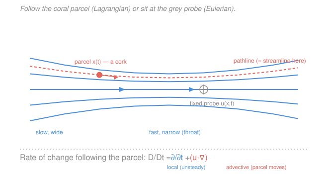

# Fluid Dynamics · Lesson 1.2: Lagrangian vs Eulerian, and the material derivative

> ⏱ ~15 min · Module 1: Kinematics and the governing equations · Builds on: [1.1 The continuum hypothesis](01-01-continuum-hypothesis.md) · Unlocks: [1.3 Conservation of mass and the continuity equation](01-03-continuity-equation.md)

## Why this matters

Last lesson we earned the right to talk about a fluid as a smooth field: density $\rho(\mathbf{x},t)$, velocity $\mathbf{u}(\mathbf{x},t)$, defined at every point. But "the fluid" is really countless little parcels rushing around, and the laws we want — $F = ma$, conservation of mass — are laws about *those parcels*, not about fixed points in space. So we have two languages: one that rides along with the fluid, one that stands on the bank. The **material derivative** is the dictionary between them, and getting it right is what turns Newton's second law into the Euler and Navier–Stokes equations you'll meet in [1.5](01-05-euler-equation.md)–[1.6](01-06-navier-stokes.md). It also hides the single nonlinear term responsible for nearly everything hard and beautiful in this course.

## The idea

Stand on a bridge and drop a cork in the river. Two honest ways to describe the flow:

- **Lagrangian** — *become the cork.* You label one parcel and follow it, recording its position $\mathbf{x}(t)$, its velocity, the temperature it feels, as it drifts downstream. This is the mechanics you already know: named particles with trajectories.
- **Eulerian** — *stay on the bridge.* You bolt a flow meter to one spot and record whatever fluid happens to be passing: $\mathbf{u}(\mathbf{x},t)$ at that fixed $\mathbf{x}$. Different parcels stream past a fixed probe from one instant to the next.

Fields are far easier to work with (you don't have to track infinitely many trajectories), so fluid dynamics is written in Eulerian language. But the *physics* — acceleration, heating — happens to parcels. So we constantly need to ask an Eulerian question that's secretly Lagrangian: *how fast is some quantity changing for the particular parcel that's here right now?*

Here's the subtlety that the material derivative fixes. A parcel's temperature can change for two completely different reasons. Either the whole river is warming with time (**local** change — even a bolted-down probe would see it), **or** the parcel is being carried into a warmer patch of an unchanging temperature map (**advective** change — the probe sees nothing, but the moving cork feels it). The total rate the parcel experiences is the sum of both.

## The formal version

Take any field $q(\mathbf{x},t)$ — a scalar like temperature, or one component of velocity — and follow a single parcel whose position is $\mathbf{x}(t)$. The value the parcel carries is $q(\mathbf{x}(t),t)$, a function of $t$ alone. Differentiate with the multivariable chain rule:

$$\frac{Dq}{Dt} \;\equiv\; \frac{d}{dt}\,q(\mathbf{x}(t),t) \;=\; \frac{\partial q}{\partial t} \;+\; \frac{d\mathbf{x}}{dt}\cdot\nabla q.$$

The parcel's own velocity is $d\mathbf{x}/dt = \mathbf{u}$, so

$$\boxed{\;\frac{Dq}{Dt} \;=\; \underbrace{\frac{\partial q}{\partial t}}_{\text{local}} \;+\; \underbrace{(\mathbf{u}\cdot\nabla)\,q}_{\text{advective}}\;}$$

*In words: the rate of change felt by a moving parcel equals the rate at a fixed point, plus a correction for the parcel sliding through spatial variations of $q$.* We write $D/Dt$ (the **material** or **substantial derivative**) to flag "following the fluid," reserving $\partial/\partial t$ for "at a fixed point." Symbols: $\nabla q = (\partial_x q, \partial_y q, \partial_z q)$ is the spatial gradient, and $\mathbf{u}\cdot\nabla = u_x\partial_x + u_y\partial_y + u_z\partial_z$ is a scalar differential operator — *rate of motion along each axis times the slope along that axis.*

The two pieces:

- $\partial q/\partial t$ — the **local** (or unsteady) rate: how $q$ changes with time at a frozen location. Zero for a **steady** flow, where nothing at any fixed point ever changes.
- $(\mathbf{u}\cdot\nabla)q$ — the **advective** rate: change the parcel picks up purely by *moving* into a region where $q$ differs. Zero only if $q$ is uniform along the direction of motion.

Apply this operator to the velocity field itself and you get the **acceleration of a fluid parcel** — the $\mathbf{a}$ in $F=ma$:

$$\mathbf{a} \;=\; \frac{D\mathbf{u}}{Dt} \;=\; \frac{\partial \mathbf{u}}{\partial t} \;+\; (\mathbf{u}\cdot\nabla)\,\mathbf{u}.$$

*In words: a parcel accelerates either because the flow is speeding up in time, or because it is being swept into a place where the flow is faster.* Look hard at the second term: $\mathbf{u}$ multiplies derivatives of $\mathbf{u}$ — it is **nonlinear** (quadratic) in the unknown velocity. That single term is why fluid equations resist exact solution and why they can go turbulent; it is the seed we'll keep returning to.

**Lines you can draw.** Three curves describe a flow, and it's worth keeping them straight:

- **Pathline** — the actual trajectory $\mathbf{x}(t)$ of one parcel over time (a long-exposure photo of one glowing cork). Lagrangian.
- **Streamline** — a curve everywhere tangent to $\mathbf{u}$ at a *single instant* (the direction arrows of the field, frozen). Eulerian. Formally $d\mathbf{x}\times\mathbf{u}=\mathbf{0}$ along it.
- **Streakline** — the locus of all parcels that have passed through one fixed point (the visible plume from a smoke source).

For **steady flow** ($\partial_t\mathbf{u}=0$) all three coincide: the velocity arrows never change, so a parcel simply slides along the fixed streamline it started on, and every parcel through a point traces the same curve. For **unsteady** flow they generally differ — a fact that makes flow-visualization photos easy to misread.

## Picture

## Worked examples

**Example 1 (temperature on a steady day — advection with no local change).** A shallow river flows in the $x$-direction at constant speed $\mathbf{u}=(U,0,0)$, $U=0.5\ \mathrm{m/s}$. The sun has baked a fixed temperature map that rises downstream, $T(x)=T_0+\beta x$ with $\beta = 0.02\ \mathrm{^\circ C/m}$, and it isn't changing in time. Does a drifting cork warm up?

At any fixed point the temperature is constant, so $\partial T/\partial t = 0$ — a bolted probe reads a flat line. But the cork moves:

$$\frac{DT}{Dt} = \underbrace{\frac{\partial T}{\partial t}}_{0} + (\mathbf{u}\cdot\nabla)T = U\frac{\partial T}{\partial x} = U\beta = 0.5\times 0.02 = 0.01\ \mathrm{^\circ C/s}.$$

So the cork warms at $0.01\ \mathrm{^\circ C}$ per second even though *nothing at any fixed point is changing.* The warming is entirely advective — the parcel is being carried into warmer water. This is the whole point of $D/Dt$: $\partial_t T = 0$ and $DT/Dt\neq 0$ are both true and both meaningful.

**Example 2 (a nozzle — steady flow, yet parcels accelerate).** Water is squeezed through a converging nozzle. Model the steady, one-dimensional speed as $u(x)=U_0(1+\alpha x)$ — faster further along, with $U_0 = 1\ \mathrm{m/s}$ and $\alpha = 2\ \mathrm{m^{-1}}$. Is a fluid parcel accelerating?

The flow is steady, so $\partial u/\partial t = 0$ — the reading at any fixed station never changes. Yet the parcel's acceleration is

$$a = \frac{Du}{Dt} = \underbrace{\frac{\partial u}{\partial t}}_{0} + u\frac{\partial u}{\partial x} = U_0(1+\alpha x)\cdot U_0\alpha = U_0^2\,\alpha\,(1+\alpha x).$$

At the inlet $x=0$: $a = (1)^2(2)(1) = 2\ \mathrm{m/s^2}$. A parcel genuinely speeds up as it moves down the nozzle — it must, since it's continuously entering faster-moving territory — even though a photograph of the flow taken a second later looks identical. "Steady" describes the *field at fixed points*, never the fate of a *parcel*. This advective acceleration $u\,\partial_x u$ is exactly the nonlinear term that will drive Bernoulli's equation in [2.1](02-01-bernoulli.md).

## Watch out

- **You might think $\partial \mathbf{u}/\partial t = 0$ means no acceleration.** It doesn't — steady flow can accelerate parcels through the advective term $(\mathbf{u}\cdot\nabla)\mathbf{u}$, as the nozzle shows. Never equate "the field is steady" with "the parcels aren't accelerating."
- **You might read $(\mathbf{u}\cdot\nabla)\mathbf{u}$ as $\mathbf{u}(\nabla\cdot\mathbf{u})$.** Different beasts. $\mathbf{u}\cdot\nabla$ is a *scalar operator* ($u_x\partial_x + u_y\partial_y + u_z\partial_z$) that you then apply to each component of $\mathbf{u}$; $\nabla\cdot\mathbf{u}$ is the *divergence*, a single scalar. The advective term is the former.
- **You might trust that a smoke photo shows parcel paths.** Only in steady flow. A snapshot of streamlines, a smoke streakline, and one parcel's pathline are three different curves whenever the flow is unsteady — don't infer trajectories from an instantaneous streamline picture.

## One-liner

> $\dfrac{D}{Dt}=\dfrac{\partial}{\partial t}+(\mathbf{u}\cdot\nabla)$ converts "rate of change following a parcel" into fixed-field language — a local part plus a nonlinear advective part that is the whole source of fluid trouble.

## Problems

**P1 (🟢)** A steady two-dimensional flow has velocity $\mathbf{u}=(u,v)=(x,-y)$ (in consistent units). A scalar dye concentration is $c(x,y)=x^2y$. Compute the material derivative $Dc/Dt$ as a function of position, and evaluate it at the point $(1,1)$.

**P2 (🟡)** For the same flow $\mathbf{u}=(x,-y)$, find the acceleration field $\mathbf{a}=D\mathbf{u}/Dt$. Confirm it is nonzero even though the flow is steady, and identify which term supplies the acceleration.

**P3 (🔴, optional)** An unsteady one-dimensional flow is $u(x,t)=x/(1+t)$. (a) Find the pathline $x(t)$ of the parcel that sits at $x=x_0$ at $t=0$ by solving $dx/dt=u(x,t)$. (b) Find the material acceleration $Du/Dt$ from the Eulerian field, and separately compute $d^2x/dt^2$ from your pathline. Show they agree.

Solutions

**P1** With $\mathbf{u}=(x,-y)$ and $c=x^2y$, the flow is steady so $\partial c/\partial t=0$:

$$\frac{Dc}{Dt} = \partial_t c + u\,\partial_x c + v\,\partial_y c = 0 + x(2xy) + (-y)(x^2) = 2x^2y - x^2y = x^2y.$$

At $(1,1)$: $Dc/Dt = (1)^2(1) = 1$.

*Check.* Dimensionally each term is (velocity)$\times$(concentration/length) = concentration/time, a rate, as a material derivative must be. Sanity: interestingly $Dc/Dt = x^2y = c$ here, so along a parcel $c$ grows exponentially — consistent with parcels being stretched in $x$ (where $u=x>0$ pushes outward) faster than they're compressed in $y$. ✓

**P2** The velocity components are $u=x$, $v=-y$, both time-independent, so $\partial_t\mathbf{u}=\mathbf{0}$ and all of the acceleration is advective:

$$a_x = (\mathbf{u}\cdot\nabla)u = u\,\partial_x u + v\,\partial_y u = x(1) + (-y)(0) = x,$$
$$a_y = (\mathbf{u}\cdot\nabla)v = u\,\partial_x v + v\,\partial_y v = x(0) + (-y)(-1) = y.$$

So $\mathbf{a}=(x,\,y)$, which is nonzero everywhere except the origin. The flow is steady ($\partial_t\mathbf{u}=0$), yet parcels accelerate: every bit of the acceleration comes from the advective term $(\mathbf{u}\cdot\nabla)\mathbf{u}$.

*Check.* At the stagnation point $(0,0)$, $\mathbf{u}=\mathbf{0}$ and $\mathbf{a}=\mathbf{0}$ — a parcel sitting exactly there stays put and doesn't accelerate, as it must. Elsewhere $\mathbf{a}$ points radially outward, matching a flow that stretches parcels away along $x$ and funnels them in along $y$. ✓

**P3** (a) The pathline solves $\dfrac{dx}{dt}=\dfrac{x}{1+t}$. Separate: $\dfrac{dx}{x}=\dfrac{dt}{1+t}$, so $\ln x = \ln(1+t) + C$, giving $x(t)=x_0(1+t)$ using $x(0)=x_0$.

(b) **Eulerian material acceleration.** With $u=x/(1+t)$:

$$\frac{Du}{Dt}=\partial_t u + u\,\partial_x u = -\frac{x}{(1+t)^2} + \frac{x}{1+t}\cdot\frac{1}{1+t} = -\frac{x}{(1+t)^2}+\frac{x}{(1+t)^2}=0.$$

**From the pathline.** $x(t)=x_0(1+t)$ gives velocity $\dot x = x_0$ (constant) and $\ddot x = 0$.

Both give zero — they agree. The local and advective parts each equal $x/(1+t)^2$ in magnitude and exactly cancel: the field weakens in time at any fixed point (local, negative) precisely as fast as each parcel drifts into a faster region (advective, positive). A parcel moves at constant velocity $x_0$, hence zero acceleration, even though neither term alone vanishes.

*Check.* The pathline $x=x_0(1+t)$ has constant slope, so $\ddot x=0$ is immediate — the direct Lagrangian route confirms the Eulerian $D/Dt$ computation, which is the whole reason the two must be consistent. ✓

## Connections

- **Backward:** the material derivative only makes sense because [1.1](01-01-continuum-hypothesis.md) let us define smooth, differentiable fields $q(\mathbf{x},t)$; the chain-rule step is precisely the multivariable chain rule and gradient from [`calc-refresher`](../../calc-refresher/syllabus.md). And $\mathbf{a}=D\mathbf{u}/Dt$ is just the parcel version of the $\mathbf{a}$ in [`mechanics-refresher`](../../mechanics-refresher/syllabus.md)'s $F=ma$.
- **Forward:** applying $D/Dt$ to mass gives the continuity equation in [1.3](01-03-continuity-equation.md), and to momentum gives Euler ([1.5](01-05-euler-equation.md)) and Navier–Stokes ([1.6](01-06-navier-stokes.md)); the nonlinear advective term $(\mathbf{u}\cdot\nabla)\mathbf{u}$ is what makes those equations hard and eventually turbulent ([4.5](04-05-turbulence-kolmogorov.md)).
- **Sideways (dynamical systems):** a pathline is a trajectory of the ODE $\dot{\mathbf{x}}=\mathbf{u}(\mathbf{x},t)$, so streamlines and stagnation points are the phase portrait and fixed points studied in [`dynamical-systems`](../../dynamical-systems/syllabus.md) — the nonlinearity of advection is the same source of chaos there.
