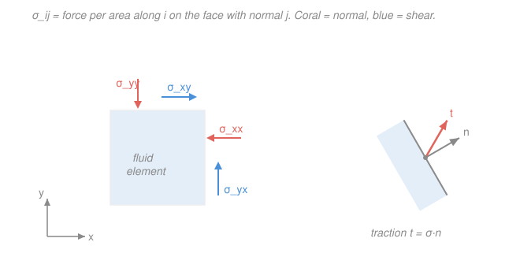

# Fluid Dynamics · Lesson 1.4: Forces in a fluid and the stress tensor

> ⏱ ~15 min · Module 1: Kinematics and the governing equations · Builds on: [1.3 Conservation of mass and the continuity equation](01-03-continuity-equation.md) · Unlocks: [1.5 The Euler equation](01-05-euler-equation.md)

## Why this matters

We have the fluid's bookkeeping for *mass* ([1.3](01-03-continuity-equation.md)); next we want its bookkeeping for *momentum* — Newton's second law for a blob of fluid. But before we can write "$m\mathbf{a} = \mathbf{F}$" for a parcel, we need an honest inventory of the forces. Gravity is easy. The hard one is the push and drag a parcel feels from the fluid pressing on it all around — and that force refuses to be a single vector. It depends on *which way the surface faces*. The object that captures "force depending on orientation" is a rank-2 tensor, and getting it right is the whole content of this lesson. Everything in [1.5](01-05-euler-equation.md) and [1.6](01-06-navier-stokes.md) is just taking the divergence of what we build here.

## The idea

Imagine a tiny cube of fluid. Two utterly different kinds of force act on it.

**Body forces** reach in and pull on every bit of matter inside — gravity is the archetype. They scale with the *volume* (really the mass) of the parcel: double the cube, double the weight. We write the body force per unit volume as $\rho\mathbf{g}$.

**Surface forces** act only through *contact* on the cube's six faces, exerted by the fluid immediately outside pushing and rubbing on the fluid inside. These scale with *area*, not volume. Pressure is one — it squeezes each face inward. But there is also friction: if the fluid on the far side of a face is sliding past, it drags along the face, a force *parallel* to the surface. That tangential drag is what viscosity is made of.

Here is the subtlety that forces a tensor on us. Pick a point inside the fluid and slice through it with an imaginary flat cut. The fluid on one side pushes on the other across that cut with some force per area — call it the **traction**. Now tilt the cut. The traction *changes*, even at the very same point, because you are now exposing a differently-oriented face to the surrounding fluid. So the surface force is not one vector per point; it is *a vector for every possible orientation of surface* at that point. A single number won't do (pressure alone misses the shear); a single vector won't do (it can't depend on orientation). The machine that eats an orientation and returns a traction vector is exactly a **rank-2 tensor** — the Cauchy stress tensor.

## The formal version

Fix Cartesian axes and use indices $i, j \in \{1,2,3\}$ for $x, y, z$. Throughout we use the **summation convention**: a repeated index in a term is summed over $1,2,3$ (see index notation in [`mathematical-methods-physics` 1.5](../../mathematical-methods-physics/syllabus.md)).

**The stress tensor.** Define $\sigma_{ij}$ as

$$\sigma_{ij} = \text{the } i\text{-component of force per unit area on a surface whose outward normal points in the } j\text{-direction.}$$

*In words: the second index picks the face; the first index picks the direction of the force on it.* So $\sigma_{xx}$ is the $x$-force on the $x$-facing face (a normal push/pull), while $\sigma_{yx}$ is the $y$-force on that same $x$-facing face (a shear). Diagonal entries are **normal stresses**, off-diagonal entries are **shear stresses**. Units are pascals, $\mathrm{Pa} = \mathrm{N/m^2}$.

**Cauchy's traction formula.** For a surface with unit outward normal $\mathbf{n}$ (components $n_j$), the traction (force per area) exerted across it is

$$t_i = \sigma_{ij}\, n_j.$$

*In words: feed the tensor the direction the surface faces, and it hands back the force-per-area vector on it.* This one linear relation is the payoff — knowing the nine numbers $\sigma_{ij}$ at a point tells you the traction on *every* orientation through that point. (It follows from balancing forces on a shrinking tetrahedron: surface forces scale as area $\sim \ell^2$, body forces and inertia as volume $\sim \ell^3$, so as $\ell\to 0$ the surface forces must balance among themselves, which is precisely the linear law above.)

**Splitting off the pressure.** Decompose the tensor into an isotropic piece and the rest:

$$\boxed{\,\sigma_{ij} = -p\,\delta_{ij} + \tau_{ij}\,}$$

where $\delta_{ij}$ is the Kronecker delta ($1$ if $i=j$, else $0$) and $p$ is the **pressure**.

- The isotropic part $-p\,\delta_{ij}$ is **pressure**: a normal stress equal on every face, the same in all directions (Pascal's law), and **compressive** — the minus sign makes it push *inward* along $-\mathbf{n}$. On any face its traction is $t_i = -p\,\delta_{ij}n_j = -p\,n_i$, i.e. $-p\,\mathbf{n}$: straight into the surface, magnitude $p$, no matter how the face is tilted.
- The leftover $\tau_{ij}$ is the **deviatoric** (or **viscous**) stress: the shears plus any direction-dependent normal deviations. It is present *only when the fluid is deforming*. Lesson [1.6](01-06-navier-stokes.md) will tie $\tau_{ij}$ to the rate of strain via the viscosity $\mu$.

*In words: strip out the part that squeezes equally from all sides — that's pressure — and whatever remains is the frictional stress that only shows up while the fluid flows.*

**Symmetry.** The stress tensor is symmetric,

$$\sigma_{ij} = \sigma_{ji}.$$

*In words: the $y$-force on the $x$-face equals the $x$-force on the $y$-face.* This is not a definition — it is forced by **conservation of angular momentum**. The net torque of the surface stresses on a cube of side $\ell$ scales as (stress)$\times$(area)$\times$(lever arm) $\sim \sigma\,\ell^2\cdot\ell = \sigma\,\ell^3$, while its moment of inertia scales as $\rho\,\ell^2\cdot\ell^3 = \rho\,\ell^5$. The angular acceleration would go as $\sigma\ell^3/\rho\ell^5 = \sigma/\rho\ell^2$, which blows up as $\ell\to 0$ unless the antisymmetric part of $\sigma$ vanishes. A real fluid can't spin an infinitesimal parcel infinitely fast, so $\sigma_{ij}=\sigma_{ji}$.

**The net surface force.** Sum the tractions over the closed surface of a parcel and shrink it: by the divergence theorem, the surface force per unit volume is the divergence of the stress tensor,

$$f_i^{\text{surf}} = \partial_j \sigma_{ij} = -\partial_i p + \partial_j \tau_{ij}.$$

*In words: only the imbalance of stress across a parcel gives a net push — a uniform stress squeezes equally on opposite faces and cancels.* The first term $-\partial_i p = -(\nabla p)_i$ is the familiar **pressure-gradient force**: fluid is pushed from high toward low pressure. This expression is the entire bridge to the equation of motion — set (mass $\times$ acceleration) of a parcel equal to $\rho g_i + \partial_j\sigma_{ij}$ and you have [1.5](01-05-euler-equation.md) (drop $\tau$) and [1.6](01-06-navier-stokes.md) (keep it).

**Fluid at rest.** With no motion there is no deformation, so $\tau_{ij}=0$ and $\sigma_{ij}=-p\,\delta_{ij}$: pressure only. The parcel just balances gravity, $0 = \rho g_i + \partial_j\sigma_{ij} = \rho g_i - \partial_i p$, i.e.

$$\nabla p = \rho\,\mathbf{g},$$

the equation of **hydrostatics**. That a fluid at rest supports *no shear* is the defining property of a fluid: lean on it tangentially and it flows rather than holding the stress.

## Picture

## Worked examples

**Example 1 (traction from the tensor).** At a point the stress tensor is, in pascals,

$$\sigma_{ij} = \begin{pmatrix} -4 & 1 & 0 \\ 1 & -6 & 3 \\ 0 & 3 & -2 \end{pmatrix}.$$

Find the traction on the face whose outward normal is $\mathbf{n} = (0,1,0)$ (the $+y$ face), and separate it into normal and shear parts.

The normal picks out the *second column* (index $j=2$): $t_i = \sigma_{i2}$, so

$$\mathbf{t} = (\sigma_{12}, \sigma_{22}, \sigma_{32}) = (1, -6, 3)\ \mathrm{Pa}.$$

The **normal stress** is the component of $\mathbf{t}$ along $\mathbf{n}$: $t_n = \mathbf{t}\cdot\mathbf{n} = -6\ \mathrm{Pa}$ (negative $=$ compression, the face is being pushed in). The **shear** is what's left, the part tangent to the face: $\mathbf{t} - t_n\mathbf{n} = (1,0,3)$, of magnitude $\sqrt{1^2+3^2} = \sqrt{10} \approx 3.16\ \mathrm{Pa}$. So this face is squeezed with $6\ \mathrm{Pa}$ and dragged sideways with $3.16\ \mathrm{Pa}$.

**Example 2 (pressure is the average normal stress).** Take the trace of the decomposition. Since $\delta_{ii} = 3$ and, for a fluid, the viscous part is traceless in the incompressible case ($\tau_{ii}=0$),

$$\sigma_{ii} = -p\,\delta_{ii} + \tau_{ii} = -3p \quad\Longrightarrow\quad p = -\tfrac13\,\sigma_{ii} = -\tfrac13(\sigma_{xx}+\sigma_{yy}+\sigma_{zz}).$$

*Pressure is minus the average of the three normal stresses.* For the tensor above, $\sigma_{ii} = -4-6-2 = -12$, so $p = 4\ \mathrm{Pa}$. This is why one number, pressure, survives even in a churning flow: it is the isotropic average that every orientation feels in common, cleanly separated from the direction-dependent friction $\tau_{ij}$.

## Watch out

- **You might read $\sigma_{ij}$ with the indices backwards.** The convention here (Batchelor, Kundu) is *force-$i$ on face-$j$*: the **second** index names the face's normal. Because $\sigma$ is symmetric it rarely bites you numerically — but $t_i = \sigma_{ij}n_j$ only reads correctly with this ordering.
- **You might think pressure is a force, or points somewhere in particular.** Pressure is a *scalar*; it becomes a force only after you hand it a surface: $-p\,\mathbf{n}$. And it is always perpendicular and inward — pressure never shears. Only the deviatoric $\tau_{ij}$ can pull tangentially.
- **You might expect a static fluid to resist a sideways push.** It can't — with $\tau=0$ there is no shear stress available, so any tangential load makes it flow. "Holds a static shear" is precisely what separates a *solid* from a *fluid*.
- **You might forget that only the *gradient* of stress pushes a parcel.** Uniform pressure exerts a huge force on each face, but the faces cancel in pairs; the net force per volume is $-\nabla p$, not $p$. A parcel in a uniform-pressure sea feels nothing.

## One-liner

> The Cauchy stress tensor $\sigma_{ij} = -p\,\delta_{ij} + \tau_{ij}$ turns a surface's orientation $\mathbf{n}$ into its traction $t_i = \sigma_{ij}n_j$ — isotropic pressure plus deviatoric friction — and its divergence $\partial_j\sigma_{ij} = -\partial_i p + \partial_j\tau_{ij}$ is the surface force that drives the equation of motion.

## Problems

**P1 (🟢)** At a point the stress tensor (in Pa) is

$$\sigma_{ij} = \begin{pmatrix} 2 & -3 & 0 \\ -3 & 5 & 1 \\ 0 & 1 & -4 \end{pmatrix}.$$

Find the traction $\mathbf{t}$ on the face with outward normal $\mathbf{n} = (1,0,0)$. What is the normal stress on this face, and is it tensile or compressive? Which entries of $\sigma$ are normal stresses and which are shears?

**P2 (🟡)** A tank of water ($\rho = 1000\ \mathrm{kg/m^3}$) sits at rest with gravity $\mathbf{g} = (0,0,-g)$, $g = 9.8\ \mathrm{m/s^2}$, and the surface at $z=0$ at atmospheric pressure $p_0 = 1.013\times10^5\ \mathrm{Pa}$. Starting from $\nabla p = \rho\mathbf{g}$, find $p(z)$ and evaluate the pressure at depth $10\ \mathrm{m}$ (i.e. $z=-10\ \mathrm{m}$).

**P3 (🔴)** For the tensor in P1, compute the mechanical pressure $p = -\tfrac13\sigma_{ii}$ and the deviatoric stress $\tau_{ij} = \sigma_{ij} + p\,\delta_{ij}$. Verify that $\tau_{ij}$ is traceless, and confirm it is still symmetric.

Solutions

**P1** The normal $\mathbf{n}=(1,0,0)$ selects the first column: $t_i = \sigma_{i1} = (\sigma_{11},\sigma_{21},\sigma_{31})$, so

$$\mathbf{t} = (2,\,-3,\,0)\ \mathrm{Pa}.$$

Normal stress $= \mathbf{t}\cdot\mathbf{n} = t_x = 2\ \mathrm{Pa} > 0$: **tensile** (the fluid across this face is pulling outward, not pushing in). The tangential remainder $(0,-3,0)$, magnitude $3\ \mathrm{Pa}$, is shear. The **normal stresses** are the diagonal entries $\sigma_{11}=2,\ \sigma_{22}=5,\ \sigma_{33}=-4$; the **shears** are the off-diagonal $\sigma_{12}=\sigma_{21}=-3$ and $\sigma_{23}=\sigma_{32}=1$ (with $\sigma_{13}=\sigma_{31}=0$).

*Check.* Traction has units of Pa ✓; picking the column (not the row) is right because the free index in $t_i=\sigma_{ij}n_j$ is the first, and $n_j$ nonzero only for $j=1$. Symmetry $\sigma_{ij}=\sigma_{ji}$ holds, as it must. ✓

**P2** At rest $\tau=0$, so hydrostatics gives $\nabla p = \rho\mathbf{g}$. Only the $z$-component is nonzero:

$$\frac{\partial p}{\partial x}=\frac{\partial p}{\partial y}=0,\qquad \frac{\partial p}{\partial z} = -\rho g.$$

Pressure depends on $z$ alone; integrating from the surface,

$$p(z) = p_0 - \rho g\,z.$$

Since $z$ is measured upward and is *negative* below the surface, deeper means larger $p$. At $z=-10\ \mathrm{m}$:

$$p = 1.013\times10^5 - (1000)(9.8)(-10) = 1.013\times10^5 + 9.8\times10^4 = 1.993\times10^5\ \mathrm{Pa}.$$

*Check.* Units: $\rho g z = (\mathrm{kg\,m^{-3}})(\mathrm{m\,s^{-2}})(\mathrm{m}) = \mathrm{kg\,m^{-1}s^{-2}} = \mathrm{Pa}$ ✓. Magnitude: $\approx 1.97\ \mathrm{atm}$ — the familiar "one extra atmosphere per $\sim 10\ \mathrm{m}$ of water." ✓

**P3** Trace: $\sigma_{ii} = 2 + 5 + (-4) = 3$, so

$$p = -\tfrac13(3) = -1\ \mathrm{Pa}.$$

Then $\tau_{ij} = \sigma_{ij} + p\,\delta_{ij} = \sigma_{ij} - \delta_{ij}$ subtracts $1$ from each diagonal entry:

$$\tau_{ij} = \begin{pmatrix} 1 & -3 & 0 \\ -3 & 4 & 1 \\ 0 & 1 & -5 \end{pmatrix}.$$

Trace: $1 + 4 + (-5) = 0$ ✓ traceless. And it is unchanged off the diagonal, so $\tau_{ij}=\tau_{ji}$ still holds ✓.

*Check.* Subtracting a multiple of the identity ($-p\,\delta_{ij}$) removes the isotropic average without touching shears or symmetry — exactly what "deviatoric" should mean. A negative mechanical pressure here just reflects that these normal stresses average to a net tension. ✓

## Flashback

**From Lesson 1.3 (Continuity equation):** A steady flow has velocity field $\mathbf{u} = (\alpha x,\ \beta y,\ \gamma z)$ with constant $\alpha,\beta,\gamma$. For what relation among them is the flow incompressible? If $\alpha = 3\ \mathrm{s^{-1}}$ and $\beta = -1\ \mathrm{s^{-1}}$, find $\gamma$.

Solution

Incompressibility is $\nabla\cdot\mathbf{u} = 0$. Here

$$\nabla\cdot\mathbf{u} = \partial_x(\alpha x) + \partial_y(\beta y) + \partial_z(\gamma z) = \alpha + \beta + \gamma.$$

So the flow is incompressible iff $\alpha + \beta + \gamma = 0$. With $\alpha=3,\ \beta=-1$: $\gamma = -(\alpha+\beta) = -2\ \mathrm{s^{-1}}$.

*Check.* Each term has units $\mathrm{s^{-1}}$ ✓. Physically, stretching a parcel along $x$ ($\alpha>0$) and $y$'s mild compression must be exactly offset by compression along $z$ so the parcel's volume is preserved — which is what $\nabla\cdot\mathbf{u}=0$ says. ✓

## Connections

- **Backward:** the divergence-theorem step that turned the tractions summed over a parcel's faces into $\partial_j\sigma_{ij}$ is the same control-volume-to-PDE move used for mass in [1.3](01-03-continuity-equation.md) — now applied to momentum. Vector calculus (divergence theorem, $\nabla\cdot$) is from [`calc-refresher`](../../calc-refresher/syllabus.md).
- **Forward:** setting parcel acceleration $\rho\,\tfrac{D\mathbf{u}}{Dt}$ equal to $\rho\mathbf{g} + \partial_j\sigma_{ij}$ gives the equation of motion: drop $\tau_{ij}$ for the inviscid [1.5 Euler equation](01-05-euler-equation.md), keep it for the [1.6 Navier–Stokes equations](01-06-navier-stokes.md), where $\tau_{ij}$ gets tied to the rate of strain through the viscosity $\mu$.
- **Sideways (tensors & index notation):** $\sigma_{ij}$ is a genuine rank-2 tensor — it transforms under rotations like the outer product of two vectors — and the summation-convention algebra ($t_i=\sigma_{ij}n_j$, traces, $\delta_{ij}$) is exactly the machinery of [`mathematical-methods-physics` 1.5](../../mathematical-methods-physics/syllabus.md). The split into an isotropic part ($-p\,\delta_{ij}$) plus a traceless symmetric part ($\tau_{ij}$) is the same irreducible decomposition used throughout that course.
