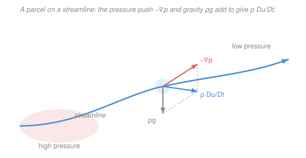

# Fluid Dynamics · Lesson 1.5: The Euler equation

> ⏱ ~15 min · Module 1: Kinematics and the governing equations · Builds on: [1.4 Forces in a fluid and the stress tensor](01-04-stress-tensor.md), [1.2 Lagrangian vs Eulerian and the material derivative](01-02-lagrangian-eulerian-material-derivative.md) · Unlocks: [1.6 The Navier–Stokes equations](01-06-navier-stokes.md)

## Why this matters

Every result you meet in the next two modules — Bernoulli, the lift on a wing, flow past a cylinder, water waves — is a special case of one equation of motion for an ideal fluid. That equation is **Euler's**, and it is nothing more exotic than $F = ma$ written for a chunk of fluid. Get it, term by term, and the rest of ideal-flow theory is bookkeeping. It is also the natural half of Navier–Stokes ([1.6](01-06-navier-stokes.md)): drop the friction and this is what's left.

## The idea

Take a tiny blob of fluid — a **parcel** — and apply Newton's second law to it. Two things push on it. First, **pressure**: the surrounding fluid squeezes it from all sides, and if the squeeze is stronger on one face than the opposite one, there's a net shove. Fluid gets pushed *from high pressure toward low pressure*, and the strength of that shove is the *pressure gradient*. Second, **gravity** (or any body force), pulling on its mass.

The only subtlety is the "$a$" — the acceleration. A fluid parcel accelerates for two reasons. The flow at a fixed point might be speeding up in time (**unsteady**), *and* the parcel might be carried into a region where the flow is faster (**convective**). That combination is exactly the material derivative $\tfrac{D\mathbf{u}}{Dt}$ you built in [1.2](01-02-lagrangian-eulerian-material-derivative.md). So Euler's equation is: (mass density) $\times$ (that full acceleration) = (pressure push) + (gravity). We are calling the fluid **inviscid** — ignoring internal friction — which is why the shear part of the stress tensor from [1.4](01-04-stress-tensor.md) drops out and only pressure survives.

## The formal version

Start from Newton's law per unit volume. For a parcel of density $\rho$ (mass per volume, kg/m³) moving with velocity field $\mathbf{u}(\mathbf{x},t)$ (m/s), the acceleration *following the parcel* is the material derivative from [1.2](01-02-lagrangian-eulerian-material-derivative.md):

$$\frac{D\mathbf{u}}{Dt} = \partial_t\mathbf{u} + (\mathbf{u}\cdot\nabla)\mathbf{u}.$$

*In words: a parcel's acceleration = how the flow changes in time at a point + how the flow changes across the space the parcel is sweeping through.*

The forces per unit volume, for an **inviscid** fluid, are exactly two. From [1.4](01-04-stress-tensor.md), the stress tensor of a fluid at rest (and of any inviscid fluid) is just $\sigma_{ij} = -p\,\delta_{ij}$, whose divergence gives a net surface force per volume of $-\nabla p$; the body force per volume is $\rho\mathbf{g}$. Setting $\rho\,(\text{acceleration}) = \text{force per volume}$:

$$\boxed{\;\rho\frac{D\mathbf{u}}{Dt} = \rho\Big(\partial_t\mathbf{u} + (\mathbf{u}\cdot\nabla)\mathbf{u}\Big) = -\nabla p + \rho\mathbf{g}\;}$$

This is the **Euler equation** (1757). *In words: mass-per-volume times acceleration equals the pressure-gradient push plus gravity.* Read the four terms:

- $\rho\,\partial_t\mathbf{u}$ — **local (unsteady) acceleration.** The flow at a fixed point changing in time. Zero for steady flow.
- $\rho\,(\mathbf{u}\cdot\nabla)\mathbf{u}$ — **convective (advective) acceleration.** The parcel is carried into a region of different velocity. This term is **nonlinear** in $\mathbf{u}$ — the source of nearly all of fluid dynamics' difficulty and richness.
- $-\nabla p$ — **pressure-gradient force** (per volume). Points from high pressure to low; $p$ is in pascals (Pa = N/m²), so $\nabla p$ is N/m³.
- $\rho\mathbf{g}$ — **body force**, here gravity, with $\mathbf{g}$ the gravitational acceleration (m/s²), $|\mathbf{g}| = 9.8$ m/s².

**The closure.** Euler is three scalar equations (one per component) for four unknowns $\mathbf{u}$ and $p$. The missing equation is **continuity** from [1.3](01-03-continuity-equation.md); for an incompressible fluid,

$$\nabla\cdot\mathbf{u} = 0.$$

Together they are a complete, closed system. Note there is no separate evolution equation for $p$: in incompressible flow the **pressure is whatever it must be, instantaneously, to keep $\nabla\cdot\mathbf{u}=0$**. Take the divergence of Euler and you get a Poisson equation $\nabla^2 p = -\rho\,\nabla\cdot[(\mathbf{u}\cdot\nabla)\mathbf{u}]$ for exactly that — pressure is the flow's enforcer of incompressibility, not an independent actor.

**The vector-identity (Lamb) form.** There is a rewrite of the convective term worth memorizing, because it exposes the spin of the flow. For any vector field,

$$(\mathbf{u}\cdot\nabla)\mathbf{u} = \nabla\big(\tfrac12|\mathbf{u}|^2\big) - \mathbf{u}\times(\nabla\times\mathbf{u}) = \nabla\big(\tfrac12 u^2\big) - \mathbf{u}\times\boldsymbol\omega,$$

where $u = |\mathbf{u}|$ is the speed and $\boldsymbol\omega \equiv \nabla\times\mathbf{u}$ is the **vorticity** (local spin, previewed in [2.2](02-02-vorticity-circulation.md)). Substituting into Euler with $\mathbf{g}=-\nabla(gz)$ gives

$$\partial_t\mathbf{u} - \mathbf{u}\times\boldsymbol\omega = -\nabla\!\left(\frac{p}{\rho} + \tfrac12 u^2 + gz\right).$$

*In words: the awkward nonlinear term splits into a clean gradient of kinetic energy plus a "$\mathbf{u}$-cross-spin" piece.* For steady, irrotational flow ($\partial_t\mathbf{u}=0$, $\boldsymbol\omega=\mathbf{0}$) the right side's argument is constant — that *is* **Bernoulli's theorem** ([2.1](02-01-bernoulli.md)), which now costs almost nothing.

## Picture

The coral arrow $-\nabla p$ and the grey $\rho\mathbf{g}$ are the two forces; the dashed parallelogram shows them summing to the blue $\rho\,\tfrac{D\mathbf{u}}{Dt}$ — the parcel's acceleration. That is the whole equation, drawn.

## Worked examples

**Example 1 (the $\mathbf{u}=\mathbf{0}$ limit — hydrostatics).** Set the fluid at rest: $\mathbf{u}\equiv\mathbf{0}$, so both acceleration terms vanish and Euler collapses to

$$0 = -\nabla p + \rho\mathbf{g} \quad\Longrightarrow\quad \nabla p = \rho\mathbf{g}.$$

Take gravity pointing down, $\mathbf{g} = -g\,\hat{\mathbf{z}}$ (so $z$ increases upward). Then $\partial_x p = \partial_y p = 0$ and

$$\frac{dp}{dz} = -\rho g \quad\Longrightarrow\quad p(z) = p_0 - \rho g z$$

for constant $\rho$, with $p_0$ the pressure at $z=0$. *This is the barometric/hydrostatic law:* pressure rises as you go down, by $\rho g$ per meter. In water ($\rho \approx 1000$ kg/m³) that's about $9.8\times10^{3}$ Pa per meter — roughly one atmosphere every 10 m. Euler contains hydrostatics as its trivial case; every fluid-statics result you know is the "no motion" corner of this one equation.

**Example 2 (steady acceleration in a nozzle).** Water flows steadily along a horizontal nozzle in the $x$-direction; gravity is perpendicular to the flow, so it plays no role along the axis. Steady means $\partial_t u = 0$, leaving the $x$-component of Euler as

$$\rho\, u\frac{du}{dx} = -\frac{dp}{dx}.$$

Suppose the flow speeds up from $u_1 = 2$ m/s to $u_2 = 8$ m/s over a length $L = 0.5$ m (roughly uniform gradient $du/dx = (8-2)/0.5 = 12$ s⁻¹), with $\rho = 1000$ kg/m³. At the point where $u = 5$ m/s the required pressure gradient is

$$\frac{dp}{dx} = -\rho\, u\frac{du}{dx} = -(1000)(5)(12) = -6.0\times10^{4}\ \text{Pa/m}.$$

The pressure *drops* in the flow direction (negative gradient) — that falling pressure is precisely what pushes the fluid forward and accelerates it. This is the mechanism behind a garden-hose nozzle and, integrated, is Bernoulli's "fast flow = low pressure." Convective acceleration ($u\,du/dx$) is doing all the work; nothing here is unsteady.

## Watch out

- **You might think $-\nabla p$ means "pressure causes force wherever pressure is high."** No — a *uniform* pressure exerts **zero** net force on a parcel (equal squeeze on both faces). Only the *gradient* pushes. A parcel deep in a high-pressure but uniform region feels no pressure force at all.
- **You might drop the convective term for "slow" flows.** $(\mathbf{u}\cdot\nabla)\mathbf{u}$ is quadratic in $\mathbf{u}$, so it looks negligible for small $\mathbf{u}$ — but "small" is meaningless until you nondimensionalize (that's the Reynolds number, [3.1](03-01-reynolds-number.md)). In a steady flow $\partial_t\mathbf{u}=0$ and the convective term is the *entire* acceleration; discarding it is discarding the physics.
- **You might expect a $p$-equation.** There isn't one in incompressible Euler. Pressure is not evolved forward in time; it is solved for instantaneously (a Poisson equation) to keep $\nabla\cdot\mathbf{u}=0$. It reacts at "infinite speed" — the incompressible idealization's price.
- **You might read $\rho\,\partial_t\mathbf{u}=0$ as "no acceleration."** Steady flow ($\partial_t\mathbf{u}=0$) still accelerates parcels — through the convective term. A parcel rounding a bend at constant local speed is still accelerating (its direction changes).

## One-liner

> Euler is $F=ma$ per unit volume for a frictionless fluid: $\rho\,\tfrac{D\mathbf{u}}{Dt} = -\nabla p + \rho\mathbf{g}$ — pressure pushes from high to low, gravity pulls, and the acceleration is the material derivative, nonlinear and all.

## Problems

**P1 (🟢)** Starting from the Euler equation, recover the hydrostatic pressure in a lake as a function of depth $d$ below the surface (take the surface at atmospheric pressure $p_{\text{atm}} = 1.0\times10^{5}$ Pa, $\rho = 1000$ kg/m³, $g = 9.8$ m/s²). What is the gauge pressure at $d = 20$ m?

**P2 (🟡)** Air ($\rho = 1.2$ kg/m³) flows steadily and horizontally through a duct, accelerating uniformly from $10$ m/s to $30$ m/s over $2.0$ m. Ignoring gravity along the flow, find the pressure gradient $dp/dx$ at the location where the speed is $20$ m/s. Which way does the pressure change along the flow?

**P3 (🔴, optional)** Verify by dimensional analysis that all four terms of the Euler equation $\rho\,\partial_t\mathbf{u} + \rho(\mathbf{u}\cdot\nabla)\mathbf{u} = -\nabla p + \rho\mathbf{g}$ share the same units, and identify what those units physically represent.

Solutions

**P1** With $\mathbf{u}=\mathbf{0}$, Euler gives $\nabla p = \rho\mathbf{g}$; measuring depth $d$ downward, $dp/dd = +\rho g$, so

$$p(d) = p_{\text{atm}} + \rho g\, d.$$

At $d = 20$ m the **gauge** pressure (excess over atmospheric) is $\rho g d = (1000)(9.8)(20) = 1.96\times10^{5}\ \text{Pa} \approx 1.9$ atm; the absolute pressure is $p_{\text{atm}} + 1.96\times10^{5} \approx 2.96\times10^{5}$ Pa.

*Check.* Units: $(\text{kg/m}^3)(\text{m/s}^2)(\text{m}) = \text{kg}\,\text{m}^{-1}\text{s}^{-2} = \text{Pa}$ ✓. Sanity: ~1 atm per 10 m of water, so 20 m ≈ 2 atm gauge ✓.

**P2** Steady, horizontal, gravity irrelevant along $x$: the $x$-Euler equation is $\rho\, u\,\dfrac{du}{dx} = -\dfrac{dp}{dx}$. Uniform acceleration means $du/dx = (30-10)/2.0 = 10$ s⁻¹. At $u = 20$ m/s,

$$\frac{dp}{dx} = -\rho\, u\frac{du}{dx} = -(1.2)(20)(10) = -240\ \text{Pa/m}.$$

The gradient is negative, so **pressure falls** in the flow direction — the drop is what drives the acceleration.

*Check.* Units: $(\text{kg/m}^3)(\text{m/s})(\text{s}^{-1}) = \text{kg}\,\text{m}^{-1}\text{s}^{-2}/\text{m} = \text{Pa/m}$ ✓. Sign sanity: faster downstream ⇒ lower pressure downstream, matching Bernoulli ✓.

**P3** Write each term's dimensions using $[\rho] = \text{kg}\,\text{m}^{-3}$, $[\mathbf{u}] = \text{m}\,\text{s}^{-1}$, $[\nabla] = \text{m}^{-1}$, $[p] = \text{Pa} = \text{kg}\,\text{m}^{-1}\text{s}^{-2}$, $[\mathbf{g}] = \text{m}\,\text{s}^{-2}$:

- $\rho\,\partial_t\mathbf{u}$: $(\text{kg}\,\text{m}^{-3})(\text{m}\,\text{s}^{-1})(\text{s}^{-1}) = \text{kg}\,\text{m}^{-2}\text{s}^{-2}$.
- $\rho(\mathbf{u}\cdot\nabla)\mathbf{u}$: $(\text{kg}\,\text{m}^{-3})(\text{m}\,\text{s}^{-1})(\text{m}^{-1})(\text{m}\,\text{s}^{-1}) = \text{kg}\,\text{m}^{-2}\text{s}^{-2}$.
- $\nabla p$: $(\text{m}^{-1})(\text{kg}\,\text{m}^{-1}\text{s}^{-2}) = \text{kg}\,\text{m}^{-2}\text{s}^{-2}$.
- $\rho\mathbf{g}$: $(\text{kg}\,\text{m}^{-3})(\text{m}\,\text{s}^{-2}) = \text{kg}\,\text{m}^{-2}\text{s}^{-2}$.

All four are $\text{kg}\,\text{m}^{-2}\text{s}^{-2} = \text{N/m}^3$ — a **force per unit volume**, confirming Euler is Newton's second law written per unit volume.

*Check.* $\text{N/m}^3 = (\text{kg}\,\text{m}\,\text{s}^{-2})/\text{m}^3 = \text{kg}\,\text{m}^{-2}\text{s}^{-2}$ ✓ — consistent across every term.

## Flashback

**From Lesson 1.2 (the material derivative):** A steady 2-D flow has velocity field $\mathbf{u} = (u,v) = (x,\,-y)$ (a stagnation-point flow, in consistent units). Compute the convective acceleration $(\mathbf{u}\cdot\nabla)\mathbf{u}$ at the point $(x,y) = (2,3)$. (This is the exact nonlinear term that appears in Euler's equation.)

Solution

For steady flow the full acceleration is just the convective part. With $\mathbf{u}\cdot\nabla = u\,\partial_x + v\,\partial_y = x\,\partial_x - y\,\partial_y$, apply it to each component:

$$(\mathbf{u}\cdot\nabla)u = x\,\partial_x(x) - y\,\partial_y(x) = x(1) - y(0) = x,$$
$$(\mathbf{u}\cdot\nabla)v = x\,\partial_x(-y) - y\,\partial_y(-y) = x(0) - y(-1) = y.$$

So $(\mathbf{u}\cdot\nabla)\mathbf{u} = (x,\,y)$, which at $(2,3)$ is $(2,\,3)$.

*Check.* Verify with the vector identity $(\mathbf{u}\cdot\nabla)\mathbf{u} = \nabla(\tfrac12 u^2) - \mathbf{u}\times\boldsymbol\omega$: here $u^2 = x^2 + y^2$ so $\nabla(\tfrac12 u^2) = (x,y)$, and $\boldsymbol\omega = \nabla\times\mathbf{u} = \partial_x v - \partial_y u = 0-0 = 0$ (irrotational). The cross term vanishes, giving $(x,y)$ — matching ✓. The parcel accelerates radially outward, as it must in a diverging flow.

## Connections

- **Backward:** this is Newton's second law ([`mechanics-refresher` 1.x](../../mechanics-refresher/syllabus.md)) applied per unit volume, with the acceleration supplied by the material derivative of [1.2](01-02-lagrangian-eulerian-material-derivative.md), the pressure force by the stress tensor of [1.4](01-04-stress-tensor.md), and closure by continuity from [1.3](01-03-continuity-equation.md).
- **Forward:** [1.6 Navier–Stokes](01-06-navier-stokes.md) restores the viscous term $\mu\nabla^2\mathbf{u}$ dropped here (the shear part of the stress tensor); the Lamb form feeds directly into [2.1 Bernoulli](02-01-bernoulli.md) and the vorticity dynamics of [2.2](02-02-vorticity-circulation.md)–[2.3](02-03-kelvin-circulation-theorem.md).
- **Sideways (PDEs):** Euler is a nonlinear first-order system whose incompressible pressure obeys a **Poisson equation** $\nabla^2 p = \cdots$ — the same elliptic operator you study in [`pdes`](../../pdes/syllabus.md). Its nonlinearity is why fluid flow can bifurcate and go turbulent, a theme picked up with [`dynamical-systems`](../../dynamical-systems/syllabus.md) in Module 4.
