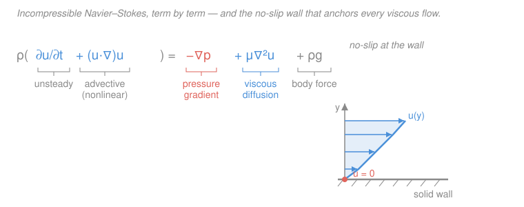

# Fluid Dynamics · Lesson 1.6: The Navier–Stokes equations

> ⏱ ~15 min · Module 1: Kinematics and the governing equations · Builds on: [1.5 The Euler equation](01-05-euler-equation.md), [1.4 Forces in a fluid and the stress tensor](01-04-stress-tensor.md) · Unlocks: [2.1 Bernoulli's theorem](02-01-bernoulli.md), and every viscous flow in Module 3

## Why this matters

Euler's equation ([1.5](01-05-euler-equation.md)) describes a fluid with no internal friction — a fantasy that predicts, absurdly, that a sphere moving through water feels *zero drag* (d'Alembert's paradox, [2.6](02-06-flow-past-cylinder-lift.md)). Real fluids stick to walls, dissipate energy, and organize themselves into thin boundary layers. The one ingredient we're missing is **viscosity** — the fluid's resistance to being sheared. Add it and Euler's equation becomes the **Navier–Stokes equations**, the master equations of fluid motion: they govern blood in an artery, air over a wing, weather, ocean currents, and the plumbing under your sink. They are also famously unsolved — whether smooth 3-D solutions always exist is a Clay Millennium Prize problem worth a million dollars.

## The idea

Picture stirring honey versus stirring water. Both are fluids, but honey *fights back* — a layer of it dragged past its neighbor exerts a tugging force on that neighbor. That tug is **viscous stress**, and it's the mechanism by which one sheet of fluid speeds up or slows down the sheet beside it.

The key physical guess — Newton's — is beautifully simple: **the viscous stress is proportional to how fast the fluid is being sheared, not to how much it's deformed.** A solid spring resists *displacement* (stretch it, it pulls back). A fluid doesn't care how far it's been sheared — you can shear it forever — it resists the *rate* of shearing. Push a spoon through honey slowly and it's easy; push fast and it's hard. Fluids where this proportionality holds exactly are called **Newtonian** (water, air, oil — most everyday fluids; ketchup and blood are not).

So the plan is: (1) write the viscous stress as "constant × shear rate," (2) drop it into the momentum balance from [1.4](01-04-stress-tensor.md), and (3) watch it collapse, for incompressible flow, into one clean term — $\mu\nabla^2\mathbf{u}$ — that behaves *exactly like heat diffusion*, smearing out sharp velocity differences.

## The formal version

**Rate-of-strain tensor.** Split the local velocity variation into how fast the fluid is being *stretched and sheared*. Define

$$e_{ij} = \tfrac12\left(\frac{\partial u_i}{\partial x_j} + \frac{\partial u_j}{\partial x_i}\right),$$

where $u_i$ is the $i$-th velocity component (m/s) and $x_j$ the $j$-th coordinate (m). *In words: $e_{ij}$ is the symmetric part of the velocity gradient — the part that deforms a fluid blob rather than just spinning it rigidly.* Its units are those of $\partial u/\partial x$: $\mathrm{s^{-1}}$ (a strain **rate**).

**Newtonian constitutive law.** For an incompressible Newtonian fluid the **deviatoric** (viscous) stress — the part of the stress tensor beyond the isotropic pressure from [1.4](01-04-stress-tensor.md) — is

$$\tau_{ij} = 2\mu\, e_{ij} = \mu\left(\frac{\partial u_i}{\partial x_j} + \frac{\partial u_j}{\partial x_i}\right).$$

*In words: viscous stress is proportional to the rate of strain, and the constant of proportionality is the viscosity.* Here $\mu$ is the **dynamic viscosity** (units $\mathrm{Pa\cdot s} = \mathrm{kg\,m^{-1}s^{-1}}$; water $\approx 10^{-3}$, honey $\approx 10$). The total Cauchy stress is $\sigma_{ij} = -p\,\delta_{ij} + \tau_{ij}$: an isotropic pressure squeeze plus the shear-rate friction.

**Assembling the momentum equation.** In [1.4](01-04-stress-tensor.md) the surface force per unit volume was the divergence of the stress, $\partial\sigma_{ij}/\partial x_j$. Feeding in $\sigma_{ij} = -p\,\delta_{ij} + 2\mu e_{ij}$ and using incompressibility $\nabla\cdot\mathbf{u}=0$, the viscous divergence collapses:

$$\frac{\partial \tau_{ij}}{\partial x_j} = \mu\left(\frac{\partial^2 u_i}{\partial x_j \partial x_j} + \frac{\partial}{\partial x_i}\underbrace{\frac{\partial u_j}{\partial x_j}}_{=\,\nabla\cdot\mathbf{u}\,=\,0}\right) = \mu\,\nabla^2 u_i.$$

*In words: for incompressible flow the whole viscous machinery reduces to $\mu$ times the Laplacian of velocity.* Putting momentum balance together (Newton's second law per unit volume, with the material derivative $\tfrac{D}{Dt}=\partial_t + \mathbf{u}\cdot\nabla$ from [1.2](01-02-lagrangian-eulerian-material-derivative.md)):

$$\boxed{\;\rho\left(\frac{\partial \mathbf{u}}{\partial t} + (\mathbf{u}\cdot\nabla)\mathbf{u}\right) = -\nabla p + \mu\nabla^2\mathbf{u} + \rho\mathbf{g}, \qquad \nabla\cdot\mathbf{u}=0.\;}$$

These are the **incompressible Navier–Stokes equations**. Divide by the density $\rho$ (kg/m³) to get the **kinematic form**:

$$\frac{\partial \mathbf{u}}{\partial t} + (\mathbf{u}\cdot\nabla)\mathbf{u} = -\frac{1}{\rho}\nabla p + \nu\nabla^2\mathbf{u} + \mathbf{g}, \qquad \nu \equiv \frac{\mu}{\rho}.$$

Here $\nu$ is the **kinematic viscosity** (units $\mathrm{m^2/s}$) — and those units are the giveaway: $\mathrm{m^2/s}$ is a **diffusivity**. $\nu$ is the diffusivity *of momentum*, exactly analogous to thermal diffusivity in the heat equation.

**Read every term** (this is Boss problem 1 — know each meaning *and* its dimensions; each term below has units of acceleration, $\mathrm{m/s^2}$):

| Term | Name | Meaning | 
|---|---|---|
| $\partial_t\mathbf{u}$ | unsteady / local acceleration | how the velocity at a fixed point changes in time |
| $(\mathbf{u}\cdot\nabla)\mathbf{u}$ | advective (convective) | velocity carried and reshaped by the flow itself — **nonlinear**, the source of turbulence |
| $-\tfrac{1}{\rho}\nabla p$ | pressure-gradient force | fluid pushed from high toward low pressure |
| $\nu\nabla^2\mathbf{u}$ | viscous diffusion | friction smoothing out velocity differences, like heat spreading |
| $\mathbf{g}$ | body force | gravity (or any force per unit mass acting throughout the volume) |

**Reducing to Euler.** Drop the viscous term and you're back to [1.5](01-05-euler-equation.md)'s Euler equation, $\tfrac{D\mathbf{u}}{Dt} = -\tfrac1\rho\nabla p + \mathbf{g}$. When is that legitimate? When $\nu\nabla^2\mathbf{u}$ is negligible beside the inertial term $(\mathbf{u}\cdot\nabla)\mathbf{u}$ — formally when the **Reynolds number** $Re = UL/\nu$ (velocity scale $U$, length scale $L$; [3.1](03-01-reynolds-number.md)) is very large, $Re\to\infty$. Viscosity never truly vanishes, though: no matter how large $Re$, it reasserts itself in a thin layer at every wall.

**Boundary conditions.** A PDE needs boundary data. For a viscous fluid the condition at a solid wall is **no-slip**: the fluid immediately touching the wall moves *with* the wall,

$$\mathbf{u}\big|_{\text{wall}} = \mathbf{u}_{\text{wall}} \quad (=\mathbf{0}\text{ for a stationary wall}).$$

*In words: fluid sticks to solids — zero relative velocity at the surface.* This single condition is the physical origin of **boundary layers** ([3.4](03-04-boundary-layers.md)) and of viscous drag. Euler's equation, lacking the $\nabla^2$ term, is one order lower and can only enforce *no-penetration* ($\mathbf{u}\cdot\mathbf{n}=0$) — it cannot make the fluid stick, which is exactly why inviscid theory misses drag.

## Picture

## Worked examples

**Example 1 (viscous diffusion *is* the heat equation).** Take a flow that varies in only one direction — say $\mathbf{u} = (u(y,t),\,0,\,0)$ with no pressure gradient and no gravity along $x$. The advective term $(\mathbf{u}\cdot\nabla)\mathbf{u}$ has $u\,\partial_x u = 0$ (nothing depends on $x$), so Navier–Stokes' $x$-component collapses to

$$\frac{\partial u}{\partial t} = \nu\frac{\partial^2 u}{\partial y^2}.$$

This is *literally* the 1-D diffusion (heat) equation from the [`pdes` syllabus](../../pdes/syllabus.md), with $\nu$ playing the role of thermal diffusivity. So if you suddenly jerk a plate sideways under still fluid (Stokes' first problem), the momentum you inject spreads into the fluid by *diffusion*, reaching depth $\sim\sqrt{\nu t}$ after time $t$ — the same $\sqrt{\text{diffusivity}\times\text{time}}$ law that governs how heat soaks into a wall. Viscosity doesn't push momentum around; it *smears* it.

**Example 2 (simple shear and wall stress).** Consider steady shear between two plates: fluid velocity $\mathbf{u} = (\gamma y,\,0,\,0)$, where $\gamma$ (units $\mathrm{s^{-1}}$) is a constant shear rate. The only nonzero velocity gradient is $\partial u_x/\partial y = \gamma$. The rate-of-strain component is

$$e_{xy} = \tfrac12\left(\frac{\partial u_x}{\partial y} + \frac{\partial u_y}{\partial x}\right) = \tfrac12(\gamma + 0) = \tfrac\gamma2,$$

so the viscous shear stress is $\tau_{xy} = 2\mu e_{xy} = \mu\gamma$. *In words: the tangential friction force per unit area on a plane of fluid equals viscosity times shear rate* — the classic $\tau = \mu\,du/dy$ you may have met in intro physics, now seen as one component of the tensor law. On the bottom wall this $\tau_{xy}=\mu\gamma$ is the drag per unit area the fluid exerts; multiply by wall area to get the force needed to keep the top plate sliding. (This is exactly Couette flow, solved in full in [3.2](03-02-couette-poiseuille.md).)

## Watch out

- **You might think viscous stress depends on how much the fluid has deformed.** It depends on the *rate*, $e_{ij}$, not accumulated strain. That's the whole difference between a fluid and an elastic solid: a solid stores shear (Hooke's law, stress ∝ strain); a fluid can be sheared arbitrarily far and only resists the *speed* of shearing (stress ∝ strain **rate**).
- **You might read $\nu\nabla^2\mathbf{u}$ as "viscosity accelerates the fluid."** It's a *diffusion* term — it moves momentum from fast regions to slow ones and dissipates kinetic energy as heat. It smooths, it never sharpens. A velocity kink cannot survive it.
- **You might drop viscosity everywhere at high $Re$.** Tempting, but wrong at walls: the no-slip condition forces a steep velocity gradient in a thin boundary layer where $\nu\nabla^2\mathbf{u}$ is never negligible — even for air over a wing. High $Re$ makes the layer *thin*, not absent ([3.4](03-04-boundary-layers.md)).
- **The $\mu\nabla^2\mathbf{u}$ shortcut assumes incompressibility.** In general the viscous term is $\mu\nabla^2\mathbf{u} + \tfrac{\mu}{3}\nabla(\nabla\cdot\mathbf{u})$; the second piece dies only because $\nabla\cdot\mathbf{u}=0$.

## One-liner

> Navier–Stokes is Euler plus one honest term — $\nu\nabla^2\mathbf{u}$, the diffusion of momentum by friction — and that term, together with no-slip at walls, is the entire difference between an ideal fluid and a real one.

## Problems

**P1 (🟢)** Confirm by dimensional analysis that every term of the kinematic Navier–Stokes equation $\partial_t\mathbf{u} + (\mathbf{u}\cdot\nabla)\mathbf{u} = -\tfrac1\rho\nabla p + \nu\nabla^2\mathbf{u} + \mathbf{g}$ has units of acceleration $(\mathrm{m/s^2})$. Take $[\mathbf u]=\mathrm{m/s}$, $[p]=\mathrm{Pa}=\mathrm{kg\,m^{-1}s^{-2}}$, $[\rho]=\mathrm{kg/m^3}$, $[\nu]=\mathrm{m^2/s}$. *(Boss-problem 1 flavor.)*

**P2 (🟡)** Starting from the full incompressible Navier–Stokes equations, write down the assumptions that reduce them to the Euler equation of [1.5](01-05-euler-equation.md), and explain why an ideal fluid cannot satisfy the no-slip condition.

**P3 (🔴, optional)** Water ($\mu = 1.0\times10^{-3}\ \mathrm{Pa\cdot s}$) fills the gap between two large parallel plates $2\ \mathrm{mm}$ apart. The top plate slides at $0.30\ \mathrm{m/s}$, the bottom is fixed, and the steady velocity profile is linear, $u(y) = U\,y/h$. Find the shear stress on the walls and the tangential force needed per square metre of plate.

Solutions

**P1** Check each term:
- $\partial_t\mathbf{u}$: $[\mathrm{m/s}]/[\mathrm s] = \mathrm{m/s^2}$ ✓
- $(\mathbf{u}\cdot\nabla)\mathbf{u}$: $[\mathrm{m/s}]\cdot[\mathrm{m^{-1}}]\cdot[\mathrm{m/s}] = \mathrm{m/s^2}$ ✓ (the two velocity factors are why it's nonlinear)
- $\tfrac1\rho\nabla p$: $\dfrac{1}{\mathrm{kg\,m^{-3}}}\cdot\dfrac{\mathrm{kg\,m^{-1}s^{-2}}}{\mathrm m} = \dfrac{\mathrm{kg\,m^{-2}s^{-2}}}{\mathrm{kg\,m^{-3}}} = \mathrm{m\,s^{-2}}$ ✓
- $\nu\nabla^2\mathbf{u}$: $[\mathrm{m^2/s}]\cdot[\mathrm{m^{-2}}]\cdot[\mathrm{m/s}] = \mathrm{m/s^2}$ ✓
- $\mathbf{g}$: $\mathrm{m/s^2}$ ✓

*Check.* All five match, so the equation is dimensionally consistent — a necessary sanity test on any term you add. Note $[\nu]=\mathrm{m^2/s}$ is exactly a diffusivity, confirming $\nu\nabla^2\mathbf u$ is a diffusion term.

**P2** Two assumptions:
1. **Negligible viscosity**: drop the $\nu\nabla^2\mathbf u$ (equivalently $\mu\nabla^2\mathbf u$) term. Formally this is the high-Reynolds-number limit $Re = UL/\nu \to \infty$, where the viscous term is small compared to the inertial term $(\mathbf u\cdot\nabla)\mathbf u$ throughout the bulk of the flow.
2. (Already built in here) **incompressibility**, $\nabla\cdot\mathbf u = 0$, so no bulk-viscosity term appears either.

What remains is $\rho\,\tfrac{D\mathbf u}{Dt} = -\nabla p + \rho\mathbf g$, the Euler equation.

Why no-slip fails: dropping $\nabla^2\mathbf u$ lowers the spatial order of the equation (second derivatives in velocity vanish). A lower-order PDE admits fewer boundary conditions, so Euler can enforce only **no-penetration** ($\mathbf u\cdot\mathbf n = 0$ — fluid doesn't cross the wall) and must let the fluid *slip* tangentially. Physically, friction is precisely the mechanism that would drag the wall-adjacent fluid to rest; remove friction and nothing makes it stick. The thin region where viscosity re-enters to satisfy no-slip is the boundary layer.

*Check.* The reduction removes exactly the term whose coefficient $\nu$ carries the "friction" physics and whose second derivative carries the extra boundary condition — consistent that both drag and no-slip disappear together.

**P3** Linear profile $u(y) = Uy/h$ gives a constant shear rate $du/dy = U/h$. From $\tau = \mu\,du/dy$ (i.e. $\tau_{xy} = 2\mu e_{xy} = \mu\,du/dy$):

$$\tau = \mu\frac{U}{h} = (1.0\times10^{-3}\ \mathrm{Pa\cdot s})\cdot\frac{0.30\ \mathrm{m/s}}{2\times10^{-3}\ \mathrm m} = 1.0\times10^{-3}\cdot 150 = 0.15\ \mathrm{Pa}.$$

The stress is uniform (constant shear rate), so it's the same on both walls. Force per unit area of plate = $\tau = 0.15\ \mathrm{N/m^2}$ (i.e. $0.15\ \mathrm N$ per square metre).

*Check.* Units: $\mathrm{Pa\cdot s}\cdot(\mathrm{m/s})/\mathrm m = \mathrm{Pa}$ ✓. Small number, as expected — water is thin, so keeping a plate sliding over a millimetre film takes very little force (try the same with honey, $\mu\approx10$, and it's $10^4\times$ larger).

## Flashback

**From Lesson 1.5 (The Euler equation):** A steady, inviscid, two-dimensional flow has velocity field $\mathbf{u} = (u,v) = (a x,\,-a y)$ with constant $a>0$ (a stagnation-point flow; note $\nabla\cdot\mathbf u = a - a = 0$, so it's incompressible). Ignoring gravity, use Euler's equation to find the pressure gradient $\nabla p$ as a function of position. (Fresh variant — different field from the lesson.)

Solution

Euler (steady, no gravity): $\rho(\mathbf u\cdot\nabla)\mathbf u = -\nabla p$. Compute the material acceleration component by component.

$x$: $u\,\partial_x u + v\,\partial_y u = (ax)(a) + (-ay)(0) = a^2 x.$

$y$: $u\,\partial_x v + v\,\partial_y v = (ax)(0) + (-ay)(-a) = a^2 y.$

So $(\mathbf u\cdot\nabla)\mathbf u = (a^2 x,\,a^2 y) = a^2\,\mathbf r$, and

$$\nabla p = -\rho\,(a^2 x,\,a^2 y) = -\rho a^2\,\mathbf r.$$

*In words: pressure decreases as you move outward from the stagnation point at the origin* — highest pressure sits where the flow piles up and stalls, exactly the intuition Bernoulli ([2.1](02-01-bernoulli.md)) will formalize next.

*Check.* $\nabla p$ points inward (toward the origin), so integrating gives $p = p_0 - \tfrac12\rho a^2(x^2+y^2)$, a pressure maximum at the stagnation point — physically correct: fast-moving fluid far out is at lower pressure. Units: $[\rho a^2 x] = \mathrm{kg\,m^{-3}}\cdot\mathrm{s^{-2}}\cdot\mathrm m = \mathrm{kg\,m^{-2}s^{-2}} = \mathrm{Pa/m}$, a pressure gradient ✓.

## Connections

- **Backward:** this is [1.5](01-05-euler-equation.md)'s Euler equation with one term restored — the viscous stress whose tensor form ($\sigma_{ij} = -p\,\delta_{ij} + 2\mu e_{ij}$) and divergence came straight from [1.4](01-04-stress-tensor.md). The material derivative on the left is [1.2](01-02-lagrangian-eulerian-material-derivative.md), and $\nabla\cdot\mathbf u = 0$ is [1.3](01-03-continuity-equation.md).
- **Forward:** [2.1 Bernoulli](02-01-bernoulli.md) integrates the *inviscid* version along a streamline; Module 3 lives entirely inside the viscous term — [3.1](03-01-reynolds-number.md) nondimensionalizes N–S to extract $Re$, [3.2](03-02-couette-poiseuille.md) solves it exactly, and [3.4](03-04-boundary-layers.md) is the no-slip boundary layer this lesson previews.
- **Sideways (PDEs):** $\nu\nabla^2\mathbf u$ is the **diffusion/heat equation** operator — momentum diffuses with diffusivity $\nu$ just as heat diffuses with thermal diffusivity (see the [`pdes` syllabus](../../pdes/syllabus.md)). The $\sqrt{\nu t}$ spreading law, the smoothing of sharp gradients, and the parabolic character of the equation are all shared. The nonlinear advective term $(\mathbf u\cdot\nabla)\mathbf u$ is what makes N–S vastly harder than the linear heat equation — and is why 3-D existence-and-smoothness is still an open Clay problem.
