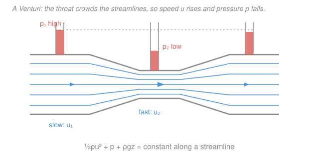

# Fluid Dynamics · Lesson 2.1: Bernoulli's theorem

> ⏱ ~15 min · Module 2: Ideal (inviscid) flow · Builds on: [1.6 The Navier–Stokes equations](01-06-navier-stokes.md), [1.5 The Euler equation](01-05-euler-equation.md) · Unlocks: [2.2 Vorticity and circulation](02-02-vorticity-circulation.md)

## Why this matters

Bernoulli's theorem is the single most quoted result in fluid dynamics — the reason planes fly, carburetors mix, and a shower curtain sucks inward. It says something almost paradoxical: **where an ideal fluid speeds up, its pressure drops.** It is also the most *misapplied* result in fluid dynamics, because it holds only under four specific hypotheses. This lesson gives you both the theorem and its fine print, so you can wield it correctly — and spot the countless places it's abused. It's also our first real payoff from Module 1: we get it by integrating the Euler equation, doing nothing but calculus.

## The idea

Take the Euler equation — Newton's second law for an inviscid fluid — and ask what it says *along a single streamline*, the path a fluid particle actually rides. A particle speeding into a constriction is being accelerated; something must be pushing it. In an ideal fluid the only push is a **pressure difference**: high pressure behind, low pressure ahead. So the fluid can only accelerate by running from high pressure toward low. Run the logic backward and you get the headline: fast flow sits in low-pressure regions, slow flow in high-pressure regions.

The bookkeeping that makes this exact is an **energy balance per unit volume**. Three quantities trade off along a streamline: kinetic energy $\tfrac12\rho u^2$, the pressure $p$, and gravitational potential $\rho g z$. Their sum is *conserved*. Push one up (say, speed) and another must come down (pressure) to compensate. That conserved sum is Bernoulli's constant.

## The formal version

Start from the **steady, inviscid, incompressible** momentum equation — the Euler equation of [1.5](01-05-euler-equation.md) with $\partial_t\mathbf{u}=0$, where $\mathbf{u}$ is the velocity field (m/s), $p$ the pressure (Pa), $\rho$ the constant density (kg/m³), and gravity written as a potential $\mathbf{g}=-\nabla(gz)$ with $z$ measured upward:

$$\rho\,(\mathbf{u}\cdot\nabla)\mathbf{u} = -\nabla p - \rho\nabla(gz).$$

Now use the vector identity (valid for any vector field)

$$(\mathbf{u}\cdot\nabla)\mathbf{u} = \nabla\!\left(\tfrac12 u^2\right) - \mathbf{u}\times\boldsymbol\omega, \qquad \boldsymbol\omega \equiv \nabla\times\mathbf{u},$$

where $u=|\mathbf{u}|$ and $\boldsymbol\omega$ is the **vorticity** (the local spin, our subject in [2.2](02-02-vorticity-circulation.md)). Substitute, divide by the constant $\rho$, and collect every gradient on one side:

$$\nabla\!\left(\tfrac12 u^2 + \frac{p}{\rho} + gz\right) = \mathbf{u}\times\boldsymbol\omega.$$

Here is the trick. Dot both sides with the unit tangent $\hat{\mathbf t}=\mathbf{u}/u$ **along a streamline**. The left side becomes the rate of change of the bracket *as you move along the streamline*. The right side vanishes, because $\mathbf{u}\cdot(\mathbf{u}\times\boldsymbol\omega)=0$ — a cross product is perpendicular to its own factors. So the bracket doesn't change along the streamline. Multiplying back through by $\rho$:

$$\boxed{\;\tfrac12\rho u^2 + p + \rho g z = \text{constant along a streamline}\;}$$

*In words: the sum of dynamic pressure, static pressure, and gravitational pressure-head is the same at every point of one streamline.* This is **Bernoulli's theorem**. The grouping $p_0 \equiv p + \tfrac12\rho u^2$ (at fixed height) is the **stagnation** or **total pressure** — what a gauge reads if it brings the flow to rest — with $\tfrac12\rho u^2$ the **dynamic pressure** and $p$ the **static pressure**.

**The four hypotheses** (drop any one and the boxed equation can fail):

1. **Steady** — $\partial_t\mathbf{u}=0$. We threw away the unsteady term. A flapping or accelerating flow adds a $\rho\,\partial_t\mathbf{u}$ contribution.
2. **Inviscid** — no viscosity. Friction ([1.6](01-06-navier-stokes.md)'s $\mu\nabla^2\mathbf{u}$ term) drains the Bernoulli sum along the path; downstream of losses the "constant" is smaller.
3. **Incompressible** (or barotropic) — constant $\rho$, so $\nabla(p/\rho)=\nabla p/\rho$. For a barotropic gas, $p/\rho$ is replaced by $\int \mathrm{d}p/\rho$.
4. **Along a streamline** — the constant may differ from one streamline to the next. It becomes a *single global* constant only if the flow is also **irrotational** ($\boldsymbol\omega=\mathbf{0}$), since then the right-hand side vanishes *everywhere*, not just along $\mathbf{u}$. That global case is the engine of potential flow ([2.4](02-04-irrotational-flow-velocity-potential.md)).

## Picture

## Worked examples

**Example 1 (Venturi — pressure drops in the throat).** Water ($\rho=1000\ \mathrm{kg/m^3}$) flows horizontally through a pipe that necks from area $A_1$ to a throat $A_2=A_1/2$. Continuity (mass conservation, [1.3](01-03-continuity-equation.md)) fixes the speeds: the volume flux $Q=uA$ is constant, so

$$u_1 A_1 = u_2 A_2 \;\Longrightarrow\; u_2 = u_1\frac{A_1}{A_2}=2u_1.$$

The throat runs *twice as fast*. Now apply Bernoulli along the central streamline; the pipe is horizontal so $\rho g z$ cancels:

$$p_1 + \tfrac12\rho u_1^2 = p_2 + \tfrac12\rho u_2^2 \;\Longrightarrow\; \Delta p = p_1-p_2 = \tfrac12\rho\left(u_2^2-u_1^2\right)=\tfrac12\rho u_1^2\!\left[\left(\tfrac{A_1}{A_2}\right)^2-1\right].$$

With $u_1=3\ \mathrm{m/s}$: $\Delta p = \tfrac12(1000)(9)(4-1)=13{,}500\ \mathrm{Pa}\approx 13.5\ \mathrm{kPa}$. The faster throat sits at *lower* pressure — exactly the manometer drop in the figure. Reading $\Delta p$ off the gauges and inverting this formula is how a Venturi meter measures flow rate.

**Example 2 (Pitot tube — measuring airspeed).** An aircraft's Pitot tube has two ports: one facing the oncoming air, where the flow is brought to rest (a **stagnation point**, $u=0$), and one flush with the skin sampling the free-stream **static** pressure $p$ while the air still moves at the plane's speed $U$. Bernoulli along the streamline that ends at the stagnation port (horizontal, so gravity drops out):

$$p + \tfrac12\rho U^2 = p_0 + 0 \;\Longrightarrow\; U = \sqrt{\frac{2(p_0-p)}{\rho}}.$$

*In words: the airspeed is read straight off the gap between total and static pressure.* With sea-level air $\rho\approx1.2\ \mathrm{kg/m^3}$ and a measured $p_0-p=2400\ \mathrm{Pa}$: $U=\sqrt{2(2400)/1.2}=\sqrt{4000}\approx63\ \mathrm{m/s}$ (about 228 km/h). Every airspeed indicator is this equation in a box.

The same "fast means low-pressure" intuition explains an **atomizer** (fast air over a tube's mouth lowers the pressure there and lifts liquid up) and the curve of a spinning ball. It is *tempting* to explain a wing's lift this way too — but honest lift needs the flow to circulate around the airfoil, which Bernoulli alone can't supply. We build that missing ingredient, circulation, in [2.2](02-02-vorticity-circulation.md) and cash it out as lift in [2.6](02-06-flow-past-cylinder-lift.md).

## Watch out

- **You might apply Bernoulli between two points on *different* streamlines.** The constant is only guaranteed equal *along* one streamline. Comparing the pressure just above a wing to the pressure far below it — different streamlines — is valid only if the flow is irrotational (then the constant is global). State that assumption or you may get nonsense.
- **You might use it across a fan, pump, or region of separation.** Those add energy or dissipate it — the inviscid/steady hypotheses fail, so the Bernoulli sum jumps. It is not conserved through a machine or a turbulent wake.
- **You might think low pressure "causes" high speed, or vice versa.** Neither causes the other; they are two faces of one conserved sum. The pipe geometry (via continuity) sets the speed, and Bernoulli then *reports* the pressure.

## One-liner

> Integrate steady inviscid Euler along a streamline and $\tfrac12\rho u^2 + p + \rho g z$ is frozen — so an ideal fluid buys speed by spending pressure, provided the flow is steady, frictionless, incompressible, and you stay on one streamline.

## Problems

**P1 (🟢)** A Pitot–static tube on a glider measures a stagnation-minus-static pressure of $p_0 - p = 1{,}500\ \mathrm{Pa}$ in air of density $\rho = 1.2\ \mathrm{kg/m^3}$. Find the airspeed $U$.

**P2 (🟡)** Water ($\rho = 1000\ \mathrm{kg/m^3}$) flows through a horizontal Venturi. In the wide section ($A_1$) the speed is $u_1 = 2\ \mathrm{m/s}$; the throat has area $A_2 = A_1/3$. Find the throat speed $u_2$ and the pressure drop $p_1 - p_2$. Then convert that drop to a height difference in a water manometer ($g=9.8\ \mathrm{m/s^2}$).

**P3 (🔴, optional)** A large open tank of water has a small hole punched in its side a depth $h$ below the free surface. Using Bernoulli, derive **Torricelli's law** for the exit speed, and evaluate it for $h = 1.25\ \mathrm{m}$. Identify which hypothesis lets you set the surface speed to zero.

Solutions

**P1** Directly from the Pitot relation $U=\sqrt{2(p_0-p)/\rho}$:

$$U = \sqrt{\frac{2(1500)}{1.2}} = \sqrt{2500} = 50\ \mathrm{m/s}.$$

*Check.* Units: $\sqrt{\mathrm{Pa}/(\mathrm{kg/m^3})}=\sqrt{(\mathrm{kg\,m^{-1}s^{-2}})/(\mathrm{kg\,m^{-3}})}=\sqrt{\mathrm{m^2/s^2}}=\mathrm{m/s}$ ✓. And $50\ \mathrm{m/s}\approx180$ km/h, a sensible glider speed.

**P2** Continuity gives the speed-up, Bernoulli gives the pressure:

$$u_2 = u_1\frac{A_1}{A_2}=3u_1 = 6\ \mathrm{m/s}, \qquad p_1-p_2 = \tfrac12\rho\left(u_2^2-u_1^2\right)=\tfrac12(1000)(36-4)=16{,}000\ \mathrm{Pa}.$$

As a manometer height, $h=\dfrac{\Delta p}{\rho g}=\dfrac{16{,}000}{(1000)(9.8)}\approx1.63\ \mathrm{m}$.

*Check.* Dynamic-pressure units $\tfrac12\rho u^2 = (\mathrm{kg/m^3})(\mathrm{m^2/s^2})=\mathrm{kg\,m^{-1}s^{-2}}=\mathrm{Pa}$ ✓. The throat is faster and lower-pressure, as Bernoulli demands, and a 1.6 m column is a realistic gauge reading.

**P3** Take a streamline from the free surface (point 1) to the hole (point 2). Both are open to the atmosphere, so $p_1=p_2=p_{\text{atm}}$ and the pressure terms cancel. The height drop is $z_1-z_2=h$. Bernoulli:

$$\cancel{p_{\text{atm}}} + \tfrac12\rho u_1^2 + \rho g z_1 = \cancel{p_{\text{atm}}} + \tfrac12\rho u_2^2 + \rho g z_2.$$

Because the tank is **large**, the surface barely moves — set $u_1\approx0$ (this uses the *steady, quasi-static* hypothesis: the surface descends negligibly fast compared with the jet). Then

$$\rho g h = \tfrac12\rho u_2^2 \;\Longrightarrow\; u_2 = \sqrt{2gh}.$$

For $h=1.25\ \mathrm{m}$: $u_2=\sqrt{2(9.8)(1.25)}=\sqrt{24.5}\approx4.95\ \mathrm{m/s}$.

*Check.* $u=\sqrt{2gh}$ is exactly the speed a body reaches falling freely through height $h$ — the fluid "falls" out of the hole. Units $\sqrt{(\mathrm{m/s^2})\,\mathrm{m}}=\mathrm{m/s}$ ✓. Assuming $u_1=0$ relies on $A_{\text{hole}}\ll A_{\text{surface}}$; for a wide hole you'd keep the $u_1$ term via continuity.

## Flashback

**From Lesson 1.2 (Lagrangian vs. Eulerian description):** Water flows steadily along a narrowing channel with velocity field $\mathbf{u}=\big(u(x),0,0\big)$ where $u(x)=U_0\!\left(1+\dfrac{x}{L}\right)$, with $U_0$ and $L$ constants. Compute the acceleration a fluid particle actually experiences at position $x$, and evaluate it at $x=0$. Is the particle accelerating even though the flow is steady?

Solution

Particle acceleration is the material derivative $\dfrac{D\mathbf{u}}{Dt}=\partial_t\mathbf{u}+(\mathbf{u}\cdot\nabla)\mathbf{u}$. The flow is steady, so $\partial_t\mathbf{u}=0$; only the $x$-component survives:

$$a = u\,\frac{\mathrm{d}u}{\mathrm{d}x} = U_0\!\left(1+\frac{x}{L}\right)\cdot\frac{U_0}{L} = \frac{U_0^2}{L}\left(1+\frac{x}{L}\right).$$

At $x=0$: $a=U_0^2/L$. **Yes** — the particle accelerates despite the steady field, because it *moves into* a faster region (the convective term). 

*Check.* Units $\dfrac{(\mathrm{m/s})^2}{\mathrm{m}}=\mathrm{m/s^2}$ ✓. Note this is the very term, $u\,\mathrm{d}u/\mathrm{d}x=\mathrm{d}(\tfrac12u^2)/\mathrm{d}x$, that we integrated into the $\tfrac12\rho u^2$ of Bernoulli — a steady flow can accelerate a particle, and pressure is what pays for it.

## Connections

- **Backward:** Bernoulli is the steady Euler equation of [1.5](01-05-euler-equation.md) integrated once along a streamline; the viscous caveat is [1.6](01-06-navier-stokes.md)'s friction term, and the Venturi speed-up rides on the continuity equation of [1.3](01-03-continuity-equation.md). The convective-acceleration identity $(\mathbf{u}\cdot\nabla)\mathbf{u}=\nabla(\tfrac12u^2)-\mathbf{u}\times\boldsymbol\omega$ is pure [`calc-refresher`](../../calc-refresher/syllabus.md) vector calculus.
- **Forward:** the leftover term $\mathbf{u}\times\boldsymbol\omega$ makes vorticity $\boldsymbol\omega$ ([2.2](02-02-vorticity-circulation.md)) the hinge — kill it and Bernoulli's constant goes *global*, which is what lets us build irrotational potential flows in [2.4](02-04-irrotational-flow-velocity-potential.md) and finally explain lift honestly in [2.6](02-06-flow-past-cylinder-lift.md).
- **Sideways:** the "energy per unit volume is conserved along a path" logic is the fluid cousin of energy conservation in a potential from [`mechanics-refresher` 2.2](../../mechanics-refresher/lessons/02-02-potential-energy-conservation.md) — Torricelli's $\sqrt{2gh}$ is literally the free-fall speed of that lesson, and $p/\rho + gz$ plays the role of a potential the fluid falls through.
