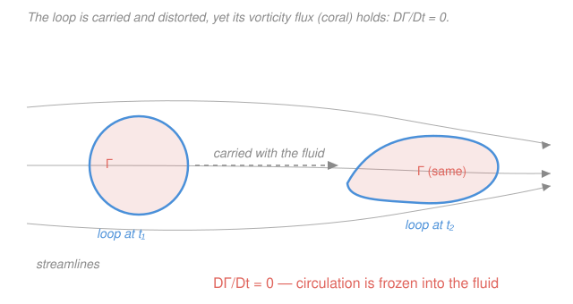

# Fluid Dynamics · Lesson 2.3: Kelvin's circulation theorem

> ⏱ ~15 min · Module 2: Ideal (inviscid) flow · Builds on: [2.2 Vorticity and circulation](02-02-vorticity-circulation.md), [2.1 Bernoulli's theorem](02-01-bernoulli.md) · Unlocks: [2.4 Irrotational flow and the velocity potential](02-04-irrotational-flow-velocity-potential.md)

## Why this matters

In [2.2](02-02-vorticity-circulation.md) you learned to *measure* spin — vorticity $\boldsymbol\omega$ locally, circulation $\Gamma$ around a loop. Now comes the payoff: a conservation law that tells you spin can't appear or vanish on its own. Kelvin's theorem is the reason the entire potential-flow toolkit of the next three lessons is legitimate — start a flow from rest and it stays irrotational forever, so you may model it with a single scalar and Laplace's equation. It is also the reason wings work: the circulation that lifts an airplane can only exist because an equal and opposite vortex was shed off the trailing edge when it started to move. One theorem underwrites both the idealization and the machine that breaks it.

## The idea

Picture a loop drawn *in the fluid itself* — not fixed in space, but painted on the parcels, so it drifts, stretches, and twists as those parcels move. Such a loop is called a **material loop**. Kelvin's claim: for an ideal fluid, the circulation around that painted loop never changes, no matter how violently the flow deforms it.

Why should that be? Circulation only changes if something can push fluid *around* the loop — a net tangential shove summed all the way around. Pressure can push, but pressure pushes *perpendicular* to nothing in particular; when you add up its effect around a closed loop it cancels, because pressure is a potential-like force (it's a pure gradient). Gravity is also a gradient (of $gz$), so it cancels too. With no friction to drag fluid tangentially, there is simply nothing left that can spin the loop up or down. The circulation is **frozen in**.

The vivid mental image: vorticity behaves like thread frozen into the fluid. Stretch the fluid and the thread stretches with it (concentrating the spin — that's how a tightening vortex spins faster), bend the fluid and the thread bends, but you can never cut the thread or splice in a new one. Ideal flow has no scissors.

## The formal version

Take a **material loop** $C(t)$ — a closed curve moving with the fluid, every point of it a fluid particle. Its circulation is

$$\Gamma(t) = \oint_{C(t)} \mathbf{u}\cdot \mathrm{d}\mathbf{l},$$

where $\mathbf{u}$ is the velocity field (m/s) and $\mathrm{d}\mathbf{l}$ is the directed line element (m) along the loop.

**Kelvin's circulation theorem.** For an ideal fluid — **inviscid** (no viscosity), **barotropic** (pressure depends on density alone, $p=p(\rho)$, so also any incompressible constant-density flow), acted on by **conservative body forces** (like gravity, a gradient $\mathbf{g}=-\nabla\Phi$) — the circulation around any material loop is constant in time:

$$\boxed{\ \frac{D\Gamma}{Dt} = \frac{D}{Dt}\oint_{C(t)} \mathbf{u}\cdot \mathrm{d}\mathbf{l} = 0.\ }$$

*In words: paint a loop on the moving fluid; the circulation threaded through it never changes.*

**Sketch of the proof.** Differentiating following the loop, two things move — the velocity $\mathbf{u}$ at each point, and the line element $\mathrm{d}\mathbf{l}$ itself (the loop deforms):

$$\frac{D}{Dt}\oint_C \mathbf{u}\cdot \mathrm{d}\mathbf{l}
= \oint_C \frac{D\mathbf{u}}{Dt}\cdot \mathrm{d}\mathbf{l}
\;+\; \oint_C \mathbf{u}\cdot \frac{D(\mathrm{d}\mathbf{l})}{Dt}.$$

Handle the two terms:

- **First term.** The Euler equation ([1.5](01-05-euler-equation.md)) gives the acceleration as a pure gradient: $\dfrac{D\mathbf{u}}{Dt} = -\nabla\!\left(\displaystyle\int\frac{\mathrm{d}p}{\rho} + \Phi\right)$ (for incompressible flow the bracket is just $p/\rho + gz$). The integral of any gradient around a *closed* loop is zero — you return to where you started, so the potential's net change is nil: $\oint_C \nabla f\cdot\mathrm{d}\mathbf{l}=0$. First term vanishes.
- **Second term.** Because the loop moves with the fluid, the rate of stretch of a line element equals the velocity difference across it: $\dfrac{D(\mathrm{d}\mathbf{l})}{Dt} = \mathrm{d}\mathbf{u}$. So $\mathbf{u}\cdot \dfrac{D(\mathrm{d}\mathbf{l})}{Dt} = \mathbf{u}\cdot\mathrm{d}\mathbf{u} = \mathrm{d}\!\left(\tfrac12 u^2\right)$, and $\oint_C \mathrm{d}\!\left(\tfrac12 u^2\right)=0$ — again a perfect differential around a closed loop. Second term vanishes.

Both terms are zero, so $D\Gamma/Dt = 0$. The whole theorem rides on one fact: **the only forces are gradients, and gradients do no net work around a closed loop.**

**Helmholtz's vortex theorems** are the corollaries, obtained by applying Kelvin to tiny loops (using $\Gamma=\int_S\boldsymbol\omega\cdot\mathrm{d}\mathbf{S}$ from Stokes, [2.2](02-02-vorticity-circulation.md)):

1. **Vortex lines are material** — they move *with* the fluid, "frozen in." A parcel on a vortex line stays on that vortex line.
2. **Vortex-tube strength is constant** — the circulation $\Gamma$ around a vortex tube is the same all along its length *and* constant in time. *In words: a vortex tube can't fade out or fatten its total spin.*
3. **Vortex lines can't end in the fluid** — they close into loops (smoke rings) or terminate on a boundary (a bathtub vortex on the drain, a tornado between cloud and ground).

**Irrotational persistence** is the headline consequence. If $\boldsymbol\omega=0$ everywhere at some instant, then $\Gamma=0$ around *every* material loop; Kelvin freezes each at zero, so $\boldsymbol\omega=0$ forever.

*In words: an ideal flow started from rest — or from a uniform stream, where $\boldsymbol\omega=0$ — stays irrotational for all time.* This is exactly the license we need for [2.4](02-04-irrotational-flow-velocity-potential.md)–[2.6](02-06-flow-past-cylinder-lift.md): potential flow isn't a special case you hope for, it's *guaranteed* by Kelvin for any ideal flow with an irrotational past.

**What breaks it.** Kelvin needs all three hypotheses; drop one and circulation can change:

- **Viscosity** (the big one). Friction exerts tangential forces, so $D\mathbf{u}/Dt$ is no longer a pure gradient — it gains a $\nu\nabla^2\mathbf{u}$ term that lets vorticity **diffuse across** material loops. This is how a wing generates lift: in the thin viscous boundary layer at the trailing edge, vorticity is manufactured and shed downstream as a **starting vortex** of circulation $-\Gamma$, leaving a **bound circulation** $+\Gamma$ around the wing. Kelvin still holds for a huge material loop enclosing *both* — total circulation stays zero — but the flow near the wing now has the $+\Gamma$ it needs to lift ($L=\rho U\Gamma$, [2.6](02-06-flow-past-cylinder-lift.md)).
- **Baroclinicity.** If pressure and density surfaces are misaligned, $\nabla\rho\times\nabla p\neq 0$, the pressure term stops being a pure gradient, and torque is generated (sea breezes, atmospheric fronts). Barotropic flow is exactly the case where this vanishes.
- **Non-conservative body forces.** A force that isn't a gradient (e.g. the Coriolis or a magnetic $\mathbf{J}\times\mathbf{B}$ force) can pump circulation directly.

## Picture

## Worked examples

**Example 1 (irrotational from rest — the license for potential flow).** An airplane sits still on the runway; the surrounding air is at rest, so $\mathbf{u}=0$ and hence $\boldsymbol\omega=\nabla\times\mathbf{u}=0$ everywhere. Treating the air far from surfaces as ideal, what can we say about the vorticity once the plane is cruising?

Around *any* material loop in the free stream, $\Gamma=\int_S\boldsymbol\omega\cdot\mathrm{d}\mathbf{S}=0$ initially. Kelvin freezes every material loop's circulation at its initial value — zero — so $\Gamma=0$ around every such loop for all later times. A field whose circulation vanishes on every loop has $\boldsymbol\omega=0$ (shrink the loop: the flux through every infinitesimal patch is zero). **The bulk flow is irrotational.** That is precisely why [2.4](02-04-irrotational-flow-velocity-potential.md) may write $\mathbf{u}=\nabla\phi$ and reduce everything to $\nabla^2\phi=0$. The catch: this argument covers only material loops that *never entered the boundary layer*. A loop that has wrapped the wing may thread the shed vorticity, and there $\Gamma\neq0$ — which is the whole story of lift.

**Example 2 (vortex stretching — spin-up).** Consider a thin vortex tube of length $\ell$ and cross-sectional area $A$, vorticity $\omega$ roughly uniform across it. Incompressibility conserves its volume $A\ell$, and Helmholtz conserves its circulation $\Gamma\approx\omega A$. If the flow **stretches** the tube to twice its length, what happens to $\omega$?

Volume fixed: $A\ell=\text{const}$, so doubling $\ell$ halves $A$. Circulation fixed: $\omega A=\text{const}$, so halving $A$ **doubles** $\omega$:

$$\omega \propto \frac{1}{A} \propto \ell.$$

*Stretch a vortex tube and it spins faster*, in exact proportion to its length — the ice-skater pulling in her arms, written for fluids. This is the engine of atmospheric spin-up: updrafts stretch vertical vortex tubes and intensify tornadoes; it's why bathtub and drain vortices tighten and accelerate as fluid is drawn into the narrowing column. Angular-momentum conservation and Kelvin's theorem are telling the same story.

## Watch out

- **You might think Kelvin says circulation is constant around a *fixed* loop in space.** It doesn't — it's constant around a **material** loop that *moves with the fluid*. Around a loop nailed to fixed coordinates, $\Gamma$ can change as vortical fluid drifts through it. The "$D/Dt$", not "$\partial/\partial t$", is the whole point.
- **You might think "circulation conserved" means "no lift is possible."** The opposite — lift *needs* circulation. Kelvin conserves the *total* over a loop enclosing the wing and its wake: bound $+\Gamma$ and starting vortex $-\Gamma$ sum to zero, so the wing gets its lifting circulation without violating Kelvin. Nothing is created from nothing; it's separated, $+$ from $-$.
- **You might forget the barotropic clause.** In the ocean and atmosphere, density depends on temperature and salinity, not pressure alone — flow is baroclinic, $\nabla\rho\times\nabla p\neq0$, and circulation is generated. Kelvin is a theorem about the *idealized* fluid; knowing its three hypotheses is knowing exactly when real flows will disobey it.

## One-liner

> In ideal flow (inviscid, barotropic, conservative forces) every force is a gradient and does no net work around a loop, so circulation is frozen into material loops — vortex lines ride with the fluid, and a flow born irrotational stays irrotational.

## Problems

**P1 (🟢)** A large body of ideal fluid is initially at rest, then set into smooth motion by moving boundaries far away. Using Kelvin's theorem, argue that the flow throughout the bulk is irrotational for all subsequent time. Which single hypothesis, if dropped, would let vorticity appear in the interior?

**P2 (🟡)** A vortex tube in an incompressible ideal fluid has circulation $\Gamma_0$, length $\ell_0$, cross-sectional area $A_0$, and vorticity $\omega_0=\Gamma_0/A_0$. The flow stretches it to length $3\ell_0$. Find the new area, vorticity, and circulation. By what factor does the vorticity change?

**P3 (🔴, optional)** For each scenario, name which Kelvin hypothesis fails (viscosity / baroclinicity / non-conservative force), and hence whether circulation around a material loop is conserved: (a) a real airfoil generating lift as it accelerates from rest; (b) a warm-over-cold sea-breeze front where surfaces of constant pressure and constant density cross; (c) inviscid, constant-density flow of water past a smooth submerged rock, gravity the only body force.

Solutions

**P1** Initially the fluid is at rest, so $\mathbf{u}=0$ and $\boldsymbol\omega=\nabla\times\mathbf{u}=0$ everywhere; hence the circulation $\Gamma=\oint\mathbf{u}\cdot\mathrm{d}\mathbf{l}=0$ around *every* material loop. Kelvin's theorem freezes each material loop's circulation at its initial value, so $\Gamma=0$ around every material loop for all later times. Since $\Gamma=\int_S\boldsymbol\omega\cdot\mathrm{d}\mathbf{S}$ (Stokes) vanishes through every surface, shrinking the loop shows the flux through every infinitesimal patch is zero, i.e. $\boldsymbol\omega=0$ throughout the interior — the flow is irrotational for all time.

Dropping **inviscidness** (i.e. allowing viscosity) breaks the argument: viscous tangential stresses make $D\mathbf{u}/Dt$ more than a gradient, adding a diffusion term $\nu\nabla^2\mathbf{u}$ that lets vorticity spread from boundaries into the interior. (Baroclinicity would also do it, but a from-rest incompressible flow is barotropic, so viscosity is the operative one here.)

*Check.* Limiting sense: this is exactly the potential-flow license used in [2.4](02-04-irrotational-flow-velocity-potential.md); if viscosity mattered everywhere, no aircraft could be modeled by potential flow even approximately — yet outside thin boundary layers it works, precisely because Kelvin nearly holds there. ✓

**P2** Incompressibility conserves tube volume: $A\ell=\text{const}$, so
$$A_0\ell_0 = A\,(3\ell_0)\;\Longrightarrow\; A=\tfrac13 A_0.$$
Helmholtz/Kelvin conserves circulation: $\Gamma=\Gamma_0$ (unchanged). Vorticity is circulation per area:
$$\omega=\frac{\Gamma}{A}=\frac{\Gamma_0}{\tfrac13 A_0}=3\,\frac{\Gamma_0}{A_0}=3\,\omega_0.$$
So the vorticity increases by a factor **3**, tracking the stretch factor, while $\Gamma$ is unchanged.

*Check.* Dimensions: $[\omega]=[\Gamma]/[A]=(\mathrm{m^2/s})/\mathrm{m^2}=\mathrm{s^{-1}}$ ✓, a rate as vorticity must be. Consistency: $\omega A=(3\omega_0)(\tfrac13A_0)=\omega_0A_0=\Gamma_0$ ✓ — circulation really is preserved. Physical sense: stretching thins and speeds up the vortex (skater effect). ✓

**P3**
(a) **Viscosity.** Lift generation relies on the boundary layer at the trailing edge shedding a starting vortex; that vorticity is created by viscous stresses. Around a *small* material loop hugging the wing, circulation is **not** conserved (it grows to the bound value $+\Gamma$). Around a *large* loop enclosing wing + starting vortex, the total stays zero — Kelvin holds for the combined system, which is *why* the bound and starting vortices are equal and opposite.

(b) **Baroclinicity.** Constant-pressure and constant-density surfaces cross, so $\nabla\rho\times\nabla p\neq0$; the pressure term is no longer a pure gradient and generates circulation (this is what drives the sea-breeze circulation). **Not conserved.**

(c) **None fails** — the flow is inviscid, constant-density (hence barotropic), with gravity (a gradient) the only body force. All three hypotheses hold, so circulation around a material loop **is conserved**, and a from-rest flow past the rock stays irrotational.

*Check.* The pattern: (a) and (b) are the two everyday circulation *sources* (walls/wakes and buoyancy), (c) is the clean textbook case where Kelvin bites. Each answer names exactly one failed hypothesis, matching the three-clause structure of the theorem. ✓

## Flashback

**From Lesson 2.2 (Vorticity and circulation):** A two-dimensional flow rotates as a rigid body inside a disk of radius $R$: $\mathbf{u}=\Omega\,(-y,\,x)$ for $r\le R$, with constant angular rate $\Omega$ (rad/s). Compute the vorticity $\boldsymbol\omega$, and find the circulation $\Gamma$ around the circle $r=R$ two ways — directly as $\oint\mathbf{u}\cdot\mathrm{d}\mathbf{l}$, and via Stokes' theorem $\int\boldsymbol\omega\cdot\mathrm{d}\mathbf{S}$.

Solution

**Vorticity.** With $u_x=-\Omega y$, $u_y=\Omega x$ and $u_z=0$, only the $z$-component of the curl survives:
$$\omega_z=\partial_x u_y-\partial_y u_x=\Omega-(-\Omega)=2\Omega,\qquad \boldsymbol\omega=2\Omega\,\hat{\mathbf z}.$$
*In words: a rigidly rotating fluid has uniform vorticity equal to twice its angular velocity* — the standard rigid-rotation result.

**Circulation, direct.** On $r=R$ the speed is $u=\Omega R$, everywhere tangent to the circle, so
$$\Gamma=\oint \mathbf{u}\cdot\mathrm{d}\mathbf{l}=(\Omega R)(2\pi R)=2\pi\Omega R^2.$$

**Circulation, via Stokes.** The vorticity flux through the disk of area $\pi R^2$:
$$\Gamma=\int_S \boldsymbol\omega\cdot\mathrm{d}\mathbf{S}=(2\Omega)(\pi R^2)=2\pi\Omega R^2.$$

The two agree.

*Check.* Dimensions: $[\Gamma]=\mathrm{s^{-1}\cdot m^2}=\mathrm{m^2/s}$ ✓ (velocity × length). The match of the two routes is Stokes' theorem doing its job — and it foreshadows this lesson: it's the same $\Gamma=\int\boldsymbol\omega\cdot\mathrm{d}\mathbf{S}$ identity that turns Kelvin's theorem into Helmholtz's frozen-in vortex lines. ✓

## Connections

- **Backward:** this is the conservation law behind [2.2](02-02-vorticity-circulation.md)'s $\Gamma$ and $\boldsymbol\omega$, and it leans on the [Euler equation](01-05-euler-equation.md) (acceleration as a pressure gradient) and on Stokes' theorem from [`calc-refresher`](../../calc-refresher/syllabus.md). The proof's core move — a gradient does no work around a closed loop — is the same fact that makes conservative forces path-independent in [`mechanics-refresher`](../../mechanics-refresher/syllabus.md).
- **Forward:** irrotational persistence is the *license* for [2.4 Irrotational flow and the velocity potential](02-04-irrotational-flow-velocity-potential.md) and everything built on it — the complex potential ([2.5](02-05-complex-potential.md)) and lift on a cylinder ([2.6](02-06-flow-past-cylinder-lift.md)), where the bound/starting-vortex bookkeeping introduced here becomes the Kutta–Joukowski lift $L=\rho U\Gamma$.
- **Sideways:** the frozen-in vortex-line picture reappears (with magnetic field lines in place of vorticity) as *flux freezing* in the magnetohydrodynamics behind [`astrophysics`](../../astrophysics/syllabus.md) — stellar winds and accretion carry their fields the way an ideal fluid carries its vortex lines.
