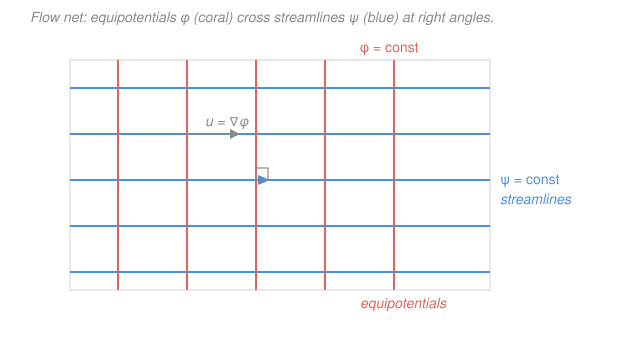

# Fluid Dynamics · Lesson 2.4: Irrotational flow and the velocity potential

> ⏱ ~15 min · Module 2: Ideal (inviscid) flow · Builds on: [2.3 Kelvin's circulation theorem](02-03-kelvin-circulation-theorem.md), [2.2 Vorticity and circulation](02-02-vorticity-circulation.md) · Unlocks: [2.5 2-D flow and the complex potential](02-05-complex-potential.md)

## Why this matters

The Euler equation is a nonlinear vector PDE for three unknown velocity components coupled to pressure — genuinely hard. This lesson performs the single most profitable trick in ideal fluid dynamics: under two clean hypotheses it collapses that whole mess into **one linear scalar equation you have already solved** — Laplace's equation $\nabla^2\phi=0$. The moment a flow is irrotational and incompressible, its entire velocity field is encoded in a single harmonic function, and the industrial-strength toolkit for harmonic functions — superposition, uniqueness, separation of variables, and (in 2-D) complex analysis — is suddenly yours. Every result in the rest of Module 2 (sources, vortices, flow past a cylinder, lift) is a harmonic function in disguise. And the payoff isn't only fluids: this is *literally the same equation* as electrostatics in a charge-free region, so the intuition transfers both ways.

## The idea

Kelvin's theorem ([2.3](02-03-kelvin-circulation-theorem.md)) handed us a gift: an ideal flow that starts from rest — or streams in uniformly from far upstream — has **zero circulation on every loop**, and keeps it forever. Zero circulation on every loop means zero vorticity everywhere: the flow is **irrotational**, no fluid parcel spins. So for a huge class of practical flows (anything an ideal fluid does when set in motion from rest) we get irrotationality for free, as a *theorem*, not an assumption.

Now here's the leverage. A vector field with no curl is a **gradient** — it can be written as the slope of a single scalar hill. Call that scalar $\phi$, the **velocity potential**: the fluid flows "downhill" on $\phi$, and the velocity is just how steep the hill is. This is the exact same move as writing the electric field $\mathbf{E}=-\nabla V$ in electrostatics: a curl-free field always has a potential. We've traded a three-component velocity for one scalar.

Then add incompressibility — $\nabla\cdot\mathbf{u}=0$, "no fluid piles up" ([1.3](01-03-continuity-equation.md)). Feed $\mathbf{u}=\nabla\phi$ into it and the divergence of a gradient is the Laplacian, so $\nabla^2\phi=0$. That's it: **irrotational + incompressible = Laplace's equation.** One linear PDE. Linear means solutions add — glue simple flows together and their potentials just sum. That superposition principle is the engine of everything that follows.

In two dimensions there's a companion scalar, the **streamfunction** $\psi$, whose contour lines *are* the streamlines. It turns out $\phi$ and $\psi$ are two faces of the same coin (harmonic conjugates), and their contour maps cross at right angles — a picture worth a thousand equations, which is exactly the SVG below.

## The formal version

**Irrotational $\Rightarrow$ a potential exists.** If the vorticity vanishes,

$$\boldsymbol\omega=\nabla\times\mathbf{u}=\mathbf 0 \quad\Longrightarrow\quad \mathbf{u}=\nabla\phi,$$

for some scalar field $\phi(\mathbf{x},t)$ called the **velocity potential** (units: length$^2$/time, since $\nabla\phi$ has units of velocity). *In words: a flow with no local spin is the gradient of a single hill; the fluid runs uphill in $\phi$ at a rate equal to the slope.* (Component-wise in 2-D: $u=\partial_x\phi$, $v=\partial_y\phi$.) This works because $\nabla\times(\nabla\phi)\equiv\mathbf0$ identically — the curl of any gradient is zero — so $\mathbf u=\nabla\phi$ is automatically irrotational, and the converse holds on any simply-connected region. Compare electrostatics, where curl-free $\mathbf E$ gives $\mathbf E=-\nabla V$; fluids omit the minus sign by convention.

**Incompressible $\Rightarrow$ Laplace.** Impose mass conservation for a constant-density fluid, $\nabla\cdot\mathbf{u}=0$ ([1.3](01-03-continuity-equation.md)). Substituting $\mathbf u=\nabla\phi$:

$$\nabla\cdot(\nabla\phi)=\nabla^2\phi=0.$$

*In words: the velocity potential of an ideal incompressible flow is a **harmonic function** — it obeys the same Laplace equation as an electrostatic potential in empty space or a steady temperature field.* This is the goal of the lesson: the flow is now the solution of one linear elliptic PDE, the subject of [`pdes` 2.3](../../pdes/lessons/02-03-laplace-poisson-equations.md).

**Boundary condition: a solid wall is Neumann.** Fluid cannot flow *through* a solid surface, so the normal velocity there must match the wall's (zero for a fixed wall):

$$\mathbf{u}\cdot\mathbf{n}=\frac{\partial\phi}{\partial n}=0 \quad\text{on a stationary solid boundary.}$$

*In words: no flow punches through a wall, so the slope of $\phi$ perpendicular to the wall is zero.* Specifying the normal derivative of $\phi$ on the boundary makes potential flow a **Neumann problem** for Laplace's equation — and (for an ideal fluid) we do *not* impose the tangential velocity, so the fluid is free to slip along the wall. That freedom is exactly what viscosity will later forbid (the no-slip condition), which is why potential flow is an *outer* approximation that misses the thin boundary layer (Module 3).

**The 2-D streamfunction.** In two dimensions, incompressibility $\partial_x u+\partial_y v=0$ is *automatically* satisfied by writing

$$u=\frac{\partial\psi}{\partial y},\qquad v=-\frac{\partial\psi}{\partial x},$$

for a scalar $\psi(x,y)$, the **streamfunction** (units: length$^2$/time — a 2-D volume flux per unit span). *In words: define velocity as the "sideways slope" of $\psi$ and mass conservation holds by construction, because $\partial_x\partial_y\psi-\partial_y\partial_x\psi=0$ identically.* Its contours are streamlines: along a curve $\psi=\text{const}$, $d\psi=\partial_x\psi\,dx+\partial_y\psi\,dy=-v\,dx+u\,dy=0$, i.e. $dy/dx=v/u$ — the flow direction. The difference $\psi_2-\psi_1$ between two streamlines is the volume flux flowing between them (a fact we'll cash in for sources in 2.5).

**$\phi$ and $\psi$ are harmonic conjugates.** For a flow that is *both* irrotational and incompressible in 2-D, equate the two ways of writing the velocity, $\nabla\phi$ and the streamfunction form:

$$\boxed{\;\frac{\partial\phi}{\partial x}=\frac{\partial\psi}{\partial y},\qquad \frac{\partial\phi}{\partial y}=-\frac{\partial\psi}{\partial x}\;}$$

*In words: these are exactly the **Cauchy–Riemann equations** ([`complex-analysis` 2.2](../../complex-analysis/lessons/02-02-cauchy-riemann-equations.md)) — $\phi$ and $\psi$ are the real and imaginary parts of a single analytic function.* Two consequences fall straight out:

- **$\psi$ is harmonic too.** Irrotationality is $\partial_x v-\partial_y u=0$; substitute the streamfunction form to get $-\partial_{xx}\psi-\partial_{yy}\psi=0$, i.e. $\nabla^2\psi=0$. (You can also get it by cross-differentiating Cauchy–Riemann.)
- **Equipotentials $\perp$ streamlines.** The gradients are orthogonal: $\nabla\phi\cdot\nabla\psi=\phi_x\psi_x+\phi_y\psi_y=(\psi_y)(\psi_x)+(-\psi_x)(\psi_y)=0$. Since $\nabla\phi\perp$ (lines of $\phi=$const) and likewise for $\psi$, the two families of contours cross at right angles — a **flow net**.

This orthogonal $\phi$–$\psi$ structure *is* the analytic-function machinery of complex analysis, and packaging both into one complex potential $w=\phi+i\psi$ is precisely the next lesson ([2.5](02-05-complex-potential.md)).

## Picture

## Worked examples

**Example 1 (the simplest flow — uniform stream).** Take a steady wind of speed $U$ in the $+x$ direction, $\mathbf u=(U,0)$. Find $\phi$ and $\psi$, and verify the whole framework.

From $u=\partial_x\phi=U$ and $v=\partial_y\phi=0$, integrate: $\phi=Ux$ (up to a constant). From $u=\partial_y\psi=U$ and $v=-\partial_x\psi=0$, integrate: $\psi=Uy$. Check the machinery:

- Harmonic: $\nabla^2\phi=\partial_{xx}(Ux)=0$ ✓ and $\nabla^2\psi=0$ ✓.
- Cauchy–Riemann: $\phi_x=U=\psi_y$ ✓, $\phi_y=0=-\psi_x$ ✓.
- Geometry: equipotentials $\phi=Ux=\text{const}$ are vertical lines $x=\text{const}$; streamlines $\psi=Uy=\text{const}$ are horizontal lines $y=\text{const}$. They cross at right angles, and the flow runs along the horizontals — exactly the flow net in the figure.

Trivial as a flow, but it's the *building block*: superpose it with a source and a vortex and you'll have flow past a spinning cylinder by 2.6.

**Example 2 (is this a legal ideal flow? — and recover the velocity).** You're handed a candidate potential $\phi=x^2-y^2$. Is it a valid irrotational incompressible flow, and if so, what is the velocity field and its streamfunction?

*Step 1 — is it harmonic?* $\nabla^2\phi=\partial_{xx}(x^2-y^2)+\partial_{yy}(x^2-y^2)=2+(-2)=0$ ✓. Yes — it's a legal potential flow. (A potential that fails $\nabla^2\phi=0$ describes a flow that either isn't incompressible or isn't a gradient flow — it's rejected.)

*Step 2 — read off the velocity.* $\mathbf u=\nabla\phi$, so $u=\partial_x\phi=2x$, $v=\partial_y\phi=-2y$. Sanity: $\nabla\cdot\mathbf u=2-2=0$ ✓ (incompressible) and $\partial_x v-\partial_y u=0-0=0$ ✓ (irrotational).

*Step 3 — get $\psi$ by Cauchy–Riemann.* Use $\partial_y\psi=u=2x\Rightarrow\psi=2xy+g(x)$; then $\partial_x\psi=2y+g'(x)$ must equal $-v=2y$, forcing $g'(x)=0$. So $\psi=2xy$ (up to a constant). Streamlines $2xy=\text{const}$ are **hyperbolae** $xy=\text{const}$; equipotentials $x^2-y^2=\text{const}$ are the *orthogonal* family of hyperbolae. This is the classic **flow into a right-angled corner** (or stagnation-point flow): the $x$- and $y$-axes are themselves streamlines ($\psi=0$), so they can be read as solid walls meeting at the origin, which is a stagnation point where $\mathbf u=\mathbf 0$.

## Watch out

- **You might think you always get a velocity potential.** No — $\phi$ exists **only if the flow is irrotational** ($\boldsymbol\omega=\mathbf0$). The streamfunction $\psi$, by contrast, exists for *any* incompressible 2-D flow, spinning or not; it's irrotationality that additionally makes $\psi$ *harmonic*. Don't conflate the two: $\psi$ needs $\nabla\cdot\mathbf u=0$, $\phi$ needs $\nabla\times\mathbf u=\mathbf0$, and Laplace for each needs *both*.
- **You might expect a sign like $\mathbf E=-\nabla V$.** Fluids conventionally use $\mathbf u=+\nabla\phi$ (no minus). It's just a convention; only be consistent. The physics — curl-free field has a potential — is identical to electrostatics.
- **You might trust potential flow all the way to the wall.** It gets the *normal* boundary condition right ($\partial\phi/\partial n=0$) but lets the fluid slip freely along the surface, so it misses the no-slip boundary layer and predicts **zero drag** (d'Alembert's paradox, [2.6](02-06-flow-past-cylinder-lift.md)). It's an excellent *outer* solution, not the whole story.
- **Multiply-connected regions bite.** Around a body with circulation (a vortex, an airfoil), $\phi$ can be **multi-valued** — it jumps by $\Gamma$ each time you loop the body — even though the velocity is single-valued. That loophole in "irrotational everywhere ⇒ zero circulation" is exactly what *permits* lift (2.6). Kelvin only forbids circulation change, not a pre-existing bound vortex threaded through a hole in the domain.

## One-liner

> Irrotational + incompressible collapses the Euler equation to $\nabla^2\phi=0$: the flow is one harmonic hill, its perpendicular twin $\psi$ draws the streamlines, and all of harmonic-function theory is now a fluids toolkit.

## Problems

**P1 (🟢)** Verify that $\phi=U\!\left(x+\dfrac{a^2 x}{x^2+y^2}\right)$ satisfies Laplace's equation away from the origin, and find the velocity components $u,v$. (This is uniform flow plus a dipole — the skeleton of flow past a cylinder of radius $a$.) *Check your $u,v$ reduce to $(U,0)$ far away.*

**P2 (🟡)** A 2-D flow has velocity potential $\phi=3x^2 y - y^3$. (a) Show it is a valid potential flow. (b) Find the streamfunction $\psi$ via the Cauchy–Riemann relations. (c) Confirm that at the point $(1,1)$ the equipotential and streamline through it cross at right angles. *Check that $\psi$ is harmonic.*

**P3 (🔴, optional)** Consider the point-vortex flow $\psi=-\dfrac{\Gamma}{2\pi}\ln r$ (where $r=\sqrt{x^2+y^2}$), whose velocity is purely azimuthal. Find the velocity field, show the flow is irrotational for $r>0$, and find the velocity potential $\phi$. Then compute the circulation $\oint\mathbf u\cdot d\boldsymbol\ell$ on a circle of radius $R$ about the origin and explain why it is *not* zero even though the flow is irrotational everywhere it's defined. *Check the units of $\Gamma$.*

Solutions

**P1** Write $\phi=Ux+Ua^2\,x(x^2+y^2)^{-1}$. The first term is harmonic. For the second, note $x/r^2$ (with $r^2=x^2+y^2$) is a standard 2-D dipole potential; compute directly. Let $D=x^2+y^2$.

$$u=\partial_x\phi=U+Ua^2\cdot\frac{D - x(2x)}{D^2}=U+Ua^2\,\frac{y^2-x^2}{(x^2+y^2)^2}.$$
$$v=\partial_y\phi=Ua^2\cdot\frac{-x(2y)}{D^2}=-\,\frac{2Ua^2\,xy}{(x^2+y^2)^2}.$$

Harmonicity: $\partial_x u=\partial_x\!\left[U+Ua^2(y^2-x^2)D^{-2}\right]$ and $\partial_y v$ are equal and opposite; a clean way to see $\nabla^2\phi=0$ is that both $x$ and $x/r^2$ are harmonic in 2-D (the latter is the real part of $1/z$, analytic for $z\neq0$), and Laplace is linear. So $\nabla^2\phi=0$ for $(x,y)\neq(0,0)$ ✓.

*Check.* As $x^2+y^2\to\infty$ the correction terms $\sim a^2/r^2\to0$, leaving $u\to U$, $v\to0$ — the undisturbed uniform stream far from the body ✓. Units: $Ua^2/r^2$ has units of $(\text{m/s})(\text{m}^2)/(\text{m}^2)=\text{m/s}$, a velocity ✓.

**P2 (a)** $\nabla^2\phi=\partial_{xx}(3x^2y-y^3)+\partial_{yy}(3x^2y-y^3)=6y+(-6y)=0$ ✓ — a valid potential flow.

**(b)** Velocity: $u=\partial_x\phi=6xy$, $v=\partial_y\phi=3x^2-3y^2$. Use Cauchy–Riemann. From $\partial_y\psi=u=6xy\Rightarrow\psi=3xy^2+g(x)$. Then $\partial_x\psi=3y^2+g'(x)$ must equal $-v=-(3x^2-3y^2)=3y^2-3x^2$, so $g'(x)=-3x^2\Rightarrow g(x)=-x^3$. Hence

$$\psi=3xy^2-x^3\quad(+\text{const}).$$

Harmonic check: $\nabla^2\psi=\partial_{xx}(3xy^2-x^3)+\partial_{yy}(3xy^2-x^3)=-6x+6x=0$ ✓.

**(c)** At $(1,1)$: $\nabla\phi=(u,v)=(6,\,3-3)=(6,0)$ and $\nabla\psi=(\psi_x,\psi_y)=(3y^2-3x^2,\,6xy)=(0,6)$. Dot product $=(6)(0)+(0)(6)=0$ — perpendicular gradients, so the equipotential $\perp$ streamline there ✓.

*Check.* $(\phi,\psi)=(3x^2y-y^3,\,3xy^2-x^3)$ are the real and imaginary parts of $-iz^3$ (with $z=x+iy$): indeed $z^3=(x^3-3xy^2)+i(3x^2y-y^3)$, so $iz^3=-(3x^2y-y^3)+i(x^3-3xy^2)$ and $\phi=\mathrm{Re}(-iz^3)$, $\psi=\mathrm{Im}(-iz^3)$ — an analytic function, guaranteeing both harmonic and orthogonal ✓.

**P3** In polar form the flow is azimuthal: from $\psi=-\frac{\Gamma}{2\pi}\ln r$, the radial/azimuthal velocities are $u_r=\frac1r\partial_\theta\psi=0$ and $u_\theta=-\partial_r\psi=\frac{\Gamma}{2\pi r}$. So the fluid circles the origin with speed $\Gamma/(2\pi r)$, decaying outward.

*Irrotational for $r>0$:* the only vorticity component in 2-D polar coordinates is $\omega_z=\frac1r\partial_r(r\,u_\theta)-\frac1r\partial_\theta u_r=\frac1r\partial_r\!\big(r\cdot\frac{\Gamma}{2\pi r}\big)-0=\frac1r\partial_r\!\big(\frac{\Gamma}{2\pi}\big)=0$ ✓. (All the spin is concentrated in a singularity at $r=0$, which is excluded.)

*Potential:* $u_r=\partial_r\phi=0$ and $u_\theta=\frac1r\partial_\theta\phi=\frac{\Gamma}{2\pi r}\Rightarrow\partial_\theta\phi=\frac{\Gamma}{2\pi}$, so $\phi=\frac{\Gamma}{2\pi}\theta$. Note $\phi$ is **multi-valued** — it increases by $\Gamma$ each full loop.

*Circulation:* on a circle of radius $R$, $\oint\mathbf u\cdot d\boldsymbol\ell=\int_0^{2\pi}u_\theta\,(R\,d\theta)=\int_0^{2\pi}\frac{\Gamma}{2\pi R}\,R\,d\theta=\Gamma\neq0$.

*Why nonzero despite irrotational flow:* Stokes' theorem equates $\oint\mathbf u\cdot d\boldsymbol\ell$ to the vorticity flux through the enclosed surface — but any disk spanning the circle contains the singular point $r=0$, where the vorticity is not zero (it's a delta function carrying total strength $\Gamma$). The region $r>0$ is **not simply connected** once you loop the origin, so "irrotational everywhere in the domain" no longer forces zero circulation. This is precisely the loophole that lets airfoils generate lift ([2.6](02-06-flow-past-cylinder-lift.md)).

*Check.* Units: circulation $\Gamma=\oint\mathbf u\cdot d\boldsymbol\ell$ has units (m/s)(m) $=\text{m}^2/\text{s}$, matching $u_\theta\cdot r=(\Gamma/2\pi r)\cdot r$ ✓, and the same units as $\phi$ and $\psi$ (length$^2$/time), as they must ✓.

## Flashback

**From Lesson 2.3 (Kelvin's circulation theorem):** An ideal (inviscid, incompressible, constant-density) fluid subject only to gravity starts entirely at rest. A closed material loop $C$ is drawn in it. Using Kelvin's theorem, state the circulation $\Gamma(t)=\oint_{C(t)}\mathbf u\cdot d\boldsymbol\ell$ around that loop for all later times, and explain in one sentence why this guarantees the flow can be described by a velocity potential once it's set into motion.

Solution

Kelvin's theorem states $\dfrac{D\Gamma}{Dt}=0$ for a material loop in an ideal fluid under conservative body forces — circulation is frozen to the loop. At $t=0$ the fluid is at rest, so $\mathbf u=\mathbf0$ and $\Gamma(0)=0$ for *every* loop. Hence $\Gamma(t)=0$ for all time on every material loop.

By Stokes' theorem, zero circulation on every loop forces the vorticity flux through every surface to vanish, so $\boldsymbol\omega=\nabla\times\mathbf u=\mathbf0$ everywhere: the flow is **irrotational** for all time. A curl-free field is a gradient, so $\mathbf u=\nabla\phi$ — the flow admits a velocity potential.

*Check.* This is the exact justification the current lesson leans on: "from-rest ideal flow is irrotational" is a *consequence* of Kelvin, which is why potential flow is not a niche special case but the generic behavior of an ideal fluid started from rest. (The one escape hatch — a body that threads a permanent bound vortex through a hole in the domain — is the multiply-connected loophole noted in Watch out.)

## Connections

- **Backward:** this cashes in [2.3 Kelvin's theorem](02-03-kelvin-circulation-theorem.md) (from-rest flow is irrotational $\Rightarrow$ $\mathbf u=\nabla\phi$) and [2.2 vorticity](02-02-vorticity-circulation.md) (irrotational means $\boldsymbol\omega=\mathbf0$), and it uses the streamfunction first previewed with continuity in [1.3](01-03-continuity-equation.md). The gradient-of-a-scalar step is the curl-free $\Rightarrow$ potential fact from vector calculus ([`calc-refresher`](../../calc-refresher/syllabus.md)).
- **Forward:** [2.5 the complex potential](02-05-complex-potential.md) fuses $\phi$ and $\psi$ into one analytic function $w(z)=\phi+i\psi$ and reads velocity off $dw/dz$; [2.6 flow past a cylinder](02-06-flow-past-cylinder-lift.md) superposes harmonic building blocks (uniform stream + dipole + vortex) to get lift — pure exploitation of Laplace's linearity.
- **Sideways:** $\nabla^2\phi=0$ is the same Laplace equation as steady heat and electrostatics — [`pdes`](../../pdes/syllabus.md) (elliptic PDEs, Neumann problems, uniqueness) and the electric potential $\mathbf E=-\nabla V$ of [`em-refresher`](../../em-refresher/syllabus.md); the Cauchy–Riemann pairing of $\phi$ and $\psi$ into harmonic conjugates is exactly the analytic-function structure of [`complex-analysis`](../../complex-analysis/syllabus.md).
