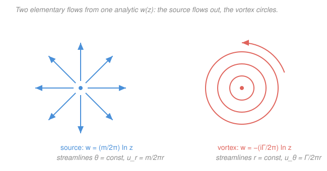

# Fluid Dynamics · Lesson 2.5: 2-D flow and the complex potential

> ⏱ ~15 min · Module 2: Ideal (inviscid) flow · Builds on: [2.4 Irrotational flow and the velocity potential](02-04-irrotational-flow-velocity-potential.md), [`complex-analysis`](../../complex-analysis/syllabus.md) · Unlocks: [2.6 Flow past a cylinder, lift, and d'Alembert's paradox](02-06-flow-past-cylinder-lift.md)

## Why this matters

In [2.4](02-04-irrotational-flow-velocity-potential.md) we found that a 2-D inviscid, irrotational, incompressible flow is completely described by two harmonic functions — the velocity potential $\phi$ and the streamfunction $\psi$ — that are **harmonic conjugates** of each other. Complex analysis has a name for a pair of harmonic conjugates glued together: the real and imaginary parts of an **analytic function**. So the entire apparatus of 2-D potential flow *is* complex analysis in disguise. This lesson cashes that in: instead of solving Laplace's equation with boundary conditions every time, you **write down an analytic function and read the flow straight off it**. You get uniform streams, sources, vortices, and the doublet that builds a cylinder — all for free, and all superposable. This is the same analytic-function machinery from [`mathematical-methods-physics`](../../mathematical-methods-physics/syllabus.md) Module 2, finally paying a physical dividend.

## The idea

Picture the flow plane as the complex plane: a point $(x,y)$ is the complex number $z = x + iy$. In [2.4](02-04-irrotational-flow-velocity-potential.md) we had two real fields, $\phi(x,y)$ and $\psi(x,y)$, that always travel together — lines of constant $\phi$ (equipotentials) cross lines of constant $\psi$ (streamlines) at right angles, exactly the geometry of a conformal map. The trick is to **stop treating them as two things**. Package them into one complex function

$$w(z) = \phi(x,y) + i\,\psi(x,y),$$

the **complex potential**. Because $\phi$ and $\psi$ are harmonic conjugates, $w$ is an *analytic* function of $z$ — differentiable in the complex sense — and every analytic function has this property automatically. Turn it around: **any analytic $w(z)$ you can write down hands you a legal 2-D flow**, incompressible and irrotational by construction. You no longer solve for flows; you *generate* them by writing formulas.

And there's a bonus. Differentiating $w$ once gives the velocity directly — no separate gradient of $\phi$ and curl-check needed. The derivative $\mathrm{d}w/\mathrm{d}z$ is a single complex number at each point that encodes both components of $\mathbf{u}$. So the whole workflow is: **write $w(z)$, differentiate, read off $\mathbf{u}$.**

## The formal version

**Complex potential.** For a 2-D irrotational, incompressible flow, define

$$w(z) = \phi + i\psi, \qquad z = x + iy.$$

*In words: stack the velocity potential and the streamfunction into the real and imaginary parts of one function of the complex position.* Recall from [2.4](02-04-irrotational-flow-velocity-potential.md) the Cauchy–Riemann equations connecting them,

$$\frac{\partial\phi}{\partial x} = \frac{\partial\psi}{\partial y}, \qquad \frac{\partial\phi}{\partial y} = -\frac{\partial\psi}{\partial x},$$

which are *exactly* the condition that $w(z)$ is analytic. So the physics statement "$\phi,\psi$ are harmonic conjugates" and the math statement "$w$ is analytic" are the same statement.

**Complex velocity.** Because $w$ is analytic, its derivative is the same taken in any direction; take it along the real axis:

$$\frac{\mathrm{d}w}{\mathrm{d}z} = \frac{\partial\phi}{\partial x} + i\frac{\partial\psi}{\partial x}.$$

Now use the velocity definitions from [2.4](02-04-irrotational-flow-velocity-potential.md): $u = \partial_x\phi$ and, from the streamfunction, $v = -\partial_x\psi$. Substituting,

$$\boxed{\;\frac{\mathrm{d}w}{\mathrm{d}z} = u - iv\;}$$

*In words: the derivative of the complex potential is the velocity — but with a flipped sign on the vertical component, so it is $u - iv$, the **complex conjugate** of the velocity $u + iv$.* This is the one place to be careful: the flow velocity as a complex number is $u + iv$, but $\mathrm{d}w/\mathrm{d}z$ gives you its conjugate $u - iv$. The quantity $\mathrm{d}w/\mathrm{d}z$ is called the **complex velocity**. Its modulus is the speed: $|\mathrm{d}w/\mathrm{d}z| = \sqrt{u^2+v^2}$. Points where $\mathrm{d}w/\mathrm{d}z = 0$ are **stagnation points** (fluid at rest).

**The elementary building blocks.** Each is one analytic function. Write $z = re^{i\theta}$, so $\ln z = \ln r + i\theta$. Below, $U, m, \Gamma, \mu$ are real constants.

| Flow | $w(z)$ | $\mathrm{d}w/\mathrm{d}z$ | What it is |
|---|---|---|---|
| **Uniform** | $Uz$ | $U$ | constant stream, speed $U$ along $+x$ ($u=U,\ v=0$) |
| **Source / sink** | $\dfrac{m}{2\pi}\ln z$ | $\dfrac{m}{2\pi z}$ | radial outflow, $u_r = \dfrac{m}{2\pi r}$ ($m>0$ source, $m<0$ sink) |
| **Line vortex** | $-\dfrac{i\Gamma}{2\pi}\ln z$ | $-\dfrac{i\Gamma}{2\pi z}$ | circular flow, $u_\theta = \dfrac{\Gamma}{2\pi r}$, circulation $\Gamma$ |
| **Doublet / dipole** | $\dfrac{\mu}{z}$ | $-\dfrac{\mu}{z^2}$ | a coincident source+sink; the piece that makes a cylinder |

Reading these:

- **Uniform flow.** $w = Uz = Ux + iUy$, so $\phi = Ux$, $\psi = Uy$. Streamlines $\psi=\text{const}$ are horizontal lines — a uniform stream. $\mathrm{d}w/\mathrm{d}z = U = u - iv$ gives $u=U$, $v=0$. ✓
- **Source of strength $m$.** $w = \frac{m}{2\pi}\ln z = \frac{m}{2\pi}\ln r + i\frac{m}{2\pi}\theta$, so $\phi = \frac{m}{2\pi}\ln r$, $\psi = \frac{m}{2\pi}\theta$. Streamlines $\psi=\text{const}$ are rays $\theta=\text{const}$ — radial outflow. The constant $m$ is the **volume flux** per unit span: the flow crossing any circle of radius $r$ is $u_r\cdot 2\pi r = m$, independent of $r$ (mass conservation, as it must be — the "source" injects $m$ everywhere).
- **Line vortex of circulation $\Gamma$.** $w = -\frac{i\Gamma}{2\pi}\ln z = \frac{\Gamma}{2\pi}\theta - i\frac{\Gamma}{2\pi}\ln r$, so $\phi = \frac{\Gamma}{2\pi}\theta$, $\psi = -\frac{\Gamma}{2\pi}\ln r$. Streamlines $\psi=\text{const}$ are circles $r=\text{const}$ — purely circular flow with tangential speed $u_\theta = \Gamma/2\pi r$. Crucially this flow is **irrotational for $r>0$** (the vorticity is a delta spike concentrated at the core $r=0$, where $w$ is singular) — exactly the point-vortex picture from [2.2](02-02-vorticity-circulation.md): all the circulation $\Gamma$ lives on the axis, none is spread through the fluid.
- **Doublet of strength $\mu$.** $w = \mu/z$. This is the limit of a source and an equal sink brought infinitely close together (Problem 3). Alone it is not very physical, but **added to a uniform stream it produces flow past a cylinder** — the headline of [2.6](02-06-flow-past-cylinder-lift.md).

**Superposition.** Laplace's equation is linear, so sums of solutions are solutions. In complex-potential language this is trivial: **add the $w(z)$'s.** A uniform stream plus a doublet, a vortex plus a source (a spiral), two sources (flow past a wall by images) — every composite flow is a sum of building blocks:

$$w_{\text{total}}(z) = \sum_k w_k(z), \qquad \frac{\mathrm{d}w_{\text{total}}}{\mathrm{d}z} = \sum_k \frac{\mathrm{d}w_k}{\mathrm{d}z}.$$

*In words: to build a complicated flow, just add the complex potentials of simple ones — the velocities add too.*

## Picture

The source and the vortex are the *same* logarithm, differing only by a factor of $-i$ — and that factor of $-i$ is a 90° rotation in the complex plane, which is exactly why one flow's radial streamlines become the other's circular ones. Multiplying a complex potential by $-i$ swaps $\phi\leftrightarrow\psi$: it interchanges equipotentials and streamlines.

## Worked examples

**Example 1 (mechanical — read velocity off $w$).** Take the source $w = \dfrac{m}{2\pi}\ln z$. Find the velocity field and confirm the outflow.

Differentiate:

$$\frac{\mathrm{d}w}{\mathrm{d}z} = \frac{m}{2\pi}\cdot\frac{1}{z} = \frac{m}{2\pi}\cdot\frac{1}{r}e^{-i\theta} = \frac{m}{2\pi r}(\cos\theta - i\sin\theta) = u - iv.$$

Matching real and imaginary parts, $u = \frac{m}{2\pi r}\cos\theta$ and $v = \frac{m}{2\pi r}\sin\theta$. The velocity vector is $\mathbf{u} = \frac{m}{2\pi r}(\cos\theta,\sin\theta) = \frac{m}{2\pi r}\,\hat{\mathbf{r}}$ — purely radial, magnitude $u_r = m/2\pi r$. The flux through a circle of radius $r$ is $u_r\cdot 2\pi r = m$, independent of $r$: whatever the source emits crosses every enclosing circle, as conservation of mass demands. The speed $\propto 1/r$ blows up at the origin — the source is a genuine singularity of $w$, not a real fluid point.

**Example 2 (why you'd care — a cylinder appears).** Superpose a uniform stream and a doublet:

$$w(z) = Uz + \frac{\mu}{z}.$$

Where is the fluid at rest? Set the complex velocity to zero:

$$\frac{\mathrm{d}w}{\mathrm{d}z} = U - \frac{\mu}{z^2} = 0 \;\Longrightarrow\; z^2 = \frac{\mu}{U} \;\Longrightarrow\; z = \pm\sqrt{\mu/U}.$$

Two **stagnation points** on the $x$-axis, at $x = \pm a$ with $a \equiv \sqrt{\mu/U}$. Now look at the streamfunction. Writing $z = re^{i\theta}$, $\ \mu/z = (\mu/r)e^{-i\theta}$, so

$$\psi = \operatorname{Im} w = U r\sin\theta - \frac{\mu}{r}\sin\theta = \left(Ur - \frac{\mu}{r}\right)\sin\theta = U\sin\theta\left(r - \frac{a^2}{r}\right).$$

The streamline $\psi = 0$ is satisfied by $\sin\theta = 0$ (the $x$-axis) **and** by $r = a$ (a *circle* of radius $a$). Since streamlines are impenetrable, that closed circle acts as a solid boundary: **uniform flow + doublet = flow past a cylinder of radius $a=\sqrt{\mu/U}$.** We wrote down two formulas and a cylinder fell out. Lesson [2.6](02-06-flow-past-cylinder-lift.md) adds a vortex to this and extracts lift.

## Watch out

- **The conjugate trap.** $\mathrm{d}w/\mathrm{d}z = u - iv$, **not** $u + iv$. The complex velocity is the *conjugate* of the physical velocity vector-as-complex-number. Forgetting this flips the sign of $v$ — a vortex will appear to spin the wrong way. When in doubt, re-derive it from $u=\partial_x\phi$, $v=-\partial_x\psi$.
- **Source vs. vortex is just a factor of $-i$.** $\frac{m}{2\pi}\ln z$ (source) and $-\frac{i\Gamma}{2\pi}\ln z$ (vortex) look almost identical, but the $-i$ swaps radial for circular. Don't let the shared $\ln z$ fool you into thinking they're the same flow — check which part, $\phi$ or $\psi$, carries the angle $\theta$.
- **"Irrotational" does not mean "no circulation."** The line vortex has $\boldsymbol\omega = 0$ everywhere the flow is defined ($r>0$), yet $\oint\mathbf{u}\cdot\mathrm{d}\boldsymbol\ell = \Gamma \ne 0$ around any loop enclosing the core. The region is not simply connected — the singularity at $r=0$ is excluded — so Stokes' theorem doesn't force the circulation to vanish. This is the [2.2](02-02-vorticity-circulation.md) point that makes lift possible in [2.6](02-06-flow-past-cylinder-lift.md).

## One-liner

> Any analytic $w(z) = \phi + i\psi$ is a free 2-D irrotational incompressible flow; differentiate it — $\mathrm{d}w/\mathrm{d}z = u - iv$ — to read the velocity, and add potentials to build new flows.

## Problems

**P1 (🟢)** A flow has complex potential $w(z) = A z^2$ with $A$ a positive real constant. Find the velocity field $(u,v)$, verify it is incompressible and irrotational, and locate any stagnation points. (This is flow into a right-angle corner.)

**P2 (🟡)** For the line vortex $w = -\dfrac{i\Gamma}{2\pi}\ln z$: (a) extract $\phi$ and $\psi$ and confirm the streamlines are circles; (b) show the tangential speed is $u_\theta = \Gamma/2\pi r$; (c) compute the circulation $\oint\mathbf{u}\cdot\mathrm{d}\boldsymbol\ell$ around a circle of radius $r$ centred on the origin, and reconcile the nonzero answer with the flow being irrotational for $r>0$.

**P3 (🔴, optional)** Place a source of strength $m$ at $z=-\delta$ and a sink of strength $m$ at $z=+\delta$. Write the combined $w(z)$, then take the limit $\delta\to 0$ with $m\delta$ held fixed, and show you recover the doublet $w = \mu/z$. Identify $\mu$ in terms of $m$ and $\delta$, and note which way the doublet "points."

Solutions

**P1** Differentiate: $\dfrac{\mathrm{d}w}{\mathrm{d}z} = 2Az = 2A(x+iy) = u - iv.$ So $u = 2Ax$ and $-v = 2Ay \Rightarrow v = -2Ay$, giving

$$\mathbf{u} = (2Ax,\, -2Ay).$$

Incompressible: $\nabla\cdot\mathbf{u} = \partial_x u + \partial_y v = 2A + (-2A) = 0$ ✓. Irrotational (2-D vorticity): $\partial_x v - \partial_y u = 0 - 0 = 0$ ✓ — automatic, since $w$ is analytic. Stagnation point where $\mathrm{d}w/\mathrm{d}z = 2Az = 0$, i.e. at $z=0$ (the corner).

*Check.* Streamlines are $\psi = \operatorname{Im}(Az^2) = A\cdot 2xy = 2Axy = \text{const}$, i.e. hyperbolae $xy=\text{const}$ — flow sweeping into a 90° corner along the axes, which are themselves the $\psi=0$ streamlines. Both walls are streamlines, consistent with a rigid corner. ✓

**P2** (a) With $z = re^{i\theta}$, $\ \ln z = \ln r + i\theta$, so

$$w = -\frac{i\Gamma}{2\pi}(\ln r + i\theta) = \frac{\Gamma}{2\pi}\theta \;-\; i\,\frac{\Gamma}{2\pi}\ln r.$$

Thus $\phi = \frac{\Gamma}{2\pi}\theta$ and $\psi = -\frac{\Gamma}{2\pi}\ln r$. Streamlines $\psi = \text{const}$ mean $\ln r = \text{const}$, i.e. $r = \text{const}$ — concentric circles. ✓

(b) $\dfrac{\mathrm{d}w}{\mathrm{d}z} = -\dfrac{i\Gamma}{2\pi z} = -\dfrac{i\Gamma}{2\pi r}e^{-i\theta} = -\dfrac{i\Gamma}{2\pi r}(\cos\theta - i\sin\theta) = \dfrac{\Gamma}{2\pi r}(-\sin\theta - i\cos\theta) = u - iv.$ So $u = -\frac{\Gamma}{2\pi r}\sin\theta$, $v = \frac{\Gamma}{2\pi r}\cos\theta$, i.e. $\mathbf{u} = \frac{\Gamma}{2\pi r}(-\sin\theta,\cos\theta) = \frac{\Gamma}{2\pi r}\,\hat{\boldsymbol\theta}$. Purely tangential, speed $u_\theta = \Gamma/2\pi r$. ✓

(c) On the circle of radius $r$, $\mathrm{d}\boldsymbol\ell = \hat{\boldsymbol\theta}\,r\,\mathrm{d}\theta$, so

$$\oint\mathbf{u}\cdot\mathrm{d}\boldsymbol\ell = \int_0^{2\pi} \frac{\Gamma}{2\pi r}\,(r\,\mathrm{d}\theta) = \Gamma.$$

The circulation is $\Gamma$ for *every* enclosing loop, yet the vorticity is zero everywhere the flow is defined. No contradiction: the loop encircles the singular core at $r=0$, which is excluded from the flow domain, so the region is not simply connected and Stokes' theorem cannot be applied across the hole. All the "spin" is a delta-function at the axis — the point-vortex idea of [2.2](02-02-vorticity-circulation.md).

*Check.* Dimensions: $u_\theta = \Gamma/2\pi r$ has $[\Gamma] = \text{(velocity)}\times\text{(length)} = \mathrm{m^2/s}$, matching circulation as velocity times length ✓. As $r\to\infty$ the flow dies as $1/r$ (a localized swirl), and as $r\to 0$ it diverges (the singular core) — both sensible. ✓

**P3** Source at $-\delta$: $w_1 = \frac{m}{2\pi}\ln(z+\delta)$. Sink at $+\delta$: $w_2 = -\frac{m}{2\pi}\ln(z-\delta)$. Sum:

$$w = \frac{m}{2\pi}\big[\ln(z+\delta) - \ln(z-\delta)\big] = \frac{m}{2\pi}\ln\!\left(\frac{z+\delta}{z-\delta}\right).$$

For small $\delta$, expand each log: $\ln(z\pm\delta) = \ln z + \ln(1 \pm \delta/z) \approx \ln z \pm \frac{\delta}{z} - \frac{\delta^2}{2z^2}\pm\cdots$. Subtracting, the $\ln z$ and even terms cancel and the odd terms double:

$$\ln(z+\delta) - \ln(z-\delta) \approx \frac{2\delta}{z} + O(\delta^3).$$

Hence $w \approx \dfrac{m}{2\pi}\cdot\dfrac{2\delta}{z} = \dfrac{m\delta/\pi}{z}$. Taking $\delta\to 0$ with $m\delta$ fixed gives exactly

$$w = \frac{\mu}{z}, \qquad \mu = \frac{m\delta}{\pi}.$$

The doublet points from the sink toward the source — here from $+\delta$ toward $-\delta$, i.e. along $-x$. (A doublet has an orientation; multiplying $\mu$ by $e^{i\alpha}$ rotates its axis, which is how [2.6](02-06-flow-past-cylinder-lift.md) aligns it against the oncoming stream.)

*Check.* Dimensions: $[m] = \mathrm{m^2/s}$ (a 2-D flux) and $[\delta]=\mathrm{m}$, so $[\mu] = \mathrm{m^3/s}$; then $[\mu/z]\cdot$ — well, $w = \mu/z$ has units $\mathrm{m^3/s}\,/\,\mathrm{m} = \mathrm{m^2/s}$, matching $[w]=[\phi]=$ velocity$\times$length ✓. Limiting sense: as $\delta\to 0$ with $m\to\infty$ the source and sink annihilate at every finite $r$ except in their infinitesimal overlap, leaving the dipole field — the fluid analogue of an electric dipole from two merging charges. ✓

## Flashback

**From Lesson 2.4 (Irrotational flow and the velocity potential):** A 2-D flow has velocity potential $\phi = x^2 - y^2$. Verify $\phi$ is harmonic, find the velocity field, construct the streamfunction $\psi$ (its harmonic conjugate), and identify the complex potential $w(z)$.

Solution

Harmonic: $\nabla^2\phi = \partial_{xx}\phi + \partial_{yy}\phi = 2 + (-2) = 0$ ✓, so $\phi$ is a legitimate potential. Velocity:

$$u = \partial_x\phi = 2x, \qquad v = \partial_y\phi = -2y.$$

Streamfunction from Cauchy–Riemann, $u = \partial_y\psi$ and $v = -\partial_x\psi$:

$$\partial_y\psi = 2x \;\Rightarrow\; \psi = 2xy + f(x); \qquad -\partial_x\psi = v = -2y \;\Rightarrow\; \partial_x\psi = 2y \;\Rightarrow\; 2y + f'(x) = 2y \;\Rightarrow\; f'(x)=0.$$

So $\psi = 2xy$ (constant absorbed). Then

$$w = \phi + i\psi = (x^2 - y^2) + i(2xy) = (x+iy)^2 = z^2.$$

*Check.* $\mathrm{d}w/\mathrm{d}z = 2z = 2x + 2iy = u - iv$ gives $u = 2x$, $v = -2y$ ✓, matching the direct computation. This is precisely the corner flow of Problem 1 (with $A=1$) — same flow, reached from the potential side. ✓

## Connections

- **Backward:** this is [2.4](02-04-irrotational-flow-velocity-potential.md) repackaged — the harmonic-conjugate pair $(\phi,\psi)$ *is* the analytic function $w=\phi+i\psi$, and the Cauchy–Riemann equations are the analyticity condition. The line vortex realizes the "circulation without vorticity" of [2.2](02-02-vorticity-circulation.md) as a single singular $\ln z$.
- **Forward:** [2.6](02-06-flow-past-cylinder-lift.md) takes $w = Uz + \mu/z$ (Example 2, the cylinder), adds a line vortex $-\frac{i\Gamma}{2\pi}\ln z$, and uses the Blasius theorem to extract the Kutta–Joukowski lift $L = \rho U\Gamma$ and the (paradoxically zero) drag.
- **Sideways (complex analysis):** the complex potential is a working application of analytic functions and conformal maps — the machinery of [`complex-analysis`](../../complex-analysis/syllabus.md) and [`mathematical-methods-physics`](../../mathematical-methods-physics/syllabus.md) Module 2. A conformal map $z\mapsto \zeta(z)$ carries one flow to another (a cylinder to an airfoil, via the Joukowski map), because it preserves the analyticity of $w$ — this is where potential flow and pure complex analysis become literally the same subject.
