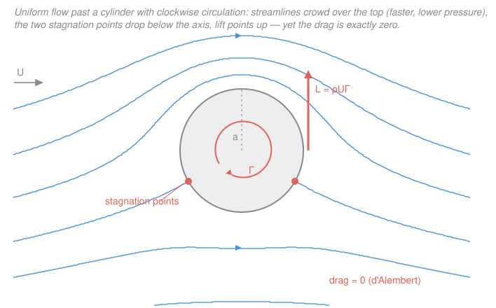

# Fluid Dynamics · Lesson 2.6: Flow past a cylinder, lift, and d'Alembert's paradox

> ⏱ ~15 min · Module 2: Ideal (inviscid) flow · Builds on: [2.5 2-D flow and the complex potential](02-05-complex-potential.md) · Unlocks: [3.1 The Reynolds number and dynamical similarity](03-01-reynolds-number.md)

## Why this matters

This is the payoff of the whole potential-flow machinery: with two lines of complex algebra you will build the flow around a cylinder, add spin, and read off the **lift** — the same $\rho U\Gamma$ that holds an airplane up and bends a curveball. In the same breath you'll meet a scandal: the theory insists the fluid exerts **zero drag** on the cylinder, which is flatly false for any real fluid. That contradiction, **d'Alembert's paradox**, is not a bug to hide — it's the signpost that tells us *exactly* what ideal flow leaves out (viscosity, boundary layers, separation) and launches Module 3. This lesson is Boss problem 2.

## The idea

You already have all the pieces from [2.5](02-05-complex-potential.md). Complex potentials **add**, so you build complicated flows by stacking simple ones. Take a **uniform stream** flowing left-to-right and drop a **doublet** (a source and sink squeezed together — a tiny dipole) at the origin. The stream's push and the doublet's outflow-then-inflow fight to a standstill on a perfect circle: the streamline $\psi=0$ closes into $|z|=a$. Since no fluid crosses a streamline, you can *pretend that circle is a solid wall* and throw away the inside. What's left outside is the flow past a cylinder — conjured, not solved.

Where the flow wraps over the top and bottom it has to squeeze through less room, so it speeds up; dead ahead and dead behind it stops entirely at two **stagnation points**. So far everything is up-down symmetric, so there's no net sideways force.

Now add a **vortex** at the center — swirl the fluid around the cylinder. On one side the swirl runs *with* the stream (faster), on the other *against* it (slower). Faster means lower pressure (Bernoulli, [2.1](02-01-bernoulli.md)), so the cylinder gets sucked toward the fast side: **lift**. The two stagnation points slide off the axis. And the amount of lift turns out to depend only on how much swirl you added — the **circulation** $\Gamma$ from [2.2](02-02-vorticity-circulation.md).

## The formal version

**The complex potential.** With a uniform stream of speed $U$ (metres per second) along $+x$, a cylinder of radius $a$ (metres), and circulation $\Gamma$ (square metres per second) taken **clockwise-positive** (the lift-generating sense for left-to-right flow):

$$\boxed{\,w(z) = U\!\left(z + \frac{a^2}{z}\right) + \frac{i\Gamma}{2\pi}\ln z\,}$$

The first term is uniform-stream-plus-doublet (doublet strength tuned to $\mu = Ua^2$ so the circle closes); the second is the point vortex. *In words: cylinder = stream + doublet; spin = add a vortex.* Splitting $w = \phi + i\psi$ with $z = re^{i\theta}$, the **streamfunction** is

$$\psi = U\!\left(r - \frac{a^2}{r}\right)\sin\theta + \frac{\Gamma}{2\pi}\ln\frac{r}{a}.$$

On the surface $r=a$ the first bracket vanishes and $\ln(a/a)=0$, so $\psi = 0$ **everywhere on the circle** — the cylinder *is* a streamline, for any $\Gamma$. *In words: adding swirl never breaks the circle; it just relabels the flow outside it.*

**Velocity.** From [2.5](02-05-complex-potential.md), $\dfrac{dw}{dz} = u - iv$:

$$\frac{dw}{dz} = U\!\left(1 - \frac{a^2}{z^2}\right) + \frac{i\Gamma}{2\pi z}.$$

On the surface the radial velocity is zero (as it must be at a wall); the whole speed is tangential,

$$u_\theta(\theta) = -\,2U\sin\theta - \frac{\Gamma}{2\pi a}.$$

*In words: the surface speed is the doublet's $-2U\sin\theta$ (already twice the free stream at the shoulders) plus a constant swirl.*

**Stagnation points.** Set $u_\theta = 0$:

$$\sin\theta_s = -\frac{\Gamma}{4\pi U a}.$$

*In words: crank up the spin and the two stagnation points slide down together toward the bottom.* When $\Gamma = 4\pi U a$ they merge at the bottom ($\theta=-90^\circ$); beyond that they leave the surface entirely and a standoff vortex sits below the cylinder.

**Pressure and the forces.** Bernoulli on the surface ([2.1](02-01-bernoulli.md)), $p + \tfrac12\rho q^2 = p_\infty + \tfrac12\rho U^2$ with $q=|u_\theta|$ the surface speed and $\rho$ the density (kg/m³), gives $p(\theta)$. Integrate the pressure around the circle, $\mathbf{F} = -\oint p\,\hat{\mathbf n}\,a\,d\theta$. Only the term in $q^2$ *linear* in $\sin\theta$ survives the integral, and it lands entirely in the vertical component:

$$\boxed{\;\text{drag } D = 0, \qquad \text{lift } L = \rho U \Gamma \;\text{ per unit span.}\;}$$

The lift result is the **Kutta–Joukowski theorem**; the zero-drag result is **d'Alembert's paradox**. *In words: an ideal fluid pushes a body sideways in exact proportion to the circulation, but never resists its motion at all.* (The same two numbers drop out in one shot from the **Blasius theorem** $F_x - iF_y = \tfrac{i\rho}{2}\oint (dw/dz)^2\,dz$, whose only residue is $iU\Gamma/\pi$ — see P3.)

## Picture

## Worked examples

**Example 1 (read off the flow).** Water ($\rho = 1000\ \mathrm{kg/m^3}$) streams at $U = 2\ \mathrm{m/s}$ past a cylinder of radius $a = 0.5\ \mathrm{m}$ with clockwise circulation $\Gamma = 2\pi\ \mathrm{m^2/s}$. The swirl constant is $\Gamma/(2\pi a) = 2\pi/(2\pi\cdot 0.5) = 2\ \mathrm{m/s}$, so

$$\sin\theta_s = -\frac{\Gamma}{4\pi U a} = -\frac{2\pi}{4\pi\cdot 2\cdot 0.5} = -\frac12 \;\Rightarrow\; \theta_s = -30^\circ,\ -150^\circ,$$

both below the axis, as drawn. Surface speeds: at the **top** ($\theta=90^\circ$), $q = |{-2U} - \Gamma/2\pi a| = |{-4}-2| = 6\ \mathrm{m/s}$; at the **bottom** ($\theta=-90^\circ$), $q = |{+4}-2| = 2\ \mathrm{m/s}$. Faster on top → lower pressure on top → the lift points **up**, and $L = \rho U\Gamma = 1000\cdot 2\cdot 2\pi \approx 1.26\times 10^4\ \mathrm{N/m}$.

**Example 2 (the Magnus effect — why a spinning ball curves).** Nothing in ideal flow tells you *where* $\Gamma$ comes from — you put it in by hand. In reality **viscosity** supplies it: a spinning cylinder or ball drags the fluid around with it by no-slip at the surface, setting up a real circulation $\Gamma$. Kutta–Joukowski then delivers a sideways force $L=\rho U\Gamma$ perpendicular to the flight. A ball with **backspin** carries $\Gamma$ that speeds the air over its top → lift, so it floats farther than gravity alone allows; **topspin** flips $\Gamma$ and drives it down; sidespin bends a soccer free kick or a curveball. The ideal theory nails the *direction and scaling* of the force even though the *origin* of $\Gamma$ is entirely viscous — a preview of Module 3.

## Watch out

- **You might think zero drag is a calculation slip — it isn't.** It's an exact, correct consequence of ideal flow, and it's *wrong about reality*. Real fluids separate: the flow can't stay attached around the back, it leaves a low-pressure **wake**, and the front–back pressure symmetry that killed the drag is destroyed. The paradox is real physics telling you viscosity is never negligible near a wall, however small $\nu$ is.
- **You might expect lift to need the doublet's details.** It doesn't — $L=\rho U\Gamma$ depends only on $U$ and the *circulation*, not on the body's shape or size. Kutta–Joukowski holds for *any* 2-D shape; the cylinder is just the easiest case to compute.
- **Sign conventions bite here.** We took $\Gamma$ **clockwise**-positive so that $L=+\rho U\Gamma$ points up. Many texts take $\Gamma$ counterclockwise-positive and then write $L=-\rho U\Gamma$. Same physics, same magnitude — always sanity-check *which side is faster* to fix the direction.

## One-liner

> Stream + doublet makes a cylinder, adding a vortex makes lift $L=\rho U\Gamma$ — and the drag comes out exactly zero, a paradox whose only cure is viscosity.

## Problems

**P1 (🟢)** Air ($\rho = 1.2\ \mathrm{kg/m^3}$) flows at $U = 10\ \mathrm{m/s}$ past a cylinder of radius $a = 0.2\ \mathrm{m}$ with clockwise circulation $\Gamma = 8\pi\ \mathrm{m^2/s}$. (a) Locate the stagnation points. (b) Find the lift per unit span. (c) What is the drag?

**P2 (🟡)** For the same cylinder with a *general* $\Gamma$, use the surface speed $q(\theta) = |2U\sin\theta + \Gamma/2\pi a|$ and Bernoulli to write the pressure difference between the bottom point ($\theta=-90^\circ$) and the top point ($\theta=+90^\circ$). Show it is proportional to $\Gamma$, and explain in one sentence why that makes the lift $\propto\Gamma$.

**P3 (🔴, optional — Boss problem 2)** Starting from $w(z)=U(z+a^2/z)+\tfrac{i\Gamma}{2\pi}\ln z$, use the **Blasius theorem** $F_x - iF_y = \tfrac{i\rho}{2}\oint_C (dw/dz)^2\,dz$ (contour $C$ any loop around the cylinder) to show $F_x=0$ and $F_y=\rho U\Gamma$. Then state what physical assumption, dropped in Module 3, rescues the missing drag.

Solutions

**P1** (a) $\sin\theta_s = -\dfrac{\Gamma}{4\pi U a} = -\dfrac{8\pi}{4\pi\cdot 10\cdot 0.2} = -\dfrac{8\pi}{8\pi} = -1$, so the two points have merged into a single stagnation point at $\theta_s = -90^\circ$ (the bottom of the cylinder) — the critical case $\Gamma = 4\pi U a$. (b) $L = \rho U\Gamma = 1.2\cdot 10\cdot 8\pi = 96\pi \approx 302\ \mathrm{N/m}$, directed **up**. (c) $D = 0$ — d'Alembert's paradox holds regardless of $\Gamma$.

*Check.* Units of lift: $(\mathrm{kg\,m^{-3}})(\mathrm{m\,s^{-1}})(\mathrm{m^2\,s^{-1}}) = \mathrm{kg\,s^{-2}} = \mathrm{N/m}$ ✓ (force per unit span). Limiting sense: at exactly $\Gamma=4\pi Ua$ the two stagnation points should just touch at the bottom, which is what $\sin\theta_s=-1$ says. ✓

**P2** Bernoulli gives $p = p_\infty + \tfrac12\rho(U^2 - q^2)$, so $p_{\text{bot}} - p_{\text{top}} = \tfrac12\rho(q_{\text{top}}^2 - q_{\text{bot}}^2)$. With $q_{\text{top}} = |2U + \Gamma/2\pi a|$ and $q_{\text{bot}} = |{-2U} + \Gamma/2\pi a| = |2U - \Gamma/2\pi a|$ (taking $0<\Gamma<4\pi Ua$ so top is the fast side):

$$q_{\text{top}}^2 - q_{\text{bot}}^2 = \Big(2U+\tfrac{\Gamma}{2\pi a}\Big)^2 - \Big(2U-\tfrac{\Gamma}{2\pi a}\Big)^2 = 4\cdot 2U\cdot\frac{\Gamma}{2\pi a} = \frac{4U\Gamma}{\pi a}.$$

Hence $p_{\text{bot}} - p_{\text{top}} = \tfrac12\rho\cdot\dfrac{4U\Gamma}{\pi a} = \dfrac{2\rho U\Gamma}{\pi a}$, **linear in $\Gamma$**. The bottom is at higher pressure than the top, so the net pressure force pushes the cylinder up; because that imbalance grows in direct proportion to $\Gamma$, so does the lift — which is why the exact integral gives $L\propto\Gamma$.

*Check.* Units: $\rho U\Gamma/a$ has units $(\mathrm{kg\,m^{-3}})(\mathrm{m\,s^{-1}})(\mathrm{m^2 s^{-1}})/\mathrm{m} = \mathrm{kg\,m^{-1}s^{-2}} = \mathrm{Pa}$ ✓. Sanity: set $\Gamma=0$ and the difference vanishes — symmetric flow, no lift. ✓

**P3** Write $g(z) \equiv \dfrac{dw}{dz} = U\!\left(1 - \dfrac{a^2}{z^2}\right) + \dfrac{i\Gamma}{2\pi z}$. Square it and collect the $1/z$ term (the only one that survives $\oint$, by the residue theorem):

$$g(z)^2 = U^2 + \frac{iU\Gamma}{\pi}\cdot\frac{1}{z} + \Big(\text{terms in } z^0,\ z^{-2},\ z^{-3},\ z^{-4}\Big).$$

The $1/z$ coefficient comes only from the cross term $2\cdot U\cdot\tfrac{i\Gamma}{2\pi z} = \tfrac{iU\Gamma}{\pi z}$ (the $-Ua^2/z^2$ term produces $z^{-2}$, $z^{-3}$, $z^{-4}$ only). So the residue is $iU\Gamma/\pi$ and

$$\oint_C g^2\,dz = 2\pi i\cdot\frac{iU\Gamma}{\pi} = -2U\Gamma.$$

Therefore

$$F_x - iF_y = \frac{i\rho}{2}(-2U\Gamma) = -i\rho U\Gamma \;\Rightarrow\; F_x = 0,\quad F_y = \rho U\Gamma.$$

Zero drag, lift $\rho U\Gamma$ up. The rescue in Module 3 is **viscosity**: the no-slip condition creates a thin boundary layer that *separates* from the rear of the body, replacing the neat pressure-recovering wake of ideal theory with a broad low-pressure wake. That front–back pressure asymmetry is the pressure (form) drag the ideal calculation misses.

*Check.* Blasius depends only on the residue, i.e. only on the vortex strength $\Gamma$ — matching the claim that lift is shape-independent and equals $\rho U\Gamma$. Setting $\Gamma=0$ gives $F_x=F_y=0$: a plain cylinder in a stream feels no force at all, the starkest form of the paradox. ✓

## Flashback

**From Lesson 2.1 (Bernoulli's theorem):** A Pitot tube faces into a wind of air ($\rho = 1.2\ \mathrm{kg/m^3}$) moving at $U = 30\ \mathrm{m/s}$. At the tube's mouth the air is brought to rest (a stagnation point). What pressure rise, above the ambient static pressure, does the tube register?

Solution

At a stagnation point all the flow's kinetic energy converts to pressure. Bernoulli from the free stream to the stagnation point ($q=0$):

$$p_0 = p_\infty + \tfrac12\rho U^2 \;\Rightarrow\; p_0 - p_\infty = \tfrac12\rho U^2 = \tfrac12(1.2)(30)^2 = 540\ \mathrm{Pa}.$$

*Check.* Units: $(\mathrm{kg\,m^{-3}})(\mathrm{m\,s^{-1}})^2 = \mathrm{kg\,m^{-1}s^{-2}} = \mathrm{Pa}$ ✓. This is exactly the pressure at the *front* stagnation point of our cylinder — the point where the dividing streamline hits the surface — so the same $\tfrac12\rho U^2$ that a Pitot tube reads is what pins down the pressure field we integrated for the lift.

## Connections

- **Backward:** this is [2.5](02-05-complex-potential.md)'s superposition (uniform stream + doublet + vortex) cashed out, with the surface pressure from [2.1 Bernoulli](02-01-bernoulli.md) and the swirl measured by the circulation $\Gamma$ of [2.2](02-02-vorticity-circulation.md). [Kelvin's theorem (2.3)](02-03-kelvin-circulation-theorem.md) is why an inviscid flow started from rest carries $\Gamma=0$ and hence *no* lift — real lift needs viscosity to plant the circulation.
- **Forward:** d'Alembert's paradox is the door into [3.1 The Reynolds number](03-01-reynolds-number.md) and viscous flow — where boundary layers, separation, and a real drag law finally appear, and $Re$ tells you when the ideal picture is even approximately safe.
- **Sideways (complex analysis):** the cylinder is one **conformal map** away from an aerofoil. The **Joukowski transform** $\zeta = z + b^2/z$ bends this circle into a wing-shaped curve while preserving $w(z)$ and hence $\Gamma$ — so the same $L=\rho U\Gamma$ computes the lift of an actual aerofoil. See the [`complex-analysis` syllabus](../../complex-analysis/syllabus.md) for analytic maps as flow generators.
