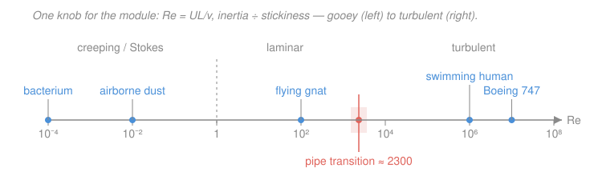

# Fluid Dynamics · Lesson 3.1: The Reynolds number and dynamical similarity

> ⏱ ~15 min · Module 3: Viscous flow · Builds on: [2.6 Flow past a cylinder, lift, and d'Alembert's paradox](02-06-flow-past-cylinder-lift.md), [1.6 The Navier–Stokes equations](01-06-navier-stokes.md) · Unlocks: [3.2 Exact solutions: Couette and Poiseuille flow](03-02-couette-poiseuille.md)

## Why this matters

You have the full Navier–Stokes equations from [1.6](01-06-navier-stokes.md), and they look forbidding: a nonlinear advection term fighting a viscous-diffusion term, with pressure refereeing. But almost everything you actually need to know about a flow — is it smooth and reversible, or does it shed a turbulent wake? — is set by a *single dimensionless number*. Strip the units out of Navier–Stokes and every fluid, every scale, every speed collapses onto one knob: the **Reynolds number** $Re$. It's why a wind-tunnel model of a wing predicts the real thing, why bacteria swim in a world that feels nothing like ours, and why this whole module is organized as "what happens as $Re$ grows." Learn to compute it in your head and you can classify a flow before writing a single equation.

## The idea

Navier–Stokes is a contest between two tendencies. **Inertia** — a parcel's reluctance to change its momentum — wants to carry fluid forward, coast, overshoot, roll up into swirls. **Viscosity** — internal friction — wants to smear velocity differences out and bring everything to a common, orderly speed. The Reynolds number is simply the *ratio of these two forces*:

$$Re \;=\; \frac{\text{inertial forces}}{\text{viscous forces}}.$$

*In words: $Re$ measures whether a fluid's momentum or its stickiness wins.* When stickiness wins ($Re \ll 1$) the flow is gooey, creeping, and — remarkably — *reversible*: run it backward and it retraces its path. When momentum wins ($Re \gg 1$) the flow is all coasting and swirling; the tiniest disturbance grows into a wake and, eventually, turbulence.

The beautiful part: because $Re$ is *the only* parameter left after you nondimensionalize, two flows that look geometrically alike and share the same $Re$ are **the same flow** in disguise — same streamlines, same separation points, same drag coefficient. A honey-scale flow and an air-scale flow can be identical if their Reynolds numbers match.

## The formal version

Start with incompressible Navier–Stokes ([1.6](01-06-navier-stokes.md)), where $\mathbf{u}$ is the velocity field (m/s), $p$ the pressure (Pa), $\rho$ the density (kg/m³), and $\nu = \mu/\rho$ the **kinematic viscosity** (m²/s), with $\mu$ the dynamic viscosity:

$$\partial_t \mathbf{u} + (\mathbf{u}\cdot\nabla)\mathbf{u} = -\frac{1}{\rho}\nabla p + \nu\,\nabla^2\mathbf{u}.$$

Now pick the natural yardsticks of the problem: a characteristic speed $U$, a characteristic length $L$, and — since a parcel moving at $U$ crosses $L$ in time $L/U$ — a characteristic time $L/U$. Inertial pressure fluctuations scale like $\rho U^2$. Define starred, dimensionless variables:

$$\mathbf{x} = L\,\mathbf{x}^*, \quad \mathbf{u} = U\,\mathbf{u}^*, \quad t = \frac{L}{U}\,t^*, \quad p = \rho U^2\, p^*, \quad \nabla = \frac{1}{L}\nabla^*.$$

*In words: measure every length in units of $L$, every speed in units of $U$, and so on — the starred quantities are pure numbers of order 1.* Substitute and each term picks up a prefactor:

$$\frac{U^2}{L}\partial_{t^*}\mathbf{u}^* + \frac{U^2}{L}(\mathbf{u}^*\cdot\nabla^*)\mathbf{u}^* = -\frac{U^2}{L}\nabla^* p^* + \frac{\nu U}{L^2}\nabla^{*2}\mathbf{u}^*.$$

Divide through by $U^2/L$. Three terms have coefficient 1; the viscous term keeps $\dfrac{\nu U/L^2}{U^2/L} = \dfrac{\nu}{UL}$:

$$\boxed{\;\partial_{t^*}\mathbf{u}^* + (\mathbf{u}^*\cdot\nabla^*)\mathbf{u}^* = -\nabla^* p^* + \frac{1}{Re}\,\nabla^{*2}\mathbf{u}^*\;}$$

with the **Reynolds number**

$$Re \;\equiv\; \frac{UL}{\nu} \;=\; \frac{\rho U L}{\mu}.$$

*In words: after removing units, the entire equation depends on exactly one number.* And that number is precisely the inertial-to-viscous ratio: the advection term $(\mathbf{u}\cdot\nabla)\mathbf{u}$ scales as $U^2/L$, the viscous term $\nu\nabla^2\mathbf{u}$ as $\nu U/L^2$, and their ratio is $(U^2/L)\big/(\nu U/L^2) = UL/\nu = Re$. High $Re$ means inertia dwarfs friction; low $Re$ the reverse.

**Dynamical similarity.** Two flows past geometrically similar bodies, governed by the same starred equation with the same boundary conditions, have *identical* dimensionless solutions $\mathbf{u}^*(\mathbf{x}^*, t^*)$ **if and only if their Reynolds numbers are equal.** *In words: match $Re$ and the flows are the same picture; just rescale by $U$ and $L$ to recover the dimensional answer.* This is the entire theoretical basis of model testing — build a small model, match $Re$ (often by using a faster flow or a different fluid), measure the dimensionless drag, and scale up.

**The regimes.** As $Re$ climbs, the character of the flow changes qualitatively:

- $Re \ll 1$ — **creeping (Stokes) flow.** Viscosity dominates; drop the inertial terms and Navier–Stokes becomes *linear* and time-reversible ([3.3](03-03-stokes-flow.md)). This is the world of bacteria ($Re \sim 10^{-4}$).
- $Re$ moderate — **laminar, steady** flow: smooth, layered, predictable (Couette and Poiseuille, [3.2](03-02-couette-poiseuille.md)).
- $Re$ large — inertia rules the bulk, but the no-slip wall forces a thin **boundary layer** where viscosity still matters ([3.4](03-04-boundary-layers.md)); wakes form, and past a critical value the flow goes **turbulent** (Module 4). For pipe flow the transition sits near $Re \approx 2300$.

Everyday numbers: a swimming bacterium $Re \sim 10^{-4}$; a swimming person $Re \sim 10^{6}$; a cruising Boeing 747 $Re \sim 10^{7}$. Twelve orders of magnitude — and $Re$ is the axis they live on.

## Picture

## Worked examples

**Example 1 (mechanical — compute and classify).** Take water, $\nu = 1.0\times 10^{-6}\ \mathrm{m^2/s}$.

*A garden hose:* $U = 2\ \mathrm{m/s}$ through a bore of diameter $L = d = 0.015\ \mathrm{m}$:
$$Re = \frac{UL}{\nu} = \frac{2 \times 0.015}{10^{-6}} = 3.0\times 10^{4}.$$
Far above 2300 — **turbulent**, which is why the stream sputters and mixes.

*A swimming bacterium:* $U = 30\ \mu\mathrm{m/s} = 3\times 10^{-5}\ \mathrm{m/s}$, size $L = 1\ \mu\mathrm{m} = 10^{-6}\ \mathrm{m}$:
$$Re = \frac{3\times 10^{-5} \times 10^{-6}}{10^{-6}} = 3\times 10^{-5}.$$
Deep in the **creeping** regime — to the bacterium, water feels like cold honey, and coasting is impossible (stop swimming and you stop *instantly*).

Same fluid, same equations — but a factor of $10^{9}$ in $Re$ makes these two utterly different worlds.

**Example 2 (why you'd care — dynamical similarity across fluids).** You want to test a wing in a lab. The real wing has chord $L = 2\ \mathrm{m}$ and flies at $U = 50\ \mathrm{m/s}$ in air ($\nu_{\text{air}} = 1.5\times 10^{-5}\ \mathrm{m^2/s}$):
$$Re_{\text{full}} = \frac{50 \times 2}{1.5\times 10^{-5}} \approx 6.7\times 10^{6}.$$
Your model is 1/10 scale, $L_m = 0.2\ \mathrm{m}$. To match $Re$ *in air* you'd need $U_m = Re\,\nu_{\text{air}}/L_m = 6.7\times 10^6 \times 1.5\times 10^{-5}/0.2 \approx 500\ \mathrm{m/s}$ — supersonic, useless. Instead test it in a **water tunnel** ($\nu_{\text{water}} = 10^{-6}\ \mathrm{m^2/s}$):
$$U_m = \frac{Re\,\nu_{\text{water}}}{L_m} = \frac{6.7\times 10^{6}\times 10^{-6}}{0.2} \approx 33\ \mathrm{m/s}.$$
A perfectly practical 33 m/s of water gives the *identical dimensionless flow* as 50 m/s of air over the full wing — different fluid, different scale, matched $Re$, same physics. That's dynamical similarity earning its keep.

## Watch out

- **You might think $Re$ is a property of the fluid.** It isn't — it's a property of *the flow*, and it depends on your choice of $U$ and $L$. The same water is creeping around a bacterium and turbulent in a hose. And you must *state* the length: pipe $Re$ conventionally uses the diameter, not the radius, so quoting "$Re$" without naming $L$ is ambiguous by a factor of 2 or more.
- **You might think high $Re$ means "viscosity is gone."** No — it means viscosity is negligible *in the bulk*. But $1/Re$ multiplies the highest derivative $\nabla^2\mathbf{u}$, so setting it to zero is a *singular* perturbation: near a wall the no-slip condition forces a thin boundary layer where the viscous term is never negligible, however large $Re$ ([3.4](03-04-boundary-layers.md)). Ignoring that layer is exactly the error behind d'Alembert's paradox ([2.6](02-06-flow-past-cylinder-lift.md)).
- **You might think matching *speed* makes a good model.** For similarity you match $Re$, not $U$. A half-size model in the same fluid must run *twice as fast* to keep $Re$ fixed — smaller means faster, counterintuitively.

## One-liner

> Nondimensionalize Navier–Stokes and only $Re = UL/\nu$ survives — inertia over stickiness — so any two geometrically similar flows at the same $Re$ are the very same flow.

## Problems

**P1 (🟢)** Water ($\nu = 1.0\times 10^{-6}\ \mathrm{m^2/s}$) flows at $U = 0.5\ \mathrm{m/s}$ through a pipe of diameter $d = 1\ \mathrm{cm}$. Compute $Re$ and classify the flow. Then compute $Re$ for a person swimming at $U = 1\ \mathrm{m/s}$ with body length $L = 1.8\ \mathrm{m}$, and classify.

**P2 (🟡)** A submarine 20 m long cruises at 5 m/s. You test a 1 m model in a tow tank filled with the *same* seawater. What speed must the model be towed at to achieve dynamical similarity, and why is that a problem in practice?

**P3 (🔴, optional)** At the Reynolds number of the bacterium in Example 1 ($Re = 3\times 10^{-5}$), estimate the ratio of the viscous term to the inertial (advection) term in Navier–Stokes. Which term may you drop, and what special property does the resulting equation gain?

Solutions

**P1** Pipe: $Re = UL/\nu = (0.5)(0.01)/10^{-6} = 5000$. This is above the pipe-transition value $\approx 2300$, so the flow is **transitional-to-turbulent** (not reliably laminar). Swimmer: $Re = (1)(1.8)/10^{-6} = 1.8\times 10^{6}$ — firmly **turbulent**.

*Check.* Units: $(\mathrm{m/s})(\mathrm{m})/(\mathrm{m^2/s}) = $ dimensionless ✓. Both numbers land where the figure's markers do (pipe just past the transition band; human at $\sim 10^6$). ✓

**P2** Dynamical similarity requires equal $Re$. With the same fluid, $\nu$ is unchanged, so $Re_{\text{full}} = Re_{\text{model}}$ demands $U_f L_f = U_m L_m$:
$$U_m = U_f\,\frac{L_f}{L_m} = 5 \times \frac{20}{1} = 100\ \mathrm{m/s}.$$
The model must be towed at **100 m/s** — a factor of 20 faster than the real submarine, because it is 20 times smaller. In practice that is wildly impractical in water: it demands enormous power and would trigger cavitation (vapor bubbles) that the full-scale flow doesn't have, breaking the similarity you were trying to enforce. This is exactly why matching $Re$ for large, slow marine bodies is so hard, and why engineers turn to different fluids, pressurized tunnels, or empirical corrections.

*Check.* Smaller model $\Rightarrow$ faster tow, matching the "Watch out" warning. And $U_m L_m = 100 \times 1 = 100 = 5 \times 20 = U_f L_f$ ✓.

**P3** The inertial (advection) term scales as $U^2/L$ and the viscous term as $\nu U/L^2$, so
$$\frac{\text{viscous}}{\text{inertial}} = \frac{\nu U/L^2}{U^2/L} = \frac{\nu}{UL} = \frac{1}{Re} = \frac{1}{3\times 10^{-5}} \approx 3\times 10^{4}.$$
Viscosity outweighs inertia by about $30{,}000$ to 1, so you may **drop the inertial terms** $\partial_t\mathbf{u} + (\mathbf{u}\cdot\nabla)\mathbf{u}$. What remains, $0 = -\nabla p + \mu\nabla^2\mathbf{u}$ (the **Stokes equations**), is *linear* — and therefore **time-reversible**: reverse the driving and the flow retraces itself exactly. That reversibility is the strange hallmark of life at low $Re$ ([3.3](03-03-stokes-flow.md)).

*Check.* The ratio is just $1/Re$, and $Re \ll 1$ correctly predicts the viscous term dominates — consistent with the "creeping" label on the far left of the figure. ✓

## Flashback

**From Lesson 2.6 (Flow past a cylinder, lift, and d'Alembert's paradox):** A rotating cylinder sits in a uniform air stream ($\rho = 1.2\ \mathrm{kg/m^3}$) of speed $U = 10\ \mathrm{m/s}$, and its rotation sets up a circulation $\Gamma = 8\ \mathrm{m^2/s}$. Find the lift per unit span by the Kutta–Joukowski law, and state the drag. (Fresh numbers — a Magnus-effect variant.)

Solution

Kutta–Joukowski gives lift per unit span $L' = \rho U \Gamma$, directed perpendicular to the stream:
$$L' = \rho U \Gamma = 1.2 \times 10 \times 8 = 96\ \mathrm{N/m}.$$
The drag is **zero** — that is d'Alembert's paradox for this idealized inviscid flow (real cylinders feel drag only because of the viscous boundary layer and wake this module is about).

*Check.* Units: $(\mathrm{kg/m^3})(\mathrm{m/s})(\mathrm{m^2/s}) = \mathrm{kg\,m^{-1}\,s^{-2}} = \mathrm{N/m}$ ✓ — force per unit length, as it should be. Reversing the spin flips the sign of $\Gamma$ and hence the lift direction, matching the Magnus effect. ✓

## Connections

- **Backward:** the two terms whose ratio is $Re$ are exactly the advection and viscous-diffusion terms you assembled in [1.6](01-06-navier-stokes.md); this lesson just weighs them against each other. Setting $1/Re \to 0$ formally recovers the Euler equation of Module 2 — which is why inviscid theory works so well *except* at walls.
- **Forward:** $Re$ is the knob the rest of the module turns — small $Re$ gives the linear, reversible Stokes flow of [3.3](03-03-stokes-flow.md); large $Re$ forces the thin boundary layer of [3.4](03-04-boundary-layers.md) and the separation and wakes of [3.5](03-05-separation-drag.md). The exact Couette/Poiseuille solutions of [3.2](03-02-couette-poiseuille.md) are the laminar middle ground.
- **Sideways (dynamical systems):** the *critical* Reynolds number where laminar flow first loses stability (Module 4) is a **bifurcation** in the sense of [`dynamical-systems`](../../dynamical-systems/syllabus.md) — a control parameter crossing a threshold where a steady state gives way to oscillation and, ultimately, chaos. The same nondimensionalization trick produces the other named groups (Péclet, Prandtl, Rayleigh) whenever a new physical effect is added.
