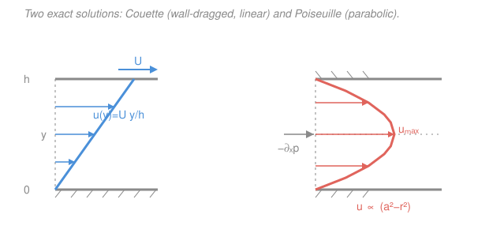

# Fluid Dynamics · Lesson 3.2: Exact solutions: Couette and Poiseuille flow

> ⏱ ~15 min · Module 3: Viscous flow · Builds on: [3.1 The Reynolds number and dynamical similarity](03-01-reynolds-number.md) · Unlocks: [3.3 Stokes flow and low-Reynolds-number life](03-03-stokes-flow.md)

## Why this matters

The Navier–Stokes equations are a nonlinear system of PDEs, and in general you cannot solve them by hand — that nonlinearity is what makes turbulence hard and CFD a career. But a handful of flows are simple enough that the nasty term switches off entirely, and then Navier–Stokes collapses to a *linear ODE you can integrate in one line*. Those exact solutions are not toys: **Couette flow** is how a viscometer measures $\mu$ and how a journal bearing carries a shaft on a film of oil, and **Poiseuille flow** governs every pipe, capillary, and IV line — its $a^4$ flow-rate law is why a small narrowing of an artery is a big deal and why your plumbing's diameter matters more than its length. This is also the machinery behind Boss problem 3.

## The idea

Picture a river running dead straight down a long, unchanging channel: same width, same walls, forever. A fluid parcel moving downstream sees *exactly the same surroundings* at every point along its path — so it has no reason to speed up or slow down as it goes. That is the whole trick. In the material derivative $\frac{D\mathbf{u}}{Dt} = \partial_t\mathbf{u} + (\mathbf{u}\cdot\nabla)\mathbf{u}$, the **advective** term $(\mathbf{u}\cdot\nabla)\mathbf{u}$ measures how velocity changes *as you drift along with the flow*. If the flow is steady ($\partial_t = 0$) and the velocity profile is identical at every cross-section, that term is exactly zero. Inertia — the thing that makes fluids hard — vanishes.

What's left is a standstill tug-of-war: whatever pushes the fluid (a moving wall dragging it, or a pressure difference shoving it) is balanced *instant by instant* by viscous friction combing the velocity smooth. Two ways to drive it give the two classic profiles:

- Drag the top wall sideways and add no pressure push → the fluid gets sheared into a **straight line** (Couette).
- Fix both walls and push with a pressure drop → the fluid bows into a **parabola**, fastest in the middle, pinned to zero at the walls (Poiseuille).

The walls set the values at the edges through the **no-slip condition** (Lesson 1.6): fluid touching a solid moves *with* that solid. That single boundary condition is what turns an ODE into a specific profile.

## The formal version

Take **steady, fully-developed, unidirectional, incompressible** flow: velocity points only in $x$, $\mathbf{u} = \big(u(y),\,0,\,0\big)$, and nothing depends on $x$ (fully developed). Incompressibility $\partial_x u = 0$ is then automatic. The $x$-momentum Navier–Stokes equation

$$\rho\Big(\underbrace{\partial_t u}_{=\,0} + \underbrace{u\,\partial_x u}_{=\,0}\Big) = -\partial_x p + \mu\big(\partial_x^2 u + \partial_y^2 u\big)$$

loses its entire left side (inertia gone) and the $\partial_x^2 u$ term (no $x$-dependence), leaving the linear ODE

$$\boxed{\;0 = -\partial_x p + \mu\,\frac{d^2 u}{dy^2}\;}$$

*In words: the pressure push per unit volume is exactly balanced by the net viscous force per unit volume — a force standoff, no acceleration anywhere.* Because the left side of the ODE ($u$) depends only on $y$ while $\partial_x p$ can only depend on $x$, both must equal the same constant: the **pressure gradient is uniform**, $\partial_x p = \text{const}$.

**Plane Couette flow.** Two plates a distance $h$ apart, bottom fixed, top sliding at speed $U$, *no* pressure gradient ($\partial_x p = 0$):

$$\mu\,u'' = 0 \;\Longrightarrow\; u'' = 0 \;\Longrightarrow\; u(y) = C_1 y + C_2.$$

No-slip gives $u(0)=0$ and $u(h)=U$, so $C_2 = 0$, $C_1 = U/h$:

$$u(y) = U\,\frac{y}{h}, \qquad \tau = \mu\,\frac{du}{dy} = \frac{\mu U}{h}.$$

*In words: pure shear — the velocity ramps linearly from wall to wall, and the shear stress is the same everywhere.* Measure the force per area $\tau$ needed to drag the plate at known $U$ and gap $h$, and you've measured the viscosity $\mu = \tau h/U$. That is a viscometer.

**Poiseuille flow (pressure-driven).** Now both walls are fixed and a favorable pressure gradient drives the flow. Write $-\partial_x p = G > 0$ (pressure falls in the flow direction, so $G$ is a positive push). Between plates, $\mu u'' = -G$ integrates to a parabola pinned to zero at both walls — bulging in the middle.

The case that pays the bills is a **circular pipe** (Hagen–Poiseuille). By symmetry $u = u(r)$, $r$ the distance from the axis, and the viscous Laplacian in cylindrical coordinates is $\nabla^2 u = \frac{1}{r}\frac{d}{dr}\!\big(r\,\frac{du}{dr}\big)$, so the balance $0 = -\partial_x p + \mu\nabla^2 u$ becomes

$$\frac{\mu}{r}\frac{d}{dr}\!\Big(r\,\frac{du}{dr}\Big) = -G.$$

Integrate once: $r\,\dfrac{du}{dr} = -\dfrac{G}{2\mu}r^2 + A$. Finiteness on the axis forces $A=0$ (else $du/dr$ blows up at $r=0$). Integrate again and apply no-slip $u(a)=0$ at the pipe wall of radius $a$:

$$\boxed{\;u(r) = \frac{G}{4\mu}\big(a^2 - r^2\big)\;}$$

*In words: the velocity is a paraboloid — maximum $u_{\max} = Ga^2/4\mu$ on the axis, zero at the wall.* The **volume flow rate** is that profile summed over annular rings $2\pi r\,dr$:

$$Q = \int_0^a u(r)\,2\pi r\,dr = \frac{2\pi G}{4\mu}\int_0^a (a^2 r - r^3)\,dr = \frac{\pi G}{2\mu}\Big[\frac{a^2 r^2}{2} - \frac{r^4}{4}\Big]_0^a = \frac{\pi G a^4}{8\mu}.$$

Writing the gradient as a drop $\Delta p$ over a pipe of length $L$, $G = \Delta p/L$:

$$\boxed{\;Q = \frac{\pi a^4 \,\Delta p}{8\mu L}\;}$$

*In words: flow rate scales as the **fourth power of the radius**.* Halve the radius and the flow drops by $2^4 = 16$. The **mean speed** is $\bar u = Q/(\pi a^2) = Ga^2/8\mu = \tfrac12 u_{\max}$: for a pipe the average is exactly half the centerline maximum. The **wall shear stress** is

$$\tau_w = \mu\left|\frac{du}{dr}\right|_{r=a} = \mu\cdot\frac{Ga}{2\mu} = \frac{Ga}{2} = \frac{\Delta p\,a}{2L}.$$

## Picture

## Worked examples

**Example 1 (Couette — a viscometer reading).** Oil fills a $h = 2\ \mathrm{mm}$ gap; the top plate ($0.05\ \mathrm{m^2}$) is dragged at $U = 0.3\ \mathrm{m/s}$ and the measured force is $1.2\ \mathrm{N}$. Find $\mu$. The shear stress is $\tau = F/\text{area} = 1.2/0.05 = 24\ \mathrm{Pa}$, and $\tau = \mu U/h$, so

$$\mu = \frac{\tau h}{U} = \frac{24 \times 0.002}{0.3} = 0.16\ \mathrm{Pa\cdot s}.$$

The linear profile made this trivial: constant $\tau$ across the gap means one force reading fixes $\mu$.

**Example 2 (Poiseuille — why radius rules).** A capillary tube passes $Q$ under a fixed pressure drop. A deposit narrows its radius by $20\%$ (to $0.8a$). By the $a^4$ law the new flow is $(0.8)^4 = 0.41$ of the original — a $59\%$ collapse in throughput from a $20\%$ narrowing, at the *same* pressure. To restore the original $Q$ you would need to raise $\Delta p$ by the factor $1/0.8^4 \approx 2.4$. This nonlinearity is exactly why a modest arterial narrowing spikes the pressure the heart must generate.

## Watch out

- **You might think the advective term is dropped as an approximation.** For these flows it is *exactly* zero, not small: $(\mathbf{u}\cdot\nabla)\mathbf{u} = u\,\partial_x u\,\hat{\mathbf{x}}$, and $u$ genuinely does not depend on $x$. These are exact solutions of the full Navier–Stokes equations for any Reynolds number — as long as the flow stays laminar and fully developed.
- **You might mix up the two "means-to-max" ratios.** For a *pipe* (parabola of revolution) $\bar u = \tfrac12 u_{\max}$; for flow between two *flat plates* the same parabola integrates to $\bar u = \tfrac23 u_{\max}$. The geometry of the cross-section changes the average.
- **You might expect drag to depend on the fluid's inertia.** Here $\rho$ never appears in the profile, $Q$, or $\tau$ — only $\mu$ does. Steady viscous channel flow is set entirely by viscosity and geometry; density is irrelevant until inertia (and hence $Re$) re-enters and the flow can go turbulent.

## One-liner

> Kill the advective term and Navier–Stokes becomes $\mu u'' = \partial_x p$: a dragged wall gives a linear Couette profile, a pressure drop gives a parabolic Poiseuille profile with $Q \propto a^4$.

## Problems

**P1 (🟢)** Water ($\mu = 1.0\times10^{-3}\ \mathrm{Pa\cdot s}$) fills a $1\ \mathrm{mm}$ gap between two large plates; the top plate moves at $0.5\ \mathrm{m/s}$, the bottom is fixed, with no pressure gradient. Find the velocity at the mid-gap and the shear stress on each plate.

**P2 (🟡, Boss 3 core)** From the Navier–Stokes balance $\frac{\mu}{r}\frac{d}{dr}(r\,u') = -G$ for steady laminar pipe flow, derive $u(r) = \frac{G}{4\mu}(a^2 - r^2)$ and then the Hagen–Poiseuille law $Q = \frac{\pi a^4 \Delta p}{8\mu L}$. Show also that the mean speed is half the maximum.

**P3 (🔴, optional)** Blood ($\mu \approx 3.5\times10^{-3}\ \mathrm{Pa\cdot s}$) flows through an arteriole of radius $a = 15\ \mu\mathrm{m}$ and length $L = 1\ \mathrm{mm}$ under a pressure drop $\Delta p = 400\ \mathrm{Pa}$. Find the volume flow rate $Q$ and the wall shear stress $\tau_w$. By what factor does $Q$ fall if the radius shrinks $10\%$ at fixed $\Delta p$?

Solutions

**P1** Couette: $u(y) = U y/h$ with $U = 0.5\ \mathrm{m/s}$, $h = 10^{-3}\ \mathrm{m}$. At mid-gap $y = h/2$,

$$u = \tfrac12 U = 0.25\ \mathrm{m/s}.$$

Shear stress is constant across the gap: $\tau = \mu U/h = (1.0\times10^{-3})(0.5)/(10^{-3}) = 0.5\ \mathrm{Pa}$, the same magnitude on both plates (the fluid pulls back on the moving plate and drags forward on the fixed one).

*Check.* Units: $(\mathrm{Pa\cdot s})(\mathrm{m/s})/\mathrm{m} = \mathrm{Pa}$ ✓. The mid-gap velocity is half of $U$ because the profile is linear — a sanity match to the straight blue line in the figure.

**P2** Start from $\frac{\mu}{r}\frac{d}{dr}\!\big(r\,u'\big) = -G$, i.e. $\frac{d}{dr}\!\big(r\,u'\big) = -\frac{G}{\mu}r$. Integrate once:

$$r\,u' = -\frac{G}{2\mu}r^2 + A \;\Longrightarrow\; u' = -\frac{G}{2\mu}r + \frac{A}{r}.$$

The term $A/r$ diverges at the axis $r=0$; a physical velocity is finite there, so $A = 0$. Integrate again:

$$u(r) = -\frac{G}{4\mu}r^2 + B.$$

No-slip at the wall, $u(a) = 0$, gives $B = \frac{G}{4\mu}a^2$, hence

$$u(r) = \frac{G}{4\mu}\big(a^2 - r^2\big).$$

Flow rate over annular rings $2\pi r\,dr$:

$$Q = \int_0^a \frac{G}{4\mu}(a^2 - r^2)\,2\pi r\,dr = \frac{\pi G}{2\mu}\Big[\frac{a^2 r^2}{2} - \frac{r^4}{4}\Big]_0^a = \frac{\pi G}{2\mu}\cdot\frac{a^4}{4} = \frac{\pi G a^4}{8\mu}.$$

With $G = \Delta p/L$: $\;Q = \dfrac{\pi a^4 \Delta p}{8\mu L}$. Mean speed $\bar u = Q/(\pi a^2) = \dfrac{G a^2}{8\mu}$, while $u_{\max} = u(0) = \dfrac{G a^2}{4\mu}$, so $\bar u = \tfrac12 u_{\max}$.

*Check.* Dimensions of $Q$: $\frac{\mathrm{m}^4\cdot\mathrm{Pa}}{(\mathrm{Pa\cdot s})\,\mathrm{m}} = \frac{\mathrm{m}^4}{\mathrm{s}\,\mathrm{m}} = \mathrm{m^3/s}$ ✓. Limiting sense: raise $\mu$ (thicker fluid) and $Q$ drops; widen the pipe and $Q$ explodes as $a^4$ ✓.

**P3** Use $Q = \dfrac{\pi a^4 \Delta p}{8\mu L}$ with $a = 15\times10^{-6}\ \mathrm{m}$, so $a^4 = (1.5\times10^{-5})^4 = 5.06\times10^{-20}\ \mathrm{m^4}$:

$$Q = \frac{\pi (5.06\times10^{-20})(400)}{8(3.5\times10^{-3})(10^{-3})} = \frac{6.36\times10^{-17}}{2.8\times10^{-5}} \approx 2.3\times10^{-12}\ \mathrm{m^3/s},$$

about $2.3\ \mathrm{nL/s}$ — reasonable for a single arteriole. Wall shear stress:

$$\tau_w = \frac{\Delta p\,a}{2L} = \frac{400 \times 1.5\times10^{-5}}{2\times10^{-3}} = 3.0\ \mathrm{Pa}.$$

A $10\%$ radius loss multiplies $Q$ by $(0.9)^4 = 0.656$ — a $34\%$ drop at the same pressure.

*Check.* $\tau_w$ units: $(\mathrm{Pa}\cdot\mathrm{m})/\mathrm{m} = \mathrm{Pa}$ ✓. The wall-shear value (a few Pa) is in the physiological range that endothelial cells actually sense, a nice sanity anchor.

## Flashback

**From Lesson 3.1 (The Reynolds number):** Water ($\nu = 1.0\times10^{-6}\ \mathrm{m^2/s}$) flows through a pipe of diameter $D = 2\ \mathrm{cm}$ at mean speed $\bar u = 0.1\ \mathrm{m/s}$. Compute the Reynolds number $Re = \bar u D/\nu$ and state whether you expect the Poiseuille solution above to be the real flow. (Fresh variant — a different pipe than 3.1's.)

Solution

$$Re = \frac{\bar u D}{\nu} = \frac{(0.1)(0.02)}{1.0\times10^{-6}} = 2000.$$

This sits right at the classic pipe-transition value ($Re_{\text{crit}} \approx 2300$ for pipe flow). Below it the laminar Hagen–Poiseuille parabola is the observed flow; above it the flow becomes turbulent and the parabolic profile (and the clean $a^4$ law) no longer hold — the mean-versus-pressure relation turns nonlinear. At $Re = 2000$ the flow is laminar but marginal: any disturbance could tip it over.

*Check.* $Re$ is dimensionless: $\frac{(\mathrm{m/s})(\mathrm{m})}{\mathrm{m^2/s}} = 1$ ✓. This is exactly the estimate Boss problem 3 asks for after the profile derivation — the exact solution is only physical while $Re$ stays subcritical.

## Connections

- **Backward:** the advective term that vanishes here is the $(\mathbf{u}\cdot\nabla)\mathbf{u}$ from the material derivative (Lesson 1.2), and the wall values come from the no-slip condition (Lesson 1.6). The whole point of [3.1](03-01-reynolds-number.md) — that low $Re$ means viscosity dominates inertia — is realized concretely: inertia is literally zero and $\rho$ drops out of every result.
- **Forward:** [3.3 Stokes flow](03-03-stokes-flow.md) pushes this to its limit, dropping inertia everywhere (not just where it's exactly zero) to get creeping flow around bodies; and [3.4 Boundary layers](03-04-boundary-layers.md) explains what happens near a wall when inertia is *not* negligible — the no-slip layer becomes thin instead of filling the channel.
- **Sideways (ODEs):** solving $\mu u'' = -G$ with $u(0)=u(h)=0$ is a textbook linear two-point boundary-value problem — the same "integrate twice, fix the two constants with the two boundary conditions" logic from the [`ode-refresher`](../../ode-refresher/syllabus.md). Navier–Stokes here is nothing more exotic than a second-order linear ODE with a constant forcing term.
