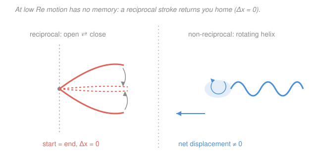

# Fluid Dynamics · Lesson 3.3: Stokes flow and low-Reynolds-number life

> ⏱ ~15 min · Module 3: Viscous flow · Builds on: [3.2 Exact solutions: Couette and Poiseuille flow](03-02-couette-poiseuille.md), [3.1 The Reynolds number](03-01-reynolds-number.md) · Unlocks: [3.4 Boundary layers and Prandtl's idea](03-04-boundary-layers.md)

## Why this matters

Everything your body knows about motion — coasting, momentum, gliding after you stop pedaling — is high-Reynolds intuition, and it is a *lie* to a bacterium. At the scale of a microbe, a pollen grain, or an oil droplet, viscosity so overwhelms inertia that the fluid forgets the past instantly: stop pushing and you stop dead, inside an atomic diameter. This is the regime of **Stokes flow** (creeping flow, $Re \ll 1$), and it is where the messy Navier–Stokes equations become *linear* — which hands us exact drag laws, a beautiful reversibility, and Purcell's famous puzzle of how anything so small manages to swim at all. It also underlies sedimentation, the Millikan oil-drop experiment, blood cell settling, and microfluidics.

## The idea

Recall the Reynolds number $Re = UL/\nu$ from [3.1](03-01-reynolds-number.md): it is the ratio of inertial forces (a parcel's reluctance to change velocity) to viscous forces (neighboring layers dragging on each other). When $Re \ll 1$, inertia is simply *irrelevant* — like trying to coast on a bicycle through cold honey. The moment you stop applying force, you stop.

Two strange things follow, both from the fact that killing inertia kills the time-derivative and the nonlinear term in Navier–Stokes, leaving a **linear, time-independent** equation:

1. **No memory (instantaneity).** The flow pattern right now depends *only* on how the boundaries are moving *right now* — not on how they moved a second ago. There is no coasting, no wake that persists, no transient.
2. **Reversibility.** Run the boundary motion backwards and the fluid retraces its path *exactly*. This is the astonishing lecture demo where a blob of dye is stirred into glycerin, seemingly mixed to a uniform grey — then the stirrer is cranked backwards and the original blob reassembles.

The punchline for anything alive down there is the **scallop theorem**: a swimmer whose stroke is *reciprocal* (looks the same played forwards and backwards, like a scallop simply opening and closing) goes *nowhere* on average. To move, a microswimmer must break time-symmetry — a corkscrewing helical flagellum, or a flexible cilium that bends differently on the return.

## The formal version

Start from the incompressible Navier–Stokes equations (from [1.6](01-06-navier-stokes.md)) for velocity field $\mathbf{u}$ (m/s), pressure $p$ (Pa), density $\rho$ (kg/m³), dynamic viscosity $\mu$ (Pa·s):

$$\rho\left(\partial_t\mathbf{u} + (\mathbf{u}\cdot\nabla)\mathbf{u}\right) = -\nabla p + \mu\nabla^2\mathbf{u}.$$

Nondimensionalize with a length $L$, speed $U$, time $L/U$, and pressure scale $\mu U/L$ (the *viscous* scaling, appropriate here). Dividing through, the inertial terms carry a factor of $Re = \rho U L/\mu$. Taking $Re \to 0$ deletes the entire left-hand side, leaving the **Stokes equations**:

$$\boxed{\,0 = -\nabla p + \mu\nabla^2\mathbf{u}, \qquad \nabla\cdot\mathbf{u} = 0.\,}$$

*In words: at every instant, the pressure gradient exactly balances viscous friction — no acceleration term survives.* Two features drive everything:

- **Linear** in $\mathbf{u}$ and $p$ (no $(\mathbf{u}\cdot\nabla)\mathbf{u}$). Superpose solutions freely; double the boundary speed and the whole field doubles.
- **No time derivative.** Time enters *only* through the boundary conditions. Hence instantaneity, and hence reversibility: negate the boundary velocities and $(\mathbf{u}, p) \to (-\mathbf{u}, -p)$ solves the same equations.

**Stokes drag.** Solving these equations for a rigid sphere of radius $a$ (m) translating at speed $U$ through unbounded fluid gives the force the fluid exerts, opposing the motion:

$$\boxed{\,F = 6\pi\mu a U.\,}$$

*In words: the drag is linear in speed and in size* — nothing like the high-Re inertial drag $F = \tfrac12\rho U^2 C_D A$ (which goes as $U^2$). You can see the *form* $F \sim \mu a U$ without the full solution: viscous stress is $\mu \times$(velocity gradient) $\sim \mu U/a$, acting over area $\sim a^2$, giving force $\sim \mu U a$. The linear solution fixes the pure number at $6\pi$.

**Terminal velocity (sedimentation).** A sphere of density $\rho_s$ settling under gravity in fluid of density $\rho_f$ reaches steady speed when Stokes drag balances weight minus buoyancy:

$$\underbrace{\tfrac{4}{3}\pi a^3(\rho_s-\rho_f)g}_{\text{net downward force}} = \underbrace{6\pi\mu a\,U_t}_{\text{Stokes drag}} \quad\Longrightarrow\quad U_t = \frac{2}{9}\frac{(\rho_s-\rho_f)g\,a^2}{\mu}.$$

*In words: bigger and denser particles settle faster ($U_t \propto a^2$), thicker fluid slows them.* This is exactly the balance Millikan tuned in the oil-drop experiment (see the [`em-refresher` syllabus](../../em-refresher/syllabus.md)).

## Picture

## Worked examples

**Example 1 (Stokes drag in action — settling honey vs. water).** A steel ball bearing, radius $a = 1$ mm, density $\rho_s = 7800$ kg/m³, sinks in glycerin ($\rho_f = 1260$ kg/m³, $\mu = 1.5$ Pa·s). Terminal speed:

$$U_t = \frac{2}{9}\frac{(7800-1260)(9.8)(10^{-3})^2}{1.5} = \frac{2}{9}\cdot\frac{6540\cdot 9.8\cdot 10^{-6}}{1.5} \approx \frac{2}{9}(0.0427) \approx 9.5\times10^{-3}\ \mathrm{m/s}.$$

About 1 cm/s — you can *watch* it fall. Check the regime: $Re = \rho_f U_t (2a)/\mu = 1260(0.0095)(0.002)/1.5 \approx 0.016 \ll 1$, so Stokes flow is self-consistent. (In water, with $\mu = 10^{-3}$, the same formula gives $U_t \sim 14$ m/s — but then $Re \sim 10^4$ and Stokes is *wildly* invalid; the ball actually falls under $U^2$ inertial drag. Always check $Re$.)

**Example 2 (why the scallop is stuck — reversibility made concrete).** Model a scallop as two rigid shells hinged at a pivot, its only move being to open (angle $\theta$ increasing) and close ($\theta$ decreasing). Because Stokes flow has no memory, the fluid displacement produced depends only on the *path in configuration space*, not the speed along it. Opening from $\theta_1$ to $\theta_2$ pushes the animal some distance $+d$; closing back from $\theta_2$ to $\theta_1$ is the *time-reverse* of opening, so by reversibility it produces exactly $-d$. Net travel over the full cycle: $+d - d = 0$. Snapping shut fast and creeping open slowly changes nothing — speed cancels out of a time-independent equation. A scallop *does* jet away in real water, but only because at its size $Re \sim 10^4$ and inertia (which it exploits) is available. Shrink it to a micron and it is trapped.

## Watch out

- **You might think swimming faster or flapping harder helps a microbe coast.** It doesn't — there is *no coasting* at low $Re$. Stop the flagellum and the cell halts within a fraction of an atomic diameter (Problem 3). Thrust must be generated continuously.
- **You might think any repetitive stroke propels you.** Only *non-reciprocal* strokes do. A single hinge (one degree of freedom) can only retrace its path, so it is doomed by the scallop theorem; you need at least two out-of-phase degrees of freedom — hence rotating helices and bending cilia.
- **You might apply $F = 6\pi\mu a U$ everywhere.** It holds only for $Re \ll 1$ (roughly $Re \lesssim 1$). Once inertia matters the drag crosses over to the $\tfrac12\rho U^2 C_D A$ law — a different physical world, covered in [3.5](03-05-separation-drag.md).

## One-liner

> Kill inertia and Navier–Stokes goes linear and timeless: drag becomes $6\pi\mu a U$, the flow becomes reversible, and a time-symmetric stroke gets you exactly nowhere.

## Problems

**P1 (🟢)** A spherical glass bead of radius $a = 20\ \mu\mathrm{m}$ and density $\rho_s = 2500$ kg/m³ settles in water ($\rho_f = 1000$ kg/m³, $\mu = 1.0\times10^{-3}$ Pa·s). Find its terminal velocity $U_t$, then compute $Re$ (based on diameter) to confirm Stokes flow applies.

**P2 (🟡)** Explain, using the scallop theorem, why a hypothetical micro-robot that swims by opening and closing a single hinge makes no net progress — and state the minimal change to its design that would let it move. Reference which property of the Stokes equations is responsible.

**P3 (🔴, optional)** *Purcell's coasting estimate.* A bacterium of radius $a = 1\ \mu\mathrm{m}$ and density $\rho \approx 1000$ kg/m³ swims at $U_0 = 30\ \mu\mathrm{m/s}$ in water ($\mu = 10^{-3}$ Pa·s), then abruptly stops beating its flagellum. Modeling deceleration by $m\,\dot v = -6\pi\mu a\,v$, find the decay time $\tau$ and the total coasting distance $U_0\tau$. Compare it to the diameter of a hydrogen atom ($\sim 0.1$ nm).

Solutions

**P1** Terminal velocity:

$$U_t = \frac{2}{9}\frac{(\rho_s-\rho_f)g\,a^2}{\mu} = \frac{2}{9}\cdot\frac{(1500)(9.8)(20\times10^{-6})^2}{10^{-3}} = \frac{2}{9}\cdot\frac{(1500)(9.8)(4\times10^{-10})}{10^{-3}}.$$

Numerator: $1500\times9.8 = 14700$; $\times 4\times10^{-10} = 5.88\times10^{-6}$; $/10^{-3} = 5.88\times10^{-3}$; $\times\tfrac{2}{9} \approx 1.3\times10^{-3}$ m/s $\approx 1.3$ mm/s.

Reynolds check with diameter $d = 2a = 40\ \mu\mathrm{m}$:

$$Re = \frac{\rho_f U_t\,d}{\mu} = \frac{(1000)(1.3\times10^{-3})(40\times10^{-6})}{10^{-3}} \approx 0.05 \ll 1. \checkmark$$

*Check.* Units of $U_t$: $\frac{(\mathrm{kg/m^3})(\mathrm{m/s^2})(\mathrm{m^2})}{\mathrm{Pa\cdot s}} = \frac{\mathrm{kg\,m^{-1}s^{-2}}}{\mathrm{kg\,m^{-1}s^{-1}}} = \mathrm{m/s}$ ✓. And $Re \ll 1$ confirms the drag law we used was legitimate — the calculation is self-consistent.

**P2** The Stokes equations $0 = -\nabla p + \mu\nabla^2\mathbf{u}$ contain **no time derivative** and are **linear**, so the flow is *kinematically reversible*: reversing the boundary motion reverses the entire flow field. A single hinge has one degree of freedom, so its stroke is a back-and-forth along one line in configuration space — closing is the exact time-reverse of opening. Reversibility then guarantees the displacement gained while opening is undone while closing, netting zero *regardless of how fast each phase is performed* (speed cancels out of a time-independent equation). This is the scallop theorem. **Minimal fix:** add a second, out-of-phase degree of freedom so the forward and return paths differ — i.e. make the stroke *non-reciprocal*. Two hinges beating out of phase, a rotating helical tail, or a flexible bending filament all suffice.

*Check.* Consistency: the fix is exactly what real microswimmers do (bacterial flagella rotate; sperm and cilia bend asymmetrically), which is the physical confirmation that one degree of freedom is genuinely insufficient.

**P3** Mass $m = \tfrac{4}{3}\pi a^3\rho = \tfrac{4}{3}\pi(10^{-6})^3(1000) \approx 4.19\times10^{-15}$ kg. The equation $m\dot v = -6\pi\mu a\,v$ gives exponential decay $v = U_0 e^{-t/\tau}$ with

$$\tau = \frac{m}{6\pi\mu a} = \frac{2}{9}\frac{\rho a^2}{\mu} = \frac{2}{9}\frac{(1000)(10^{-6})^2}{10^{-3}} = \frac{2}{9}(10^{-6}) \approx 2.2\times10^{-7}\ \mathrm{s}.$$

Total coasting distance $= \int_0^\infty v\,dt = U_0\tau = (30\times10^{-6})(2.2\times10^{-7}) \approx 6.7\times10^{-12}\ \mathrm{m} = 6.7$ pm.

That is about $0.07$ of a hydrogen-atom diameter — the bacterium coasts *less than one atom's width*. Purcell's point exactly: at low $Re$, coasting is not a slow glide, it is *instantaneous* stopping.

*Check.* $\tau$ has units $\frac{(\mathrm{kg/m^3})(\mathrm{m^2})}{\mathrm{Pa\cdot s}} = \frac{\mathrm{kg\,m^{-1}}}{\mathrm{kg\,m^{-1}s^{-1}}} = \mathrm{s}$ ✓. The absurdly tiny distance is the whole message — memory of past motion is erased essentially instantly.

## Flashback

**From Lesson 3.2 (Couette flow):** Plane Couette flow fills the gap between two flat plates separated by $h = 2$ mm. The top plate slides at $U = 0.5$ m/s while the bottom is fixed; the fluid has viscosity $\mu = 0.1$ Pa·s. Write the velocity profile $u(y)$ and find the shear stress the fluid exerts on each plate.

Solution

With no pressure gradient, the steady Couette solution is a *linear* profile satisfying no-slip at both walls:

$$u(y) = U\frac{y}{h}, \qquad 0 \le y \le h.$$

The shear stress is $\tau = \mu\,\dfrac{du}{dy} = \mu\dfrac{U}{h}$, constant across the gap:

$$\tau = (0.1)\frac{0.5}{0.002} = 25\ \mathrm{Pa}.$$

*Check.* Units: $\mathrm{(Pa\cdot s)(m/s)/m = Pa}$ ✓. A linear profile means constant velocity gradient, hence a single uniform shear stress everywhere — the same $\tau$ drags forward on the moving plate and back on the fixed one. This is the same $\mu\nabla^2\mathbf{u}$ viscous physics that, with inertia dropped entirely, becomes the Stokes equations of this lesson.

## Connections

- **Backward:** this is the $Re \ll 1$ limit of the same Navier–Stokes equations from [1.6](01-06-navier-stokes.md); the Reynolds number of [3.1](03-01-reynolds-number.md) is the exact knob that turns the nonlinear equations into the linear Stokes equations, and the viscous term is the $\mu\nabla^2\mathbf{u}$ friction that also drove [3.2](03-02-couette-poiseuille.md)'s exact solutions.
- **Forward:** [3.4 Boundary layers](03-04-boundary-layers.md) handles the opposite, high-$Re$ world where viscosity is confined to a thin wall layer of thickness $\delta\sim\sqrt{\nu x/U}$ — and [3.5](03-05-separation-drag.md) explains the $U^2$ inertial drag that *replaces* $6\pi\mu a U$ once inertia dominates.
- **Sideways:** the reversibility of Stokes flow is a genuine **time-reversal symmetry** — deleting the time derivative makes the dynamics indifferent to the arrow of time, the same structural idea studied in [`dynamical-systems`](../../dynamical-systems/syllabus.md). And the sedimentation balance here is precisely the force balance behind Millikan's oil-drop measurement of the electron charge in the [`em-refresher` syllabus](../../em-refresher/syllabus.md).
