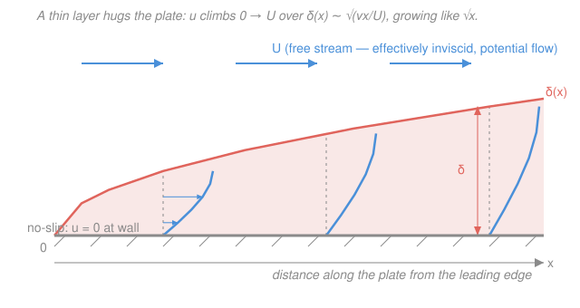

# Fluid Dynamics · Lesson 3.4: Boundary layers and Prandtl's idea

> ⏱ ~15 min · Module 3: Viscous flow · Builds on: [3.3 Stokes flow and low-Reynolds-number life](03-03-stokes-flow.md), [3.1 The Reynolds number](03-01-reynolds-number.md) · Unlocks: [3.5 Separation and drag](03-05-separation-drag.md)

## Why this matters

Here is a scandal that stalled fluid dynamics for a century. At high Reynolds number the viscous term in Navier–Stokes is *tiny* — so drop it, solve the elegant inviscid theory of Module 2, and you get beautiful streamlines past a wing… that predict **zero drag** (d'Alembert's paradox) and let the fluid *slide* along the surface. But real air sticks to a real wing: the **no-slip condition** demands $\mathbf{u}=0$ at the wall. A vanishingly small coefficient ($\nu$) multiplies the *highest derivative* in the equation, so you cannot simply throw it away — that term is the only one that can enforce no-slip. In 1904 Ludwig Prandtl resolved this in a ten-minute conference talk that founded modern aerodynamics: viscosity is negligible *everywhere except* a paper-thin layer glued to the surface. Understand that layer and you understand drag, lift, stall, and where every real flow gets its vorticity.

## The idea

Picture wind streaming at speed $U$ over a flat plate. Far from the plate the fluid barely notices it's there — it flows as if inviscid, exactly the potential flow of Module 2. But the fluid molecules *touching* the plate are stuck to it (no-slip): their speed is zero. So somewhere between "zero at the wall" and "$U$ out in the stream" the velocity has to climb. Prandtl's insight: that climb happens over a **very thin** vertical distance $\delta$, the **boundary layer**. Inside it, the velocity shears steeply and viscosity rules. Outside it, the flow is the clean inviscid solution.

Why thin? Think of it as a race between two effects, both acting as fluid drifts downstream. **Viscous diffusion** carries the "I'm being slowed by the wall" information *upward*, away from the plate — and it spreads exactly like heat, reaching a height $\sim\sqrt{\nu t}$ after time $t$. Meanwhile **advection** sweeps each parcel *downstream* at speed $\sim U$, so a parcel that has travelled a distance $x$ has only had time $t\sim x/U$ to feel the wall. Plug that clock into the diffusion spread:

$$\delta \sim \sqrt{\nu t} \sim \sqrt{\nu\,\frac{x}{U}}.$$

The drag of the wall diffuses *up* while the flow rushes *past*; the layer is thin precisely because the flow is fast (large $U$) or the fluid is slippery (small $\nu$). And it **grows like $\sqrt{x}$**: the layer thickens the farther downstream you go, a wedge widening along the plate.

## The formal version

**The boundary-layer scaling.** Inside the layer, streamwise advection must balance cross-stream viscous diffusion. Estimate each term of the momentum equation by "one factor of the derivative $\approx$ the whole quantity over its length scale":

$$\underbrace{u\,\partial_x u}_{\text{advection}} \sim \frac{U^2}{L} \qquad\text{vs.}\qquad \underbrace{\nu\,\partial_y^2 u}_{\text{viscous diffusion}} \sim \frac{\nu U}{\delta^2},$$

where $x$ (streamwise) varies over the body length $L$, while $y$ (wall-normal) varies over the thin scale $\delta$. Here $u$ is the streamwise velocity, $U$ the free-stream speed, and $\nu=\mu/\rho$ the kinematic viscosity (m²/s), with $\mu$ the dynamic viscosity and $\rho$ the density. Balancing:

$$\frac{U^2}{L} \sim \frac{\nu U}{\delta^2} \quad\Longrightarrow\quad \boxed{\ \frac{\delta}{L} \sim \frac{1}{\sqrt{Re}}, \qquad \delta(x) \sim \sqrt{\frac{\nu x}{U}}\ }$$

with $Re=UL/\nu$ the Reynolds number from [3.1](03-01-reynolds-number.md). *In words: the boundary layer's thickness relative to the body is one over the square root of the Reynolds number — so at high $Re$ the layer is very thin, and it thickens as $\sqrt{x}$ downstream.*

**Wall shear stress.** All the velocity change $U$ is squeezed into the thickness $\delta$, so the velocity gradient at the wall is steep, $\partial_y u|_{0}\sim U/\delta$, and the friction the fluid exerts on the plate is

$$\tau_w = \mu\left.\frac{\partial u}{\partial y}\right|_{y=0} \sim \frac{\mu U}{\delta} \sim \mu U\sqrt{\frac{U}{\nu x}} = \rho\,\sqrt{\frac{\nu}{x}}\;U^{3/2}\cdot(\text{const}).$$

*In words: skin friction scales as $\mu U/\delta$ — strongest right at the leading edge (small $x$, thinnest layer) and falling off like $x^{-1/2}$ downstream.* Integrating $\tau_w$ over the plate gives the **skin-friction drag**; because $\int_0^L x^{-1/2}\,dx = 2\sqrt{L}$, the drag per unit width grows like $\sqrt{L}$, not linearly.

**The Blasius solution (the exact result — sketched).** For a flat plate the full boundary-layer equations admit a *self-similar* solution: the velocity profiles at every $x$ collapse onto **one curve** when you plot $u/U$ against the similarity variable

$$\eta = y\sqrt{\frac{U}{\nu x}},$$

which is just $y/\delta$ in disguise. Writing $u/U = f'(\eta)$ reduces the boundary-layer PDE to a single ordinary differential equation (Blasius, 1908):

$$f''' + \tfrac12\,f\,f'' = 0, \qquad f(0)=f'(0)=0,\ \ f'(\infty)=1.$$

*In words: because the layer just rescales as it grows, the two-variable flow problem collapses to one universal profile shape $f'(\eta)$.* Solving it numerically pins down the constants the scaling argument couldn't: the 99%-thickness is $\delta_{99}\approx 5.0\sqrt{\nu x/U}$ and the wall stress is $\tau_w = 0.332\,\rho U^2/\sqrt{Re_x}$, giving the drag coefficient $C_f = 1.328/\sqrt{Re_L}$. The similarity trick — a PDE collapsing to an ODE via $\eta=y/\sqrt{\nu x/U}$ — is the *same move* used to solve the heat equation in [`pdes` 2.1](../../pdes/lessons/02-01-heat-diffusion-equations.md); it is no accident, because $\delta\sim\sqrt{\nu t}$ *is* the diffusion length.

**Where vorticity is born.** The steep shear $\partial_y u$ means the boundary layer is packed with vorticity $\boldsymbol\omega=\nabla\times\mathbf{u}$: the wall is a *source* of vorticity, continuously generated by no-slip and then diffused and swept downstream. This quietly rescues the inviscid theorems of Module 2 — Kelvin's circulation theorem and the "irrotational flow stays irrotational" results assumed no viscosity. Real flows are *not* globally irrotational; the boundary layer is the thin factory where the wall injects the vorticity that inviscid theory has no way to make.

## Picture

## Worked examples

**Example 1 (how thin is thin?).** Air ($\nu \approx 1.5\times10^{-5}\ \mathrm{m^2/s}$) flows at $U=50\ \mathrm{m/s}$ over a flat plate. How thick is the boundary layer $x=0.5\ \mathrm{m}$ back from the leading edge? Using $\delta\approx 5\sqrt{\nu x/U}$:

$$\frac{\nu x}{U} = \frac{(1.5\times10^{-5})(0.5)}{50} = 1.5\times10^{-7}\ \mathrm{m^2}, \qquad \delta \approx 5\sqrt{1.5\times10^{-7}} \approx 5\times(3.9\times10^{-4}) \approx 1.9\ \mathrm{mm}.$$

Half a meter of plate, and the whole velocity transition is packed into under two millimeters. Check the regime: $Re_x = Ux/\nu = 50\times0.5/1.5\times10^{-5} = 1.7\times10^{6}$ — high enough that the layer would in reality be turbulent, but the point stands: $\delta/x \sim 1/\sqrt{Re_x}\sim 10^{-3}$, tiny. That is why inviscid theory works for the *outer* flow.

**Example 2 (friction falls off downstream).** On the same plate, compare the wall shear at $x=0.1\ \mathrm{m}$ and $x=0.9\ \mathrm{m}$. Since $\tau_w\propto x^{-1/2}$,

$$\frac{\tau_w(0.9)}{\tau_w(0.1)} = \left(\frac{0.1}{0.9}\right)^{1/2} = \frac{1}{3}.$$

The leading edge feels three times the friction of the trailing region: the layer is thinnest there, so the velocity gradient — and the drag per unit area — is sharpest right where the flow first meets the plate. This is why the total drag grows only as $\sqrt{L}$: each extra bit of plate contributes less.

## Watch out

- **You might think "high $Re$ means viscosity is negligible, period."** It is negligible in the *bulk*, but never in the boundary layer — that thin region is exactly where the neglected term matters, because it multiplies the largest derivative. Dropping viscosity globally is the mistake that produces d'Alembert's zero-drag paradox.
- **You might read $\delta\sim\sqrt{\nu x/U}$ as "the layer grows in time."** It grows in *downstream distance $x$*, for a steady flow. The $\sqrt{\nu t}$ diffusion analogy uses the *convective clock* $t\sim x/U$ — a parcel's age since it passed the leading edge — not wall-clock time.
- **You might expect thicker boundary layers to mean more drag.** The opposite: $\tau_w\sim\mu U/\delta$, so a *thinner* layer (higher $U$, downstream-close, higher $Re$) shears harder and produces *more* skin friction per unit area. Thickness and stress trade off inversely.

## One-liner

> Viscosity can't be ignored at the wall no matter how large $Re$ is, so it retreats into a layer of thickness $\delta\sim\sqrt{\nu x/U}\sim L/\sqrt{Re}$ — thin, $\sqrt{x}$-growing, vorticity-making, and the true home of skin-friction drag.

## Problems

**P1 (🟢)** Water ($\nu\approx1.0\times10^{-6}\ \mathrm{m^2/s}$) flows at $U=2\ \mathrm{m/s}$ along a flat plate. Estimate the boundary-layer thickness $\delta$ at $x=0.2\ \mathrm{m}$ using $\delta\approx5\sqrt{\nu x/U}$, and check whether the flow is still laminar (transition near $Re_x\approx5\times10^{5}$).

**P2 (🟡)** For the *same* free-stream speed $U$ and the *same* distance $x$, compare the boundary-layer thickness in air ($\nu_{\text{air}}\approx1.5\times10^{-5}\ \mathrm{m^2/s}$) versus water ($\nu_{\text{water}}\approx1.0\times10^{-6}\ \mathrm{m^2/s}$). Which is thicker, and by what factor?

**P3 (🔴, optional)** Show from $\tau_w\sim\mu U/\delta$ with $\delta\sim\sqrt{\nu x/U}$ that the wall shear scales as $\tau_w\propto x^{-1/2}$, and hence that the total skin-friction drag on a plate of length $L$ (per unit width), $D=\int_0^L\tau_w\,dx$, scales as $D\propto\sqrt{L}$. Then explain in one sentence why doubling the plate length does *not* double the friction drag.

Solutions

**P1** Compute the diffusion group:

$$\frac{\nu x}{U} = \frac{(1.0\times10^{-6})(0.2)}{2} = 1.0\times10^{-7}\ \mathrm{m^2}, \qquad \delta \approx 5\sqrt{1.0\times10^{-7}} = 5\times(3.16\times10^{-4}) \approx 1.6\times10^{-3}\ \mathrm{m} \approx 1.6\ \mathrm{mm}.$$

Regime check: $Re_x = Ux/\nu = (2)(0.2)/10^{-6} = 4\times10^{5} < 5\times10^{5}$, so the layer is (just) still laminar. ✓

*Check.* Units: $\sqrt{(\mathrm{m^2/s})\cdot\mathrm{m}/(\mathrm{m/s})} = \sqrt{\mathrm{m^2}} = \mathrm{m}$ ✓. And $\delta/x = 1.6\times10^{-3}/0.2 = 8\times10^{-3}\approx 5/\sqrt{Re_x} = 5/632 = 7.9\times10^{-3}$ ✓ — the $1/\sqrt{Re}$ thinness holds.

**P2** Since $\delta\sim\sqrt{\nu x/U}$ with $U,x$ fixed, $\delta\propto\sqrt{\nu}$. The ratio is

$$\frac{\delta_{\text{air}}}{\delta_{\text{water}}} = \sqrt{\frac{\nu_{\text{air}}}{\nu_{\text{water}}}} = \sqrt{\frac{1.5\times10^{-5}}{1.0\times10^{-6}}} = \sqrt{15} \approx 3.9.$$

**Air's boundary layer is about 3.9× thicker** than water's at the same speed and station. *In words: air is the "stickier" fluid kinematically — its larger $\nu$ diffuses the wall's influence farther out.*

*Check.* Air has the larger kinematic viscosity, so its layer should be thicker — consistent. Dimensionless ratio, as it must be. ✓ (Counterintuitive next to the fact that water is "thicker" in everyday speech — but what governs $\delta$ is $\nu=\mu/\rho$, and water's much higher density wins.)

**P3** Substitute the thickness scaling into the stress scaling:

$$\tau_w \sim \frac{\mu U}{\delta} \sim \frac{\mu U}{\sqrt{\nu x/U}} = \mu U^{3/2}\,\nu^{-1/2}\,x^{-1/2} \;\propto\; x^{-1/2}.$$

Integrate over the plate (per unit width), pulling out the $x$-independent constants as $C$:

$$D = \int_0^L \tau_w\,dx = C\int_0^L x^{-1/2}\,dx = C\left[2x^{1/2}\right]_0^L = 2C\sqrt{L} \;\propto\; \sqrt{L}.$$

Doubling $L$ multiplies the drag by only $\sqrt{2}\approx1.41$, not 2: the extra length lies where the layer is already thick and the friction $\tau_w\propto x^{-1/2}$ has faded, so each added segment contributes progressively less.

*Check.* Dimensions: $\tau_w\sim\mu U/\delta$ has units $(\mathrm{Pa\,s})(\mathrm{m/s})/\mathrm{m} = \mathrm{Pa}$ ✓ (a stress); $D=\int\tau_w\,dx$ per unit width has units $\mathrm{Pa\cdot m} = \mathrm{N/m}$ ✓ (force per unit span). This is the same $x^{-1/2}$ / $\sqrt{L}$ law behind Blasius's exact $C_f=1.328/\sqrt{Re_L}$.

## Flashback

**From Lesson 3.3 (Stokes flow):** A spherical bacterium of radius $a=1\ \mu\mathrm{m}$ swims at $U=30\ \mu\mathrm{m/s}$ through water ($\mu=1.0\times10^{-3}\ \mathrm{Pa\,s}$, $\rho=10^{3}\ \mathrm{kg/m^3}$). Using the Stokes drag law $F=6\pi\mu a U$, find the drag force it must overcome, and confirm it lives at low Reynolds number.

Solution

Stokes drag:

$$F = 6\pi\mu a U = 6\pi(1.0\times10^{-3})(1.0\times10^{-6})(30\times10^{-6}) = 6\pi\times3.0\times10^{-14} \approx 5.7\times10^{-13}\ \mathrm{N}.$$

Reynolds number:

$$Re = \frac{\rho U a}{\mu} = \frac{(10^{3})(30\times10^{-6})(1.0\times10^{-6})}{1.0\times10^{-3}} = 3\times10^{-5} \ll 1.$$

So inertia is utterly negligible and creeping-flow (Stokes) theory applies — the microbe swims in a world of pure viscosity, exactly the regime where the boundary-layer picture of *this* lesson does **not** apply (there is no thin layer; viscosity fills all of space).

*Check.* $F$ in newtons: $(\mathrm{Pa\,s})(\mathrm{m})(\mathrm{m/s}) = \mathrm{Pa\,m^2} = \mathrm{N}$ ✓. A sub-piconewton force on a micron-scale swimmer, and $Re\sim10^{-5}$, both sane for microbial life. ✓

## Connections

- **Backward:** this is the high-$Re$ bookend to [3.3 Stokes flow](03-03-stokes-flow.md)'s low-$Re$ world. There viscosity filled everything; here it is banished to a layer of relative thickness $1/\sqrt{Re}$ (the same $Re=UL/\nu$ from [3.1](03-01-reynolds-number.md)). The boundary layer is also what finally reconciles the inviscid Module 2 flow with the no-slip wall it ignored.
- **Forward:** [3.5 Separation and drag](03-05-separation-drag.md) shows what happens when the boundary layer meets an *adverse* pressure gradient (pressure rising downstream): it can detach from the surface, throwing the outer flow off the body, creating a wake and pressure (form) drag — the mechanism behind stall and the drag crisis. Everything there is a boundary layer misbehaving.
- **Sideways (`pdes`):** the thickness law $\delta\sim\sqrt{\nu x/U}$ is the **diffusion length** $\sqrt{\nu t}$ of the heat/diffusion equation in [`pdes` 2.1](../../pdes/lessons/02-01-heat-diffusion-equations.md), with the convective clock $t\sim x/U$; and the Blasius similarity variable $\eta=y\sqrt{U/\nu x}$ is the very same self-similar collapse ($\eta\sim y/\sqrt{\nu t}$) that solves the heat equation — a PDE reduced to an ODE by scaling.
