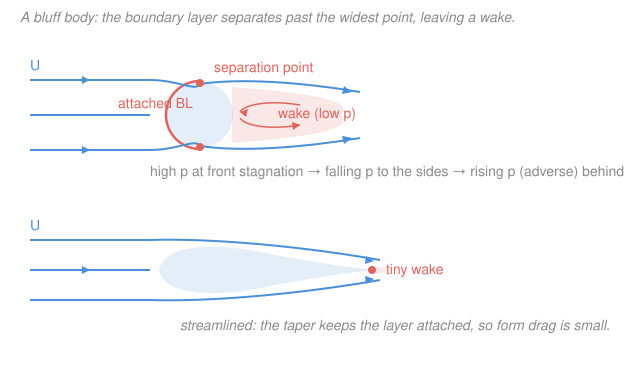

# Fluid Dynamics · Lesson 3.5: Separation and drag

> ⏱ ~15 min · Module 3: Viscous flow · Builds on: [3.4 Boundary layers and Prandtl's idea](03-04-boundary-layers.md), [3.1 The Reynolds number](03-01-reynolds-number.md) · Unlocks: [4.1 Surface gravity and capillary waves](04-01-surface-waves.md)

## Why this matters

Ideal-flow theory made an embarrassing prediction: a body moving steadily through a fluid feels **zero drag** (d'Alembert's paradox, Lesson 2.6). Yet every cyclist, airliner, and falling raindrop knows better. The missing ingredient is the thin viscous **boundary layer** of Lesson 3.4 — and specifically what happens when it lets go of the surface. That single event, **separation**, is why bluff bodies leave turbulent wakes, why a teardrop slips through the air a sphere cannot, and why a golf ball is covered in dimples. This lesson closes Module 3 by turning the boundary-layer picture into the drag you actually measure.

## The idea

Picture flow approaching the front of a cylinder. It piles up at the nose (**stagnation point**, high pressure), then races around the sides where the passage narrows and the flow speeds up — by Bernoulli in the outer stream, faster flow means *falling* pressure. So far the near-wall fluid is being pushed *downstream* by a helpful (favorable) pressure drop. But past the widest point the body curves away, the outer flow slows down again, and pressure starts *rising* toward the rear. Now the near-wall fluid faces an **adverse pressure gradient**: it is being pushed *backward*.

Out in the fast outer flow that back-pressure is a minor tax. But deep in the boundary layer the fluid is already crawling — friction at the wall (Lesson 3.4) has bled away its momentum. It has nothing left to climb the pressure hill. So it stops, then reverses. The forward stream, riding over this stagnant reversed pocket, peels away from the surface: the boundary layer **separates**. Downstream of the separation point sits a broad, slow, low-pressure **wake** of recirculating fluid.

That broken symmetry is the whole story of drag. Ideal flow had high pressure at the front *and* high pressure recovered at the back — the two cancelled, giving zero net force. Separation destroys the rear recovery: high pressure pushes on the front, low wake pressure fails to push back, and the body feels a net downstream **pressure (form) drag**. The paradox is resolved not by viscosity's direct friction alone, but by the *wake* that viscosity's boundary layer creates.

## The formal version

**Two kinds of drag.** The fluid touches a body only two ways: it presses on it (pressure $p$, normal) and it drags along it (wall shear stress $\tau_w$, tangential). Splitting the total drag force $D$ by these gives

$$D = \underbrace{\oint p\,(\hat{\mathbf n}\cdot\hat{\mathbf x})\,dA}_{\text{form / pressure drag}} \;+\; \underbrace{\oint \tau_w\,(\hat{\mathbf t}\cdot\hat{\mathbf x})\,dA}_{\text{skin-friction drag}},$$

where $\hat{\mathbf x}$ is the streamwise direction, $\hat{\mathbf n}$ the outward surface normal, $\hat{\mathbf t}$ the surface tangent, and $\tau_w = \mu\,(\partial u/\partial y)|_{\text{wall}}$ the wall shear ($\mu$ the dynamic viscosity, $u$ the streamwise velocity, $y$ the wall-normal distance). *In words: drag is the streamwise part of the pressure pushing on the body plus the streamwise part of the friction scraping along it.* For a **streamlined** body (thin, gently tapered) the flow stays attached, the wake is tiny, and skin friction dominates. For a **bluff** body (sphere, cylinder, brick) separation makes a fat wake, and form drag dominates — often by a factor of ten or more.

**The separation point** is where the wall shear vanishes and is about to reverse:

$$\left.\frac{\partial u}{\partial y}\right|_{\text{wall}} = 0 \quad\Longrightarrow\quad \text{separation.}$$

*In words: at separation the velocity profile has zero slope at the wall — the fluid right next to the surface is neither moving forward nor back — and just downstream it reverses.* Separation requires **both** ingredients: a boundary layer (so there is slow, momentum-starved near-wall fluid) *and* an adverse pressure gradient $\partial p/\partial x > 0$ (to stop and reverse it). No adverse gradient, no separation — which is why favorable-gradient regions (accelerating flow, the front of any body) never separate.

**The drag coefficient.** Drag scales with the dynamic pressure $\tfrac12\rho U^2$ times a frontal area $A$, packaged into a dimensionless number:

$$\boxed{\,C_D = \dfrac{D}{\tfrac12\,\rho\,U^2\,A}\,}$$

with $\rho$ the fluid density, $U$ the free-stream speed, and $A$ the frontal (projected) area. *In words: $C_D$ is the drag you get compared to the "ram pressure" $\tfrac12\rho U^2$ acting on the body's silhouette.* By dynamical similarity (Lesson 3.1), $C_D$ depends only on shape and Reynolds number $Re = UL/\nu$. A streamlined strut has $C_D \sim 0.05$; a sphere sits near $0.47$; a flat plate facing the flow is about $1.2$.

**The drag crisis.** Follow a smooth sphere as $Re$ climbs. Its $C_D$ hovers near $0.47$ for a wide range — then, near $Re \approx 3\times10^5$, it suddenly *drops* to about $0.1$. The cause is counterintuitive: the boundary layer itself goes **turbulent** before it separates. A turbulent boundary layer mixes fast outer fluid down toward the wall, refuelling the near-wall momentum, so it resists the adverse gradient *longer*. Separation moves rearward, the wake narrows, form drag collapses. *In words: making the boundary layer messier makes the wake smaller, and a small wake is what matters.* This is the entire logic of **golf-ball dimples**: they trip the boundary layer turbulent at a much lower $Re$ (~$4\times10^4$), triggering the drag crisis early so a driven ball — which would otherwise be safely subcritical and draggy — flies in the low-drag regime and carries far longer.

## Picture

## Worked examples

**Example 1 (mechanical — drag from $C_D$).** A car has frontal area $A = 2.2\ \mathrm{m^2}$, drag coefficient $C_D = 0.30$, cruising at $U = 30\ \mathrm{m/s}$ (≈108 km/h) in air, $\rho = 1.2\ \mathrm{kg/m^3}$. The drag force is

$$D = C_D\cdot\tfrac12\rho U^2 A = 0.30 \times \tfrac12 \times 1.2 \times 30^2 \times 2.2 \approx 356\ \mathrm{N},$$

and the power just to push the air aside is $P = DU = 356\times 30 \approx 10.7\ \mathrm{kW}$. Note the $U^2$ in $D$ (and hence $U^3$ in $P$): drive 20% faster and you burn ~73% more power fighting drag. Most of that 356 N is *form* drag from the wake behind the car, which is why aerodynamicists obsess over the rear.

**Example 2 (why you'd care — streamlining beats a sphere).** A cylinder and a streamlined strut can have the *same* $C_D$ while differing enormously in size. Take a bluff cylinder, $C_D \approx 1.2$. A well-designed streamlined fairing of the *same frontal thickness* has $C_D \approx 0.1$ — twelve times less drag, because it holds the boundary layer attached almost to its tail and leaves almost no wake. Equivalently, a fairing can be **ten times thicker** than a wire and still cause the same drag. This is why struts, wings, and fish are teardrop-shaped: not to cut skin friction (a teardrop has *more* wetted area) but to kill the wake. The trade is real — streamlining adds surface, so skin friction rises — but for anything above creeping speeds, slashing form drag wins overwhelmingly.

## Watch out

- **You might think viscosity causes drag mainly by friction.** For a bluff body it barely does directly — form drag from the separated wake usually dwarfs skin friction. Viscosity's decisive role is *indirect*: it creates the slow boundary layer that separates. Kill separation and you kill most of the drag without changing the viscosity at all.
- **You might think a turbulent boundary layer always means more drag.** In the drag crisis it means *less* total drag: turbulent mixing delays separation, shrinks the wake, and the form-drag saving swamps the modest rise in skin friction. Dimples exploit exactly this. (On a *streamlined* body, where there is little wake to save, tripping turbulence just adds friction — so the trick is specific to bluff bodies.)
- **You might expect separation wherever the wall curves.** It happens only where the pressure gradient is *adverse* ($\partial p/\partial x > 0$), i.e. where the outer flow is decelerating — the rear of a body, past its widest point. On the front, the flow accelerates (favorable gradient) and the boundary layer stays firmly attached no matter how sharp the curvature.

## One-liner

> Drag is the price of a wake: an adverse pressure gradient peels the momentum-starved boundary layer off the surface, and the low-pressure separated region — not friction — is what a bluff body mostly feels.

## Problems

**P1 (🟢)** A cyclist plus bike presents a frontal area $A = 0.5\ \mathrm{m^2}$ with $C_D = 0.9$, riding at $U = 12\ \mathrm{m/s}$ in air ($\rho = 1.2\ \mathrm{kg/m^3}$). Find the aerodynamic drag force and the power needed to overcome it.

**P2 (🟡)** Flow approaches a long cylinder from the left. Using the outer (near-ideal) flow, argue where along the surface the pressure gradient switches from favorable to adverse, and therefore roughly where the boundary layer separates. Why does the separation sit *ahead* of the very back of the cylinder rather than at the rear stagnation point ideal theory predicts?

**P3 (🔴)** A golf ball and an equal-sized smooth sphere are hit at the same speed, in the regime where the smooth sphere is subcritical ($C_D \approx 0.5$) but the dimples have already triggered the drag crisis on the golf ball ($C_D \approx 0.25$). (a) By what factor is the golf ball's drag smaller? (b) Explain the mechanism in terms of the boundary layer and the wake. (c) Why would the same dimples do little good on a streamlined airfoil?

Solutions

**P1** Direct application of $D = C_D\cdot\tfrac12\rho U^2 A$:

$$D = 0.9 \times \tfrac12 \times 1.2 \times 12^2 \times 0.5 = 0.9 \times 0.5 \times 1.2 \times 144 \times 0.5 \approx 38.9\ \mathrm{N}.$$

Power: $P = DU = 38.9 \times 12 \approx 467\ \mathrm{W}$.

*Check.* Units: $C_D$ is dimensionless, so $[D] = (\mathrm{kg/m^3})(\mathrm{m/s})^2(\mathrm{m^2}) = \mathrm{kg\,m/s^2} = \mathrm N$ ✓, and $[P] = \mathrm{N}\cdot\mathrm{m/s} = \mathrm W$ ✓. Sanity: ~0.5 kW is right in the range a trained cyclist sustains, and a cyclist is a bluff body ($C_D\sim0.9$), so this is nearly all form drag from the wake behind the rider.

**P2** In the outer flow, apply Bernoulli, $p + \tfrac12\rho U_{\text{outer}}^2 = \text{const}$: pressure falls where the flow speeds up and rises where it slows. Starting at the front stagnation point ($U_{\text{outer}}=0$, pressure maximum), the flow **accelerates** around the front face, reaching maximum speed and minimum pressure at the **widest point** (the "shoulder", ~90° from the nose). So on the front half $\partial p/\partial x < 0$: **favorable**, boundary layer safely attached. Past the shoulder the flow **decelerates** toward the rear, so $\partial p/\partial x > 0$: **adverse**. The boundary layer, already drained of momentum by wall friction, cannot climb this rising pressure and separates shortly *after* the shoulder (for a laminar layer, near ~80–85° from the nose). It cannot reach the rear stagnation point ideal theory assumes, because ideal theory ignores the boundary layer entirely — it lets the (inviscid) flow coast up the whole pressure hill and recover its front pressure at the back, giving the fictitious zero-drag symmetry. Real near-wall fluid runs out of momentum first, so separation happens early and the rear pressure never recovers.

*Check.* Consistency with the drag crisis: a *turbulent* boundary layer carries more near-wall momentum and separates later — near ~120° instead of ~80° — exactly the rearward shift that shrinks the wake and drops $C_D$. Same physics, later separation.

**P3** (a) Same $\rho$, $U$, $A$, so $D \propto C_D$. Ratio $= 0.25/0.5 = 0.5$: the golf ball's drag is **half** that of the smooth sphere.

(b) The dimples trip the boundary layer **turbulent** while it is still attached on the front of the ball. A turbulent boundary layer mixes fast free-stream fluid down toward the wall, replenishing the near-wall momentum, so it withstands the adverse pressure gradient on the rear longer before separating. Separation moves rearward, the **wake narrows**, and form drag — the dominant term for a bluff sphere — falls sharply. That is the drag crisis, deliberately triggered early.

(c) A streamlined airfoil is designed so the flow stays attached almost to its trailing edge already: its wake is tiny and its drag is mostly **skin friction**, not form drag. There is essentially no wake to shrink, so tripping the boundary layer turbulent buys no form-drag saving — it only *raises* skin friction (turbulent layers scrape harder at the wall). Net effect: more drag, not less. Dimples help only bodies whose drag is wake-dominated.

*Check.* Limiting logic: the trick works precisely when form drag $\gg$ skin friction (bluff bodies) and backfires when skin friction $\gg$ form drag (streamlined bodies) — a clean dividing line that matches why nature dimples nothing that is already streamlined.

## Flashback

**From Lesson 3.4 (Boundary layers):** Air ($\nu = 1.5\times10^{-5}\ \mathrm{m^2/s}$) flows at $U = 10\ \mathrm{m/s}$ over a flat plate. Using Prandtl's scaling $\delta \sim \sqrt{\nu x/U}$, estimate the boundary-layer thickness a distance $x = 0.5\ \mathrm m$ from the leading edge, and confirm it is thin compared with $x$.

Solution

$$\delta \sim \sqrt{\frac{\nu x}{U}} = \sqrt{\frac{(1.5\times10^{-5})(0.5)}{10}} = \sqrt{7.5\times10^{-7}} \approx 8.7\times10^{-4}\ \mathrm m \approx 0.87\ \mathrm{mm}.$$

Compared with $x = 0.5\ \mathrm m = 500\ \mathrm{mm}$, the layer is under $0.2\%$ of the distance — genuinely thin, which is the assumption that makes Prandtl's boundary-layer approximation valid.

*Check.* Units: $\sqrt{(\mathrm{m^2/s})(\mathrm m)/(\mathrm{m/s})} = \sqrt{\mathrm{m^2}} = \mathrm m$ ✓. Equivalently $\delta/x \sim 1/\sqrt{Re_x}$ with $Re_x = Ux/\nu = (10)(0.5)/(1.5\times10^{-5}) \approx 3.3\times10^5$, giving $\delta/x \sim 1.7\times10^{-3}$ ✓ — thin because $Re_x$ is large.

## Connections

- **Backward:** separation is impossible without the [boundary layer (3.4)](03-04-boundary-layers.md) — its slow, no-slip near-wall fluid is what the adverse pressure gradient reverses. And the pressure gradient itself is read off the *outer* inviscid flow (Lesson 2.6, flow past a cylinder), so this lesson stitches Prandtl's two regions together and finally resolves d'Alembert's zero-drag paradox by breaking the fore–aft symmetry.
- **Forward:** whether a body separates and how big its wake is depends on $Re$ through the [drag crisis](03-01-reynolds-number.md); Module 4 picks up the *wake itself* — the separated shear layers are unstable (Kelvin–Helmholtz, [4.3](../syllabus.md)) and roll up into the vortex street that ultimately feeds the [transition to turbulence (4.4)](../syllabus.md).
- **Sideways (dynamical systems):** the drag crisis is a shape change triggered by crossing a critical parameter ($Re \approx 3\times10^5$) — the same flavor of threshold-crossing bifurcation studied in [`dynamical-systems`](../../dynamical-systems/syllabus.md), where a small change in a control parameter reorganizes the whole flow.
