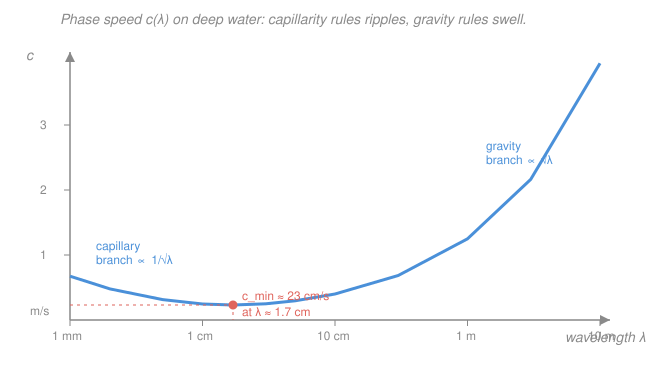

# Fluid Dynamics · Lesson 4.1: Surface gravity and capillary waves

> ⏱ ~15 min · Module 4: Waves, instability, and turbulence · Builds on: [3.5 Separation and drag](03-05-separation-drag.md), [2.4 Irrotational flow and the velocity potential](02-04-irrotational-flow-velocity-potential.md) · Unlocks: [4.2 Sound waves](04-02-sound-waves.md)

## Why this matters

Every wave you have ever watched roll toward a beach is the free surface of a fluid obeying the equations of the last three modules. The remarkable thing is that we can predict how fast each wave moves — and the answer depends on its wavelength. Long ocean swells outrun short chop; a tsunami crosses the Pacific at jetliner speed yet rears up only at the shore; the tiny ripples a breeze raises have a *minimum* possible speed of about 23 cm/s. All of this falls out of one calculation: solve Laplace's equation in the water with the right conditions at the surface. This is also our first **dispersion relation** — the master link between a wave's wavelength and its frequency — a tool you will reuse for sound ([4.2](04-02-sound-waves.md)), light, and quantum matter.

## The idea

Poke a still pond and the surface heaves up, then gravity pulls it back down — but water is nearly incompressible, so the dip it leaves shoves neighbouring fluid up, and the bulge travels outward. A surface wave is that restoring tug (gravity, plus surface tension for the smallest wrinkles) fighting the fluid's inertia, passed sideways from parcel to parcel.

Two moves make it tractable. First, if the water starts at rest and viscosity is weak, the flow is **irrotational** — no spin — so from [2.4](02-04-irrotational-flow-velocity-potential.md) the whole velocity field is the gradient of a single scalar potential $\phi$ obeying $\nabla^2\phi = 0$. Second, if the ripples are *small* — height much less than wavelength — we can **linearize**: throw away everything quadratic in the wave amplitude. What is left is a clean, solvable boundary-value problem.

The payoff is the discovery that water is **dispersive**: different wavelengths travel at different speeds. That single fact explains why a storm far out at sea announces itself first as smooth, widely-spaced swell (the fast long waves arriving ahead of the slow short ones), and it forces a distinction between the speed of an individual crest (**phase velocity**) and the speed of a wave *group* or packet (**group velocity**) — which, for deep-water gravity waves, is only half as fast.

## The formal version

Set up 2-D flow: $x$ horizontal, $z$ vertical, with the undisturbed surface at $z=0$ and a flat bottom at $z=-h$. Let $\eta(x,t)$ be the surface elevation (m) and $\phi(x,z,t)$ the velocity potential, so $\mathbf{u} = \nabla\phi$ (velocity components $u=\partial_x\phi$, $w=\partial_z\phi$, in m/s).

**Governing equation.** Incompressible + irrotational gives Laplace's equation in the bulk:
$$\nabla^2\phi = \partial_{xx}\phi + \partial_{zz}\phi = 0, \qquad -h < z < \eta.$$
*In words: the interior does no work of its own — it just relays the surface's motion, harmonically.* (This is the same free-surface Laplace problem studied in [`pdes`](../../pdes/syllabus.md).)

**Bottom boundary condition.** No flow through the floor:
$$\partial_z\phi = 0 \quad\text{at } z=-h.$$

**Kinematic surface condition.** The surface is made of fluid, so its vertical velocity *is* the fluid's. Linearized (evaluated at $z=0$ instead of $z=\eta$, dropping small products):
$$\partial_t\eta = \partial_z\phi \quad\text{at } z=0.$$
*In words: the surface rises exactly as fast as the water just under it.*

**Dynamic surface condition.** The pressure at the surface must equal atmospheric. Using the *unsteady* Bernoulli equation $\partial_t\phi + \tfrac12|\nabla\phi|^2 + p/\rho + gz = \text{const}$ and dropping the quadratic speed term:
$$\partial_t\phi + g\eta = 0 \quad\text{at } z=0,$$
with $g=9.8\ \mathrm{m/s^2}$ the gravitational acceleration and $\rho$ the water density (kg/m³). *In words: where the surface is high, the potential is falling — gravity is doing the restoring.*

**Solve.** Seek a travelling wave $\eta = a\,\cos(kx-\omega t)$, with amplitude $a$ (m), wavenumber $k = 2\pi/\lambda$ (rad/m), and angular frequency $\omega$ (rad/s). Laplace plus the bottom condition force the depth profile to be a cosh:
$$\phi = A\,\cosh\!\big(k(z+h)\big)\,\sin(kx-\omega t).$$
Feed this into the two surface conditions. The kinematic one gives $\omega a = Ak\sinh(kh)$; the dynamic one gives $\omega A\cosh(kh) = g a$. Divide to eliminate $a/A$:
$$\boxed{\;\omega^2 = gk\,\tanh(kh)\;}$$
This is the **dispersion relation** for surface gravity waves. *In words: frequency is tied to wavelength — and through the $\tanh$, to the depth.*

**Deep water** ($kh \gg 1$, i.e. depth $\gg$ wavelength): $\tanh(kh)\to 1$, so
$$\omega^2 = gk, \qquad c \equiv \frac{\omega}{k} = \sqrt{\frac{g}{k}} = \sqrt{\frac{g\lambda}{2\pi}}.$$
The **phase speed** $c$ grows with $\lambda$: *longer waves travel faster* — that is dispersion. The **group velocity**, the speed of a wave packet and of its energy, is
$$c_g = \frac{d\omega}{dk} = \frac12\sqrt{\frac{g}{k}} = \tfrac12 c.$$
*In words: on deep water the crests race through the packet at twice the packet's own speed* — watch a group of swell and individual crests appear at the back, sprint forward, and vanish at the front. (This is exactly the phase-vs-group-velocity distinction developed for wave packets in [`mathematical-methods-physics`](../../mathematical-methods-physics/syllabus.md).)

**Shallow water** ($kh \ll 1$, depth $\ll$ wavelength): $\tanh(kh)\to kh$, so
$$\omega^2 = gk^2 h, \qquad c = \sqrt{gh} \quad(\text{and } c_g = c).$$
Now speed depends only on depth, *not* wavelength — shallow-water waves are **non-dispersive**. A tsunami (wavelength hundreds of km, ocean 4 km deep) is a shallow-water wave: it moves at $\sqrt{gh}$, and as $h$ shrinks toward shore it slows, bunches up, and steepens.

**Surface tension (capillary waves).** For the shortest wrinkles, surface tension $\sigma$ (N/m) resists curvature and adds a restoring force. It enters the dynamic condition as a curvature pressure $-\sigma\,\partial_{xx}\eta$, which for our sinusoid multiplies $g$ by an extra $(\sigma/\rho)k^2$. On deep water:
$$\boxed{\;\omega^2 = gk + \frac{\sigma}{\rho}k^3\;}$$
*In words: gravity ($\propto k$) restores long waves; surface tension ($\propto k^3$) restores short ones.* At long wavelength (small $k$) the $gk$ term wins — **gravity waves**; at short wavelength (large $k$) the $k^3$ term wins — **capillary waves** (ripples). Between them the phase speed $c=\sqrt{g/k + \sigma k/\rho}$ passes through a **minimum**, about 23 cm/s for water, at $\lambda\approx1.7$ cm (derived in P3).

One more fact worth carrying: in deep water each fluid parcel moves in a near-**circular orbit** whose radius decays as $e^{kz}$ with depth — the wave is all surface, dying out a wavelength or so down.

## Picture

## Worked examples

**Example 1 (deep-water swell — read off the speeds).** A long ocean swell has wavelength $\lambda = 156$ m. Is it deep-water? Ocean depth is kilometres, $\gg\lambda$, so yes. Then
$$c = \sqrt{\frac{g\lambda}{2\pi}} = \sqrt{\frac{9.8\times156}{6.283}} = \sqrt{243} \approx 15.6\ \mathrm{m/s},$$
so the crests move at about 15.6 m/s (56 km/h). The packet, and its energy, move at $c_g = \tfrac12 c \approx 7.8\ \mathrm{m/s}$. Period: $T = \lambda/c = 156/15.6 = 10\ \mathrm{s}$ — the familiar ten-second beat of a big swell.

**Example 2 (why you'd care — sorting the storm).** A distant storm dumps a jumble of wavelengths into the ocean at once. Because $c=\sqrt{g\lambda/2\pi}$, the *longest* waves are the fastest and arrive at a far coast first, followed by progressively shorter ones — the sea "sorts itself" over the crossing. Measure the drop in period over a day of arrivals and you can back out how far away, and how long ago, the storm was: dispersion turns the ocean into a giant frequency analyzer. The same math, run for capillary waves, is why a gentle puff of wind first raises fine, fast-decaying ripples (short $\lambda$, tension-restored) before any real wave builds.

## Watch out

- **You might think all waves in a medium travel at one speed.** Only non-dispersive ones (sound, light in vacuum, shallow-water waves) do. Deep-water waves disperse — speed depends on $\lambda$ — so "the speed of water waves" is not a single number.
- **You might conflate phase and group velocity.** The crest speed $c=\omega/k$ and the packet/energy speed $c_g=d\omega/dk$ are different whenever $c$ depends on $k$. For deep-water gravity waves $c_g=\tfrac12 c$; only in the non-dispersive shallow limit do they coincide.
- **You might use the deep-water formula for a tsunami.** A tsunami's wavelength dwarfs the ocean depth, so it is a *shallow*-water wave: $c=\sqrt{gh}$, set by depth, not wavelength. Plugging its 200 km wavelength into $\sqrt{g\lambda/2\pi}$ gives a wildly wrong (and far too large) speed.

## One-liner

> Solve Laplace under a free surface and out drops $\omega^2 = gk\tanh(kh)$: deep water disperses (long waves faster, energy at half-speed), shallow water does not ($c=\sqrt{gh}$), and surface tension gives ripples a minimum speed near 23 cm/s.

## Problems

**P1 (🟢)** A deep-water wave has wavelength $\lambda = 100$ m. Find its phase speed $c$, its group speed $c_g$, and its period $T$. (Use $g = 9.8\ \mathrm{m/s^2}$.)

**P2 (🟡)** A tsunami travels across ocean of depth $h = 4000$ m with a wavelength of about 200 km. Justify treating it as a shallow-water wave, compute its speed, and explain in one sentence why it grows dramatically in height as it nears the coast.

**P3 (🔴, Boss problem 4)** For small-amplitude deep-water waves including surface tension, $\omega^2 = gk + (\sigma/\rho)k^3$. (a) Write the phase speed $c(k)$ and find the wavenumber $k_m$ that minimizes it. (b) Show the minimum-speed wavelength is $\lambda_m = 2\pi\sqrt{\sigma/(\rho g)}$ and the minimum speed is $c_{\min}=(4g\sigma/\rho)^{1/4}$. Evaluate both for water ($\sigma = 0.072\ \mathrm{N/m}$, $\rho = 1000\ \mathrm{kg/m^3}$). (c) Which restoring force dominates for $\lambda\gg\lambda_m$, and which for $\lambda\ll\lambda_m$?

Solutions

**P1** Deep water, so $c=\sqrt{g\lambda/2\pi}$:
$$c = \sqrt{\frac{9.8\times100}{2\pi}} = \sqrt{\frac{980}{6.283}} = \sqrt{155.97} \approx 12.5\ \mathrm{m/s}.$$
Group speed is half: $c_g = \tfrac12 c \approx 6.2\ \mathrm{m/s}$. Period $T = \lambda/c = 100/12.5 \approx 8.0\ \mathrm{s}$.

*Check.* Units: $\sqrt{(\mathrm{m/s^2})\cdot\mathrm{m}} = \mathrm{m/s}$ ✓. Sanity: a 100 m swell with an 8 s period matches the well-known rule that deep-water period in seconds is roughly $0.8\sqrt{\lambda}$ ($0.8\times10=8$) ✓.

**P2** Depth $h=4$ km, wavelength $\lambda=200$ km, so $h/\lambda = 0.02 \ll 1$: the wave feels the bottom over its whole length — shallow-water limit. Then
$$c = \sqrt{gh} = \sqrt{9.8\times4000} = \sqrt{39200} \approx 198\ \mathrm{m/s} \approx 713\ \mathrm{km/h}.$$
As it approaches shore, $h$ decreases so $c$ decreases; the front slows while the back catches up, the wave energy is squeezed into shrinking depth, and conservation of energy flux forces the amplitude to shoot up — the wave shoals and steepens into a towering, breaking front.

*Check.* Units: $\sqrt{(\mathrm{m/s^2})\cdot\mathrm{m}} = \mathrm{m/s}$ ✓. Limiting sense: independent of wavelength, as a shallow-water wave must be; 700+ km/h is the notorious jetliner speed of real tsunamis ✓.

**P3** (a) Phase speed:
$$c = \frac{\omega}{k} = \sqrt{\frac{gk + (\sigma/\rho)k^3}{k^2}} = \sqrt{\frac{g}{k} + \frac{\sigma}{\rho}k}.$$
Minimize $c^2 = g/k + (\sigma/\rho)k$ by setting the derivative to zero:
$$\frac{d(c^2)}{dk} = -\frac{g}{k^2} + \frac{\sigma}{\rho} = 0 \;\Longrightarrow\; k_m = \sqrt{\frac{\rho g}{\sigma}}.$$

(b) Wavelength: $\lambda_m = 2\pi/k_m = 2\pi\sqrt{\sigma/(\rho g)}$. Numerically,
$$\lambda_m = 2\pi\sqrt{\frac{0.072}{1000\times9.8}} = 2\pi\sqrt{7.35\times10^{-6}} = 2\pi(2.71\times10^{-3}) \approx 0.017\ \mathrm{m} = 1.7\ \mathrm{cm}.$$
At $k_m$ the two terms of $c^2$ are equal (each $=\sqrt{g\sigma/\rho}$), so $c_{\min}^2 = 2\sqrt{g\sigma/\rho}$, i.e. $c_{\min} = (4g\sigma/\rho)^{1/4}$:
$$c_{\min} = \left(\frac{4\times9.8\times0.072}{1000}\right)^{1/4} = (2.82\times10^{-3})^{1/4} \approx 0.23\ \mathrm{m/s} = 23\ \mathrm{cm/s}.$$

(c) $c^2 = g/k + (\sigma/\rho)k$: the first term dominates at small $k$ (long $\lambda\gg\lambda_m$) — **gravity** restores; the second dominates at large $k$ (short $\lambda\ll\lambda_m$) — **surface tension** restores.

*Check.* Units of $k_m$: $\sqrt{(\mathrm{kg/m^3})(\mathrm{m/s^2})/(\mathrm{N/m})} = \sqrt{(\mathrm{kg\,m^{-2}s^{-2}})/(\mathrm{kg\,s^{-2}})} = \sqrt{\mathrm{m^{-2}}} = \mathrm{m^{-1}}$ ✓. Both numbers match the observed 1.7 cm / 23 cm/s minimum for clean water — no wind-raised wave can crawl slower than this ✓.

## Flashback

**From Lesson 3.4 (Boundary layers):** Water ($\nu = 1.0\times10^{-6}\ \mathrm{m^2/s}$) flows at $U = 2\ \mathrm{m/s}$ along a flat plate. Using Prandtl's scaling $\delta \sim \sqrt{\nu x/U}$, estimate the boundary-layer thickness a distance $x = 0.5\ \mathrm{m}$ from the leading edge. (Fresh variant — new numbers.)

Solution

$$\delta \sim \sqrt{\frac{\nu x}{U}} = \sqrt{\frac{(1.0\times10^{-6})(0.5)}{2}} = \sqrt{2.5\times10^{-7}} \approx 5.0\times10^{-4}\ \mathrm{m} = 0.5\ \mathrm{mm}.$$
(With the Blasius prefactor of about 5, the layer is a few millimetres thick.)

*Check.* Units: $\sqrt{(\mathrm{m^2/s})\cdot\mathrm{m}/(\mathrm{m/s})} = \sqrt{\mathrm{m^2}} = \mathrm{m}$ ✓. Sub-millimetre against a half-metre plate ($\delta/x\sim10^{-3}$) is exactly the "thin layer" that justifies Prandtl's approximation — and it thickens as $\sqrt{x}$ downstream. ✓

## Connections

- **Backward:** the entire derivation rests on [2.4](02-04-irrotational-flow-velocity-potential.md) — irrotational flow reduced to Laplace's equation $\nabla^2\phi=0$ — with the free surface supplying the boundary conditions we lacked there, and on the unsteady Bernoulli equation from [2.1](02-01-bernoulli.md) for the dynamic condition. We got away with ignoring viscosity precisely because, away from walls, waves are nearly irrotational ([3.5](03-05-separation-drag.md)).
- **Forward:** [4.2 Sound waves](04-02-sound-waves.md) runs the same linearization on a *compressible* fluid and gets another dispersion relation — this time non-dispersive, $\omega = ck$, with $c=\sqrt{\partial p/\partial\rho}$ the sound speed.
- **Sideways:** the phase-velocity/group-velocity and dispersion machinery is the general wave-packet theory of [`mathematical-methods-physics`](../../mathematical-methods-physics/syllabus.md); the free-surface Laplace boundary-value problem is a worked case of the elliptic PDEs in [`pdes`](../../pdes/syllabus.md).
